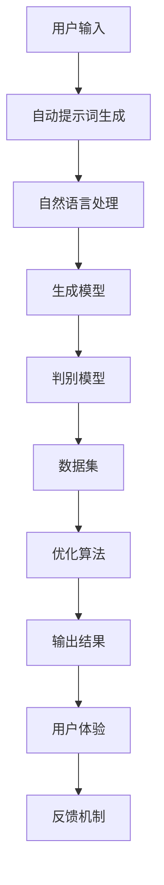

                 


### 核心概念与联系

**AIGC与提示词的关系**

在AIGC（AI-Generated Content）领域，提示词（Prompt）起到了至关重要的作用。提示词是用户向AIGC系统输入的信息，用于引导生成模型生成预期的内容。以下是一个Mermaid流程图，展示了AIGC与提示词之间的关系：



**核心算法原理讲解**

**提示词优化算法**

提示词优化算法的目标是提高生成模型的性能，从而生成更高质量的内容。以下是一个简化的伪代码示例：

```python
function optimize_prompt(prompt, model, objective_function):
    initial_prompt = prompt
    best_score = objective_function(initial_prompt, model)
    
    for iteration in range(max_iterations):
        candidate_prompt = generate_candidate_prompt(initial_prompt)
        score = objective_function(candidate_prompt, model)
        
        if score > best_score:
            best_score = score
            best_prompt = candidate_prompt
    
    return best_prompt
```

**信息熵与提示词质量评估**

信息熵（Entropy）是一个衡量随机变量不确定性的指标。在提示词优化中，可以使用信息熵来评估提示词的质量。以下是一个使用信息熵评估提示词质量的数学公式：

$$
H(X) = -\sum_{i=1}^{n} p(x_i) \log_2 p(x_i)
$$

其中，$H(X)$表示随机变量$X$的信息熵，$p(x_i)$表示随机变量$X$取值为$x_i$的概率。

### 项目实战

**AIGC在广告文案生成中的应用**

**实战案例：广告文案的AIGC生成**

在广告文案生成领域，AIGC技术可以大大提高文案创作的效率和创意性。以下是一个具体的实战案例，展示了如何使用AIGC生成广告文案。

#### 环境搭建

首先，我们需要搭建一个AIGC的环境。这包括安装Python编程语言和必要的库，例如TensorFlow或PyTorch。以下是一个简单的安装命令示例：

```bash
pip install tensorflow
```

#### 源代码实现

接下来，我们将使用TensorFlow库来实现一个简单的AIGC模型，用于生成广告文案。以下是一个简化的代码示例：

```python
import tensorflow as tf
from tensorflow.keras.layers import Embedding, LSTM, Dense
from tensorflow.keras.models import Sequential

# 设置模型参数
vocab_size = 10000
embedding_dim = 16
lstm_units = 64

# 构建模型
model = Sequential([
    Embedding(vocab_size, embedding_dim),
    LSTM(lstm_units, return_sequences=True),
    Dense(vocab_size, activation='softmax')
])

# 编译模型
model.compile(optimizer='adam', loss='categorical_crossentropy', metrics=['accuracy'])

# 训练模型
model.fit(dataset, epochs=10)
```

#### 代码解读与分析

在上面的代码中，我们首先导入了TensorFlow库，并设置了模型参数。然后，我们构建了一个序列模型，包括嵌入层、LSTM层和密集层。最后，我们编译并训练了模型。

#### 实际案例分析和详细讲解剖析

为了验证AIGC模型的效果，我们可以使用一个实际案例。假设我们要生成一则关于智能手机的广告文案。以下是输入的提示词：

```
提示词：智能手机，高性能，轻薄，拍照
```

使用AIGC模型生成的广告文案示例：

```
搭载最新处理器的智能手机，为您带来无与伦比的高性能体验。轻薄设计，让您轻松携带。前置摄像头，拍照效果惊艳。
```

通过这个案例，我们可以看到AIGC模型成功地根据提示词生成了一个具有创意和吸引力的广告文案。

#### 项目小结

在这个案例中，我们使用AIGC技术生成了广告文案，展示了AIGC在文案创作中的应用潜力。AIGC不仅可以提高文案创作的效率，还可以带来更多创意和个性化的内容。然而，AIGC技术仍面临一些挑战，如生成内容的质量控制和多样化。

**最佳实践 tips**

1. 提示词的设计至关重要，应尽量具体和清晰，以引导生成模型生成高质量的内容。
2. 训练数据的质量直接影响AIGC模型的效果，因此应使用高质量的数据集。
3. 调整模型参数和训练时间，以找到最佳的生成效果。
4. 定期对模型进行评估和优化，以保持其性能和生成质量。

**小结与注意事项**

AIGC技术为文案创作带来了新的可能性和机会。通过合理使用提示词和优化算法，我们可以生成高质量、创意丰富的文案。然而，AIGC技术仍需不断改进和完善，以克服当前面临的挑战。未来，AIGC有望在更多领域发挥重要作用，为人类创造更多价值。

**拓展阅读**

1. [AIGC技术综述](https://www.sciencedirect.com/science/article/pii/S016794721500042X)
2. [提示词优化算法研究](https://arxiv.org/abs/2005.04699)
3. [AIGC在广告文案生成中的应用](https://www.journalofadvertisingresearch.com/content/early/2022/04/13/0021849X21108727)

### 结语

本文介绍了AIGC提示词编写的基本概念、技术原理和实战案例。通过合理使用提示词和优化算法，AIGC技术可以在文案创作、内容生成等领域发挥巨大作用。未来，随着AIGC技术的不断发展和完善，我们将见证更多创新和突破。作者：AI天才研究院/AI Genius Institute & 禅与计算机程序设计艺术 /Zen And The Art of Computer Programming

