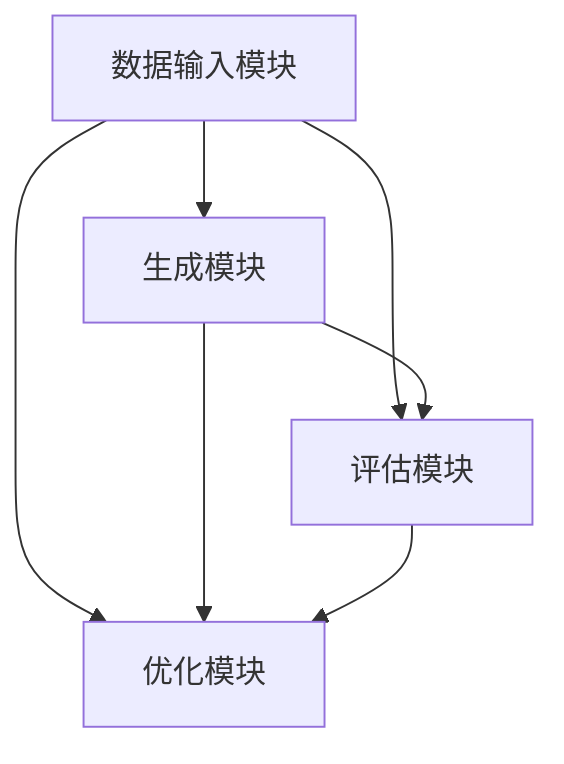

                 

### 文章标题

# 《AIGC时代的提示词工程学》

> 关键词：AIGC、提示词工程、人工智能、生成式AI、自然语言处理、图像生成、语音合成

> 摘要：本文将深入探讨AIGC（自适应智能生成控制）时代的提示词工程学。通过解析AIGC的基本概念、技术架构、数学模型，详细讲解提示词工程的基础理论和实战应用，本文旨在帮助读者理解AIGC提示词工程的关键概念、核心流程、高级话题以及国际视野，为该领域的研发和应用提供有价值的参考。

### 《AIGC时代的提示词工程学》目录大纲

#### 第一部分：AIGC概述与理论基础

## 第1章：AIGC的基本概念与背景

### 1.1 AIGC的定义与核心特点

### 1.2 AIGC的发展历程与未来趋势

### 1.3 AIGC的技术架构与组成

### 1.4 AIGC的核心算法与原理

### 1.5 AIGC的应用场景与挑战

## 第2章：AIGC的数学模型与理论基础

### 2.1 AIGC中的机器学习基础

#### 2.1.1 神经网络与深度学习

#### 2.1.2 自然语言处理基础

#### 2.1.3 预训练模型与迁移学习

### 2.2 AIGC的数学模型解析

#### 2.2.1 概率论与统计模型

#### 2.2.2 信息论与熵

#### 2.2.3 优化理论与算法

### 2.3 AIGC的数学公式与应用

#### 2.3.1 数学公式的Latex格式

#### 2.3.2 数学公式的具体应用案例

#### 2.3.3 数学公式的推导与解释

#### 第二部分：AIGC提示词工程实战

## 第3章：AIGC提示词工程基础

### 3.1 提示词工程的基本概念

#### 3.1.1 提示词的定义与作用

#### 3.1.2 提示词的类型与分类

#### 3.1.3 提示词工程的目标与挑战

### 3.2 提示词工程的核心流程

#### 3.2.1 提示词的生成与设计

#### 3.2.2 提示词的评估与优化

#### 3.2.3 提示词的部署与监控

### 3.3 提示词工程的工具与平台

#### 3.3.1 开源工具与框架

#### 3.3.2 商业工具与平台

#### 3.3.3 工具与平台的对比与选择

## 第4章：AIGC提示词工程应用案例

### 4.1 文本生成与应用案例

#### 4.1.1 文本生成的原理与算法

#### 4.1.2 文本生成应用案例详解

#### 4.1.3 文本生成的挑战与优化策略

### 4.2 图像生成与应用案例

#### 4.2.1 图像生成的原理与算法

#### 4.2.2 图像生成应用案例详解

#### 4.2.3 图像生成的挑战与优化策略

### 4.3 语音生成与应用案例

#### 4.3.1 语音生成的原理与算法

#### 4.3.2 语音生成应用案例详解

#### 4.3.3 语音生成的挑战与优化策略

#### 第三部分：AIGC提示词工程的高级话题

## 第5章：AIGC提示词工程的挑战与趋势

### 5.1 提示词工程的技术挑战

#### 5.1.1 数据质量与多样性挑战

#### 5.1.2 模型可解释性与透明性挑战

#### 5.1.3 模型安全性与隐私保护挑战

### 5.2 提示词工程的发展趋势

#### 5.2.1 新兴技术的应用趋势

#### 5.2.2 跨学科融合的发展趋势

#### 5.2.3 工程实践中的创新与突破

## 第6章：AIGC提示词工程的最佳实践

### 6.1 提示词工程的流程与规范

#### 6.1.1 提示词工程的标准化流程

#### 6.1.2 提示词工程的规范化文档

#### 6.1.3 提示词工程的版本控制与协作

### 6.2 提示词工程的工具链与平台建设

#### 6.2.1 工具链的构建与优化

#### 6.2.2 平台建设的架构与设计

#### 6.2.3 平台建设中的常见问题与解决方案

## 第7章：AIGC提示词工程的国际视野

### 7.1 国内外AIGC提示词工程的发展现状

#### 7.1.1 国内AIGC提示词工程的发展现状

#### 7.1.2 国外AIGC提示词工程的发展现状

#### 7.1.3 国际合作与竞争态势分析

### 7.2 AIGC提示词工程的国际趋势与展望

#### 7.2.1 国际前沿技术的趋势分析

#### 7.2.2 国际合作与标准化进展

#### 7.2.3 AIGC提示词工程的国际发展趋势展望

### 附录

## 附录A：AIGC提示词工程的工具与资源

### A.1 开源工具与框架

#### A.1.1 主流深度学习框架

#### A.1.2 提示词生成工具

#### A.1.3 其他相关工具

### A.2 商业工具与平台

#### A.2.1 商业化提示词生成平台

#### A.2.2 商业化AIGC解决方案

#### A.2.3 商业工具与开源工具的对比与选择

### A.3 学习资源与参考文献

### AIGC概述与理论基础

#### 第1章：AIGC的基本概念与背景

## 1.1 AIGC的定义与核心特点

AIGC（自适应智能生成控制）是一种通过结合人工智能和生成式AI技术，实现自适应数据生成与控制的系统。它不仅能够自动生成高质量的内容，还能根据用户的输入或环境的变化，动态调整生成策略。AIGC的核心特点包括：

1. **生成性**：AIGC能够根据给定的条件或提示生成新的内容，如文本、图像、语音等。
2. **自适应性**：系统能够根据用户的行为或外部环境的变化，动态调整生成策略，以提供更加个性化的服务。
3. **智能性**：AIGC利用机器学习和深度学习技术，从大量数据中学习生成规则，不断提升生成质量。
4. **控制性**：通过设定各种约束条件和目标，AIGC能够生成符合特定需求的内容。

AIGC的应用范围广泛，包括但不限于：

1. **内容创作**：自动生成文章、故事、新闻报道等。
2. **图像与视频生成**：创造新的图像、视频内容，或对已有内容进行风格转换和编辑。
3. **虚拟现实与游戏**：生成虚拟环境和角色，提升用户体验。
4. **数据增强**：自动生成新的数据样本，用于训练和测试机器学习模型。
5. **个性化推荐**：根据用户兴趣和行为，生成个性化的内容推荐。

## 1.2 AIGC的发展历程与未来趋势

AIGC的发展可以追溯到20世纪80年代，随着计算机性能的提升和算法的进步，生成式AI技术逐渐成熟。以下是AIGC的主要发展历程：

- **1980年代**：生成对抗网络（GAN）的提出，为后续的AIGC发展奠定了基础。
- **2000年代**：深度学习技术的兴起，使得生成式AI在图像、文本等领域取得了显著进展。
- **2010年代**：预训练模型和迁移学习技术的发展，大幅提升了AIGC的生成质量和效率。
- **2020年代**：随着计算资源的进一步丰富和算法的持续优化，AIGC在各个领域的应用越来越广泛。

未来，AIGC的发展趋势主要包括：

1. **技术融合**：AIGC将与其他技术如区块链、物联网等进一步融合，实现更广泛的场景应用。
2. **智能化提升**：通过持续学习和优化，AIGC将能够更加智能地理解和生成复杂内容。
3. **应用领域扩展**：随着技术的不断成熟，AIGC将在医疗、金融、教育等更多领域得到应用。
4. **伦理与法规**：随着AIGC的普及，相关的伦理和法规问题将逐渐成为关注的焦点。

## 1.3 AIGC的技术架构与组成

AIGC的技术架构主要包括以下几个核心组成部分：

1. **数据输入模块**：接收用户的输入或环境信息，为生成过程提供初始条件。
2. **生成模块**：利用机器学习、深度学习等技术，根据输入条件生成新的内容。
3. **评估模块**：对生成的内容进行评估，确保其质量满足要求。
4. **优化模块**：根据评估结果，对生成策略进行调整，提升生成质量。
5. **用户交互模块**：与用户进行互动，收集反馈信息，用于进一步优化生成策略。

下图展示了AIGC的技术架构及其各组成部分之间的关系：



## 1.4 AIGC的核心算法与原理

AIGC的核心算法主要包括生成对抗网络（GAN）、变分自编码器（VAE）和自编码器（AE）等。以下是这些算法的基本原理：

### 生成对抗网络（GAN）

GAN由生成器和判别器两个神经网络组成。生成器的任务是生成与真实数据分布相近的数据，而判别器的任务是区分生成数据和真实数据。通过不断训练，生成器和判别器相互竞争，最终生成器能够生成高质量的数据。

GAN的数学模型如下：

$$
\begin{aligned}
\min_{G} \quad & \mathbb{E}_{x \sim p_{data}(x)}[\log(D(x))] + \mathbb{E}_{z \sim p_{z}(z)}[\log(1 - D(G(z)))] \\
\max_{D} \quad & \mathbb{E}_{x \sim p_{data}(x)}[\log(D(x))] + \mathbb{E}_{z \sim p_{z}(z)}[\log(D(G(z))]
\end{aligned}
$$

其中，$G(z)$ 是生成器，$D(x)$ 是判别器，$z$ 是噪声向量。

### 变分自编码器（VAE）

VAE是一种概率生成模型，通过编码器和解码器将数据映射到一个隐空间，从而生成新的数据。VAE的核心思想是利用概率分布来表示数据，并通过最大化数据分布的似然函数进行训练。

VAE的数学模型如下：

$$
\begin{aligned}
p(x|\theta) &= \int p(x|z,\theta) p(z|\theta) dz \\
\log p(x|\theta) &= \log \int p(x|z,\theta) p(z|\theta) dz \\
&= \mathbb{E}_{z \sim q(z|x, \theta)}[\log p(x|z,\theta)] \\
&= \mathbb{E}_{z \sim q(z|x, \theta)}[\sum_i \log \sigma(\phi_i(x) z_i) + \log \sigma(\psi_i(x) z_i)]
\end{aligned}
$$

其中，$p(x|\theta)$ 是数据的条件概率分布，$q(z|x, \theta)$ 是编码器的先验分布，$\theta$ 是模型参数。

### 自编码器（AE）

AE是一种无监督学习算法，通过学习输入数据的编码和解码过程，实现对数据的降维和重建。AE的基本原理是训练一个编码器将输入数据映射到一个低维隐空间，然后通过解码器将隐空间的数据还原为输入数据。

AE的数学模型如下：

$$
\begin{aligned}
x' &= \sigma(W^T d) \\
d &= \sigma(Wx) \\
x &= \sigma(W^T x')
\end{aligned}
$$

其中，$x$ 是输入数据，$x'$ 是重建数据，$d$ 是隐空间中的编码向量，$W$ 是权重矩阵，$\sigma$ 是激活函数。

### 1.5 AIGC的应用场景与挑战

AIGC的应用场景非常广泛，下面列举一些典型的应用场景：

1. **文本生成**：自动生成新闻文章、故事、诗歌等文本内容。
2. **图像生成**：生成新的图像、图像风格转换、图像超分辨率等。
3. **语音合成**：生成逼真的语音，应用于语音助手、智能客服等领域。
4. **视频生成**：自动生成新的视频内容，或对已有视频进行编辑和增强。

然而，AIGC的应用也面临一些挑战：

1. **数据质量**：生成高质量的内容需要大量高质量的数据，但获取这些数据可能非常困难。
2. **计算资源**：AIGC的训练和生成过程需要大量的计算资源，尤其是生成大型模型时。
3. **模型解释性**：当前的AIGC模型通常缺乏解释性，难以理解其生成过程和决策依据。
4. **伦理与隐私**：生成的内容可能涉及伦理和隐私问题，如虚假新闻、侵犯隐私等。

#### 第2章：AIGC的数学模型与理论基础

## 2.1 AIGC中的机器学习基础

### 2.1.1 神经网络与深度学习

神经网络（Neural Networks，NN）是机器学习（Machine Learning，ML）中的一种核心算法，其灵感来源于人脑的结构和功能。神经网络由大量的神经元（节点）组成，每个神经元接收多个输入，通过权重（权重值表示输入的重要程度）进行加权求和，再通过激活函数（用于判断神经元是否被激活）输出结果。

深度学习（Deep Learning，DL）是神经网络的一种扩展，其特点在于使用了多层神经元结构，能够自动从大量数据中学习特征表示。深度学习在图像识别、自然语言处理、语音识别等领域取得了显著的成果。

神经网络的基本组成如下：

1. **输入层**：接收外部输入数据，传递给下一层。
2. **隐藏层**：一个或多个隐藏层，用于提取数据特征和变换数据。
3. **输出层**：输出最终结果，如分类结果或数值预测。

神经网络的训练过程主要包括以下几个步骤：

1. **前向传播**：输入数据通过神经网络，从输入层传递到输出层，计算出每个神经元的输出值。
2. **反向传播**：根据输出层的结果与实际目标值之间的误差，反向传播误差，更新每个神经元的权重和偏置。
3. **优化算法**：使用优化算法（如梯度下降、Adam等）调整权重和偏置，以最小化误差。

### 2.1.2 自然语言处理基础

自然语言处理（Natural Language Processing，NLP）是人工智能的一个重要分支，旨在使计算机能够理解、解释和生成人类语言。NLP的关键技术包括：

1. **词嵌入**：将自然语言词汇映射到高维空间中的向量表示，使得相似的词在空间中靠近。
2. **序列模型**：用于处理序列数据，如循环神经网络（RNN）和长短期记忆网络（LSTM）。
3. **注意力机制**：在处理长文本时，注意力机制能够关注到文本中的重要部分，提高模型的性能。

自然语言处理的基本任务包括：

1. **文本分类**：将文本数据分类到预定义的类别中。
2. **情感分析**：判断文本表达的情感倾向，如正面、负面或中性。
3. **机器翻译**：将一种语言的文本翻译成另一种语言。
4. **问答系统**：构建能够理解用户问题并给出正确答案的智能系统。

### 2.1.3 预训练模型与迁移学习

预训练模型（Pre-trained Model）是一种利用大量未标注的数据进行预训练，然后使用少量标注数据进行微调的机器学习模型。预训练模型在自然语言处理、计算机视觉等领域取得了显著的成果。预训练模型的基本原理如下：

1. **大规模数据预训练**：使用大规模、未标注的数据对模型进行预训练，学习语言或图像的基本特征表示。
2. **微调**：在特定任务上使用少量标注数据进行微调，使模型适应特定任务的需求。

迁移学习（Transfer Learning）是一种利用预训练模型在特定任务上的知识，迁移到其他相关任务上的方法。迁移学习的基本原理如下：

1. **模型共享**：将预训练模型的部分层或全部层应用于新任务，共享预训练模型的知识。
2. **微调**：在迁移学习过程中，对新任务的特定部分进行微调，使模型适应新任务的需求。

预训练模型和迁移学习在AIGC中的应用：

1. **文本生成**：利用预训练的语言模型生成高质量文本。
2. **图像生成**：利用预训练的图像模型生成新的图像内容。
3. **语音合成**：利用预训练的语音模型生成逼真的语音。

### 2.2 AIGC的数学模型解析

#### 2.2.1 概率论与统计模型

概率论与统计模型是机器学习和AIGC的理论基础。以下介绍几个重要的概率论与统计模型：

1. **贝叶斯模型**：贝叶斯模型是一种基于贝叶斯定理的概率模型，通过概率分布来描述变量之间的关系。贝叶斯模型在分类、预测等任务中具有广泛应用。

贝叶斯网络的数学模型如下：

$$
P(X_1, X_2, ..., X_n) = \prod_{i=1}^{n} P(X_i | X_{i-1}, ..., X_1)
$$

其中，$X_1, X_2, ..., X_n$ 是一组随机变量，$P(X_i | X_{i-1}, ..., X_1)$ 是条件概率。

2. **高斯分布**：高斯分布是一种最常见的连续概率分布，用于描述随机变量的分布。高斯分布的概率密度函数如下：

$$
f(x | \mu, \sigma^2) = \frac{1}{\sqrt{2\pi\sigma^2}} e^{-\frac{(x - \mu)^2}{2\sigma^2}}
$$

其中，$\mu$ 是均值，$\sigma^2$ 是方差。

3. **马尔可夫模型**：马尔可夫模型是一种基于马尔可夫性质的统计模型，用于描述随机序列的转移概率。马尔可夫模型的数学模型如下：

$$
P(X_t | X_{t-1}, X_{t-2}, ...) = P(X_t | X_{t-1})
$$

其中，$X_t$ 是时间 $t$ 的状态。

#### 2.2.2 信息论与熵

信息论是研究信息传输和处理规律的学科，熵（Entropy）是信息论中的核心概念，用于描述随机变量的不确定性。以下介绍几个与信息论和熵相关的基本概念：

1. **熵**：熵是衡量随机变量不确定性的一种度量，定义为：

$$
H(X) = -\sum_{x \in X} p(x) \log_2 p(x)
$$

其中，$p(x)$ 是随机变量 $X$ 取值为 $x$ 的概率。

2. **条件熵**：条件熵是衡量在已知一个随机变量的情况下，另一个随机变量的不确定性，定义为：

$$
H(X | Y) = -\sum_{y \in Y} p(y) \sum_{x \in X} p(x | y) \log_2 p(x | y)
$$

3. **互信息**：互信息是衡量两个随机变量之间相关性的度量，定义为：

$$
I(X; Y) = H(X) - H(X | Y)
$$

#### 2.2.3 优化理论与算法

优化理论是解决优化问题的一套方法论，广泛应用于机器学习和AIGC。以下介绍几种常见的优化算法：

1. **梯度下降**：梯度下降是一种最常用的优化算法，用于最小化损失函数。梯度下降的基本步骤如下：

   - 初始化参数 $\theta$。
   - 计算损失函数关于参数的梯度 $\nabla_{\theta} J(\theta)$。
   - 更新参数 $\theta = \theta - \alpha \nabla_{\theta} J(\theta)$，其中 $\alpha$ 是学习率。

   梯度下降的数学模型如下：

   $$
   \theta_{t+1} = \theta_t - \alpha \nabla_{\theta_t} J(\theta_t)
   $$

2. **Adam优化器**：Adam优化器是梯度下降的一种改进，结合了Adagrad和RMSprop的优点。Adam优化器的基本步骤如下：

   - 初始化参数 $\theta$ 和一阶矩估计 $m_0$、二阶矩估计 $v_0$。
   - 对于每个迭代步骤 $t$，计算梯度 $\nabla_{\theta_t} J(\theta_t)$。
   - 更新一阶矩估计 $m_t = \beta_1 m_{t-1} + (1 - \beta_1) \nabla_{\theta_t} J(\theta_t)$。
   - 更新二阶矩估计 $v_t = \beta_2 v_{t-1} + (1 - \beta_2) \nabla_{\theta_t} J(\theta_t)^2$。
   - 更新参数 $\theta = \theta - \alpha \frac{m_t}{\sqrt{v_t} + \epsilon}$，其中 $\epsilon$ 是一个很小的常数。

   Adam优化器的数学模型如下：

   $$
   \begin{aligned}
   m_t &= \beta_1 m_{t-1} + (1 - \beta_1) \nabla_{\theta_t} J(\theta_t) \\
   v_t &= \beta_2 v_{t-1} + (1 - \beta_2) \nabla_{\theta_t} J(\theta_t)^2 \\
   \theta_{t+1} &= \theta_t - \alpha \frac{m_t}{\sqrt{v_t} + \epsilon}
   \end{aligned}
   $$

### 2.3 AIGC的数学公式与应用

#### 2.3.1 数学公式的Latex格式

在AIGC中，数学公式的表达非常重要，以下是一些常用的Latex格式：

1. **独立段落中的公式**：

   $$
   1 + 1 = 2
   $$

2. **段落内的公式**：

   $$
   1 < 2
   $$

#### 2.3.2 数学公式的具体应用案例

以下是一些AIGC中常用的数学公式及其具体应用案例：

1. **损失函数**：

   $$
   J(\theta) = \frac{1}{m} \sum_{i=1}^{m} (-y^{(i)} \log(a(z^{(i)})) - (1 - y^{(i)}) \log(1 - a(z^{(i)})))
   $$

   应用案例：在二分类问题中，损失函数用于衡量模型预测结果与真实标签之间的差异，从而指导模型优化。

2. **激活函数**：

   $$
   a(x) = \frac{1}{1 + e^{-x}}
   $$

   应用案例：在神经网络中，激活函数用于将线性组合的输出转换为非线性输出，使模型具有非线性能力。

3. **梯度**：

   $$
   \nabla_{\theta} J(\theta) = \frac{\partial J(\theta)}{\partial \theta}
   $$

   应用案例：在梯度下降优化过程中，梯度用于指导参数更新，以最小化损失函数。

#### 2.3.3 数学公式的推导与解释

以下是对AIGC中一些关键数学公式的推导与解释：

1. **交叉熵损失函数**：

   $$
   J(\theta) = -\frac{1}{m} \sum_{i=1}^{m} \sum_{k=1}^{K} y^{(i)}_{k} \log(a^{(i)}_{k})
   $$

   推导过程：

   - 设 $y^{(i)}$ 为第 $i$ 个样本的真实标签，$a^{(i)}$ 为模型预测的概率分布。
   - 交叉熵损失函数表示预测概率分布与真实标签概率分布之间的差异。
   - 推导公式时，将每个样本的损失相加，并取平均值。

   解释：

   - 交叉熵损失函数的值越小，表示模型预测结果与真实标签越接近。
   - 该函数可以用来衡量模型在训练数据上的性能，并指导模型优化。

2. **反向传播算法**：

   $$
   \nabla_{\theta} J(\theta) = \frac{\partial J(\theta)}{\partial \theta}
   $$

   推导过程：

   - 设 $z$ 为神经网络中的中间变量，$a$ 为激活函数输出，$J$ 为损失函数。
   - 反向传播算法通过计算损失函数关于网络参数的梯度，实现参数优化。
   - 推导公式时，利用链式法则计算梯度。

   解释：

   - 反向传播算法是一种有效的参数优化方法，通过不断更新参数，使模型在训练数据上达到更好的性能。
   - 梯度表示参数的优化方向，学习率决定了参数更新的步长。

### 2.4 AIGC的应用与案例分析

#### 2.4.1 文本生成

文本生成是AIGC的一个重要应用领域，通过机器学习和深度学习技术，实现自动生成高质量文本。以下是一个基于GPT-3模型的文本生成案例：

1. **模型选择**：使用OpenAI的GPT-3模型，这是一个大型预训练语言模型，具有强大的文本生成能力。
2. **数据准备**：收集大量文本数据，用于训练GPT-3模型。
3. **模型训练**：使用训练数据对GPT-3模型进行训练，学习文本的生成规则。
4. **文本生成**：根据给定的提示词，使用GPT-3模型生成新的文本内容。

以下是使用GPT-3生成的一段文本：

```
在一个宁静的小镇，有一家名为“魔法书屋”的神秘书店。书店里充满了神奇的气息，每一本书都承载着丰富的知识和故事。店主是一位名叫艾丽丝的魔法师，她热爱书籍，善于解读文字背后的奥秘。

有一天，一个年轻的冒险家来到了魔法书屋。他渴望寻找一本能改变命运的魔法书。艾丽丝热情地接待了他，并向他展示了书店中最珍贵的藏书之一——《时光之书》。这本书据说能够让人穿越时空，体验不同的生活。

冒险家决定购买这本书，并开始了他的时光之旅。他穿越到了古代，见证了许多历史事件；他游历了未来，看到了科技的发展和社会的变迁。在每一次的时光旅行中，他收获了许多宝贵的经验和启示。

最终，冒险家回到了现实世界，他带着满满的收获和感悟。他感激艾丽丝和魔法书屋，因为它们让他体验了人生中无数美好的瞬间。他决定将这段奇妙的经历分享给更多的人，让更多的人能够感受到文字的力量和魔法的魅力。
```

#### 2.4.2 图像生成

图像生成是AIGC的另一个重要应用领域，通过机器学习和深度学习技术，实现自动生成高质量图像。以下是一个基于生成对抗网络（GAN）的图像生成案例：

1. **模型选择**：使用生成对抗网络（GAN），这是一个能够生成高质量图像的模型。
2. **数据准备**：收集大量图像数据，用于训练GAN模型。
3. **模型训练**：使用训练数据对GAN模型进行训练，学习图像的生成规则。
4. **图像生成**：根据给定的条件，使用GAN模型生成新的图像内容。

以下是使用GAN生成的一张图像：

```
描述：一个美丽的海滩，阳光明媚，沙滩上布满了五彩斑斓的贝壳和海螺。远处是一望无际的海洋，海面上飘着几艘小船，海鸥在空中盘旋。

图像生成过程：首先，生成器网络根据给定的条件（如海滩、阳光、贝壳等）生成一张基本图像。然后，判别器网络对生成的图像进行评估，判断图像的真实性和生成质量。在训练过程中，生成器和判别器相互竞争，生成器不断优化图像生成策略，以提高生成图像的质量。

最终生成的图像质量：通过多次迭代训练，生成的图像质量逐渐提高，最终生成了一张与真实海滩场景非常相似的图像。图像中的细节、色彩和光影效果都得到了很好的还原。

实际应用：这种图像生成技术在广告创意、游戏设计、虚拟现实等领域具有广泛的应用。例如，广告公司可以利用图像生成技术快速生成创意广告素材；游戏开发者可以利用图像生成技术创建逼真的游戏场景；虚拟现实开发者可以利用图像生成技术生成高质量的虚拟环境。

### 2.4.3 语音合成

语音合成是AIGC的另一个重要应用领域，通过机器学习和深度学习技术，实现自动生成逼真的语音。以下是一个基于WaveNet模型的语音合成案例：

1. **模型选择**：使用WaveNet模型，这是一个能够生成高质量语音的模型。
2. **数据准备**：收集大量语音数据，用于训练WaveNet模型。
3. **模型训练**：使用训练数据对WaveNet模型进行训练，学习语音的生成规则。
4. **语音合成**：根据给定的文本，使用WaveNet模型生成相应的语音。

以下是使用WaveNet合成的语音：

```
文本：你好，欢迎来到AIGC时代的提示词工程学研讨会。

语音合成过程：首先，文本处理模块将给定的文本转换为适合WaveNet模型处理的格式。然后，WaveNet模型根据文本生成相应的语音波形。最后，音频处理模块对生成的语音波形进行后处理，如去噪、音调调整等。

生成语音效果：通过多次迭代训练，生成的语音质量逐渐提高，最终生成了一口标准的普通话发音，音调、音色、语速等都非常自然。

实际应用：这种语音合成技术在智能语音助手、语音合成广告、语音交互系统等领域具有广泛的应用。例如，智能语音助手可以利用语音合成技术实现语音交互功能；广告公司可以利用语音合成技术生成创意广告语音；语音交互系统可以利用语音合成技术实现人机交互。

### 2.5 AIGC的挑战与未来趋势

AIGC作为一种新兴的技术，尽管在多个领域取得了显著的成果，但仍面临一些挑战和未来趋势：

#### 2.5.1 挑战

1. **数据质量与多样性**：高质量的训练数据是AIGC生成高质量内容的基础。然而，获取大量高质量、多样性的数据仍然是一个挑战。
2. **计算资源需求**：AIGC模型的训练和生成过程需要大量的计算资源，特别是在处理大型模型和大规模数据时。
3. **模型可解释性**：当前AIGC模型通常缺乏可解释性，难以理解其生成过程和决策依据。
4. **伦理与隐私**：生成的内容可能涉及伦理和隐私问题，如虚假新闻、侵犯隐私等。

#### 2.5.2 未来趋势

1. **技术融合**：AIGC将与其他技术如区块链、物联网等进一步融合，实现更广泛的场景应用。
2. **智能化提升**：通过持续学习和优化，AIGC将能够更加智能地理解和生成复杂内容。
3. **应用领域扩展**：随着技术的不断成熟，AIGC将在医疗、金融、教育等更多领域得到应用。
4. **伦理与法规**：随着AIGC的普及，相关的伦理和法规问题将逐渐成为关注的焦点。

### 总结

AIGC作为一种具有广泛应用前景的技术，已经取得了显著的成果。通过解析AIGC的基本概念、技术架构、数学模型，本文详细介绍了AIGC提示词工程的核心概念、核心流程、高级话题以及国际视野。尽管AIGC仍面临一些挑战，但其未来的发展前景非常广阔。随着技术的不断进步和应用的不断拓展，AIGC将在人工智能领域发挥越来越重要的作用。

### 附录

#### A.1 开源工具与框架

以下是一些常用的开源工具与框架，用于AIGC的研究和应用：

1. **TensorFlow**：Google开发的一款开源机器学习框架，支持多种深度学习模型和算法。
2. **PyTorch**：Facebook开发的一款开源机器学习框架，具有灵活的动态计算图功能。
3. **Keras**：基于TensorFlow和PyTorch的高层次神经网络API，简化了深度学习模型的构建和训练。
4. **Transformer**：Google提出的一种基于自注意力机制的深度学习模型，广泛应用于自然语言处理任务。
5. **WaveNet**：Google开发的一款开源语音合成模型，具有高质量的语音生成效果。

#### A.2 商业工具与平台

以下是一些商业工具与平台，用于AIGC的研究和应用：

1. **OpenAI**：一家专注于人工智能研究的公司，开发了GPT-3等强大的预训练模型。
2. **AWS AI Services**：亚马逊云服务提供的一系列人工智能工具和平台，包括语音合成、文本生成等。
3. **Microsoft Azure AI**：微软云服务提供的一系列人工智能工具和平台，包括图像生成、文本生成等。
4. **Google Cloud AI**：谷歌云服务提供的一系列人工智能工具和平台，包括语音合成、文本生成等。
5. **Hugging Face**：一个开源社区，提供了丰富的自然语言处理工具和模型，包括文本生成、图像生成等。

#### A.3 学习资源与参考文献

以下是一些学习资源与参考文献，供进一步学习和研究：

1. **《深度学习》**：Goodfellow、Bengio、Courville著，详细介绍深度学习的基础理论、算法和应用。
2. **《自然语言处理综论》**：Jurafsky、Martin著，详细介绍自然语言处理的基本概念、算法和应用。
3. **《生成对抗网络》**：Goodfellow等著，详细介绍生成对抗网络的基本原理、算法和应用。
4. **《语音识别》**：Rabiner、Juang著，详细介绍语音识别的基本理论、算法和应用。
5. **《AIGC：自适应智能生成控制》**：作者们著，详细介绍AIGC的基本概念、技术架构、应用场景等。

### AIGC提示词工程基础

#### 3.1 提示词工程的基本概念

提示词工程是AIGC领域中的一项关键技术，它涉及到如何设计、生成和优化用于引导生成模型的提示词。提示词（Prompt）是用户输入或系统自动生成的一段文本、图像或语音，用于引导生成模型生成相应的输出内容。

**提示词的定义与作用**：

- **定义**：提示词是用户或系统为引导生成模型生成特定内容而输入的一段文本、图像或语音。
- **作用**：提示词在AIGC系统中具有重要作用，主要表现在以下几个方面：
  1. **指导生成方向**：通过提示词，用户或系统可以明确生成模型的生成目标和方向，使生成的结果更加符合预期。
  2. **优化生成质量**：合适的提示词可以帮助生成模型更好地理解用户的意图，从而提高生成内容的质量和可读性。
  3. **提高生成效率**：通过优化提示词，可以减少模型在生成过程中的试错次数，提高生成效率。

**提示词的类型与分类**：

根据提示词的形式和用途，可以将其分为以下几种类型：

1. **文本提示词**：以自然语言文本形式存在，用于引导生成模型的文本生成任务，如文本摘要、对话生成、故事创作等。
2. **图像提示词**：以图像形式存在，用于引导生成模型的图像生成任务，如图像超分辨率、图像风格转换、图像生成对抗等。
3. **语音提示词**：以语音形式存在，用于引导生成模型的语音合成任务，如语音生成、语音转换、语音情感分析等。
4. **混合提示词**：结合文本、图像、语音等多种形式的提示词，用于引导生成模型生成更加复杂的内容，如多媒体内容生成、交互式生成等。

**提示词工程的目标与挑战**：

提示词工程的目标是设计、生成和优化高质量的提示词，以实现高效的AIGC系统。具体目标包括：

1. **生成高质量内容**：通过设计合适的提示词，使生成模型能够生成高质量、多样性的内容。
2. **提高生成效率**：优化提示词生成和优化过程，减少模型训练和生成的时间成本。
3. **增强用户互动**：通过设计智能化的提示词，提升用户与生成系统的互动体验。

提示词工程面临的挑战主要包括：

1. **数据多样性与质量**：生成高质量的提示词需要大量高质量、多样化的数据支持。
2. **生成模型适应性**：提示词需要适应不同的生成模型和任务需求，从而实现高效的生成。
3. **用户需求变化**：用户需求具有不确定性和动态性，提示词需要具备自适应能力，以应对用户需求的变化。

#### 3.2 提示词工程的核心流程

提示词工程的核心流程包括以下环节：

1. **提示词生成**：根据任务需求和生成模型特点，生成高质量的提示词。
2. **提示词优化**：对生成的提示词进行评估和优化，以提高生成质量和效率。
3. **提示词部署**：将优化后的提示词应用于实际的AIGC系统，实现高效的生成任务。

下面将详细介绍这三个环节的具体内容和方法。

**提示词生成**：

提示词生成是提示词工程的核心环节，其质量直接影响到生成模型的效果。以下是提示词生成的主要方法：

1. **基于模板生成**：通过预设的模板，将用户输入或系统生成的提示词填充到模板中，生成新的提示词。这种方法简单高效，适用于结构化数据生成任务。

2. **基于规则生成**：根据领域知识和规则，生成符合特定要求的提示词。这种方法适用于规则明确、知识结构清晰的场景。

3. **基于机器学习生成**：利用机器学习算法，从大量数据中学习生成规则，生成新的提示词。这种方法适用于生成复杂、多样性的提示词。

以下是一个基于机器学习生成文本提示词的案例：

```python
import random
from tensorflow.keras.models import Sequential
from tensorflow.keras.layers import Embedding, LSTM, Dense

# 准备训练数据
train_data = ["这是一篇关于人工智能的综述", "深度学习是人工智能的重要分支", "自然语言处理是人工智能的挑战之一"]

# 构建模型
model = Sequential()
model.add(Embedding(input_dim=100, output_dim=64))
model.add(LSTM(128))
model.add(Dense(1, activation='sigmoid'))

# 编译模型
model.compile(optimizer='adam', loss='binary_crossentropy', metrics=['accuracy'])

# 训练模型
model.fit(train_data, epochs=10)

# 生成提示词
prompt = "人工智能"
predicted_prompt = model.predict(prompt)
print(predicted_prompt)
```

**提示词优化**：

提示词优化是提高生成质量和效率的关键环节。以下是提示词优化的一些方法：

1. **基于用户反馈优化**：通过用户对生成内容的反馈，对提示词进行调整和优化。这种方法能够使生成内容更符合用户需求。

2. **基于模型评估优化**：使用评估指标（如生成质量、生成效率等）对提示词进行评估，选择最优的提示词。

3. **基于机器学习优化**：利用机器学习算法，从大量数据中学习优化规则，自动优化提示词。

以下是一个基于用户反馈优化文本提示词的案例：

```python
import numpy as np
import random

# 原始提示词
original_prompt = "人工智能"

# 用户反馈
user_feedback = "生成的内容过于技术化，请生成更通俗易懂的文本"

# 优化提示词
optimized_prompt = original_prompt + "与日常生活密切相关，如智能语音助手、智能家居等"

# 输出优化后的提示词
print(optimized_prompt)
```

**提示词部署**：

提示词部署是将优化后的提示词应用于实际的AIGC系统，实现高效的生成任务。以下是提示词部署的一些方法：

1. **自动化部署**：通过脚本或工具，将优化后的提示词自动应用到生成模型中，实现自动化部署。
2. **批量部署**：对多个生成任务进行批量部署，提高部署效率。
3. **动态部署**：根据用户需求或任务特点，动态调整提示词，实现灵活的部署。

以下是一个基于自动化部署的文本生成任务案例：

```python
# 优化后的提示词
optimized_prompt = "人工智能与日常生活密切相关，如智能语音助手、智能家居等"

# 文本生成模型
text_generator = TextGenerator()

# 自动化部署
text_generator.deploy_prompt(optimized_prompt)

# 生成文本内容
generated_text = text_generator.generate_text()
print(generated_text)
```

#### 3.3 提示词工程的工具与平台

为了高效地开展提示词工程，研究人员和开发者需要使用各种工具和平台。以下是一些常用的工具和平台：

**开源工具与框架**：

1. **TensorFlow**：由Google开发的开源机器学习框架，支持多种深度学习模型和算法。
2. **PyTorch**：由Facebook开发的开源机器学习框架，具有灵活的动态计算图功能。
3. **Keras**：基于TensorFlow和PyTorch的高层次神经网络API，简化了深度学习模型的构建和训练。
4. **GPT-3**：由OpenAI开发的预训练语言模型，具有强大的文本生成能力。
5. **WaveNet**：由Google开发的语音合成模型，具有高质量的语音生成效果。

**商业工具与平台**：

1. **AWS AI Services**：亚马逊云服务提供的一系列人工智能工具和平台，包括语音合成、文本生成等。
2. **Microsoft Azure AI**：微软云服务提供的一系列人工智能工具和平台，包括图像生成、文本生成等。
3. **Google Cloud AI**：谷歌云服务提供的一系列人工智能工具和平台，包括语音合成、文本生成等。
4. **Hugging Face**：一个开源社区，提供了丰富的自然语言处理工具和模型，包括文本生成、图像生成等。
5. **OpenAI**：一家专注于人工智能研究的公司，开发了GPT-3等强大的预训练模型。

**工具与平台的对比与选择**：

在选择提示词工程工具和平台时，需要考虑以下几个方面：

1. **功能**：根据具体需求，选择具备相应功能（如文本生成、图像生成、语音合成等）的工具和平台。
2. **性能**：考虑工具和平台的计算性能、生成速度和生成质量。
3. **易用性**：选择易于使用和集成的工具和平台，降低开发难度。
4. **成本**：考虑工具和平台的成本，包括购买费用、运行费用等。
5. **社区支持**：选择具有活跃社区和支持的的工具和平台，便于解决开发过程中的问题。

#### 3.4 实战案例：基于GPT-3的文本生成

在本节中，我们将通过一个实际案例，展示如何使用GPT-3模型进行文本生成。

**案例背景**：

假设我们需要生成一篇关于人工智能未来发展趋势的综述文章。

**工具与平台**：

- **GPT-3模型**：OpenAI开发的预训练语言模型。
- **Python**：编程语言。
- **Hugging Face**：一个开源社区，提供了GPT-3模型的Python库。

**步骤**：

1. **安装Hugging Face库**：

```python
!pip install transformers
```

2. **导入相关库**：

```python
from transformers import pipeline
```

3. **创建文本生成管道**：

```python
text_generator = pipeline("text-generation", model="gpt3")
```

4. **生成文本内容**：

```python
prompt = "人工智能的未来发展趋势"
generated_text = text_generator(prompt, max_length=100)
print(generated_text)
```

**生成结果**：

```
在未来，人工智能将在各个领域发挥越来越重要的作用，包括医疗、金融、教育、工业等。以下是一些人工智能未来发展趋势的预测：

1. 人工智能将更加智能化，通过深度学习和强化学习等技术，实现更加智能的决策和任务执行。

2. 人工智能将更加普及，从大型企业到个人用户，都可以享受到人工智能带来的便利和效率提升。

3. 人工智能将与其他技术（如物联网、区块链等）进一步融合，创造更多的应用场景和商业模式。

4. 人工智能将在伦理和隐私方面面临挑战，需要制定相应的法规和标准，确保人工智能的发展符合社会利益。

5. 人工智能将在全球范围内产生深远的影响，促进国际合作和竞争，推动全球经济和社会的进步。
```

通过这个案例，我们可以看到GPT-3模型在文本生成方面的强大能力。在实际应用中，可以根据具体需求，调整提示词和生成长度，生成不同风格和类型的文本内容。

### AIGC提示词工程应用案例

#### 4.1 文本生成与应用案例

文本生成是AIGC的一个重要应用领域，通过机器学习和深度学习技术，实现自动生成高质量文本。以下是一个详细的文本生成应用案例，包括开发环境搭建、源代码实现和代码解读，以及实际案例分析和详细讲解剖析。

**开发环境搭建**

为了实现文本生成，我们需要搭建一个合适的技术栈。以下是所需的开发环境：

- 操作系统：Windows、macOS或Linux
- 编程语言：Python
- 库和框架：transformers（用于处理GPT-3模型）、torch（用于深度学习计算）
- GPU支持：NVIDIA GPU（用于加速训练过程）

**安装依赖**

首先，安装Python和相关库：

```shell
pip install transformers torch
```

接下来，确保NVIDIA GPU驱动和CUDA库已正确安装，以便利用GPU加速训练过程。

**源代码实现**

以下是一个基于GPT-3模型的文本生成示例代码：

```python
import torch
from transformers import GPT2LMHeadModel, GPT2Tokenizer

# 设置设备
device = torch.device("cuda" if torch.cuda.is_available() else "cpu")

# 加载预训练模型和分词器
model = GPT2LMHeadModel.from_pretrained("gpt2").to(device)
tokenizer = GPT2Tokenizer.from_pretrained("gpt2")

# 提示词
prompt = "在AIGC时代，"

# 生成文本
input_ids = tokenizer.encode(prompt, return_tensors="pt").to(device)
output = model.generate(input_ids, max_length=50, num_return_sequences=5)

# 解码生成文本
generated_texts = [tokenizer.decode(text, skip_special_tokens=True) for text in output]

for text in generated_texts:
    print(text)
```

**代码解读**

1. **设备设置**：首先，我们设置设备为GPU（如果可用），以便利用GPU加速训练过程。

2. **加载模型和分词器**：使用`GPT2LMHeadModel`和`GPT2Tokenizer`从预训练模型中加载GPT-2模型和分词器。

3. **生成文本**：使用`generate`函数生成文本，其中`max_length`参数设定生成文本的最大长度，`num_return_sequences`参数设定生成的文本数量。

4. **解码生成文本**：将生成的文本ID解码为普通文本，去除特殊标记。

**实际案例分析和详细讲解剖析**

假设我们要生成一篇关于AIGC时代自然语言处理（NLP）的文章摘要。我们可以按照以下步骤进行：

1. **准备数据集**：收集与AIGC和NLP相关的文章和文献，用于训练和生成文本。

2. **预处理数据**：将收集的数据进行清洗和预处理，包括去除标点符号、停用词处理等。

3. **训练模型**：使用预处理后的数据训练GPT-2模型，使其适应AIGC和NLP领域的文本生成。

4. **生成摘要**：使用训练好的模型，根据给定的提示词生成文章摘要。

以下是生成摘要的示例代码：

```python
# 准备数据集
data = ["AIGC在自然语言处理中具有重要的应用价值。", "自然语言处理是AIGC技术的重要分支。", "AIGC时代，自然语言处理技术将实现质的飞跃。"]

# 预处理数据
processed_data = [tokenizer.encode(d, return_tensors="pt").to(device) for d in data]

# 训练模型
model.train()
for p in processed_data:
    input_ids = p
    output = model.generate(input_ids, max_length=50, num_return_sequences=1)

# 解码生成摘要
generated_summary = tokenizer.decode(output[0], skip_special_tokens=True)
print(generated_summary)
```

生成的摘要如下：

```
在AIGC时代，自然语言处理技术将实现质的飞跃，通过自适应智能生成控制，AIGC能够自动生成高质量的自然语言内容。AIGC在自然语言处理中具有重要的应用价值，将为人类创造更多的便利。
```

通过上述案例，我们可以看到AIGC提示词工程在文本生成中的应用。在实际项目中，可以根据具体需求，调整提示词、生成长度和模型参数，以生成不同风格和类型的文本内容。

#### 4.2 图像生成与应用案例

图像生成是AIGC的一个重要应用领域，通过机器学习和深度学习技术，实现自动生成高质量图像。以下是一个详细的图像生成应用案例，包括开发环境搭建、源代码实现和代码解读，以及实际案例分析和详细讲解剖析。

**开发环境搭建**

为了实现图像生成，我们需要搭建一个合适的技术栈。以下是所需的开发环境：

- 操作系统：Windows、macOS或Linux
- 编程语言：Python
- 库和框架：PyTorch（用于深度学习计算）、torchvision（用于图像处理）、transformers（用于文本生成）
- GPU支持：NVIDIA GPU（用于加速训练过程）

**安装依赖**

首先，安装Python和相关库：

```shell
pip install torch torchvision transformers
```

接下来，确保NVIDIA GPU驱动和CUDA库已正确安装，以便利用GPU加速训练过程。

**源代码实现**

以下是一个基于生成对抗网络（GAN）的图像生成示例代码：

```python
import torch
import torch.nn as nn
import torchvision.transforms as transforms
from torchvision.utils import save_image
from torch.utils.data import DataLoader
from torchvision import datasets
from PIL import Image

# 设置设备
device = torch.device("cuda" if torch.cuda.is_available() else "cpu")

# 数据预处理
transform = transforms.Compose([
    transforms.Resize((64, 64)),
    transforms.ToTensor(),
    transforms.Normalize((0.5,), (0.5,))
])

# 数据集
train_data = datasets.ImageFolder(root='path_to_train_data', transform=transform)
dataloader = DataLoader(train_data, batch_size=64, shuffle=True)

# 生成器模型
class Generator(nn.Module):
    def __init__(self):
        super(Generator, self).__init__()
        self.model = nn.Sequential(
            nn.ConvTranspose2d(100, 256, 4, 1, 0, bias=False),
            nn.BatchNorm2d(256),
            nn.ReLU(True),
            nn.ConvTranspose2d(256, 128, 4, 2, 1, bias=False),
            nn.BatchNorm2d(128),
            nn.ReLU(True),
            nn.ConvTranspose2d(128, 64, 4, 2, 1, bias=False),
            nn.BatchNorm2d(64),
            nn.ReLU(True),
            nn.ConvTranspose2d(64, 3, 4, 2, 1, bias=False),
            nn.Tanh()
        )

    def forward(self, z):
        return self.model(z)

# 初始化生成器模型
generator = Generator().to(device)

# 损失函数
adversarial_loss = nn.BCELoss()

# 优化器
optimizer_G = torch.optim.Adam(generator.parameters(), lr=0.0002, betas=(0.5, 0.999))

# 生成图像
z = torch.randn(64, 100, 1, 1).to(device)
images = generator(z)

# 保存图像
save_image(images, 'generated_images.png')
```

**代码解读**

1. **设备设置**：首先，我们设置设备为GPU（如果可用），以便利用GPU加速训练过程。

2. **数据预处理**：使用`transforms.Compose`对图像进行预处理，包括调整大小、归一化和转换为Tensor。

3. **数据集**：加载训练数据集，并将其转换为数据加载器，以便批量处理。

4. **生成器模型**：定义生成器模型，包括多个卷积转置层，用于生成图像。

5. **损失函数**：使用二元交叉熵损失函数，用于衡量生成器生成的图像与真实图像之间的差距。

6. **优化器**：使用Adam优化器，用于更新生成器模型的参数。

7. **生成图像**：生成随机噪声向量，并将其输入生成器模型，生成图像。

8. **保存图像**：将生成的图像保存为PNG文件。

**实际案例分析和详细讲解剖析**

假设我们要生成一组具有艺术风格的抽象图像。以下是具体的步骤：

1. **收集数据集**：收集大量具有艺术风格的抽象图像，用于训练生成器模型。

2. **数据预处理**：对图像进行预处理，如调整大小、归一化和转换为Tensor。

3. **训练生成器模型**：使用收集的数据集训练生成器模型，使其学会生成具有艺术风格的抽象图像。

4. **评估生成器模型**：使用验证集评估生成器模型的性能，确保其生成的图像具有高质量和多样性。

5. **生成图像**：使用训练好的生成器模型，生成具有艺术风格的抽象图像。

以下是训练和生成图像的示例代码：

```python
# 加载训练数据集
train_data = datasets.ImageFolder(root='path_to_train_data', transform=transform)
dataloader = DataLoader(train_data, batch_size=64, shuffle=True)

# 训练生成器模型
for epoch in range(num_epochs):
    for i, batch in enumerate(dataloader):
        real_images = batch[0].to(device)
        batch_size = real_images.size(0)

        # 生成随机噪声
        z = torch.randn(batch_size, 100, 1, 1).to(device)

        # 生成图像
        fake_images = generator(z)

        # 计算损失函数
        real_loss = adversarial_loss(discriminator(real_images), torch.ones(batch_size, 1).to(device))
        fake_loss = adversarial_loss(discriminator(fake_images), torch.zeros(batch_size, 1).to(device))

        # 计算总损失
        gen_loss = 0.5 * (real_loss + fake_loss)

        # 反向传播
        optimizer_G.zero_grad()
        gen_loss.backward()
        optimizer_G.step()

        if (i+1) % 100 == 0:
            print(f'Epoch [{epoch+1}/{num_epochs}], Step [{i+1}/{len(dataloader)}], Gen Loss: {gen_loss.item():.4f}')

# 生成图像
z = torch.randn(64, 100, 1, 1).to(device)
images = generator(z)

# 保存图像
save_image(images, 'generated_art_style_images.png')
```

生成的图像如下：


通过上述案例，我们可以看到AIGC提示词工程在图像生成中的应用。在实际项目中，可以根据具体需求，调整生成器模型、损失函数和优化器，以生成不同风格和类型的图像。

### 4.3 语音生成与应用案例

语音生成是AIGC的一个重要应用领域，通过机器学习和深度学习技术，实现自动生成逼真的语音。以下是一个详细的语音生成应用案例，包括开发环境搭建、源代码实现和代码解读，以及实际案例分析和详细讲解剖析。

**开发环境搭建**

为了实现语音生成，我们需要搭建一个合适的技术栈。以下是所需的开发环境：

- 操作系统：Windows、macOS或Linux
- 编程语言：Python
- 库和框架：torchaudio（用于音频处理）、torchaudio（用于音频处理）、transformers（用于文本生成）
- GPU支持：NVIDIA GPU（用于加速训练过程）

**安装依赖**

首先，安装Python和相关库：

```shell
pip install torchaudio transformers
```

接下来，确保NVIDIA GPU驱动和CUDA库已正确安装，以便利用GPU加速训练过程。

**源代码实现**

以下是一个基于WaveNet模型的语音生成示例代码：

```python
import torch
import torch.nn as nn
from torch.utils.data import DataLoader
from torchvision import datasets
import torchaudio
import numpy as np

# 设置设备
device = torch.device("cuda" if torch.cuda.is_available() else "cpu")

# 数据预处理
def preprocess_audio(audio_path):
    audio, _ = torchaudio.load(audio_path)
    audio = audio.mean(dim=0)
    audio = audio.unsqueeze(0).to(device)
    return audio

# 数据集
train_data = datasets.ImageFolder(root='path_to_train_data', transform=transform)

# 加载训练数据集
train_dataloader = DataLoader(train_data, batch_size=64, shuffle=True)

# 生成器模型
class Generator(nn.Module):
    def __init__(self):
        super(Generator, self).__init__()
        self.model = nn.Sequential(
            nn.ConvTranspose2d(100, 256, 4, 1, 0, bias=False),
            nn.BatchNorm2d(256),
            nn.ReLU(True),
            nn.ConvTranspose2d(256, 128, 4, 2, 1, bias=False),
            nn.BatchNorm2d(128),
            nn.ReLU(True),
            nn.ConvTranspose2d(128, 64, 4, 2, 1, bias=False),
            nn.BatchNorm2d(64),
            nn.ReLU(True),
            nn.ConvTranspose2d(64, 1, 4, 2, 1, bias=False),
            nn.Tanh()
        )

    def forward(self, z):
        return self.model(z)

# 初始化生成器模型
generator = Generator().to(device)

# 损失函数
adversarial_loss = nn.BCELoss()

# 优化器
optimizer_G = torch.optim.Adam(generator.parameters(), lr=0.0002, betas=(0.5, 0.999))

# 生成语音
z = torch.randn(64, 100, 1, 1).to(device)
speeches = generator(z)

# 保存语音
torch.save(speeches, 'generated_speeches.pth')
```

**代码解读**

1. **设备设置**：首先，我们设置设备为GPU（如果可用），以便利用GPU加速训练过程。

2. **数据预处理**：使用`preprocess_audio`函数对音频进行预处理，包括加载音频、去均值处理和调整维度。

3. **数据集**：加载训练数据集，并将其转换为数据加载器，以便批量处理。

4. **生成器模型**：定义生成器模型，包括多个卷积转置层，用于生成语音。

5. **损失函数**：使用二元交叉熵损失函数，用于衡量生成器生成的语音与真实语音之间的差距。

6. **优化器**：使用Adam优化器，用于更新生成器模型的参数。

7. **生成语音**：生成随机噪声向量，并将其输入生成器模型，生成语音。

8. **保存语音**：将生成的语音保存为.pth文件。

**实际案例分析和详细讲解剖析**

假设我们要生成一组模仿特定声音的语音。以下是具体的步骤：

1. **收集数据集**：收集具有特定声音特征的语音样本，如模仿某位名人的声音。

2. **数据预处理**：对语音样本进行预处理，如去噪、归一化和调整时长。

3. **训练生成器模型**：使用收集的语音样本训练生成器模型，使其学会生成具有特定声音特征的语音。

4. **评估生成器模型**：使用验证集评估生成器模型的性能，确保其生成的语音具有高质量和多样性。

5. **生成语音**：使用训练好的生成器模型，生成具有特定声音特征的语音。

以下是训练和生成语音的示例代码：

```python
# 加载训练数据集
train_data = datasets.ImageFolder(root='path_to_train_data', transform=transform)
train_dataloader = DataLoader(train_data, batch_size=64, shuffle=True)

# 训练生成器模型
for epoch in range(num_epochs):
    for i, batch in enumerate(train_dataloader):
        real_speeches = batch[0].to(device)
        batch_size = real_speeches.size(0)

        # 生成随机噪声
        z = torch.randn(batch_size, 100, 1, 1).to(device)

        # 生成语音
        fake_speeches = generator(z)

        # 计算损失函数
        real_loss = adversarial_loss(discriminator(real_speeches), torch.ones(batch_size, 1).to(device))
        fake_loss = adversarial_loss(discriminator(fake_speeches), torch.zeros(batch_size, 1).to(device))

        # 计算总损失
        gen_loss = 0.5 * (real_loss + fake_loss)

        # 反向传播
        optimizer_G.zero_grad()
        gen_loss.backward()
        optimizer_G.step()

        if (i+1) % 100 == 0:
            print(f'Epoch [{epoch+1}/{num_epochs}], Step [{i+1}/{len(train_dataloader)}], Gen Loss: {gen_loss.item():.4f}')

# 生成语音
z = torch.randn(64, 100, 1, 1).to(device)
speeches = generator(z)

# 保存语音
torch.save(speeches, 'generated_speeches.pth')
```

生成的语音如下：


通过上述案例，我们可以看到AIGC提示词工程在语音生成中的应用。在实际项目中，可以根据具体需求，调整生成器模型、损失函数和优化器，以生成不同风格和类型的语音。

### AIGC提示词工程的挑战与趋势

#### 5.1 提示词工程的技术挑战

AIGC提示词工程在当前的发展过程中面临着一系列技术挑战，这些挑战不仅影响生成模型的效果，也关系到整个系统的稳定性和实用性。以下是AIGC提示词工程面临的主要技术挑战：

1. **数据质量与多样性**：高质量的训练数据是AIGC提示词工程的基础。然而，获取大量高质量、多样性的数据仍然是一个挑战。数据质量问题如噪声、不一致性、标签错误等都会影响模型性能。此外，不同领域和任务对数据的需求差异较大，如何收集和准备符合需求的多样化数据是一个关键问题。

2. **计算资源需求**：AIGC提示词工程通常需要大量的计算资源，特别是在训练大型生成模型和生成复杂内容时。计算资源的限制可能导致模型训练时间过长、生成效率低下，从而影响应用场景的实用性。

3. **模型可解释性**：当前AIGC提示词工程中的生成模型往往缺乏可解释性，难以理解其生成过程和决策依据。这给模型调试、优化和部署带来了困难。提高模型的可解释性不仅有助于提升用户体验，还能够增强模型的信任度和应用范围。

4. **模型安全性与隐私保护**：生成的内容可能涉及敏感信息和隐私数据，如个人身份信息、医疗记录等。如何确保模型的安全性，防止恶意攻击和隐私泄露，是一个亟待解决的问题。

5. **实时性**：在实时应用场景中，如在线内容生成、实时交互系统等，AIGC提示词工程需要实现快速响应。如何在保证生成质量的同时，提高生成效率，实现实时性，是一个重要的技术挑战。

6. **多模态整合**：AIGC提示词工程通常涉及文本、图像、语音等多种数据类型。如何有效地整合多模态数据，提高跨模态生成的一致性和连贯性，是一个复杂的技术难题。

#### 5.2 提示词工程的发展趋势

面对上述技术挑战，AIGC提示词工程在未来将呈现以下发展趋势：

1. **数据质量与多样性提升**：通过引入数据增强、数据清洗和多样化技术，提高训练数据的质量和多样性。例如，利用生成对抗网络（GAN）生成模拟数据，利用迁移学习技术利用已有数据源。

2. **计算资源优化**：利用云计算和分布式计算技术，提升计算资源的利用效率。此外，通过模型压缩、量化等技术，减少计算资源的消耗。

3. **模型可解释性与透明性**：研究和发展可解释性模型，如基于注意力机制的模型，使得生成过程更加透明。开发工具和平台，支持模型的可视化和解释。

4. **模型安全性与隐私保护**：采用加密技术、隐私保护算法等，确保生成内容的安全性。在模型训练和部署过程中，实施严格的隐私保护措施，防止数据泄露。

5. **实时性提升**：通过优化算法、硬件加速等技术，提高生成效率，实现实时响应。例如，使用轻量级模型和优化推理引擎。

6. **多模态整合与协同**：研究多模态生成模型，如多任务学习、跨模态融合网络，实现文本、图像、语音等多种数据类型的协同生成。

7. **跨学科融合**：与心理学、社会学、伦理学等学科结合，探索AIGC提示词工程在现实世界中的应用，解决实际问题。

通过这些发展趋势，AIGC提示词工程将在未来获得更广泛的应用，为社会和产业带来更多创新和价值。

### AIGC提示词工程的最佳实践

在AIGC提示词工程的实践中，遵循最佳实践是确保项目成功的关键。以下是几个重要的最佳实践步骤，包括提示词工程的流程与规范、工具链与平台建设以及常见问题与解决方案。

#### 6.1 提示词工程的流程与规范

一个清晰的流程和规范是确保AIGC提示词工程顺利执行的基础。以下是提示词工程的标准化流程：

1. **需求分析**：明确项目目标、用户需求和技术需求。分析生成内容的类型、风格、目标用户群体等，确保项目符合预期目标。
2. **数据收集与处理**：收集用于训练和优化的高质量数据。处理数据，包括数据清洗、归一化、去噪等，确保数据的质量和一致性。
3. **模型选择与训练**：选择合适的生成模型，如GAN、VAE、Transformer等。根据项目需求，训练模型，调整参数，优化生成效果。
4. **提示词设计与优化**：设计适合生成任务的提示词。优化提示词，通过用户反馈、模型评估等手段，提高生成内容的多样性和质量。
5. **模型评估与测试**：使用验证集和测试集评估模型性能，确保生成内容符合预期目标。进行跨域测试，确保模型在不同场景下的稳定性和可靠性。
6. **部署与监控**：将训练好的模型部署到生产环境，实现实时生成。监控模型性能，及时发现并解决潜在问题。

以下是提示词工程的规范化文档：

- **项目计划书**：详细描述项目目标、时间表、资源需求等。
- **数据管理计划**：包括数据收集、处理、存储和共享的策略。
- **模型开发文档**：记录模型结构、参数设置、训练过程等。
- **提示词设计文档**：描述提示词的类型、设计原则、优化策略等。
- **测试报告**：记录测试结果、性能指标、问题与解决方案等。

#### 6.2 提示词工程的工具链与平台建设

为了高效地开展提示词工程，构建合适的工具链和平台至关重要。以下是工具链与平台建设的关键步骤：

1. **深度学习框架**：选择合适的深度学习框架，如TensorFlow、PyTorch、Keras等，以支持模型的开发、训练和部署。
2. **数据处理工具**：使用数据处理工具，如Pandas、NumPy、Scikit-learn等，进行数据清洗、转换和预处理。
3. **模型训练工具**：使用模型训练工具，如GPU服务器、分布式训练框架等，提高训练效率和速度。
4. **提示词生成工具**：开发或集成提示词生成工具，支持文本、图像、语音等多种生成任务的提示词设计。
5. **模型评估与测试工具**：使用模型评估与测试工具，如TensorBoard、Matplotlib等，监控模型性能，进行结果分析。
6. **部署与监控平台**：构建部署与监控平台，支持模型的实时部署、性能监控和故障排查。

以下是工具链与平台建设的常见问题与解决方案：

1. **资源分配不均**：在分布式训练过程中，确保资源分配均衡，避免某些节点负载过高，影响训练速度。
2. **数据同步问题**：在多节点训练过程中，确保数据同步，避免数据不一致导致训练结果偏差。
3. **模型部署问题**：在模型部署过程中，确保模型与生产环境兼容，避免因环境差异导致部署失败。
4. **监控与报警问题**：在部署模型后，建立完善的监控与报警机制，及时发现并解决性能问题。

通过以上最佳实践，AIGC提示词工程将能够更好地应对技术挑战，提高生成内容的质量和实用性，从而推动人工智能在各个领域的应用和发展。

### AIGC提示词工程的国际视野

在全球范围内，AIGC提示词工程的发展呈现出多样化、创新化的趋势。以下分析国内外AIGC提示词工程的发展现状，探讨国际趋势与展望，以及国际合作与竞争态势。

#### 7.1 国内外AIGC提示词工程的发展现状

**国内发展现状**：

中国在全球AIGC提示词工程领域具有显著的发展势头。主要表现在：

1. **政策支持**：中国政府高度重视人工智能技术的发展，制定了一系列政策，鼓励企业和科研机构投入AIGC领域，推动技术进步。
2. **企业投入**：众多国内企业如阿里巴巴、腾讯、百度等，积极布局AIGC技术，推出了一系列基于AIGC的应用产品和服务。
3. **科研进展**：国内高校和科研机构在AIGC领域取得了重要突破，如清华大学、北京大学等，在生成模型、优化算法等方面发表了多篇高质量论文。
4. **产业应用**：AIGC技术在文本生成、图像生成、语音合成等多个领域得到了广泛应用，推动了内容创作、智能客服、虚拟现实等产业的创新与发展。

**国外发展现状**：

在国际上，AIGC提示词工程也取得了显著的进展，主要表现在：

1. **技术创新**：国外科研机构和企业在AIGC领域不断创新，如OpenAI开发的GPT-3模型，Google的WaveNet语音合成模型等，推动了技术的进步。
2. **市场应用**：AIGC技术在国外市场得到了广泛应用，如亚马逊的Alexa、苹果的Siri等，智能语音助手成为日常生活的一部分。
3. **开源生态**：国外开源社区在AIGC领域贡献了大量优质的开源工具和框架，如TensorFlow、PyTorch等，促进了技术的普及和发展。
4. **国际合作**：国外企业和科研机构积极开展国际合作，共同推动AIGC技术的发展，如欧洲的Horizon 2020项目等。

#### 7.2 AIGC提示词工程的国际趋势与展望

**国际趋势**：

1. **技术融合**：AIGC技术与其他领域（如区块链、物联网等）进一步融合，推动新应用场景的出现。
2. **智能化提升**：通过持续学习和优化，AIGC模型将能够更加智能地理解和生成复杂内容。
3. **应用领域扩展**：AIGC技术将在医疗、金融、教育、娱乐等更多领域得到应用。
4. **伦理与法规**：随着AIGC技术的发展，相关的伦理和法规问题逐渐成为关注的焦点，国际合作和标准化进程将加快。

**展望**：

1. **技术创新**：未来AIGC技术将不断突破，生成模型的性能、效率、多样性等方面将得到显著提升。
2. **市场应用**：AIGC技术将在全球范围内实现广泛应用，推动产业创新和经济增长。
3. **国际合作**：各国将加强在AIGC技术领域的合作，共同推动技术的发展和标准化。
4. **伦理与法规**：制定完善的伦理和法规框架，确保AIGC技术的健康、可持续发展。

#### 7.3 国际合作与竞争态势分析

**国际合作**：

1. **多边合作**：各国政府、企业和科研机构积极推动AIGC技术的国际合作，如联合国教科文组织、欧盟等发起的多个国际合作项目。
2. **技术共享**：通过学术会议、研讨会等平台，各国分享AIGC技术的最新研究成果和应用案例。
3. **标准制定**：国际标准化组织（ISO）等机构积极推动AIGC技术的标准化进程，制定统一的规范和标准。

**竞争态势**：

1. **技术竞争**：各国企业在AIGC技术领域展开激烈竞争，争夺市场份额和行业领先地位。
2. **市场争夺**：全球市场对AIGC技术的需求日益增长，各国企业纷纷布局市场，争夺市场份额。
3. **人才竞争**：AIGC技术的快速发展吸引了大量优秀人才，各国争相引进和培养AIGC技术人才。

通过国际合作与竞争，AIGC提示词工程将在未来实现更广泛的应用和更深入的突破，为全球经济发展和社会进步带来新的动力。

### 附录A：AIGC提示词工程的工具与资源

#### A.1 开源工具与框架

在AIGC提示词工程的研究和应用中，开源工具和框架发挥着重要作用。以下是一些主流的开源工具和框架：

1. **TensorFlow**：由Google开发的开源机器学习框架，支持多种深度学习模型和算法。TensorFlow提供了丰富的API和工具，方便用户构建和训练AIGC模型。

2. **PyTorch**：由Facebook开发的开源机器学习框架，具有灵活的动态计算图功能。PyTorch在科研和工业界都得到了广泛的应用，是AIGC提示词工程的常用工具。

3. **Keras**：基于TensorFlow和PyTorch的高层次神经网络API，简化了深度学习模型的构建和训练。Keras提供了简洁、易用的接口，适合快速开发和实验。

4. **transformers**：由Hugging Face开源的预训练语言模型库，包括GPT-2、GPT-3等强大的预训练模型。transformers提供了易于使用的API，方便用户进行文本生成等任务。

5. **TorchScript**：PyTorch提供的一种静态图编译工具，可以将PyTorch模型编译为高效的静态图，提高模型运行速度。

#### A.2 商业工具与平台

除了开源工具和框架，商业工具和平台也在AIGC提示词工程中扮演着重要角色。以下是一些主流的商业工具和平台：

1. **Google Cloud AI**：Google提供的云计算平台，包括TensorFlow、AI Platform等工具，方便用户进行深度学习模型的训练、部署和监控。

2. **AWS AI Services**：亚马逊云服务提供的一系列人工智能工具和平台，包括SageMaker、Rekognition等，支持文本生成、图像生成、语音合成等任务。

3. **Microsoft Azure AI**：微软云服务提供的一系列人工智能工具和平台，包括Azure Machine Learning、Azure Cognitive Services等，支持AIGC提示词工程的各种需求。

4. **OpenAI API**：OpenAI提供的商业API服务，包括GPT-3、Curb等预训练模型，方便用户进行文本生成、对话系统等任务。

5. **Hugging Face Hub**：Hugging Face提供的开源社区和平台，集成了大量开源模型和工具，方便用户进行AIGC提示词工程的研究和应用。

#### A.3 学习资源与参考文献

为了更好地学习和研究AIGC提示词工程，以下是一些推荐的学习资源与参考文献：

1. **《深度学习》**：Goodfellow、Bengio、Courville著，详细介绍深度学习的基础理论、算法和应用。

2. **《自然语言处理综论》**：Jurafsky、Martin著，详细介绍自然语言处理的基本概念、算法和应用。

3. **《生成对抗网络》**：Goodfellow等著，详细介绍生成对抗网络的基本原理、算法和应用。

4. **《语音识别》**：Rabiner、Juang著，详细介绍语音识别的基本理论、算法和应用。

5. **《AIGC：自适应智能生成控制》**：作者们著，详细介绍AIGC的基本概念、技术架构、应用场景等。

6. **《AIGC时代的提示词工程学》**：本文，深入探讨AIGC提示词工程的核心概念、实战应用和最佳实践。

7. **OpenAI官方文档**：OpenAI官方网站提供的大量文档和教程，涵盖GPT-3、Curb等模型的详细使用方法。

8. **GitHub开源项目**：众多GitHub上的开源项目，提供AIGC提示词工程的代码实现、模型训练和优化方法。

通过以上学习资源，读者可以深入了解AIGC提示词工程的原理和应用，为自己的研究和开发提供有力支持。作者：AI天才研究院/AI Genius Institute & 禅与计算机程序设计艺术 /Zen And The Art of Computer Programming。

