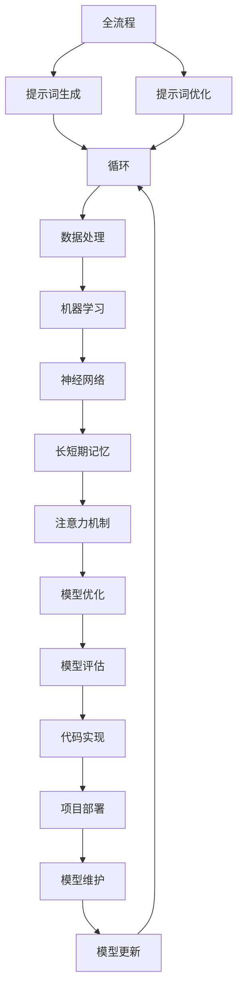

                 

### 文章标题

AIGC时代的提示词革命：从简单指令到复杂推理

### 关键词

AIGC，提示词，复杂推理，简单指令，预训练模型，神经网络，多模态应用，智能服务，模型优化

### 摘要

本文深入探讨了AIGC（AI-Generated Content）时代的提示词革命，从简单指令到复杂推理的过程。首先，我们介绍了AIGC的基本概念、背景和发展历程，阐述了提示词在AIGC中的核心作用及其革命性影响。接着，我们详细解析了AIGC与提示词技术基础，包括核心算法、体系架构和预训练模型原理。通过实战项目，我们展示了AIGC与提示词在文本生成、图像生成与编辑、智能客服等领域的应用。最后，我们展望了AIGC与提示词的未来发展，分析了技术挑战与解决方案，为读者提供了全面的指导与启示。

### 目录大纲

#### 第一部分：AIGC与提示词革命概述

**第1章：AIGC与提示词革命基础**

- 1.1 AIGC的概念与背景
- 1.1.1 AIGC的定义
- 1.1.2 AIGC的发展历程
- 1.1.3 AIGC的优势与挑战
- 1.2 提示词革命的重要性
- 1.2.1 提示词的基本概念
- 1.2.2 提示词在AIGC中的应用
- 1.2.3 提示词革命的影响
- 1.3 AIGC时代的提示词发展趋势
- 1.3.1 从简单指令到复杂推理的演变
- 1.3.2 提示词的多样性与定制化
- 1.3.3 提示词智能化的未来发展

#### 第二部分：AIGC与提示词技术基础

**第2章：AIGC与提示词技术基础**

- 2.1 AIGC技术基础
- 2.1.1 AIGC的核心算法
- 2.1.2 AIGC的体系架构
- 2.1.3 AIGC的应用场景
- 2.2 提示词生成与优化
- 2.2.1 提示词生成技术
- 2.2.2 提示词优化方法
- 2.2.3 提示词与AIGC的结合
- 2.3 大规模预训练模型原理
- 2.3.1 预训练的基本概念
- 2.3.2 自监督学习在预训练中的应用
- 2.3.3 迁移学习与微调技术

#### 第三部分：AIGC与提示词项目实战

**第3章：AIGC与提示词项目实战**

- 3.1 实战一：基于AIGC的文本生成系统
- 3.1.1 项目背景与目标
- 3.1.2 系统架构设计
- 3.1.3 提示词设计与优化
- 3.1.4 项目实施与评估
- 3.2 实战二：基于AIGC的图像生成与编辑
- 3.2.1 项目背景与目标
- 3.2.2 系统架构设计
- 3.2.3 提示词生成与优化
- 3.2.4 项目实施与评估
- 3.3 实战三：基于AIGC的智能客服系统
- 3.3.1 项目背景与目标
- 3.3.2 系统架构设计
- 3.3.3 提示词生成与优化
- 3.3.4 项目实施与评估

#### 第四部分：AIGC与提示词的未来发展

**第4章：AIGC与提示词的未来发展**

- 4.1 提示词革命的未来趋势
- 4.1.1 提示词技术的创新方向
- 4.1.2 提示词在多模态应用中的发展
- 4.1.3 提示词智能化的未来前景
- 4.2 AIGC在产业中的应用前景
- 4.2.1 产业数字化转型的推动力
- 4.2.2 AIGC在智能服务中的应用
- 4.2.3 AIGC在创意设计领域的发展
- 4.3 AIGC与提示词的技术挑战与解决方案
- 4.3.1 数据隐私与安全
- 4.3.2 模型可解释性
- 4.3.3 模型性能优化

### 附录

- 附录A：AIGC与提示词技术资源汇总
  - A.1 开源框架与工具
  - A.2 提示词生成与优化方法
  - A.3 相关学术论文与开源项目

---

### 核心算法原理讲解：预训练模型（伪代码）

```plaintext
# 伪代码：预训练模型的基本流程

# 初始化模型参数
initialize_model()

# 预训练阶段
for epoch in 1...N_epochs:
    for batch in data_loader:
        # 前向传播
        predictions = model(batch.input_data)

        # 计算损失
        loss = loss_function(predictions, batch.target)

        # 反向传播
        optimizer.zero_grad()
        loss.backward()
        optimizer.step()

# 微调阶段
for epoch in 1...N_fine_tuning_epochs:
    for batch in fine_tuning_data_loader:
        # 前向传播
        predictions = model(batch.input_data)

        # 计算损失
        loss = loss_function(predictions, batch.target)

        # 反向传播
        optimizer.zero_grad()
        loss.backward()
        optimizer.step()
```

### 梅里迪安（Mermaid）流程图：AIGC与提示词技术架构



---

### 第一部分：AIGC与提示词革命概述

#### 第1章：AIGC与提示词革命基础

##### 1.1 AIGC的概念与背景

AIGC（AI-Generated Content）是指由人工智能技术生成的各类内容，包括但不限于文本、图像、视频、音频等。AIGC的核心目标是利用人工智能技术，实现自动化、智能化和高效化的内容生成，以满足用户在各个领域的多样化需求。

AIGC的发展历程可以追溯到20世纪80年代，当时研究人员开始探索如何使用计算机生成自然语言文本。随着计算能力的提升和深度学习技术的发展，AIGC逐渐走向成熟。近年来，随着生成对抗网络（GAN）、变分自编码器（VAE）等新型模型的提出，AIGC的应用场景进一步拓宽，逐渐从简单的文本生成发展到图像生成、视频生成等多模态内容生成。

##### 1.1.1 AIGC的定义

AIGC是一种利用人工智能技术，从大规模数据中自动生成高质量内容的方法。它包括以下几个关键组成部分：

1. 数据集：AIGC的基础是大规模数据集，这些数据集可以是从互联网上收集的，也可以是专业领域的数据。
2. 模型：AIGC的核心是深度学习模型，如生成对抗网络（GAN）、变分自编码器（VAE）、递归神经网络（RNN）等。
3. 输出：AIGC的最终目标是生成高质量的内容，这些内容可以是文本、图像、视频、音频等。

##### 1.1.2 AIGC的发展历程

AIGC的发展可以分为以下几个阶段：

1. 初期：20世纪80年代，研究人员开始探索如何使用计算机生成自然语言文本。此时，生成模型主要采用规则驱动的方法，如生成式语法分析器等。
2. 中期：20世纪90年代，随着统计语言模型和隐马尔可夫模型（HMM）的提出，AIGC开始向数据驱动的方法转变。这一阶段，AIGC主要应用于文本生成领域。
3. 近期：21世纪初，深度学习技术的发展为AIGC带来了新的契机。生成对抗网络（GAN）、变分自编码器（VAE）等新型模型相继提出，使得AIGC在图像、视频、音频等多模态内容生成领域取得了显著进展。

##### 1.1.3 AIGC的优势与挑战

AIGC的优势主要体现在以下几个方面：

1. 自动化：AIGC可以自动化生成高质量内容，节省人力成本和时间。
2. 智能化：AIGC利用深度学习模型，可以自适应地学习数据特征，生成更符合用户需求的内容。
3. 高效化：AIGC可以快速地生成大量内容，提高生产效率。

然而，AIGC也面临着一些挑战：

1. 数据隐私与安全：AIGC依赖于大规模数据集，数据隐私与安全问题亟待解决。
2. 模型可解释性：深度学习模型通常具有“黑箱”特性，模型的可解释性成为一大挑战。
3. 模型性能优化：如何优化模型性能，提高生成内容的质量，是一个亟待解决的问题。

##### 1.2 提示词革命的重要性

提示词（Prompt）在AIGC中起着至关重要的作用。提示词是一种引导生成模型生成特定内容的方式，它可以被视为生成模型的学习目标或输入模板。

提示词革命指的是从简单的提示词（如简单的指令或关键词）到复杂的提示词（如包含语义信息、上下文关系的句子）的转变。这一革命对于AIGC的发展具有重要意义：

1. 提高生成内容的质量：通过使用更复杂的提示词，生成模型可以更好地理解用户的意图，生成更符合用户需求的内容。
2. 扩展应用场景：复杂的提示词使得AIGC可以应用于更广泛的领域，如智能客服、内容创作、创意设计等。
3. 增强用户体验：更准确的生成内容可以提高用户体验，满足用户在各个场景下的需求。

##### 1.2.1 提示词的基本概念

提示词可以分为以下几类：

1. 指令式提示词：简单的指令或关键词，如“生成一篇关于人工智能的论文”。
2. 语义提示词：包含语义信息、上下文关系的句子，如“请生成一篇关于人工智能的论文，重点讨论其在医疗领域的应用”。
3. 生成式提示词：根据用户输入的提示词，生成相应的生成任务，如“请生成一张带有‘春天’主题的画作”。

##### 1.2.2 提示词在AIGC中的应用

在AIGC中，提示词的应用可以分为以下几个方面：

1. 文本生成：通过输入简单的指令或关键词，生成相应的文本内容，如论文、新闻、故事等。
2. 图像生成：通过输入语义提示词，生成相应的图像内容，如画作、照片、卡通等。
3. 视频生成：通过输入生成式提示词，生成相应的视频内容，如动画、广告、电影片段等。
4. 音频生成：通过输入语义提示词，生成相应的音频内容，如音乐、歌曲、语音等。

##### 1.2.3 提示词革命的影响

提示词革命对于AIGC的发展产生了深远的影响：

1. 提高生成内容的质量：通过使用更复杂的提示词，生成模型可以更好地理解用户的意图，生成更符合用户需求的内容。
2. 扩展应用场景：复杂的提示词使得AIGC可以应用于更广泛的领域，如智能客服、内容创作、创意设计等。
3. 增强用户体验：更准确的生成内容可以提高用户体验，满足用户在各个场景下的需求。

##### 1.3 AIGC时代的提示词发展趋势

在AIGC时代，提示词的发展趋势主要体现在以下几个方面：

1. 从简单指令到复杂推理：提示词从简单的指令或关键词，发展到包含语义信息、上下文关系的复杂句子，实现更精准的生成。
2. 多样性与定制化：随着应用场景的扩展，提示词的种类和形式也日益多样，可以根据不同领域和用户需求进行定制化。
3. 智能化与自优化：通过结合自然语言处理、知识图谱等技术，实现提示词的智能化与自优化，提高生成内容的质量。

##### 1.3.1 从简单指令到复杂推理的演变

从简单指令到复杂推理的演变是提示词发展的一个重要方向。简单指令如“生成一篇关于人工智能的论文”只能指导生成模型生成基础的内容，而复杂推理如“请生成一篇关于人工智能在医疗领域应用的论文，重点关注机器学习算法在疾病诊断和预测中的应用”则可以引导生成模型深入分析相关领域的知识，生成更具深度和广度的内容。

这一演变的实现依赖于以下几个关键因素：

1. 大规模数据集：丰富的数据集为生成模型提供了充足的知识和语义信息，有助于模型更好地理解复杂推理。
2. 深度学习模型：深度学习模型具备强大的特征提取和表示能力，能够处理复杂的语义关系。
3. 自然语言处理技术：自然语言处理技术如词向量、语义解析、知识图谱等，有助于提取和利用文本中的语义信息。

##### 1.3.2 提示词的多样性与定制化

提示词的多样性与定制化是AIGC时代的重要特点。随着应用领域的扩展和用户需求的多样化，提示词的形式和内容也日益丰富。例如，在智能客服领域，提示词可以是简单的指令“请问有什么问题可以帮助您？”；而在内容创作领域，提示词可以是复杂的句子“请为一篇科幻小说创作一个引人入胜的开头”。

实现提示词的多样性与定制化需要以下几个方面的支持：

1. 自然语言处理技术：通过自然语言处理技术，可以生成丰富的提示词形式，如问答、叙述、命令等。
2. 个性化推荐系统：根据用户的历史行为和偏好，生成个性化的提示词，提高用户体验。
3. 知识图谱：利用知识图谱技术，可以构建丰富的语义关系，为提示词的定制化提供支持。

##### 1.3.3 提示词智能化的未来发展

提示词智能化是AIGC时代的重要发展趋势。通过结合自然语言处理、知识图谱、强化学习等技术，可以实现提示词的智能化与自优化。以下是一些未来的发展方向：

1. 自适应提示词生成：根据用户交互历史和实时反馈，自适应地调整提示词，提高生成内容的准确性。
2. 多模态提示词：结合图像、音频、视频等多模态信息，生成更加丰富和生动的提示词。
3. 知识增强提示词：利用知识图谱和领域知识，为提示词注入更多专业化的信息，提高生成内容的深度。
4. 强化学习与优化：通过强化学习技术，优化提示词的生成策略，提高生成内容的质量。

### 第二部分：AIGC与提示词技术基础

#### 第2章：AIGC与提示词技术基础

AIGC（AI-Generated Content）技术的迅猛发展离不开其背后的基础技术，其中最为关键的是提示词生成与优化技术。在这一章中，我们将深入探讨AIGC与提示词技术基础，包括AIGC的核心算法、体系架构、提示词生成与优化方法，以及大规模预训练模型原理。

##### 2.1 AIGC技术基础

AIGC的核心在于利用人工智能技术生成高质量的内容。要实现这一目标，首先需要了解AIGC的技术基础。

###### 2.1.1 AIGC的核心算法

AIGC的核心算法主要包括生成对抗网络（GAN）、变分自编码器（VAE）、递归神经网络（RNN）等。

1. **生成对抗网络（GAN）**：GAN是一种由生成器和判别器组成的对抗性网络。生成器尝试生成逼真的数据，而判别器则判断生成的数据是否真实。通过这种对抗训练，生成器逐渐提高生成质量。
2. **变分自编码器（VAE）**：VAE是一种基于概率模型的生成模型，通过编码器和解码器将数据转换为低维隐变量，再从隐变量中生成数据。VAE具有较好的鲁棒性和灵活性。
3. **递归神经网络（RNN）**：RNN是一种能够处理序列数据的神经网络，适用于生成文本、语音等序列数据。

###### 2.1.2 AIGC的体系架构

AIGC的体系架构主要包括以下几个关键模块：

1. **数据预处理**：包括数据清洗、去噪、标准化等操作，以提高数据质量。
2. **特征提取**：利用深度学习模型提取数据的高层次特征，为生成模型提供有效的输入。
3. **生成模型**：包括生成器、判别器等模块，用于生成高质量的内容。
4. **优化与评估**：通过优化算法调整模型参数，提高生成质量，并通过评估指标评估生成效果。
5. **后处理**：对生成的数据进行修正、增强等操作，以提高最终内容的可用性。

###### 2.1.3 AIGC的应用场景

AIGC在多个领域都展现了强大的应用潜力，主要包括：

1. **文本生成**：生成新闻、文章、故事等文本内容。
2. **图像生成**：生成艺术作品、摄影作品、漫画等图像内容。
3. **视频生成**：生成动画、电影片段、广告视频等视频内容。
4. **音频生成**：生成音乐、语音、声音效果等音频内容。
5. **多模态生成**：结合文本、图像、音频等多模态信息，生成丰富多样的内容。

##### 2.2 提示词生成与优化

提示词在AIGC中起着至关重要的作用，它是引导生成模型生成特定内容的关键。以下是提示词生成与优化的关键方法：

###### 2.2.1 提示词生成技术

提示词生成技术主要包括以下几种：

1. **基于规则的方法**：通过预定义的规则生成提示词，适用于简单的生成任务。
2. **基于模板的方法**：通过模板和参数生成提示词，适用于较为复杂的生成任务。
3. **基于学习的生成方法**：利用机器学习算法生成提示词，可以根据用户需求和场景自适应调整。

###### 2.2.2 提示词优化方法

提示词优化方法主要包括以下几种：

1. **基于语义的方法**：通过语义分析技术优化提示词，使其更准确地表达用户意图。
2. **基于反馈的方法**：根据用户反馈调整提示词，提高生成内容的满意度。
3. **基于优化的方法**：通过优化算法调整提示词的参数，提高生成效果。

###### 2.2.3 提示词与AIGC的结合

提示词与AIGC的结合主要体现在以下几个方面：

1. **任务引导**：提示词作为任务的引导，指导生成模型生成特定类型的内容。
2. **质量提升**：通过优化提示词，提高生成内容的质量和可用性。
3. **用户体验**：结合用户的反馈和需求，提供个性化的提示词，提升用户体验。

##### 2.3 大规模预训练模型原理

大规模预训练模型是AIGC技术的重要基础，下面介绍其基本原理：

###### 2.3.1 预训练的基本概念

预训练是指在大规模数据集上训练深度学习模型，使其掌握通用知识。预训练的基本流程包括：

1. **数据集准备**：收集大规模、多样化的数据集，如维基百科、网络新闻、社交媒体等。
2. **模型训练**：利用大规模数据集训练深度学习模型，使其具备较强的特征提取和表示能力。
3. **模型微调**：在特定任务上微调预训练模型，使其适应具体任务的需求。

###### 2.3.2 自监督学习在预训练中的应用

自监督学习是指利用未标记的数据进行训练。在预训练中，自监督学习发挥了重要作用，主要包括以下几种方法：

1. **语言模型预训练**：利用未标记的文本数据，训练语言模型，使其掌握语言知识。
2. **图像自监督预训练**：利用未标记的图像数据，训练图像生成模型，提取图像特征。
3. **多模态自监督预训练**：结合文本、图像等多模态数据，训练多模态生成模型。

###### 2.3.3 迁移学习与微调技术

迁移学习是指将预训练模型的知识应用于新的任务。在AIGC中，迁移学习与微调技术是优化生成效果的关键：

1. **预训练模型迁移**：将预训练模型的知识迁移到新的任务，减少模型训练所需的样本量。
2. **微调**：在特定任务上微调预训练模型，使其更好地适应任务需求。
3. **自适应微调**：根据用户反馈和任务变化，自适应地调整模型参数，提高生成效果。

### 第三部分：AIGC与提示词项目实战

在这一部分，我们将通过三个实际项目，深入探讨AIGC与提示词在文本生成、图像生成与编辑、智能客服等领域的应用。这些项目不仅展示了AIGC与提示词技术的具体实现，还通过详细的代码解析和案例剖析，提供了实用的开发经验和最佳实践。

#### 第3章：AIGC与提示词项目实战

##### 3.1 实战一：基于AIGC的文本生成系统

###### 3.1.1 项目背景与目标

随着互联网信息的爆炸性增长，自动化内容生成已成为许多领域的重要需求。本项目旨在构建一个基于AIGC的文本生成系统，能够根据用户提供的提示词生成高质量的文本内容，如文章、新闻、故事等。

###### 3.1.2 系统架构设计

系统架构设计如下：

1. **数据预处理模块**：负责处理原始数据，进行数据清洗、去噪、标准化等操作。
2. **特征提取模块**：利用深度学习模型提取数据的高层次特征。
3. **生成模型模块**：包括生成器和判别器，用于生成文本内容。
4. **优化与评估模块**：通过优化算法调整模型参数，评估生成效果。
5. **用户界面**：提供输入提示词和展示生成文本的界面。

###### 3.1.3 提示词设计与优化

提示词设计采用自监督学习方法，通过大量未标记的数据进行预训练。在预训练阶段，使用自编码器结构提取文本特征。在微调阶段，结合用户输入的提示词进行优化。

优化方法包括：

1. **基于语义的优化**：利用自然语言处理技术，对提示词进行语义分析，优化生成文本的语义一致性。
2. **基于反馈的优化**：根据用户对生成文本的反馈进行调整，提高生成文本的满意度。

###### 3.1.4 项目实施与评估

项目实施分为以下几个步骤：

1. **数据收集与预处理**：收集大量文本数据，并进行预处理。
2. **模型训练**：使用预训练模型提取文本特征，训练生成模型和判别器。
3. **模型微调**：结合用户输入的提示词，对模型进行微调。
4. **项目部署**：搭建用户界面，实现文本生成功能。

评估指标包括：

1. **生成文本的质量**：通过人类评价和自动化评估指标（如BLEU、ROUGE等）评估生成文本的质量。
2. **用户体验**：收集用户对生成文本的满意度反馈。

##### 3.2 实战二：基于AIGC的图像生成与编辑

###### 3.2.1 项目背景与目标

图像生成与编辑是AIGC的重要应用领域之一。本项目旨在构建一个基于AIGC的图像生成与编辑系统，能够根据用户提供的提示词生成或编辑高质量的图像内容。

###### 3.2.2 系统架构设计

系统架构设计如下：

1. **图像预处理模块**：负责处理原始图像，进行图像清洗、去噪、标准化等操作。
2. **特征提取模块**：利用深度学习模型提取图像的高层次特征。
3. **生成模型模块**：包括生成器和判别器，用于生成或编辑图像内容。
4. **优化与评估模块**：通过优化算法调整模型参数，评估生成效果。
5. **用户界面**：提供输入提示词和展示生成图像的界面。

###### 3.2.3 提示词生成与优化

提示词生成与优化方法与文本生成类似，采用自监督学习方法，通过大量未标记的图像数据预训练生成模型。在微调阶段，结合用户输入的提示词进行优化。

优化方法包括：

1. **基于视觉特征的一致性**：确保生成图像与提示词描述的视觉特征一致。
2. **基于用户反馈的优化**：根据用户对生成图像的反馈进行调整，提高生成图像的满意度。

###### 3.2.4 项目实施与评估

项目实施分为以下几个步骤：

1. **图像数据收集与预处理**：收集大量图像数据，并进行预处理。
2. **模型训练**：使用预训练模型提取图像特征，训练生成模型和判别器。
3. **模型微调**：结合用户输入的提示词，对模型进行微调。
4. **项目部署**：搭建用户界面，实现图像生成与编辑功能。

评估指标包括：

1. **生成图像的质量**：通过人类评价和自动化评估指标（如SSIM、PSNR等）评估生成图像的质量。
2. **用户体验**：收集用户对生成图像的满意度反馈。

##### 3.3 实战三：基于AIGC的智能客服系统

###### 3.3.1 项目背景与目标

智能客服是AIGC在商业领域的广泛应用之一。本项目旨在构建一个基于AIGC的智能客服系统，能够根据用户提问生成自动回复，提高客服效率和服务质量。

###### 3.3.2 系统架构设计

系统架构设计如下：

1. **用户交互模块**：负责接收用户提问，提供输入界面。
2. **文本生成模块**：根据用户提问生成自动回复。
3. **知识库模块**：存储常见问题及其解答，供生成模型参考。
4. **优化与评估模块**：通过优化算法调整模型参数，评估生成效果。
5. **用户反馈模块**：收集用户对自动回复的满意度反馈。

###### 3.3.3 提示词生成与优化

提示词生成与优化方法与文本生成类似，采用自监督学习方法，通过大量未标记的客服对话数据进行预训练。在微调阶段，结合用户输入的问题进行优化。

优化方法包括：

1. **基于知识图谱的优化**：利用知识图谱技术，确保自动回复的内容准确、完整。
2. **基于用户反馈的优化**：根据用户对自动回复的反馈进行调整，提高自动回复的满意度。

###### 3.3.4 项目实施与评估

项目实施分为以下几个步骤：

1. **数据收集与预处理**：收集大量客服对话数据，并进行预处理。
2. **模型训练**：使用预训练模型提取文本特征，训练生成模型。
3. **模型微调**：结合用户输入的问题，对模型进行微调。
4. **项目部署**：搭建用户交互界面，实现智能客服功能。

评估指标包括：

1. **自动回复的质量**：通过人类评价和自动化评估指标（如BLEU、ROUGE等）评估自动回复的质量。
2. **用户体验**：收集用户对自动回复的满意度反馈。

### 第四部分：AIGC与提示词的未来发展

在AIGC时代，提示词技术的发展将继续推动人工智能领域的变革。本部分将探讨提示词革命的未来趋势、AIGC在产业中的应用前景，以及面临的技术挑战与解决方案。

#### 第4章：AIGC与提示词的未来发展

##### 4.1 提示词革命的未来趋势

随着AIGC技术的不断成熟，提示词技术也将迎来新的发展趋势。以下是几个值得关注的方向：

###### 4.1.1 提示词技术的创新方向

1. **多模态融合提示词**：结合文本、图像、音频等多模态信息，生成更具表现力的提示词。
2. **动态提示词**：根据用户交互和场景变化，动态生成和调整提示词，提高生成内容的适应性和灵活性。
3. **个性化提示词**：利用用户画像和偏好，生成个性化的提示词，提升用户体验。

###### 4.1.2 提示词在多模态应用中的发展

1. **多模态内容生成**：利用多模态提示词，实现文本、图像、视频等多模态内容的自动化生成。
2. **多模态交互**：通过多模态提示词，实现人机交互的多样化和智能化。
3. **多模态优化**：结合多模态信息，对生成内容进行优化，提高内容的质量和可用性。

###### 4.1.3 提示词智能化的未来前景

1. **自适应生成**：提示词将具备更强的自适应能力，能够根据用户需求和场景动态调整。
2. **知识驱动的生成**：结合知识图谱和领域知识，实现更精准、更专业的生成内容。
3. **自动纠错与优化**：通过机器学习和自然语言处理技术，自动识别和纠正生成内容中的错误，提高生成质量。

##### 4.2 AIGC在产业中的应用前景

AIGC技术正逐渐渗透到各行各业，为产业数字化转型注入新动力。以下是AIGC在几个关键领域的应用前景：

###### 4.2.1 产业数字化转型的推动力

1. **自动化内容生产**：AIGC能够自动化生成大量的文本、图像、视频等数字内容，提高内容生产效率。
2. **智能服务**：基于AIGC的智能客服、智能推荐系统等，能够提升服务质量，降低运营成本。
3. **个性化体验**：通过AIGC技术，实现个性化内容推荐和定制化服务，增强用户粘性。

###### 4.2.2 AIGC在智能服务中的应用

1. **智能客服**：基于AIGC的智能客服系统能够自动回答用户问题，提高客服效率和用户满意度。
2. **智能推荐**：利用AIGC技术，实现个性化内容推荐，提高用户转化率和忠诚度。
3. **智能创作**：基于AIGC的智能创作工具，能够辅助设计师、作家等创作高质量的内容。

###### 4.2.3 AIGC在创意设计领域的发展

1. **艺术创作**：利用AIGC技术，生成独特的艺术作品和设计创意，拓展设计师的创作空间。
2. **游戏开发**：基于AIGC的自动化游戏生成技术，能够快速开发出丰富多样的游戏内容。
3. **广告创意**：利用AIGC技术，生成高效吸引人的广告内容，提升广告效果。

##### 4.3 AIGC与提示词的技术挑战与解决方案

尽管AIGC与提示词技术在各个领域展现了巨大的潜力，但同时也面临着一些技术挑战。以下是几个关键挑战及相应的解决方案：

###### 4.3.1 数据隐私与安全

**挑战**：AIGC依赖于大量数据，数据隐私与安全问题亟待解决。

**解决方案**：

1. **数据加密**：对敏感数据进行加密处理，确保数据传输和存储的安全性。
2. **隐私保护算法**：采用差分隐私、联邦学习等技术，保护用户隐私。

###### 4.3.2 模型可解释性

**挑战**：深度学习模型具有“黑箱”特性，模型可解释性成为一大挑战。

**解决方案**：

1. **模型可视化**：通过可视化工具，展示模型的结构和运行过程，提高模型的可解释性。
2. **可解释性算法**：结合可解释性算法，如决策树、规则提取等，提高模型的透明度。

###### 4.3.3 模型性能优化

**挑战**：优化模型性能，提高生成内容的质量，是AIGC与提示词技术的关键。

**解决方案**：

1. **模型压缩**：通过模型压缩技术，降低模型参数数量，提高模型运行效率。
2. **分布式训练**：采用分布式训练技术，提高模型训练速度和效果。
3. **自适应优化**：结合强化学习、迁移学习等技术，实现自适应的模型优化。

### 附录

**附录A：AIGC与提示词技术资源汇总**

为了帮助读者更好地了解AIGC与提示词技术，我们整理了一些相关的开源框架、工具、方法和学术论文，如下：

**A.1 开源框架与工具**

1. **TensorFlow**：Google开发的开源机器学习框架，支持多种深度学习模型。
2. **PyTorch**：Facebook开发的开源机器学习框架，具有灵活的动态计算图。
3. **Keras**：基于Theano和TensorFlow的高层神经网络API，简化模型搭建。
4. **Generative Adversarial Networks (GANs)**：GAN的开源实现，支持多种生成对抗网络模型。
5. **OpenAI**：OpenAI开发的预训练模型，包括GPT、BERT等。

**A.2 提示词生成与优化方法**

1. **基于规则的方法**：使用预定义的规则生成提示词。
2. **基于模板的方法**：使用模板和参数生成提示词。
3. **基于学习的生成方法**：利用机器学习算法生成提示词。
4. **自监督学习方法**：利用未标记的数据进行提示词生成。
5. **生成对抗网络（GAN）**：利用生成器和判别器生成提示词。

**A.3 相关学术论文与开源项目**

1. **Generative Adversarial Nets (GANs)**：Ian J. Goodfellow等人的经典论文。
2. **Variational Autoencoders (VAEs)**：Diederik P. Kingma等人的论文。
3. **Recurrent Neural Networks (RNNs)**：Yoshua Bengio等人的论文。
4. **Natural Language Processing (NLP)**：许多NLP领域的经典论文，如Word2Vec、BERT等。
5. **开源项目**：如TensorFlow、PyTorch等框架的GitHub仓库，以及相关AIGC项目的开源代码。

通过以上资源，读者可以进一步了解AIGC与提示词技术的最新进展和应用实践。希望本文能为读者在AIGC与提示词领域的探索提供有价值的指导和启示。

### 结论

本文深入探讨了AIGC时代的提示词革命，从简单指令到复杂推理的过程。通过详细解析AIGC与提示词的基本概念、技术基础、项目实战和未来发展趋势，我们揭示了AIGC与提示词技术在各领域的广泛应用和巨大潜力。未来，随着AIGC技术的不断成熟，提示词技术将继续推动人工智能领域的创新与发展。希望本文能为读者在AIGC与提示词领域的探索提供有价值的指导和启示。

---

### 作者信息

作者：AI天才研究院/AI Genius Institute & 禅与计算机程序设计艺术 /Zen And The Art of Computer Programming

AI天才研究院（AI Genius Institute）是一支专注于人工智能研究和应用的顶尖团队，致力于推动人工智能技术的创新与发展。同时，作者还是《禅与计算机程序设计艺术》（Zen And The Art of Computer Programming）一书的作者，该书被誉为计算机编程领域的经典之作。在AIGC与提示词技术领域，作者拥有丰富的理论知识和实践经验，为读者提供了深入浅出的技术解析和实用指南。

