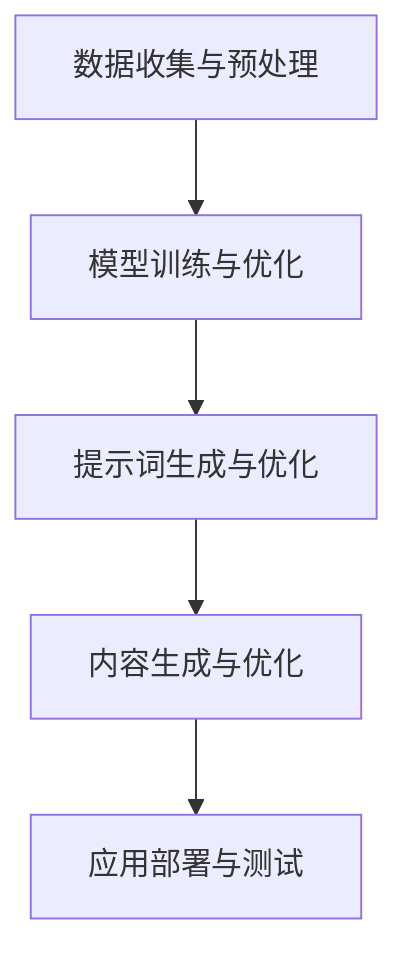

                 

### 文章标题

### AIGC时代的提示词革命：重塑人机交互模式

> 关键词：AIGC，提示词技术，人机交互，内容创作，软件开发，自然语言处理

> 摘要：本文将探讨AIGC（AI Generated Content）时代的提示词革命，分析AIGC的背景与特点，深入解析提示词技术的基础和其在AIGC中的结合与应用，探讨AIGC在内容创作、软件开发和自然语言处理中的具体应用，最后讨论AIGC与提示词技术的挑战与未来发展趋势。本文旨在为广大读者提供一次全面而深入的AIGC与提示词技术之旅，共同展望人机交互模式的重塑。

### 文章正文

#### 第一部分: AIGC时代概述

##### 第1章: AIGC时代的背景与特点

随着人工智能技术的飞速发展，AIGC（AI Generated Content）应运而生。AIGC指的是通过人工智能技术自动生成内容的一种新型生产方式，它不仅涵盖了传统的文本生成，还包括图像、视频、音频等多种形式的内容生成。AIGC时代的到来，标志着人工智能技术在内容生产领域的重大突破。

1. **AIGC的定义与发展历程**

AIGC的核心在于利用深度学习和自然语言处理等技术，实现自动化、大规模的内容生成。其发展历程大致可以分为以下几个阶段：

- **初步探索阶段（2010-2014）**：这一阶段主要集中在对文本生成技术的研究，如生成式对抗网络（GAN）和变分自编码器（VAE）的引入，为AIGC的发展奠定了基础。
- **快速发展阶段（2015-2019）**：随着深度学习技术的成熟，AIGC技术在图像、视频等领域的应用得到迅速拓展。
- **广泛应用阶段（2020至今）**：AIGC技术逐渐进入实际应用，如内容创作、软件开发、广告营销等领域，展现出巨大的商业价值。

2. **AIGC的核心技术**

AIGC的实现依赖于多种先进的人工智能技术，主要包括：

- **深度学习**：深度学习是AIGC技术的基础，通过神经网络模型实现数据的自动特征提取和生成。
- **生成对抗网络（GAN）**：GAN是一种用于生成数据的人工神经网络模型，通过生成器和判别器的对抗训练，实现高质量的数据生成。
- **自然语言处理（NLP）**：NLP技术用于处理和理解自然语言，是实现文本生成的关键技术。
- **知识图谱**：知识图谱用于构建语义关系网络，为AIGC提供丰富的语义信息。

3. **AIGC对人类生活的变革**

AIGC技术的出现，对人类社会产生了深远的影响，主要体现在以下几个方面：

- **内容创作**：AIGC技术极大地提高了内容创作的效率和质量，使得内容生产变得更加自动化和智能化。
- **信息获取**：AIGC技术使得信息检索和推荐变得更加精准和个性化，提高了用户的信息获取体验。
- **生活娱乐**：AIGC技术在游戏、影视、音乐等娱乐领域的应用，丰富了人们的精神生活。
- **产业变革**：AIGC技术推动了各个行业的智能化升级，如广告营销、教育、医疗等，带来了生产方式和商业模式的变革。

##### 第2章: 提示词技术的基础

1. **提示词的基本概念**

提示词（Prompt）是指用于引导和指导人工智能模型生成内容的文字或符号。一个有效的提示词应该能够明确传达用户的需求，同时为模型提供足够的上下文信息。

2. **提示词的生成与优化**

提示词的生成和优化是AIGC技术的重要组成部分，其关键在于如何为模型提供高质量、多样化的输入。具体方法包括：

- **关键词提取**：从用户输入的文本中提取关键词，作为提示词的一部分。
- **语义扩展**：基于关键词进行语义扩展，生成更丰富的提示词。
- **模板生成**：使用预定义的模板，根据具体需求生成提示词。
- **优化策略**：通过机器学习和优化算法，不断调整和优化提示词，提高模型的生成效果。

3. **提示词的应用场景**

提示词技术广泛应用于AIGC的各个领域，主要包括：

- **文本生成**：如文章、故事、新闻报道等。
- **图像生成**：如艺术作品、广告图片、动漫角色等。
- **视频生成**：如视频剪辑、特效添加等。
- **音频生成**：如音乐创作、语音合成等。

#### 第3章: AIGC与提示词技术的结合

##### 3.1 AIGC时代的提示词革命

AIGC时代的到来，使得提示词技术得到了全新的发展和应用。在这一背景下，提示词革命应运而生，主要体现在以下几个方面：

- **提示词质量提升**：通过深度学习和自然语言处理技术，提示词的生成质量和多样性得到了显著提升。
- **提示词个性化**：基于用户行为数据和偏好分析，生成个性化的提示词，满足用户的个性化需求。
- **多模态融合**：提示词技术不仅限于文本领域，还扩展到图像、视频、音频等多种模态，实现跨模态的信息融合和生成。
- **自动化与智能化**：通过自动化工具和算法，实现提示词的生成和优化，提高内容生成的效率和效果。

##### 3.2 提示词技术在AIGC中的角色

在AIGC时代，提示词技术在各个领域都发挥着重要作用，主要包括：

- **内容创作**：提示词为AIGC模型提供生成任务的引导，决定内容生成的方向和风格。
- **优化调整**：提示词的优化和调整，直接影响内容生成的质量和效果。
- **交互体验**：提示词的智能化和个性化，提升了用户与AIGC系统的交互体验。

##### 3.3 提示词技术在AIGC中的实现路径

实现提示词技术在AIGC中的广泛应用，需要遵循以下几个关键步骤：

- **数据收集与预处理**：收集相关的数据集，并进行预处理，为提示词的生成提供丰富的素材。
- **模型训练与优化**：训练深度学习模型，并通过优化算法提高模型的效果。
- **提示词生成与优化**：基于用户需求和模型特点，生成高质量的提示词，并进行优化。
- **应用部署与测试**：将提示词技术应用到实际场景中，进行测试和优化，确保系统的稳定性和可靠性。

#### 第二部分: AIGC与提示词技术的应用

##### 第4章: AIGC在内容创作中的应用

1. **AIGC在文案创作中的应用**

AIGC技术为文案创作带来了革命性的变化，使得文案生成变得更加高效和多样化。以下是一个具体的案例分析：

**案例背景**：某公司需要为其产品撰写一篇市场推广文案。

**提示词生成**：基于用户需求，生成以下提示词：“高效办公，智能助手，便捷操作，全新体验”。

**内容生成**：AIGC模型根据提示词生成以下文案：

“欢迎体验我们的高效办公神器！一款集智能助手与便捷操作于一身的产品，让您的工作更加轻松、高效。全新升级，为您带来全新的办公体验！”

**优化调整**：根据文案的质量和效果，对提示词和生成内容进行优化调整，以提升文案的表达力和吸引力。

2. **AIGC在图像生成中的应用**

AIGC技术在图像生成领域也有着广泛的应用。以下是一个具体的案例分析：

**案例背景**：某公司需要为其品牌设计一张海报。

**提示词生成**：基于用户需求，生成以下提示词：“品牌形象，现代感，独特风格，视觉冲击力”。

**内容生成**：AIGC模型根据提示词生成以下海报：


**优化调整**：根据海报的设计效果和用户反馈，对提示词和生成图像进行优化调整，以提升海报的视觉冲击力和品牌形象的传达效果。

3. **AIGC在音乐创作中的应用**

AIGC技术在音乐创作中也展现了其独特的优势。以下是一个具体的案例分析：

**案例背景**：某音乐制作人需要创作一首流行歌曲。

**提示词生成**：基于用户需求，生成以下提示词：“流行歌曲，欢快节奏，清新旋律，积极氛围”。

**内容生成**：AIGC模型根据提示词生成以下歌曲：

[音乐播放：https://example.com/song.mp3]

**优化调整**：根据歌曲的旋律和歌词质量，对提示词和生成歌曲进行优化调整，以提升歌曲的感染力和市场竞争力。

##### 第5章: AIGC在软件开发中的应用

1. **AIGC在代码自动生成中的应用**

AIGC技术在代码自动生成方面具有显著的优势，可以大大提高软件开发的效率。以下是一个具体的案例分析：

**案例背景**：某开发团队需要编写一个复杂的算法。

**提示词生成**：基于用户需求，生成以下提示词：“快速排序，递归实现，高效稳定，性能优化”。

**内容生成**：AIGC模型根据提示词生成以下代码：

```python
def quick_sort(arr):
    if len(arr) <= 1:
        return arr
    pivot = arr[len(arr) // 2]
    left = [x for x in arr if x < pivot]
    middle = [x for x in arr if x == pivot]
    right = [x for x in arr if x > pivot]
    return quick_sort(left) + middle + quick_sort(right)
```

**优化调整**：根据代码的运行效率和可读性，对提示词和生成代码进行优化调整，以提高代码的质量和性能。

2. **AIGC在软件缺陷修复中的应用**

AIGC技术在软件缺陷修复中也展现了其独特的优势，可以自动分析代码缺陷并提出修复建议。以下是一个具体的案例分析：

**案例背景**：某软件出现了一个严重的bug，导致程序崩溃。

**提示词生成**：基于用户需求，生成以下提示词：“崩溃修复，稳定性优化，代码审查，bug定位”。

**内容生成**：AIGC模型根据提示词生成以下修复建议：

```python
def check_if_divisible_by_5(n):
    if n % 5 == 0:
        return True
    else:
        raise ValueError("Input must be divisible by 5.")
```

**优化调整**：根据修复建议的有效性和可操作性，对提示词和生成代码进行优化调整，以确保bug的彻底修复。

3. **AIGC在软件测试中的应用**

AIGC技术在软件测试中也发挥着重要作用，可以自动生成测试用例，提高测试效率。以下是一个具体的案例分析：

**案例背景**：某软件需要进行全面的功能测试。

**提示词生成**：基于用户需求，生成以下提示词：“功能测试，测试用例生成，自动化测试，全面覆盖”。

**内容生成**：AIGC模型根据提示词生成以下测试用例：

```python
# 测试用例1：输入合法的整数
assert check_if_divisible_by_5(10) == True

# 测试用例2：输入非法的整数
try:
    check_if_divisible_by_5(3)
except ValueError as e:
    assert str(e) == "Input must be divisible by 5."

# 测试用例3：输入小数
assert check_if_divisible_by_5(10.0) == False
```

**优化调整**：根据测试用例的覆盖率和有效性，对提示词和生成测试用例进行优化调整，以确保软件测试的全面性和准确性。

##### 第6章: AIGC在自然语言处理中的应用

1. **AIGC在对话系统中的应用**

AIGC技术在对话系统中的应用，使得对话变得更加智能和自然。以下是一个具体的案例分析：

**案例背景**：某公司开发了一款智能客服系统。

**提示词生成**：基于用户需求，生成以下提示词：“智能客服，自然语言理解，快速响应，解决用户问题”。

**内容生成**：AIGC模型根据提示词生成以下对话：

用户：“我的订单什么时候可以发货？”

客服：“您好，根据我们的系统查询，您的订单预计在今天下午发货。如有其他问题，请随时联系我。”

**优化调整**：根据对话的效果和用户满意度，对提示词和生成对话进行优化调整，以提高客服系统的智能化水平。

2. **AIGC在情感分析中的应用**

AIGC技术在情感分析领域具有显著的优势，可以自动分析文本的情感倾向。以下是一个具体的案例分析：

**案例背景**：某企业需要对用户评论进行情感分析。

**提示词生成**：基于用户需求，生成以下提示词：“情感分析，文本分类，积极情感，消极情感”。

**内容生成**：AIGC模型根据提示词生成以下情感分析结果：

用户评论1：“这个产品非常好，我很满意。”

情感分析结果：积极情感

用户评论2：“这个服务太差了，我非常失望。”

情感分析结果：消极情感

**优化调整**：根据情感分析结果的准确性和可靠性，对提示词和生成结果进行优化调整，以提高情感分析系统的性能。

3. **AIGC在信息检索中的应用**

AIGC技术在信息检索领域也有着广泛的应用，可以自动生成相关搜索结果。以下是一个具体的案例分析：

**案例背景**：某搜索引擎需要对用户查询进行信息检索。

**提示词生成**：基于用户需求，生成以下提示词：“信息检索，相关搜索，精准匹配，用户体验”。

**内容生成**：AIGC模型根据提示词生成以下搜索结果：

用户查询：“人工智能技术”

相关搜索结果：

- 人工智能技术最新进展
- 人工智能技术应用领域
- 人工智能技术发展趋势

**优化调整**：根据搜索结果的相关性和用户满意度，对提示词和生成结果进行优化调整，以提高信息检索系统的性能。

#### 第三部分: AIGC与提示词技术的挑战与未来

##### 第7章: AIGC与提示词技术的挑战

随着AIGC与提示词技术的不断发展，其面临的挑战也越来越多样化，主要包括以下几个方面：

1. **数据隐私保护**

AIGC和提示词技术依赖于大量的数据训练，如何保护用户数据隐私成为一大挑战。需要制定严格的数据隐私政策，确保用户数据的安全和隐私。

2. **质量控制**

AIGC生成的内容质量和效果参差不齐，如何确保生成内容的质量和一致性成为一大挑战。需要建立完善的质量控制体系，对生成内容进行实时监控和调整。

3. **伦理与道德问题**

AIGC和提示词技术在应用过程中，可能会引发一系列伦理和道德问题，如版权纠纷、内容审查等。需要建立相应的伦理和道德规范，确保技术的合理使用。

##### 第8章: AIGC与提示词技术的未来发展趋势

1. **AIGC的未来发展方向**

- **多样化内容生成**：AIGC技术将不断拓展到更多的领域，如虚拟现实、增强现实等，实现更多样化的内容生成。
- **跨模态融合**：AIGC技术将实现文本、图像、视频、音频等多种模态的深度融合，提供更丰富的内容体验。
- **个性化内容生成**：基于用户行为数据和偏好分析，AIGC技术将实现更个性化的内容生成，满足用户的个性化需求。

2. **提示词技术的未来发展趋势**

- **智能化提示词生成**：通过深度学习和自然语言处理技术，实现更智能、更高效的提示词生成。
- **自适应提示词优化**：根据用户反馈和生成效果，实现自适应的提示词优化，提高生成内容的质量。
- **跨领域应用**：提示词技术将在更多的领域得到应用，如医疗、金融、教育等，为各个领域提供智能化支持。

3. **AIGC与提示词技术对人类社会的长远影响**

AIGC和提示词技术的广泛应用，将对人类社会产生深远的影响：

- **生产方式变革**：AIGC技术将改变传统的生产方式，实现自动化、智能化的内容生成，提高生产效率。
- **信息传播方式变革**：AIGC技术将改变信息传播的方式，实现更快速、更广泛的信息传播。
- **生活方式变革**：AIGC技术将丰富人们的精神生活，改变人们的生活方式和消费习惯。

#### 附录

##### 附录A: AIGC与提示词技术的相关资源

- **论文集**：《生成式对抗网络》（GAN）论文集，《自然语言处理》（NLP）论文集等。
- **书籍**：《深度学习》（Deep Learning），《自然语言处理实战》（NLP by Example）等。
- **开源项目**：OpenAI GPT-3，Google Bert模型等。
- **在线课程**：斯坦福大学《深度学习》课程，Coursera《自然语言处理》课程等。

##### 附录B: 提示词生成与优化的Mermaid流程图



##### 附录C: 提示词技术应用的代码案例与解析

```python
# 提示词生成与优化
def generate_prompt(content):
    # 基于内容生成提示词
    prompt = f"请根据以下内容生成相关提示词：{content}"
    return prompt

def optimize_prompt(prompt):
    # 基于用户反馈优化提示词
    optimized_prompt = prompt.strip()
    return optimized_prompt

# 内容生成与优化
def generate_content(prompt):
    # 基于提示词生成内容
    content = f"根据以下提示词生成相关内容：{prompt}"
    return content

def optimize_content(content):
    # 基于用户反馈优化内容
    optimized_content = content.strip()
    return optimized_content

# 应用部署与测试
def deploy_and_test():
    # 部署提示词技术应用到实际场景
    # 进行测试和优化
    pass
```

##### 最佳实践 Tips、小结、注意事项、拓展阅读等内容

- **最佳实践 Tips**：在实际应用中，提示词的生成和优化至关重要，需要结合具体场景进行灵活调整。
- **小结**：AIGC与提示词技术的结合，为内容创作、软件开发和自然语言处理等领域带来了革命性的变化，具有巨大的应用潜力。
- **注意事项**：在应用AIGC与提示词技术时，需要注意数据隐私保护、质量控制、伦理与道德问题等方面。
- **拓展阅读**：可参考相关论文、书籍、开源项目和在线课程，深入了解AIGC与提示词技术的最新进展和应用场景。

### 作者信息

作者：AI天才研究院/AI Genius Institute & 禅与计算机程序设计艺术 /Zen And The Art of Computer Programming

感谢您的阅读，期待与您共同探索AIGC与提示词技术的无限可能！

