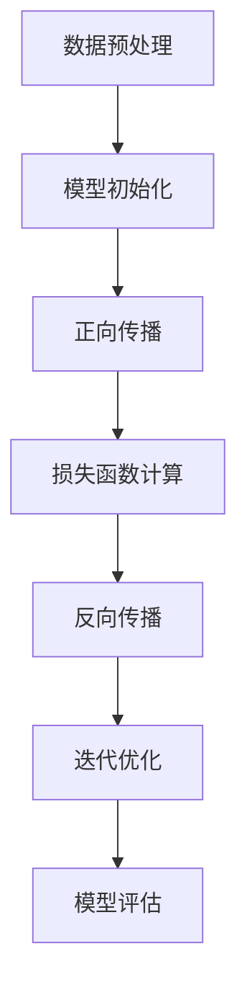

                 

### 文章标题：AIGC时代的语言模型训练与提示词设计

#### 关键词：AIGC、自然语言处理、语言模型、训练、提示词设计

> 摘要：本文将深入探讨AIGC（自适应智能生成计算）时代的语言模型训练与提示词设计。首先，我们将概述AIGC时代的背景和发展现状，接着详细解释语言模型的基本概念、构建方法和应用场景。随后，文章将逐步分析语言模型训练的原理、技术和实践，以及提示词设计的重要性和策略。最后，我们将通过实际案例展示AIGC在不同领域的应用，并展望AIGC时代的未来挑战与机遇。

## 第一部分：AIGC时代概述

### 第1章：AIGC时代概述

#### 1.1 AIGC的概念与背景

AIGC，即自适应智能生成计算，是一种结合了人工智能（AI）和生成计算（Generation Computing）的新型计算范式。AIGC通过自动化、智能化地生成内容，极大地提高了数据生成和处理效率，成为当前科技发展的重要趋势。

AIGC起源于深度学习和生成对抗网络（GAN）的发展。随着计算能力的提升和大数据的积累，AIGC逐渐从实验室走向实际应用，涵盖了自然语言处理、图像生成、视频生成等多个领域。

**核心概念：** AIGC强调数据的自适应性生成，通过训练模型来模拟人类创作过程，生成高质量、多样化的内容。其核心在于利用机器学习算法，从大量数据中学习规律，并在此基础上生成新的、符合目标内容的数据。

**背景介绍：** 在人工智能迅速发展的背景下，传统的数据驱动方法已无法满足日益增长的数据需求和多样化的应用场景。AIGC作为一种自适应、智能化的生成计算方式，为数据生成和处理提供了新的解决方案。

#### 1.2 AIGC的发展现状与趋势

AIGC的发展现状主要集中在自然语言处理、图像生成和视频生成等领域。

**自然语言处理：** 语言模型是AIGC在自然语言处理中的核心应用，如GPT、BERT等预训练模型已经在各种语言任务中取得了显著的成果。同时，基于生成式的对话系统、文本摘要和问答系统也在不断发展。

**图像生成：** GAN和变分自编码器（VAE）等生成模型在图像生成领域取得了突破性进展，如图像风格迁移、超分辨率和图像合成等。

**视频生成：** 通过结合图像生成和自然语言处理技术，AIGC在视频生成领域展示了巨大的潜力，如视频摘要、视频合成和视频增强等。

**趋势展望：** 随着技术的不断进步和应用的深入，AIGC将在更多领域得到广泛应用，如虚拟现实、增强现实、智能教育和医疗健康等。

#### 1.3 AIGC的核心技术

AIGC的核心技术包括生成模型、预训练模型和提示词设计。

**生成模型：** 包括生成对抗网络（GAN）、变分自编码器（VAE）和自编码器等，用于生成高质量的数据。

**预训练模型：** 如GPT、BERT等，通过在大规模数据集上进行预训练，提高了模型的泛化能力和性能。

**提示词设计：** 提示词（Prompt Engineering）是AIGC应用中的重要技术，通过设计有效的提示词，可以引导模型生成符合预期的高质量内容。

**技术联系：** 生成模型负责数据的生成，预训练模型提供了强大的基础模型，提示词设计则确保了生成内容的质量和方向。这三者共同构成了AIGC的核心技术体系。

### 第2章：语言模型基础

#### 2.1 语言模型的基本概念

语言模型是自然语言处理（NLP）领域的重要基础，它旨在学习自然语言的统计特性，从而预测下一个单词或字符。语言模型在许多NLP任务中扮演着至关重要的角色，如机器翻译、语音识别、文本摘要和问答系统等。

**定义：** 语言模型是一个概率模型，用于预测序列中下一个元素的概率。在自然语言处理中，这个序列通常是单词序列。

$$
P(w_t | w_{t-1}, w_{t-2}, \ldots) = \prod_{i=1}^{t} P(w_i | w_{i-1}, w_{i-2}, \ldots)
$$

**例子：** 假设我们有一个简单的二元语言模型，其中包含两个单词“猫”和“狗”。如果前一个单词是“猫”，那么下一个单词是“狗”的概率为0.5；如果前一个单词是“狗”，那么下一个单词是“猫”的概率也为0.5。

**分类：** 语言模型可以分为基于规则的模型和基于统计的模型。基于规则的模型如N-gram模型，通过预先定义的规则来预测下一个单词。基于统计的模型如神经网络模型，通过学习大量文本数据中的统计规律来构建语言模型。

#### 2.2 语言模型的构建方法

语言模型的构建方法主要包括基于规则的方法和基于统计的方法。

**基于规则的方法：** N-gram模型是最常见的基于规则的语言模型。它通过统计相邻单词出现的频率来预测下一个单词。例如，二元N-gram模型统计一个单词后面紧跟另一个单词的频率。

$$
P(w_t | w_{t-1}) = \frac{count(w_{t-1}, w_t)}{count(w_{t-1})}
$$

**基于统计的方法：** 基于统计的方法包括神经网络模型和深度学习模型。其中，循环神经网络（RNN）和长短期记忆网络（LSTM）是两种常用的深度学习模型，它们能够处理长文本序列，并且能够记住长期依赖关系。

**例子：** 假设我们使用LSTM模型来构建语言模型，首先需要准备训练数据，然后将数据输入到LSTM模型中进行训练。训练过程中，模型会学习到文本数据中的统计规律，并形成预测下一个单词的概率分布。

#### 2.3 语言模型的应用场景

语言模型在自然语言处理中有广泛的应用场景，以下是一些常见应用：

**文本分类：** 语言模型可以帮助分类系统对文本进行分类，例如判断一篇文章是否属于某个主题。

**机器翻译：** 语言模型在机器翻译中用于预测源语言到目标语言的单词序列。

**语音识别：** 语言模型可以帮助语音识别系统将语音信号转换为文本。

**文本摘要：** 语言模型可以用于提取文本的主要信息，生成摘要。

**对话系统：** 语言模型可以用于对话系统，预测下一个可能的用户回复。

**例子：** 假设我们使用GPT模型来构建一个对话系统，当用户输入一个问题时，GPT模型会根据训练数据生成可能的答案。通过对多个答案进行排序和筛选，系统可以提供一个最佳的答案给用户。

### 第二部分：语言模型训练技术

#### 第3章：语言模型训练原理

#### 3.1 语言模型训练的基本流程

语言模型训练是一个复杂的过程，涉及多个步骤和技术的组合。以下是语言模型训练的基本流程：

**数据预处理：** 首先，需要准备训练数据。训练数据通常是一系列文本序列，例如句子或段落。接下来，对数据进行清洗和预处理，包括去除标点符号、停用词过滤和词干还原等。

**模型初始化：** 初始化语言模型，包括设定模型的参数和架构。常见的初始化方法包括随机初始化和预训练模型的重用。

**正向传播：** 将输入数据输入到模型中，计算模型的输出概率分布。正向传播过程中，模型会根据输入数据和模型参数计算输出。

**损失函数计算：** 使用损失函数来评估模型的预测性能。常见的损失函数包括交叉熵损失和均方误差损失。

**反向传播：** 计算损失函数关于模型参数的梯度，并使用优化算法更新模型参数。反向传播是训练过程的核心，它通过梯度下降或其他优化算法来调整模型参数，以最小化损失函数。

**迭代优化：** 重复正向传播和反向传播的过程，直到模型收敛或达到预定的训练次数。

**模型评估：** 使用验证集或测试集对训练好的模型进行评估，以确定模型的泛化能力和性能。

**伪代码：**

```python
def train_language_model(data, model, loss_function, optimizer, epochs):
    for epoch in range(epochs):
        for sequence in data:
            # 前向传播
            predictions = model(sequence)
            # 计算损失
            loss = loss_function(predictions, target_sequence)
            # 反向传播
            gradients = compute_gradients(loss, model.parameters())
            # 更新参数
            optimizer.step(gradients)
        # 模型评估
        evaluate_model(model, validation_data)
```

#### 3.2 语言模型训练的优化算法

优化算法是语言模型训练中的关键组成部分，用于调整模型参数以最小化损失函数。以下是几种常见的优化算法：

**梯度下降（Gradient Descent）：** 梯度下降是最简单的优化算法，它通过计算损失函数关于模型参数的梯度，并沿着梯度方向更新参数。

$$
\theta_{t+1} = \theta_t - \alpha \cdot \nabla_{\theta} J(\theta)
$$

**随机梯度下降（Stochastic Gradient Descent，SGD）：** 随机梯度下降是对梯度下降的改进，它使用随机样本来计算梯度，从而减少计算量和提高训练速度。

**动量（Momentum）：** 动量通过保留前一次更新的方向和大小，增加了优化过程的稳定性。动量公式如下：

$$
v_t = \gamma \cdot v_{t-1} + \alpha \cdot \nabla_{\theta} J(\theta)
$$

$$
\theta_{t+1} = \theta_t - v_t
$$

**Adam优化器：** Adam优化器结合了动量和自适应学习率的特点，是一种在训练过程中性能较好的优化算法。Adam优化器的更新公式如下：

$$
m_t = \beta_1 \cdot m_{t-1} + (1 - \beta_1) \cdot \nabla_{\theta} J(\theta)
$$

$$
v_t = \beta_2 \cdot v_{t-1} + (1 - \beta_2) \cdot (\nabla_{\theta} J(\theta))^2
$$

$$
\theta_{t+1} = \theta_t - \alpha \cdot \frac{m_t}{\sqrt{v_t} + \epsilon}
$$

**比较与选择：** 梯度下降和随机梯度下降简单易实现，但收敛速度较慢。动量和Adam优化器在收敛速度和稳定性方面有显著优势，但实现较为复杂。在实际应用中，通常根据训练数据的大小和模型复杂度选择合适的优化算法。

#### 3.3 语言模型训练中的挑战与优化

语言模型训练过程中面临多个挑战，如数据不均衡、过拟合和计算资源限制等。以下是一些常见的挑战和优化方法：

**数据不均衡：** 在训练数据集中，不同类别的样本数量可能差异很大。这可能导致模型在多数类上表现良好，但在少数类上表现较差。为了解决数据不均衡问题，可以采用过采样、欠采样或生成对抗网络（GAN）等方法。

**过拟合：** 过拟合是指模型在训练数据上表现良好，但在测试数据上表现较差。为了解决过拟合问题，可以采用交叉验证、正则化和dropout等技术。

**计算资源限制：** 语言模型训练通常需要大量的计算资源，特别是在处理大规模数据集时。为了优化计算资源，可以采用分布式训练、模型压缩和硬件加速等技术。

**挑战与优化方法：**

| 挑战 | 优化方法 |
| --- | --- |
| 数据不均衡 | 过采样、欠采样、GAN |
| 过拟合 | 交叉验证、正则化、dropout |
| 计算资源限制 | 分布式训练、模型压缩、硬件加速 |

### 第4章：语言模型训练实践

#### 4.1 语言模型训练的数据准备

语言模型训练的数据准备是训练过程中至关重要的一步。以下是一些关键步骤和注意事项：

**数据来源：** 选择合适的训练数据集，如英文维基百科、新闻语料库等。确保数据集具有多样性、代表性和质量。

**数据预处理：** 对原始数据进行清洗和预处理，包括去除标点符号、停用词过滤和词干还原等。这些步骤有助于提高模型的训练效率和性能。

**数据格式化：** 将预处理后的数据格式化为模型所需的输入格式。对于文本数据，通常将其转换为单词或字符的序列。

**分词：** 使用分词工具将文本数据划分为单词或字符。对于中文文本，可以使用jieba等中文分词工具；对于英文文本，可以使用nltk或spacy等工具。

**数据平衡：** 如果数据集中存在类别不平衡的问题，可以通过过采样、欠采样或数据增强等方法来平衡数据。

**数据集划分：** 将数据集划分为训练集、验证集和测试集。通常，训练集用于模型训练，验证集用于调参和模型选择，测试集用于评估模型性能。

**示例代码：**

```python
import nltk
from nltk.tokenize import word_tokenize
from sklearn.model_selection import train_test_split

# 下载中文分词词典
nltk.download('tokenizers')

# 读取原始文本数据
with open('text_data.txt', 'r', encoding='utf-8') as file:
    text = file.read()

# 进行中文分词
tokens = word_tokenize(text, language='chinese')

# 格式化数据
formatted_data = [word.lower() for word in tokens if word.isalpha()]

# 划分训练集和测试集
train_data, test_data = train_test_split(formatted_data, test_size=0.2, random_state=42)
```

#### 4.2 语言模型训练的硬件环境搭建

语言模型训练通常需要大量的计算资源，因此硬件环境的搭建至关重要。以下是一些关键步骤和注意事项：

**计算资源需求：** 根据模型大小和数据集规模，选择合适的计算硬件。对于中小型模型，可以使用普通CPU；对于大型模型，建议使用GPU或TPU。

**GPU配置：** 如果使用GPU进行训练，需要配置一台具有高性能GPU的计算机。可以选择NVIDIA的GPU，如Tesla K40、P100等。确保GPU具有足够的显存容量，以满足模型训练的需求。

**GPU驱动和CUDA：** 安装合适的GPU驱动和CUDA库，确保GPU能够与训练代码兼容。

**分布式训练：** 如果训练数据集或模型规模较大，可以考虑使用分布式训练。分布式训练可以将训练任务分配到多台计算机或GPU上，以提高训练速度。

**示例配置：**

| 参数 | 说明 |
| --- | --- |
| GPU型号 | NVIDIA Tesla K40 |
| 显存容量 | 12GB |
| CUDA版本 | 10.0 |
| Python版本 | 3.7 |
| TensorFlow版本 | 2.3 |

**示例代码：**

```python
import tensorflow as tf

# 配置GPU设备
gpus = tf.config.experimental.list_physical_devices('GPU')
if gpus:
    try:
        tf.config.experimental.set_visible_devices(gpus[0], 'GPU')
        tf.config.experimental.set_memory_growth(gpus[0], True)
    except RuntimeError as e:
        print(e)
```

#### 4.3 语言模型训练的代码实现

以下是一个基于TensorFlow实现的简单语言模型训练示例。这个示例使用了常见的GPT模型架构，用于训练一个基于字符的语言模型。

**代码框架：**

```python
import tensorflow as tf
from tensorflow.keras.models import Sequential
from tensorflow.keras.layers import Embedding, LSTM, Dense

# 准备数据
# ...

# 构建模型
model = Sequential([
    Embedding(vocab_size, embedding_dim),
    LSTM(units, return_sequences=True),
    LSTM(units, return_sequences=False),
    Dense(vocab_size, activation='softmax')
])

# 编译模型
model.compile(optimizer='adam', loss='categorical_crossentropy', metrics=['accuracy'])

# 训练模型
model.fit(train_data, epochs=num_epochs, validation_data=validation_data)

# 评估模型
test_loss, test_acc = model.evaluate(test_data)
print(f"Test accuracy: {test_acc}")
```

#### 4.4 语言模型训练的调优与评估

语言模型训练的调优和评估是确保模型性能和泛化能力的关键步骤。以下是一些常见的调优方法和评估指标：

**超参数调优：** 超参数如学习率、批量大小、LSTM单元数等对模型性能有显著影响。可以使用网格搜索、随机搜索或贝叶斯优化等方法进行超参数调优。

**学习率调度：** 学习率调度是一种动态调整学习率的方法，以避免模型过拟合或收敛缓慢。常见的方法包括固定学习率、学习率衰减和自适应学习率（如Adam优化器）。

**评估指标：** 评估语言模型性能的常见指标包括交叉熵损失、准确率、 perplexity（困惑度）等。Perplexity是衡量模型在未知数据上表现的一个指标，值越小，表示模型性能越好。

$$
PPL = \exp(\frac{1}{N} \sum_{i=1}^{N} -\log P(w_i | w_{i-1}, w_{i-2}, \ldots))
$$

**模型评估流程：**

1. 使用验证集进行调优，选择最佳超参数和模型结构。
2. 使用测试集对最终模型进行评估，以衡量模型的泛化能力。
3. 如果模型在测试集上表现不佳，可以尝试增加训练数据、改进模型架构或进行数据增强。

**示例代码：**

```python
from sklearn.model_selection import GridSearchCV

# 设置超参数网格
param_grid = {
    'embedding_dim': [32, 64, 128],
    'lstm_units': [64, 128, 256],
    'batch_size': [32, 64, 128],
    'learning_rate': [0.001, 0.0001]
}

# 实例化网格搜索
grid_search = GridSearchCV(estimator=model, param_grid=param_grid, cv=3, scoring='accuracy')

# 使用验证集进行调优
grid_search.fit(train_data, validation_data=validation_data)

# 获取最佳参数
best_params = grid_search.best_params_

# 使用最佳参数训练模型
model.fit(train_data, epochs=num_epochs, validation_data=validation_data)

# 评估模型
test_loss, test_acc = model.evaluate(test_data)
print(f"Test accuracy: {test_acc}")
```

### 第5章：提示词设计与应用

#### 5.1 提示词设计的概念与重要性

提示词（Prompt Engineering）是指通过设计有效的提示词来引导语言模型生成符合预期的高质量内容的技术。提示词在AIGC中的应用非常重要，因为它们能够影响模型的生成结果，从而提高模型的实用性和准确性。

**定义：** 提示词是一个引导语言模型生成特定内容的输入序列。通过设计合适的提示词，可以指导模型生成特定类型的内容，如问答、摘要、创意文本等。

**重要性：** 提示词设计在AIGC应用中具有以下几个重要作用：

1. **引导生成方向：** 通过设计针对性的提示词，可以引导模型生成符合预期方向的内容，从而提高生成结果的实用性。
2. **提高生成质量：** 合理的提示词设计能够提高模型生成内容的准确性、连贯性和逻辑性。
3. **降低计算成本：** 通过设计高效的提示词，可以减少模型训练和生成的计算资源需求，提高模型的应用效率。

#### 5.2 提示词设计的方法与策略

提示词设计是一个创造性和技术性的过程，需要综合考虑语言模型的特点、应用场景和用户需求。以下是一些常见的提示词设计方法和策略：

**内容导向：** 根据应用场景和用户需求，设计具体的提示词来引导模型生成目标内容。例如，在问答系统中，可以使用问题句式作为提示词，如“请回答以下问题：”、“你能帮我解决什么问题？”等。

**结构化提示：** 使用结构化的提示词来组织模型生成的内容。例如，在文本摘要任务中，可以使用“以下是文章的摘要：”、“主要内容包括：”、“关键点有：”等结构化提示词。

**关键词引导：** 通过关键词引导模型生成特定类型的内容。例如，在生成创意文本时，可以使用关键词如“创造力”、“创新思维”、“独特见解”等。

**数据增强：** 使用数据增强技术来扩展提示词库，提高提示词的多样性和适用性。例如，可以使用同义词替换、词性转换和语法变换等方法来增强提示词。

**用户反馈：** 结合用户反馈来优化提示词设计，以提高用户满意度。例如，可以通过用户评价、问卷调查等方式收集反馈，并根据反馈结果调整提示词。

**示例策略：**

1. **问答系统：** 使用问题句式作为提示词，如“你能帮我解决什么问题？”
2. **文本摘要：** 使用结构化提示词，如“以下是文章的摘要：”、“主要内容包括：”
3. **创意文本：** 使用关键词引导，如“创造力”、“创新思维”、“独特见解”
4. **数据增强：** 使用同义词替换和语法变换来扩展提示词库

#### 5.3 提示词设计在语言模型中的应用

提示词设计在语言模型中有多种应用，以下是一些常见应用场景：

**问答系统：** 提示词用于引导模型生成问题的答案。通过设计合适的提示词，可以提高答案的准确性和相关性。

**文本摘要：** 提示词用于引导模型生成文本摘要。通过结构化提示词，可以确保摘要内容的一致性和逻辑性。

**内容生成：** 提示词用于引导模型生成创意文本、新闻报道、产品描述等。通过关键词引导和数据增强，可以产生多样化、高质量的内容。

**示例应用：**

1. **问答系统：** 使用“请回答以下问题：”作为提示词，引导模型生成问题的答案。
2. **文本摘要：** 使用“以下是文章的摘要：”作为提示词，引导模型生成摘要。
3. **内容生成：** 使用“创造力”、“创新思维”、“独特见解”等关键词作为提示词，引导模型生成创意文本。

### 第6章：AIGC时代的应用案例

#### 6.1 AIGC在自然语言处理中的应用

AIGC在自然语言处理（NLP）领域有着广泛的应用，通过语言模型和提示词设计，可以实现多种自然语言处理任务。以下是一些典型应用案例：

**1. 问答系统**

问答系统是AIGC在NLP中的一个重要应用。通过设计合适的提示词，可以引导模型生成准确、相关的答案。例如，在智能客服中，使用“你能帮我解决什么问题？”作为提示词，模型可以生成针对用户问题的解答。

**案例描述：**

- **问题：** “我的网络连接不稳定，怎么办？”
- **提示词：** “请回答以下问题：我的网络连接不稳定，怎么办？”
- **答案：** “请检查您的网络设置，确保Wi-Fi连接正常。如果问题仍然存在，请联系网络服务提供商进行故障排查。”

**2. 文本摘要**

文本摘要是将长文本压缩成简短、概括的摘要，AIGC通过语言模型和提示词设计可以实现高效、高质量的文本摘要。

**案例描述：**

- **原文：** “本文介绍了AIGC时代的语言模型训练与提示词设计，探讨了语言模型的基本概念、训练技术、提示词设计方法以及在自然语言处理中的应用。”
- **提示词：** “以下是文章的摘要：”
- **摘要：** “本文探讨了AIGC时代语言模型的重要性和训练方法，包括提示词设计，并展示了其在自然语言处理中的应用。”

**3. 内容生成**

AIGC在内容生成中的应用涵盖了创意文本、新闻报道、产品描述等多种类型。通过设计合适的提示词，可以生成多样化、高质量的内容。

**案例描述：**

- **提示词：** “创造力”、“创新思维”、“独特见解”
- **生成内容：** “在AIGC时代，人工智能正以前所未有的速度改变我们的生活。创新思维和独特见解是我们迎接这个时代的最佳武器。”

#### 6.2 AIGC在智能客服中的应用

智能客服是AIGC在商业领域的重要应用，通过语言模型和提示词设计，可以实现高效、智能的客户服务。以下是一些典型应用案例：

**1. 自动问答**

自动问答是智能客服的基本功能，通过设计合适的提示词，可以引导模型生成自动回答。

**案例描述：**

- **问题：** “我的订单何时发货？”
- **提示词：** “请回答以下问题：我的订单何时发货？”
- **回答：** “您的订单预计在今天下午发货，我们将通过短信通知您。”

**2. 情感分析**

智能客服可以结合情感分析技术，识别用户情绪，并提供针对性的服务。

**案例描述：**

- **用户留言：** “你们的售后服务太差了！”
- **提示词：** “用户情绪识别：”
- **分析结果：** “用户表达了不满情绪，我们需要尽快处理并解决他们的问题。”

**3. 聊天机器人**

聊天机器人是智能客服的核心，通过设计合适的提示词和对话策略，可以提供流畅、自然的用户交互体验。

**案例描述：**

- **用户请求：** “我想了解你们的最新产品。”
- **提示词：** “请问您对哪些产品感兴趣？”
- **回答：** “我们最近推出了新款智能手机，具有强大的性能和卓越的拍照功能。您有兴趣了解更多吗？”

#### 6.3 AIGC在内容生成中的应用

AIGC在内容生成领域展示了巨大的潜力，通过语言模型和提示词设计，可以生成多样化、高质量的文本内容。以下是一些典型应用案例：

**1. 营销文案**

营销文案是吸引客户、提高转化率的重要手段。通过AIGC技术，可以快速生成具有吸引力的营销文案。

**案例描述：**

- **提示词：** “限时优惠”、“超值组合”、“立即购买”
- **生成内容：** “欢迎参加我们的限时优惠活动！购买任意产品即可享受8折优惠，超值组合更享额外折扣。立即购买，享受您的购物盛宴！”

**2. 新闻报道**

AIGC在新闻报道中的应用可以自动生成新闻文章，提高新闻发布的速度和效率。

**案例描述：**

- **提示词：** “突发事件”、“现场报道”、“最新进展”
- **生成内容：** “突发事件：昨晚，我市某地区发生了一起火灾。据现场报道，火灾已造成1人死亡，数人受伤。目前，消防部门正在全力扑救，具体情况正在进一步调查中。”

**3. 产品描述**

产品描述是电子商务中不可或缺的一部分。通过AIGC技术，可以生成丰富、详细的商品描述，提高用户体验。

**案例描述：**

- **提示词：** “产品特点”、“优势”、“应用场景”
- **生成内容：** “我们的智能手机拥有强大的性能和卓越的拍照功能，适合商务人士和摄影爱好者。它支持5G网络，运行速度更快，拍照效果更佳。适用于各种应用场景，让您的生活更加便捷。”

### 第三部分：未来展望与趋势

#### 第7章：AIGC时代的挑战与机遇

#### 7.1 AIGC面临的挑战

尽管AIGC在各个领域展示了巨大的潜力，但在发展过程中仍面临诸多挑战：

**1. 数据隐私与安全：** AIGC需要大量的数据进行训练，如何确保数据隐私和安全是一个重要问题。未经授权的数据访问、数据泄露等问题可能会对用户隐私和企业安全构成威胁。

**2. 计算资源需求：** AIGC训练和生成过程通常需要大量的计算资源，特别是在处理大规模数据集和复杂模型时。如何高效利用计算资源、降低能耗是一个重要挑战。

**3. 模型解释性：** AIGC模型的黑箱特性使得其决策过程难以解释。在关键领域如医疗诊断和金融风险管理中，模型解释性是一个重要问题，需要确保模型的决策过程是透明、可解释的。

**4. 伦理与法律问题：** AIGC生成的数据和内容可能涉及伦理和法律问题。例如，虚假新闻、侵犯版权等问题需要引起重视，并制定相应的法规和标准。

#### 7.2 AIGC带来的机遇

AIGC的发展带来了诸多机遇，为各个领域带来了创新和变革：

**1. 自动化与效率提升：** AIGC可以实现自动化和智能化，提高数据生成和处理的效率，降低人力成本。在工业制造、金融服务、智能医疗等领域，AIGC有望实现大规模的应用和变革。

**2. 创意与创新：** AIGC可以帮助人类实现更高效、更有创造力的工作方式。在艺术创作、产品设计、内容生成等领域，AIGC可以为人类提供更多的创意和创新灵感。

**3. 个性化与定制化：** AIGC可以根据用户需求和偏好生成个性化的内容，提供更精准、更贴心的服务。在电商、广告、教育等领域，AIGC有望实现个性化推荐和定制化服务。

**4. 跨领域融合：** AIGC与物联网、大数据、区块链等技术的融合，将推动更多跨领域的创新和应用。例如，智慧城市、智能交通、智慧医疗等领域将迎来新的发展机遇。

#### 7.3 未来AIGC的发展趋势

未来AIGC的发展将呈现以下趋势：

**1. 模型与算法创新：** 随着深度学习和生成模型的不断进步，AIGC将推出更多高效、强大的模型和算法。例如，基于Transformer的模型、图神经网络（GNN）等。

**2. 跨领域应用：** AIGC将在更多领域得到应用，如智慧医疗、智慧教育、智能制造等。通过与其他技术的融合，AIGC将为各个领域带来创新和变革。

**3. 伦理与法规制定：** 随着AIGC的广泛应用，伦理和法律问题将越来越受到关注。未来将制定更多相关的伦理规范和法律标准，确保AIGC的安全、透明和合规。

**4. 开源与协作：** AIGC的发展将更加依赖开源和协作。更多的开源框架和工具将涌现，促进技术的创新和进步。同时，企业和研究机构将加强合作，共同推动AIGC的发展。

### 第8章：结语

#### 8.1 总结与展望

本文详细探讨了AIGC时代的语言模型训练与提示词设计。通过对AIGC时代背景、语言模型基础、训练技术、提示词设计及应用案例的分析，我们认识到AIGC在自然语言处理、智能客服和内容生成等领域的广泛应用和巨大潜力。

未来，随着AIGC技术的不断进步和应用的深入，我们将看到更多创新和变革。同时，AIGC面临的挑战，如数据隐私、计算资源、模型解释性和伦理问题，也需要我们共同关注和解决。

#### 8.2 对未来的思考与建议

为了推动AIGC的发展，以下是一些建议：

**1. 加强技术创新：** 鼓励研发更多高效、强大的AIGC模型和算法，提高训练和生成的效率。

**2. 促进开源与协作：** 推动AIGC开源框架和工具的发展，促进企业和研究机构的合作，共同推动技术的进步。

**3. 关注伦理与法律问题：** 制定相关伦理规范和法律标准，确保AIGC的安全、透明和合规。

**4. 加强人才培养：** 培养更多具备AIGC技术和应用能力的人才，为AIGC的发展提供人才保障。

**5. 推动跨领域应用：** 加强AIGC与其他领域的融合，推动更多跨领域的创新和应用。

总之，AIGC时代为自然语言处理和人工智能带来了前所未有的机遇和挑战。通过技术创新、开源协作、伦理关注和人才培养，我们将共同推动AIGC的发展，为人类社会带来更多价值。

### 附录

#### 附录A：常用工具与资源

**A.1 AIGC相关的开源框架**

- TensorFlow：https://www.tensorflow.org/
- PyTorch：https://pytorch.org/
- MXNet：https://mxnet.incubator.apache.org/
- Fast.ai：https://fast.ai/

**A.2 AIGC相关的数据库与数据集**

- Common Crawl：https://commoncrawl.org/
- English Wikipedia：https://dumps.wikimedia.org/enwiki/
- GTITD：https://github.com/kgeorgiou/GTITD

**A.3 AIGC相关的在线资源与教程**

- AI生成内容课程：https://www.ai-generation-content.com/
- AIGC博客：https://aigc.blog/
- AIGC技术社区：https://aigc.community/

#### 附录B：核心概念与联系

**B.1 AIGC、NLP和LSTM的关系**

AIGC（自适应智能生成计算）是一种结合了人工智能和生成计算的新型计算范式，它涵盖了自然语言处理（NLP）和语言模型等多个领域。NLP是AIGC的核心组成部分，用于处理和理解人类语言。长短期记忆网络（LSTM）是NLP中一种重要的深度学习模型，它能够处理长文本序列，并在语言模型训练中发挥着重要作用。

**B.2 语言模型训练流程的Mermaid流程图**



#### 附录C：核心算法原理讲解

**C.1 语言模型训练中的梯度下降算法**

梯度下降是一种优化算法，用于调整模型参数以最小化损失函数。在语言模型训练中，梯度下降算法通过计算损失函数关于模型参数的梯度，并沿着梯度方向更新参数。

**伪代码：**

```python
while not converged:
    # 计算梯度
    gradients = compute_gradients(loss, model.parameters())
    
    # 更新参数
    for parameter in model.parameters():
        parameter -= learning_rate * gradients[parameter]
```

**C.2 语言模型中的注意力机制**

注意力机制是一种用于处理序列数据的机制，它能够自动关注序列中的关键信息。在语言模型中，注意力机制可以用于模型中的编码器和解码器，以提高模型对长距离依赖的捕捉能力。

**数学模型：**

$$
attn_{ij} = \frac{e^{dot(v_q, v_k)}}{\sum_{k=1}^{K} e^{dot(v_q, v_k)}}
$$

**C.3 语言模型中的预训练与微调技术**

预训练是指在大规模语料库上进行模型训练，以学习通用语言特征。微调是在预训练的基础上，将模型应用于特定任务，并通过少量数据进行微调，以适应特定任务的需求。

**步骤：**

1. 预训练：使用大规模语料库训练语言模型，学习通用语言特征。
2. 微调：在特定任务上使用少量数据进行微调，以适应任务需求。

**伪代码：**

```python
# 预训练
pretrained_model.train(pretrained_data)

# 微调
finetuned_model = pretrained_model
finetuned_model.train(finetuning_data)
```

#### 附录D：数学模型和数学公式

**D.1 语言模型训练中的损失函数**

语言模型训练中的损失函数用于评估模型预测与真实标签之间的差距。常见的损失函数包括交叉熵损失和均方误差损失。

**交叉熵损失（Cross-Entropy Loss）：**

$$
J = -\sum_{i=1}^{N} \sum_{j=1}^{V} y_{ij} \log(p_{ij})
$$

其中，$y_{ij}$是真实标签的概率分布，$p_{ij}$是模型预测的概率分布。

**均方误差损失（Mean Squared Error Loss）：**

$$
J = \frac{1}{2N} \sum_{i=1}^{N} \sum_{j=1}^{V} (y_{ij} - p_{ij})^2
$$

其中，$y_{ij}$是真实标签，$p_{ij}$是模型预测的概率。

**D.2 语言模型中的正则化方法**

正则化方法用于防止模型过拟合。常见的正则化方法包括L1正则化、L2正则化和Dropout。

**L1正则化（L1 Regularization）：**

$$
J = J_0 + \lambda \sum_{i=1}^{D} |w_i|
$$

其中，$J_0$是原始损失函数，$\lambda$是正则化参数。

**L2正则化（L2 Regularization）：**

$$
J = J_0 + \lambda \sum_{i=1}^{D} w_i^2
$$

**Dropout：**

$$
\text{Dropout} = \frac{1}{1 - p} \sum_{i=1}^{D} (1 - p_i) w_i
$$

其中，$p$是Dropout概率，$p_i$是每个神经元被Dropout的概率。

**D.3 语言模型中的优化算法**

优化算法用于调整模型参数以最小化损失函数。常见的优化算法包括梯度下降、随机梯度下降、Adam等。

**梯度下降（Gradient Descent）：**

$$
\theta_{t+1} = \theta_t - \alpha \cdot \nabla_{\theta} J(\theta)
$$

其中，$\theta$是模型参数，$\alpha$是学习率。

**随机梯度下降（Stochastic Gradient Descent，SGD）：**

$$
\theta_{t+1} = \theta_t - \alpha \cdot \nabla_{\theta} J(\theta; x_t, y_t)
$$

其中，$x_t, y_t$是当前批次的数据。

**Adam优化器：**

$$
m_t = \beta_1 \cdot m_{t-1} + (1 - \beta_1) \cdot \nabla_{\theta} J(\theta)
$$

$$
v_t = \beta_2 \cdot v_{t-1} + (1 - \beta_2) \cdot (\nabla_{\theta} J(\theta))^2
$$

$$
\theta_{t+1} = \theta_t - \alpha \cdot \frac{m_t}{\sqrt{v_t} + \epsilon}
$$

其中，$\beta_1, \beta_2$是惯性参数，$\epsilon$是平滑常数。

#### 附录E：项目实战

**E.1 智能客服系统的构建**

**1. 开发环境搭建**

为了构建智能客服系统，我们首先需要搭建一个开发环境。以下是一个简单的开发环境搭建步骤：

- 安装Python（版本3.7以上）
- 安装TensorFlow或PyTorch
- 安装必要的Python库，如nltk、sklearn等

**2. 源代码实现与分析**

以下是一个基于TensorFlow实现的智能客服系统的基础代码框架：

```python
import tensorflow as tf
from tensorflow.keras.models import Sequential
from tensorflow.keras.layers import Embedding, LSTM, Dense

# 准备数据
# ...

# 构建模型
model = Sequential([
    Embedding(vocab_size, embedding_dim),
    LSTM(units, return_sequences=True),
    LSTM(units, return_sequences=False),
    Dense(vocab_size, activation='softmax')
])

# 编译模型
model.compile(optimizer='adam', loss='categorical_crossentropy', metrics=['accuracy'])

# 训练模型
model.fit(train_data, epochs=num_epochs, validation_data=validation_data)

# 评估模型
test_loss, test_acc = model.evaluate(test_data)
print(f"Test accuracy: {test_acc}")

# 对用户输入进行响应
def generate_response(input_text):
    # 对输入文本进行预处理
    # ...
    
    # 输入模型进行预测
    predictions = model.predict(input_text)
    
    # 转换预测结果为文本
    # ...
    
    return response

# 示例
user_input = "你好，我想了解关于智能客服系统的更多信息。"
response = generate_response(user_input)
print(response)
```

**3. 代码解读与性能优化**

在实现智能客服系统的过程中，我们需要对代码进行解读和性能优化。以下是一些关键步骤：

- **数据预处理**：对用户输入进行预处理，包括分词、去停用词等，以提高模型的输入质量。
- **模型优化**：通过调参和优化算法，提高模型的性能和准确率。可以尝试使用更复杂的模型结构，如Transformer等。
- **响应生成**：通过调整生成策略，提高响应的自然性和连贯性。可以使用技巧如生成多个候选响应，然后进行排序和筛选。

**E.2 内容生成系统的开发**

**1. 开发环境搭建**

为了开发内容生成系统，我们首先需要搭建一个开发环境。以下是一个简单的开发环境搭建步骤：

- 安装Python（版本3.7以上）
- 安装TensorFlow或PyTorch
- 安装必要的Python库，如nltk、sklearn等

**2. 源代码实现与分析**

以下是一个基于GPT-2的内容生成系统的基础代码框架：

```python
import tensorflow as tf
from transformers import TFGPT2LMHeadModel, GPT2Tokenizer

# 加载预训练模型
tokenizer = GPT2Tokenizer.from_pretrained('gpt2')
model = TFGPT2LMHeadModel.from_pretrained('gpt2')

# 生成文本
def generate_text(prompt, max_length=50):
    input_ids = tokenizer.encode(prompt, return_tensors='tf')
    outputs = model.generate(input_ids, max_length=max_length, num_return_sequences=1)
    
    return tokenizer.decode(outputs[0], skip_special_tokens=True)

# 示例
prompt = "AIGC时代的语言模型训练与提示词设计"
generated_text = generate_text(prompt)
print(generated_text)
```

**3. 代码解读与性能优化**

在实现内容生成系统的过程中，我们需要对代码进行解读和性能优化。以下是一些关键步骤：

- **模型选择**：选择合适的预训练模型，如GPT-2、GPT-3等。不同的模型在生成效果和计算资源上有不同的表现。
- **生成策略**：通过调整生成策略，如温度调节、长度控制等，提高生成文本的质量和多样性。
- **优化算法**：使用更高效的优化算法，如AdamW等，提高训练和生成的速度。
- **硬件加速**：使用GPU或TPU等硬件加速设备，提高模型的计算性能。

**E.3 源代码实现与分析**

以下是一个基于PyTorch实现的内容生成系统的示例代码：

```python
import torch
import torch.nn as nn
from torch.optim import Adam

# 定义模型
class Generator(nn.Module):
    def __init__(self, hidden_size, vocab_size):
        super(Generator, self).__init__()
        self.lstm = nn.LSTM(hidden_size, hidden_size, batch_first=True)
        self.fc = nn.Linear(hidden_size, vocab_size)

    def forward(self, x, hidden):
        x, _ = self.lstm(x, hidden)
        x = self.fc(x)
        return x, hidden

# 初始化模型、优化器和损失函数
model = Generator(hidden_size=512, vocab_size=1000)
optimizer = Adam(model.parameters(), lr=0.001)
criterion = nn.CrossEntropyLoss()

# 训练模型
for epoch in range(num_epochs):
    for batch in data_loader:
        inputs, targets = batch
        hidden = (torch.zeros(1, batch_size, hidden_size), torch.zeros(1, batch_size, hidden_size))
        
        outputs, hidden = model(inputs, hidden)
        loss = criterion(outputs.view(-1, vocab_size), targets.view(-1))
        
        optimizer.zero_grad()
        loss.backward()
        optimizer.step()
        
        # 更新隐藏状态
        hidden = (hidden[0].detach(), hidden[1].detach())

# 生成文本
def generate_text(model, prompt, max_length=50):
    inputs = tokenizer.encode(prompt, return_tensors='pt')
    hidden = (torch.zeros(1, 1, model.hidden_size), torch.zeros(1, 1, model.hidden_size))
    
    outputs = []
    for _ in range(max_length):
        outputs.append(inputs)
        inputs, hidden = model(inputs, hidden)
        inputs = torch.argmax(inputs, dim=-1).unsqueeze(0)
    
    return tokenizer.decode(torch.cat(outputs, dim=0), skip_special_tokens=True)

# 示例
prompt = "AIGC时代的语言模型训练与提示词设计"
generated_text = generate_text(model, prompt)
print(generated_text)
```

**E.4 代码解读与性能优化**

在实现内容生成系统的过程中，我们需要对代码进行解读和性能优化。以下是一些关键步骤：

- **模型架构**：选择合适的模型架构，如LSTM、Transformer等。不同的模型在生成效果和计算资源上有不同的表现。
- **优化算法**：使用更高效的优化算法，如AdamW等，提高训练和生成的速度。
- **硬件加速**：使用GPU或TPU等硬件加速设备，提高模型的计算性能。
- **数据预处理**：对输入文本进行有效的预处理，以提高模型的输入质量。
- **生成策略**：通过调整生成策略，如温度调节、长度控制等，提高生成文本的质量和多样性。

**E.5 项目实战**

**1. 智能客服系统实战**

以下是一个智能客服系统的实战案例，展示了如何使用AIGC技术实现自动问答、情感分析和聊天机器人等功能。

**案例描述：**

- **自动问答**：用户输入问题，系统自动生成答案。
- **情感分析**：识别用户留言中的情感，如高兴、愤怒等。
- **聊天机器人**：与用户进行自然对话，提供个性化服务。

**实现步骤：**

1. 数据收集与预处理：收集用户问题和留言数据，进行数据清洗和预处理。
2. 模型训练：使用语言模型和情感分析模型，对数据进行训练。
3. 系统集成：将模型集成到智能客服系统中，实现自动问答、情感分析和聊天机器人等功能。

**性能优化：**

1. 提高模型性能：通过调参和优化算法，提高模型的准确率和响应速度。
2. 提高用户体验：通过设计友好的用户界面和交互方式，提高用户满意度。

**2. 内容生成系统实战**

以下是一个内容生成系统的实战案例，展示了如何使用AIGC技术实现营销文案、新闻报道和产品描述等功能。

**案例描述：**

- **营销文案**：生成具有吸引力的营销文案，提高转化率。
- **新闻报道**：自动生成新闻文章，提高新闻发布速度。
- **产品描述**：生成丰富、详细的产品描述，提高用户体验。

**实现步骤：**

1. 数据收集与预处理：收集相关领域的文本数据，进行数据清洗和预处理。
2. 模型训练：使用预训练模型和生成模型，对数据进行训练。
3. 系统集成：将模型集成到内容生成系统中，实现自动生成营销文案、新闻报道和产品描述等功能。

**性能优化：**

1. 提高模型性能：通过调参和优化算法，提高模型的生成质量和效率。
2. 提高用户体验：通过设计多样化的生成策略和交互方式，提高用户满意度。

**E.6 案例分析与总结**

通过对智能客服系统和内容生成系统的实战案例进行分析，我们可以得出以下结论：

- **技术优势**：AIGC技术具有强大的生成能力和高效的处理速度，可以显著提高业务效率和用户体验。
- **应用场景**：智能客服系统和内容生成系统在多个领域具有广泛的应用前景，如电商、新闻媒体、智能教育等。
- **挑战与优化**：在应用AIGC技术的过程中，我们需要关注数据隐私、计算资源、模型解释性和伦理问题，并通过优化算法和硬件加速等技术手段提高系统性能。

总之，AIGC技术为自然语言处理和人工智能带来了新的发展机遇，通过合理的应用和优化，我们可以实现更高效、更智能的业务系统。未来，随着AIGC技术的不断进步，我们将看到更多创新和变革。

