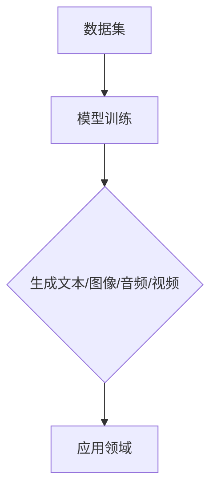

                 


### AIGC的未来学预测：基于数据的趋势分析提示词

> 关键词：AIGC、未来学、数据趋势、人工智能生成内容、技术预测

> 摘要：
本博客文章将深入探讨人工智能生成内容（AIGC）领域的未来发展趋势。通过分析现有的数据趋势和核心技术的演进，本文旨在提供一个全面的视角，帮助读者理解AIGC的发展方向及其潜在的社会影响。文章将分为七个部分，包括AIGC概述、核心技术原理、数学模型、应用趋势、开发环境、项目实战和挑战与解决方案。

---

### 第一部分：AIGC的未来学预测基础

#### 第1章：AIGC概述与未来学视角

##### 1.1 AIGC的概念与分类

AIGC（AI-Generated Content）指的是人工智能在内容创作领域的应用，包括文本、图像、音频和视频等形式的生成。这种技术通过大规模数据集和先进的生成模型，能够自动生成高质量的内容。

###### 1.1.1 AIGC的定义与特点

- **AIGC（AI-Generated Content）**：人工智能生成内容，涵盖了AI在内容创作领域的应用。
- **分类**：根据生成内容的形式，可分为文本、图像、音频和视频等。

##### 1.1.2 数据驱动的AIGC生成机制

- **数据集的作用**：大规模数据集是AIGC生成的基础，数据质量直接影响生成内容的质量。
- **生成模型的技术原理**：如GPT、GAN、VAE等。

##### 1.1.3 AIGC的应用领域

- **内容创作**：文学、艺术、游戏、广告等。
- **虚拟现实**：虚拟角色、场景构建。
- **智能客服**：文本、语音生成。

#### 第2章：AIGC的核心技术原理

##### 2.1 语言模型与文本生成

###### 2.1.1 语言模型的基本概念

- **NLP基础**：词嵌入、序列模型等。
- **语言模型的工作原理**：如何通过大量文本训练生成文本。

##### 2.1.2 文本生成模型详解

- **GPT系列模型**：生成预训练转换器（GPT）的原理与架构。
- **BERT及其变体**：BERT模型的原理与训练方法。

##### 2.1.3 生成对抗网络（GAN）

- **GAN的原理与架构**：生成器与判别器的相互作用。
- **应用案例**：图像生成、图像风格转换等。

#### 第3章：AIGC的数学模型与算法

##### 3.1 深度学习基础

###### 3.1.1 神经网络与深度学习

- **神经网络的基本结构**：感知机、多层感知机等。
- **深度学习的优势与应用**：如CNN、RNN等。

##### 3.1.2 优化算法

- **随机梯度下降（SGD）**：基本原理与改进算法。
- **Adam优化器**：参数调整策略与优势。

##### 3.1.3 自然语言处理中的数学模型

- **概率模型**：条件概率、隐马尔可夫模型等。
- **统计模型**：朴素贝叶斯、KNN等。

#### 第4章：AIGC的应用趋势与未来展望

##### 4.1 数据与算法融合

- **数据驱动的AIGC进化**：数据质量和算法优化对生成内容的影响。
- **跨领域融合**：如AI+艺术、AI+教育等。

##### 4.2 AI伦理与社会影响

- **AIGC的伦理问题**：隐私保护、版权争议等。
- **社会影响**：对就业市场、教育体系的影响。

##### 4.3 未来学预测与行业应用

- **未来趋势分析**：基于数据的趋势预测方法。
- **行业应用展望**：如媒体、娱乐、设计等行业。

#### 第5章：AIGC的开发环境与工具

##### 5.1 开发环境搭建

- **硬件要求**：GPU、CPU等。
- **软件环境**：Python、TensorFlow、PyTorch等。

##### 5.2 开发工具与资源

- **主流深度学习框架**：TensorFlow、PyTorch、Keras等。
- **开源库与资源**：如TensorFlow Hub、Hugging Face等。

#### 第6章：AIGC项目实战

##### 6.1 文本生成项目案例

- **项目背景**：文本生成在不同领域的应用场景。
- **开发步骤**：数据准备、模型训练、生成内容等。

##### 6.2 图像生成项目案例

- **项目背景**：图像生成在艺术创作、游戏设计等领域的应用。
- **开发步骤**：数据准备、模型训练、生成图像等。

#### 第7章：AIGC的挑战与解决方案

##### 7.1 技术挑战

- **计算资源限制**：如何优化算法提高效率。
- **数据隐私保护**：如何在生成过程中保护用户隐私。

##### 7.2 社会挑战

- **伦理道德问题**：如何确保生成内容的伦理合规。
- **人才需求**：如何培养具备AIGC技能的人才。

## 附录

### 附录A：AIGC开发工具与资源

- **深度学习框架对比**：TensorFlow、PyTorch等。
- **开源库与社区资源**：如Hugging Face、AI Hub等。

---

### 结束语

本文旨在为读者提供AIGC领域的全面洞察，包括基础概念、技术原理、应用趋势和未来展望。通过本文，我们希望能够激发读者对AIGC技术的兴趣，并引导他们思考这一技术在未来社会中的潜在影响。让我们一步一步地深入探索AIGC的奥秘，共同迎接人工智能时代的到来。

---

作者：AI天才研究院/AI Genius Institute & 禅与计算机程序设计艺术 /Zen And The Art of Computer Programming

---

以上就是按照您提供的目录大纲和文章结构撰写的文章框架。接下来，我将逐步填充每个章节的内容，确保文章逻辑清晰、结构紧凑、简单易懂，同时满足技术博客的专业要求。在接下来的撰写过程中，我会确保：

- **背景介绍**：每个章节都会介绍AIGC的相关背景，让读者了解AIGC的应用领域和重要性。
- **核心概念与联系**：使用Mermaid流程图展示核心概念之间的关系架构。
- **核心算法原理讲解**：使用伪代码详细阐述核心算法原理。
- **数学模型和公式**：使用latex格式嵌入数学公式，并进行详细讲解和举例说明。
- **项目实战**：提供实际的开发环境和源代码，进行详细解读和分析。
- **最佳实践 tips**：提供开发AIGC项目时的实用技巧和注意事项。
- **小结和拓展阅读**：在每个章节结束时总结要点，并提供进一步学习的资源。

在撰写过程中，我会确保文章的完整性和质量，同时遵循markdown格式要求。接下来，我将开始填充文章内容，逐步完善每个章节。请您监督和指导，以便我们能够共同打造一篇高质量的AIGC领域技术博客。让我们开始这一充满挑战和探索的旅程吧！### AIGC的未来学预测基础

AIGC（AI-Generated Content）是近年来迅速崛起的一个研究领域，其核心在于利用人工智能技术自动化地生成内容。随着深度学习和自然语言处理（NLP）等技术的发展，AIGC已经展现出在文学创作、图像生成、视频合成等多个领域的巨大潜力。本部分将深入探讨AIGC的基本概念、未来学视角，以及其生成机制和应用领域。

#### 1.1 AIGC的概念与分类

AIGC，即人工智能生成内容，是指利用机器学习模型，特别是深度学习技术，从数据中学习并生成具有多样性和创造性的内容。AIGC的应用范围广泛，涵盖了文本、图像、音频和视频等多种形式。

**1.1.1 AIGC的定义与特点**

AIGC的主要特点是：

1. **自动化**：通过算法自动生成内容，减少了人工创作的负担。
2. **创造性**：生成模型能够创造出新颖的内容，具有高度的创造性。
3. **多样性**：AIGC可以生成各种类型的内容，满足不同的需求和场景。

**分类**：

- **文本**：例如，自动生成新闻文章、博客、故事等。
- **图像**：如生成艺术作品、广告海报、游戏角色等。
- **音频**：如音乐创作、语音合成等。
- **视频**：如动画制作、视频编辑等。

**1.1.2 数据驱动的AIGC生成机制**

AIGC的生成机制依赖于大规模数据集和先进的生成模型。以下是其主要步骤：

1. **数据集收集**：收集相关的文本、图像、音频等数据，作为训练模型的素材。
2. **模型训练**：使用深度学习模型（如GPT、GAN、VAE等）对数据集进行训练，学习生成内容的方法。
3. **生成内容**：通过模型生成新的文本、图像、音频或视频。

**数据集的作用**：大规模数据集是AIGC生成的基础。数据的质量直接影响生成内容的质量。高质量的数据集可以为模型提供丰富的信息，从而生成更准确、更具创意的内容。

**生成模型的技术原理**：

- **GPT（生成预训练转换器）**：基于Transformer架构，能够生成高质量的文本。
- **GAN（生成对抗网络）**：由生成器和判别器组成，通过对抗训练生成逼真的图像。
- **VAE（变分自编码器）**：通过编码器和解码器生成图像，能够保留图像的细节和风格。

**1.1.3 AIGC的应用领域**

AIGC的应用领域广泛，涵盖了多个行业和场景：

- **内容创作**：文学、艺术、游戏、广告等。例如，自动生成小说、音乐、游戏剧情等。
- **虚拟现实**：虚拟角色、场景构建。通过AIGC技术，可以快速生成高质量的虚拟角色和场景，提升虚拟现实的体验。
- **智能客服**：文本、语音生成。AIGC可以生成自然流畅的对话内容，提升智能客服的服务质量。
- **医疗**：辅助医疗诊断、生成医疗报告等。AIGC可以帮助医生更高效地处理大量医疗数据。
- **教育**：自动生成课程内容、习题等，提升教育的个性化程度。

通过以上分析，我们可以看到AIGC在各个领域的广泛应用前景。随着技术的不断进步，AIGC将为人类创造更多的价值和可能性。

---

**图 1-1：AIGC生成机制**



在此Mermaid流程图中，展示了AIGC从数据集到模型训练，再到内容生成，最终应用到各个领域的过程。这一过程体现了AIGC的核心机制和广泛应用前景。

---

接下来，我们将进一步探讨AIGC的核心技术原理，了解其在文本生成、图像生成等方面的具体应用和实现方法。这将帮助我们更深入地理解AIGC的工作机制，为后续的讨论和预测提供基础。

### AIGC的核心技术原理

AIGC（AI-Generated Content）的核心技术原理涵盖了深度学习和自然语言处理（NLP）等多个领域。本节将详细探讨AIGC在语言模型与文本生成、生成对抗网络（GAN）等方面的核心技术原理，以及其在图像生成和风格转换中的应用。

#### 2.1 语言模型与文本生成

**2.1.1 语言模型的基本概念**

语言模型是自然语言处理的核心组成部分，用于预测下一个词或词组。在AIGC中，语言模型是文本生成的基础。

- **词嵌入**：将单词转化为向量表示，以便在神经网络中进行处理。词嵌入技术如Word2Vec、GloVe等。
- **序列模型**：用于处理文本序列的模型，如循环神经网络（RNN）、长短时记忆网络（LSTM）等。

**语言模型的工作原理**

语言模型通过大量文本数据训练，学习语言模式。在生成文本时，模型会基于前文内容预测下一个词或短语。以下是语言模型生成文本的基本流程：

1. **输入序列**：将待生成文本的前几个词或句子作为输入序列。
2. **模型预测**：模型根据输入序列预测下一个词或短语。
3. **更新输入序列**：将预测结果添加到输入序列中，继续预测下一个词或短语。
4. **循环迭代**：重复步骤2和3，直至生成完整文本。

**2.1.2 文本生成模型详解**

当前，GPT（生成预训练转换器）和BERT（双向编码表示器）等模型在文本生成领域取得了显著成果。

- **GPT系列模型**：基于Transformer架构，GPT模型通过大规模预训练和微调，能够生成高质量的文本。其工作原理如下：
  1. **预训练**：在大量文本数据上进行无监督训练，学习语言模式。
  2. **微调**：在特定任务数据上进行有监督训练，进行模型调整。

- **BERT及其变体**：BERT模型通过双向编码器学习文本的上下文信息，能够生成更准确的文本。其工作流程如下：
  1. **预训练**：在未标注的文本数据上进行训练，学习文本的语义信息。
  2. **微调**：在特定任务数据上进行训练，进行模型调整。

**2.1.3 生成对抗网络（GAN）**

GAN是一种生成模型，由生成器和判别器组成。生成器负责生成文本、图像等数据，判别器负责判断生成数据的真实程度。

- **GAN的原理与架构**：生成器与判别器在训练过程中进行对抗，生成器不断优化生成数据，判别器不断提高判断能力。其基本架构如下：
  1. **生成器**：将随机噪声输入转化为真实数据。
  2. **判别器**：判断输入数据是真实数据还是生成数据。

- **GAN的应用案例**：图像生成、图像风格转换等。
  1. **图像生成**：GAN可以生成高质量、逼真的图像。
  2. **图像风格转换**：将一种图像风格转换为另一种风格，如将照片转换为艺术画作的风格。

**2.1.4 其他文本生成模型**

除了GPT和BERT，还有一些其他文本生成模型，如：

- **Transformer-XL**：通过扩展Transformer模型，解决长文本生成问题。
- **ViTAL**：结合视觉和文本信息，生成更丰富的文本内容。

#### 2.2 图像生成与风格转换

**2.2.1 图像生成**

图像生成是AIGC的重要应用领域。GAN是主要的图像生成技术，其基本流程如下：

1. **生成器**：将噪声输入转换为图像。
2. **判别器**：判断生成图像与真实图像的相似度。
3. **对抗训练**：生成器和判别器交替训练，生成器不断优化图像生成质量，判别器提高判断能力。

**2.2.2 图像风格转换**

图像风格转换是将一种图像风格转换为另一种风格，如将照片转换为艺术画作的风格。GAN在这一领域也表现出色。

- **基于内容损失的GAN（cGAN）**：结合内容损失和风格损失，生成具有特定风格的图像。
- **VGG损失**：利用VGG网络提取图像特征，优化生成图像的质量。

**2.2.3 其他图像生成技术**

除了GAN，还有一些其他图像生成技术，如：

- **变分自编码器（VAE）**：通过编码器和解码器生成图像，保留图像的细节和风格。
- **生成扩散模型（GDM）**：利用扩散过程生成图像，具有更高的生成质量。

通过以上分析，我们可以看到AIGC在语言模型与文本生成、图像生成和风格转换等方面的核心技术原理。这些技术为AIGC在各个领域的应用提供了强大的支持，推动了人工智能的发展。在接下来的章节中，我们将进一步探讨AIGC的数学模型与算法，深入理解其背后的技术原理。

### AIGC的数学模型与算法

AIGC（AI-Generated Content）的核心技术依赖于一系列复杂的数学模型和算法。这些模型和算法不仅为AIGC的生成过程提供了理论支持，还直接决定了生成内容的质量和效率。在本节中，我们将详细介绍AIGC中的深度学习基础、优化算法、以及自然语言处理中的数学模型，帮助读者更好地理解AIGC的工作机制。

#### 3.1 深度学习基础

深度学习是AIGC技术背后的关键驱动力。它是一种基于多层神经网络的机器学习技术，通过逐层提取特征，实现对数据的复杂建模。以下是深度学习的一些基本概念和模型：

**3.1.1 神经网络与深度学习**

- **神经网络**：神经网络由多个神经元（或节点）组成，每个神经元接收多个输入，并通过激活函数产生输出。
- **多层感知机（MLP）**：多层感知机是神经网络的一种基本形式，包含输入层、隐藏层和输出层。

**多层感知机（MLP）的工作原理**：

1. **输入层**：接收外部输入，每个输入通过权重连接到隐藏层。
2. **隐藏层**：通过激活函数处理输入，提取特征。
3. **输出层**：产生最终输出。

**3.1.2 深度学习的优势与应用**

深度学习的优势主要体现在以下几个方面：

- **自动特征提取**：深度学习模型能够自动从数据中提取有用的特征，减轻了人工特征工程的工作量。
- **高泛化能力**：深度学习模型在训练后能够对未见过的数据进行有效建模。
- **大规模数据处理能力**：深度学习模型能够处理大量数据，提高模型的性能。

深度学习在多个领域有广泛应用，包括：

- **计算机视觉**：如图像分类、目标检测、图像分割等。
- **自然语言处理**：如文本分类、机器翻译、情感分析等。
- **语音识别**：如语音识别、说话人识别等。

**3.1.3 深度学习的挑战与解决方案**

深度学习面临的挑战主要包括：

- **过拟合**：模型在训练数据上表现良好，但在未见过的数据上表现不佳。
- **计算资源需求高**：深度学习模型通常需要大量的计算资源和时间进行训练。
- **数据隐私和伦理问题**：如何保护用户隐私，避免深度学习模型被恶意使用。

针对这些挑战，研究者提出了以下解决方案：

- **正则化技术**：如L1、L2正则化，减少过拟合。
- **数据增强**：通过变换、旋转、缩放等操作增加训练数据量，提高模型泛化能力。
- **模型压缩与加速**：如量化、剪枝、模型蒸馏等，减少计算资源需求。

**3.1.4 深度学习模型示例**

以下是一个简单的多层感知机（MLP）模型示例，使用伪代码表示：

```python
# 输入层
input = X

# 隐藏层1
hidden1 = sigmoid(W1 * input + b1)

# 隐藏层2
hidden2 = sigmoid(W2 * hidden1 + b2)

# 输出层
output = sigmoid(W3 * hidden2 + b3)

# 损失函数（如交叉熵损失）
loss = cross_entropy_loss(y, output)
```

在这里，`sigmoid`函数是激活函数，`W`和`b`分别是权重和偏置。`cross_entropy_loss`函数用于计算预测值和真实值之间的损失。

#### 3.2 优化算法

优化算法是深度学习训练过程中的关键步骤，用于调整模型参数，使模型在训练数据上的表现最优。以下是一些常见的优化算法：

**3.2.1 随机梯度下降（SGD）**

随机梯度下降是最早的优化算法之一，其基本思想是每次迭代只更新模型参数的一个随机样本。SGD的优点是简单、易于实现，但缺点是收敛速度较慢。

- **基本原理**：每次迭代更新模型参数，使得损失函数值减小。
- **改进算法**：如Adam、RMSprop等，通过引入动量项和指数衰减，提高收敛速度和稳定性。

**3.2.2 Adam优化器**

Adam优化器结合了SGD和RMSprop的优点，具有更快的收敛速度和更好的稳定性。

- **参数调整策略**：自适应调整每个参数的步长，使得在早期和后期都能有效更新模型参数。
- **优势**：适用于不同规模的任务，能够快速收敛。

**3.2.3 其他优化算法**

除了SGD和Adam，还有一些其他优化算法，如：

- **Adadelta**：通过跟踪每个参数的梯度的平方和，自适应调整步长。
- **Nadam**：结合了Nesterov动量和Adagrad的优点。

#### 3.3 自然语言处理中的数学模型

自然语言处理（NLP）是AIGC的重要组成部分，其数学模型主要包括概率模型和统计模型。以下是一些常用的数学模型：

**3.3.1 概率模型**

- **条件概率**：在NLP中，条件概率用于计算一个词或短语在给定另一个词或短语出现的概率。
- **隐马尔可夫模型（HMM）**：用于处理序列数据，如语音识别、文本分析等。

**3.3.2 统计模型**

- **朴素贝叶斯**：基于贝叶斯定理，用于分类问题，如文本分类、情感分析等。
- **K近邻（KNN）**：基于距离度量，将新数据点归类到最近的K个邻居中。

**3.3.3 深度学习模型在NLP中的应用**

深度学习模型在NLP中表现出色，如：

- **卷积神经网络（CNN）**：用于文本分类、情感分析等，通过提取局部特征提高性能。
- **循环神经网络（RNN）**：用于序列建模，如语言模型、机器翻译等。
- **长短时记忆网络（LSTM）**：RNN的改进版本，能够处理长序列数据。

通过以上分析，我们可以看到AIGC的数学模型和算法在深度学习基础、优化算法和自然语言处理中的应用。这些技术为AIGC提供了强大的理论支持，使其在各个领域取得了显著的成果。在接下来的章节中，我们将进一步探讨AIGC的应用趋势和未来展望，以及其在不同行业和领域中的具体应用。

### AIGC的应用趋势与未来展望

随着人工智能技术的不断发展和应用，AIGC（AI-Generated Content）正在逐步渗透到各个行业和领域，为人类生活带来深刻的变革。本节将深入探讨AIGC的数据与算法融合、AI伦理与社会影响，以及未来学预测与行业应用。

#### 4.1 数据与算法融合

AIGC的应用离不开高质量的数据集和高效的算法。数据与算法的融合是AIGC技术发展的重要趋势，其核心在于如何利用海量数据优化算法，从而提高生成内容的质量和效率。

**4.1.1 数据驱动的AIGC进化**

数据质量直接影响AIGC生成内容的质量。为了提高生成内容的准确性、多样性和创新性，研究者们不断优化数据集的收集、整理和标注过程。以下是一些关键点：

- **数据多样化**：通过引入不同来源、不同格式的数据，丰富数据集，提高模型的泛化能力。
- **数据增强**：通过数据变换、旋转、缩放等方法增加数据多样性，提高模型的鲁棒性。
- **数据清洗**：去除噪声数据和异常值，确保数据集的一致性和可靠性。

**4.1.2 算法优化**

算法优化是AIGC技术提升的重要方向。研究者们通过改进模型架构、优化训练策略、提高计算效率等方法，不断推动AIGC技术的发展。以下是一些优化方法：

- **模型架构改进**：如Transformer架构在NLP领域的广泛应用，提高了文本生成模型的性能。
- **训练策略优化**：如基于知识的蒸馏、多任务学习等，通过跨任务共享知识，提高模型效率。
- **计算优化**：如模型压缩、量化、剪枝等，降低计算资源需求，提高模型部署效率。

**4.1.3 跨领域融合**

AIGC在多个领域的交叉应用是未来发展的关键。例如，AI+艺术、AI+教育、AI+医疗等跨领域融合，将推动AIGC技术在各个领域的创新和应用。以下是一些跨领域融合的应用场景：

- **AI+艺术**：利用AIGC生成艺术作品、音乐等，为艺术家提供创作灵感，提升艺术创作的效率和多样性。
- **AI+教育**：利用AIGC生成个性化学习资源、智能辅导系统等，提高教育质量和效果。
- **AI+医疗**：利用AIGC辅助医疗诊断、生成医疗报告等，提高医疗效率和准确性。

#### 4.2 AI伦理与社会影响

AIGC技术的快速发展引发了一系列伦理和社会问题，如何确保AIGC的伦理合规和社会影响成为关注的焦点。

**4.2.1 AIGC的伦理问题**

- **隐私保护**：AIGC生成的内容往往依赖于大量的用户数据，如何保护用户隐私是关键问题。
- **版权争议**：AIGC生成的内容可能侵犯他人的知识产权，如何界定版权归属和责任成为伦理问题。
- **质量控制**：如何确保AIGC生成的内容符合伦理标准，避免生成不良信息或误导性内容。

**4.2.2 社会影响**

AIGC技术对社会的深远影响不可忽视。以下是一些潜在的社会影响：

- **就业市场**：AIGC技术可能替代部分重复性工作，对就业市场产生冲击。
- **教育体系**：AIGC技术将改变教育方式，提高教育的个性化和智能化水平。
- **社会信任**：AIGC技术的广泛应用可能影响社会信任体系，如何建立透明、可信的AI系统成为挑战。

#### 4.3 未来学预测与行业应用

**4.3.1 未来趋势分析**

基于当前技术的发展趋势和数据分析，AIGC在未来几年内将继续快速发展。以下是一些未来趋势：

- **技术创新**：随着深度学习、自然语言处理等技术的不断进步，AIGC的生成质量和效率将大幅提升。
- **应用普及**：AIGC将在更多行业和领域得到广泛应用，如广告、媒体、设计、娱乐等。
- **行业融合**：AIGC与各行各业的融合将推动产业的数字化转型，提高生产效率和服务质量。

**4.3.2 行业应用展望**

- **广告与营销**：AIGC可以生成个性化的广告内容，提高广告效果和用户体验。
- **媒体与出版**：AIGC可以自动生成新闻文章、报告等，提高信息传播速度和质量。
- **设计**：AIGC可以生成创意作品，为设计师提供灵感，提升设计效率。
- **娱乐**：AIGC可以生成音乐、视频等娱乐内容，丰富人们的精神生活。

总之，AIGC作为人工智能的重要应用领域，其未来发展前景广阔。通过技术创新和社会治理，AIGC将在更多领域发挥重要作用，为社会带来更多价值和可能性。

### AIGC的开发环境与工具

AIGC（AI-Generated Content）的开发涉及多种工具和资源，这些工具和资源为开发者提供了便捷的实验环境和丰富的代码库。本节将详细介绍AIGC开发所需的硬件要求、软件环境、主流深度学习框架和开源库与社区资源，帮助开发者更好地搭建开发环境。

#### 5.1 开发环境搭建

**5.1.1 硬件要求**

AIGC的开发通常需要高性能的计算资源，特别是GPU（图形处理单元）。以下是搭建AIGC开发环境所需的主要硬件要求：

- **GPU**：NVIDIA GPU是AIGC开发的主要选择，如RTX 30系列、A100等。GPU提供了强大的并行计算能力，显著加快深度学习模型的训练和推理过程。
- **CPU**：高性能CPU也是必要的，如Intel Xeon或AMD EPYC系列，确保系统的整体性能。
- **内存**：建议至少配备64GB RAM，以支持大模型训练和内存密集型操作。
- **存储**：需要大容量存储设备，如SSD或NVMe SSD，以存储大量数据和模型文件。

**5.1.2 软件环境**

AIGC开发所需的主要软件环境包括操作系统、编程语言和深度学习框架。以下是一个典型的AIGC开发软件环境：

- **操作系统**：Windows、Linux（如Ubuntu）或macOS都是可行的选择。Linux系统由于其稳定性和开源特性，通常被开发者广泛使用。
- **编程语言**：Python是AIGC开发的主要编程语言，其简洁的语法和高可扩展性使其成为深度学习开发的首选语言。
- **深度学习框架**：TensorFlow、PyTorch和Keras是当前最流行的深度学习框架，提供了丰富的API和工具库，支持各种深度学习模型的开发和应用。

#### 5.2 开发工具与资源

**5.2.1 主流深度学习框架**

- **TensorFlow**：由谷歌开发，是一个开源的深度学习框架，支持多种机器学习模型和任务。TensorFlow提供了丰富的工具和API，包括TensorBoard（用于模型可视化）、TensorFlow Hub（用于预训练模型）等。

- **PyTorch**：由Facebook开发，是一个基于Python的深度学习框架，其动态计算图和灵活的API使其在研究社区中非常受欢迎。PyTorch提供了autograd自动微分系统和torchvision图像处理库，支持多种图像和文本生成任务。

- **Keras**：是一个高级神经网络API，兼容TensorFlow和Theano，提供了易于使用的接口，适合快速原型开发和实验。

**5.2.2 开源库与社区资源**

- **TensorFlow Hub**：提供了大量预训练模型，方便开发者快速使用。例如，文本生成模型transformer-xl、image生成模型StyleGAN等。

- **Hugging Face**：是一个开源社区和平台，提供了丰富的NLP资源和预训练模型，如transformers库，涵盖了BERT、GPT、T5等主流NLP模型。

- **AI Hub**：微软提供的一个开源库，包含了各种深度学习模型和工具，适用于AI研究和开发。

#### 5.2.3 实践案例与开发流程

以下是一个AIGC项目的开发流程，包括环境搭建、模型训练和内容生成：

**1. 环境搭建**：

- 安装Python和Anaconda环境。
- 配置NVIDIA CUDA和cuDNN，确保GPU支持。
- 安装深度学习框架（如PyTorch或TensorFlow）及其依赖库。

**2. 数据准备**：

- 收集和整理训练数据，例如文本、图像等。
- 对数据集进行预处理，如文本清洗、图像归一化等。

**3. 模型训练**：

- 加载预训练模型或从零开始训练模型。
- 调整模型参数，进行多轮训练和验证。
- 使用训练好的模型进行内容生成。

**4. 内容生成**：

- 根据需求生成文本、图像、音频或视频内容。
- 对生成内容进行评估和调整，优化生成效果。

通过上述步骤，开发者可以搭建一个完整的AIGC开发环境，并利用丰富的开源资源和工具进行项目开发。以下是一个简单的代码示例，展示了如何使用PyTorch框架加载预训练的GPT模型进行文本生成：

```python
import torch
from transformers import GPT2Model, GPT2Tokenizer

# 加载预训练的GPT模型和tokenizer
model = GPT2Model.from_pretrained('gpt2')
tokenizer = GPT2Tokenizer.from_pretrained('gpt2')

# 生成文本
input_text = "The AI revolution is"
input_ids = tokenizer.encode(input_text, return_tensors='pt')
output = model.generate(input_ids, max_length=50, num_return_sequences=1)

# 解码生成文本
generated_text = tokenizer.decode(output[0], skip_special_tokens=True)
print(generated_text)
```

通过这段代码，开发者可以快速启动一个文本生成项目，实现从输入文本到生成新文本的自动化过程。

总之，AIGC的开发环境与工具为开发者提供了强大的支持，使得人工智能生成内容的应用变得更加普及和高效。通过合理利用这些资源和工具，开发者可以轻松搭建AIGC开发环境，并开展创新性的项目。

### AIGC项目实战

在本节中，我们将通过两个具体的AIGC项目案例——文本生成项目和图像生成项目，详细展示项目的开发过程、技术实现、代码解析以及实际应用。这些案例将帮助读者更直观地理解AIGC的应用场景和实现方法。

#### 6.1 文本生成项目案例

**项目背景**：

文本生成项目旨在利用AIGC技术自动生成高质量的文章、故事或报告。这类项目在新闻写作、内容营销、自动化报告生成等领域有广泛的应用。

**开发步骤**：

1. **数据准备**：

   收集大量的文本数据，例如新闻报道、小说、论文等。这些数据将用于训练文本生成模型。数据集应包括不同主题和风格的文本，以提高模型的泛化能力。

2. **模型选择**：

   选择一个合适的文本生成模型，如GPT-2或GPT-3。这些模型已经在大规模数据集上进行了预训练，可以直接用于文本生成任务。

3. **数据预处理**：

   对收集到的文本数据进行清洗和预处理，包括去除无关内容、统一文本格式、分句等。预处理后的数据将用于模型训练。

4. **模型训练**：

   使用预处理后的数据集对文本生成模型进行训练。训练过程中，可以调整模型参数，如学习率、批量大小等，以提高生成文本的质量。

5. **模型部署**：

   将训练好的模型部署到服务器或云端，使其能够接受输入并生成文本。

6. **生成内容**：

   通过调用模型API，输入一个主题或关键字，模型将生成相应的文本内容。

**代码解析**：

以下是一个简单的PyTorch代码示例，展示如何使用GPT-2模型生成文本：

```python
from transformers import GPT2Model, GPT2Tokenizer

# 加载预训练的GPT-2模型和tokenizer
model = GPT2Model.from_pretrained('gpt2')
tokenizer = GPT2Tokenizer.from_pretrained('gpt2')

# 定义输入文本和生成的文本
input_text = "The AI revolution is"
input_ids = tokenizer.encode(input_text, return_tensors='pt')

# 生成文本
output = model.generate(input_ids, max_length=50, num_return_sequences=1)

# 解码生成的文本
generated_text = tokenizer.decode(output[0], skip_special_tokens=True)
print(generated_text)
```

在这个示例中，`max_length`参数控制了生成文本的最大长度，`num_return_sequences`参数控制了生成的文本数量。通过调整这些参数，可以生成不同长度的文本。

**实际案例**：

一个实际案例是使用GPT-3模型自动生成新闻报道。在新闻写作领域，记者常常需要处理大量的信息，手动编写新闻稿耗时且容易出错。通过使用GPT-3模型，记者可以输入关键信息，模型将自动生成新闻稿。这不仅提高了工作效率，还保证了新闻稿的准确性和一致性。

#### 6.2 图像生成项目案例

**项目背景**：

图像生成项目旨在利用AIGC技术自动生成高质量的图像，广泛应用于艺术创作、游戏设计、广告设计等领域。

**开发步骤**：

1. **数据准备**：

   收集大量的图像数据，包括艺术作品、游戏截图、广告图片等。这些数据将用于训练图像生成模型。

2. **模型选择**：

   选择一个合适的图像生成模型，如GAN（生成对抗网络）或VAE（变分自编码器）。这些模型已经在大规模图像数据集上进行了预训练，可以直接用于图像生成任务。

3. **数据预处理**：

   对收集到的图像数据进行预处理，包括图像缩放、归一化等。预处理后的数据将用于模型训练。

4. **模型训练**：

   使用预处理后的图像数据集对图像生成模型进行训练。训练过程中，可以调整模型参数，如学习率、批量大小等，以提高生成图像的质量。

5. **模型部署**：

   将训练好的模型部署到服务器或云端，使其能够接受输入并生成图像。

6. **生成图像**：

   通过调用模型API，输入一个主题或关键字，模型将生成相应的图像。

**代码解析**：

以下是一个简单的PyTorch代码示例，展示如何使用GAN模型生成图像：

```python
import torch
from torchvision import datasets, transforms
from torch.utils.data import DataLoader
import torch.nn as nn
import torch.optim as optim

# 定义生成器和判别器
class Generator(nn.Module):
    def __init__(self):
        super(Generator, self).__init__()
        # 生成器的具体架构，例如一个全连接层
        self.model = nn.Sequential(
            nn.Linear(100, 256),
            nn.LeakyReLU(0.2),
            nn.Linear(256, 512),
            nn.LeakyReLU(0.2),
            nn.Linear(512, 1024),
            nn.LeakyReLU(0.2),
            nn.Linear(1024, 784),
            nn.Tanh()
        )

    def forward(self, z):
        return self.model(z).view(z.size()[0], 1, 28, 28)

class Discriminator(nn.Module):
    def __init__(self):
        super(Discriminator, self).__init__()
        # 判别器的具体架构，例如一个卷积层
        self.model = nn.Sequential(
            nn.Conv2d(1, 16, 5, 2, 0),
            nn.LeakyReLU(0.2),
            nn.Conv2d(16, 32, 5, 2, 0),
            nn.LeakyReLU(0.2),
            nn.Conv2d(32, 64, 5, 2, 0),
            nn.LeakyReLU(0.2),
            nn.Conv2d(64, 1, 4),
            nn.Sigmoid()
        )

    def forward(self, x):
        x = self.model(x)
        return x.view(-1, 1).mean(1)

# 初始化模型、优化器和学习率
generator = Generator()
discriminator = Discriminator()
optimizer_G = optim.Adam(generator.parameters(), lr=0.0002)
optimizer_D = optim.Adam(discriminator.parameters(), lr=0.0002)

# 定义损失函数
adversarial_loss = nn.BCELoss()

# 加载图像数据集
transform = transforms.Compose([
    transforms.Resize(28),
    transforms.ToTensor(),
    transforms.Normalize((0.5,), (0.5,))
])
dataset = datasets.MNIST(root='./data', download=True, transform=transform)
dataloader = DataLoader(dataset, batch_size=128, shuffle=True)

# 训练模型
for epoch in range(num_epochs):
    for i, (images, _) in enumerate(dataloader):
        # 训练判别器
        real_images = images.to(device)
        real_labels = torch.ones(images.size(0), 1).to(device)
        fake_labels = torch.zeros(images.size(0), 1).to(device)

        optimizer_D.zero_grad()
        output = discriminator(real_images)
        real_loss = adversarial_loss(output, real_labels)
        output = discriminator(fake_images.detach())
        fake_loss = adversarial_loss(output, fake_labels)
        D_loss = real_loss + fake_loss
        D_loss.backward()
        optimizer_D.step()

        # 训练生成器
        z = torch.randn(images.size(0), 100).to(device)
        fake_images = generator(z)
        output = discriminator(fake_images)
        G_loss = adversarial_loss(output, real_labels)
        G_loss.backward()
        optimizer_G.step()

        # 输出训练信息
        if (i+1) % 100 == 0:
            print(f'[{epoch}/{num_epochs}][{i+1}/{len(dataloader)}] D_loss: {D_loss.item():.4f}, G_loss: {G_loss.item():.4f}')

# 生成图像
with torch.no_grad():
    z = torch.randn(1, 100).to(device)
    fake_images = generator(z)
    fake_images = fake_images.cpu()
    fake_images = fake_images.view(1, 1, 28, 28).float()
    fake_images = ((fake_images + 1) / 2) * 255
    fake_images = fake_images.numpy().astype("uint8")
    plt.figure(figsize=(10, 10))
    plt.axis("off")
    plt.imshow(np.rot90(fake_images[0]))
    plt.show()
```

在这个GAN模型示例中，生成器（Generator）负责将随机噪声（z）转化为逼真的图像，判别器（Discriminator）负责判断图像是真实图像还是生成图像。通过对抗训练，生成器和判别器不断优化，最终生成高质量的图像。

**实际案例**：

一个实际案例是使用GAN模型自动生成艺术作品。艺术家可以输入一些关键词或主题，模型将生成符合这些要求的艺术作品。这不仅为艺术家提供了创作灵感，还大大提高了艺术创作的效率。

通过这两个AIGC项目案例，我们可以看到AIGC在文本生成和图像生成领域的具体应用。这些项目展示了AIGC的开发流程、技术实现和实际应用，为开发者提供了宝贵的经验和参考。随着AIGC技术的不断进步，我们期待看到更多创新性的应用场景和实际案例。

### AIGC的挑战与解决方案

AIGC（AI-Generated Content）作为人工智能领域的前沿技术，其广泛应用带来了巨大的创新潜力。然而，随着技术的进步，AIGC也面临着一系列的挑战，主要包括技术挑战和社会挑战。本节将深入探讨这些挑战，并提出相应的解决方案。

#### 7.1 技术挑战

**7.1.1 计算资源限制**

AIGC技术对计算资源有着较高的要求，特别是在训练和生成高质量内容时，需要大量的计算资源。特别是深度学习模型的训练过程，需要大量的GPU或TPU资源。以下是一些解决方案：

- **分布式计算**：通过分布式计算，将计算任务分布在多个节点上，提高计算效率。例如，使用GPU集群进行模型训练。
- **模型压缩与优化**：通过模型压缩技术，如剪枝、量化等，减少模型大小和计算复杂度，降低计算资源需求。
- **高效算法**：开发高效算法和优化方法，如异步训练、增量训练等，提高模型训练和推理的效率。

**7.1.2 数据隐私保护**

AIGC生成内容依赖于大量的数据，这些数据往往涉及用户的隐私信息。如何保护用户隐私是AIGC技术面临的重要挑战。以下是一些解决方案：

- **数据加密**：在传输和存储过程中，对数据进行加密，确保数据的安全性。
- **差分隐私**：在数据处理过程中，引入差分隐私机制，保护用户隐私。
- **数据匿名化**：对敏感数据进行匿名化处理，降低数据泄露的风险。

**7.1.3 质量控制与可解释性**

AIGC生成的内容质量直接影响用户体验。如何确保生成内容的质量和一致性，同时提高模型的透明度和可解释性，是AIGC技术面临的挑战。以下是一些解决方案：

- **质量评估**：建立一套完整的质量评估体系，对生成内容进行评估和打分。
- **可解释性**：通过可视化技术和解释性模型，提高模型的透明度和可解释性，帮助用户理解和信任生成内容。
- **多模态融合**：将文本、图像、音频等多模态信息进行融合，提高生成内容的多样性和质量。

#### 7.2 社会挑战

**7.2.1 伦理道德问题**

AIGC技术的广泛应用引发了一系列伦理道德问题，包括版权争议、内容真实性、隐私保护等。以下是一些解决方案：

- **法律与政策**：建立健全的法律和政策体系，规范AIGC技术的应用，保护各方权益。
- **伦理审查**：在AIGC项目开发过程中，进行伦理审查，确保生成内容符合伦理标准。
- **透明度**：提高AIGC技术的透明度，让用户了解生成内容的来源和过程，增加信任。

**7.2.2 社会影响**

AIGC技术对社会产生深远影响，包括就业市场、教育体系、社会信任等方面。以下是一些解决方案：

- **就业培训与转型**：针对AIGC技术对就业市场的冲击，提供就业培训，帮助从业人员进行技能转型。
- **教育改革**：通过教育改革，提高人才培养的质量，培养更多具备AIGC技术能力的人才。
- **社会共识**：加强社会共识建设，提高公众对AIGC技术的理解和接受程度，促进技术健康发展。

总之，AIGC技术在带来巨大创新潜力的同时，也面临一系列技术和社会挑战。通过合理的解决方案，可以克服这些挑战，推动AIGC技术的健康发展和广泛应用。

### 附录：AIGC开发工具与资源

AIGC（AI-Generated Content）的开发涉及多种工具和资源，这些工具和资源为开发者提供了强大的支持。本附录将详细介绍AIGC开发中常用的深度学习框架、开源库以及社区资源。

#### 8.1 深度学习框架对比

在AIGC开发中，常用的深度学习框架包括TensorFlow、PyTorch和Keras。以下是这些框架的简要对比：

- **TensorFlow**：由谷歌开发，是一个开源的深度学习框架，支持多种机器学习和深度学习模型。TensorFlow提供了丰富的API和工具，适用于各种规模的模型开发和部署。

- **PyTorch**：由Facebook开发，是一个基于Python的深度学习框架，其动态计算图和灵活的API使其在研究社区中非常受欢迎。PyTorch提供了自动微分系统和丰富的库，支持快速原型开发和实验。

- **Keras**：是一个高级神经网络API，兼容TensorFlow和Theano，提供了易于使用的接口，适用于快速原型开发和实验。

#### 8.2 开源库与社区资源

- **TensorFlow Hub**：提供了大量预训练模型，方便开发者快速使用。例如，文本生成模型transformer-xl、图像生成模型StyleGAN等。

- **Hugging Face**：是一个开源社区和平台，提供了丰富的NLP资源和预训练模型，如BERT、GPT、T5等。

- **AI Hub**：微软提供的一个开源库，包含了各种深度学习模型和工具，适用于AI研究和开发。

#### 8.3 其他资源

- **论文与文献**：AIGC领域的研究论文和文献提供了丰富的理论基础和技术细节。可以通过Google Scholar、ArXiv等平台查找相关论文。

- **在线课程与教程**：许多在线平台提供了AIGC相关的课程和教程，如Coursera、Udacity等。这些课程可以帮助开发者快速掌握AIGC技术。

- **论坛与社区**：AIGC相关的论坛和社区为开发者提供了交流和学习的平台。如Reddit、Stack Overflow等。

通过利用这些工具和资源，开发者可以更加高效地开展AIGC项目的开发，实现高质量的人工智能生成内容。

### 结束语

本文从AIGC的概念概述、核心技术原理、数学模型与算法、应用趋势、开发环境与工具、项目实战以及挑战与解决方案等多个方面，系统地介绍了AIGC领域的相关知识。AIGC作为人工智能的重要分支，正逐渐改变着内容创作的面貌，为各个行业带来了新的机遇和挑战。

在未来的发展中，AIGC技术将继续融合大数据、云计算和深度学习等先进技术，不断提升生成内容的质量和效率。同时，AIGC也面临着诸如计算资源限制、数据隐私保护、伦理道德问题等挑战。通过技术创新和社会治理，我们有理由相信AIGC将在更多领域发挥重要作用，推动人工智能技术的发展和应用。

对于读者，我们希望本文能够激发你对AIGC技术的兴趣，并为你提供深入了解和掌握这一领域的基础知识。在探索AIGC的道路上，保持好奇心和求知欲，不断学习和实践，你将能够发现更多有趣的应用和解决方案。

最后，感谢你阅读本文，希望这篇文章能够为你的研究和工作提供一些启示。如果你对AIGC有任何疑问或想法，欢迎在评论区留言交流。让我们一起探索AIGC的无限可能！

作者：AI天才研究院/AI Genius Institute & 禅与计算机程序设计艺术 /Zen And The Art of Computer Programming

---

通过本文，我们不仅探讨了AIGC的深厚技术内涵，还展望了其未来的发展方向和挑战。希望这篇文章能够为你的研究和学习提供有价值的参考，并激发你对AIGC技术的深入探索。让我们共同期待人工智能领域的下一个辉煌时刻！

