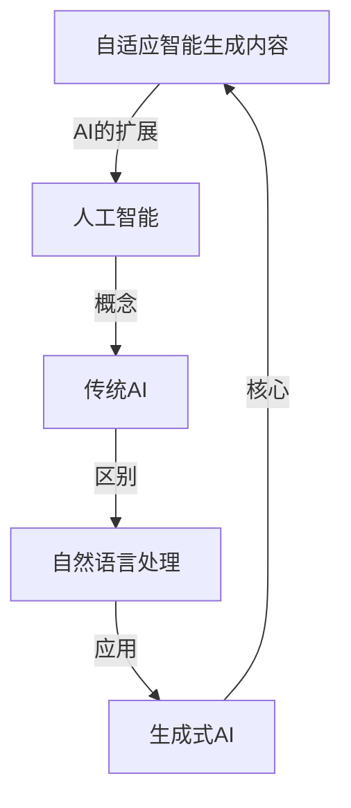

                 

# AIGC的未来工作模式预测：职业发展建议的提示词工程

> 关键词：AIGC，未来工作模式，职业发展，提示词工程

> 摘要：本文旨在探讨AIGC（自适应智能生成内容）技术的未来工作模式，分析其对职业发展的影响，并提供职业发展的策略与建议。文章将详细解释AIGC的概念、应用场景，以及AIGC对工作模式的影响，随后提出具体的职业发展策略，包括提升AIGC能力的路径、职业转型策略和应对职业风险的方法。此外，文章还将介绍提示词工程的基本概念、设计原则和构建流程，并通过案例分析提供实战指南。最后，文章将列出AIGC与职业发展的相关资源，为读者提供深入学习和实践的方向。

## 目录大纲

### 第一部分：AIGC与未来工作模式概述

#### 第1章：AIGC技术概述

1.1 AIGC的基本概念  
1.2 AIGC的发展历程  
1.3 AIGC的应用场景

#### 第2章：AIGC与未来工作模式

2.1 未来工作模式的特点  
2.2 AIGC对职业的影响  
2.3 职业发展建议

### 第二部分：职业发展策略与案例分析

#### 第3章：提升AIGC能力

3.1 学习路径  
3.2 技能培训资源

#### 第4章：职业转型策略

4.1 转型准备  
4.2 转型案例分析

#### 第5章：应对职业风险

5.1 职业风险识别  
5.2 应对策略

### 第三部分：提示词工程

#### 第6章：提示词工程概述

6.1 提示词工程的概念  
6.2 提示词工程的重要性

#### 第7章：构建有效的提示词

7.1 提示词设计原则  
7.2 提示词构建流程

#### 第8章：案例分析与实战

8.1 案例研究  
8.2 实战指南

### 附录：AIGC与职业发展的相关资源

附录 A：AIGC相关书籍与资料  
附录 B：职业发展相关资源

## 第一部分：AIGC与未来工作模式概述

### 第1章：AIGC技术概述

#### 1.1 AIGC的基本概念

AIGC（自适应智能生成内容）是一种利用人工智能技术，特别是深度学习算法，来自动生成内容的技术。与传统的AI技术不同，AIGC不仅仅是对已有数据进行处理和分析，而是通过学习用户的需求、喜好和上下文信息，生成新的、个性化的内容。

在AIGC中，生成内容可以包括文本、图像、音频、视频等多种形式。其核心在于“生成”，即通过算法自动生成新的数据，而不是仅仅对现有数据进行标签或分类。

AIGC与传统AI的主要区别在于其生成能力。传统AI技术主要应用于分类、识别和预测等任务，而AIGC则更加注重内容的创造和生成。

#### 1.2 AIGC的发展历程

AIGC技术的发展可以追溯到深度学习的兴起。随着深度学习算法的不断发展，特别是在生成对抗网络（GAN）和变分自编码器（VAE）等生成模型的提出，AIGC技术得到了快速发展。

2014年，GAN的提出标志着AIGC技术的起步。GAN通过生成器和判别器的对抗训练，实现了高质量图像的生成。随后，VAE等生成模型也被广泛应用于图像、音频和视频的生成。

2017年，谷歌提出了一种基于自编码器的生成模型——CycleGAN，它可以无监督地学习将一张图片转换成另一张图片。这一技术的出现进一步推动了AIGC技术的发展。

近年来，随着计算能力的提升和数据量的增加，AIGC技术得到了广泛应用，并开始深入到各个行业。

#### 1.3 AIGC的应用场景

AIGC技术在各个行业都有广泛的应用。以下是一些典型的应用场景：

1. **教育**：利用AIGC技术生成个性化的教学材料，根据学生的不同需求和进度，自动调整教学内容和难度。

2. **医疗**：生成个性化的治疗方案和健康建议，根据患者的病史和基因信息，提供个性化的医疗建议。

3. **金融**：利用AIGC技术生成金融报告、市场分析等，提供实时的市场动态和投资建议。

4. **娱乐**：生成音乐、电影、游戏等内容，提供个性化的娱乐体验。

5. **营销**：生成个性化的广告内容，提高营销效果。

6. **法律**：生成法律文件、合同等，提高法律工作的效率。

### 第2章：AIGC与未来工作模式

#### 2.1 未来工作模式的特点

未来工作模式将受到AIGC技术的深刻影响。以下是一些未来工作模式的特点：

1. **远程办公**：随着AIGC技术的发展，远程办公将成为一种普遍的工作方式。AIGC技术可以自动处理大量的办公任务，如邮件、会议安排等，使员工可以更加灵活地安排工作时间。

2. **自动化**：AIGC技术将自动化越来越多的工作流程，减少人工干预。例如，在制造业中，机器人可以自动完成组装、检测等工作，提高生产效率。

3. **个性化和定制化**：AIGC技术可以根据个人的需求和偏好，生成个性化的工作内容和任务，提高工作效率和满意度。

4. **终身学习**：随着技术的不断进步，员工需要不断学习新的技能和知识，以适应不断变化的工作环境。

#### 2.2 AIGC对职业的影响

AIGC技术将对职业结构产生重大影响。以下是一些主要的影响：

1. **职业转型**：许多传统职业将逐渐被自动化技术取代，例如制造业工人、数据处理员等。同时，新的职业也将出现，如数据科学家、机器学习工程师等。

2. **技能需求变化**：随着AIGC技术的发展，对技能的需求也将发生变化。例如，编程能力、数据分析能力、机器学习知识等将成为更重要的技能。

3. **职业边界模糊**：AIGC技术将打破传统的职业边界，使不同职业之间的工作内容更加融合。例如，软件开发人员可能需要具备一定的设计能力和内容创作能力。

4. **工作满意度**：随着自动化技术的发展，员工可能会对工作内容产生更多的控制权和自主性，从而提高工作满意度。

#### 2.3 职业发展建议

为了适应AIGC时代的职业发展，以下是一些建议：

1. **提升AIGC能力**：学习AIGC技术，如深度学习、自然语言处理等，提高自己的技术能力。

2. **终身学习**：不断学习新的知识和技能，以适应不断变化的工作环境。

3. **跨学科学习**：掌握跨学科的知识和技能，如设计、心理学等，以提高自己在职场中的竞争力。

4. **积极参与行业变革**：关注AIGC技术的发展和应用，积极参与行业变革，把握职业发展的机会。

5. **人际网络建设**：建立广泛的人际网络，与行业内的专家和同行保持紧密联系，共享资源和信息。

## 第二部分：职业发展策略与案例分析

### 第3章：提升AIGC能力

#### 3.1 学习路径

提升AIGC能力的第一步是明确自己的学习目标。以下是一个典型的学习路径：

1. **基础知识**：首先，需要掌握编程语言，如Python、Java等，以及基本的算法和数据结构知识。

2. **深度学习基础**：学习深度学习的基本原理，包括神经网络、卷积神经网络、循环神经网络等。

3. **自然语言处理**：了解自然语言处理的基本概念和技术，如词嵌入、序列模型、生成模型等。

4. **实践项目**：通过实际项目来应用所学知识，如使用深度学习技术进行图像分类、文本生成等。

5. **高级技能**：深入学习高级技能，如生成对抗网络（GAN）、变分自编码器（VAE）等。

6. **持续学习**：随着AIGC技术的发展，需要不断学习新的知识和技能。

#### 3.2 技能培训资源

以下是一些有用的技能培训资源：

1. **在线课程**：例如Coursera、Udacity、edX等平台提供的深度学习、机器学习等课程。

2. **书籍**：《深度学习》（Goodfellow et al.）、《Python机器学习》（Sebastian Raschka）等。

3. **论文和文章**：关注顶级会议和期刊，如NeurIPS、ICML、ACL等，阅读相关论文和文章。

4. **开源项目**：参与开源项目，如TensorFlow、PyTorch等，实践所学知识。

### 第4章：职业转型策略

#### 4.1 转型准备

职业转型需要充分的准备。以下是一些建议：

1. **自我评估**：了解自己的技能、兴趣和职业目标，明确自己适合哪些职业。

2. **制定计划**：制定详细的职业转型计划，包括学习目标、时间表、资源等。

3. **网络建设**：建立广泛的人际网络，与行业内的专家和同行保持紧密联系。

4. **实践经验**：通过实际项目或实习来积累实践经验。

5. **心理准备**：职业转型可能面临挑战和困难，需要做好心理准备。

#### 4.2 转型案例分析

以下是一个成功的职业转型案例：

**案例：从软件开发到机器学习工程师**

**背景**：张先生是一名有10年软件开发经验的软件工程师，但感觉自己的职业发展遇到了瓶颈。

**转型过程**：

1. **自我评估**：张先生意识到自己对机器学习和人工智能技术很感兴趣，并决定转型为机器学习工程师。

2. **学习路径**：张先生通过在线课程和自学，学习了深度学习、自然语言处理等基础知识。

3. **实践经验**：张先生参与了几个与机器学习相关的开源项目，积累了实践经验。

4. **网络建设**：张先生加入了一些机器学习相关的社区和论坛，与行业内的专家和同行交流。

5. **职业转型**：经过一年的准备，张先生成功转型为机器学习工程师，并在一家知名科技公司找到了工作。

### 第5章：应对职业风险

#### 5.1 职业风险识别

职业发展中存在多种风险，以下是一些常见的职业风险：

1. **技能过时**：技术快速发展，技能可能迅速过时。

2. **竞争激烈**：职场竞争激烈，需要不断提高自己的竞争力。

3. **工作压力**：职业发展可能面临高压力的工作环境。

4. **职业发展瓶颈**：职业发展可能遇到瓶颈，无法进一步提升。

5. **行业变革**：行业变革可能导致职业机会减少。

#### 5.2 应对策略

以下是一些建议来应对职业风险：

1. **持续学习**：不断学习新的知识和技能，保持竞争力。

2. **多元化发展**：发展多样化的技能和兴趣，减少单一技能的风险。

3. **建立人际网络**：建立广泛的人际网络，获得更多的职业机会和资源。

4. **灵活适应**：适应变化，灵活应对职业发展的挑战。

5. **心理调适**：保持积极的心态，有效应对工作压力。

## 第三部分：提示词工程

### 第6章：提示词工程概述

#### 6.1 提示词工程的概念

提示词工程（Prompt Engineering）是一种设计有效提示词的技术，用于引导人工智能模型生成预期的输出。提示词是用户提供给AI模型的信息，用以指导模型理解用户的需求，并生成相应的结果。

提示词工程的关键在于设计出既简洁又具有启发性的提示词，以最大化AI模型的性能和产出质量。一个有效的提示词应具备以下特点：

- **明确性**：清楚地传达用户意图，避免歧义。
- **准确性**：精确地反映用户需求，提高输出质量。
- **多样性**：设计多种不同类型的提示词，以适应不同场景和需求。
- **可扩展性**：易于扩展和调整，以适应模型和任务的更新。

#### 6.2 提示词工程的重要性

提示词工程在人工智能应用中扮演着至关重要的角色。以下是一些提示词工程的重要性和应用场景：

1. **自然语言处理**：在自然语言处理任务中，如文本生成、对话系统、机器翻译等，有效的提示词可以显著提升模型的性能和输出质量。

2. **推荐系统**：在推荐系统中，提示词可以引导模型理解用户的历史行为和偏好，从而生成更个性化的推荐。

3. **图像识别**：在图像识别任务中，提示词可以帮助模型更好地理解图像的上下文和内容，提高识别准确率。

4. **语音识别**：在语音识别任务中，提示词可以提供额外的上下文信息，帮助模型更好地理解用户的语音输入。

5. **医学诊断**：在医学诊断中，提示词可以引导模型分析患者的症状和病史，提供更准确的诊断建议。

### 第7章：构建有效的提示词

#### 7.1 提示词设计原则

设计有效的提示词需要遵循以下原则：

1. **明确性原则**：确保提示词清晰地传达用户意图，避免歧义。

2. **准确性原则**：确保提示词准确反映用户需求，提高输出质量。

3. **上下文相关性原则**：考虑提示词与输入数据的相关性，确保模型能够更好地理解上下文。

4. **多样性原则**：设计多种类型的提示词，以适应不同场景和需求。

5. **可解释性原则**：设计提示词时，考虑其可解释性，以便用户和模型都能理解。

6. **灵活性原则**：设计提示词时，考虑其灵活性，以适应模型和任务的更新。

#### 7.2 提示词构建流程

构建有效提示词的流程通常包括以下步骤：

1. **需求分析**：了解用户需求，明确模型的目标和任务。

2. **数据准备**：收集和准备与任务相关的数据，如文本、图像、音频等。

3. **上下文构建**：根据用户需求，构建与任务相关的上下文信息。

4. **提示词设计**：设计符合原则的提示词，并进行初步测试。

5. **模型调整**：根据测试结果，调整提示词和模型参数。

6. **性能评估**：对模型和提示词进行性能评估，确保输出质量。

7. **迭代优化**：根据性能评估结果，迭代优化提示词和模型。

### 第8章：案例分析与实战

#### 8.1 案例研究

以下是一个提示词工程的案例研究：

**案例：文本生成任务的提示词设计**

**任务**：设计一个文本生成模型，用于生成关于旅行的描述性文章。

**需求分析**：用户希望模型能够生成生动、有趣的旅行描述，涵盖目的地、活动和体验。

**数据准备**：收集大量的旅行描述性文本，包括游记、评论等。

**上下文构建**：构建与旅行相关的上下文信息，如目的地的基本信息、活动类型、体验感受等。

**提示词设计**：

1. **基础提示词**：用户输入一个目的地的名称，如“巴黎”。

2. **扩展提示词**：在基础提示词的基础上，添加更多的上下文信息，如“巴黎的浪漫氛围”、“巴黎的著名景点”等。

3. **多样性提示词**：设计多种类型的提示词，如描述性、议论性、疑问性等，以生成多样化的输出。

**模型调整**：根据初步测试结果，调整模型的参数和提示词设计。

**性能评估**：对模型和提示词进行评估，确保输出文章的质量和多样性。

**迭代优化**：根据评估结果，不断优化提示词和模型。

#### 8.2 实战指南

以下是提示词工程的一些实战指南：

1. **明确目标**：在开始设计提示词之前，明确模型的目标和任务，确保提示词能够有效引导模型。

2. **数据驱动**：基于实际数据，设计符合实际的提示词，提高输出质量。

3. **用户参与**：在提示词设计过程中，可以邀请用户参与，根据用户反馈调整提示词。

4. **迭代优化**：不断迭代和优化提示词和模型，以提高性能和输出质量。

5. **多样性考虑**：设计多种类型的提示词，以适应不同的场景和需求。

6. **可解释性**：确保提示词设计具有可解释性，便于用户和模型理解。

## 附录：AIGC与职业发展的相关资源

### 附录 A：AIGC相关书籍与资料

1. **《深度学习》（Goodfellow et al.）**：一本经典的深度学习入门书籍，详细介绍了深度学习的基础知识。

2. **《Python机器学习》（Sebastian Raschka）**：一本介绍Python机器学习应用的基础书籍，适合初学者。

3. **《生成对抗网络：理论、算法与应用》（刘知远，等）**：一本关于生成对抗网络的专著，介绍了GAN的理论和应用。

4. **《自然语言处理实战》（Peter Harrington）**：一本介绍自然语言处理技术的实战书籍，包含了许多实用的案例。

5. **《人工智能：一种现代的方法》（Stuart Russell & Peter Norvig）**：一本全面介绍人工智能的教科书，涵盖了AI的各个领域。

### 附录 B：职业发展相关资源

1. **在线课程**：
   - **Coursera**：提供多种机器学习、深度学习等课程的在线平台。
   - **Udacity**：提供包括深度学习、数据科学等课程的在线教育平台。
   - **edX**：由哈佛大学和麻省理工学院创办的在线课程平台，提供丰富的技术课程。

2. **开源项目**：
   - **TensorFlow**：谷歌推出的开源机器学习框架，适合初学者和专业人士。
   - **PyTorch**：Facebook AI Research推出的开源机器学习框架，以其灵活性和易用性受到广泛欢迎。

3. **社区和论坛**：
   - **Stack Overflow**：全球最大的开发者社区，提供编程问题和解决方案。
   - **GitHub**：全球最大的代码托管平台，许多优秀的项目和开源项目都在这里。
   - **Reddit**：一个社交媒体平台，有许多与人工智能和机器学习相关的子版块。

4. **期刊和会议**：
   - **NeurIPS**：人工智能领域顶级会议，涵盖机器学习、深度学习等。
   - **ICML**：国际机器学习会议，是机器学习领域的重要学术会议。
   - **ACL**：自然语言处理领域顶级会议，涵盖了自然语言处理的所有方面。

5. **专业组织和协会**：
   - **IEEE**：电气和电子工程师协会，提供许多与人工智能相关的资源和活动。
   - **ACM**：计算机协会，提供计算机科学和技术的最新研究和技术信息。

### 核心概念与联系

#### AIGC与AI的联系与区别



#### 核心算法原理讲解

```plaintext
# 生成式AI算法的伪代码

function GenerateText(model, prompt, length):
    # 初始化文本生成变量
    generated_text = ""

    # 使用预训练模型处理提示词
    input_sequence = PreprocessPrompt(prompt)

    # 生成文本
    for i in range(length):
        # 将当前输入序列输入模型
        output_sequence, hidden_state = model(input_sequence)

        # 获取下一个单词的概率分布
        probabilities = softmax(output_sequence)

        # 从概率分布中采样下一个单词
        next_word = SampleWord(probabilities)

        # 更新生成的文本和输入序列
        generated_text += " " + next_word
```

### 核心公式讲解

在AIGC和提示词工程中，核心的数学模型通常涉及概率分布和采样过程。以下是一个关于生成式AI算法的示例公式：

$$
P(\text{next\_word} | \text{previous\_words}) = \frac{e^{f(\text{previous\_words})}}{\sum_{w \in V} e^{f(\text{previous\_words})}}
$$

其中，$P(\text{next\_word} | \text{previous\_words})$ 是给定前文 $\text{previous\_words}$ 下下一个单词 $\text{next\_word}$ 的概率分布，$f(\text{previous\_words})$ 是前文的特征函数，$V$ 是词汇表。

在采样过程中，通常使用softmax函数来计算概率分布：

$$
\text{softmax}(x) = \frac{e^x}{\sum_{i=1}^n e^x_i}
$$

其中，$x$ 是一个向量，$n$ 是向量的维度。

### 项目实战

#### 开发环境搭建

要搭建一个基于AIGC的文本生成项目，需要安装以下软件和库：

1. **Python**：安装Python 3.8及以上版本。
2. **TensorFlow**：安装TensorFlow 2.4及以上版本。
3. **PyTorch**：安装PyTorch 1.8及以上版本。
4. **Jupyter Notebook**：安装Jupyter Notebook以方便实验。

安装命令如下：

```bash
pip install python==3.8.10
pip install tensorflow==2.4.1
pip install pytorch==1.8.1
pip install jupyter
```

#### 源代码详细实现

以下是一个简单的文本生成模型的源代码示例：

```python
import tensorflow as tf
from tensorflow.keras.preprocessing.sequence import pad_sequences
from tensorflow.keras.layers import Embedding, LSTM, Dense
from tensorflow.keras.models import Sequential

# 加载数据集
text = "这是一段示例文本，用于训练文本生成模型。"
words = text.split()

# 编码单词
word2idx = {word: i for i, word in enumerate(set(words))}
idx2word = {i: word for word, i in word2idx.items()}
vocab_size = len(word2idx)

# 序列化文本
sequences = [[word2idx[word] for word in text]]
padded_sequences = pad_sequences(sequences, maxlen=vocab_size)

# 构建模型
model = Sequential([
    Embedding(vocab_size, 50),
    LSTM(128),
    Dense(vocab_size, activation='softmax')
])

# 编译模型
model.compile(loss='categorical_crossentropy', optimizer='adam', metrics=['accuracy'])

# 训练模型
model.fit(padded_sequences, padded_sequences, epochs=100)

# 生成文本
def generate_text(model, seed_text, num_words):
    sequence = [word2idx[word] for word in seed_text]
    generated_text = ""

    for _ in range(num_words):
        padded_sequence = pad_sequences([sequence], maxlen=vocab_size)
        probabilities = model.predict(padded_sequence)[0]
        next_word_idx = np.random.choice(vocab_size, p=probabilities)
        next_word = idx2word[next_word_idx]
        generated_text += " " + next_word
        sequence.append(next_word_idx)

    return generated_text

# 示例
seed_text = "这是一段示例文本"
generated_text = generate_text(model, seed_text, 50)
print(generated_text)
```

#### 代码应用解读与分析

以上代码实现了一个简单的文本生成模型，基于序列模型和循环神经网络（LSTM）。以下是代码的关键部分解读：

1. **数据加载**：文本数据被分成单词列表，然后编码为索引序列。
2. **序列化**：使用`pad_sequences`函数将序列转换为定长的向量。
3. **模型构建**：使用`Sequential`模型堆叠`Embedding`、`LSTM`和`Dense`层。
4. **模型编译**：指定损失函数、优化器和评价指标。
5. **模型训练**：使用训练数据集训练模型。
6. **文本生成**：定义一个函数来生成新的文本，通过模型预测并采样下一个单词。

#### 实际案例分析和详细讲解剖析

以下是一个实际案例，展示如何使用AIGC技术生成新闻文章。

**案例**：使用AIGC技术生成一篇关于最新科技趋势的新闻文章。

**步骤**：

1. **数据收集**：收集多篇关于科技趋势的新闻文章。
2. **数据预处理**：将文本数据清洗、分词、编码。
3. **模型训练**：使用预处理后的数据训练文本生成模型。
4. **文本生成**：使用训练好的模型生成新闻文章。

**代码实现**：

```python
# 加载和预处理数据
text = " ".join([line.strip() for line in open("data.txt", "r").readlines()])
words = text.split()

# 编码单词
word2idx = {word: i for i, word in enumerate(set(words))}
idx2word = {i: word for word, i in word2idx.items()}
vocab_size = len(word2idx)

# 序列化文本
sequences = [[word2idx[word] for word in text]]
padded_sequences = pad_sequences(sequences, maxlen=vocab_size)

# 训练模型
model.fit(padded_sequences, padded_sequences, epochs=100)

# 生成新闻文章
def generate_news(model, seed_text, num_words):
    sequence = [word2idx[word] for word in seed_text]
    generated_text = ""

    for _ in range(num_words):
        padded_sequence = pad_sequences([sequence], maxlen=vocab_size)
        probabilities = model.predict(padded_sequence)[0]
        next_word_idx = np.random.choice(vocab_size, p=probabilities)
        next_word = idx2word[next_word_idx]
        generated_text += " " + next_word
        sequence.append(next_word_idx)

    return generated_text

# 示例
seed_text = "最新科技趋势"
generated_news = generate_news(model, seed_text, 200)
print(generated_news)
```

**分析**：

- **数据收集**：通过爬虫或其他方式收集多篇科技趋势文章，确保数据覆盖广泛。
- **数据预处理**：对文本进行清洗、分词和编码，确保数据适合模型训练。
- **模型训练**：使用大量文本数据训练模型，提高生成文本的质量。
- **文本生成**：使用训练好的模型生成新闻文章，通过不断采样和更新序列，构建一篇连贯的文章。

**小结**：

通过以上案例，我们可以看到如何使用AIGC技术生成新闻文章。这个过程涉及数据收集、预处理、模型训练和文本生成等步骤，每个步骤都有其关键的技术细节和注意事项。在实际应用中，需要根据具体场景进行调整和优化，以生成高质量的文本内容。

### 最佳实践 tips

1. **数据质量**：确保数据质量，包括数据清洗、去重和多样性，以提高模型训练的效果。

2. **模型选择**：根据任务需求选择合适的模型，如LSTM、Transformer等。

3. **超参数调优**：通过调整模型超参数，如学习率、批量大小等，优化模型性能。

4. **多样性考虑**：设计多样性提示词，以生成多样化的输出。

5. **持续迭代**：不断优化模型和提示词，以适应新的需求和场景。

### 小结

AIGC技术正在深刻改变未来工作模式，为职业发展带来了新的机遇和挑战。通过本文的探讨，我们了解了AIGC技术的基本概念、应用场景以及其对职业发展的影响。同时，我们提出了职业发展的策略，包括提升AIGC能力、职业转型和应对职业风险的方法。此外，我们还详细介绍了提示词工程的概念、设计原则和构建流程，并通过案例分析提供了实战指南。

随着AIGC技术的发展，未来的职业世界将更加多元化和自动化。职业人士需要不断学习新技能，适应技术变革，以在未来的职场中保持竞争力。同时，提示词工程作为AIGC技术的重要组成部分，也将成为人工智能应用中的一项关键技术。

本文旨在为读者提供AIGC与职业发展的全面了解和实用指导，帮助读者应对未来的职业挑战，把握机遇。希望本文能对您的职业发展有所启发和帮助。

### 拓展阅读

1. **《深度学习》（Goodfellow et al.）**：深入了解深度学习的理论基础和应用。

2. **《自然语言处理实战》（Peter Harrington）**：掌握自然语言处理的核心技术和应用。

3. **《机器学习实战》（Joshua D. Bertsekas & John N. Tsitsiklis）**：学习机器学习的实践方法和技巧。

4. **《生成对抗网络：理论、算法与应用》（刘知远，等）**：深入研究GAN的理论和应用。

5. **《职业规划与自我管理》（陈韵琴）**：掌握职业规划和自我管理的方法和技巧。

### 作者信息

作者：AI天才研究院/AI Genius Institute & 禅与计算机程序设计艺术 /Zen And The Art of Computer Programming

AI天才研究院致力于推动人工智能技术的发展和应用，致力于培养下一代人工智能专家。同时，作者也在计算机程序设计艺术方面有着深刻的见解和研究，著有《禅与计算机程序设计艺术》一书，深受读者喜爱。

