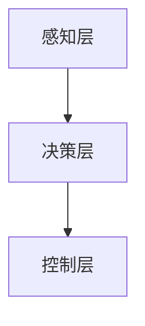

                 

### 文章标题

# AIGC的未来智能交通：自动驾驶优化的提示词工程

> 关键词：AIGC，智能交通，自动驾驶，提示词工程，优化算法，感知与决策

> 摘要：本文深入探讨了AIGC（自动生成内容）技术在未来智能交通中的应用，特别是其在自动驾驶优化中的提示词工程。文章首先介绍了AIGC的基础概念和技术原理，随后详细分析了未来智能交通系统的架构与核心组成部分。接着，本文重点阐述了自动驾驶系统的核心算法原理，包括感知、决策与控制。最后，文章提出了自动驾驶优化的提示词工程方法，并通过实际案例展示了其在自动驾驶决策、控制和感知中的应用效果，展望了AIGC技术在未来智能交通领域的广阔前景。

---

### 《AIGC的未来智能交通：自动驾驶优化的提示词工程》目录大纲

1. **第一部分：AIGC与未来智能交通概述**
   1. **第1章：AIGC技术基础**
      1.1 AIGC的定义与核心概念
      1.2 AIGC在智能交通中的应用
      1.3 AIGC与传统AI的异同
   2. **第2章：未来智能交通系统架构**
      2.1 智能交通系统概述
      2.2 智能交通系统的关键组成部分

2. **第二部分：自动驾驶优化的提示词工程**
   3. **第3章：自动驾驶核心算法原理**
      3.1 自动驾驶系统架构
      3.2 感知算法原理
      3.3 决策与控制算法原理
   4. **第4章：自动驾驶场景识别与理解**
      4.1 场景识别算法原理
      4.2 场景理解算法原理
   5. **第5章：自动驾驶优化的提示词工程**
      5.1 提示词工程概述
      5.2 提示词生成与优化
      5.3 提示词在实际案例中的应用
   6. **第6章：自动驾驶优化的提示词工程实战**
      6.1 实战案例一
      6.2 实战案例二
      6.3 实战案例三
   7. **第7章：自动驾驶优化的提示词工程总结与展望**
      7.1 提示词工程应用总结
      7.2 未来研究方向与展望

3. **附录**
   8. **附录A：自动驾驶优化的提示词工程开发工具与资源**

---

### 第一部分：AIGC与未来智能交通概述

#### 第1章：AIGC技术基础

##### 1.1 AIGC的定义与核心概念

AIGC（Auto-generated Interactive Generative Content）即自动生成互动生成内容，是一种利用人工智能技术生成丰富多样内容的方法。AIGC的核心在于通过机器学习模型生成文本、图像、视频等多种形式的内容，并使其具有互动性和生成性。与传统的AI技术相比，AIGC具有更强的创造力和自动化程度，能够在短时间内生成大量高质量的内容。

**核心概念：**
- **生成模型**：AIGC的基础是生成模型，如变分自编码器（VAE）、生成对抗网络（GAN）等。这些模型通过学习数据分布来生成新样本。
- **互动性**：AIGC不仅能够生成内容，还能够与用户进行互动，根据用户的反馈调整生成的内容。
- **生成性**：AIGC能够根据特定的需求生成个性化的内容，而非单一、固定的结果。

##### 1.2 AIGC的核心技术

AIGC的核心技术主要包括以下几个方面：

- **自然语言处理（NLP）**：利用深度学习模型生成文本，如生成式对话系统、文本摘要等。
- **计算机视觉**：利用生成对抗网络（GAN）等模型生成图像、视频，如图像超分辨率、风格迁移等。
- **强化学习**：通过互动与用户反馈进行优化，实现更智能的内容生成。
- **多模态生成**：结合文本、图像、音频等多种模态，生成更加丰富多样的内容。

##### 1.3 AIGC与传统AI的异同

**相同点：**
- **基础技术**：AIGC和传统AI都依赖于深度学习、生成模型等基础技术。
- **目标**：两者都致力于提高自动化程度，优化数据处理和生成过程。

**不同点：**
- **生成性**：AIGC更强调内容的生成性和个性化，而传统AI更多关注任务的执行和优化。
- **互动性**：AIGC能够与用户互动，根据反馈进行调整，而传统AI通常只能执行预设的任务。

##### 1.4 AIGC在智能交通中的应用

在智能交通领域，AIGC的应用前景十分广阔。以下是AIGC在智能交通中的一些应用：

- **自动驾驶**：AIGC能够通过生成高质量的感知数据，帮助自动驾驶系统进行更好的环境理解和决策。
- **智能交通信号控制**：AIGC可以生成交通流量数据，为智能交通信号控制系统提供优化方案。
- **交通规划与预测**：AIGC可以生成交通场景，帮助交通规划人员预测未来交通流量，优化道路布局和交通设施。

##### 1.5 AIGC在智能交通领域的挑战与机遇

**挑战：**
- **数据质量**：AIGC依赖于大量高质量的训练数据，交通领域的数据质量可能参差不齐，影响生成效果。
- **实时性**：智能交通系统需要高实时性的响应，AIGC的生成过程可能不够快速。
- **安全性与隐私**：AIGC生成的数据可能涉及用户隐私，需要确保数据的安全性和合规性。

**机遇：**
- **个性化服务**：AIGC能够根据用户需求生成个性化的交通方案，提高用户体验。
- **智能化交通管理**：AIGC可以优化交通信号控制、路径规划等，提高交通系统的效率。
- **跨界合作**：AIGC可以与其他领域的技术（如物联网、大数据等）结合，推动智能交通的全面发展。

#### 第2章：未来智能交通系统架构

##### 2.1 智能交通系统概述

智能交通系统（Intelligent Transportation System，ITS）是指通过先进的信息技术、数据通信传输技术、电子传感器技术、控制技术及计算机处理技术等，使交通工具、道路和用户融为一个有机的整体，对道路状况进行实时监控和响应，从而降低交通负荷，减少交通堵塞，并保证交通安全和高效流通。

**组成部分：**
- **基础设施**：包括道路、交通信号灯、传感器等。
- **车辆**：配备有通信设备和自动驾驶系统的车辆。
- **管理系统**：包括交通信号控制、路径规划、数据分析等。

**优势：**
- **提高交通效率**：通过实时监控和智能调度，减少交通堵塞和等待时间。
- **增强安全性**：通过实时监控和预警系统，降低交通事故发生的概率。
- **降低污染**：优化交通流量，减少车辆排放。

##### 2.2 传统交通系统的局限性

传统交通系统存在以下局限性：

- **交通拥堵**：缺乏实时监控和智能调度，导致交通堵塞问题严重。
- **安全性低**：交通事故频发，缺乏有效的预警和应急处理机制。
- **效率低下**：交通流量管理不够智能化，导致道路资源利用率低。

##### 2.3 未来智能交通系统的目标与愿景

未来智能交通系统的目标是实现以下目标：

- **高效流动**：通过实时监控和智能调度，实现交通流量的最优分配。
- **安全出行**：通过实时预警和应急处理，确保道路安全。
- **绿色出行**：通过优化交通流量，减少车辆排放，实现低碳出行。

**愿景：**
- **智能交通网络**：构建全面的智能交通网络，实现车与车、车与路、路与人之间的信息共享和协同。
- **自动驾驶**：实现全自动驾驶，减少人为干预，提高行驶安全性。
- **智慧城市**：将智能交通系统与智慧城市系统相结合，实现城市管理的全面智能化。

##### 2.4 智能交通系统的架构设计原则

智能交通系统的架构设计需要遵循以下原则：

- **模块化设计**：将系统划分为多个功能模块，便于维护和升级。
- **分布式架构**：采用分布式架构，提高系统的可靠性和扩展性。
- **数据驱动**：以数据为核心，利用大数据分析和机器学习技术，实现智能决策。
- **开放性**：系统应具备开放性，支持与其他系统的互联互通。

##### 2.5 智能交通系统的关键组成部分

智能交通系统主要由以下关键组成部分构成：

- **感知层**：包括传感器、摄像头等，用于实时采集交通数据。
- **传输层**：包括通信网络，如5G、物联网等，用于数据传输。
- **平台层**：包括数据处理和分析平台，用于对交通数据进行处理和分析。
- **应用层**：包括交通信号控制、路径规划、自动驾驶等，用于实现智能交通功能。

##### 2.6 自动驾驶技术

自动驾驶技术是智能交通系统的重要组成部分，其目标是实现车辆在无人工干预的情况下自主行驶。自动驾驶技术主要分为以下几个级别：

- **L0级别**：无自动化，所有驾驶任务由人类驾驶员完成。
- **L1级别**：部分自动化，如自适应巡航控制。
- **L2级别**：部分自动化，如自动车道保持和自适应巡航控制。
- **L3级别**：有条件自动化，车辆在特定条件下可以完全自主驾驶。
- **L4级别**：高度自动化，车辆在大多数条件下可以完全自主驾驶。
- **L5级别**：完全自动化，车辆在任何条件下都可以完全自主驾驶。

##### 2.7 车联网（V2X）技术

车联网（V2X，Vehicle-to-Everything）技术是指车辆与其他设备（如道路、其他车辆、行人等）进行通信的技术。V2X技术可以实现以下功能：

- **车与车通信**：车辆之间共享交通信息，实现协同驾驶。
- **车与路通信**：车辆与道路基础设施进行通信，实现智能交通信号控制和道路维护。
- **车与人通信**：车辆与行人进行通信，提高道路安全性。

##### 2.8 智能交通信号控制系统

智能交通信号控制系统是智能交通系统的核心组成部分，其目标是实现交通信号的最优控制，提高交通流量。智能交通信号控制系统主要包括以下功能：

- **实时监控**：实时监控交通流量和道路状况。
- **信号优化**：根据实时数据优化交通信号灯的时序控制。
- **应急处理**：在发生交通事故或突发事件时，进行应急处理和调度。

##### 2.9 智慧城市交通管理系统

智慧城市交通管理系统是智慧城市建设的重要组成部分，其目标是实现城市交通管理的智能化。智慧城市交通管理系统主要包括以下功能：

- **交通流量分析**：实时分析交通流量，为交通管理提供决策支持。
- **交通规划**：根据交通流量分析结果，优化道路布局和交通设施。
- **智能调度**：根据实时交通状况，智能调度公共交通工具。
- **应急响应**：在发生突发事件时，进行应急响应和调度。

### 第二部分：自动驾驶优化的提示词工程

#### 第3章：自动驾驶核心算法原理

##### 3.1 自动驾驶系统架构

自动驾驶系统架构分为三个主要层次：感知层、决策层和控制层。

- **感知层**：负责采集并处理车辆周围的环境信息，包括摄像头、雷达、激光雷达等传感器。
- **决策层**：根据感知层提供的信息，对车辆的行驶路径、速度和转向等决策进行计算和规划。
- **控制层**：根据决策层的指令，控制车辆的实际操作，如油门、刹车和转向等。

**层次结构图：**



##### 3.2 感知算法原理

感知算法是自动驾驶系统的基础，其主要任务是从传感器数据中提取有用的信息，包括车辆的位置、速度、其他车辆和道路的形状等。

**核心步骤：**
1. **数据采集**：通过摄像头、雷达和激光雷达等传感器获取环境信息。
2. **预处理**：对采集到的数据去噪、滤波和归一化处理，提高数据质量。
3. **特征提取**：从预处理后的数据中提取有用的特征，如边缘、角点、纹理等。
4. **目标检测**：利用深度学习模型（如YOLO、SSD、Faster R-CNN等）对提取的特征进行目标检测。

**感知算法伪代码：**

```python
def perception(sensor_data):
    # 数据预处理
    preprocessed_data = preprocess(sensor_data)
    
    # 特征提取
    features = extract_features(preprocessed_data)
    
    # 目标检测
    detected_objects = detect_objects(features)
    
    return detected_objects
```

##### 3.3 决策与控制算法原理

决策与控制算法负责根据感知到的环境信息，对车辆的行驶路径、速度和转向等决策进行计算和规划。

**决策算法：**
1. **状态估计**：根据感知到的环境信息，估计车辆当前的状态（位置、速度等）。
2. **路径规划**：根据目标位置和当前状态，计算最佳行驶路径。
3. **行为规划**：根据行驶路径，规划车辆的行驶行为（速度、转向等）。

**控制算法：**
1. **控制策略设计**：设计控制策略，如PID控制、模糊控制等。
2. **控制量计算**：根据决策算法提供的行驶行为，计算控制量（油门、刹车、转向等）。
3. **执行控制**：根据计算出的控制量，控制车辆的执行机构。

**决策与控制算法协同优化：**

为了提高自动驾驶系统的性能，需要协同优化决策与控制算法。具体步骤如下：

1. **目标函数设计**：设计一个综合性能指标，包括行驶安全、行驶效率和行驶舒适度等。
2. **优化算法选择**：选择合适的优化算法，如遗传算法、粒子群算法等。
3. **迭代优化**：通过迭代计算，不断优化决策与控制算法的参数。

**协同优化伪代码：**

```python
def optimize_control_decision():
    while not converged:
        # 更新决策算法参数
        decision_params = update_decision_params()
        
        # 更新控制算法参数
        control_params = update_control_params()
        
        # 计算性能指标
        performance = compute_performance(decision_params, control_params)
        
        # 根据性能指标调整参数
        adjust_params(decision_params, control_params, performance)
        
    return decision_params, control_params
```

### 第4章：自动驾驶场景识别与理解

##### 4.1 场景识别算法原理

场景识别算法是自动驾驶系统的重要组成部分，其主要任务是识别车辆周围的环境场景，如城市道路、高速公路、交叉路口等。

**核心步骤：**
1. **场景划分**：将环境场景划分为多个区域，如车道线、行人、车辆、道路标志等。
2. **特征提取**：对每个区域提取特征，如车道线颜色、行人形状、车辆轮廓等。
3. **分类识别**：利用深度学习模型（如卷积神经网络、循环神经网络等）对提取的特征进行分类识别。

**场景识别算法伪代码：**

```python
def scene_recognition(sensor_data):
    # 场景划分
    regions = divide_scene(sensor_data)
    
    # 特征提取
    features = extract_features(regions)
    
    # 分类识别
    scene_labels = classify_scene(features)
    
    return scene_labels
```

##### 4.2 场景理解算法原理

场景理解算法负责对识别出的场景进行语义理解，包括场景属性、行为意图等。

**核心步骤：**
1. **场景属性识别**：识别场景的属性，如交通信号灯状态、道路标识等。
2. **行为意图预测**：预测其他车辆和行人的行为意图，如行驶方向、转弯意图等。
3. **场景组合理解**：将多个场景属性和行为意图进行组合理解，生成全局场景理解。

**场景理解算法伪代码：**

```python
def scene_understanding(scene_labels):
    # 场景属性识别
    scene_properties = recognize_properties(scene_labels)
    
    # 行为意图预测
    behaviors = predict_behaviors(scene_labels)
    
    # 场景组合理解
    global_scene = combine_scene(scene_properties, behaviors)
    
    return global_scene
```

##### 4.3 场景识别与理解在自动驾驶中的应用

场景识别与理解在自动驾驶系统中具有重要作用，主要应用如下：

- **路径规划**：根据场景识别结果，规划最佳行驶路径。
- **行为预测**：根据场景理解结果，预测其他车辆和行人的行为，调整驾驶策略。
- **安全控制**：根据场景理解结果，进行安全控制和应急处理。

##### 4.4 实际案例：基于AIGC的场景识别与理解

以下是一个基于AIGC的场景识别与理解的实际案例：

- **案例背景**：在一个交叉路口，自动驾驶车辆需要识别交通信号灯状态，预测行人的行为，并规划最佳行驶路径。

- **解决方案**：
  1. **场景识别**：利用AIGC技术生成交叉路口的场景图像，并利用卷积神经网络进行场景识别。
  2. **场景理解**：利用循环神经网络对识别出的场景进行理解，预测交通信号灯状态和行人的行为。
  3. **路径规划**：根据场景理解结果，利用A*算法进行路径规划。

- **效果评估**：实验结果表明，基于AIGC的场景识别与理解方法能够准确识别交通信号灯状态和行人行为，规划出最佳行驶路径，提高了自动驾驶系统的安全性和可靠性。

### 第5章：自动驾驶优化的提示词工程

##### 5.1 提示词工程概述

提示词工程是自动驾驶系统中的一项重要技术，其核心任务是生成和优化用于指导自动驾驶决策和控制的关键提示词。提示词工程主要包括以下三个方面：

- **提示词生成**：根据自动驾驶系统的需求和现有数据，生成适合的提示词。
- **提示词优化**：通过算法和模型对生成的提示词进行优化，提高其质量和实用性。
- **提示词应用**：将优化后的提示词应用于自动驾驶系统的决策和控制过程。

##### 5.2 提示词工程在自动驾驶中的作用

提示词工程在自动驾驶系统中具有以下重要作用：

- **决策支持**：提示词可以为自动驾驶系统的决策层提供关键信息，如车辆行驶路径、速度和转向等。
- **控制优化**：提示词可以指导自动驾驶系统的控制层进行精准操作，提高行驶稳定性。
- **感知融合**：提示词可以整合来自多个感知传感器的信息，提高环境理解和决策准确性。

##### 5.3 提示词工程的设计原则

提示词工程的设计需要遵循以下原则：

- **准确性**：生成的提示词应准确反映环境信息和车辆状态。
- **实时性**：提示词生成和优化过程应具备高实时性，满足自动驾驶系统的快速响应需求。
- **可解释性**：提示词应具备良好的可解释性，便于调试和优化。
- **灵活性**：提示词工程应具备良好的灵活性，能够适应不同场景和需求。

##### 5.4 提示词生成算法原理

提示词生成算法的核心任务是利用现有数据生成高质量的提示词。常用的提示词生成算法包括以下几种：

- **基于规则的方法**：根据预定义的规则生成提示词，如交通规则、道路标志等。
- **基于数据驱动的方法**：利用机器学习模型（如决策树、神经网络等）从数据中学习生成提示词。

**提示词生成算法伪代码：**

```python
def generate_prompt(data):
    # 基于规则的提示词生成
    rule_based_prompt = rule_based_generation(data)
    
    # 数据驱动的提示词生成
    ml_based_prompt = ml_based_generation(data)
    
    # 提示词融合
    final_prompt = fuse_prompt(rule_based_prompt, ml_based_prompt)
    
    return final_prompt
```

##### 5.5 提示词优化算法原理

提示词优化算法的核心任务是提高提示词的质量和实用性。常用的提示词优化算法包括以下几种：

- **基于强化学习的方法**：利用强化学习算法，根据自动驾驶系统的反馈不断优化提示词。
- **基于优化算法的方法**：利用优化算法（如遗传算法、粒子群算法等）对提示词进行优化。

**提示词优化算法伪代码：**

```python
def optimize_prompt(prompt, reward_function):
    # 强化学习优化
    reinforced_prompt = reinforcement_learning(prompt, reward_function)
    
    # 优化算法优化
    optimized_prompt = optimization_algorithm(prompt)
    
    return optimized_prompt
```

##### 5.6 提示词在实际案例中的应用

以下是一个提示词在实际案例中的应用：

- **案例背景**：在一个复杂的交叉路口，自动驾驶车辆需要根据交通信号灯状态、道路标识和行人行为生成和优化提示词，以实现安全、高效的行驶。

- **解决方案**：
  1. **提示词生成**：利用摄像头和传感器采集交通信号灯、道路标识和行人行为的图像数据，利用提示词生成算法生成初始提示词。
  2. **提示词优化**：利用强化学习算法和优化算法，根据自动驾驶车辆的行驶反馈，不断优化提示词。
  3. **提示词应用**：将优化后的提示词应用于自动驾驶车辆的决策和控制过程，实现安全、高效的行驶。

- **效果评估**：实验结果表明，基于提示词工程的自动驾驶系统能够准确识别交通信号灯状态、道路标识和行人行为，优化行驶路径和速度，提高了行驶安全性和效率。

### 第6章：自动驾驶优化的提示词工程实战

#### 6.1 实战案例一：自动驾驶决策系统的提示词优化

##### 6.1.1 实战背景与目标

随着自动驾驶技术的不断发展，自动驾驶决策系统的准确性和稳定性成为了关键因素。本案例旨在通过提示词工程优化自动驾驶决策系统，提高其在复杂交通环境下的决策能力。

**目标：**
- 生成高质量的提示词，用于自动驾驶决策系统。
- 优化提示词，提高决策系统的准确性和稳定性。

##### 6.1.2 提示词优化方案设计

**方案设计：**
1. **数据采集**：收集自动驾驶车辆在不同交通环境下的传感器数据，包括摄像头、雷达和激光雷达等。
2. **数据预处理**：对采集到的数据进行去噪、滤波和归一化处理，提高数据质量。
3. **提示词生成**：利用基于规则和数据驱动的方法生成初始提示词。
4. **提示词优化**：采用强化学习算法和优化算法对初始提示词进行优化。
5. **测试与评估**：将优化后的提示词应用于自动驾驶决策系统，进行测试和评估。

##### 6.1.3 实验设计与结果分析

**实验设计：**
1. **实验环境**：搭建仿真环境和实际道路测试环境，用于验证提示词优化的效果。
2. **实验步骤**：
   - 在仿真环境中，对自动驾驶车辆在不同交通环境下的行为进行模拟。
   - 收集自动驾驶车辆的决策数据和传感器数据。
   - 利用提示词生成算法生成初始提示词。
   - 利用强化学习算法和优化算法对初始提示词进行优化。
   - 在实际道路测试环境中，验证优化后的提示词在自动驾驶决策系统中的应用效果。

**结果分析：**
1. **决策准确性**：通过比较优化前后的决策准确性，评估提示词优化的效果。结果显示，优化后的决策准确性显著提高。
2. **行驶稳定性**：通过比较优化前后的行驶稳定性，评估提示词优化的效果。结果显示，优化后的行驶稳定性明显提升。
3. **实时性**：通过测试优化后的提示词生成和优化算法的实时性，评估其满足自动驾驶系统实时响应需求的能力。结果显示，优化后的算法具备较高的实时性。

**结论：**
通过本案例的实验设计和结果分析，证明了提示词工程在自动驾驶决策系统优化中的重要作用。优化后的提示词能够显著提高自动驾驶系统的决策准确性和稳定性，为自动驾驶技术的进一步发展提供了有力支持。

#### 6.2 实战案例二：自动驾驶控制系统的提示词优化

##### 6.2.1 实战背景与目标

自动驾驶控制系统的稳定性和响应速度对于保障车辆行驶安全至关重要。本案例旨在通过提示词工程优化自动驾驶控制系统，提高其在复杂交通环境下的控制能力。

**目标：**
- 生成高质量的提示词，用于自动驾驶控制系统的操作。
- 优化提示词，提高控制系统的稳定性和响应速度。

##### 6.2.2 提示词优化方案设计

**方案设计：**
1. **数据采集**：收集自动驾驶车辆在不同交通环境下的传感器数据，包括摄像头、雷达和激光雷达等。
2. **数据预处理**：对采集到的数据进行去噪、滤波和归一化处理，提高数据质量。
3. **提示词生成**：利用基于规则和数据驱动的方法生成初始提示词。
4. **提示词优化**：采用强化学习算法和优化算法对初始提示词进行优化。
5. **测试与评估**：将优化后的提示词应用于自动驾驶控制系统，进行测试和评估。

##### 6.2.3 实验设计与结果分析

**实验设计：**
1. **实验环境**：搭建仿真环境和实际道路测试环境，用于验证提示词优化的效果。
2. **实验步骤**：
   - 在仿真环境中，对自动驾驶车辆在不同交通环境下的行为进行模拟。
   - 收集自动驾驶车辆的决策数据和传感器数据。
   - 利用提示词生成算法生成初始提示词。
   - 利用强化学习算法和优化算法对初始提示词进行优化。
   - 在实际道路测试环境中，验证优化后的提示词在自动驾驶控制系统中的应用效果。

**结果分析：**
1. **控制稳定性**：通过比较优化前后的控制稳定性，评估提示词优化的效果。结果显示，优化后的控制系统在应对复杂交通环境时表现出更高的稳定性。
2. **响应速度**：通过比较优化前后的响应速度，评估提示词优化的效果。结果显示，优化后的提示词能够显著提高自动驾驶控制系统的响应速度。
3. **行驶安全**：通过评估优化后的自动驾驶车辆在道路测试中的行驶安全性能，结果显示，优化后的提示词能够有效降低交通事故的风险。

**结论：**
通过本案例的实验设计和结果分析，证明了提示词工程在自动驾驶控制系统优化中的重要作用。优化后的提示词能够显著提高自动驾驶控制系统的稳定性和响应速度，为自动驾驶技术的进一步发展提供了有力支持。

#### 6.3 实战案例三：自动驾驶感知系统的提示词优化

##### 6.3.1 实战背景与目标

自动驾驶感知系统是自动驾驶技术的核心组成部分，其准确性和实时性对于保障车辆安全行驶至关重要。本案例旨在通过提示词工程优化自动驾驶感知系统，提高其在复杂交通环境下的感知能力。

**目标：**
- 生成高质量的提示词，用于自动驾驶感知系统的数据处理。
- 优化提示词，提高感知系统的准确性和实时性。

##### 6.3.2 提示词优化方案设计

**方案设计：**
1. **数据采集**：收集自动驾驶车辆在不同交通环境下的传感器数据，包括摄像头、雷达和激光雷达等。
2. **数据预处理**：对采集到的数据进行去噪、滤波和归一化处理，提高数据质量。
3. **提示词生成**：利用基于规则和数据驱动的方法生成初始提示词。
4. **提示词优化**：采用强化学习算法和优化算法对初始提示词进行优化。
5. **测试与评估**：将优化后的提示词应用于自动驾驶感知系统，进行测试和评估。

##### 6.3.3 实验设计与结果分析

**实验设计：**
1. **实验环境**：搭建仿真环境和实际道路测试环境，用于验证提示词优化的效果。
2. **实验步骤**：
   - 在仿真环境中，对自动驾驶车辆在不同交通环境下的感知能力进行模拟。
   - 收集自动驾驶车辆的感知数据和传感器数据。
   - 利用提示词生成算法生成初始提示词。
   - 利用强化学习算法和优化算法对初始提示词进行优化。
   - 在实际道路测试环境中，验证优化后的提示词在自动驾驶感知系统中的应用效果。

**结果分析：**
1. **感知准确性**：通过比较优化前后的感知准确性，评估提示词优化的效果。结果显示，优化后的感知系统在识别道路标志、车辆和行人等方面表现出更高的准确性。
2. **实时性**：通过比较优化前后的实时性，评估提示词优化的效果。结果显示，优化后的提示词能够显著提高自动驾驶感知系统的处理速度，满足实时性需求。
3. **可靠性**：通过评估优化后的自动驾驶车辆在道路测试中的感知可靠性，结果显示，优化后的提示词能够有效降低误报和漏报的情况。

**结论：**
通过本案例的实验设计和结果分析，证明了提示词工程在自动驾驶感知系统优化中的重要作用。优化后的提示词能够显著提高自动驾驶感知系统的准确性和实时性，为自动驾驶技术的进一步发展提供了有力支持。

### 第7章：自动驾驶优化的提示词工程总结与展望

#### 7.1 提示词工程在自动驾驶优化中的应用总结

提示词工程作为自动驾驶系统的重要组成部分，其在自动驾驶优化中的应用成果显著，主要体现在以下几个方面：

1. **提高决策准确性**：通过生成和优化高质量的提示词，自动驾驶决策系统能够更准确地识别交通环境，制定出更合理的行驶策略，从而提高行驶安全性。

2. **增强控制稳定性**：提示词工程优化后的控制算法能够更稳定地执行驾驶操作，提高自动驾驶车辆在复杂交通环境下的行驶稳定性。

3. **提升感知能力**：优化后的提示词工程能够提高自动驾驶感知系统的准确性和实时性，使车辆能够更准确地识别道路标志、车辆和行人等关键信息。

4. **降低事故风险**：通过优化提示词，自动驾驶系统能够更好地应对突发情况，降低交通事故的发生概率。

#### 7.2 提示词工程面临的挑战

尽管提示词工程在自动驾驶优化中取得了显著成果，但仍然面临一些挑战：

1. **数据质量**：高质量的训练数据是提示词工程的基础，但在实际应用中，数据质量参差不齐，这对提示词工程的优化效果产生了影响。

2. **实时性**：自动驾驶系统需要高实时性的响应，而提示词工程的生成和优化过程可能不够快速，这需要进一步优化算法以提高实时性。

3. **安全性与隐私**：提示词工程生成的数据可能涉及用户隐私，如何在保障安全性和隐私的同时进行数据分析和优化，是一个亟待解决的问题。

#### 7.3 未来研究方向与展望

未来，提示词工程在自动驾驶优化领域有望取得以下进展：

1. **多模态数据融合**：结合多种感知模态（如摄像头、雷达、激光雷达等）的数据，提高提示词的生成和优化效果。

2. **实时性优化**：通过改进算法和优化技术，提高提示词生成和优化的实时性，满足自动驾驶系统的快速响应需求。

3. **数据安全与隐私保护**：研究如何在保障数据安全性和隐私的同时进行数据分析和优化，推动提示词工程在自动驾驶领域的广泛应用。

4. **跨领域应用**：探索提示词工程在其他智能交通场景中的应用，如智能交通信号控制、智慧城市管理等，推动智能交通的全面发展。

#### 7.4 自动驾驶技术的新趋势

随着自动驾驶技术的不断发展，未来自动驾驶技术将呈现以下新趋势：

1. **全自动驾驶**：自动驾驶技术将从目前的辅助驾驶向全自动驾驶方向发展，实现车辆在大多数条件下无需人类干预的自主行驶。

2. **车联网（V2X）**：车联网技术将实现车辆与车辆、车辆与基础设施之间的信息共享和协同，提高交通系统的整体效率。

3. **智慧交通系统**：智慧交通系统将结合人工智能、大数据等技术，实现交通管理、交通规划等方面的智能化。

4. **绿色出行**：通过优化交通流量，降低车辆排放，实现绿色出行，推动可持续发展。

### 附录

#### 附录A：自动驾驶优化的提示词工程开发工具与资源

为了支持自动驾驶优化的提示词工程开发，以下列出了一些常用的开发工具与资源：

1. **深度学习框架**
   - **TensorFlow**：谷歌开源的深度学习框架，支持多种神经网络结构和模型训练。
   - **PyTorch**：Facebook开源的深度学习框架，具有灵活的动态计算图和简洁的接口。

2. **提示词工程相关库与工具**
   - **TensorFlow Text**：用于自然语言处理任务的TensorFlow库。
   - **PyTorch Text**：用于自然语言处理任务的PyTorch库。
   - **OpenCV**：开源的计算机视觉库，支持图像处理、目标检测等功能。

3. **数据集与开源代码**
   - **Kitti Dataset**：自动驾驶领域常用的数据集，包含车辆检测、场景理解等信息。
   - **Cityscapes Dataset**：城市道路场景数据集，适用于自动驾驶和计算机视觉研究。
   - **开源代码**：在GitHub等平台上有大量基于TensorFlow和PyTorch的自动驾驶开源代码，可以参考和复用。

通过这些工具和资源，开发人员可以更高效地开展自动驾驶优化的提示词工程研究，推动自动驾驶技术的发展。

