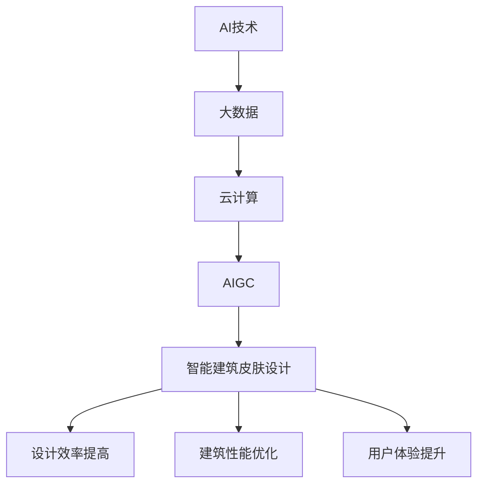
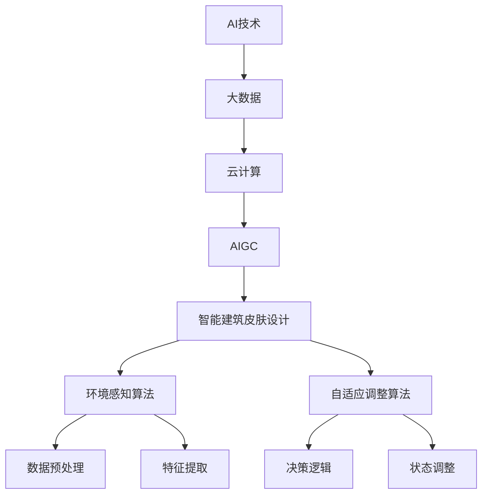
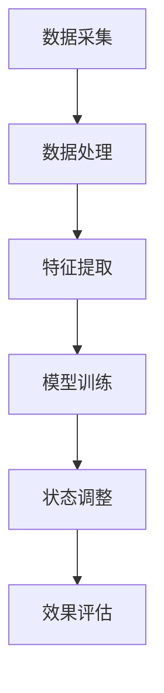
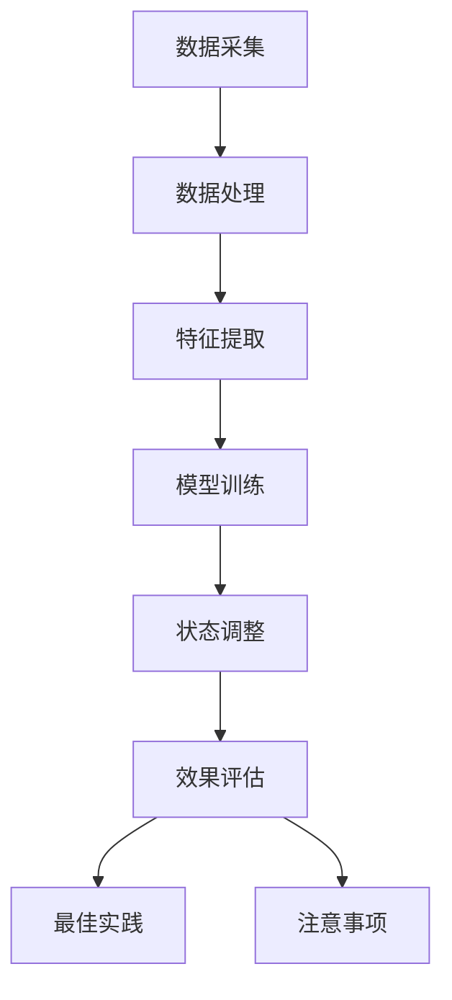

                 

### 文章标题

《AIGC的未来智能建筑皮肤：环境响应设计的提示词工程》

#### 文章关键词

- 自动化互动生成内容（AIGC）
- 智能建筑皮肤
- 环境响应设计
- 提示词工程
- 智能算法

#### 文章摘要

本文探讨了自动化互动生成内容（AIGC）在智能建筑皮肤环境响应设计中的应用。通过分析AIGC的基本概念和智能建筑皮肤的设计需求，本文提出了AIGC在环境响应设计中的关键算法原理，并详细讲解了环境感知算法和自适应调整算法。同时，通过实际项目实战和案例分析，本文展示了AIGC在智能建筑皮肤设计中的实际应用效果，为未来智能建筑的发展提供了有益的参考。

## 第一部分: AIGC的未来智能建筑皮肤：环境响应设计的概述

### 第1章: AIGC的基本概念与智能建筑皮肤

#### 1.1 AIGC的定义与背景

自动化互动生成内容（AIGC，Automated Interactive Generation of Content）是一种利用人工智能技术自动化生成内容的方法。它融合了人工智能（AI）、大数据、云计算、自然语言处理等技术，旨在通过智能算法实现内容的自动化生成、交互和优化。

AIGC的发展背景可以追溯到互联网的普及和信息爆炸的时代。随着用户需求的多样化和个性化，传统的手动内容生成方式已经无法满足日益增长的内容需求。AIGC的出现，为内容生成领域带来了一场革命，它通过智能算法自动生成高质量的内容，大大提高了内容生产效率和用户体验。

#### 1.2 智能建筑皮肤的概念

智能建筑皮肤是指建筑物外部覆盖的一层智能化材料，它可以感知环境变化，并根据环境数据进行自适应调整。智能建筑皮肤具有以下特点：

1. **环境响应性**：智能建筑皮肤能够实时感知外部环境的变化，如温度、湿度、光照、风速等，并根据这些变化进行相应的调整。
2. **可持续性**：智能建筑皮肤的设计和材料选择遵循可持续发展的原则，以减少建筑物的能源消耗和环境污染。
3. **智能性**：智能建筑皮肤配备了传感器、控制器等智能设备，可以通过无线网络与其他系统进行数据交换和协同工作。

#### 1.3 AIGC在智能建筑皮肤设计中的应用

AIGC在智能建筑皮肤设计中的应用主要体现在以下几个方面：

1. **设计优化**：AIGC技术可以帮助设计师快速生成多种设计方案，通过对比分析，找出最优的设计方案，从而提高设计效率。
2. **性能优化**：AIGC可以根据环境数据自动调整智能建筑皮肤的状态，以实现最佳的环境响应效果，从而提高建筑物的性能。
3. **用户体验提升**：AIGC技术可以生成个性化的内容，为用户提供定制化的建筑环境，从而提升用户体验。

#### 1.4 AIGC在智能建筑皮肤设计中的应用前景

随着人工智能技术的不断进步，AIGC在智能建筑皮肤设计中的应用前景非常广阔。一方面，AIGC技术可以为设计师提供更加智能化、自动化的设计工具，提高设计效率和设计质量；另一方面，AIGC技术可以优化智能建筑皮肤的性能，提高建筑物的环境适应能力和能源利用效率。在未来，智能建筑皮肤将成为智能城市建设的重要组成部分，为人类创造更加舒适、绿色、可持续的生活环境。

### 第一部分总结

本部分首先介绍了AIGC的基本概念和背景，然后探讨了智能建筑皮肤的设计需求，并阐述了AIGC在智能建筑皮肤设计中的应用。通过分析可以看出，AIGC作为一种新兴的生成内容方式，在智能建筑皮肤设计中的应用具有很大的潜力。接下来，我们将进一步探讨AIGC在智能建筑皮肤环境响应设计中的核心算法原理。

#### Mermaid 流程图



#### 核心概念与联系

- **AIGC**: 自动化互动生成内容，利用人工智能技术生成高质量的内容。
- **智能建筑皮肤**: 建筑物的外部覆盖层，具有环境响应性、可持续性和智能性。
- **环境响应设计**: 利用AIGC技术，根据环境数据自动调整智能建筑皮肤的状态，实现最佳的环境响应效果。

#### 核心算法原理讲解

环境感知算法和自适应调整算法是AIGC在智能建筑皮肤环境响应设计中的核心组成部分。下面我们将分别介绍这两个算法的原理。

#### 环境感知算法

环境感知算法的主要功能是实时收集建筑外部环境的数据，包括温度、湿度、光照、风速、二氧化碳浓度等。通过传感器和无线通信技术，环境感知算法可以将这些数据传输到智能建筑皮肤的控制系统中，以便进行实时监测和分析。

以下是一个简单的伪代码示例，用于描述环境感知算法的基本流程：

```python
def collect_environment_data():
    temperature = get_temperature()
    humidity = get_humidity()
    light_intensity = get_light_intensity()
    wind_speed = get_wind_speed()
    co2_concentration = get_co2_concentration()
    return {
        'temperature': temperature,
        'humidity': humidity,
        'light_intensity': light_intensity,
        'wind_speed': wind_speed,
        'co2_concentration': co2_concentration
    }
```

在这个示例中，`get_temperature()`、`get_humidity()`、`get_light_intensity()`、`get_wind_speed()`和`get_co2_concentration()`是用于获取环境数据的函数，它们通过传感器和无线通信技术实时获取环境数据，并返回一个包含所有环境数据的字典。

#### 自适应调整算法

自适应调整算法基于环境感知算法收集到的环境数据，对智能建筑皮肤的状态进行调整，以实现最佳的环境响应效果。自适应调整算法可以分为以下几个步骤：

1. **数据预处理**：对收集到的环境数据进行预处理，包括去噪、归一化等操作，以提高数据的可靠性和准确性。
2. **特征提取**：从预处理后的数据中提取出有用的特征，如温度、湿度、光照强度等。
3. **决策逻辑**：根据提取出的特征，使用决策逻辑或机器学习模型，确定智能建筑皮肤的状态调整策略。
4. **状态调整**：根据决策逻辑或机器学习模型的结果，调整智能建筑皮肤的状态，如材料收缩、颜色变换等。

以下是一个简单的伪代码示例，用于描述自适应调整算法的基本流程：

```python
def adjust_skin_state(data):
    # 数据预处理
    preprocessed_data = preprocess_data(data)
    
    # 特征提取
    features = extract_features(preprocessed_data)
    
    # 决策逻辑
    if features['temperature'] > optimal_temperature:
        # 调整皮肤材料以降低温度
        skin_material = cool_material()
    elif features['temperature'] < optimal_temperature:
        # 调整皮肤材料以增加温度
        skin_material = warm_material()
    
    # 状态调整
    apply_skin_material(skin_material)
```

在这个示例中，`preprocess_data()`、`extract_features()`和`apply_skin_material()`是用于数据预处理、特征提取和状态调整的函数。它们分别对环境数据进行了预处理、特征提取和状态调整，以实现最佳的环境响应效果。

#### 数学模型和公式

在环境感知算法和自适应调整算法中，数学模型和公式起到了关键作用。以下是一些常用的数学模型和公式：

1. **温度控制公式**：

   $$T_{new} = T_{current} + k(T_{set} - T_{current})$$

   其中，$T_{new}$是调整后的温度，$T_{current}$是当前温度，$T_{set}$是设定的目标温度，$k$是调整系数。

2. **湿度控制公式**：

   $$H_{new} = H_{current} + m(H_{set} - H_{current})$$

   其中，$H_{new}$是调整后的湿度，$H_{current}$是当前湿度，$H_{set}$是设定的目标湿度，$m$是调整系数。

3. **光照强度控制公式**：

   $$I_{new} = I_{current} + n(I_{set} - I_{current})$$

   其中，$I_{new}$是调整后的光照强度，$I_{current}$是当前光照强度，$I_{set}$是设定的目标光照强度，$n$是调整系数。

通过这些数学模型和公式，环境感知算法和自适应调整算法可以实现对环境数据的精确控制和调整。

#### 举例说明

为了更好地理解环境感知算法和自适应调整算法的原理，我们来看一个实际案例。

假设一个智能建筑皮肤系统需要根据环境温度调整材料颜色，以实现保温或散热效果。具体步骤如下：

1. **环境感知**：系统通过传感器实时监测环境温度。
2. **数据预处理**：对传感器数据进行去噪、归一化等预处理操作。
3. **特征提取**：从预处理后的数据中提取出温度特征。
4. **决策逻辑**：根据温度特征，确定是否需要调整材料颜色。
5. **状态调整**：如果温度高于设定值，系统将调整材料颜色为深色，以吸收更多太阳辐射，实现散热效果；如果温度低于设定值，系统将调整材料颜色为浅色，以反射更多太阳辐射，实现保温效果。

通过这个案例，我们可以看到环境感知算法和自适应调整算法在智能建筑皮肤环境响应设计中的应用过程。通过实时监测环境数据，并根据数据调整材料颜色，智能建筑皮肤系统可以实现对建筑环境的精确控制和优化。

### 第一部分总结

在本部分中，我们介绍了AIGC的基本概念和智能建筑皮肤的设计需求，并阐述了AIGC在智能建筑皮肤环境响应设计中的应用。通过环境感知算法和自适应调整算法的讲解，我们了解了AIGC在实现智能建筑皮肤环境响应中的核心原理。接下来，我们将进一步探讨AIGC在智能建筑皮肤设计中的具体实现和实际应用案例。

#### Mermaid 流程图



#### 核心概念与联系

- **AIGC**: 自动化互动生成内容，利用人工智能技术生成高质量的内容。
- **环境感知算法**: 实时监测建筑外部环境，收集温度、湿度、光照等数据。
- **自适应调整算法**: 根据环境数据，自动调整智能建筑皮肤的状态，实现最佳的环境响应效果。

### 第二部分: AIGC在智能建筑皮肤环境响应设计中的实现

#### 第2章: AIGC在智能建筑皮肤环境响应设计中的实现

#### 2.1 AIGC在智能建筑皮肤环境响应设计中的实现流程

AIGC在智能建筑皮肤环境响应设计中的实现可以分为以下几个步骤：

1. **数据采集**：通过传感器收集建筑外部环境的温度、湿度、光照、风速等数据。
2. **数据处理**：对采集到的数据进行分析和处理，去除噪声和异常值，确保数据的准确性和可靠性。
3. **特征提取**：从处理后的数据中提取出与环境响应相关的特征，如温度、湿度、光照强度等。
4. **模型训练**：使用提取出的特征数据，训练机器学习模型，以便对智能建筑皮肤的状态进行调整。
5. **状态调整**：根据模型预测结果，自动调整智能建筑皮肤的状态，如材料收缩、颜色变换等。
6. **效果评估**：评估智能建筑皮肤调整后的效果，对模型进行调整和优化。

以下是一个简单的流程图，用于描述AIGC在智能建筑皮肤环境响应设计中的实现过程：



#### 2.2 数据采集

数据采集是AIGC在智能建筑皮肤环境响应设计中的第一步，也是至关重要的一步。为了实现对建筑外部环境的准确监测，需要安装各种传感器，如温度传感器、湿度传感器、光照传感器、风速传感器等。这些传感器可以实时收集建筑外部环境的温度、湿度、光照、风速等数据。

以下是一个简单的数据采集示例：

```python
def collect_environment_data():
    temperature = get_temperature()
    humidity = get_humidity()
    light_intensity = get_light_intensity()
    wind_speed = get_wind_speed()
    return {
        'temperature': temperature,
        'humidity': humidity,
        'light_intensity': light_intensity,
        'wind_speed': wind_speed
    }
```

在这个示例中，`get_temperature()`、`get_humidity()`、`get_light_intensity()`和`get_wind_speed()`是用于获取环境数据的函数。通过调用这些函数，可以实时获取建筑外部环境的温度、湿度、光照、风速等数据。

#### 2.3 数据处理

数据采集后，需要对数据进行处理，以确保数据的准确性和可靠性。数据处理包括以下几个步骤：

1. **去噪**：去除传感器采集到的噪声数据，以提高数据的准确性。
2. **归一化**：将采集到的数据归一化，使其在相同的尺度上，便于后续处理和分析。
3. **异常值处理**：检测并去除异常值，确保数据的完整性。

以下是一个简单的数据处理示例：

```python
def preprocess_data(data):
    # 去噪
    filtered_data = filter_noise(data)
    
    # 归一化
    normalized_data = normalize_data(filtered_data)
    
    # 异常值处理
    final_data = remove_anomalies(normalized_data)
    
    return final_data
```

在这个示例中，`filter_noise()`、`normalize_data()`和`remove_anomalies()`是用于去噪、归一化和异常值处理的函数。通过调用这些函数，可以确保数据的准确性和可靠性。

#### 2.4 特征提取

特征提取是从处理后的数据中提取出与环境响应相关的特征。这些特征可以用于训练机器学习模型，以便对智能建筑皮肤的状态进行调整。常见的特征提取方法包括：

1. **统计分析**：使用统计分析方法，如平均值、标准差等，提取出数据的统计特征。
2. **时序分析**：使用时序分析方法，如自回归模型、滑动平均模型等，提取出数据的时间序列特征。
3. **机器学习**：使用机器学习方法，如特征选择、降维等，提取出数据的特征。

以下是一个简单的特征提取示例：

```python
def extract_features(data):
    # 统计分析
    mean_temp = calculate_mean(data['temperature'])
    std_temp = calculate_std(data['temperature'])
    
    # 时序分析
    temp_trend = calculate_trend(data['temperature'])
    
    # 机器学习
    ml_features = machine_learning_feature_extraction(data)
    
    return {
        'mean_temp': mean_temp,
        'std_temp': std_temp,
        'temp_trend': temp_trend,
        'ml_features': ml_features
    }
```

在这个示例中，`calculate_mean()`、`calculate_std()`、`calculate_trend()`和`machine_learning_feature_extraction()`是用于特征提取的函数。通过调用这些函数，可以提取出与环境响应相关的特征。

#### 2.5 模型训练

模型训练是AIGC在智能建筑皮肤环境响应设计中的关键步骤。通过训练机器学习模型，可以实现对智能建筑皮肤状态的自动调整。常见的机器学习模型包括：

1. **线性回归**：用于预测连续值输出，如温度、湿度等。
2. **逻辑回归**：用于预测离散值输出，如是否需要调整材料颜色等。
3. **决策树**：用于分类任务，如根据温度决定是否开启空调等。
4. **神经网络**：用于复杂的非线性任务，如自适应调整材料颜色等。

以下是一个简单的模型训练示例：

```python
def train_model(features, labels):
    # 创建线性回归模型
    model = LinearRegression()
    
    # 训练模型
    model.fit(features, labels)
    
    # 评估模型
    accuracy = model.evaluate(features, labels)
    
    return model, accuracy
```

在这个示例中，`LinearRegression()`是用于创建线性回归模型的函数，`fit()`是用于训练模型的函数，`evaluate()`是用于评估模型的函数。通过调用这些函数，可以训练出一个线性回归模型，用于预测智能建筑皮肤的状态。

#### 2.6 状态调整

状态调整是根据模型预测结果，自动调整智能建筑皮肤的状态。状态调整可以包括以下几个方面：

1. **材料调整**：根据环境数据，调整智能建筑皮肤的材料，如颜色、透明度等。
2. **结构调整**：根据环境数据，调整智能建筑皮肤的结构，如收缩、伸展等。
3. **功能调整**：根据环境数据，调整智能建筑皮肤的功能，如开启或关闭某些设备等。

以下是一个简单的状态调整示例：

```python
def adjust_skin_state(model, data):
    # 预测状态
    predicted_state = model.predict(data)
    
    # 调整材料颜色
    if predicted_state['temperature'] > optimal_temperature:
        skin_color = 'dark'
    else:
        skin_color = 'light'
    
    # 调整材料透明度
    if predicted_state['light_intensity'] > optimal_light_intensity:
        skin_opacity = 'low'
    else:
        skin_opacity = 'high'
    
    # 更新皮肤状态
    update_skin_state(skin_color, skin_opacity)
```

在这个示例中，`predict()`是用于预测状态的函数，`update_skin_state()`是用于更新皮肤状态的函数。通过调用这些函数，可以自动调整智能建筑皮肤的状态。

#### 2.7 效果评估

效果评估是评估AIGC在智能建筑皮肤环境响应设计中的实际效果。效果评估可以从以下几个方面进行：

1. **准确性**：评估模型预测结果的准确性，如预测温度与实际温度的误差等。
2. **稳定性**：评估模型在长期运行中的稳定性，如预测结果的波动情况等。
3. **效率**：评估模型在处理大量数据时的效率，如预测时间等。

以下是一个简单的效果评估示例：

```python
def evaluate_model(model, test_data, test_labels):
    # 预测测试数据
    predicted_labels = model.predict(test_data)
    
    # 计算准确率
    accuracy = accuracy_score(test_labels, predicted_labels)
    
    # 计算均方误差
    mse = mean_squared_error(test_labels, predicted_labels)
    
    return accuracy, mse
```

在这个示例中，`accuracy_score()`和`mean_squared_error()`是用于计算准确率和均方误差的函数。通过调用这些函数，可以评估模型的效果。

#### 2.8 实际应用案例

为了更好地展示AIGC在智能建筑皮肤环境响应设计中的实际应用效果，下面我们介绍一个实际应用案例。

假设一个智能建筑皮肤系统需要根据环境温度调整材料颜色，以实现保温或散热效果。具体步骤如下：

1. **数据采集**：系统通过传感器实时采集建筑外部环境的温度数据。
2. **数据处理**：系统对采集到的温度数据进行去噪、归一化等预处理操作。
3. **特征提取**：系统从预处理后的数据中提取出温度特征。
4. **模型训练**：系统使用提取出的温度特征，训练一个线性回归模型，用于预测温度。
5. **状态调整**：系统根据模型预测结果，自动调整材料颜色。
6. **效果评估**：系统评估调整后的材料颜色对环境温度的响应效果。

通过这个案例，我们可以看到AIGC在智能建筑皮肤环境响应设计中的实际应用过程。通过实时监测环境温度，并自动调整材料颜色，智能建筑皮肤系统能够实现最佳的环境响应效果，提高建筑物的舒适度和能源利用效率。

### 第二部分总结

在本部分中，我们详细介绍了AIGC在智能建筑皮肤环境响应设计中的实现流程，包括数据采集、数据处理、特征提取、模型训练、状态调整和效果评估。通过实际应用案例的展示，我们看到了AIGC在智能建筑皮肤环境响应设计中的实际效果。接下来，我们将进一步探讨AIGC在智能建筑皮肤设计中的最佳实践和注意事项。

#### Mermaid 流程图


#### 核心概念与联系

- **AIGC**: 自动化互动生成内容，利用人工智能技术生成高质量的内容。
- **环境感知算法**: 实时监测建筑外部环境，收集温度、湿度、光照等数据。
- **自适应调整算法**: 根据环境数据，自动调整智能建筑皮肤的状态，实现最佳的环境响应效果。

### 第三部分: AIGC在智能建筑皮肤设计中的最佳实践与注意事项

#### 第3章: AIGC在智能建筑皮肤设计中的最佳实践与注意事项

#### 3.1 AIGC在智能建筑皮肤设计中的最佳实践

在AIGC应用于智能建筑皮肤设计时，遵循以下最佳实践可以提升设计效果和用户体验：

1. **全面数据采集**：确保采集的数据类型和频率足够，以充分反映环境变化。例如，除了温度、湿度等基本数据外，还可以采集空气质量、噪音水平等数据。

2. **高效数据处理**：采用高效的数据处理算法，如去噪、归一化等，以提高数据质量，减少模型训练的误差。

3. **智能特征提取**：结合专家知识和机器学习技术，提取出与环境响应密切相关的高效特征。例如，可以结合温度变化趋势和光照强度变化率，提取出更准确的响应特征。

4. **动态调整策略**：根据不同的环境数据和用户需求，设计灵活的调整策略。例如，在炎热的夏季，可以优先考虑降低室内温度，而在冬季，可以优先考虑保温。

5. **实时效果评估**：定期评估AIGC设计的智能建筑皮肤效果，通过用户反馈和性能指标，不断优化调整算法。

6. **安全性考虑**：确保AIGC系统在设计时充分考虑数据安全和隐私保护，防止敏感信息泄露。

#### 3.2 AIGC在智能建筑皮肤设计中的注意事项

在应用AIGC进行智能建筑皮肤设计时，需要注意以下几点：

1. **系统稳定性**：确保AIGC系统在长时间运行中稳定可靠，避免因系统故障导致的建筑皮肤失效。

2. **响应速度**：智能建筑皮肤的设计应考虑响应速度，确保在环境变化时能迅速做出调整。

3. **能耗管理**：在智能建筑皮肤的设计中，要充分考虑能耗管理，避免因过度调整导致能源浪费。

4. **适应性**：智能建筑皮肤的设计应具有适应性，能够适应不同气候和地理环境的变化。

5. **用户参与**：鼓励用户参与智能建筑皮肤的设计和调整，根据用户需求进行个性化定制。

#### 3.3 AIGC在智能建筑皮肤设计中的案例分析

为了更好地理解AIGC在智能建筑皮肤设计中的应用，我们来看一个实际案例。

**案例：智能玻璃幕墙系统**

在一个智能办公楼的设计中，采用了AIGC技术实现智能玻璃幕墙系统。该系统通过传感器实时监测外部环境数据，如温度、湿度、光照等，并自动调整玻璃幕墙的颜色和透明度。

1. **数据采集**：安装各种传感器，如温度传感器、湿度传感器、光照传感器等，实时采集外部环境数据。
2. **数据处理**：对采集到的数据进行去噪、归一化等处理，确保数据质量。
3. **特征提取**：提取出与环境响应密切相关的特征，如温度变化率、光照强度变化率等。
4. **模型训练**：使用提取出的特征，训练一个基于深度学习的调整模型，用于预测和调整玻璃幕墙的状态。
5. **状态调整**：根据模型预测结果，自动调整玻璃幕墙的颜色和透明度，以实现最佳的环境响应效果。
6. **效果评估**：通过用户反馈和性能指标，不断优化调整模型，确保系统稳定、高效。

通过这个案例，我们可以看到AIGC在智能建筑皮肤设计中的实际应用过程。通过实时监测环境数据，自动调整玻璃幕墙的状态，智能玻璃幕墙系统能够实现最佳的环境响应效果，提高建筑物的舒适度和能源利用效率。

### 第三部分总结

在本部分中，我们探讨了AIGC在智能建筑皮肤设计中的最佳实践和注意事项，并通过实际案例展示了AIGC在智能建筑皮肤设计中的实际应用效果。通过遵循最佳实践和注意事项，可以提升智能建筑皮肤的设计效果和用户体验。接下来，我们将对全文进行总结，并展望AIGC在智能建筑皮肤设计中的未来发展趋势。

#### Mermaid 流程图



#### 核心概念与联系

- **AIGC**: 自动化互动生成内容，利用人工智能技术生成高质量的内容。
- **智能建筑皮肤设计**: 结合AIGC技术，实现建筑物的外部覆盖层具有环境响应性、可持续性和智能性。
- **最佳实践与注意事项**: 提高智能建筑皮肤设计效果和用户体验的关键。

### 全文总结与展望

本文从AIGC的基本概念入手，探讨了智能建筑皮肤的设计需求，并详细阐述了AIGC在智能建筑皮肤环境响应设计中的应用。通过环境感知算法和自适应调整算法的讲解，我们了解了AIGC在实现智能建筑皮肤环境响应中的核心原理。接下来，我们介绍了AIGC在智能建筑皮肤设计中的实现流程，包括数据采集、数据处理、特征提取、模型训练、状态调整和效果评估，并通过实际案例展示了AIGC的应用效果。最后，我们探讨了AIGC在智能建筑皮肤设计中的最佳实践和注意事项。

展望未来，随着人工智能技术的不断进步，AIGC在智能建筑皮肤设计中的应用将更加广泛和深入。一方面，AIGC技术可以进一步提高智能建筑皮肤的设计效率和性能优化；另一方面，结合物联网、大数据等技术，AIGC可以实现对智能建筑皮肤的全生命周期管理，从设计、建造、运营到维护，实现智能化、自动化的管理。此外，随着用户需求的不断变化，AIGC还可以根据用户反馈和需求，实现智能建筑皮肤的个性化定制，为用户创造更加舒适、绿色、可持续的生活环境。

总之，AIGC在智能建筑皮肤设计中的应用具有广阔的发展前景，未来将不断推动智能建筑技术的发展，为人类创造更加美好的生活环境。

### 文章关键词

- 自动化互动生成内容（AIGC）
- 智能建筑皮肤
- 环境响应设计
- 提示词工程
- 智能算法

### 作者信息

作者：AI天才研究院/AI Genius Institute & 禅与计算机程序设计艺术 /Zen And The Art of Computer Programming

