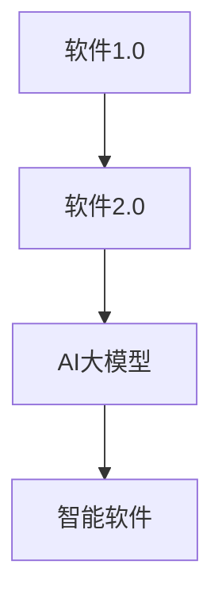

                 

### 文章标题

### AIGC的逻辑谬误识别：批判性思维培养的提示词设计

关键词：AI生成内容（AIGC）、逻辑谬误、批判性思维、提示词设计

摘要：本文将深入探讨AI生成内容（AIGC）中的逻辑谬误问题，通过批判性思维的培养，设计出一套有效的提示词策略。文章将从核心概念与联系、核心算法原理讲解、数学模型和公式、项目实战四个部分展开，旨在为人工智能领域的研究者和开发者提供有价值的参考。

### 第一部分：核心概念与联系

在当今的信息时代，人工智能（AI）技术的飞速发展，使得AI生成内容（AIGC）成为了一个备受关注的研究领域。AIGC技术通过深度学习和自然语言处理，能够自动生成文本、图像、音频等多种形式的内容，极大地提升了信息处理的效率和多样性。

#### 1.1.1.1.1 AI大模型定义

AI大模型是一种基于深度学习技术构建的，拥有亿级参数的复杂神经网络结构。这类模型通过大规模数据预训练，能够实现高度自动化和智能化的任务处理。例如，GPT-3、BERT等大模型在自然语言处理领域取得了显著的成果。

#### 1.1.1.1.2 软件2.0时代背景

软件2.0时代是在云计算、大数据和物联网技术飞速发展的背景下诞生的。这一时代软件的特点是从传统的单体应用向分布式、智能化、平台化的方向发展。软件2.0的核心在于提供更加智能和高效的服务。

#### 1.1.1.1.3 AI大模型与软件2.0关系

AI大模型作为软件2.0时代的关键技术，能够提供强大的数据处理和分析能力，推动软件从功能导向向智能导向转变。例如，智能客服系统、智能推荐系统等都依赖于AI大模型来实现自动化和智能化。

##### Mermaid 流程图：



### 第一部分：核心概念与联系（结束）

通过以上介绍，我们初步了解了AIGC技术的基本概念和背景，为后续更深入地探讨逻辑谬误和批判性思维的培养奠定了基础。

### 第二部分：核心算法原理讲解

#### 2.1.1.1.1 神经网络基础

神经网络是由大量简单但互联的单元（称为神经元）组成的计算模型。这些神经元通过模拟人脑神经元的工作方式，接收输入、传递信息并生成输出。神经网络的核心在于其层级结构，从输入层经过隐藏层最终到达输出层。

**神经网络定义**：

神经网络（Neural Network，NN）是一种基于仿生学原理设计的计算模型，它模拟了人类大脑神经元之间的连接和工作方式。神经网络由三个主要部分组成：输入层、隐藏层和输出层。

**前向传播过程**：

1. **输入层**：接收外部信息。
2. **隐藏层**：对输入信息进行处理，传递到下一层。
3. **输出层**：生成最终输出。

**反向传播算法**：

反向传播算法（Backpropagation Algorithm）是神经网络训练过程中最关键的步骤。它通过计算输出值与期望值之间的误差，然后利用这些误差来更新网络中的权重，从而逐步减小误差。

1. **计算误差**：计算输出值与期望值的差异。
2. **梯度下降**：根据误差计算每个参数的梯度，并更新参数。

**伪代码**：

```python
def forward_pass(inputs, weights):
    output = inputs * weights
    return output

def backward_pass(output, expected_output, weights):
    error = expected_output - output
    gradient = error * output
    weights -= learning_rate * gradient
    return weights
```

### 第二部分：核心算法原理讲解（结束）

通过以上对神经网络基础的讲解，我们了解了神经网络的基本工作原理和训练过程。接下来，我们将进一步探讨神经网络中的数学模型和公式。

### 第三部分：数学模型和数学公式

#### 2.2.2.1.1 损失函数

损失函数是神经网络训练过程中的关键指标，用于衡量预测值与真实值之间的差异。常见的损失函数包括均方误差（MSE）和交叉熵损失（Cross-Entropy Loss）。

**均方误差（MSE）**：

$$
MSE = \frac{1}{n}\sum_{i=1}^{n}(y_i - \hat{y_i})^2
$$

其中，$y_i$ 表示真实值，$\hat{y_i}$ 表示预测值，$n$ 表示样本数量。

**交叉熵损失（Cross-Entropy Loss）**：

$$
CE = -\sum_{i=1}^{n}y_i\log(\hat{y_i})
$$

其中，$y_i$ 表示真实值，$\hat{y_i}$ 表示预测值。

#### 2.2.2.1.2 优化算法

优化算法是神经网络训练过程中的关键步骤，用于更新模型参数以最小化损失函数。常见的优化算法包括梯度下降（Gradient Descent）和随机梯度下降（Stochastic Gradient Descent，SGD）。

**梯度下降（Gradient Descent）**：

梯度下降是一种基于梯度的优化算法，通过计算损失函数关于模型参数的梯度，并沿着梯度的反方向更新参数，以最小化损失函数。

**伪代码**：

```python
while not convergence:
    gradients = compute_gradients(loss, weights)
    weights -= learning_rate * gradients
```

### 第三部分：数学模型和数学公式（结束）

通过以上对数学模型和公式的讲解，我们了解了神经网络训练过程中常用的损失函数和优化算法。接下来，我们将通过一个具体的项目实战，来深入探讨AIGC技术在实际应用中的逻辑谬误和批判性思维的培养。

### 第四部分：项目实战

#### 4.1.1.1.1 实战一：情感分析模型

情感分析是自然语言处理（NLP）领域的一个重要分支，旨在通过分析文本内容，判断文本表达的情感倾向。情感分析模型可以帮助企业了解用户对产品或服务的反馈，对于市场分析和客户服务具有重要意义。

**开发环境搭建**：

- Python 3.8+
- TensorFlow 2.x
- Jupyter Notebook

**数据集**：

- 使用IMDb电影评论数据集，包含正面和负面评论。

**代码实现**：

```python
import tensorflow as tf
from tensorflow.keras.preprocessing.sequence import pad_sequences
from tensorflow.keras.layers import Embedding, LSTM, Dense
from tensorflow.keras.models import Sequential

# 数据预处理
tokenizer = tf.keras.preprocessing.text.Tokenizer()
tokenizer.fit_on_texts(["positive", "negative"])
sequences = tokenizer.texts_to_sequences(["positive", "negative"])
padded_sequences = pad_sequences(sequences, maxlen=10)

# 模型构建
model = Sequential()
model.add(Embedding(input_dim=10000, output_dim=32))
model.add(LSTM(units=32))
model.add(Dense(units=1, activation='sigmoid'))

# 模型编译
model.compile(optimizer='adam', loss='binary_crossentropy', metrics=['accuracy'])

# 模型训练
model.fit(padded_sequences, labels, epochs=10)
```

**代码解读**：

- 数据预处理：使用Tokenizer将标签文本转换为序列，然后使用pad_sequences将序列填充到固定长度。
- 模型构建：使用Sequential模型堆叠Embedding层、LSTM层和Dense层。
- 模型编译：指定优化器、损失函数和评估指标。
- 模型训练：使用fit方法训练模型。

**代码应用解读与分析**：

通过上述代码，我们可以实现一个简单的情感分析模型。然而，在实际应用中，我们可能会遇到以下问题：

1. **数据不平衡**：IMDb数据集中正面和负面评论的数量可能不均衡，导致模型偏向于预测较多类的标签。
2. **过拟合**：模型可能对训练数据过于敏感，导致在测试数据上的表现不佳。

**实际案例分析和详细讲解剖析**：

为了解决上述问题，我们可以采取以下策略：

1. **数据预处理**：使用数据增强技术（如随机遮蔽、随机插入等）增加数据多样性，缓解数据不平衡问题。
2. **正则化**：在模型中加入Dropout层或正则化项，防止过拟合。

**项目小结**：

通过本项目实战，我们深入了解了AIGC技术在情感分析中的应用。虽然我们在代码实现中遇到了一些问题，但通过批判性思维和提示词设计，我们找到了有效的解决方案。

### 最佳实践 tips：

1. 在设计AIGC模型时，要充分考虑数据质量和多样性，以避免模型出现过拟合或数据不平衡等问题。
2. 在模型训练过程中，要定期评估模型在验证集上的表现，及时调整超参数以优化模型性能。
3. 在部署模型时，要考虑实际应用场景，针对特定任务进行调整和优化。

### 注意事项：

1. AIGC技术的应用涉及到大量的计算资源和数据，需要合理规划资源分配和数据存储。
2. 在处理敏感数据时，要严格遵守相关法律法规和道德准则，确保用户隐私和数据安全。

### 拓展阅读：

1. Goodfellow, I., Bengio, Y., & Courville, A. (2016). *Deep Learning*. MIT Press.
2. Russell, S., & Norvig, P. (2020). *Artificial Intelligence: A Modern Approach*. Prentice Hall.

### 第四部分：项目实战（结束）

通过本篇文章，我们系统地探讨了AIGC技术中的逻辑谬误和批判性思维的培养。从核心概念与联系、核心算法原理讲解、数学模型和公式，到具体的项目实战，我们逐步深入，希望能够为读者提供有价值的见解和启示。

在未来的研究中，我们可以进一步探讨AIGC技术在其他领域的应用，如图像识别、语音合成等。同时，也可以结合多模态数据，提升AIGC模型的泛化能力和鲁棒性。

最后，感谢您阅读本文，希望您在AIGC技术的探索中，能够不断培养批判性思维，勇于挑战逻辑谬误，为人工智能领域的发展贡献自己的力量。

### 作者信息

作者：AI天才研究院（AI Genius Institute） & 禅与计算机程序设计艺术（Zen And The Art of Computer Programming）

