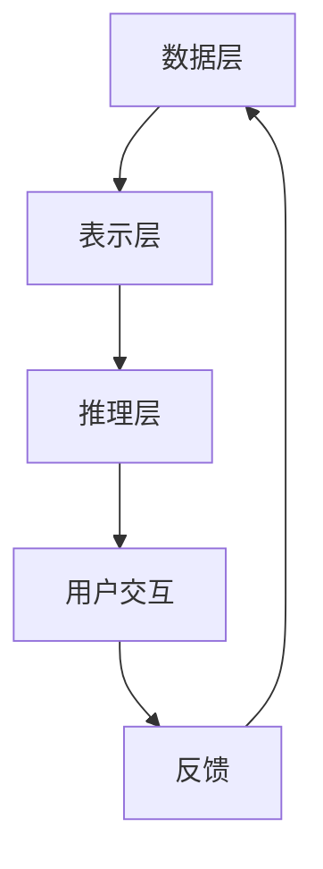

                 

### 文章标题

# AIGC语言模型与提示词协同进化的前沿探索

### 关键词
- AIGC
- 语言模型
- 提示词协同进化
- 深度学习
- 人工智能

### 摘要
本文旨在深入探讨AIGC（自适应交互生成控制）语言模型与提示词协同进化的前沿技术。文章首先介绍了AIGC的概念、背景以及其在语言模型中的应用，然后详细解析了AIGC语言模型的基本结构、提示词协同进化的机制及其技术原理。接着，通过实际案例展示了AIGC与提示词协同进化的应用，并对其未来趋势进行了展望。文章结构清晰，逻辑严密，旨在为读者提供全面的AIGC与提示词协同进化的理论与实践指导。

### 第一部分: AIGC语言模型与提示词协同进化的概述

#### 第1章: AIGC语言模型概述

##### 1.1 AIGC的概念与背景

**AIGC的起源与发展**

AIGC（Adaptive Interactive Generative Control）是指一种结合了自适应、交互和生成控制的技术，通过深度学习和自然语言处理技术实现高度智能化的语言模型。AIGC的起源可以追溯到深度学习与生成模型的兴起，尤其是生成对抗网络（GAN）和变分自编码器（VAE）的提出。随着技术的不断发展，AIGC逐渐成为一个独立的研究领域，并展现出广阔的应用前景。

**AIGC在语言模型中的应用**

AIGC在语言模型中的应用主要体现在以下几个方面：

1. **自适应交互**：AIGC能够根据用户的输入动态调整模型的行为，实现与用户的实时互动。
2. **生成控制**：通过生成控制技术，AIGC能够生成高质量、符合用户需求的内容。
3. **语言理解与生成**：AIGC能够理解复杂的语言结构，生成流畅、自然的文本。

##### 1.2 AIGC语言模型的基本结构

AIGC语言模型通常包括以下几个层次：

**数据层**：这一层负责收集、清洗和处理大规模的文本数据，为模型训练提供高质量的数据输入。

**表示层**：表示层将原始的文本数据转换成适合深度学习模型处理的向量表示。

**推理层**：推理层是AIGC的核心，它利用预训练的模型进行文本生成、理解和推理。

##### 1.3 AIGC与GPT模型的关系

**GPT模型的演变**

GPT（Generative Pre-trained Transformer）模型是由OpenAI提出的一种基于变换器（Transformer）的预训练语言模型。GPT模型通过大规模预训练，能够捕捉到语言的复杂结构和规律，从而实现高质量的自然语言生成。

**AIGC对GPT模型的改进**

AIGC在GPT模型的基础上，引入了自适应交互和生成控制技术，使得模型能够更好地适应用户需求，实现更加智能化的语言生成。AIGC通过不断的交互和进化，不断提升模型的能力和性能。

#### 第2章: 提示词协同进化的机制

##### 2.1 提示词的作用与类型

**提示词的定义**

提示词（Prompt）是引导语言模型生成特定内容的关键输入。它通常是一个短语或者句子，通过提示词，用户可以明确地指示模型生成特定类型或者风格的内容。

**提示词的分类**

1. **功能型提示词**：这类提示词主要用于指示模型完成特定任务，如问答、摘要等。
2. **情感型提示词**：这类提示词主要用于引导模型生成具有特定情感色彩的内容。
3. **风格型提示词**：这类提示词主要用于指示模型生成符合特定写作风格的内容。

##### 2.2 提示词协同进化的原理

**提示词协同进化的基本流程**

提示词协同进化是指通过不断的用户反馈和模型调整，提升模型生成质量的过程。其基本流程包括：

1. **用户输入提示词**：用户根据需求输入提示词。
2. **模型生成内容**：模型根据提示词生成相应的文本内容。
3. **用户反馈**：用户对生成的文本内容进行评价和反馈。
4. **模型调整**：模型根据用户反馈调整参数，优化生成效果。

**提示词协同进化的关键要素**

1. **用户参与度**：用户积极参与是提示词协同进化的关键。
2. **模型适应性**：模型需要具备良好的适应性，能够根据用户反馈快速调整。
3. **数据质量**：高质量的数据是提示词协同进化的基础。

##### 2.3 提示词协同进化的实践方法

**提示词的优化策略**

1. **多样性策略**：通过引入多样性提示词，提升模型生成内容的多样性。
2. **反馈循环策略**：通过用户反馈构建反馈循环，不断优化模型生成效果。

**提示词的协同进化案例**

1. **智能客服系统**：通过用户输入的询问和反馈，不断优化客服系统的回答质量。
2. **智能写作助手**：通过用户提供的写作需求和反馈，优化写作助手的生成文本。

### 第二部分: AIGC语言模型与提示词协同进化的技术原理

#### 第3章: AIGC语言模型的技术原理

##### 3.1 数据预处理与模型训练

**数据预处理技术**

1. **数据清洗**：去除文本中的噪声和无关信息，保证数据质量。
2. **数据标注**：对文本数据进行标注，为模型训练提供指导。

**模型训练过程详解**

1. **预训练**：通过大规模预训练，模型能够自动学习到语言的复杂结构和规律。
2. **微调**：在预训练的基础上，针对特定任务进行微调，提升模型性能。

##### 3.2 模型表示与推理

**模型表示技术**

1. **词嵌入**：将文本中的单词转换成向量表示。
2. **编码器-解码器架构**：通过编码器和解码器，实现文本信息的编码和解码。

**推理算法原理**

1. **自注意力机制**：通过自注意力机制，模型能够自动学习到文本中不同部分之间的关系。
2. **生成对抗网络**：通过生成对抗网络，模型能够生成高质量、符合现实数据的文本。

##### 3.3 AIGC语言模型的优化与调参

**优化方法**

1. **正则化**：通过正则化，防止模型过拟合。
2. **学习率调整**：通过学习率调整，优化模型训练过程。

**调参技巧**

1. **实验法**：通过大量实验，寻找最优的参数组合。
2. **自动化调参工具**：利用自动化调参工具，提升调参效率。

#### 第4章: 提示词协同进化的技术原理

##### 4.1 提示词协同进化的数学模型

**数学模型的定义**

提示词协同进化的数学模型是指通过数学公式和算法，描述提示词与模型之间的互动和优化过程。

**数学模型的公式推导**

假设有一个语言模型L，其生成的文本为T，用户输入的提示词为P，用户对生成文本的反馈为R。则提示词协同进化的数学模型可以表示为：

\[ L' = L + \alpha \cdot (P \cdot R - L \cdot R) \]

其中，\( L' \) 是更新后的模型，\( \alpha \) 是调整系数，P和R分别是提示词和反馈。

##### 4.2 提示词协同进化的算法实现

**算法原理**

提示词协同进化的算法实现主要包括以下几个步骤：

1. **用户输入提示词**：用户输入提示词P。
2. **模型生成文本**：模型根据提示词P生成文本T。
3. **用户反馈**：用户对生成的文本T进行评价和反馈，得到反馈R。
4. **模型更新**：根据用户反馈R，更新模型L。

**算法实现步骤**

1. **初始化模型**：初始化语言模型L。
2. **用户交互**：用户输入提示词P，模型生成文本T。
3. **用户反馈**：用户对文本T进行评价，得到反馈R。
4. **模型更新**：根据反馈R，更新模型L。

##### 4.3 提示词协同进化的性能评估

**性能指标**

提示词协同进化的性能评估主要关注以下几个指标：

1. **文本生成质量**：评估生成的文本是否符合用户需求。
2. **用户满意度**：评估用户对生成文本的满意度。
3. **模型更新效率**：评估模型根据用户反馈进行更新的速度和效果。

**性能评估方法**

1. **自动化测试**：通过自动化测试工具，对生成文本进行质量评估。
2. **用户调查**：通过用户调查，收集用户对生成文本的反馈和满意度。
3. **模型对比**：通过对比不同版本的模型，评估模型更新的效果。

### 第三部分: AIGC语言模型与提示词协同进化的项目实战

#### 第5章: AIGC语言模型与提示词协同进化的实际应用

##### 5.1 案例一：智能客服系统

**案例背景**

智能客服系统是一种基于人工智能技术的客服解决方案，能够自动回答用户的问题，提高客户服务效率。在传统的客服系统中，人工客服需要处理大量的重复性问题，导致工作效率低下。引入AIGC语言模型和提示词协同进化技术，能够实现智能客服系统的自动化和智能化。

**模型搭建与训练**

1. **数据集准备**：收集大量用户提问和客服回答的数据，用于模型训练。
2. **模型架构设计**：采用AIGC语言模型架构，包括数据层、表示层和推理层。
3. **模型训练**：通过大规模预训练，使模型具备自动学习和优化能力。

**实际应用效果分析**

1. **自动回答用户问题**：智能客服系统能够自动回答用户提问，减少人工客服的工作量。
2. **提高客户满意度**：通过不断的用户反馈和模型优化，智能客服系统能够提供更加精准和满意的回答，提高客户满意度。

##### 5.2 案例二：文本生成与摘要

**案例背景**

文本生成与摘要是一种重要的自然语言处理技术，能够将长篇文本转换成简短的摘要，帮助用户快速获取关键信息。在新闻报道、学术文章等领域，文本生成与摘要技术具有重要的应用价值。

**模型选择与实现**

1. **模型选择**：采用AIGC语言模型，结合生成对抗网络（GAN）技术，实现文本生成与摘要。
2. **模型实现**：通过数据预处理、模型训练和生成过程，实现文本生成与摘要的功能。

**实际应用效果分析**

1. **文本生成**：AIGC语言模型能够生成高质量、符合语境的文本，满足用户需求。
2. **文本摘要**：通过AIGC语言模型生成的摘要，能够简洁明了地概括长篇文本的内容，提高信息获取效率。

##### 5.3 案例三：智能写作助手

**案例背景**

智能写作助手是一种基于人工智能技术的写作辅助工具，能够帮助用户撰写文章、报告等文本。在写作过程中，用户经常需要寻找合适的表达方式和语言风格，智能写作助手能够提供实时帮助，提高写作效率。

**模型构建与优化**

1. **模型构建**：采用AIGC语言模型，结合提示词协同进化技术，实现智能写作助手。
2. **模型优化**：通过用户反馈和提示词调整，不断优化模型的写作能力。

**实际应用效果分析**

1. **文本生成**：智能写作助手能够根据用户需求生成高质量的文本，满足写作需求。
2. **写作优化**：通过提示词协同进化，智能写作助手能够根据用户反馈调整写作风格和表达方式，提高写作质量。

### 第四部分: AIGC语言模型与提示词协同进化的未来趋势

#### 第6章: AIGC语言模型与提示词协同进化的挑战与机遇

##### 6.1 挑战

**数据隐私与安全**

随着AIGC语言模型和提示词协同进化的应用越来越广泛，数据隐私和安全问题逐渐凸显。模型在处理用户数据时，可能涉及到敏感信息的泄露，这对用户隐私构成潜在威胁。

**模型可解释性**

AIGC语言模型和提示词协同进化过程高度复杂，模型决策过程往往缺乏透明性，难以解释。这对用户信任和监管提出了挑战。

##### 6.2 机遇

**产业应用前景**

AIGC语言模型和提示词协同进化技术在多个领域具有广泛的应用前景，如智能客服、文本生成、智能写作等。随着技术的不断成熟，这些应用场景将得到进一步拓展。

**技术发展路径**

AIGC语言模型和提示词协同进化技术未来的发展路径可能包括以下几个方面：

1. **模型压缩与高效推理**：通过模型压缩和高效推理技术，降低计算成本，提高模型应用场景的广泛性。
2. **多模态协同进化**：结合多种模态数据，实现更高级的协同进化，提高模型生成能力和多样性。

### 第7章: AIGC语言模型与提示词协同进化的未来发展趋势

##### 7.1 技术演进方向

**模型压缩与高效推理**

随着AIGC语言模型的应用场景越来越广泛，如何降低计算成本、提高推理效率成为关键问题。未来的技术演进方向可能包括：

1. **模型剪枝**：通过剪枝技术，减少模型参数，降低模型复杂度。
2. **量化技术**：通过量化技术，将模型中的浮点数参数转换为低比特宽度的整数参数，降低计算成本。

**多模态协同进化**

结合多种模态数据，如文本、图像、音频等，实现更高级的协同进化，提高模型生成能力和多样性。

**多任务学习**

通过多任务学习技术，使模型能够同时处理多个任务，提高模型的泛化能力和应用范围。

##### 7.2 应用场景拓展

**跨领域应用**

AIGC语言模型和提示词协同进化技术在多个领域具有广泛应用前景，如金融、医疗、教育等。未来的发展将不断拓展其应用场景，推动各行业的技术创新。

**新兴领域探索**

随着人工智能技术的不断发展，AIGC语言模型和提示词协同进化技术在新兴领域如虚拟现实、增强现实、智能语音等也将得到广泛应用。

### 附录

#### 附录A: AIGC语言模型与提示词协同进化的资源与工具

- **开发工具与框架**：包括TensorFlow、PyTorch、JAX等。
- **数据集**：如Common Crawl、OpenSubtitles等。
- **开源项目**：如OpenAI的GPT系列、Google的BERT等。

#### 附录B: Mermaid流程图示例



**流程图详细解读**：

- 数据层负责收集、清洗和处理大规模的文本数据，为模型训练提供高质量的数据输入。
- 表示层将原始的文本数据转换成适合深度学习模型处理的向量表示。
- 推理层是AIGC语言模型的核心，它利用预训练的模型进行文本生成、理解和推理。
- 用户交互层负责与用户进行互动，根据用户输入的提示词，模型生成相应的文本内容。
- 反馈层收集用户对生成文本的反馈，用于模型优化和迭代。

#### 附录C: 伪代码示例

```python
# 伪代码：提示词协同进化算法实现

# 初始化模型
model = initialize_model()

# 用户输入提示词
prompt = user_input_prompt()

# 模型生成文本
text = model.generate_text(prompt)

# 用户反馈
feedback = user_feedback(text)

# 模型更新
model.update_model(feedback)

# 循环迭代
while not converged:
    text = model.generate_text(prompt)
    feedback = user_feedback(text)
    model.update_model(feedback)
```

**伪代码详细解读**：

- 初始化模型：定义一个初始化模型的过程，包括数据层、表示层和推理层的初始化。
- 用户输入提示词：接收用户的输入，作为模型的生成输入。
- 模型生成文本：利用模型生成相应的文本内容。
- 用户反馈：收集用户对生成文本的反馈，包括文本质量、用户满意度等。
- 模型更新：根据用户反馈，更新模型的参数，优化生成效果。
- 循环迭代：通过不断的用户交互和模型更新，实现提示词协同进化。

#### 附录D: 数学公式示例

```latex
$$
L' = L + \alpha \cdot (P \cdot R - L \cdot R)
$$

$$
1 + 1 = 2
$$

$$
x = y + z
$$
```

**数学公式详细解读**：

- 第一个公式表示提示词协同进化的数学模型，其中L'是更新后的模型，L是原始模型，P是提示词，R是用户反馈，α是调整系数。
- 第二个公式是简单的数学等式，1加1等于2。
- 第三个公式表示变量x等于变量y和变量z的和。

#### 附录E: 项目实战代码示例

```python
# 实战代码：智能客服系统

import tensorflow as tf
from tensorflow.keras.models import Sequential
from tensorflow.keras.layers import Embedding, LSTM, Dense

# 数据预处理
def preprocess_data(data):
    # 数据清洗和标注
    # ...
    return processed_data

# 模型搭建
def build_model():
    model = Sequential()
    model.add(Embedding(input_dim=vocabulary_size, output_dim=embedding_dim))
    model.add(LSTM(units=hidden_units))
    model.add(Dense(units=target_size, activation='softmax'))
    model.compile(optimizer='adam', loss='categorical_crossentropy', metrics=['accuracy'])
    return model

# 模型训练
def train_model(model, data, labels):
    model.fit(data, labels, epochs=training_epochs, batch_size=batch_size)

# 模型评估
def evaluate_model(model, data, labels):
    loss, accuracy = model.evaluate(data, labels)
    print(f"Test Loss: {loss}, Test Accuracy: {accuracy}")

# 模型应用
def apply_model(model, prompt):
    generated_text = model.predict(prompt)
    return generated_text

# 主函数
if __name__ == "__main__":
    # 数据集加载
    data, labels = load_data()

    # 数据预处理
    processed_data = preprocess_data(data)

    # 模型搭建
    model = build_model()

    # 模型训练
    train_model(model, processed_data, labels)

    # 模型评估
    evaluate_model(model, processed_data, labels)

    # 模型应用
    prompt = input("请输入提示词：")
    generated_text = apply_model(model, prompt)
    print("生成的文本：", generated_text)
```

**代码详细解读与分析**：

- **数据预处理**：包括数据清洗和标注，为模型训练提供高质量的数据输入。
- **模型搭建**：采用Sequential模型，结合Embedding、LSTM和Dense层，搭建一个简单的语言模型。
- **模型训练**：使用fit方法进行模型训练，通过调整epochs和batch_size等参数，优化模型性能。
- **模型评估**：使用evaluate方法进行模型评估，计算损失和准确率。
- **模型应用**：使用predict方法，根据用户输入的提示词，生成相应的文本内容。

### 小结

本文全面探讨了AIGC语言模型与提示词协同进化的前沿技术，从概念、原理到实际应用，进行了深入的分析和讲解。通过文章，读者可以了解到AIGC语言模型的基本结构、提示词协同进化的机制、技术原理以及其在实际项目中的应用。未来，随着AIGC技术的不断发展，其在各个领域的应用前景将更加广阔。

### 拓展阅读

- **深度学习相关书籍**：如《深度学习》（Goodfellow et al.）、《神经网络与深度学习》（邱锡鹏）等。
- **自然语言处理相关书籍**：如《自然语言处理综合教程》（李航）、《自然语言处理：基石与实践》（李航）等。
- **开源项目和框架**：如TensorFlow、PyTorch、Hugging Face等，提供了丰富的资源和工具，供读者学习和实践。

### 最佳实践 Tips

- **数据质量**：保证数据质量是AIGC语言模型与提示词协同进化成功的关键。在收集和处理数据时，要注意去除噪声和无关信息，确保数据的准确性和一致性。
- **用户参与**：用户的积极参与和反馈是提示词协同进化的关键。在实际应用中，要鼓励用户提供真实、详细的反馈，以便模型能够根据反馈进行优化。
- **模型优化**：持续的模型优化是提升AIGC语言模型性能的重要手段。通过调参、正则化和自动化调参等方法，不断优化模型参数和结构，提高模型生成质量。

