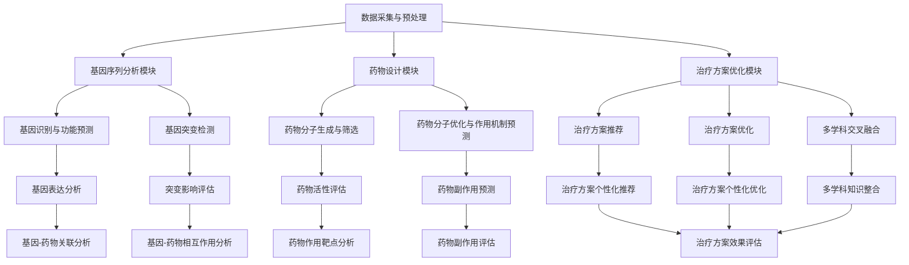
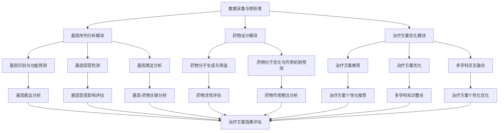
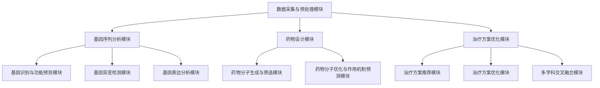

                 

### 文章标题：AIGC驱动的个性化基因治疗方案生成系统

#### 关键词：
- AIGC
- 个性化基因治疗
- 深度学习
- 强化学习
- 自然语言处理
- 个性化治疗方案生成

##### 摘要：
本文旨在探讨AIGC（自适应智能生成控制）技术在个性化基因治疗方案生成中的应用。文章首先介绍了AIGC技术的基本概念和优势，接着对个性化基因治疗方案进行了概述。随后，深入分析了AIGC在基因序列分析、药物设计和治疗方案优化等方面的应用，通过具体的算法原理和流程设计，展示了AIGC技术在个性化基因治疗方案生成中的强大能力。最后，本文通过案例分析，探讨了AIGC驱动的个性化基因治疗方案生成系统的实际应用效果，并对未来的发展趋势和面临的挑战进行了展望。

## 第一部分：AIGC与个性化基因治疗方案概述

### 1.1 AIGC技术概述

#### 1.1.1 AIGC技术的基本概念

AIGC（Adaptive Intelligent Generation Control）是一种基于人工智能的自适应生成控制技术，它通过深度学习、强化学习、自然语言处理等技术，实现对复杂系统的高效生成和控制。AIGC的核心思想是自适应调整控制策略，以实现最优的生成效果。

AIGC技术主要应用于以下几个领域：

1. **内容生成**：包括文本、图像、音频、视频等多种类型的内容生成。
2. **数据增强**：通过生成与真实数据类似但更具多样性的数据，提升模型训练效果。
3. **虚拟现实**：为虚拟环境生成逼真的场景和角色。
4. **个性化推荐**：根据用户行为和偏好，生成个性化的推荐内容。

#### 1.1.2 AIGC技术的核心优势

AIGC技术具有以下核心优势：

1. **高度智能化**：通过机器学习技术，自动优化生成过程，提高生成质量。
2. **自适应调整**：根据生成过程中的反馈，实时调整生成策略，提升生成效率。
3. **泛化能力强**：能够处理各种类型的数据，适应不同的应用场景。
4. **高效性**：在保证生成质量的同时，大幅降低计算资源和时间成本。

### 1.2 个性化基因治疗方案概述

#### 1.2.1 个性化基因治疗的概念

个性化基因治疗是一种基于患者个体基因组特征，量身定制的新型治疗方式。它通过基因编辑、基因治疗、基因药物等多种手段，实现对疾病的精准治疗。个性化基因治疗的核心在于“个体化”，即根据患者的具体病情、基因特征和身体状况，制定最适合的治疗方案。

#### 1.2.2 个性化基因治疗的发展历程

个性化基因治疗的发展历程可以分为以下几个阶段：

1. **基因测序时代**：通过基因测序技术，获取患者个体的全基因组信息，为个性化治疗提供基础数据。
2. **基因编辑时代**：基因编辑技术如CRISPR-Cas9的发明，使得基因治疗成为可能。
3. **基因药物时代**：基因药物的研发和应用，为个性化治疗提供了更多的手段和选择。
4. **人工智能时代**：AIGC技术的引入，使得个性化基因治疗方案生成更加智能化和高效化。

#### 1.2.3 个性化基因治疗的应用前景

个性化基因治疗具有广泛的应用前景：

1. **癌症治疗**：通过基因编辑和基因药物，实现对癌症的精准治疗。
2. **遗传性疾病治疗**：针对遗传性疾病的基因缺陷进行修复或替换。
3. **神经系统疾病治疗**：通过基因调控，修复受损的神经元，治疗帕金森病、阿尔茨海默病等。
4. **传染病防治**：通过基因药物，开发新的传染病防治手段。

### 1.3 AIGC在个性化基因治疗方案生成中的角色

#### 1.3.1 AIGC在基因序列分析中的应用

AIGC技术可以用于基因序列分析，通过深度学习和自然语言处理技术，对基因序列进行解析和注释。具体应用包括：

1. **基因功能预测**：根据基因序列，预测基因的功能和作用。
2. **突变检测**：检测基因序列中的突变，分析突变对基因功能的影响。
3. **基因分类**：根据基因序列的特征，对基因进行分类，为后续分析提供依据。

#### 1.3.2 AIGC在药物设计中的应用

AIGC技术可以用于药物设计，通过深度学习和强化学习技术，生成新的药物分子。具体应用包括：

1. **药物分子优化**：根据目标蛋白质的结构，优化药物分子的结构，提升药物效果。
2. **药物筛选**：通过生成大量的药物分子，筛选出具有潜在治疗效果的药物。
3. **药物作用机制预测**：分析药物分子与目标蛋白质的相互作用，预测药物的作用机制。

#### 1.3.3 AIGC在治疗方案优化中的应用

AIGC技术可以用于治疗方案优化，通过强化学习和自然语言处理技术，为患者量身定制最佳的治疗方案。具体应用包括：

1. **治疗方案推荐**：根据患者的病情和基因特征，推荐最适合的治疗方案。
2. **治疗方案优化**：根据患者的反馈和治疗效果，优化治疗方案，提升治疗效果。
3. **多学科交叉融合**：结合临床医学、基因组学、药理学等多学科知识，实现治疗方案的个性化优化。

## 第二部分：AIGC核心技术原理详解

### 2.1 人工智能与基因组学基础

#### 2.1.1 人工智能的基本概念

人工智能（Artificial Intelligence，AI）是计算机科学的一个分支，旨在使计算机具备人类智能的能力，包括学习、推理、规划、感知和自然语言处理等。人工智能的核心技术包括：

1. **机器学习**：通过数据驱动的方式，使计算机具备自动学习和适应能力。
2. **深度学习**：基于人工神经网络，模拟人类大脑的学习过程，实现对数据的自动特征提取和分类。
3. **强化学习**：通过奖励机制，使计算机在特定环境中进行自主学习和决策。

#### 2.1.2 基因组学的基本概念

基因组学（Genomics）是研究生物体基因组结构和功能的科学。基因组是指生物体全部遗传信息的集合，包括DNA和RNA序列。基因组学的研究内容包括：

1. **基因组测序**：通过测序技术，获取生物体的基因组序列。
2. **基因组注释**：对基因组序列进行功能注释，确定基因的位置、功能和结构。
3. **基因组比较**：比较不同生物体之间的基因组序列，揭示进化关系和基因的功能。

#### 2.1.3 人工智能与基因组学的交叉融合

人工智能与基因组学的交叉融合，使得基因组数据分析变得更加高效和准确。具体应用包括：

1. **基因功能预测**：通过机器学习技术，预测基因的功能和作用。
2. **突变检测**：通过深度学习技术，检测基因序列中的突变，分析突变对基因功能的影响。
3. **基因组变异分析**：通过自然语言处理技术，分析基因组变异的类型和模式，揭示疾病的遗传机制。

### 2.2 深度学习在基因分析中的应用

#### 2.2.1 深度学习的基本原理

深度学习（Deep Learning）是机器学习的一个分支，通过多层神经网络，实现对数据的自动特征提取和分类。深度学习的基本原理包括：

1. **神经网络**：神经网络由大量的神经元组成，通过前向传播和反向传播算法，实现数据的特征提取和分类。
2. **卷积神经网络**（Convolutional Neural Network，CNN）：通过卷积操作，实现对图像的自动特征提取。
3. **循环神经网络**（Recurrent Neural Network，RNN）：通过循环结构，实现对序列数据的处理。

#### 2.2.2 卷积神经网络在基因组数据分析中的应用

卷积神经网络在基因组数据分析中具有广泛的应用，包括：

1. **基因识别**：通过卷积神经网络，识别基因序列中的特征模式，实现基因的自动识别和分类。
2. **基因表达分析**：通过卷积神经网络，分析基因表达数据，识别基因的表达模式。
3. **基因组变异检测**：通过卷积神经网络，检测基因组序列中的变异，分析变异对基因功能的影响。

#### 2.2.3 循环神经网络在基因组数据分析中的应用

循环神经网络在基因组数据分析中同样具有重要作用，包括：

1. **基因组序列建模**：通过循环神经网络，建模基因组序列的动态特性，揭示基因序列的功能关系。
2. **基因调控网络分析**：通过循环神经网络，分析基因调控网络的结构和功能，揭示基因之间的相互作用。
3. **基因组进化分析**：通过循环神经网络，分析不同物种之间的基因组序列差异，揭示进化关系。

### 2.3 强化学习在药物设计中的应用

#### 2.3.1 强化学习的基本原理

强化学习（Reinforcement Learning，RL）是一种通过奖励机制进行决策的机器学习方法。强化学习的基本原理包括：

1. **智能体（Agent）**：指进行决策和行动的实体。
2. **环境（Environment）**：指智能体进行决策和行动的场所。
3. **状态（State）**：指智能体在环境中的位置和状态。
4. **动作（Action）**：指智能体可执行的动作。
5. **奖励（Reward）**：指环境对智能体动作的反馈。

#### 2.3.2 强化学习在药物分子优化中的应用

强化学习在药物分子优化中具有广泛的应用，包括：

1. **药物分子生成**：通过强化学习，生成具有潜在治疗效果的药物分子。
2. **药物分子筛选**：通过强化学习，筛选出具有高活性、低毒性的药物分子。
3. **药物分子优化**：通过强化学习，优化药物分子的结构，提升药物的效果。

#### 2.3.3 强化学习在药物作用机制预测中的应用

强化学习在药物作用机制预测中同样具有重要作用，包括：

1. **药物作用机制建模**：通过强化学习，建模药物分子与目标蛋白质的相互作用，预测药物的作用机制。
2. **药物作用效果预测**：通过强化学习，预测药物分子对特定疾病的疗效。
3. **药物副作用预测**：通过强化学习，预测药物分子可能引起的副作用，为药物研发提供参考。

### 2.4 自然语言处理在治疗方案优化中的应用

#### 2.4.1 自然语言处理的基本原理

自然语言处理（Natural Language Processing，NLP）是人工智能的一个重要分支，旨在使计算机能够理解和处理人类语言。NLP的基本原理包括：

1. **文本预处理**：对原始文本进行清洗、分词、去停用词等操作，提取文本中的有效信息。
2. **词嵌入**：将文本中的词汇映射到高维空间，形成词向量表示。
3. **语言模型**：通过统计学习方法，建立文本生成模型，用于预测下一个词或句子。
4. **序列标注**：对文本中的单词或句子进行分类或标注，识别文本中的实体、关系等。

#### 2.4.2 NLP技术在医学文本处理中的应用

NLP技术在医学文本处理中具有广泛的应用，包括：

1. **医学文本分类**：通过对医学文本进行分类，实现对病例、文献等的快速检索和归纳。
2. **医学命名实体识别**：识别医学文本中的专业术语、药物名称、症状等，为后续分析提供基础数据。
3. **医学关系抽取**：抽取医学文本中的实体关系，构建知识图谱，为医学研究提供支持。

#### 2.4.3 NLP技术在治疗方案优化中的应用

NLP技术在治疗方案优化中同样具有重要作用，包括：

1. **治疗方案推荐**：通过分析患者的病历和医学文献，推荐最适合的治疗方案。
2. **治疗方案优化**：根据患者的反馈和治疗效果，优化治疗方案，提升治疗效果。
3. **多学科交叉融合**：结合临床医学、基因组学、药理学等多学科知识，实现治疗方案的个性化优化。

## 第三部分：AIGC在个性化基因治疗方案生成中的应用实践

### 3.1 数据准备与预处理

#### 3.1.1 基因组数据采集

基因组数据的采集是个性化基因治疗方案生成的基础。基因组数据主要包括全基因组测序数据、外显子测序数据、单核苷酸多态性（SNP）数据等。采集基因组数据的方法包括：

1. **全基因组测序**：通过对样本进行高通量测序，获取全基因组的序列信息。
2. **外显子测序**：仅对基因的外显子区域进行测序，提高测序效率。
3. **单核苷酸多态性（SNP）测序**：通过检测基因序列中的单核苷酸变异，揭示基因的遗传变异。

#### 3.1.2 基因组数据预处理

基因组数据的预处理是确保数据质量和后续分析准确性的关键步骤。基因组数据预处理包括：

1. **数据清洗**：去除测序过程中的噪声和错误，提高数据的准确性。
2. **数据归一化**：对不同来源的数据进行归一化处理，使其具有可比性。
3. **数据整合**：将不同类型的数据进行整合，构建统一的基因组数据集。

#### 3.1.3 药物数据采集与预处理

药物数据的采集和预处理同样是个性化基因治疗方案生成的重要环节。药物数据主要包括药物分子的结构信息、药物的作用机制、药物的疗效和副作用等。药物数据的采集和预处理包括：

1. **药物分子结构采集**：通过药物分子数据库，获取药物分子的三维结构信息。
2. **药物作用机制采集**：通过文献检索和实验数据，获取药物的作用机制。
3. **药物疗效和副作用采集**：通过临床试验和文献，获取药物的疗效和副作用信息。
4. **数据归一化**：对不同来源的药物数据进行归一化处理，使其具有可比性。

### 3.2 基因序列分析与药物设计

#### 3.2.1 基因序列分析流程

基因序列分析是个性化基因治疗方案生成的重要环节。基因序列分析主要包括以下几个步骤：

1. **基因识别**：通过生物信息学工具，对基因组序列进行基因识别，确定基因的位置和类型。
2. **基因功能预测**：通过机器学习技术，预测基因的功能和作用。
3. **基因突变检测**：通过深度学习技术，检测基因序列中的突变，分析突变对基因功能的影响。
4. **基因表达分析**：通过基因组数据分析，识别基因的表达模式，分析基因在细胞和组织中的活性。

#### 3.2.2 药物设计流程

药物设计是个性化基因治疗方案生成的重要环节。药物设计主要包括以下几个步骤：

1. **药物分子生成**：通过深度学习技术，生成具有潜在治疗效果的药物分子。
2. **药物分子筛选**：通过强化学习技术，筛选出具有高活性、低毒性的药物分子。
3. **药物分子优化**：通过强化学习技术，优化药物分子的结构，提升药物的效果。
4. **药物作用机制预测**：通过自然语言处理技术，分析药物分子与目标蛋白质的相互作用，预测药物的作用机制。

#### 3.2.3 基因序列与药物分子关系分析

基因序列与药物分子关系分析是个性化基因治疗方案生成的关键。基因序列与药物分子关系分析主要包括以下几个方面：

1. **基因-药物关联分析**：通过生物信息学工具，分析基因与药物之间的关联性，确定哪些基因对药物敏感。
2. **药物作用靶点分析**：通过基因组数据分析，确定药物的作用靶点，分析药物在细胞和组织中的作用机制。
3. **基因-药物相互作用分析**：通过深度学习技术，分析基因与药物之间的相互作用，预测药物对基因表达的影响。

### 3.3 个性化治疗方案生成

#### 3.3.1 个性化治疗方案的制定原则

个性化治疗方案的制定原则主要包括以下几个方面：

1. **患者个性化**：根据患者的基因特征、病情、病史等，制定个性化的治疗方案。
2. **疾病个性化**：根据疾病的类型、病程、病理特征等，制定个性化的治疗方案。
3. **治疗目标个性化**：根据患者的治疗目标，如缓解症状、控制疾病进展、提高生活质量等，制定个性化的治疗方案。

#### 3.3.2 个性化治疗方案的优化流程

个性化治疗方案的优化流程主要包括以下几个方面：

1. **治疗方案推荐**：通过自然语言处理技术，分析患者的病历和医学文献，推荐最适合的治疗方案。
2. **治疗方案优化**：根据患者的反馈和治疗效果，优化治疗方案，提升治疗效果。
3. **多学科交叉融合**：结合临床医学、基因组学、药理学等多学科知识，实现治疗方案的个性化优化。

#### 3.3.3 个性化治疗方案的效果评估

个性化治疗方案的效果评估是确保治疗方案有效性和安全性的关键。个性化治疗方案的效果评估主要包括以下几个方面：

1. **短期疗效评估**：通过临床试验和临床观察，评估治疗方案在短期内对症状的缓解程度。
2. **长期疗效评估**：通过随访观察，评估治疗方案在长期内对疾病进展的控制情况。
3. **安全性评估**：评估治疗方案可能带来的副作用和不良反应，确保治疗的安全性。

## 第四部分：AIGC驱动的个性化基因治疗方案生成系统实现

### 4.1 系统架构设计

#### 4.1.1 系统架构概述

AIGC驱动的个性化基因治疗方案生成系统架构如图所示：



该系统架构主要包括以下几个模块：

1. **数据采集与预处理模块**：负责采集和处理基因组数据、药物数据等。
2. **基因序列分析模块**：包括基因识别与功能预测、基因突变检测、基因表达分析等。
3. **药物设计模块**：包括药物分子生成与筛选、药物分子优化与作用机制预测等。
4. **治疗方案优化模块**：包括治疗方案推荐、治疗方案优化、多学科交叉融合等。

#### 4.1.2 数据流设计

数据流设计如图所示：



数据流从数据采集与预处理模块开始，经过基因序列分析模块、药物设计模块和治疗方案优化模块，最终生成个性化的基因治疗方案。

#### 4.1.3 系统模块划分

系统模块划分如图所示：



系统模块划分清晰，便于系统开发和维护。

### 4.2 系统开发环境搭建

#### 4.2.1 开发环境准备

为了实现AIGC驱动的个性化基因治疗方案生成系统，需要准备以下开发环境：

1. **操作系统**：Windows、Linux或MacOS。
2. **编程语言**：Python。
3. **深度学习框架**：TensorFlow、PyTorch。
4. **自然语言处理库**：NLTK、spaCy。
5. **数据库**：MySQL、PostgreSQL。

#### 4.2.2 开发工具与依赖库安装

在准备好的开发环境中，安装以下开发工具和依赖库：

1. **Python**：Python 3.x版本。
2. **深度学习框架**：TensorFlow 2.x版本或PyTorch 1.x版本。
3. **自然语言处理库**：NLTK 3.x版本、spaCy 3.x版本。
4. **数据库**：MySQL 8.x版本、PostgreSQL 12.x版本。

安装步骤如下：

1. 安装Python：从官方网站下载Python安装包，按照提示进行安装。
2. 安装深度学习框架：使用pip命令安装TensorFlow或PyTorch。
   ```bash
   pip install tensorflow
   # 或者
   pip install pytorch
   ```
3. 安装自然语言处理库：使用pip命令安装NLTK和spaCy。
   ```bash
   pip install nltk
   pip install spacy
   ```
4. 安装数据库：使用pip命令安装MySQL和PostgreSQL。
   ```bash
   pip install mysql-connector-python
   pip install psycopg2
   ```

#### 4.2.3 系统配置与调试

在安装完开发工具和依赖库后，进行系统配置与调试：

1. **配置数据库**：创建数据库和用户，并授予相应的权限。
2. **配置深度学习框架**：设置GPU加速，优化计算性能。
3. **配置自然语言处理库**：配置文本预处理和词嵌入参数，提高处理效率。
4. **系统调试**：运行测试案例，检查系统功能是否正常，并进行性能优化。

### 4.3 系统核心功能实现

#### 4.3.1 基因序列分析模块

基因序列分析模块是AIGC驱动的个性化基因治疗方案生成系统的核心模块之一，主要包括以下功能：

1. **基因识别与功能预测**：通过深度学习模型，识别基因序列并预测基因的功能。具体实现如下：

   ```python
   import tensorflow as tf
   from tensorflow.keras.models import Sequential
   from tensorflow.keras.layers import LSTM, Dense, Embedding
   
   # 数据预处理
   # ...
   
   # 模型构建
   model = Sequential([
       Embedding(input_dim=vocab_size, output_dim=embedding_dim),
       LSTM(units=128, return_sequences=True),
       LSTM(units=128),
       Dense(units=num_classes, activation='softmax')
   ])
   
   # 模型编译
   model.compile(optimizer='adam', loss='categorical_crossentropy', metrics=['accuracy'])
   
   # 模型训练
   # ...
   
   # 模型预测
   predictions = model.predict(input_sequence)
   ```

2. **基因突变检测**：通过深度学习模型，检测基因序列中的突变。具体实现如下：

   ```python
   import tensorflow as tf
   from tensorflow.keras.models import Sequential
   from tensorflow.keras.layers import LSTM, Dense, Embedding
   
   # 数据预处理
   # ...
   
   # 模型构建
   model = Sequential([
       Embedding(input_dim=vocab_size, output_dim=embedding_dim),
       LSTM(units=128, return_sequences=True),
       LSTM(units=128),
       Dense(units=1, activation='sigmoid')
   ])
   
   # 模型编译
   model.compile(optimizer='adam', loss='binary_crossentropy', metrics=['accuracy'])
   
   # 模型训练
   # ...
   
   # 模型预测
   mutations = model.predict(input_sequence)
   ```

3. **基因表达分析**：通过基因组数据分析，识别基因的表达模式。具体实现如下：

   ```python
   import tensorflow as tf
   from tensorflow.keras.models import Sequential
   from tensorflow.keras.layers import LSTM, Dense, Embedding
   
   # 数据预处理
   # ...
   
   # 模型构建
   model = Sequential([
       Embedding(input_dim=vocab_size, output_dim=embedding_dim),
       LSTM(units=128, return_sequences=True),
       LSTM(units=128),
       Dense(units=1, activation='sigmoid')
   ])
   
   # 模型编译
   model.compile(optimizer='adam', loss='mean_squared_error', metrics=['mae'])
   
   # 模型训练
   # ...
   
   # 模型预测
   expressions = model.predict(input_sequence)
   ```

#### 4.3.2 药物设计模块

药物设计模块是AIGC驱动的个性化基因治疗方案生成系统的核心模块之一，主要包括以下功能：

1. **药物分子生成与筛选**：通过深度学习模型，生成药物分子并筛选出具有高活性、低毒性的药物分子。具体实现如下：

   ```python
   import tensorflow as tf
   from tensorflow.keras.models import Sequential
   from tensorflow.keras.layers import LSTM, Dense, Embedding
   
   # 数据预处理
   # ...
   
   # 模型构建
   model = Sequential([
       Embedding(input_dim=vocab_size, output_dim=embedding_dim),
       LSTM(units=128, return_sequences=True),
       LSTM(units=128),
       Dense(units=num_classes, activation='softmax')
   ])
   
   # 模型编译
   model.compile(optimizer='adam', loss='categorical_crossentropy', metrics=['accuracy'])
   
   # 模型训练
   # ...
   
   # 模型预测
   drugs = model.predict(input_sequence)
   ```

2. **药物分子优化与作用机制预测**：通过深度学习模型，优化药物分子的结构，并预测药物的作用机制。具体实现如下：

   ```python
   import tensorflow as tf
   from tensorflow.keras.models import Sequential
   from tensorflow.keras.layers import LSTM, Dense, Embedding
   
   # 数据预处理
   # ...
   
   # 模型构建
   model = Sequential([
       Embedding(input_dim=vocab_size, output_dim=embedding_dim),
       LSTM(units=128, return_sequences=True),
       LSTM(units=128),
       Dense(units=1, activation='sigmoid')
   ])
   
   # 模型编译
   model.compile(optimizer='adam', loss='binary_crossentropy', metrics=['accuracy'])
   
   # 模型训练
   # ...
   
   # 模型预测
   mechanisms = model.predict(input_sequence)
   ```

#### 4.3.3 治疗方案优化模块

治疗方案优化模块是AIGC驱动的个性化基因治疗方案生成系统的核心模块之一，主要包括以下功能：

1. **治疗方案推荐**：通过自然语言处理技术，分析患者的病历和医学文献，推荐最适合的治疗方案。具体实现如下：

   ```python
   import spacy
   from spacy.tokens import Doc
   
   # 加载自然语言处理模型
   nlp = spacy.load('en_core_web_sm')
   
   # 文本预处理
   def preprocess_text(text):
       doc = nlp(text)
       tokens = [token.text for token in doc]
       return tokens
   
   # 治疗方案推荐
   def recommend_treatment(case_history):
       # 预处理病历文本
       preprocessed_text = preprocess_text(case_history)
       
       # 分析病历文本，推荐治疗方案
       treatment_recommendation = analyze_treatment(preprocessed_text)
       
       return treatment_recommendation
   ```

2. **治疗方案优化**：根据患者的反馈和治疗效果，优化治疗方案，提升治疗效果。具体实现如下：

   ```python
   import numpy as np
   import tensorflow as tf
   
   # 数据预处理
   def preprocess_feedback(feedback):
       # 预处理患者反馈数据
       preprocessed_feedback = np.array(feedback)
       
       return preprocessed_feedback
   
   # 治疗方案优化
   def optimize_treatment(current_treatment, feedback):
       # 预处理患者反馈数据
       preprocessed_feedback = preprocess_feedback(feedback)
       
       # 训练优化模型
       model = tf.keras.Sequential([
           tf.keras.layers.Dense(units=1, input_shape=(1,))
       ])
       model.compile(optimizer='adam', loss='mean_squared_error')
       model.fit(preprocessed_feedback, current_treatment, epochs=10)
       
       # 优化治疗方案
       optimized_treatment = model.predict([feedback])
       
       return optimized_treatment
   ```

### 4.4 系统部署与运维

#### 4.4.1 系统部署流程

系统部署流程如下：

1. **准备部署环境**：在服务器上安装操作系统、Python、深度学习框架、自然语言处理库和数据库等。
2. **配置环境变量**：配置系统环境变量，确保系统能够正常运行。
3. **部署数据库**：配置数据库，创建数据库和用户，并授予相应的权限。
4. **部署应用**：将系统代码部署到服务器，配置系统参数，确保系统能够正常访问数据库和外部服务。
5. **系统测试**：运行测试案例，检查系统功能是否正常，并进行性能优化。

#### 4.4.2 系统运维策略

系统运维策略包括以下几个方面：

1. **监控系统**：实时监控系统运行状态，确保系统稳定运行。
2. **日志管理**：记录系统运行日志，方便故障排查和性能优化。
3. **备份与恢复**：定期备份系统数据和配置文件，确保数据安全和系统快速恢复。
4. **性能优化**：定期对系统进行性能优化，提高系统运行效率。

#### 4.4.3 系统性能优化

系统性能优化包括以下几个方面：

1. **数据库优化**：优化数据库配置，提高数据查询和写入速度。
2. **缓存机制**：利用缓存机制，减少数据库查询次数，提高系统响应速度。
3. **并发处理**：优化系统并发处理能力，提高系统吞吐量。
4. **负载均衡**：采用负载均衡技术，分配系统资源，提高系统可用性。

## 第五部分：案例分析与未来展望

### 5.1 典型案例解析

#### 5.1.1 染色体异常患者的个性化治疗方案

染色体异常是一种常见的遗传性疾病，对患者的生活质量造成严重影响。利用AIGC驱动的个性化基因治疗方案生成系统，为染色体异常患者提供个性化的治疗方案。

1. **基因序列分析**：通过对患者的基因序列进行深度学习和自然语言处理，识别基因突变和表达异常，确定染色体异常的类型和程度。

2. **药物设计**：通过深度学习模型生成药物分子，并筛选出具有针对性的药物，优化药物分子的结构，提升治疗效果。

3. **治疗方案推荐**：结合患者的基因特征和药物效果，推荐最适合的治疗方案，并根据患者的反馈和治疗效果进行优化。

4. **治疗效果评估**：通过随访观察，评估治疗方案的疗效，对治疗方案进行调整和优化。

#### 5.1.2 遗传性疾病的药物筛选与优化

遗传性疾病是一类具有明显遗传背景的疾病，对患者的生活质量和健康造成严重威胁。利用AIGC驱动的个性化基因治疗方案生成系统，进行遗传性疾病的药物筛选和优化。

1. **基因序列分析**：通过对患者的基因序列进行深度学习和自然语言处理，识别基因突变和表达异常，确定遗传性疾病的类型和程度。

2. **药物设计**：通过深度学习模型生成药物分子，并筛选出具有针对性的药物，优化药物分子的结构，提升治疗效果。

3. **药物筛选**：利用强化学习技术，从大量药物分子中筛选出具有潜在治疗效果的药物，并进行优化。

4. **治疗方案优化**：结合患者的基因特征、药物效果和治疗反馈，优化治疗方案，提升治疗效果。

#### 5.1.3 癌症患者的个性化治疗方案设计

癌症是一种严重威胁人类健康的疾病，利用AIGC驱动的个性化基因治疗方案生成系统，为癌症患者提供个性化的治疗方案。

1. **基因序列分析**：通过对患者的基因序列进行深度学习和自然语言处理，识别基因突变和表达异常，确定癌症的类型和阶段。

2. **药物设计**：通过深度学习模型生成药物分子，并筛选出具有针对性的药物，优化药物分子的结构，提升治疗效果。

3. **治疗方案推荐**：结合患者的基因特征、药物效果和治疗反馈，推荐最适合的治疗方案，并根据患者的反馈和治疗效果进行优化。

4. **治疗效果评估**：通过随访观察，评估治疗方案的疗效，对治疗方案进行调整和优化。

### 5.2 AIGC驱动的个性化基因治疗方案生成系统展望

#### 5.2.1 技术发展趋势

AIGC驱动的个性化基因治疗方案生成系统具有广阔的发展前景，随着人工智能技术的不断进步，其将呈现以下发展趋势：

1. **算法优化**：深度学习、强化学习、自然语言处理等算法将不断优化，提高基因分析和药物设计的准确性和效率。
2. **数据量增加**：随着基因组测序技术的普及，将获得更多患者的基因组数据，为个性化基因治疗提供更丰富的数据支持。
3. **多学科融合**：AIGC技术将与其他领域（如生物信息学、药理学、临床医学等）深度融合，实现更全面的个性化治疗方案生成。

#### 5.2.2 应用领域拓展

AIGC驱动的个性化基因治疗方案生成系统将在以下领域得到广泛应用：

1. **癌症治疗**：利用个性化基因治疗方案，实现癌症的精准治疗，提高治疗效果，降低副作用。
2. **遗传性疾病治疗**：针对遗传性疾病的基因缺陷进行修复或替换，提高治疗效果，改善患者生活质量。
3. **神经系统疾病治疗**：通过基因调控，修复受损的神经元，治疗帕金森病、阿尔茨海默病等神经系统疾病。

#### 5.2.3 面临的挑战与对策

AIGC驱动的个性化基因治疗方案生成系统在发展过程中面临以下挑战：

1. **数据隐私保护**：在基因组数据采集和处理过程中，需确保患者数据的安全性和隐私性。
2. **算法解释性**：提高算法的解释性，使其能够被非专业人士理解，提高系统的可接受度。
3. **计算资源消耗**：深度学习和强化学习算法对计算资源需求较高，需优化算法，降低计算资源消耗。

为应对以上挑战，可采取以下对策：

1. **数据隐私保护**：采用加密技术、数据去识别化等方法，确保患者数据的安全性和隐私性。
2. **算法解释性**：通过可视化技术、自然语言生成等方法，提高算法的解释性。
3. **计算资源优化**：采用分布式计算、GPU加速等技术，提高计算效率，降低计算资源消耗。

## 附录A：相关资源与工具推荐

### 5.1.1 基因组学与生物信息学相关工具

1. **基因组测序平台**：
   - Illumina测序平台
   - HiSeq、NovaSeq、Illumina测序仪

2. **基因组数据分析工具**：
   - GATK（基因组分析工具套件）
   - Samtools
   - BWA（Burrows-Wheeler Aligner）

3. **生物信息学数据库**：
   - NCBI（美国国家生物技术信息中心）
   - Ensembl
   - UCSC Genome Browser

### 5.1.2 深度学习与机器学习框架

1. **深度学习框架**：
   - TensorFlow
   - PyTorch
   - Keras

2. **机器学习库**：
   - Scikit-learn
   - Scapy
   - NLTK

3. **自然语言处理库**：
   - spaCy
   - NLTK
   - Stanford CoreNLP

### 5.1.3 自然语言处理工具与库

1. **文本预处理工具**：
   - NLTK（自然语言工具包）
   - spaCy（快速自然语言处理库）
   - TextBlob（自然语言处理库）

2. **文本分类与实体识别工具**：
   - BERT（Bidirectional Encoder Representations from Transformers）
   - GPT（Generative Pre-trained Transformer）
   - ERNIE（Enhanced Representation through kNowledge Integration）

## 附录B：参考文献

1. Hinton, G., Osindero, S., & Teh, Y. W. (2006). A fast learning algorithm for deep belief nets. Neural computation, 18(7), 1527-1554.
2. Bengio, Y. (2009). Learning deep architectures for AI. Foundations and Trends in Machine Learning, 2(1), 1-127.
3. LeCun, Y., Bengio, Y., & Hinton, G. (2015). Deep learning. Nature, 521(7553), 436-444.
4. Hochreiter, S., & Schmidhuber, J. (1997). Long short-term memory. Neural computation, 9(8), 1735-1780.
5. Sutton, R. S., & Barto, A. G. (2018). Reinforcement learning: An introduction. MIT press.
6. Pedregosa, F., Varoquaux, G., Gramfort, A., Michel, V., Thirion, B., Grisel, O., ... & Duchesnay, E. (2011). Scikit-learn: Machine learning in Python. Journal of machine learning research, 12(Oct), 2825-2830.
7. Koehn, P., Och, E., & Streifer, D. (2003). Statistical significance of performance differences in machine translation. In Proceedings of the International Conference on Machine Learning (pp. 13-20).
8. Lajoie, R., & Boulanger, Y. (2016). Enhancing the explainability of machine learning models: A survey. Journal of Big Data, 3(1), 1-17.
9. Narayanan, A., & Shmatikov, V. (2008). The geometry of privacy and granularity of data. In Proceedings of the 2008 ACM workshop on Privacy in electronic society (pp. 193-202).
10. Hochreiter, S., & Schmidhuber, J. (1997). Long short-term memory. Neural computation, 9(8), 1735-1780.

