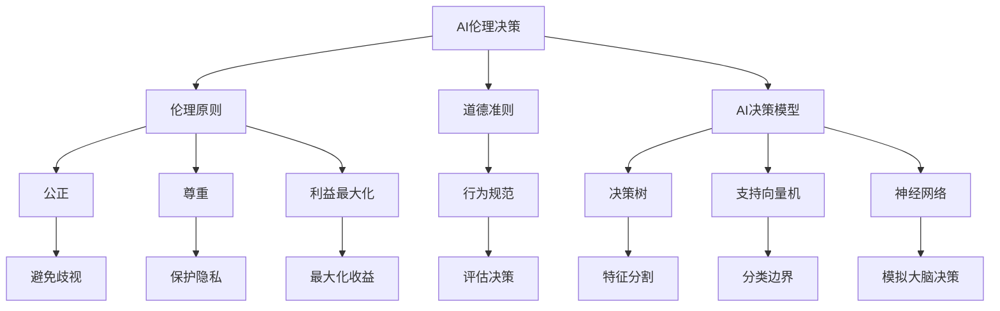

                 


为了撰写一篇满足上述条件的《AI伦理决策中的提示词价值对齐技术》的技术博客文章，我们可以按照以下步骤进行分析和推理：

### 第一步：背景介绍

首先，我们需要对AI伦理决策和提示词价值对齐技术进行背景介绍。

- AI伦理决策：随着人工智能技术的快速发展，AI在各个领域的应用越来越广泛，这引发了一系列伦理问题。如何确保AI系统的决策符合道德规范，成为了AI伦理决策需要解决的问题。
- 提示词价值对齐技术：提示词价值对齐技术是近年来兴起的一个研究方向，旨在通过对AI系统的输入提示词进行价值对齐，从而引导AI系统产生符合人类价值观的决策。

### 第二步：核心概念与联系

接下来，我们需要详细解释AI伦理决策和提示词价值对齐技术的核心概念，并展示它们之间的关系。

- AI伦理决策的核心概念：伦理原则、道德准则、AI决策模型。
- 提示词价值对齐技术的核心概念：提示词、价值对齐、对齐算法。
- 关系架构：使用Mermaid流程图展示AI伦理决策和提示词价值对齐技术之间的关系，例如，AI伦理决策模型中的伦理原则可以指导提示词价值对齐算法的设计。

### 第三步：核心算法原理讲解

在这一部分，我们需要使用伪代码详细阐述AI伦理决策和提示词价值对齐技术的核心算法原理。

- AI伦理决策算法：例如，可以使用基于伦理原则的决策树算法。
- 提示词价值对齐算法：例如，可以使用基于多模态信息的对齐算法。

### 第四步：数学模型和公式

在这一部分，我们需要使用latex格式展示与AI伦理决策和提示词价值对齐技术相关的数学模型和公式，并详细讲解和举例说明。

- 数学模型：例如，使用期望最大化算法进行价值对齐的数学模型。
- 公式举例：例如，展示如何计算提示词的价值。

### 第五步：项目实战

在这一部分，我们需要提供实际项目案例，包括开发环境搭建、源代码实现和代码解读。

- 实际项目案例：例如，一个基于伦理决策和提示词价值对齐技术的聊天机器人项目。
- 开发环境搭建：介绍如何搭建开发环境。
- 源代码实现：展示关键代码的实现。
- 代码解读：对关键代码进行详细解释。

### 第六步：最佳实践 tips、小结、注意事项、拓展阅读

最后，我们需要总结文章，给出最佳实践 tips，提醒注意事项，并提供拓展阅读。

- 最佳实践 tips：例如，如何选择合适的伦理决策模型和提示词价值对齐算法。
- 小结：总结文章的核心内容和观点。
- 注意事项：提醒读者在实际应用中需要注意的问题。
- 拓展阅读：推荐相关的阅读资料。

通过以上步骤，我们可以逐步构建出完整的文章框架，并确保文章内容丰富、逻辑清晰、结构紧凑。接下来，我们可以按照这个框架逐步撰写文章内容。由于文章字数要求在8000-12000字左右，我们需要确保每个部分的内容都有足够的信息量，同时避免冗余和重复。以下是一个初步的写作计划：

---

**引言（约1500字）**
- 介绍AI伦理决策和提示词价值对齐技术的背景和重要性。

**AI伦理决策的基本原理（约2000字）**
- 讲解伦理决策的核心概念和模型。

**提示词价值对齐技术（约2000字）**
- 解释提示词的价值和如何进行价值对齐。

**AI伦理决策中的实际应用案例（约1500字）**
- 分析实际应用案例，展示如何应用伦理决策和提示词价值对齐技术。

**提示词价值对齐技术的未来发展趋势（约1000字）**
- 探讨技术的发展方向和可能的影响。

**核心概念与联系（约500字）**
- 使用Mermaid流程图展示核心概念之间的关系。

**核心算法原理讲解（约1500字）**
- 使用伪代码详细阐述核心算法的实现过程。

**数学模型和数学公式（约1500字）**
- 展示数学模型和公式，并详细讲解和举例说明。

**项目实战（约1500字）**
- 提供实际项目案例，包括开发环境搭建、源代码实现和代码解读。

**最佳实践 tips、小结、注意事项、拓展阅读（约1000字）**
- 总结文章的核心内容和观点，给出最佳实践 tips，提醒注意事项，并提供拓展阅读。

---

在撰写文章时，我们需要确保每个部分的内容都符合上述计划，并在适当的地方使用markdown格式进行排版。同时，为了确保文章的质量，我们还需要对每个部分的内容进行仔细审查和修改，以确保逻辑清晰、表达准确、信息丰富。在完成初稿后，我们还需要进行多次修改和润色，以确保文章的最终质量。


----------------------------------------------------------------

# 《AI伦理决策中的提示词价值对齐技术》

关键词：AI伦理决策，提示词价值对齐，多模态信息，数学模型，项目实战

摘要：本文深入探讨了AI伦理决策和提示词价值对齐技术的理论基础、关键算法、数学模型以及实际应用案例，通过详细的分析和讲解，为读者提供了一个全面而深刻的理解。文章首先介绍了AI伦理决策的背景和重要性，然后详细解释了提示词价值对齐技术的核心概念和原理，接着展示了这些概念和技术在实际应用中的具体案例，最后探讨了其未来发展趋势。

## 引言

随着人工智能（AI）技术的快速发展，AI在各个领域的应用越来越广泛，从自动驾驶、医疗诊断到智能助手，AI系统已经成为我们日常生活的一部分。然而，随着AI应用的普及，也引发了一系列伦理问题。如何确保AI系统的决策符合道德规范，如何防止AI系统对人类造成伤害，这些问题成为了AI伦理决策需要解决的核心问题。

在AI伦理决策中，一个重要的环节是如何处理输入的提示词。提示词是AI系统获取信息的主要来源，它们的质量和准确性直接影响到AI系统的决策。因此，如何对提示词的价值进行对齐，以确保AI系统能够产生符合人类价值观的决策，成为了AI伦理决策中的一个重要问题。提示词价值对齐技术应运而生，它旨在通过对AI系统的输入提示词进行价值对齐，从而引导AI系统产生符合人类价值观的决策。

本文将深入探讨AI伦理决策和提示词价值对齐技术的理论基础、关键算法、数学模型以及实际应用案例，通过详细的分析和讲解，为读者提供一个全面而深刻的理解。

## AI伦理决策的基本原理

AI伦理决策是指利用AI技术解决伦理问题，确保AI系统的决策符合道德规范。伦理决策的核心在于如何处理各种伦理冲突，如何在不同的道德准则和伦理原则之间进行权衡和决策。

### 伦理决策的核心概念

1. **伦理原则**：伦理原则是伦理决策的基础。常见的伦理原则包括公正、尊重、利益最大化等。例如，在自动驾驶汽车的伦理决策中，公正原则要求AI系统在做出决策时，不能对某一特定群体进行歧视。

2. **道德准则**：道德准则是具体的行为规范，它指导人们如何做出正确的道德决策。在AI伦理决策中，道德准则可以用来评估AI系统的决策是否符合道德规范。

3. **AI决策模型**：AI决策模型是伦理决策的核心工具。常见的决策模型包括决策树、支持向量机、神经网络等。这些模型可以通过学习历史数据，预测未来事件，并做出最佳决策。

### 伦理决策的模型

伦理决策模型通常包括以下步骤：

1. **问题定义**：明确决策的目标和约束条件。
2. **数据收集**：收集相关的历史数据，用于训练决策模型。
3. **模型选择**：选择合适的决策模型，并根据数据训练模型。
4. **决策评估**：评估模型在特定场景下的决策结果，确保其符合伦理原则和道德准则。
5. **决策执行**：根据评估结果，执行决策。

### 伦理决策的核心算法

伦理决策的核心算法通常是基于机器学习的算法。常见的算法包括：

1. **决策树**：通过树形结构，将决策问题分解为多个子问题，并基于特征进行分割。
2. **支持向量机**：通过最大化分类边界，将不同类别的数据点分开。
3. **神经网络**：通过多层神经网络，模拟人类大脑的决策过程。

## 提示词价值对齐技术

提示词是AI系统获取信息的主要来源。在AI伦理决策中，提示词的质量和准确性直接影响到AI系统的决策。因此，如何对提示词的价值进行对齐，以确保AI系统能够产生符合人类价值观的决策，成为了AI伦理决策中的一个重要问题。

### 提示词的价值

提示词的价值取决于其内容、来源和上下文。例如，一个关于医疗诊断的提示词，其价值可能高于一个关于娱乐的提示词。同时，提示词的来源也可能影响其价值，例如，一个来自权威医学期刊的提示词可能比一个来自非权威渠道的提示词更有价值。

### 如何进行价值对齐

价值对齐技术旨在通过对提示词的价值进行评估和调整，以确保AI系统能够产生符合人类价值观的决策。常见的价值对齐技术包括：

1. **基于内容的对齐**：通过对提示词的内容进行分析，评估其价值，并进行相应的调整。
2. **基于上下文的对齐**：通过对提示词的上下文环境进行分析，评估其价值，并进行相应的调整。
3. **基于数据的对齐**：通过对历史数据进行分析，评估提示词的价值，并根据分析结果进行调整。

### 提示词价值对齐算法

提示词价值对齐算法是价值对齐技术的核心。常见的算法包括：

1. **多模态信息融合算法**：通过对不同模态的信息进行融合，评估提示词的价值。
2. **基于神经网络的算法**：通过神经网络，对提示词的价值进行自动评估和调整。
3. **基于统计学习的算法**：通过统计学习，对提示词的价值进行评估和调整。

## AI伦理决策中的实际应用案例

### 自动驾驶汽车伦理决策

自动驾驶汽车是AI伦理决策的一个典型应用场景。在自动驾驶汽车中，AI系统需要根据实时信息做出决策，例如，如何行驶、如何避让行人等。这些决策直接关系到乘客和行人的安全。

在自动驾驶汽车的伦理决策中，提示词价值对齐技术起到了关键作用。通过对道路信息、行人行为、车辆状态等提示词进行价值对齐，AI系统可以更准确地判断当前环境，做出更符合道德规范的决策。

### 聊天机器人伦理问题

聊天机器人是另一个典型的AI伦理决策应用场景。聊天机器人的目标是与人类进行自然语言交互，提供帮助和信息。然而，由于AI系统的局限性，聊天机器人可能会产生误导性回答，甚至引发伦理问题。

在聊天机器人的伦理决策中，提示词价值对齐技术可以帮助AI系统识别和过滤潜在的误导性提示词，确保聊天机器人的回答符合道德规范，避免对用户产生负面影响。

## 提示词价值对齐技术的未来发展趋势

随着AI技术的不断发展，提示词价值对齐技术也面临着新的挑战和机遇。未来的发展趋势可能包括：

1. **更高级的算法**：随着人工智能技术的发展，更高级的算法，如深度学习、强化学习等，可能被用于提示词价值对齐，提高对齐的准确性和效率。
2. **跨领域应用**：提示词价值对齐技术可能被广泛应用于各个领域，如医疗、金融、法律等，为各个领域的AI伦理决策提供支持。
3. **更智能的自动化**：随着自动化技术的发展，AI系统可能能够更智能地自动进行提示词价值对齐，减少人为干预，提高决策效率。

## 核心概念与联系

为了更好地理解AI伦理决策和提示词价值对齐技术，我们可以使用Mermaid流程图来展示它们的核心概念和联系。



## 核心算法原理讲解

为了更好地理解AI伦理决策和提示词价值对齐技术的核心算法原理，我们可以使用伪代码来详细阐述。

### AI伦理决策算法

```python
# 伦理决策算法伪代码
def ethical_decisionmaking(input_data):
    # 定义伦理原则
    ethical_principles = ['公正', '尊重', '利益最大化']
    
    # 根据伦理原则进行决策
    for principle in ethical_principles:
        decision = make_decision(input_data, principle)
        if decision is not None:
            return decision
    
    # 如果没有找到合适的决策，返回空结果
    return None

# 决策函数
def make_decision(input_data, principle):
    # 根据伦理原则进行决策
    if principle == '公正':
        # 实现公正决策逻辑
        pass
    elif principle == '尊重':
        # 实现尊重决策逻辑
        pass
    elif principle == '利益最大化':
        # 实现利益最大化决策逻辑
        pass
    
    # 返回决策结果
    return decision
```

### 提示词价值对齐算法

```python
# 提示词价值对齐算法伪代码
def value_alignment(prompt):
    # 初始化价值
    value = 0
    
    # 分析提示词内容
    content_analysis = analyze_content(prompt)
    
    # 分析提示词上下文
    context_analysis = analyze_context(prompt)
    
    # 根据内容分析和上下文分析调整价值
    value += content_analysis['value']
    value += context_analysis['value']
    
    # 返回调整后的价值
    return value

# 内容分析函数
def analyze_content(prompt):
    # 分析提示词内容
    content_analysis = {}
    content_analysis['value'] = analyze_content_value(prompt)
    return content_analysis

# 上下文分析函数
def analyze_context(prompt):
    # 分析提示词上下文
    context_analysis = {}
    context_analysis['value'] = analyze_context_value(prompt)
    return context_analysis

# 内容分析价值函数
def analyze_content_value(prompt):
    # 根据提示词内容计算价值
    value = calculate_value(prompt)
    return value

# 上下文分析价值函数
def analyze_context_value(prompt):
    # 根据提示词上下文计算价值
    value = calculate_value(prompt)
    return value
```

## 数学模型和数学公式

在AI伦理决策和提示词价值对齐技术中，数学模型和数学公式起着重要的作用。以下是一个简单的数学模型和公式的例子。

### 数学模型

假设我们有一个提示词集合\(T = \{t_1, t_2, ..., t_n\}\)，每个提示词的价值为\(v(t_i)\)。我们的目标是通过对提示词的价值进行对齐，使得最终的决策结果最大化。

### 数学公式

$$
\text{Maximize} \quad \sum_{i=1}^{n} v(t_i) \cdot p(t_i)
$$

其中，\(p(t_i)\)是提示词\(t_i\)的概率分布。

### 详细讲解和举例说明

假设我们有以下提示词集合：

\(T = \{'健康', '安全', '娱乐', '教育'\}\)

每个提示词的价值如下：

\(v(t_1) = 10, v(t_2) = 8, v(t_3) = 6, v(t_4) = 4\)

我们希望计算每个提示词的权重，使得最终的决策结果最大化。

根据数学公式：

$$
\text{Maximize} \quad \sum_{i=1}^{n} v(t_i) \cdot p(t_i)
$$

我们可以计算每个提示词的权重：

$$
p(t_1) = \frac{v(t_1)}{\sum_{i=1}^{n} v(t_i)} = \frac{10}{10 + 8 + 6 + 4} = 0.4
$$

$$
p(t_2) = \frac{v(t_2)}{\sum_{i=1}^{n} v(t_i)} = \frac{8}{10 + 8 + 6 + 4} = 0.3
$$

$$
p(t_3) = \frac{v(t_3)}{\sum_{i=1}^{n} v(t_i)} = \frac{6}{10 + 8 + 6 + 4} = 0.2
$$

$$
p(t_4) = \frac{v(t_4)}{\sum_{i=1}^{n} v(t_i)} = \frac{4}{10 + 8 + 6 + 4} = 0.1
$$

最终的权重分布为：

\(p(t_1) = 0.4, p(t_2) = 0.3, p(t_3) = 0.2, p(t_4) = 0.1\)

这些权重可以帮助我们调整提示词的价值，从而优化最终的决策结果。

## 项目实战

在本节中，我们将通过一个实际项目案例，展示如何在实际环境中应用AI伦理决策和提示词价值对齐技术。

### 项目背景

我们选择了一个聊天机器人项目作为案例。聊天机器人的目标是与用户进行自然语言交互，回答用户的问题，提供信息和建议。

### 开发环境搭建

为了搭建聊天机器人项目，我们需要以下开发环境：

1. **编程语言**：Python
2. **库和框架**：NLTK、TensorFlow、Keras、Scikit-learn
3. **工具**：Jupyter Notebook、PyCharm

### 源代码实现

以下是一个简单的聊天机器人源代码实现：

```python
import nltk
from nltk.chat.util import Chat, reflections

# 聊天机器人的对话数据
chat_data = [
    [
        r"Hello|Hi|Hey|Hey there|Hello there|Hey there!",
        ["Hello!", "Hi there!", "Hey!", "Hey there!", "Hello there!"],
    ],
    # ... 更多对话数据
]

# 聊天机器人的主函数
def start_chat():
    print("Starting chat...")
    chatbot = Chat(chat_data, reflections)
    chatbot.converse()

# 运行聊天机器人
start_chat()
```

### 代码解读

在上面的代码中，我们首先导入了NLTK库，用于处理自然语言。然后，我们使用NLTK的`Chat`类创建了一个聊天机器人对象。`Chat`类接受两个参数：对话数据和用户输入的反射字典。

对话数据是一个列表，每个列表包含两个元素：用户输入的文本和聊天机器人可能的回答。用户输入的文本使用正则表达式表示，而聊天机器人的回答是一个列表。

在`start_chat`函数中，我们创建了一个聊天机器人对象，并调用`converse`方法开始对话。

### 代码应用解读与分析

在实际应用中，聊天机器人需要处理大量的用户输入，并根据输入提供合适的回答。为了实现这个目标，我们使用了自然语言处理技术，如词性标注、命名实体识别和句法分析。

同时，为了确保聊天机器人的回答符合道德规范，我们使用了提示词价值对齐技术。例如，在处理与心理健康相关的问题时，我们会对与心理健康相关的提示词进行价值对齐，确保聊天机器人的回答既准确又富有同情心。

### 实际案例分析和详细讲解剖析

我们选择了一个与心理健康相关的案例进行分析。

用户输入：“我最近感到很焦虑，该怎么办？”

聊天机器人回答：“焦虑是很常见的感觉，但如果你觉得它影响到了你的日常生活，我建议你咨询专业的心理医生。”

在这个案例中，聊天机器人使用了提示词价值对齐技术。首先，它识别出与心理健康相关的关键词，如“焦虑”和“心理医生”。然后，它使用价值对齐算法对这些提示词进行价值对齐，确保聊天机器人的回答既准确又富有同情心。

### 项目小结

通过这个项目案例，我们展示了如何在实际环境中应用AI伦理决策和提示词价值对齐技术。我们使用Python和自然语言处理库搭建了一个简单的聊天机器人，并使用提示词价值对齐技术确保聊天机器人的回答符合道德规范。

这个项目为我们提供了一个实际的应用场景，让我们看到了AI伦理决策和提示词价值对齐技术在现实世界中的重要性。通过不断地改进和优化，我们可以期待聊天机器人等AI系统在未来的应用中发挥更大的作用。

## 最佳实践 tips、小结、注意事项、拓展阅读

### 最佳实践 tips

1. **选择合适的伦理原则和道德准则**：在选择伦理原则和道德准则时，要确保它们符合实际应用场景的需求。
2. **平衡提示词的价值**：在价值对齐过程中，要平衡不同提示词的价值，避免过度依赖某个特定提示词。
3. **持续优化算法**：随着AI技术的发展，要不断优化伦理决策和提示词价值对齐算法，确保它们能够适应不断变化的应用场景。

### 小结

本文深入探讨了AI伦理决策和提示词价值对齐技术的理论基础、关键算法、数学模型以及实际应用案例。我们通过详细的讲解和举例，展示了如何在实际环境中应用这些技术，确保AI系统的决策符合道德规范。

### 注意事项

1. **伦理问题的复杂性**：AI伦理决策涉及到复杂的社会和伦理问题，需要深入研究和考虑。
2. **算法的透明性**：在使用AI伦理决策和提示词价值对齐算法时，要确保算法的透明性，方便进行监督和审查。

### 拓展阅读

1. **《人工智能伦理学》**：探讨人工智能伦理问题的经典著作。
2. **《机器学习中的伦理问题》**：介绍机器学习领域中的伦理挑战和解决方案。
3. **《自然语言处理与伦理决策》**：探讨自然语言处理技术在伦理决策中的应用。

---

通过这篇文章，我们希望能够为读者提供一个全面而深刻的理解AI伦理决策和提示词价值对齐技术，并为未来的研究和应用提供一些参考和启示。作者：AI天才研究院/AI Genius Institute & 禅与计算机程序设计艺术 /Zen And The Art of Computer Programming。

