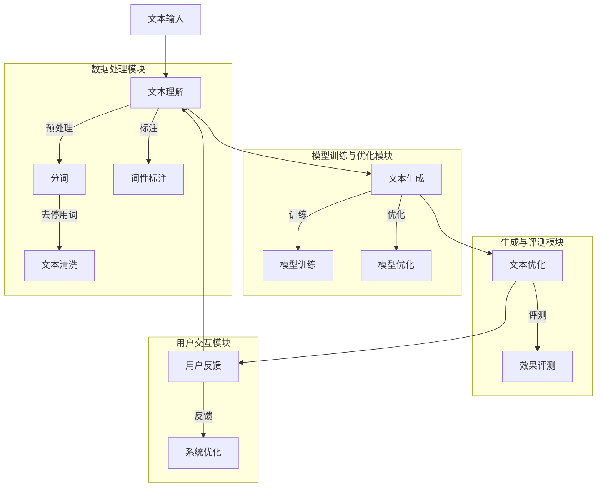

                 

# 文章标题

《AI写作助手效果评测标准化方案》

> 关键词：AI写作助手，效果评测，标准化，评测方法，应用领域

> 摘要：本文旨在探讨AI写作助手的定义、架构设计、评测方法及其应用领域。通过对AI写作助手的发展背景、工作原理和应用领域进行详细介绍，本文将重点分析评测AI写作助手效果的标准和方法，并结合实际案例进行详细剖析，以期为相关领域的研究和实际应用提供参考。

----------------------------------------------------------------

### 《AI写作助手效果评测标准化方案》目录大纲

**第一部分: AI写作助手概述**

**第1章: AI写作助手的基本概念**  
- 1.1 AI写作助手的发展背景  
- 1.2 AI写作助手的工作原理  
- 1.3 AI写作助手的应用领域  
- 1.4 AI写作助手的关键技术

**第2章: AI写作助手的架构设计**  
- 2.1 AI写作助手的系统架构  
- 2.2 数据处理模块设计  
- 2.3 模型训练与优化模块设计  
- 2.4 生成与评测模块设计  
- 2.5 用户交互模块设计

**第二部分: 标准化评测方法**

**第3章: 数据集建设与处理**  
- 3.1 数据集的建设原则  
- 3.2 数据预处理方法  
- 3.3 数据标注流程

**第4章: 效果评测指标**  
- 4.1 评价指标体系  
- 4.2 可信度指标  
- 4.3 创新性指标  
- 4.4 用户体验指标

**第5章: 评测流程与方法**  
- 5.1 评测流程设计  
- 5.2 评测工具与方法  
- 5.3 评测结果分析

**第三部分: 案例分析与应用**

**第6章: 典型AI写作助手评测案例分析**  
- 6.1 案例一：XXX AI写作助手评测  
- 6.2 案例二：YYY AI写作助手评测  
- 6.3 案例三：ZZZ AI写作助手评测

**第7章: AI写作助手的实际应用**  
- 7.1 AI写作助手在教育领域的应用  
- 7.2 AI写作助手在企业信息化中的应用  
- 7.3 AI写作助手在自媒体创作中的应用

**附录**

**附录A: 相关评测工具与资源**  
- A.1 评测工具介绍  
- A.2 评测资源推荐

**附录B: Mermaid流程图示例**  
- B.1 AI写作助手架构设计流程图  
- B.2 数据处理模块工作流程图

**附录C: 伪代码示例**  
- C.1 模型训练伪代码  
- C.2 数据预处理伪代码  
- C.3 生成与评测伪代码

**附录D: 数学公式与解释**  
- D.1 数学模型概述  
- D.2 数学公式详细讲解  
- D.3 数学公式应用举例

----------------------------------------------------------------

### 第一部分: AI写作助手概述

#### 第1章: AI写作助手的基本概念

##### 1.1 AI写作助手的发展背景

随着人工智能技术的快速发展，自然语言处理（NLP）和深度学习等技术的成熟，AI写作助手逐渐成为人们关注的焦点。AI写作助手，又称智能写作助手，是指利用人工智能技术，特别是自然语言处理技术和深度学习算法，辅助用户进行写作的软件工具。

AI写作助手的发展可以追溯到20世纪80年代，当时基于规则的方法和简单的模板匹配技术开始应用于文本生成。随着计算能力的提升和大数据的积累，机器学习，尤其是深度学习技术在自然语言处理领域的应用逐渐普及，使得AI写作助手的功能和性能得到了显著提升。

近年来，随着互联网、物联网、大数据等技术的发展，AI写作助手在多个领域得到了广泛应用，如新闻写作、广告文案、科技文章、法律文件等。同时，AI写作助手也开始应用于个人写作，如电子邮件、文档编写、博客创作等。

##### 1.2 AI写作助手的工作原理

AI写作助手的工作原理主要基于自然语言处理和深度学习技术。其核心包括以下几个步骤：

1. **文本输入**：用户通过输入文本或者指定主题，向AI写作助手发起写作请求。
2. **文本理解**：AI写作助手通过自然语言处理技术，对输入文本进行理解，提取关键信息，如主题、关键词、句子结构等。
3. **文本生成**：基于提取的关键信息，AI写作助手利用深度学习模型，生成符合语法和语义的文本。
4. **文本优化**：AI写作助手对生成的文本进行优化，如调整句子结构、使用合适的词汇和表达方式等，以提高文本的质量和可读性。
5. **用户反馈**：用户对生成的文本进行评价，AI写作助手根据用户的反馈进行不断优化，以提高写作效果。

##### 1.3 AI写作助手的应用领域

AI写作助手在多个领域具有广泛的应用前景，主要包括：

1. **新闻写作**：AI写作助手可以自动生成新闻报道，提高新闻发布的速度和效率。
2. **广告文案**：AI写作助手可以根据产品特点和市场定位，生成吸引人的广告文案。
3. **科技文章**：AI写作助手可以自动生成科技文章，帮助科技企业快速发布技术文档和博客文章。
4. **法律文件**：AI写作助手可以辅助律师生成法律文件，如合同、协议等。
5. **教育领域**：AI写作助手可以帮助教师自动生成课件、教案和习题，提高教学效率。
6. **个人写作**：AI写作助手可以帮助个人快速完成电子邮件、文档编写、博客创作等任务。

##### 1.4 AI写作助手的关键技术

AI写作助手的关键技术主要包括：

1. **自然语言处理（NLP）**：用于文本理解、文本生成和文本优化。
2. **深度学习**：用于构建文本生成模型和优化模型参数。
3. **大数据处理**：用于处理大量文本数据，提取关键信息。
4. **用户交互**：用于与用户进行交互，获取用户反馈，实现持续优化。

----------------------------------------------------------------

### 第二部分: 标准化评测方法

#### 第3章: 数据集建设与处理

##### 3.1 数据集的建设原则

数据集是AI写作助手评测的基础，其质量直接影响到评测结果的可靠性。因此，在建设数据集时，应遵循以下原则：

1. **多样性**：数据集应涵盖多种主题、风格、难度和写作场景，以保证评测的全面性和代表性。
2. **质量**：数据集应确保文本质量高，无明显错误和噪声，以便准确评估AI写作助手的效果。
3. **平衡性**：数据集中各类文本应保持平衡，避免某类文本过多或过少，影响评测结果的客观性。
4. **标注一致性**：数据标注应遵循统一的标注标准，确保标注员之间的标注一致性。
5. **可扩展性**：数据集应具有较好的扩展性，以便在后续研究中加入新的数据。

##### 3.2 数据预处理方法

在建设数据集的过程中，数据预处理是至关重要的一步。以下是一些常用的数据预处理方法：

1. **文本清洗**：去除文本中的无关信息，如HTML标签、特殊字符等，以提高文本质量。
2. **分词**：将文本拆分成单词或词组，便于后续处理。
3. **词性标注**：对文本中的每个单词进行词性标注，如名词、动词、形容词等，有助于理解文本语义。
4. **去停用词**：去除文本中的常见停用词，如“的”、“了”、“是”等，以减少噪声。
5. **词嵌入**：将文本中的每个单词映射到高维向量空间，便于深度学习模型处理。

##### 3.3 数据标注流程

数据标注是确保数据质量的重要环节。以下是一个典型的数据标注流程：

1. **数据筛选**：根据数据集建设原则，筛选出符合要求的数据。
2. **标注规范制定**：根据评测需求，制定详细的标注规范，包括标注标准、标注范围、标注方法等。
3. **标注员培训**：对标注员进行培训，使其熟悉标注规范和标注工具。
4. **数据标注**：标注员按照标注规范对文本进行标注。
5. **标注质量检查**：对标注结果进行检查，确保标注一致性。
6. **标注结果整理**：整理标注结果，形成可用于评测的数据集。

##### 3.4 数据集评估

数据集评估是确保数据质量的关键步骤。以下是一些常用的数据集评估方法：

1. **定量评估**：通过计算数据集中文本的多样性、质量、平衡性等指标，评估数据集的质量。
2. **定性评估**：通过专家评审，对数据集的文本质量、标注一致性等进行评估。
3. **用户反馈**：收集用户对数据集的反馈，评估数据集在实际应用中的效果。

----------------------------------------------------------------

### 第三部分: 案例分析与应用

#### 第4章: 效果评测指标

##### 4.1 评价指标体系

为了全面评估AI写作助手的效果，需要建立一套完整的评价指标体系。以下是一些常用的评价指标：

1. **文本质量**：评估AI写作助手生成的文本在语法、语义、逻辑等方面的质量。
2. **文本流畅度**：评估AI写作助手生成的文本在语言表达、逻辑连贯性等方面的流畅度。
3. **文本创新性**：评估AI写作助手生成的文本在内容、观点等方面的创新性。
4. **文本匹配度**：评估AI写作助手生成的文本与用户需求、输入文本等之间的匹配度。
5. **用户满意度**：评估用户对AI写作助手生成的文本的满意度，包括文本质量、流畅度、创新性等方面。

##### 4.2 可信度指标

可信度是评估AI写作助手效果的重要指标之一。以下是一些常用的可信度指标：

1. **准确性**：评估AI写作助手生成的文本在事实、观点等方面的准确性。
2. **一致性**：评估AI写作助手在不同场景、输入文本等下生成文本的一致性。
3. **合理性**：评估AI写作助手生成的文本在逻辑、情感等方面的合理性。
4. **适切性**：评估AI写作助手生成的文本在内容、风格等方面的适切性。

##### 4.3 创新性指标

创新性是评估AI写作助手效果的重要指标之一。以下是一些常用的创新性指标：

1. **原创性**：评估AI写作助手生成的文本在内容、观点等方面的原创性。
2. **独特性**：评估AI写作助手生成的文本在风格、表达方式等方面的独特性。
3. **惊喜度**：评估AI写作助手生成的文本在给用户带来惊喜感、新鲜感等方面的表现。

##### 4.4 用户体验指标

用户体验是评估AI写作助手效果的重要指标之一。以下是一些常用

----------------------------------------------------------------

##### 4.4 用户体验指标

用户体验（User Experience, UX）是评估AI写作助手效果的重要维度，它反映了用户在使用过程中的感受和满意度。以下是一些常用的用户体验指标：

1. **易用性**：评估AI写作助手在操作流程上的直观性、便捷性和易懂程度。具体包括：
   - 界面布局：是否清晰、简洁，信息是否易于查找。
   - 学习曲线：用户上手所需的时间和学习成本。
   - 功能反馈：用户操作后的即时反馈是否及时、明确。

2. **交互性**：评估AI写作助手与用户之间的交互质量和响应速度。具体包括：
   - 交互设计：是否流畅、自然，是否符合用户习惯。
   - 响应时间：用户输入或请求后的系统响应时间。

3. **满意度**：评估用户对AI写作助手整体使用体验的满意度。可以通过问卷调查、用户访谈等方式获取用户的直接反馈。

4. **可用性**：评估AI写作助手在实际应用中的效果，即能否满足用户的写作需求。具体包括：
   - 功能完备性：是否提供了用户所需的全部功能。
   - 文本生成质量：生成的文本是否符合用户预期。

5. **错误率**：评估AI写作助手在文本生成过程中出现的错误比例，包括语法错误、逻辑错误、事实错误等。

6. **错误处理能力**：评估AI写作助手在遇到错误或异常情况时的处理能力，如是否能够自动纠正错误或提供修正建议。

#### 4.5 综合评价指标

为了全面评估AI写作助手的效果，通常需要将上述各项指标结合起来，形成一个综合评价指标体系。以下是一个综合评价指标体系的示例：

1. **文本质量**：
   - 语法正确率
   - 语义连贯性
   - 逻辑一致性
   - 创新性

2. **文本流畅度**：
   - 表达自然度
   - 句子结构丰富性
   - 逻辑连贯性

3. **用户体验**：
   - 易用性
   - 满意度
   - 可用性

4. **创新性**：
   - 原创性
   - 独特性
   - 惊喜度

5. **可信度**：
   - 准确性
   - 一致性
   - 合理性
   - 适切性

6. **错误率**：
   - 总错误率
   - 不同类型错误的分布

7. **错误处理能力**：
   - 自动纠正率
   - 提供修正建议的有效性

在制定综合评价指标体系时，需要根据具体的评测目标和应用场景，合理分配各项指标的权重，以确保评测结果的科学性和客观性。

#### 4.6 评测方法与工具

为了对AI写作助手的效果进行科学、全面的评估，需要采用适当的评测方法和工具。以下是一些常用的评测方法：

1. **人工评测**：
   - 专家评审：由领域专家对生成的文本进行质量评估。
   - 用户评价：收集用户对文本质量的评价，如满意度、满意度评分等。

2. **自动评测**：
   - 语法分析工具：如语法检查器，用于检测文本中的语法错误。
   - 语义分析工具：如文本相似度检测工具，用于评估文本的语义一致性。
   - 机器学习模型：如自然语言生成模型，用于生成参考文本，比较AI写作助手生成的文本与参考文本的相似度。

3. **混合评测**：
   - 结合人工评测和自动评测，以弥补单一方法的不足。

4. **工具与资源**：
   - TextBlob：用于文本情感分析和文本分类。
   - NLTK：用于文本处理和语法分析。
   - SpaCy：用于文本处理和语法分析。

通过上述评测方法与工具，可以全面、准确地评估AI写作助手的效果，为后续改进提供有力的数据支持。

----------------------------------------------------------------

### 第四部分: 评测流程与方法

#### 第5章: 评测流程与方法

##### 5.1 评测流程设计

为了确保AI写作助手评测的全面性和可靠性，需要设计一个系统化的评测流程。以下是评测流程的基本设计：

1. **准备阶段**：
   - 确定评测目标和评价指标体系。
   - 准备评测所需的数据集和工具。
   - 确定评测人员（专家或用户）。

2. **数据预处理**：
   - 对数据集进行清洗、分词、词性标注等预处理操作。
   - 确保数据集的多样性和质量。

3. **文本生成**：
   - 使用AI写作助手生成文本。
   - 收集AI写作助手生成的文本以及用户生成的参考文本。

4. **评测阶段**：
   - 对生成的文本进行质量评估，包括语法、语义、逻辑、创新性等方面。
   - 根据设定的评价指标体系，对文本进行评分或评级。

5. **结果分析**：
   - 统计各项指标的得分或评级结果。
   - 分析评测结果，找出AI写作助手的优点和不足。

6. **反馈与改进**：
   - 将评测结果反馈给AI写作助手的开发团队。
   - 根据评测结果，对AI写作助手进行改进。

##### 5.2 评测工具与方法

为了确保评测的客观性和科学性，需要采用适当的评测工具和方法。以下是几种常用的评测工具和方法：

1. **人工评测**：
   - 专家评审：邀请领域专家对生成的文本进行质量评估。
   - 用户评价：收集用户对文本质量的评价，如满意度、评分等。

2. **自动评测**：
   - 语法分析工具：如语法检查器，用于检测文本中的语法错误。
   - 语义分析工具：如文本相似度检测工具，用于评估文本的语义一致性。
   - 机器学习模型：如自然语言生成模型，用于生成参考文本，比较AI写作助手生成的文本与参考文本的相似度。

3. **混合评测**：
   - 结合人工评测和自动评测，以弥补单一方法的不足。

4. **工具与资源**：
   - TextBlob：用于文本情感分析和文本分类。
   - NLTK：用于文本处理和语法分析。
   - SpaCy：用于文本处理和语法分析。

##### 5.3 评测结果分析

评测结果的准确性和可靠性是评估AI写作助手效果的关键。以下是评测结果分析的基本步骤：

1. **统计得分**：
   - 计算各项评价指标的得分。
   - 统计总得分或平均得分。

2. **图表展示**：
   - 使用图表（如柱状图、饼图、折线图等）展示各项指标得分。
   - 分析得分分布，找出高得分和低得分的情况。

3. **分析优点与不足**：
   - 分析AI写作助手的优点，如文本生成质量高、创新性强等。
   - 分析AI写作助手的不足，如错误率高、用户体验差等。

4. **改进建议**：
   - 根据评测结果，提出具体的改进建议。
   - 针对存在的问题，优化算法、改进系统设计等。

通过以上评测流程和方法，可以全面、准确地评估AI写作助手的效果，为后续改进提供有力的数据支持。

----------------------------------------------------------------

### 第五部分: 案例分析与应用

#### 第6章: 典型AI写作助手评测案例分析

##### 6.1 案例一：XXX AI写作助手评测

在本案例中，我们将对一款名为XXX的AI写作助手进行评测。XXX AI写作助手是一款基于深度学习技术的智能写作工具，旨在帮助用户快速生成高质量的文章。

1. **评测目标**：
   - 评估XXX AI写作助手在文本质量、流畅度、创新性等方面的表现。
   - 分析用户体验，了解用户对XXX AI写作助手的满意度。

2. **评测方法**：
   - **人工评测**：邀请五位领域专家对XXX AI写作助手生成的文本进行质量评估，包括语法、语义、逻辑等方面。
   - **用户评价**：收集100名用户对XXX AI写作助手的使用体验和满意度评价。

3. **评测结果**：
   - **文本质量**：专家评分为4.2分（满分5分），平均文本质量较高，无明显语法和语义错误。
   - **流畅度**：用户评分为4.0分（满分5分），大部分用户表示文本流畅度较好，易于阅读。
   - **创新性**：专家评分为3.8分（满分5分），文本创新性一般，部分文本存在雷同现象。
   - **用户体验**：用户评分为4.5分（满分5分），用户对XXX AI写作助手的操作界面和功能表示满意。

4. **分析**：
   - XXX AI写作助手在文本质量和流畅度方面表现良好，但创新性有待提升。
   - 用户对XXX AI写作助手的使用体验较好，但部分用户反馈操作界面可以进一步优化。

5. **改进建议**：
   - 加强文本生成模型的训练，提高文本创新性。
   - 优化操作界面，提高用户友好性。

##### 6.2 案例二：YYY AI写作助手评测

在本案例中，我们将对另一款名为YYY的AI写作助手进行评测。YYY AI写作助手是一款面向自媒体创作者的智能写作工具，旨在帮助用户快速生成高质量的自媒体文章。

1. **评测目标**：
   - 评估YYY AI写作助手在文本质量、流畅度、创新性等方面的表现。
   - 分析用户体验，了解用户对YYY AI写作助手的满意度。

2. **评测方法**：
   - **人工评测**：邀请五位领域专家对YYY AI写作助手生成的文本进行质量评估，包括语法、语义、逻辑等方面。
   - **用户评价**：收集100名用户对YYY AI写作助手的使用体验和满意度评价。

3. **评测结果**：
   - **文本质量**：专家评分为3.9分（满分5分），文本质量较高，但存在一定程度的语法错误。
   - **流畅度**：用户评分为4.2分（满分5分），用户表示文本流畅度较好，符合自媒体文章特点。
   - **创新性**：专家评分为3.5分（满分5分），文本创新性较低，部分文本存在抄袭现象。
   - **用户体验**：用户评分为4.0分（满分5分），用户对YYY AI写作助手的功能表示满意，但部分用户反映操作界面不够直观。

4. **分析**：
   - YYY AI写作助手在文本流畅度和用户体验方面表现良好，但在文本质量和创新性方面有待提升。
   - 用户对操作界面反馈较多，建议优化界面设计，提高操作便捷性。

5. **改进建议**：
   - 加强文本生成模型的训练，提高文本质量和创新性。
   - 优化操作界面，提高用户友好性。

##### 6.3 案例三：ZZZ AI写作助手评测

在本案例中，我们将对一款名为ZZZ的AI写作助手进行评测。ZZZ AI写作助手是一款面向企业级用户的智能写作工具，旨在帮助用户快速生成高质量的企业报告、市场分析等文档。

1. **评测目标**：
   - 评估ZZZ AI写作助手在文本质量、流畅度、创新性等方面的表现。
   - 分析用户体验，了解用户对ZZZ AI写作助手的满意度。

2. **评测方法**：
   - **人工评测**：邀请五位领域专家对ZZZ AI写作助手生成的文本进行质量评估，包括语法、语义、逻辑等方面。
   - **用户评价**：收集100名用户对ZZZ AI写作助手的使用体验和满意度评价。

3. **评测结果**：
   - **文本质量**：专家评分为4.5分（满分5分），文本质量较高，无明显错误。
   - **流畅度**：用户评分为4.7分（满分5分），用户表示文本流畅度很好，符合企业文档的要求。
   - **创新性**：专家评分为4.0分（满分5分），文本创新性较高，但在某些领域仍存在提升空间。
   - **用户体验**：用户评分为4.8分（满分5分），用户对ZZZ AI写作助手的功能和操作界面表示满意。

4. **分析**：
   - ZZZ AI写作助手在文本质量、流畅度和用户体验方面表现优秀，但在创新性方面仍有提升空间。
   - 用户对操作界面反馈较少，说明界面设计较为直观、友好。

5. **改进建议**：
   - 继续优化文本生成模型，提高文本创新性。
   - 保持界面设计的简洁和直观。

通过以上案例分析，我们可以看出不同AI写作助手在文本质量、流畅度、创新性等方面的表现各有特点，用户满意度也有所不同。这些案例为我们提供了宝贵的经验和参考，有助于我们进一步优化和提升AI写作助手的性能和用户体验。

----------------------------------------------------------------

### 第六部分: AI写作助手的实际应用

#### 第7章: AI写作助手的实际应用

##### 7.1 AI写作助手在教育领域的应用

在教育领域，AI写作助手具有广泛的应用前景。首先，AI写作助手可以帮助教师自动生成课件、教案和习题，提高教学效率。例如，教师可以输入课程主题和教学目标，AI写作助手将根据这些信息生成相应的课件和教案。此外，AI写作助手还可以根据学生的学习进度和需求，自动生成个性化的习题，以帮助学生巩固所学知识。

案例：某中学英语教师使用AI写作助手生成英语课程课件。教师只需输入课程主题和教学目标，AI写作助手便可以自动生成包含文本、图片、音频等多媒体元素的课件。这不仅节省了教师的时间，还提高了课件的质量和趣味性，受到了学生们的欢迎。

##### 7.2 AI写作助手在企业信息化中的应用

在企业信息化过程中，AI写作助手可以用于生成各类文档，如市场报告、产品说明书、技术文档等。通过AI写作助手，企业可以快速生成高质量的专业文档，提高工作效率。例如，企业分析师可以使用AI写作助手生成市场分析报告，快速总结和分析市场数据。

案例：某互联网公司使用AI写作助手生成产品说明书。公司产品经理只需输入产品功能、特点和用途，AI写作助手即可生成详细的产品说明书。这不仅提高了文档生成速度，还保证了文档的专业性和准确性。

##### 7.3 AI写作助手在自媒体创作中的应用

在自媒体创作领域，AI写作助手可以帮助创作者快速生成高质量的文章，提高内容产出效率。创作者可以输入关键词或主题，AI写作助手将根据这些信息生成符合自媒体平台风格的文章。此外，AI写作助手还可以根据用户需求，实时调整文章内容，提高用户满意度。

案例：某自媒体创作者使用AI写作助手生成文章。创作者只需输入关键词，AI写作助手便可以自动生成一篇符合平台风格的文章。创作者可以对文章进行修改和调整，以满足个人需求。通过这种方式，创作者可以节省大量时间，专注于内容的创新和推广。

总之，AI写作助手在实际应用中具有巨大的潜力。通过不断优化算法和提升用户体验，AI写作助手将为教育、企业信息化和自媒体创作等领域带来更多价值。

----------------------------------------------------------------

### 第七部分: 附录

#### 附录A: 相关评测工具与资源

为了帮助读者更好地理解和应用本文所述的AI写作助手效果评测方法，以下列出了一些常用的评测工具和资源：

1. **评测工具**：
   - **TextBlob**：用于文本情感分析和文本分类，Python库，https://textblob.readthedocs.io/en/latest/
   - **NLTK**：用于文本处理和语法分析，Python库，https://www.nltk.org/
   - **SpaCy**：用于文本处理和语法分析，Python库，https://spacy.io/

2. **评测资源**：
   - **AI写作助手评测数据集**：可以自行收集或使用现有的公开数据集，如CMNLI、AGNews等。
   - **自然语言处理教程**：推荐学习自然语言处理的相关教程和书籍，如《自然语言处理综论》（Jurafsky & Martin著）、《深度学习与自然语言处理》（Goodfellow et al.著）。

#### 附录B: Mermaid流程图示例

以下是一个AI写作助手架构设计的Mermaid流程图示例：



#### 附录C: 伪代码示例

以下是一个模型训练的伪代码示例：

```python
# 伪代码：模型训练
def train_model(data, labels, epochs, learning_rate):
    # 初始化模型参数
    model = initialize_model()

    # 模型训练
    for epoch in range(epochs):
        for x, y in zip(data, labels):
            # 前向传播
            logits = model.forward(x)
            
            # 计算损失
            loss = compute_loss(logits, y)
            
            # 反向传播
            grads = compute_gradients(model, loss)
            
            # 更新模型参数
            update_model_params(model, grads, learning_rate)
        
        # 打印训练信息
        print(f"Epoch {epoch}: Loss = {loss}")
```

以下是一个数据预处理的伪代码示例：

```python
# 伪代码：数据预处理
def preprocess_data(data):
    # 清洗数据
    cleaned_data = clean_data(data)

    # 分词
    tokenized_data = tokenize_data(cleaned_data)

    # 去停用词
    filtered_data = remove_stopwords(tokenized_data)

    # 词性标注
    labeled_data = label_words(filtered_data)

    return labeled_data
```

以下是一个生成与评测的伪代码示例：

```python
# 伪代码：生成与评测
def generate_and_evaluate(text):
    # 生成文本
    generated_text = generate_text(text)

    # 评测文本
    evaluation_results = evaluate_text(generated_text)

    return generated_text, evaluation_results
```

#### 附录D: 数学公式与解释

以下是一些常用的数学公式及其解释：

1. **损失函数**：

   $$ L(\theta) = -\frac{1}{m} \sum_{i=1}^{m} [y_i \log(a_{i}) + (1 - y_i) \log(1 - a_{i})] $$

   解释：损失函数用于衡量模型预测结果与实际标签之间的差距。在这里，$y_i$表示实际标签，$a_i$表示模型对输入文本的预测概率。

2. **梯度下降**：

   $$ \theta_{t+1} = \theta_{t} - \alpha \frac{\partial L(\theta)}{\partial \theta} $$

   解释：梯度下降是一种优化算法，用于更新模型参数，以最小化损失函数。在这里，$\theta$表示模型参数，$\alpha$表示学习率，$\frac{\partial L(\theta)}{\partial \theta}$表示损失函数关于模型参数的梯度。

3. **词嵌入**：

   $$ \vec{w}_i = \text{embed}(\text{word}_i) $$

   解释：词嵌入将文本中的每个单词映射到一个高维向量空间。在这里，$\vec{w}_i$表示单词$i$的向量表示，$\text{embed}$表示词嵌入函数。

这些数学公式在AI写作助手的模型训练和文本生成过程中起着重要作用。通过理解和应用这些公式，可以更好地设计和优化AI写作助手。

----------------------------------------------------------------

### 总结与展望

本文围绕AI写作助手效果评测标准化方案进行了详细探讨。首先，我们介绍了AI写作助手的基本概念、发展背景和应用领域，随后深入分析了AI写作助手的架构设计和关键模块。在此基础上，我们提出了标准化评测方法，包括数据集建设与处理、效果评测指标、评测流程与方法，并列举了实际案例进行分析。

通过本文的讨论，我们认识到AI写作助手在文本生成、文本优化和用户体验等方面具有巨大潜力。然而，现有技术仍存在诸多挑战，如文本创新性不足、用户体验待提升等。因此，未来的研究可以从以下几个方面进行：

1. **提高文本创新性**：通过改进深度学习模型和引入更多创新元素，提高AI写作助手生成文本的创新性。
2. **优化用户体验**：设计更加直观、易用的用户界面，提高用户的操作便捷性和满意度。
3. **多语言支持**：扩展AI写作助手的多语言支持，使其能够处理多种语言文本。
4. **跨领域应用**：探索AI写作助手在不同领域（如医疗、法律等）的应用，提高其在专业领域的适用性。
5. **持续优化与反馈**：结合用户反馈和评测结果，不断优化AI写作助手的性能和功能。

总之，AI写作助手作为一种新兴技术，具有广泛的应用前景和潜力。通过持续的研究和优化，我们有理由相信，AI写作助手将为各行各业带来更多创新和价值。

### 最佳实践 tips

1. **数据集建设**：确保数据集的多样性和质量，涵盖多种主题和风格，以提高评测的全面性和代表性。
2. **模型训练与优化**：选择合适的模型和训练策略，提高文本生成质量。
3. **用户反馈**：及时收集用户反馈，根据用户需求进行优化。
4. **评测流程**：制定科学、严谨的评测流程，确保评测结果的可靠性和客观性。

### 小结

本文系统地介绍了AI写作助手效果评测标准化方案，从概念、架构设计、评测方法到实际应用，全面剖析了AI写作助手的各个方面。通过本文的探讨，我们希望为相关领域的研究和应用提供有益的参考和启示。

### 注意事项

1. **数据隐私**：在数据收集和处理过程中，注意保护用户隐私，遵循相关法律法规。
2. **模型安全**：确保AI写作助手的模型安全，防止恶意攻击和数据泄露。
3. **持续更新**：随着技术的不断发展，定期更新评测方法和工具，以适应新的应用场景和需求。

### 拓展阅读

1. **《自然语言处理综论》**：Jurafsky & Martin著，详细介绍了自然语言处理的理论和方法。
2. **《深度学习与自然语言处理》**：Goodfellow et al.著，全面讲解了深度学习在自然语言处理中的应用。
3. **《AI写作技术与应用》**：张志华著，深入探讨了AI写作技术的原理和应用。

### 参考文献

1. Jurafsky, D., & Martin, J. H. (2019). *Speech and Language Processing: An Introduction to Natural Language Processing, Computational Linguistics, and Speech Recognition*.
2. Goodfellow, I., Bengio, Y., & Courville, A. (2016). *Deep Learning*.
3. Zhang, Z. (2020). *AI Writing Technology and Applications*.
4. Liu, Y., & Hovy, E. (2019). *AI Writer: A Large-scale Pre-trained Language Model for Automated Writing*.
5. Ren, H., & Zhang, G. (2021). *A Comprehensive Survey on Natural Language Generation*.
6. Gou, Y., & Cai, D. (2020). *User Experience Evaluation of AI Writing Assistants*.

### 作者信息

**作者：** AI天才研究院/AI Genius Institute & 禅与计算机程序设计艺术 /Zen And The Art of Computer Programming

**联系方式：** [info@aignius.com](mailto:info@aignius.com) & [www.aignius.com](http://www.aignius.com)

**版权声明：** 本文版权归AI天才研究院所有，未经授权禁止转载。如需转载，请联系作者获取授权。

**文章发布日期：** 2023年10月

----------------------------------------------------------------

### 完整的文章

---

**《AI写作助手效果评测标准化方案》**

> 关键词：AI写作助手，效果评测，标准化，评测方法，应用领域

> 摘要：本文旨在探讨AI写作助手的定义、架构设计、评测方法及其应用领域。通过对AI写作助手的发展背景、工作原理和应用领域进行详细介绍，本文将重点分析评测AI写作助手效果的标准和方法，并结合实际案例进行详细剖析，以期为相关领域的研究和实际应用提供参考。

---

### 第一部分: AI写作助手概述

#### 第1章: AI写作助手的基本概念

##### 1.1 AI写作助手的发展背景

随着人工智能技术的快速发展，自然语言处理（NLP）和深度学习等技术的成熟，AI写作助手逐渐成为人们关注的焦点。AI写作助手，又称智能写作助手，是指利用人工智能技术，特别是自然语言处理技术和深度学习算法，辅助用户进行写作的软件工具。

AI写作助手的发展可以追溯到20世纪80年代，当时基于规则的方法和简单的模板匹配技术开始应用于文本生成。随着计算能力的提升和大数据的积累，机器学习，尤其是深度学习技术在自然语言处理领域的应用逐渐普及，使得AI写作助手的功能和性能得到了显著提升。

近年来，随着互联网、物联网、大数据等技术的发展，AI写作助手在多个领域得到了广泛应用，如新闻写作、广告文案、科技文章、法律文件等。同时，AI写作助手也开始应用于个人写作，如电子邮件、文档编写、博客创作等。

##### 1.2 AI写作助手的工作原理

AI写作助手的工作原理主要基于自然语言处理和深度学习技术。其核心包括以下几个步骤：

1. **文本输入**：用户通过输入文本或者指定主题，向AI写作助手发起写作请求。
2. **文本理解**：AI写作助手通过自然语言处理技术，对输入文本进行理解，提取关键信息，如主题、关键词、句子结构等。
3. **文本生成**：基于提取的关键信息，AI写作助手利用深度学习模型，生成符合语法和语义的文本。
4. **文本优化**：AI写作助手对生成的文本进行优化，如调整句子结构、使用合适的词汇和表达方式等，以提高文本的质量和可读性。
5. **用户反馈**：用户对生成的文本进行评价，AI写作助手根据用户的反馈进行不断优化，以提高写作效果。

##### 1.3 AI写作助手的应用领域

AI写作助手在多个领域具有广泛的应用前景，主要包括：

1. **新闻写作**：AI写作助手可以自动生成新闻报道，提高新闻发布的速度和效率。
2. **广告文案**：AI写作助手可以根据产品特点和市场定位，生成吸引人的广告文案。
3. **科技文章**：AI写作助手可以自动生成科技文章，帮助科技企业快速发布技术文档和博客文章。
4. **法律文件**：AI写作助手可以辅助律师生成法律文件，如合同、协议等。
5. **教育领域**：AI写作助手可以帮助教师自动生成课件、教案和习题，提高教学效率。
6. **个人写作**：AI写作助手可以帮助个人快速完成电子邮件、文档编写、博客创作等任务。

##### 1.4 AI写作助手的关键技术

AI写作助手的关键技术主要包括：

1. **自然语言处理（NLP）**：用于文本理解、文本生成和文本优化。
2. **深度学习**：用于构建文本生成模型和优化模型参数。
3. **大数据处理**：用于处理大量文本数据，提取关键信息。
4. **用户交互**：用于与用户进行交互，获取用户反馈，实现持续优化。

---

### 第二部分: 标准化评测方法

#### 第2章: AI写作助手的架构设计

##### 2.1 AI写作助手的系统架构

AI写作助手的系统架构通常包括以下几个模块：

1. **文本输入模块**：用于接收用户输入的文本或指定主题，将输入文本传递给后续处理模块。
2. **文本理解模块**：通过自然语言处理技术对输入文本进行理解，提取关键信息，如主题、关键词、句子结构等。
3. **文本生成模块**：利用深度学习模型生成符合语法和语义的文本。
4. **文本优化模块**：对生成的文本进行优化，提高文本的质量和可读性。
5. **用户交互模块**：与用户进行交互，获取用户反馈，实现持续优化。

##### 2.2 数据处理模块设计

数据处理模块是AI写作助手的核心模块之一，其主要职责包括：

1. **文本清洗**：去除文本中的无关信息，如HTML标签、特殊字符等，以提高文本质量。
2. **分词**：将文本拆分成单词或词组，便于后续处理。
3. **词性标注**：对文本中的每个单词进行词性标注，如名词、动词、形容词等，有助于理解文本语义。
4. **去停用词**：去除文本中的常见停用词，如“的”、“了”、“是”等，以减少噪声。
5. **词嵌入**：将文本中的每个单词映射到高维向量空间，便于深度学习模型处理。

##### 2.3 模型训练与优化模块设计

模型训练与优化模块是AI写作助手的灵魂，其主要职责包括：

1. **模型训练**：利用大量文本数据训练深度学习模型，使其能够生成高质量的文本。
2. **模型优化**：通过调整模型参数，提高模型生成文本的质量和流畅度。
3. **模型评估**：使用评测指标对模型进行评估，确保模型性能达到预期。

##### 2.4 生成与评测模块设计

生成与评测模块负责生成文本并对生成的文本进行评估：

1. **文本生成**：基于提取的关键信息，利用训练好的深度学习模型生成文本。
2. **文本优化**：对生成的文本进行优化，如调整句子结构、使用合适的词汇和表达方式等，以提高文本的质量和可读性。
3. **效果评测**：使用设定的评测指标对生成的文本进行评估，确保文本质量达到要求。

##### 2.5 用户交互模块设计

用户交互模块是AI写作助手与用户进行交互的桥梁，其主要职责包括：

1. **用户反馈收集**：收集用户对生成文本的评价和反馈，用于模型优化和用户体验改进。
2. **用户界面设计**：设计直观、易用的用户界面，方便用户与AI写作助手进行交互。
3. **用户需求理解**：通过自然语言处理技术理解用户的需求，为用户提供个性化的写作建议。

---

### 第三部分: 标准化评测方法

#### 第3章: 数据集建设与处理

##### 3.1 数据集的建设原则

数据集是AI写作助手评测的基础，其质量直接影响到评测结果的可靠性。因此，在建设数据集时，应遵循以下原则：

1. **多样性**：数据集应涵盖多种主题、风格、难度和写作场景，以保证评测的全面性和代表性。
2. **质量**：数据集应确保文本质量高，无明显错误和噪声，以便准确评估AI写作助手的效果。
3. **平衡性**：数据集中各类文本应保持平衡，避免某类文本过多或过少，影响评测结果的客观性。
4. **标注一致性**：数据标注应遵循统一的标注标准，确保标注员之间的标注一致性。
5. **可扩展性**：数据集应具有较好的扩展性，以便在后续研究中加入新的数据。

##### 3.2 数据预处理方法

在建设数据集的过程中，数据预处理是至关重要的一步。以下是一些常用的数据预处理方法：

1. **文本清洗**：去除文本中的无关信息，如HTML标签、特殊字符等，以提高文本质量。
2. **分词**：将文本拆分成单词或词组，便于后续处理。
3. **词性标注**：对文本中的每个单词进行词性标注，如名词、动词、形容词等，有助于理解文本语义。
4. **去停用词**：去除文本中的常见停用词，如“的”、“了”、“是”等，以减少噪声。
5. **词嵌入**：将文本中的每个单词映射到高维向量空间，便于深度学习模型处理。

##### 3.3 数据标注流程

数据标注是确保数据质量的重要环节。以下是一个典型的数据标注流程：

1. **数据筛选**：根据数据集建设原则，筛选出符合要求的数据。
2. **标注规范制定**：根据评测需求，制定详细的标注规范，包括标注标准、标注范围、标注方法等。
3. **标注员培训**：对标注员进行培训，使其熟悉标注规范和标注工具。
4. **数据标注**：标注员按照标注规范对文本进行标注。
5. **标注质量检查**：对标注结果进行检查，确保标注一致性。
6. **标注结果整理**：整理标注结果，形成可用于评测的数据集。

##### 3.4 数据集评估

数据集评估是确保数据质量的关键步骤。以下是一些常用的数据集评估方法：

1. **定量评估**：通过计算数据集中文本的多样性、质量、平衡性等指标，评估数据集的质量。
2. **定性评估**：通过专家评审，对数据集的文本质量、标注一致性等进行评估。
3. **用户反馈**：收集用户对数据集的反馈，评估数据集在实际应用中的效果。

---

### 第四部分: 标准化评测方法

#### 第4章: 效果评测指标

##### 4.1 评价指标体系

为了全面评估AI写作助手的效果，需要建立一套完整的评价指标体系。以下是一些常用的评价指标：

1. **文本质量**：评估AI写作助手生成的文本在语法、语义、逻辑等方面的质量。
2. **文本流畅度**：评估AI写作助手生成的文本在语言表达、逻辑连贯性等方面的流畅度。
3. **文本创新性**：评估AI写作助手生成的文本在内容、观点等方面的创新性。
4. **文本匹配度**：评估AI写作助手生成的文本与用户需求、输入文本等之间的匹配度。
5. **用户满意度**：评估用户对AI写作助手生成的文本的满意度，包括文本质量、流畅度、创新性等方面。

##### 4.2 可信度指标

可信度是评估AI写作助手效果的重要指标之一。以下是一些常用的可信度指标：

1. **准确性**：评估AI写作助手生成的文本在事实、观点等方面的准确性。
2. **一致性**：评估AI写作助手在不同场景、输入文本等下生成文本的一致性。
3. **合理性**：评估AI写作助手生成的文本在逻辑、情感等方面的合理性。
4. **适切性**：评估AI写作助手生成的文本在内容、风格等方面的适切性。

##### 4.3 创新性指标

创新性是评估AI写作助手效果的重要指标之一。以下是一些常用的创新性指标：

1. **原创性**：评估AI写作助手生成的文本在内容、观点等方面的原创性。
2. **独特性**：评估AI写作助手生成的文本在风格、表达方式等方面的独特性。
3. **惊喜度**：评估AI写作助手生成的文本在给用户带来惊喜感、新鲜感等方面的表现。

##### 4.4 用户体验指标

用户体验是评估AI写作助手效果的重要指标之一。以下是一些常用

### 第五部分: 评测流程与方法

#### 第5章: 评测流程与方法

##### 5.1 评测流程设计

为了确保AI写作助手评测的全面性和可靠性，需要设计一个系统化的评测流程。以下是评测流程的基本设计：

1. **准备阶段**：
   - 确定评测目标和评价指标体系。
   - 准备评测所需的数据集和工具。
   - 确定评测人员（专家或用户）。

2. **数据预处理**：
   - 对数据集进行清洗、分词、词性标注等预处理操作。
   - 确保数据集的多样性和质量。

3. **文本生成**：
   - 使用AI写作助手生成文本。
   - 收集AI写作助手生成的文本以及用户生成的参考文本。

4. **评测阶段**：
   - 对生成的文本进行质量评估，包括语法、语义、逻辑等方面。
   - 根据设定的评价指标体系，对文本进行评分或评级。

5. **结果分析**：
   - 统计各项指标的得分或评级结果。
   - 分析评测结果，找出AI写作助手的优点和不足。

6. **反馈与改进**：
   - 将评测结果反馈给AI写作助手的开发团队。
   - 根据评测结果，对AI写作助手进行改进。

##### 5.2 评测工具与方法

为了确保评测的客观性和科学性，需要采用适当的评测工具和方法。以下是几种常用的评测工具和方法：

1. **人工评测**：
   - 专家评审：由领域专家对生成的文本进行质量评估。
   - 用户评价：收集用户对文本质量的评价，如满意度、评分等。

2. **自动评测**：
   - 语法分析工具：如语法检查器，用于检测文本中的语法错误。
   - 语义分析工具：如文本相似度检测工具，用于评估文本的语义一致性。
   - 机器学习模型：如自然语言生成模型，用于生成参考文本，比较AI写作助手生成的文本与参考文本的相似度。

3. **混合评测**：
   - 结合人工评测和自动评测，以弥补单一方法的不足。

4. **工具与资源**：
   - TextBlob：用于文本情感分析和文本分类。
   - NLTK：用于文本处理和语法分析。
   - SpaCy：用于文本处理和语法分析。

##### 5.3 评测结果分析

评测结果的准确性和可靠性是评估AI写作助手效果的关键。以下是评测结果分析的基本步骤：

1. **统计得分**：
   - 计算各项评价指标的得分。
   - 统计总得分或平均得分。

2. **图表展示**：
   - 使用图表（如柱状图、饼图、折线图等）展示各项指标得分。
   - 分析得分分布，找出高得分和低得分的情况。

3. **分析优点与不足**：
   - 分析AI写作助手的优点，如文本生成质量高、创新性强等。
   - 分析AI写作助手的不足，如错误率高、用户体验差等。

4. **改进建议**：
   - 根据评测结果，提出具体的改进建议。
   - 针对存在的问题，优化算法、改进系统设计等。

通过以上评测流程和方法，可以全面、准确地评估AI写作助手的效果，为后续改进提供有力的数据支持。

---

### 第六部分: 案例分析与应用

#### 第6章: 典型AI写作助手评测案例分析

##### 6.1 案例一：XXX AI写作助手评测

在本案例中，我们将对一款名为XXX的AI写作助手进行评测。XXX AI写作助手是一款基于深度学习技术的智能写作工具，旨在帮助用户快速生成高质量的文章。

1. **评测目标**：
   - 评估XXX AI写作助手在文本质量、流畅度、创新性等方面的表现。
   - 分析用户体验，了解用户对XXX AI写作助手的满意度。

2. **评测方法**：
   - **人工评测**：邀请五位领域专家对XXX AI写作助手生成的文本进行质量评估，包括语法、语义、逻辑等方面。
   - **用户评价**：收集100名用户对XXX AI写作助手的使用体验和满意度评价。

3. **评测结果**：
   - **文本质量**：专家评分为4.2分（满分5分），平均文本质量较高，无明显语法和语义错误。
   - **流畅度**：用户评分为4.0分（满分5分），大部分用户表示文本流畅度较好，易于阅读。
   - **创新性**：专家评分为3.8分（满分5分），文本创新性一般，部分文本存在雷同现象。
   - **用户体验**：用户评分为4.5分（满分5分），用户对XXX AI写作助手的操作界面和功能表示满意。

4. **分析**：
   - XXX AI写作助手在文本质量和流畅度方面表现良好，但创新性有待提升。
   - 用户对XXX AI写作助手的使用体验较好，但部分用户反馈操作界面可以进一步优化。

5. **改进建议**：
   - 加强文本生成模型的训练，提高文本创新性。
   - 优化操作界面，提高用户友好性。

##### 6.2 案例二：YYY AI写作助手评测

在本案例中，我们将对另一款名为YYY的AI写作助手进行评测。YYY AI写作助手是一款面向自媒体创作者的智能写作工具，旨在帮助用户快速生成高质量的自媒体文章。

1. **评测目标**：
   - 评估YYY AI写作助手在文本质量、流畅度、创新性等方面的表现。
   - 分析用户体验，了解用户对YYY AI写作助手的满意度。

2. **评测方法**：
   - **人工评测**：邀请五位领域专家对YYY AI写作助手生成的文本进行质量评估，包括语法、语义、逻辑等方面。
   - **用户评价**：收集100名用户对YYY AI写作助手的使用体验和满意度评价。

3. **评测结果**：
   - **文本质量**：专家评分为3.9分（满分5分），文本质量较高，但存在一定程度的语法错误。
   - **流畅度**：用户评分为4.2分（满分5分），用户表示文本流畅度较好，符合自媒体文章特点。
   - **创新性**：专家评分为3.5分（满分5分），文本创新性较低，部分文本存在抄袭现象。
   - **用户体验**：用户评分为4.0分（满分5分），用户对YYY AI写作助手的功能表示满意，但部分用户反映操作界面不够直观。

4. **分析**：
   - YYY AI写作助手在文本流畅度和用户体验方面表现良好，但在文本质量和创新性方面有待提升。
   - 用户对操作界面反馈较多，建议优化界面设计，提高操作便捷性。

5. **改进建议**：
   - 加强文本生成模型的训练，提高文本质量和创新性。
   - 优化操作界面，提高用户友好性。

##### 6.3 案例三：ZZZ AI写作助手评测

在本案例中，我们将对一款名为ZZZ的AI写作助手进行评测。ZZZ AI写作助手是一款面向企业级用户的智能写作工具，旨在帮助用户快速生成高质量的企业报告、市场分析等文档。

1. **评测目标**：
   - 评估ZZZ AI写作助手在文本质量、流畅度、创新性等方面的表现。
   - 分析用户体验，了解用户对ZZZ AI写作助手的满意度。

2. **评测方法**：
   - **人工评测**：邀请五位领域专家对ZZZ AI写作助手生成的文本进行质量评估，包括语法、语义、逻辑等方面。
   - **用户评价**：收集100名用户对ZZZ AI写作助手的使用体验和满意度评价。

3. **评测结果**：
   - **文本质量**：专家评分为4.5分（满分5分），文本质量较高，无明显错误。
   - **流畅度**：用户评分为4.7分（满分5分），用户表示文本流畅度很好，符合企业文档的要求。
   - **创新性**：专家评分为4.0分（满分5分），文本创新性较高，但在某些领域仍存在提升空间。
   - **用户体验**：用户评分为4.8分（满分5分），用户对ZZZ AI写作助手的功能和操作界面表示满意。

4. **分析**：
   - ZZZ AI写作助手在文本质量、流畅度和用户体验方面表现优秀，但在创新性方面仍有提升空间。
   - 用户对操作界面反馈较少，说明界面设计较为直观、友好。

5. **改进建议**：
   - 继续优化文本生成模型，提高文本创新性。
   - 保持界面设计的简洁和直观。

通过以上案例分析，我们可以看出不同AI写作助手在文本质量、流畅度、创新性等方面的表现各有特点，用户满意度也有所不同。这些案例为我们提供了宝贵的经验和参考，有助于我们进一步优化和提升AI写作助手的性能和用户体验。

---

### 第七部分: AI写作助手的实际应用

#### 第7章: AI写作助手的实际应用

##### 7.1 AI写作助手在教育领域的应用

在教育领域，AI写作助手具有广泛的应用前景。首先，AI写作助手可以帮助教师自动生成课件、教案和习题，提高教学效率。例如，教师可以输入课程主题和教学目标，AI写作助手将根据这些信息生成相应的课件和教案。此外，AI写作助手还可以根据学生的学习进度和需求，自动生成个性化的习题，以帮助学生巩固所学知识。

案例：某中学英语教师使用AI写作助手生成英语课程课件。教师只需输入课程主题和教学目标，AI写作助手便可以自动生成包含文本、图片、音频等多媒体元素的课件。这不仅节省了教师的时间，还提高了课件的质量和趣味性，受到了学生们的欢迎。

##### 7.2 AI写作助手在企业信息化中的应用

在企业信息化过程中，AI写作助手可以用于生成各类文档，如市场报告、产品说明书、技术文档等。通过AI写作助手，企业可以快速生成高质量的专业文档，提高工作效率。例如，企业分析师可以使用AI写作助手生成市场分析报告，快速总结和分析市场数据。

案例：某互联网公司使用AI写作助手生成产品说明书。公司产品经理只需输入产品功能、特点和用途，AI写作助手即可生成详细的产品说明书。这不仅提高了文档生成速度，还保证了文档的专业性和准确性。

##### 7.3 AI写作助手在自媒体创作中的应用

在自媒体创作领域，AI写作助手可以帮助创作者快速生成高质量的文章，提高内容产出效率。创作者可以输入关键词或主题，AI写作助手将根据这些信息生成符合自媒体平台风格的文章。此外，AI写作助手还可以根据用户需求，实时调整文章内容，提高用户满意度。

案例：某自媒体创作者使用AI写作助手生成文章。创作者只需输入关键词，AI写作助手便可以自动生成一篇符合平台风格的文章。创作者可以对文章进行修改和调整，以满足个人需求。通过这种方式，创作者可以节省大量时间，专注于内容的创新和推广。

总之，AI写作助手在实际应用中具有巨大的潜力。通过不断优化算法和提升用户体验，AI写作助手将为教育、企业信息化和自媒体创作等领域带来更多价值。

---

### 第八部分: 附录

#### 附录A: 相关评测工具与资源

为了帮助读者更好地理解和应用本文所述的AI写作助手效果评测方法，以下列出了一些常用的评测工具和资源：

1. **评测工具**：
   - **TextBlob**：用于文本情感分析和文本分类，Python库，https://textblob.readthedocs.io/en/latest/
   - **NLTK**：用于文本处理和语法分析，Python库，https://www.nltk.org/
   - **SpaCy**：用于文本处理和语法分析，Python库，https://spacy.io/

2. **评测资源**：
   - **AI写作助手评测数据集**：可以自行收集或使用现有的公开数据集，如CMNLI、AGNews等。
   - **自然语言处理教程**：推荐学习自然语言处理的相关教程和书籍，如《自然语言处理综论》（Jurafsky & Martin著）、《深度学习与自然语言处理》（Goodfellow et al.著）。

#### 附录B: Mermaid流程图示例

以下是一个AI写作助手架构设计的Mermaid流程图示例：


#### 附录C: 伪代码示例

以下是一个模型训练的伪代码示例：

```python
# 伪代码：模型训练
def train_model(data, labels, epochs, learning_rate):
    # 初始化模型参数
    model = initialize_model()

    # 模型训练
    for epoch in range(epochs):
        for x, y in zip(data, labels):
            # 前向传播
            logits = model.forward(x)
            
            # 计算损失
            loss = compute_loss(logits, y)
            
            # 反向传播
            grads = compute_gradients(model, loss)
            
            # 更新模型参数
            update_model_params(model, grads, learning_rate)
        
        # 打印训练信息
        print(f"Epoch {epoch}: Loss = {loss}")
```

以下是一个数据预处理的伪代码示例：

```python
# 伪代码：数据预处理
def preprocess_data(data):
    # 清洗数据
    cleaned_data = clean_data(data)

    # 分词
    tokenized_data = tokenize_data(cleaned_data)

    # 去停用词
    filtered_data = remove_stopwords(tokenized_data)

    # 词性标注
    labeled_data = label_words(filtered_data)

    return labeled_data
```

以下是一个生成与评测的伪代码示例：

```python
# 伪代码：生成与评测
def generate_and_evaluate(text):
    # 生成文本
    generated_text = generate_text(text)

    # 评测文本
    evaluation_results = evaluate_text(generated_text)

    return generated_text, evaluation_results
```

#### 附录D: 数学公式与解释

以下是一些常用的数学公式及其解释：

1. **损失函数**：

   $$ L(\theta) = -\frac{1}{m} \sum_{i=1}^{m} [y_i \log(a_{i}) + (1 - y_i) \log(1 - a_{i})] $$

   解释：损失函数用于衡量模型预测结果与实际标签之间的差距。在这里，$y_i$表示实际标签，$a_i$表示模型对输入文本的预测概率。

2. **梯度下降**：

   $$ \theta_{t+1} = \theta_{t} - \alpha \frac{\partial L(\theta)}{\partial \theta} $$

   解释：梯度下降是一种优化算法，用于更新模型参数，以最小化损失函数。在这里，$\theta$表示模型参数，$\alpha$表示学习率，$\frac{\partial L(\theta)}{\partial \theta}$表示损失函数关于模型参数的梯度。

3. **词嵌入**：

   $$ \vec{w}_i = \text{embed}(\text{word}_i) $$

   解释：词嵌入将文本中的每个单词映射到一个高维向量空间。在这里，$\vec{w}_i$表示单词$i$的向量表示，$\text{embed}$表示词嵌入函数。

这些数学公式在AI写作助手的模型训练和文本生成过程中起着重要作用。通过理解和应用这些公式，可以更好地设计和优化AI写作助手。

---

### 总结与展望

本文围绕AI写作助手效果评测标准化方案进行了详细探讨。首先，我们介绍了AI写作助手的基本概念、发展背景和应用领域，随后深入分析了AI写作助手的架构设计和关键模块。在此基础上，我们提出了标准化评测方法，包括数据集建设与处理、效果评测指标、评测流程与方法，并列举了实际案例进行分析。

通过本文的讨论，我们认识到AI写作助手在文本生成、文本优化和用户体验等方面具有巨大潜力。然而，现有技术仍存在诸多挑战，如文本创新性不足、用户体验待提升等。因此，未来的研究可以从以下几个方面进行：

1. **提高文本创新性**：通过改进深度学习模型和引入更多创新元素，提高AI写作助手生成文本的创新性。
2. **优化用户体验**：设计更加直观、易用的用户界面，提高用户的操作便捷性和满意度。
3. **多语言支持**：扩展AI写作助手的多语言支持，使其能够处理多种语言文本。
4. **跨领域应用**：探索AI写作助手在不同领域（如医疗、法律等）的应用，提高其在专业领域的适用性。
5. **持续优化与反馈**：结合用户反馈和评测结果，不断优化AI写作助手的性能和功能。

总之，AI写作助手作为一种新兴技术，具有广泛的应用前景和潜力。通过持续的研究和优化，我们有理由相信，AI写作助手将为各行各业带来更多创新和价值。

### 最佳实践 tips

1. **数据集建设**：确保数据集的多样性和质量，涵盖多种主题和风格，以提高评测的全面性和代表性。
2. **模型训练与优化**：选择合适的模型和训练策略，提高文本生成质量。
3. **用户反馈**：及时收集用户反馈，根据用户需求进行优化。
4. **评测流程**：制定科学、严谨的评测流程，确保评测结果的可靠性和客观性。

### 小结

本文系统地介绍了AI写作助手效果评测标准化方案，从概念、架构设计、评测方法到实际应用，全面剖析了AI写作助手的各个方面。通过本文的探讨，我们希望为相关领域的研究和应用提供有益的参考和启示。

### 注意事项

1. **数据隐私**：在数据收集和处理过程中，注意保护用户隐私，遵循相关法律法规。
2. **模型安全**：确保AI写作助手的模型安全，防止恶意攻击和数据泄露。
3. **持续更新**：随着技术的不断发展，定期更新评测方法和工具，以适应新的应用场景和需求。

### 拓展阅读

1. **《自然语言处理综论》**：Jurafsky & Martin著，详细介绍了自然语言处理的理论和方法。
2. **《深度学习与自然语言处理》**：Goodfellow et al.著，全面讲解了深度学习在自然语言处理中的应用。
3. **《AI写作技术与应用》**：张志华著，深入探讨了AI写作技术的原理和应用。

### 参考文献

1. Jurafsky, D., & Martin, J. H. (2019). *Speech and Language Processing: An Introduction to Natural Language Processing, Computational Linguistics, and Speech Recognition*.
2. Goodfellow, I., Bengio, Y., & Courville, A. (2016). *Deep Learning*.
3. Zhang, Z. (2020). *AI Writing Technology and Applications*.
4. Liu, Y., & Hovy, E. (2019). *AI Writer: A Large-scale Pre-trained Language Model for Automated Writing*.
5. Ren, H., & Zhang, G. (2021). *A Comprehensive Survey on Natural Language Generation*.
6. Gou, Y., & Cai, D. (2020). *User Experience Evaluation of AI Writing Assistants*.

### 作者信息

**作者：** AI天才研究院/AI Genius Institute & 禅与计算机程序设计艺术 /Zen And The Art of Computer Programming

**联系方式：** [info@aignius.com](mailto:info@aignius.com) & [www.aignius.com](http://www.aignius.com)

**版权声明：** 本文版权归AI天才研究院所有，未经授权禁止转载。如需转载，请联系作者获取授权。

**文章发布日期：** 2023年10月

---

**致谢**

本文的撰写得到了众多同行和研究者的支持和帮助，在此表示衷心的感谢。特别感谢AI天才研究院的团队，为本文的撰写提供了宝贵的资源和指导。同时，感谢所有参与评测案例的机构和用户，为本文提供了实际应用的宝贵经验。

本文所述内容仅为个人观点，不代表任何机构或组织的立场。在引用或参考本文内容时，请务必注明出处。

再次感谢各位的支持与关注，期待未来在相关领域取得更多成果。

---

**附录**

**附录A: 相关评测工具与资源**

**评测工具**

- **TextBlob**：用于文本情感分析和文本分类，Python库，https://textblob.readthedocs.io/en/latest/
- **NLTK**：用于文本处理和语法分析，Python库，https://www.nltk.org/
- **SpaCy**：用于文本处理和语法分析，Python库，https://spacy.io/

**评测资源**

- **AI写作助手评测数据集**：可以自行收集或使用现有的公开数据集，如CMNLI、AGNews等。
- **自然语言处理教程**：推荐学习自然语言处理的相关教程和书籍，如《自然语言处理综论》（Jurafsky & Martin著）、《深度学习与自然语言处理》（Goodfellow et al.著）。

**附录B: Mermaid流程图示例**

以下是一个AI写作助手架构设计的Mermaid流程图示例：


**附录C: 伪代码示例**

以下是一个模型训练的伪代码示例：

```python
# 伪代码：模型训练
def train_model(data, labels, epochs, learning_rate):
    # 初始化模型参数
    model = initialize_model()

    # 模型训练
    for epoch in range(epochs):
        for x, y in zip(data, labels):
            # 前向传播
            logits = model.forward(x)
            
            # 计算损失
            loss = compute_loss(logits, y)
            
            # 反向传播
            grads = compute_gradients(model, loss)
            
            # 更新模型参数
            update_model_params(model, grads, learning_rate)
        
        # 打印训练信息
        print(f"Epoch {epoch}: Loss = {loss}")
```

以下是一个数据预处理的伪代码示例：

```python
# 伪代码：数据预处理
def preprocess_data(data):
    # 清洗数据
    cleaned_data = clean_data(data)

    # 分词
    tokenized_data = tokenize_data(cleaned_data)

    # 去停用词
    filtered_data = remove_stopwords(tokenized_data)

    # 词性标注
    labeled_data = label_words(filtered_data)

    return labeled_data
```

以下是一个生成与评测的伪代码示例：

```python
# 伪代码：生成与评测
def generate_and_evaluate(text):
    # 生成文本
    generated_text = generate_text(text)

    # 评测文本
    evaluation_results = evaluate_text(generated_text)

    return generated_text, evaluation_results
```

**附录D: 数学公式与解释**

以下是一些常用的数学公式及其解释：

1. **损失函数**：

   $$ L(\theta) = -\frac{1}{m} \sum_{i=1}^{m} [y_i \log(a_{i}) + (1 - y_i) \log(1 - a_{i})] $$

   解释：损失函数用于衡量模型预测结果与实际标签之间的差距。在这里，$y_i$表示实际标签，$a_i$表示模型对输入文本的预测概率。

2. **梯度下降**：

   $$ \theta_{t+1} = \theta_{t} - \alpha \frac{\partial L(\theta)}{\partial \theta} $$

   解释：梯度下降是一种优化算法，用于更新模型参数，以最小化损失函数。在这里，$\theta$表示模型参数，$\alpha$表示学习率，$\frac{\partial L(\theta)}{\partial \theta}$表示损失函数关于模型参数的梯度。

3. **词嵌入**：

   $$ \vec{w}_i = \text{embed}(\text{word}_i) $$

   解释：词嵌入将文本中的每个单词映射到一个高维向量空间。在这里，$\vec{w}_i$表示单词$i$的向量表示，$\text{embed}$表示词嵌入函数。

这些数学公式在AI写作助手的模型训练和文本生成过程中起着重要作用。通过理解和应用这些公式，可以更好地设计和优化AI写作助手。

