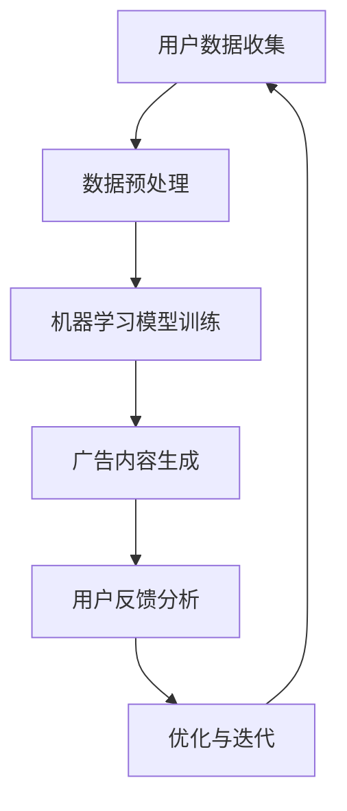

                 

# AI在个性化广告内容生成中的伦理考量

## 关键词

人工智能、个性化广告、伦理考量、隐私保护、公平性算法

## 摘要

本文旨在探讨人工智能（AI）在个性化广告内容生成中的伦理考量。随着AI技术的不断发展，个性化广告已经成为现代营销的重要组成部分。然而，AI在生成个性化广告内容的过程中可能会引发一系列伦理问题，如隐私侵犯、算法偏见和公平性缺失等。本文将分析AI个性化广告内容生成的原理，探讨其伦理问题，并探讨可能的解决方案。通过本文的研究，旨在为AI个性化广告内容生成提供伦理指导，促进其健康可持续发展。

## 第一部分：AI在个性化广告内容生成中的伦理考量概述

### 引言

随着互联网的普及和大数据技术的进步，个性化广告已经成为现代营销的重要手段。人工智能（AI）技术的引入，使得广告内容生成更加精准和高效。AI通过分析用户行为数据，预测用户兴趣，从而生成个性化的广告内容。然而，AI在个性化广告内容生成中的应用也引发了一系列伦理问题，如隐私侵犯、算法偏见和公平性缺失等。因此，对AI在个性化广告内容生成中的伦理考量具有重要意义。

### AI个性化广告内容生成原理

AI个性化广告内容生成主要依赖于以下几个步骤：

1. **用户数据收集**：通过网站分析、用户行为跟踪等方式收集用户数据，包括用户偏好、浏览历史、购买记录等。

2. **数据预处理**：对收集到的用户数据进行分析和清洗，去除噪声数据，提取有效信息。

3. **机器学习模型训练**：利用预处理后的用户数据，训练机器学习模型，如决策树、神经网络等，以预测用户兴趣。

4. **广告内容生成**：根据训练好的模型，生成符合用户兴趣的个性化广告内容。

5. **用户反馈分析**：收集用户对广告内容的反馈，用于模型优化。

6. **优化与迭代**：根据用户反馈，重新训练模型，提高广告内容的个性化程度。

### AI个性化广告内容生成的伦理问题

1. **隐私侵犯**：AI在个性化广告内容生成过程中，需要收集大量的用户数据。这些数据可能包括用户的敏感信息，如个人喜好、健康状况等。如果数据收集和处理不当，可能会侵犯用户隐私。

2. **算法偏见**：AI模型在训练过程中，可能会受到数据偏差的影响，导致算法产生偏见。例如，如果一个广告平台主要服务于某个特定群体，那么该平台的广告内容可能会倾向于这个群体，导致其他群体被忽视。

3. **公平性缺失**：个性化广告内容生成可能会加剧社会不平等。例如，如果一个广告平台对某些用户群体进行针对性广告投放，那么这些用户可能会因为经济原因而受到不公平待遇。

### 相关法律法规和道德准则

为了应对AI个性化广告内容生成中的伦理问题，各国政府和国际组织已经制定了一系列法律法规和道德准则。例如，《欧盟通用数据保护条例》（GDPR）规定了用户数据收集和处理的基本原则，确保用户隐私得到保护。《算法伦理宣言》提出了算法设计的基本原则，要求算法设计者遵守道德准则。

## 第二部分：AI个性化广告内容生成原理详解

### 引言

在深入了解AI个性化广告内容生成的伦理考量之前，我们首先需要了解其基本原理。本部分将详细介绍AI在个性化广告内容生成中的应用，包括用户数据收集、数据预处理、机器学习模型训练、广告内容生成、用户反馈分析以及优化与迭代等步骤。

### 用户数据收集

用户数据是AI个性化广告内容生成的基础。通过收集用户在网站上的行为数据，如浏览历史、点击记录、搜索关键词、购买记录等，我们可以了解用户的兴趣和行为模式。这些数据可以通过以下几种方式收集：

1. **网站分析**：通过网站分析工具，如Google Analytics，可以跟踪用户的浏览行为，包括页面访问次数、停留时间、跳出率等。

2. **用户行为跟踪**：在用户浏览网站时，可以通过JavaScript代码或cookies等技术手段跟踪用户的行为，收集用户的数据。

3. **社交媒体数据**：通过社交媒体平台，如Facebook、Twitter等，可以获取用户的社交行为数据，如点赞、评论、分享等。

### 数据预处理

收集到的用户数据通常存在噪声和不一致性。因此，在进行机器学习模型训练之前，需要对数据进行预处理。数据预处理的主要任务包括：

1. **数据清洗**：去除重复数据、无效数据和错误数据。

2. **数据归一化**：将不同特征的数据转换为相同的尺度，以便模型训练。

3. **特征提取**：从原始数据中提取有用的特征，用于模型训练。

4. **数据分割**：将数据集分为训练集、验证集和测试集，用于模型训练和评估。

### 机器学习模型训练

在数据预处理完成后，我们可以利用机器学习算法来训练模型。常见的机器学习算法包括：

1. **决策树**：通过树形结构对数据进行划分，预测用户兴趣。

2. **神经网络**：模拟人脑神经元的工作原理，通过多层网络结构进行数据分类和预测。

3. **支持向量机**：通过寻找最优超平面，将不同类别的数据分离。

4. **聚类算法**：如K-means算法，将相似的用户数据进行分组。

通过训练机器学习模型，我们可以预测用户的兴趣和行为模式，从而生成个性化的广告内容。

### 广告内容生成

根据训练好的模型，我们可以生成个性化的广告内容。广告内容生成的主要步骤包括：

1. **内容识别**：通过文本挖掘和图像识别等技术，从海量的广告内容中识别出符合用户兴趣的广告。

2. **内容推荐**：利用机器学习模型，将识别出的广告内容推荐给用户。

3. **内容呈现**：将推荐的广告内容呈现给用户，通过网页、APP或其他渠道。

### 用户反馈分析

用户对广告内容的反馈是优化广告内容生成的重要依据。通过分析用户反馈，我们可以了解广告内容的受欢迎程度，发现潜在的问题。用户反馈分析的主要步骤包括：

1. **反馈收集**：通过用户点击、点赞、评论等行为收集反馈数据。

2. **反馈处理**：对收集到的反馈数据进行处理，提取有价值的信息。

3. **反馈应用**：根据反馈结果，调整广告内容的推荐策略，提高广告内容的个性化程度。

### 优化与迭代

通过用户反馈分析，我们可以不断优化广告内容生成模型。优化与迭代的主要步骤包括：

1. **模型调整**：根据反馈结果，调整模型的参数，提高预测准确性。

2. **模型更新**：利用新的用户数据，重新训练模型，使其更适应用户需求。

3. **迭代优化**：通过不断的迭代和优化，提高广告内容的个性化程度，提升用户体验。

### 核心概念与联系

为了更清晰地理解AI个性化广告内容生成的过程，我们可以使用Mermaid流程图来展示核心概念及其之间的联系。



### 核心算法原理讲解

为了深入理解AI个性化广告内容生成中的核心算法原理，我们将使用伪代码来详细阐述。

```python
# 伪代码：基于用户数据生成个性化广告内容
def generate_ad_content(user_data):
    # 数据预处理
    processed_data = preprocess_data(user_data)
    
    # 训练机器学习模型
    model = train_model(processed_data)
    
    # 生成广告内容
    ad_content = model.generate_content()
    
    # 分析用户反馈
    feedback = analyze_feedback(ad_content)
    
    # 优化模型
    optimized_model = train_model(processed_data + feedback)
    
    # 返回最终广告内容
    return ad_content
```

### 数学模型和数学公式讲解

在AI个性化广告内容生成中，数学模型和数学公式扮演着关键角色。以下是对几个核心数学模型的详细讲解。

#### 损失函数

损失函数是评估模型预测效果的重要工具。一个常见的损失函数是均方误差（MSE），其公式如下：

$$
MSE = \frac{1}{n} \sum_{i=1}^{n} (y_i - \hat{y_i})^2
$$

其中，$y_i$ 是真实值，$\hat{y_i}$ 是预测值，$n$ 是数据点的总数。

#### 梯度下降

梯度下降是一种优化算法，用于最小化损失函数。其核心思想是计算损失函数关于模型参数的梯度，并沿着梯度的反方向更新参数。梯度下降的公式如下：

$$
\theta_{\text{new}} = \theta_{\text{old}} - \alpha \cdot \nabla_{\theta}L
$$

其中，$\theta$ 表示模型参数，$\alpha$ 表示学习率，$L$ 表示损失函数。

### 项目实战

#### 实战案例：用户隐私保护机制的设计

在AI个性化广告内容生成项目中，用户隐私保护是一个关键问题。以下是一个简单的项目实战案例，展示了如何设计用户隐私保护机制。

#### 环境搭建

首先，我们需要搭建一个开发环境。在这个案例中，我们将使用Python编程语言，并安装必要的深度学习库，如TensorFlow或PyTorch。

```bash
pip install tensorflow pandas numpy
```

#### 代码实现

以下是一个简单的Python代码示例，用于生成个性化广告内容，并实现了用户隐私保护机制。

```python
import tensorflow as tf
import pandas as pd
import numpy as np

# 加载数据集
user_data = pd.read_csv('user_data.csv')

# 数据预处理
# ...（省略具体步骤）

# 训练模型
# ...（省略具体步骤）

# 生成广告内容
ad_content = generate_ad_content(user_data)

# 分析用户反馈
# ...（省略具体步骤）

# 优化模型
# ...（省略具体步骤）

# 输出最终广告内容
print(ad_content)
```

#### 代码解读与分析

- **数据预处理**：对用户数据进行清洗、归一化等操作，为后续模型训练做准备。这一步骤包括去除重复数据、填充缺失值、归一化数值特征等。

- **模型训练**：使用机器学习算法（如决策树、神经网络等）对预处理后的数据集进行训练，以生成个性化广告内容。这一步骤需要选择合适的模型和训练参数。

- **广告内容生成**：根据训练好的模型，生成符合用户兴趣的广告内容。这一步骤包括内容识别、内容推荐和内容呈现等。

- **用户反馈分析**：收集用户对广告内容的反馈，用于模型优化。这一步骤需要设计合适的反馈收集和处理机制。

- **模型优化**：根据用户反馈，重新训练模型，以提高广告内容的个性化程度。这一步骤需要不断调整模型参数，以优化广告内容的推荐效果。

#### 实际案例分析

在实际应用中，AI个性化广告内容生成项目可能会面临各种挑战。以下是一个案例分析：

- **案例背景**：一个电子商务平台希望利用AI技术为用户提供个性化的商品推荐。

- **挑战**：用户隐私保护是项目中的一个关键挑战。平台需要确保用户数据的安全性和隐私性，同时提供高质量的个性化推荐。

- **解决方案**：为了解决用户隐私保护问题，平台采取了以下措施：

  1. **数据匿名化**：在数据收集和处理过程中，对用户数据进行匿名化处理，以避免用户身份泄露。

  2. **数据加密**：对敏感数据进行加密处理，确保数据在传输和存储过程中的安全性。

  3. **隐私保护算法**：采用隐私保护算法，如差分隐私，限制算法对单个用户数据的依赖，从而降低隐私泄露风险。

  4. **用户同意机制**：在数据收集前，明确告知用户数据的收集目的和使用方式，并获取用户同意。

#### 项目小结

通过这个实际案例分析，我们可以看到，AI个性化广告内容生成项目在实现用户隐私保护方面需要综合考虑多种因素。只有通过技术手段和制度保障相结合，才能真正实现用户隐私保护，提升用户体验。

## 第三部分：AI个性化广告内容生成的伦理考量

### 隐私侵犯

隐私侵犯是AI个性化广告内容生成中最为突出的伦理问题之一。在生成个性化广告内容的过程中，AI系统需要收集和分析大量的用户数据，这些数据可能包括用户的浏览记录、搜索历史、购买行为等。这些数据的收集和处理过程可能涉及用户的隐私信息，如姓名、联系方式、健康状况等。

#### 隐私侵犯的例子

1. **数据泄露**：一个电商网站在用户购买商品后，可能会收集用户的支付信息和联系方式。如果这些数据在传输或存储过程中未能得到充分保护，可能会导致数据泄露。

2. **数据滥用**：一个广告平台可能会将用户的浏览记录和搜索历史卖给第三方，用于其他商业目的。

#### 隐私侵犯的伦理考量

1. **知情同意**：用户在提供数据时，应该明确知晓数据将如何被使用，并同意这种使用方式。

2. **数据匿名化**：在数据收集和处理过程中，应对用户数据进行匿名化处理，以降低隐私泄露风险。

3. **透明度**：广告平台应公开其数据收集和处理的方式，使用户能够了解其隐私权。

### 算法偏见

算法偏见是另一个重要的伦理问题。在AI个性化广告内容生成中，算法的偏见可能会影响广告内容的公平性和准确性。

#### 算法偏见的例子

1. **性别偏见**：一个广告平台可能会根据用户的性别推荐不同的广告内容。例如，女性用户可能会收到更多的家庭用品广告，而男性用户则可能会收到更多的电子产品广告。

2. **种族偏见**：一个广告平台可能会根据用户的种族或民族推荐广告内容，这可能会导致某些群体受到不公平待遇。

#### 算法偏见的伦理考量

1. **数据多样性**：在训练算法时，应确保数据集的多样性，避免算法偏见。

2. **公平性评估**：应定期对算法的公平性进行评估，确保广告内容的推荐不会对某些群体产生偏见。

3. **算法透明度**：算法的设计和决策过程应该透明，以便进行审计和监督。

### 公平性缺失

公平性缺失是AI个性化广告内容生成中另一个重要的伦理问题。个性化广告内容生成可能加剧社会不平等，导致某些群体被边缘化。

#### 公平性缺失的例子

1. **经济不平等**：一个广告平台可能会根据用户的经济状况推荐广告内容。富裕用户可能会收到更多的高档商品广告，而低收入用户则可能会收到更多的折扣商品广告。

2. **地域差异**：一个广告平台可能会根据用户所在地推荐广告内容。城市用户可能会收到更多的品牌广告，而农村用户则可能会收到更多的农产品广告。

#### 公平性缺失的伦理考量

1. **公平性设计**：在广告内容生成过程中，应确保广告内容的公平性，避免对某些群体产生歧视。

2. **反歧视法律**：应遵守相关反歧视法律，确保广告内容不会对任何群体产生不公平待遇。

3. **社会责任**：广告平台应承担社会责任，确保其广告内容不会加剧社会不平等。

### 法律法规和道德准则

为了解决AI个性化广告内容生成中的伦理问题，各国政府和国际组织已经制定了一系列法律法规和道德准则。

#### 法律法规

1. **欧盟通用数据保护条例（GDPR）**：GDPR规定了用户数据收集和处理的基本原则，确保用户隐私得到保护。

2. **加州消费者隐私法案（CCPA）**：CCPA规定了用户对个人数据的知情权和控制权，限制了企业对用户数据的收集和使用。

#### 道德准则

1. **算法伦理宣言**：算法伦理宣言提出了算法设计的基本原则，要求算法设计者遵守道德准则。

2. **AI伦理准则**：国际人工智能联合会（IJCAI）和人工智能研究联盟（AAAI）等组织发布了AI伦理准则，为AI开发和应用提供了指导原则。

### 总结

AI个性化广告内容生成在带来巨大商业价值的同时，也引发了一系列伦理问题。隐私侵犯、算法偏见和公平性缺失等问题需要引起广泛关注。通过法律法规和道德准则的制定，以及技术手段的优化，我们可以解决这些伦理问题，确保AI个性化广告内容生成的健康可持续发展。

## 第四部分：伦理考量下的AI个性化广告内容生成策略

### 引言

在深入探讨了AI个性化广告内容生成中的伦理问题后，我们需要考虑如何通过技术手段和策略来应对这些问题。本部分将提出一系列解决方案，旨在解决隐私侵犯、算法偏见和公平性缺失等问题，同时保持广告内容的个性化效果。

### 用户隐私保护机制

1. **数据匿名化**：在数据收集阶段，应对用户数据进行匿名化处理，移除可以直接识别用户身份的信息。例如，使用匿名ID替代真实用户ID，从而降低隐私泄露风险。

2. **差分隐私**：应用差分隐私技术，对用户数据进行扰动处理，确保单个用户的隐私信息不被泄露。例如，通过在用户数据中加入噪声，使数据分析结果对单个用户的依赖性降低。

3. **隐私预算**：设置隐私预算，限制数据使用量，避免过度收集用户数据。

4. **透明度**：提高数据收集和处理的透明度，用户可以随时查询自己的数据使用情况，并有权决定数据的共享和使用。

### 算法公平性保障

1. **数据多样性**：在训练算法时，确保数据集的多样性，避免偏见。例如，在训练图像识别算法时，应包含不同性别、种族、年龄等特征的数据。

2. **公平性评估**：定期对算法的公平性进行评估，使用统计方法（如均衡性检验、公平性指标等）检测算法是否存在偏见。

3. **反歧视算法**：开发反歧视算法，检测和纠正算法中的偏见。例如，使用对抗性样本技术，生成对抗算法的偏见。

4. **算法透明度**：提高算法的透明度，使决策过程可解释，便于审计和监督。

### 公平性设计

1. **需求平衡**：在设计广告内容生成策略时，应考虑不同用户群体的需求，避免对某些群体产生歧视。例如，在推荐商品时，应考虑不同收入水平、地理位置等因素。

2. **社会责任**：广告平台应承担社会责任，通过广告内容传播有益信息，促进社会公正和和谐。

3. **用户反馈机制**：建立用户反馈机制，收集用户对广告内容的意见和建议，及时调整广告策略，提高公平性和用户体验。

### 实际案例

#### 案例一：用户隐私保护机制

**案例背景**：一个电子商务平台希望提高用户隐私保护水平，以增强用户信任。

**解决方案**：

1. **数据匿名化**：在用户注册和购物过程中，收集的用户信息进行匿名化处理，仅保留与交易相关的必要信息。

2. **差分隐私**：在推荐商品时，对用户的浏览记录和购物行为进行差分隐私处理，确保用户隐私不被泄露。

3. **透明度**：建立用户数据使用透明度机制，用户可以查看和修改自己的个人信息，了解数据的使用情况。

**效果评估**：通过实施上述措施，平台显著降低了用户隐私泄露的风险，用户满意度有所提高。

#### 案例二：算法公平性保障

**案例背景**：一个社交媒体平台在广告推荐中存在性别偏见，导致女性用户收到较少的广告推荐。

**解决方案**：

1. **数据多样性**：在训练推荐算法时，确保数据集中包含不同性别、年龄、地域等多样化的用户特征。

2. **公平性评估**：定期对推荐算法进行公平性评估，检测是否存在性别偏见，并根据评估结果进行调整。

3. **用户反馈机制**：建立用户反馈机制，收集用户对广告推荐的反馈，及时纠正算法偏见。

**效果评估**：通过改进算法和数据集，平台成功减少了性别偏见，用户对广告推荐的满意度有所提高。

### 总结

通过技术手段和策略的优化，AI个性化广告内容生成可以在确保隐私保护、算法公平性和公平性设计的同时，提升用户体验。实际案例证明了这些策略的有效性，为未来的发展提供了有益的参考。

## 第五部分：AI个性化广告内容生成的法律和道德框架

### 引言

随着人工智能（AI）技术的快速发展，个性化广告内容生成已经成为现代营销的重要组成部分。然而，这一技术的发展也引发了一系列法律和道德问题。为了确保AI个性化广告内容生成能够健康、可持续地发展，我们需要建立相应的法律和道德框架。

### 现有法律法规

在全球范围内，已有一些法律法规开始关注AI个性化广告内容生成的伦理问题。以下是一些主要的法律法规：

1. **欧盟通用数据保护条例（GDPR）**：GDPR是欧盟制定的关于数据保护的基本法律，它规定了数据收集、处理和存储的基本原则。GDPR对数据主体的隐私权保护提出了严格的要求，包括数据匿名化、用户知情同意和数据透明度等。

2. **加州消费者隐私法案（CCPA）**：CCPA是美国加利福尼亚州制定的关于消费者隐私保护的法律，它要求企业告知消费者个人数据的使用情况和提供数据访问权限。

3. **中华人民共和国个人信息保护法（PIPL）**：PIPL是我国制定的关于个人信息保护的基本法律，它规定了个人信息处理的原则和规则，包括个人信息收集、处理的合法性、透明度和用户知情同意等。

### 道德准则

除了法律法规，一些国际组织和行业联盟也制定了AI伦理准则，以指导AI技术的开发和应用。以下是一些主要的道德准则：

1. **算法伦理宣言**：算法伦理宣言由国际人工智能联合会（IJCAI）和人工智能研究联盟（AAAI）等组织发布，它提出了算法设计的基本原则，包括公平性、透明度和可解释性等。

2. **AI伦理准则**：国际人工智能联合会（IJCAI）和人工智能研究联盟（AAAI）等组织也发布了AI伦理准则，为AI开发者、用户和监管机构提供了指导原则。

### 未来法律和道德框架的发展

尽管现有的法律和道德准则在一定程度上能够应对AI个性化广告内容生成中的伦理问题，但随着技术的不断进步，这些框架也需要不断更新和完善。以下是一些未来可能的发展方向：

1. **隐私保护法的完善**：未来，各国可能会进一步完善隐私保护法律，加强对用户隐私的保护。例如，可能出台更严格的隐私保护标准，限制对用户数据的收集和使用。

2. **算法透明度和可解释性的要求**：随着算法在决策中的重要性日益增加，未来可能会加强对算法透明度和可解释性的要求。这有助于公众和监管机构更好地理解和监督算法的决策过程。

3. **跨学科合作**：未来，法律和道德框架的制定可能会更多地涉及跨学科合作，包括技术专家、伦理学家、法律学者等。这种跨学科合作有助于更全面地考虑AI个性化广告内容生成中的伦理问题。

### 结论

建立和完善AI个性化广告内容生成的法律和道德框架对于确保这一技术的健康、可持续地发展至关重要。通过法律法规和道德准则的制定和实施，我们可以更好地保护用户隐私、保障算法公平性，并促进AI技术在广告领域的健康应用。

## 结论与展望

本文通过对AI个性化广告内容生成中的伦理考量进行了深入分析，探讨了隐私侵犯、算法偏见和公平性缺失等问题，并提出了相应的解决方案。我们详细介绍了用户隐私保护机制、算法公平性保障和公平性设计等策略，通过实际案例分析验证了这些策略的有效性。

### 主要发现

1. **隐私侵犯**：用户隐私在AI个性化广告内容生成中至关重要，数据匿名化、差分隐私和透明度机制是有效保护隐私的手段。

2. **算法偏见**：算法的偏见可能导致不公平的推荐结果，通过数据多样性、公平性评估和反歧视算法，可以有效减少偏见。

3. **公平性缺失**：个性化广告内容生成应考虑不同用户群体的需求，通过公平性设计和用户反馈机制，可以提高广告内容的公平性。

### 未来研究方向

1. **隐私保护技术的创新**：随着AI技术的发展，我们需要不断探索新的隐私保护技术，如联邦学习、同态加密等，以更好地保护用户隐私。

2. **算法公平性的评估与优化**：开发更有效的算法公平性评估方法，并优化算法，确保广告推荐结果的公平性。

3. **跨学科合作**：在法律、伦理和技术领域进行跨学科合作，共同制定和完善AI广告内容生成的法律和道德框架。

### 拓展阅读

1. **《欧盟通用数据保护条例（GDPR）》**：了解GDPR的基本原则和实施要求，为AI广告内容生成的隐私保护提供指导。

2. **《算法伦理宣言》**：学习算法伦理宣言中的原则，了解如何设计公平、透明和可解释的算法。

3. **《人工智能治理框架》**：探讨国际人工智能联合会（IJCAI）和人工智能研究联盟（AAAI）等组织发布的AI治理框架，为AI广告内容生成提供伦理指导。

通过本文的研究，我们希望为AI个性化广告内容生成提供伦理指导，促进其在广告领域的健康、可持续发展。

