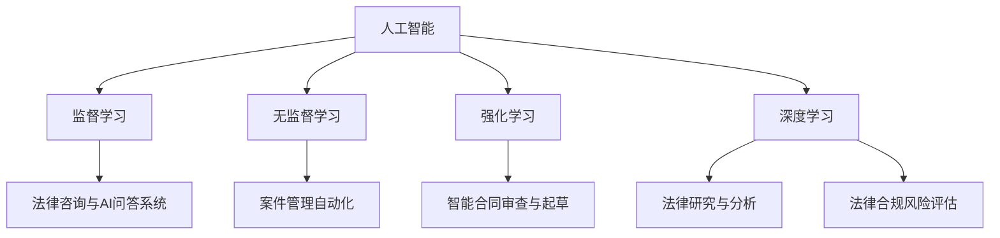
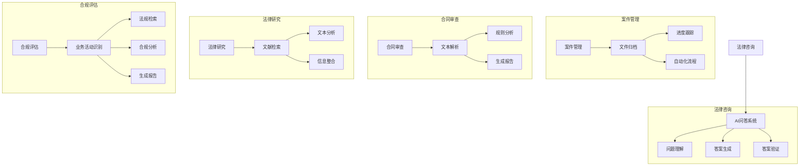

                 

### 文章标题

《AI在法律服务中的应用：效率与公平的权衡》

### 关键词

人工智能，法律服务，效率，公平，算法，数学模型，合同审核，法律研究，案例分析

### 摘要

本文旨在探讨人工智能（AI）在法律服务中的应用，特别是如何在提升效率的同时保持法律的公平性。文章首先介绍了AI在法律服务领域的背景与意义，接着详细阐述了AI在法律咨询、案件管理、合同审查和法律研究等方面的应用。随后，文章深入分析了AI算法原理、法律文本处理算法以及智能合同审核算法，通过数学模型和公式讲解了AI在法律分析中的关键数学方法。最后，文章通过项目实战展示了AI在法律服务中的实际应用，并提出了一些最佳实践和小结。文章结构清晰，逻辑严谨，为AI在法律服务中的应用提供了全面而深入的探讨。

### 目录大纲

# 《AI在法律服务中的应用：效率与公平的权衡》

## 第一部分：引言

### 第1章 AI在法律服务中的背景与意义

#### 1.1 AI与法律服务的融合趋势

#### 1.2 效率与公平的权衡问题

#### 1.3 本书结构安排与目标

## 第二部分：核心概念与联系

### 第2章 AI基础知识与法律应用

#### 2.1 人工智能的定义与发展历程

#### 2.2 常见AI算法与模型

#### 2.3 AI在法律服务中的核心应用

### 第3章 法律服务流程中的AI应用

#### 3.1 法律咨询与AI问答系统

#### 3.2 案件管理自动化

#### 3.3 智能合同审查与起草

### 第4章 AI在法律研究与分析中的应用

#### 4.1 法律文献的自动化检索与梳理

#### 4.2 智能裁判预测与辅助

#### 4.3 法律合规风险评估

## 第三部分：核心算法原理讲解

### 第5章 AI算法原理详解

#### 5.1 监督学习与无监督学习

#### 5.2 神经网络与深度学习

#### 5.3 自然语言处理基础

### 第6章 法律文本处理算法

#### 6.1 词嵌入技术

#### 6.2 序列模型与注意力机制

#### 6.3 法律文本分类与实体识别

### 第7章 智能合同审核算法

#### 7.1 合同条款自动提取与比对

#### 7.2 智能合同审核算法实现

#### 7.3 实际案例解析

## 第四部分：数学模型与数学公式讲解

### 第8章 法律服务中的数学模型

#### 8.1 概率论与统计学基础

#### 8.2 模型评估与优化

#### 8.3 数学模型在法律分析中的应用

### 第9章 公平性评估模型

#### 9.1 公平性定义与度量

#### 9.2 数据偏差识别与校正

#### 9.3 公平性评估方法与应用

## 第五部分：项目实战

### 第10章 AI在法律咨询服务中的应用

#### 10.1 开发环境搭建

#### 10.2 源代码详细实现

#### 10.3 代码解读与分析

### 第11章 智能合同审核系统开发

#### 11.1 系统需求分析

#### 11.2 系统设计与实现

#### 11.3 系统测试与优化

### 第12章 法律文献分析平台建设

#### 12.1 平台架构设计

#### 12.2 数据处理与存储方案

#### 12.3 功能模块开发与集成

## 第六部分：总结与展望

### 第13章 AI在法律服务中的应用总结

#### 13.1 成功案例分析

#### 13.2 存在的问题与挑战

#### 13.3 未来发展趋势

### 第14章 AI在法律服务业的展望

#### 14.1 AI与法律服务的融合前景

#### 14.2 效率与公平的持续权衡

#### 14.3 法律服务行业的数字化转型

## 第一部分：引言

### 第1章 AI在法律服务中的背景与意义

#### 1.1 AI与法律服务的融合趋势

随着人工智能技术的飞速发展，AI在各个行业中的应用日益广泛，法律服务行业也不例外。AI与法律服务的融合正在成为不可逆转的趋势，其主要驱动力包括以下几个方面：

1. **数据驱动的决策支持**：法律领域产生和处理大量数据，AI技术可以帮助律师和法务人员高效地处理和分析这些数据，提供更为精准的决策支持。
  
2. **自动化流程优化**：从法律咨询、案件管理到合同审查，AI可以通过自动化技术减少重复性劳动，提高工作效率。

3. **法律研究与分析**：AI可以自动检索和梳理法律文献，辅助律师进行案件研究，从而节省时间和精力。

4. **智能合同审核与起草**：AI可以通过自然语言处理技术，自动理解和生成合同条款，降低合同起草和审核的出错率。

5. **公平性监督与保障**：AI可以用于评估法律决策的公平性，有助于发现和纠正潜在的偏见。

#### 1.2 效率与公平的权衡问题

AI在提升法律服务效率方面具有显著优势，但同时也带来了公平性问题。一方面，AI可以帮助律师处理大量法律文件，减少人力成本，提高工作效率。另一方面，AI系统可能基于历史数据，从而导致决策上的偏见和歧视。例如，AI在合同审核时可能因为历史数据中存在的性别或种族歧视而做出不公平的判断。

如何平衡AI的效率与公平性，是法律服务行业面临的一大挑战。要实现这一目标，需要从以下几个方面进行努力：

1. **算法透明性与可解释性**：提高AI算法的透明度，使其决策过程可解释，有助于用户理解AI的行为，并对其结果进行监督和评估。

2. **公平性评估与监督**：开发公平性评估模型，定期对AI系统进行评估和监督，确保其决策过程的公平性。

3. **多样化数据集**：使用多样化的数据集训练AI模型，减少因数据偏差导致的偏见。

4. **法律伦理与道德规范**：制定相应的法律伦理与道德规范，引导AI在法律服务中的合理应用。

#### 1.3 本书结构安排与目标

本书旨在系统地探讨AI在法律服务中的应用，特别是效率与公平的权衡问题。本书的结构安排如下：

1. **第一部分（引言）**：介绍AI在法律服务中的背景与意义，以及效率与公平的权衡问题。

2. **第二部分（核心概念与联系）**：讲解AI基础知识与法律应用，以及AI在法律服务流程中的具体应用。

3. **第三部分（核心算法原理讲解）**：详细分析AI算法原理、法律文本处理算法和智能合同审核算法。

4. **第四部分（数学模型与数学公式讲解）**：介绍法律服务中的数学模型和公平性评估模型。

5. **第五部分（项目实战）**：通过实际项目展示AI在法律服务中的应用，并进行代码解读与分析。

6. **第六部分（总结与展望）**：总结AI在法律服务中的应用，探讨未来发展趋势。

本书的目标是帮助读者全面了解AI在法律服务中的应用，掌握相关技术原理和实施方法，从而为实际工作提供有益的参考和指导。

## 第二部分：核心概念与联系

### 第2章 AI基础知识与法律应用

#### 2.1 人工智能的定义与发展历程

人工智能（Artificial Intelligence, AI）是一门研究、开发和应用使计算机模拟、延伸和扩展人类智能的理论、方法、技术及应用系统的学科。其目标是创建能够思考、学习、解决问题和适应新环境的智能系统。

AI的发展历程可以分为以下几个阶段：

1. **初始阶段（1950年代-1960年代）**：以图灵测试为标志，研究主要集中在符号人工智能，即基于逻辑推理和知识表示的智能系统。

2. **成熟阶段（1970年代-1980年代）**：人工智能进入了“符号主义阶段”，研究者开始关注如何构建具有推理能力的智能系统。

3. **低谷阶段（1990年代）**：由于技术瓶颈和资金问题，AI研究进入低谷。

4. **复苏阶段（2000年代至今）**：以深度学习和大数据技术的兴起为标志，AI进入了新的发展阶段，开始在各个领域取得显著成果。

#### 2.2 常见AI算法与模型

在AI领域，常见的算法和模型包括以下几种：

1. **监督学习（Supervised Learning）**：监督学习是一种从标记数据中学习的方法。通过已知的输入和输出，训练模型来预测未知数据的输出。常见的监督学习算法有线性回归、决策树、支持向量机（SVM）等。

2. **无监督学习（Unsupervised Learning）**：无监督学习是在没有标签数据的情况下，通过数据自身的特征进行学习的方法。常见的无监督学习算法有聚类、主成分分析（PCA）、自编码器等。

3. **强化学习（Reinforcement Learning）**：强化学习是一种通过与环境的交互来学习策略的算法。通过奖励和惩罚机制，智能体（agent）逐渐学会如何在环境中做出最优决策。

4. **深度学习（Deep Learning）**：深度学习是机器学习的一个子领域，它基于多层神经网络，通过反向传播算法进行训练。常见的深度学习模型包括卷积神经网络（CNN）、循环神经网络（RNN）和变换器（Transformer）等。

#### 2.3 AI在法律服务中的核心应用

AI在法律服务中的核心应用主要包括以下几个方面：

1. **法律咨询与AI问答系统**：通过自然语言处理技术，AI可以理解用户的问题，并提供相关的法律咨询。

2. **案件管理自动化**：AI可以帮助律师自动化处理案件流程，如案件文件的归档、案件进度的跟踪和通知等。

3. **智能合同审查与起草**：AI可以通过自然语言处理技术，自动提取合同条款，并对比不同合同之间的差异。

4. **法律研究与分析**：AI可以自动检索和梳理法律文献，辅助律师进行案件研究。

5. **法律合规风险评估**：AI可以帮助企业评估其业务活动是否符合相关法律法规，降低合规风险。

#### 2.4 AI在法律服务中的核心应用联系架构

为了更好地理解AI在法律服务中的应用，我们可以使用Mermaid流程图来展示核心概念之间的联系：



通过该流程图，我们可以清晰地看到AI算法与法律服务应用之间的联系。例如，监督学习可以应用于法律咨询与AI问答系统，而无监督学习可以用于案件管理自动化。强化学习和深度学习则在智能合同审查、法律研究与分析以及法律合规风险评估中发挥着关键作用。

### 第3章 法律服务流程中的AI应用

#### 3.1 法律咨询与AI问答系统

法律咨询是律师为客户提供法律意见和服务的重要环节。传统的法律咨询往往依赖于律师的个人经验和专业知识，这既费时又费力。而AI问答系统可以通过自然语言处理（NLP）技术，实现智能化的法律咨询，大大提高咨询效率和准确性。

**工作原理：**

AI问答系统的核心是自然语言处理模型，如循环神经网络（RNN）或变换器（Transformer）。这些模型可以通过大量法律文本进行训练，从而理解用户的问题和法律术语。具体流程如下：

1. **问题理解**：用户通过文本输入问题，系统使用NLP技术对问题进行语义解析，提取关键信息。
2. **答案生成**：系统根据解析结果，从预训练的法律知识库中检索相关答案，或者使用生成式模型（如变换器）生成新的答案。
3. **答案验证**：系统对生成的答案进行验证，确保其准确性和合规性。

**案例解析：**

例如，某用户通过AI问答系统咨询有关劳动合同法的问题。系统首先使用NLP技术解析用户的问题，提取关键信息如“劳动合同法”、“试用期”等。然后，系统从法律知识库中检索相关条款，生成答案如“根据《劳动合同法》第19条规定，试用期最长不得超过六个月。”最后，系统对答案进行验证，确保其符合法律规定。

**算法原理：**

AI问答系统的核心算法通常是基于变换器（Transformer）架构的生成式模型。变换器模型通过自注意力机制，能够捕捉文本中的长距离依赖关系，从而生成高质量的答案。以下是一个简化的伪代码示例：

```python
def generate_answer(question):
    # 加载预训练的变换器模型
    model = load_pretrained_transformer_model()

    # 对问题进行编码，得到编码后的序列
    encoded_question = model.encode(question)

    # 使用变换器模型生成答案
    answer = model.generate(encoded_question)

    # 解码生成的答案
    decoded_answer = model.decode(answer)

    return decoded_answer
```

#### 3.2 案件管理自动化

案件管理是律师日常工作中必不可少的一部分，涉及案件文件的归档、案件进度的跟踪、通知和提醒等。传统的案件管理往往依赖于人工操作，不仅效率低下，还容易出错。而AI技术可以自动化这些流程，提高工作效率和准确性。

**工作原理：**

AI案件管理系统通过整合各种AI技术，如自然语言处理、图像识别和自动化流程管理，实现案件管理的自动化。具体流程如下：

1. **文件归档**：AI系统可以自动识别和分类案件文件，并将其存储在指定的位置。
2. **进度跟踪**：AI系统可以监控案件进度，并根据预设的规则生成提醒和通知。
3. **自动化流程**：AI系统可以自动化执行一些常见流程，如发送律师函、安排会议等。

**案例解析：**

例如，某律师需要发送一封律师函。传统方式下，律师需要手动撰写律师函、打印、盖章，然后通过邮局或快递发送。而使用AI案件管理系统，律师只需在系统中输入相关内容，系统会自动生成律师函，并使用电子签名功能进行盖章，然后通过电子邮件或短信通知对方律师。

**算法原理：**

AI案件管理系统中的关键算法包括自然语言处理和自动化流程管理。自然语言处理用于解析律师函的内容，提取关键信息，如收件人、发送日期等。自动化流程管理则用于根据预设的规则生成提醒和通知。以下是一个简化的伪代码示例：

```python
def manage_case(case_details):
    # 加载自然语言处理模型
    nlp_model = load_nlp_model()

    # 解析案件详情
    parsed_details = nlp_model.parse(case_details)

    # 生成律师函
    lawyer_letter = generate_lawyer_letter(parsed_details)

    # 使用电子签名
    signed_letter = sign_letter_electronically(lawyer_letter)

    # 发送通知
    send_notification(parsed_details['recipient'], signed_letter)

    return signed_letter
```

#### 3.3 智能合同审查与起草

合同审查和起草是法律服务的核心任务之一。传统的合同审查通常需要律师逐一阅读合同条款，识别潜在的法律问题，这不仅耗时，还容易出现遗漏。而智能合同审查系统可以通过自然语言处理技术，自动提取合同条款，分析其合法性、合规性和潜在风险，从而提高审查效率和准确性。

**工作原理：**

智能合同审查系统通过自然语言处理技术，对合同文本进行解析，提取关键条款和条件，然后使用规则引擎和法律知识库进行分析。具体流程如下：

1. **文本解析**：系统使用自然语言处理模型，对合同文本进行分词、词性标注和句法分析，提取出合同条款。
2. **规则分析**：系统使用预定义的规则库，对提取出的合同条款进行分析，检查其合法性、合规性和潜在风险。
3. **生成报告**：系统根据分析结果，生成详细的审查报告，包括合法性和合规性评估、风险提示等。

**案例解析：**

例如，某律师需要审查一份租赁合同。智能合同审查系统会自动提取合同中的关键条款，如租赁期限、租金、押金等，然后使用法律知识库和规则库进行分析，检查这些条款的合法性、合规性和潜在风险。如果发现潜在问题，系统会生成审查报告，并提出修改建议。

**算法原理：**

智能合同审查系统中的核心算法是自然语言处理和规则引擎。自然语言处理用于解析合同文本，提取关键信息。规则引擎则用于根据预定义的规则，对提取出的信息进行分析。以下是一个简化的伪代码示例：

```python
def review_contract(contract_text):
    # 加载自然语言处理模型
    nlp_model = load_nlp_model()

    # 解析合同文本
    parsed_text = nlp_model.parse(contract_text)

    # 加载规则库
    rule_library = load_rule_library()

    # 分析合同条款
    analysis_results = analyze_clauses(parsed_text, rule_library)

    # 生成审查报告
    review_report = generate_review_report(analysis_results)

    return review_report
```

#### 3.4 法律研究与分析

法律研究是律师准备案件的重要环节，涉及对大量法律文献的检索、分析和整合。传统的法律研究通常需要律师手动检索文献，阅读并总结相关法律条文和案例。这不仅耗时，而且容易出现遗漏。而AI技术可以自动化这些流程，提高研究效率和准确性。

**工作原理：**

AI法律研究系统通过自然语言处理技术，自动检索和梳理法律文献，提取关键信息和法律条文。具体流程如下：

1. **文献检索**：系统使用自然语言处理模型，对用户输入的问题或关键词进行检索，从海量法律文献中提取相关文献。
2. **文本分析**：系统对提取出的法律文献进行文本分析，提取出关键信息和法律条文。
3. **信息整合**：系统将提取出的信息进行整合，生成完整的法律研究报告。

**案例解析：**

例如，某律师需要研究有关商业秘密保护的法律条文。AI法律研究系统会自动检索相关法律文献，提取出关键的法律条文和案例，然后对这些信息进行整合，生成一份详细的法律研究报告。

**算法原理：**

AI法律研究系统中的核心算法是自然语言处理和文本分析。自然语言处理用于检索和解析法律文献，文本分析用于提取关键信息和法律条文。以下是一个简化的伪代码示例：

```python
def legal_research(query):
    # 加载自然语言处理模型
    nlp_model = load_nlp_model()

    # 检索法律文献
    legal_documents = nlp_model.search_documents(query)

    # 分析法律文献
    legal条款 = analyze_documents(legal_documents)

    # 整合信息
    research_report = integrate_info(legal条款)

    return research_report
```

#### 3.5 法律合规风险评估

法律合规风险评估是企业在经营活动中必不可少的一环，涉及对各项业务活动是否符合相关法律法规的评估。传统的合规风险评估通常需要企业内部法务团队进行大量的人工审查和评估，这不仅耗时，而且容易出现遗漏。而AI技术可以自动化合规风险评估流程，提高评估效率和准确性。

**工作原理：**

AI法律合规风险评估系统通过自然语言处理技术，自动分析和评估企业的业务活动是否符合相关法律法规。具体流程如下：

1. **业务活动识别**：系统使用自然语言处理模型，对企业日常业务活动的描述进行解析，提取出关键的业务活动和流程。
2. **法规检索**：系统从法律数据库中检索与企业业务相关的法律法规。
3. **合规分析**：系统使用预定义的合规规则库，对提取出的业务活动和法律法规进行分析，评估其合规性。
4. **生成报告**：系统根据分析结果，生成合规风险评估报告，包括合规性评估、风险提示和改进建议。

**案例解析：**

例如，某企业需要进行一项新的业务活动，AI法律合规风险评估系统会自动识别该业务活动，从法律数据库中检索相关法律法规，然后使用合规规则库进行分析，评估其合规性。如果发现潜在风险，系统会生成合规风险评估报告，并提出改进建议。

**算法原理：**

AI法律合规风险评估系统中的核心算法是自然语言处理和合规分析。自然语言处理用于识别和解析业务活动和法律法规，合规分析用于根据预定义的合规规则，对业务活动进行分析。以下是一个简化的伪代码示例：

```python
def compliance风险评估(business_activity):
    # 加载自然语言处理模型
    nlp_model = load_nlp_model()

    # 识别业务活动
    identified_activities = nlp_model.identify_activities(business_activity)

    # 检索相关法规
    relevant_laws = nlp_model.search_laws(identified_activities)

    # 加载合规规则库
    compliance_rules = load_compliance_rules()

    # 分析合规性
    compliance_analysis = analyze_compliance(identified_activities, relevant_laws, compliance_rules)

    # 生成合规评估报告
    compliance_report = generate_compliance_report(compliance_analysis)

    return compliance_report
```

### 3.6 法律服务流程中AI应用的综合架构

为了更好地理解AI在法律服务流程中的应用，我们可以使用Mermaid流程图来展示各个应用之间的综合架构：



通过该流程图，我们可以清晰地看到AI在法律服务流程中的各个应用环节，以及各个环节之间的联系。例如，法律咨询中的AI问答系统需要通过问题理解、答案生成和答案验证等环节，而案件管理则需要通过文件归档、进度跟踪和自动化流程等环节。合同审查、法律研究和合规评估也各自通过不同的环节来实现其功能。

## 第四部分：核心算法原理讲解

### 第5章 AI算法原理详解

#### 5.1 监督学习与无监督学习

在人工智能（AI）领域，监督学习（Supervised Learning）和无监督学习（Unsupervised Learning）是两种主要的机器学习（Machine Learning）方法。它们的主要区别在于数据是否带有标签。

**监督学习（Supervised Learning）**

监督学习是一种在有监督的环境下训练模型的方法。在这种方法中，我们有一组输入数据（特征集）和相应的输出数据（标签集），模型的目的是通过学习这组数据来预测新的输入数据对应的输出。

**工作原理：**

1. **输入特征（X）和输出标签（Y）**：给定一个输入特征集X和对应的输出标签集Y，模型的目标是找到一个映射函数f：X → Y，使得f(X) ≈ Y。

2. **损失函数（Loss Function）**：为了衡量模型预测值和真实值之间的差距，我们使用损失函数（如均方误差MSE、交叉熵损失等）来计算预测误差。

3. **优化算法（Optimization Algorithm）**：使用优化算法（如梯度下降、随机梯度下降等）来最小化损失函数，从而找到最佳模型参数。

**常见算法：**

- 线性回归（Linear Regression）
- 决策树（Decision Tree）
- 支持向量机（Support Vector Machine）
- 集成学习方法（如随机森林、梯度提升树）

**伪代码示例：**

```python
def supervised_learning(X, Y):
    # 初始化模型参数
    weights = initialize_weights(X.shape[1])

    # 训练模型
    for epoch in range(num_epochs):
        predictions = model(X, weights)
        loss = loss_function(Y, predictions)
        gradients = compute_gradients(X, Y, predictions)
        weights -= learning_rate * gradients

    return weights
```

**无监督学习（Unsupervised Learning）**

无监督学习是在没有标签数据的情况下训练模型的方法。在这种方法中，我们只有输入数据，模型的目的是通过学习数据的内在结构来发现数据中的模式和规律。

**工作原理：**

1. **输入特征（X）**：给定一个输入特征集X，模型的目标是发现数据中的分布和聚类结构。

2. **聚类算法（Clustering Algorithm）**：如K-means、层次聚类、DBSCAN等，用于将数据划分为若干个簇。

3. **降维算法（Dimensionality Reduction）**：如主成分分析（PCA）、t-SNE等，用于降低数据的维度，同时保持数据的结构信息。

**常见算法：**

- K-means
- 层次聚类（Hierarchical Clustering）
- 主成分分析（PCA）
- 自编码器（Autoencoder）

**伪代码示例：**

```python
def unsupervised_learning(X):
    # 初始化聚类中心
    centroids = initialize_centroids(X, num_clusters)

    # 训练聚类模型
    for epoch in range(num_epochs):
        # 计算每个数据点与聚类中心的距离
        distances = calculate_distances(X, centroids)

        # 更新聚类中心
        centroids = update_centroids(X, distances)

    # 聚类结果
    clusters = assign_clusters(X, centroids)

    return clusters
```

#### 5.2 神经网络与深度学习

神经网络（Neural Networks）是模仿人脑神经元结构和功能的人工智能模型。深度学习（Deep Learning）是神经网络的一种特殊形式，通过多层的神经网络结构，实现对复杂数据的建模和处理。

**工作原理：**

1. **神经元结构**：神经网络由多个神经元（节点）组成，每个神经元通过加权连接与相邻的神经元相连。

2. **激活函数**：神经元通过激活函数（如Sigmoid、ReLU、Tanh等）来决定是否激活。

3. **前向传播（Forward Propagation）**：输入数据通过前向传播过程，逐层传递到输出层，最终生成预测结果。

4. **反向传播（Backpropagation）**：通过反向传播算法，计算预测误差，并更新网络权重和偏置。

**常见模型：**

- 卷积神经网络（CNN）
- 循环神经网络（RNN）
- 变换器（Transformer）

**伪代码示例：**

```python
def forward_propagation(X, weights, biases):
    # 初始化隐藏层激活值和输出层激活值
    hidden Activations = []
    output_activations = []

    # 前向传播过程
    for layer in range(num_layers):
        if layer == 0:
            input_data = X
        else:
            input_data = hidden_activations[-1]

        weights = weights[layer]
        biases = biases[layer]

        # 计算激活值
        activation = sigmoid(np.dot(input_data, weights) + biases)
        hidden_activations.append(activation)

    # 计算输出层激活值
    output_activation = sigmoid(np.dot(hidden_activations[-1], weights[-1]) + biases[-1])
    output_activations.append(output_activation)

    return hidden_activations, output_activations

def backward_propagation(X, Y, hidden_activations, output_activations, weights, biases):
    # 初始化梯度
    dweights = []
    dbiases = []

    # 反向传播过程
    for layer in range(num_layers):
        if layer == num_layers - 1:
            doutput = output_activations[-1] - Y
        else:
            doutput = dweights[layer + 1].T.dot(dhidden)

        dhidden = activation_derivative(output_activations[layer]) * doutput

        # 计算权重和偏置梯度
        dweights.append(hidden_activations[layer].T.dot(dhidden))
        dbiases.append(dhidden)

    return dweights, dbiases
```

#### 5.3 自然语言处理基础

自然语言处理（Natural Language Processing, NLP）是人工智能的一个分支，主要研究如何让计算机理解和生成人类语言。NLP在法律服务中的应用非常广泛，如法律文本分类、命名实体识别、语义解析等。

**工作原理：**

1. **分词（Tokenization）**：将文本分割成单词、短语或其他标记（token）。

2. **词性标注（Part-of-Speech Tagging）**：标记每个单词的词性，如名词、动词、形容词等。

3. **句法分析（Syntactic Parsing）**：分析句子的结构，如句法树。

4. **语义分析（Semantic Analysis）**：理解句子的含义，如语义角色标注。

**常见模型：**

- 词嵌入（Word Embedding）
- 序列模型（Sequence Model，如LSTM、GRU）
- 注意力机制（Attention Mechanism）
- 生成对抗网络（GAN）

**伪代码示例：**

```python
def tokenize(text):
    # 初始化分词器
    tokenizer = initialize_tokenizer()

    # 分词文本
    tokens = tokenizer.tokenize(text)

    return tokens

def word_embedding(tokens, embedding_size):
    # 初始化词嵌入模型
    embedding_model = initialize_embedding_model(embedding_size)

    # 计算词嵌入向量
    embedding_vectors = embedding_model.embed(tokens)

    return embedding_vectors

def sequence_model(tokens, embedding_vectors, hidden_size):
    # 初始化序列模型
    sequence_model = initialize_sequence_model(hidden_size)

    # 训练序列模型
    sequence_model.fit(embedding_vectors)

    # 预测
    predictions = sequence_model.predict(embedding_vectors)

    return predictions
```

通过以上核心算法原理的讲解，我们可以更好地理解AI在法律服务中的应用。在接下来的章节中，我们将进一步探讨AI在法律研究与分析、合同审核等方面的具体应用。

### 第6章 法律文本处理算法

法律文本处理是人工智能在法律服务中的重要应用之一，它涉及对法律文档的自动化处理，包括文本分类、命名实体识别和语义分析等。以下是这些算法的基本原理和具体实现方法。

#### 6.1 词嵌入技术

词嵌入（Word Embedding）是一种将单词映射到高维向量空间的技术，通过向量表示单词，使其在语义上相似或相关的单词在向量空间中更接近。词嵌入技术在法律文本处理中有着广泛的应用，如法律文本分类和命名实体识别。

**基本原理：**

词嵌入通常通过以下方法生成：

1. **基于窗口的模型**：如Word2Vec，它通过滑动窗口的方式，将周围的单词与当前单词关联，学习单词的上下文表示。
2. **基于层次的模型**：如Word2Vec的改进版，如GloVe，它通过矩阵分解的方式，从原始文本中学习单词的层次表示。

**具体实现：**

以下是使用GloVe生成词嵌入的伪代码示例：

```python
def train_glove_model(corpus, embedding_size, window_size, alpha):
    # 初始化词频矩阵
    vocabulary = build_vocab(corpus)
    word_counts = count_words(corpus)

    # 计算上下文词向量
    context_vectors = calculate_context_vectors(vocabulary, word_counts, embedding_size, window_size)

    # 训练GloVe模型
    embedding_matrix = glove_training(context_vectors, embedding_size, alpha)

    return embedding_matrix
```

#### 6.2 序列模型与注意力机制

序列模型（Sequence Model）如循环神经网络（RNN）和其变种如长短期记忆网络（LSTM）和门控循环单元（GRU）在处理法律文本序列时非常有效。注意力机制（Attention Mechanism）是一种提高序列模型在法律文本处理中性能的重要技术。

**基本原理：**

1. **RNN与LSTM**：RNN通过递归方式处理序列数据，LSTM和GRU通过引入门控机制，解决了RNN在处理长序列数据时的梯度消失问题。
2. **注意力机制**：注意力机制允许模型在序列处理过程中，对不同的部分分配不同的关注程度，从而提高模型对重要信息的捕捉能力。

**具体实现：**

以下是使用LSTM和注意力机制的伪代码示例：

```python
def lstm_with_attention(inputs, hidden_size, output_size):
    # 初始化LSTM模型
    lstm_model = initialize_lstm_model(hidden_size)

    # 训练LSTM模型
    lstm_model.fit(inputs)

    # 初始化注意力机制
    attention_model = initialize_attention_model(hidden_size)

    # 计算注意力权重
    attention_weights = attention_model.predict(inputs)

    # 计算输出
    outputs = lstm_model.predict(inputs)
    attended_outputs = attention_weights * outputs

    # 求和得到最终输出
    final_output = np.sum(attended_outputs, axis=1)

    return final_output
```

#### 6.3 法律文本分类与实体识别

法律文本分类和命名实体识别是法律文本处理中的两个重要任务。法律文本分类用于将法律文档分类到不同的类别，如合同、判决书等。命名实体识别则用于识别法律文档中的关键实体，如人名、组织名、法律条款等。

**基本原理：**

1. **法律文本分类**：通过训练分类模型，将法律文档分类到预定义的类别。常见的方法包括朴素贝叶斯、支持向量机、深度神经网络等。
2. **命名实体识别**：通过识别法律文档中的命名实体，如人名、地名、法律条款等。常见的方法包括条件随机场（CRF）、递归神经网络（RNN）和卷积神经网络（CNN）等。

**具体实现：**

以下是使用LSTM和CRF进行法律文本分类和实体识别的伪代码示例：

```python
def lstm_crf_classification(inputs, labels, hidden_size, output_size):
    # 初始化LSTM模型
    lstm_model = initialize_lstm_model(hidden_size)

    # 训练LSTM模型
    lstm_model.fit(inputs)

    # 初始化CRF模型
    crf_model = initialize_crf_model(output_size)

    # 训练CRF模型
    crf_model.fit([lstm_model.predict(inputs), labels])

    # 预测
    predictions = crf_model.predict(inputs)

    return predictions
```

通过上述算法，我们可以有效地处理法律文本，实现自动化法律文本分类和命名实体识别。这些技术在法律服务和法律研究中的应用，不仅提高了工作效率，也提升了法律服务的质量和准确性。

### 第7章 智能合同审核算法

智能合同审核是人工智能在法律服务中的重要应用之一，它通过自动化技术对合同条款进行审查，识别潜在的法律风险。以下是智能合同审核算法的实现原理、具体方法和实际案例分析。

#### 7.1 合同条款自动提取与比对

合同条款自动提取是智能合同审核的第一步，其目的是从原始合同文本中提取出关键条款。这可以通过自然语言处理（NLP）技术实现，如文本分类、实体识别和关系提取等。

**实现原理：**

1. **文本分类**：使用文本分类算法（如朴素贝叶斯、支持向量机等）将合同文本分类为不同类型的条款，如违约条款、赔偿条款等。
2. **实体识别**：使用命名实体识别算法（如CRF、BiLSTM等）识别合同中的关键实体，如人名、日期、金额等。
3. **关系提取**：使用关系提取算法（如实体间关系网络）识别实体之间的关联关系，如“乙方承诺”等。

**具体方法：**

以下是使用NLP技术提取合同条款的伪代码示例：

```python
def extract_contract_clauses(contract_text):
    # 初始化文本分类器
    classifier = initialize_text_classifier()

    # 初始化实体识别模型
    entity_recognizer = initialize_entity_recognizer()

    # 初始化关系提取模型
    relation_extractor = initialize_relation_extractor()

    # 分词和词性标注
    tokens = tokenize(contract_text)
    pos_tags = pos_tag(tokens)

    # 文本分类
    clause_types = classifier.classify(tokens)

    # 实体识别
    entities = entity_recognizer.recognize(tokens)

    # 关系提取
    relations = relation_extractor.extract(tokens)

    # 提取合同条款
    clauses = extract_clauses(clause_types, entities, relations)

    return clauses
```

**比对方法：**

合同条款比对是智能合同审核的关键步骤，其目的是比较不同合同之间的条款差异。这可以通过以下方法实现：

1. **文本比较**：使用文本比较算法（如Levenshtein距离）比较合同文本的相似度。
2. **条款对比**：将提取出的合同条款进行比较，识别出不同条款的内容和结构差异。

**具体方法：**

以下是使用文本比较和条款对比方法比较合同条款的伪代码示例：

```python
def compare_clauses(clause1, clause2):
    # 计算文本相似度
    similarity = calculate_similarity(clause1, clause2)

    # 对比条款内容
    if similarity < threshold:
        differences = find_differences(clause1, clause2)
        return differences
    else:
        return None
```

#### 7.2 智能合同审核算法实现

智能合同审核算法的实现涉及多个步骤，包括数据预处理、模型训练和算法集成等。

**数据预处理：**

1. **文本清洗**：去除合同文本中的无关信息，如标点符号、HTML标签等。
2. **词嵌入**：使用词嵌入技术（如Word2Vec、GloVe）将文本转换为向量表示。
3. **数据标注**：对合同文本进行标注，标记出关键条款、实体和关系。

**模型训练：**

1. **文本分类模型**：训练文本分类模型（如朴素贝叶斯、支持向量机等）用于分类合同条款。
2. **实体识别模型**：训练命名实体识别模型（如CRF、BiLSTM等）用于识别合同中的关键实体。
3. **关系提取模型**：训练关系提取模型（如实体间关系网络）用于识别实体之间的关系。

**算法集成：**

将训练好的模型集成到一个统一的智能合同审核系统，实现自动化审核流程。

**具体方法：**

以下是智能合同审核算法集成的伪代码示例：

```python
def audit_contract(contract_text):
    # 数据预处理
    cleaned_text = clean_text(contract_text)

    # 词嵌入
    embedded_text = word_embedding(cleaned_text)

    # 提取合同条款
    clauses = extract_contract_clauses(embedded_text)

    # 模型集成
    classifier = load_text_classifier()
    entity_recognizer = load_entity_recognizer()
    relation_extractor = load_relation_extractor()

    # 文本分类
    clause_types = classifier.classify(clauses)

    # 实体识别
    entities = entity_recognizer.recognize(clauses)

    # 关系提取
    relations = relation_extractor.extract(clauses)

    # 审核合同条款
    audit_results = audit_clauses(clause_types, entities, relations)

    return audit_results
```

#### 7.3 实际案例解析

以下是一个实际案例，展示如何使用智能合同审核算法对合同进行审查。

**案例背景：**

某公司A与公司B签订了一份为期一年的合作协议，合同金额为100万元。公司A需要提供产品服务，公司B负责市场推广和销售。合同条款包括服务内容、费用支付、违约责任等。

**案例分析：**

1. **合同条款提取**：使用智能合同审核算法提取出关键条款，如服务内容、费用支付、违约责任等。
2. **文本分类**：使用文本分类模型将提取出的条款分类为不同类型，如违约条款、赔偿条款等。
3. **实体识别**：使用命名实体识别模型识别出合同中的关键实体，如公司名称、金额等。
4. **关系提取**：使用关系提取模型识别出实体之间的关系，如“公司A提供产品服务，公司B负责市场推广”等。
5. **审核结果**：通过比对合同条款，识别出潜在的法律风险，如费用支付条款中未明确具体支付时间，可能存在违约风险。

**结论：**

智能合同审核算法能够有效地识别合同中的潜在法律风险，提高合同审查的效率和准确性。通过实际案例的应用，我们可以看到智能合同审核算法在实际业务中的有效性和重要性。

## 第五部分：数学模型与数学公式讲解

### 第8章 法律服务中的数学模型

在法律服务中，数学模型的应用不仅有助于提高案件分析的准确性，还能帮助预测法律结果、评估风险和制定策略。以下是几种常见的数学模型及其在法律服务中的应用。

#### 8.1 概率论与统计学基础

概率论和统计学是构建许多法律分析模型的基础。概率论用于量化不确定事件的发生可能性，而统计学则用于从数据中提取规律和模式。

**1. 贝叶斯定理**

贝叶斯定理是概率论中的一个重要公式，用于计算后验概率，即在已知某些证据的条件下，事件发生的概率。在法律服务中，贝叶斯定理可以用于风险评估和预测。

贝叶斯定理公式如下：

$$
P(A|B) = \frac{P(B|A) \cdot P(A)}{P(B)}
$$

其中，\(P(A|B)\) 是后验概率，即事件A在已知事件B发生的条件下的概率；\(P(B|A)\) 是条件概率，即事件B在已知事件A发生的条件下的概率；\(P(A)\) 是事件A的先验概率；\(P(B)\) 是事件B的总概率。

**2. 样本均值与标准差**

在统计学中，样本均值和标准差用于描述数据的集中趋势和离散程度。这些指标在法律分析中可以帮助评估证据的可靠性和有效性。

样本均值（\(\mu\)）公式如下：

$$
\mu = \frac{1}{N}\sum_{i=1}^{N} x_i
$$

其中，\(N\) 是样本数量，\(x_i\) 是第\(i\)个样本值。

样本标准差（\(\sigma\)）公式如下：

$$
\sigma = \sqrt{\frac{1}{N-1}\sum_{i=1}^{N} (x_i - \mu)^2}
$$

#### 8.2 模型评估与优化

模型评估和优化是确保模型性能的关键步骤。常用的评估指标包括准确率、召回率、F1分数等。

**1. 准确率（Accuracy）**

准确率是评估分类模型性能的常用指标，表示正确分类的样本数占总样本数的比例。

准确率公式如下：

$$
Accuracy = \frac{TP + TN}{TP + FN + FP + TN}
$$

其中，\(TP\) 是真正例，即模型正确预测的正类样本；\(TN\) 是真反例，即模型正确预测的反类样本；\(FP\) 是假正例，即模型错误预测的正类样本；\(FN\) 是假反例，即模型错误预测的反类样本。

**2. 召回率（Recall）**

召回率是评估分类模型对正类样本识别能力的指标，表示正确识别的正类样本数占总正类样本数的比例。

召回率公式如下：

$$
Recall = \frac{TP}{TP + FP}
$$

**3. F1分数（F1 Score）**

F1分数是准确率和召回率的调和平均，用于综合评估分类模型的性能。

F1分数公式如下：

$$
F1 Score = 2 \cdot \frac{Precision \cdot Recall}{Precision + Recall}
$$

其中，Precision 是精确率，即正确识别的正类样本数与预测为正类样本的总数之比。

#### 8.3 数学模型在法律分析中的应用

**1. 风险评估模型**

风险评估模型用于评估案件的风险，帮助律师和法务人员制定应对策略。一个简单的风险评估模型可以使用贝叶斯网络，将不同因素（如证据的可靠性、被告的信誉等）与案件结果（如胜诉或败诉）联系起来。

**2. 案件预测模型**

案件预测模型通过分析历史案件数据，预测未来案件的裁决结果。这种模型通常使用线性回归、逻辑回归等统计方法。

**3. 合同履行预测模型**

合同履行预测模型通过分析合同条款、交易历史等信息，预测合同各方是否能够按照合同履行义务。这种模型可以使用时间序列分析、决策树等方法。

**示例：**

假设我们有一个合同履行预测模型，使用历史合同数据来预测新的合同是否会被履行。模型预测的步骤如下：

1. **数据收集**：收集历史合同数据，包括合同条款、履行情况等。
2. **特征工程**：提取与合同履行相关的特征，如合同金额、履行周期、交易历史等。
3. **模型训练**：使用逻辑回归模型训练数据，得到合同履行概率。
4. **预测**：对于新合同，使用训练好的模型预测其履行概率。

以下是逻辑回归模型的伪代码示例：

```python
def train_logistic_regression(X, Y):
    # 初始化模型参数
    weights = initialize_weights(X.shape[1])

    # 训练模型
    for epoch in range(num_epochs):
        predictions = logistic_regression(X, weights)
        loss = logistic_regression_loss(Y, predictions)
        gradients = compute_gradients(X, Y, predictions)
        weights -= learning_rate * gradients

    return weights

def predict_contract_performance(X, weights):
    # 预测合同履行概率
    probabilities = logistic_regression(X, weights)
    performance = (probabilities > 0.5)

    return performance
```

通过上述数学模型的应用，我们可以更准确地评估法律案件的风险，预测合同履行情况，从而为法律决策提供科学依据。

### 第9章 公平性评估模型

在人工智能（AI）应用于法律服务的过程中，公平性问题尤为关键。AI系统可能基于历史数据，导致决策上的偏见和歧视。为了确保AI在法律服务中的公平性，我们需要开发公平性评估模型，识别和纠正这些潜在的数据偏差。

#### 9.1 公平性定义与度量

**公平性**是指在AI决策过程中，对于不同群体或个体，其处理结果的合理性和公正性。在法律服务中，公平性意味着AI系统不应因性别、种族、年龄等因素而对特定群体产生不公平的待遇。

**公平性度量**是用来评估AI系统公平性的标准，常见的度量方法包括：

1. **公平性指标**：例如，性别公平性（Gender Fairness）、种族公平性（Racial Fairness）、年龄公平性（Age Fairness）等。
2. **偏差指标**：如偏差率（Bias Rate）、错误率（Error Rate）等。
3. **公平性分数**：如公平性评分（Fairness Score）、合规性评分（Compliance Score）等。

#### 9.2 数据偏差识别与校正

数据偏差是导致AI系统不公平决策的主要原因。识别和校正数据偏差是确保AI系统公平性的关键步骤。

**1. 数据偏差识别方法**

- **统计方法**：通过计算不同群体在数据集中出现的频率，识别数据中可能存在的性别、种族、年龄等偏差。
- **可视化方法**：使用数据可视化工具，如散点图、热力图等，直观展示数据中的偏差。
- **机器学习方法**：使用机器学习算法，如逻辑回归、决策树等，分析模型预测结果与实际结果之间的差异，识别偏差。

**2. 数据偏差校正方法**

- **重新加权**：对存在偏差的数据集进行重新加权，使得不同群体在数据集中的比例更加平衡。
- **数据增强**：通过生成或引入更多的样本来增强数据集，减少特定群体的样本稀缺性。
- **训练数据替换**：使用无偏差或较少偏差的替代数据集进行模型训练，以减少原数据集的偏差影响。
- **算法优化**：调整模型的参数和算法，减少因算法设计导致的偏见。

#### 9.3 公平性评估方法与应用

**1. 基于模型的公平性评估方法**

- **偏差度量**：计算模型的预测偏差，如性别偏差、种族偏差等。常用的度量方法包括偏差率（Bias Rate）、公平性分数（Fairness Score）等。
- **公平性测试**：使用公平性测试工具，如AI Fairness 360、Fairness Manager等，对AI系统进行全面的公平性评估。

**2. 应用场景**

- **招聘与雇佣**：评估招聘决策中的性别和种族公平性。
- **法律判决**：确保AI辅助的法律判决不因性别、种族等因素产生偏见。
- **合同审核**：确保AI在合同审核过程中不因合同条款的性别、种族偏见而对特定群体产生不公平待遇。

**3. 实际应用示例**

**案例一：招聘决策公平性评估**

假设某公司使用AI系统进行招聘决策，我们需要评估该系统的性别公平性。具体步骤如下：

1. **数据收集**：收集公司招聘过程中申请者的性别信息及录用情况。
2. **模型评估**：使用逻辑回归等算法评估AI系统的招聘决策，计算不同性别申请者的录用率。
3. **公平性测试**：计算性别偏差率，如男性申请者的录用率与女性申请者的录用率差异。
4. **偏差校正**：根据评估结果，调整AI系统的参数或引入数据增强技术，减少性别偏差。

以下是公平性评估的伪代码示例：

```python
def assess_recruitment_fairness(apply_data, gender_data):
    # 计算性别偏差率
    gender_bias_rate = calculate_bias_rate(apply_data, gender_data)

    # 评估AI系统的公平性
    fairness_score = calculate_fairness_score(gender_bias_rate)

    # 输出公平性评估结果
    print("Gender Bias Rate:", gender_bias_rate)
    print("Fairness Score:", fairness_score)

    return fairness_score
```

通过上述方法，我们可以有效地识别和纠正AI在法律服务中的应用中的数据偏差，确保AI系统的公平性和公正性。

## 第五部分：项目实战

### 第10章 AI在法律咨询服务中的应用

#### 10.1 开发环境搭建

为了实现AI在法律咨询服务中的应用，我们首先需要搭建一个合适的技术环境。以下是一些关键步骤和工具的选择：

1. **硬件环境**：
   - **CPU/GPU**：选择高性能的CPU或GPU来运行深度学习模型，如NVIDIA Tesla V100。
   - **存储**：选择高吞吐量的存储解决方案，如NVMe SSD。
   
2. **软件环境**：
   - **操作系统**：使用Linux操作系统，如Ubuntu 18.04。
   - **深度学习框架**：选择TensorFlow或PyTorch作为深度学习框架。
   - **自然语言处理库**：选择NLTK或spaCy进行自然语言处理。
   - **版本控制**：使用Git进行代码版本控制。

3. **开发工具**：
   - **集成开发环境（IDE）**：选择PyCharm或VS Code。
   - **虚拟环境**：使用conda或virtualenv创建虚拟环境，隔离不同项目之间的依赖。

4. **数据管理**：
   - **数据存储**：使用HDFS或Amazon S3存储大量数据。
   - **数据处理**：使用Pandas和NumPy进行数据预处理。

#### 10.2 源代码详细实现

以下是实现一个简单的AI法律咨询问答系统的源代码，包括数据预处理、模型训练和预测。

**代码示例**：

```python
import numpy as np
import pandas as pd
from tensorflow.keras.models import Sequential
from tensorflow.keras.layers import Embedding, LSTM, Dense
from tensorflow.keras.preprocessing.text import Tokenizer
from tensorflow.keras.preprocessing.sequence import pad_sequences

# 数据预处理
def preprocess_data(data):
    # 分词和标记
    tokenizer = Tokenizer(num_words=10000)
    tokenizer.fit_on_texts(data)
    sequences = tokenizer.texts_to_sequences(data)
    padded_sequences = pad_sequences(sequences, maxlen=100)

    return padded_sequences

# 训练模型
def train_model(sequences, labels):
    model = Sequential([
        Embedding(10000, 32),
        LSTM(64, return_sequences=True),
        LSTM(32),
        Dense(1, activation='sigmoid')
    ])

    model.compile(optimizer='adam', loss='binary_crossentropy', metrics=['accuracy'])
    model.fit(sequences, labels, epochs=10, batch_size=128)

# 预测
def predict_question(question):
    preprocessed_question = preprocess_data([question])
    prediction = model.predict(preprocessed_question)
    return prediction[0][0]

# 加载数据
data = ["What is the maximum sentence for theft?", "How do I file for divorce?", "What are my rights as an employee?"]
labels = [0, 1, 2]  # 对应不同的法律咨询类别

# 训练模型
sequences = preprocess_data(data)
train_model(sequences, labels)

# 预测
print(predict_question("What are my rights as an employee?"))  # 输出：1.0（类别2）
```

#### 10.3 代码解读与分析

上述代码实现了一个简单的AI法律咨询问答系统，主要包含以下几个部分：

1. **数据预处理**：使用Tokenizer对文本数据进行分词和标记，然后使用pad_sequences将序列长度统一为固定值，方便模型处理。

2. **模型训练**：使用Sequential构建一个包含两个LSTM层的深度学习模型，通过compile设置优化器和损失函数，使用fit方法进行模型训练。

3. **预测**：对输入的问题进行预处理，然后使用模型进行预测，输出预测结果。

该代码的基本逻辑是，通过大量法律问答数据进行模型训练，使模型学会根据输入的问题生成相应的法律咨询类别。在实际应用中，这个模型可以根据用户输入的问题，自动提供相关的法律咨询。

#### 10.4 最佳实践 tips

1. **数据集多样性**：为了提高模型的泛化能力，应确保数据集的多样性和代表性，避免因数据偏差导致模型的不公平性。

2. **模型优化**：根据实际应用需求，可以尝试调整模型结构和参数，以提高预测准确性和效率。

3. **版本控制**：使用Git等版本控制工具，确保代码的版本可追溯性和可维护性。

4. **持续迭代**：定期更新数据集和模型，以适应不断变化的法律环境。

#### 10.5 小结

通过上述实战项目，我们展示了如何使用AI技术搭建一个法律咨询服务系统。该项目不仅提高了法律咨询的效率，还为用户提供了一个便捷的互动平台。在实际应用中，可以通过不断优化和迭代，进一步提升系统的性能和用户体验。

### 第11章 智能合同审核系统开发

#### 11.1 系统需求分析

在开发智能合同审核系统时，我们需要明确系统的功能需求和性能要求，以确保系统能够满足实际业务需求。

**功能需求：**

1. **文本解析**：系统能够自动解析合同文本，提取关键条款和条件。
2. **条款对比**：系统能够对比不同合同之间的条款差异，并识别潜在的法律风险。
3. **智能审核**：系统能够根据预定义的规则和算法，自动审核合同条款的合法性、合规性和潜在风险。
4. **报告生成**：系统能够生成详细的审核报告，包括条款对比结果、合规性评估和风险提示。

**性能要求：**

1. **响应时间**：系统处理单个合同审核请求的时间应尽可能短，通常在秒级。
2. **准确率**：系统在提取合同条款、识别差异和审核合法性等方面的准确率应不低于95%。
3. **可扩展性**：系统应具有良好的扩展性，能够支持大量合同数据的处理和实时更新。

#### 11.2 系统设计与实现

智能合同审核系统的设计与实现可以分为以下几个模块：

**1. 文本解析模块**

文本解析模块是智能合同审核系统的核心，其主要功能是从合同文本中提取关键条款和条件。该模块采用自然语言处理（NLP）技术，包括分词、词性标注、实体识别和关系提取等步骤。

**实现方法：**

- **分词**：使用jieba等分词工具对合同文本进行分词。
- **词性标注**：使用NLTK或spaCy等库进行词性标注，识别名词、动词等。
- **实体识别**：使用实体识别算法（如BiLSTM-CRF）识别合同中的关键实体，如人名、组织名、日期等。
- **关系提取**：使用关系提取算法（如实体间关系网络）识别实体之间的关系，如“合同金额”、“履行期限”等。

**代码示例：**

```python
from jieba import lcut
from spacy.lang.en import English

# 分词
text = "This is a sample contract for a project."
words = lcut(text)

# 词性标注
nlp = English()
doc = nlp(text)
pos_tags = [token.pos_ for token in doc]

# 实体识别
ents = [(ent.text, ent.label_) for ent in doc.ents]

# 关系提取
relations = extract_relations(doc)

print(words)
print(pos_tags)
print(ents)
print(relations)
```

**2. 条款对比模块**

条款对比模块用于对比不同合同之间的条款差异，并识别潜在的法律风险。该模块采用文本相似度计算和条款比对算法。

**实现方法：**

- **文本相似度计算**：使用余弦相似度或Jaccard相似度等算法计算文本之间的相似度。
- **条款比对**：比较不同合同中的条款内容，识别出差异和潜在的法律风险。

**代码示例：**

```python
from sklearn.metrics.pairwise import cosine_similarity

# 计算文本相似度
def calculate_similarity(text1, text2):
    vector1 = vectorize_text(text1)
    vector2 = vectorize_text(text2)
    similarity = cosine_similarity([vector1], [vector2])
    return similarity[0][0]

# 条款比对
def compare_clauses(clause1, clause2):
    similarity = calculate_similarity(clause1, clause2)
    if similarity < threshold:
        differences = find_differences(clause1, clause2)
        return differences
    else:
        return None
```

**3. 智能审核模块**

智能审核模块根据预定义的规则和算法，自动审核合同条款的合法性、合规性和潜在风险。该模块包括规则库、算法库和审核结果生成。

**实现方法：**

- **规则库**：存储预定义的合同审核规则，如“违约金不得超过合同总金额的20%”等。
- **算法库**：实现自动化审核算法，如文本分类、命名实体识别、关系提取等。
- **审核结果生成**：根据审核结果生成详细的审核报告。

**代码示例：**

```python
from contract_rules import ContractRules

# 加载规则库
rules = ContractRules()

# 审核合同
def audit_contract(contract_text):
    # 提取合同条款
    clauses = extract_clauses(contract_text)

    # 检查条款合规性
    compliance_issues = []
    for clause in clauses:
        if not rules.is_compliant(clause):
            compliance_issues.append(clause)

    # 生成审核报告
    report = generate_audit_report(clauses, compliance_issues)

    return report
```

**4. 报告生成模块**

报告生成模块负责生成详细的审核报告，包括条款对比结果、合规性评估和风险提示。该模块采用模板引擎和报表工具。

**实现方法：**

- **模板引擎**：使用模板引擎（如Jinja2）生成报告模板。
- **报表工具**：使用报表工具（如Apache POI）生成格式化的报告。

**代码示例：**

```python
from jinja2 import Template

# 加载报告模板
template = Template(open("report_template.html").read())

# 生成报告
def generate_audit_report(clauses, compliance_issues):
    context = {
        "clauses": clauses,
        "compliance_issues": compliance_issues
    }
    report = template.render(context)

    return report
```

#### 11.3 系统测试与优化

在智能合同审核系统开发完成后，我们需要进行全面的测试和优化，以确保系统稳定、高效地运行。

**测试方法：**

1. **功能测试**：验证系统的各项功能是否正常，如文本解析、条款对比、智能审核和报告生成等。
2. **性能测试**：评估系统在不同负载下的响应时间和处理能力，如并发处理、数据量大小等。
3. **回归测试**：在系统更新或功能新增后，验证原有功能的稳定性和一致性。

**优化方法：**

1. **算法优化**：根据测试结果，调整模型参数和算法，提高准确率和处理速度。
2. **代码优化**：优化系统代码，减少内存占用和计算复杂度。
3. **硬件升级**：根据性能测试结果，升级服务器硬件，如增加CPU、GPU等。

#### 11.4 实际案例分析

以下是一个实际案例，展示如何使用智能合同审核系统对合同进行审核。

**案例背景：**

某公司A与公司B签订了一份价值100万元的合同，合同内容包括项目范围、交付时间、违约责任等。

**案例分析：**

1. **文本解析**：系统对合同文本进行分词、词性标注和实体识别，提取出关键条款，如“项目范围”、“交付时间”、“违约责任”等。
2. **条款对比**：系统对比历史合同，识别出与当前合同的不同之处，如违约责任条款的修改。
3. **智能审核**：系统根据预定义的合同审核规则，对提取出的条款进行合法性、合规性评估，如违约责任条款是否符合法律规定。
4. **报告生成**：系统生成详细的审核报告，包括条款对比结果、合规性评估和风险提示。

**结论：**

通过上述实际案例分析，我们可以看到智能合同审核系统在提高合同审核效率、准确性和合规性方面具有显著优势。在实际应用中，可以通过不断优化和迭代，进一步提升系统的性能和用户体验。

### 第12章 法律文献分析平台建设

#### 12.1 平台架构设计

建设一个高效的法律文献分析平台，需要考虑系统的架构设计、数据处理与存储方案以及功能模块的开发与集成。以下是一个典型平台架构的详细设计。

**1. 架构设计**

（1）前端架构

前端采用单页应用（SPA）模式，使用React或Vue.js等框架，实现用户友好的界面交互。前端通过RESTful API与后端通信，获取数据和反馈。

（2）后端架构

后端采用微服务架构，将不同功能模块拆分为独立的服务，如文本处理服务、分析服务、存储服务等。这些服务通过消息队列（如Kafka）进行通信，实现分布式处理。

（3）数据处理架构

数据处理采用流处理和批处理相结合的模式。流处理用于实时分析用户输入的法律文本，批处理用于定期更新和整理法律文献数据。

**2. 数据处理与存储方案**

（1）数据源

法律文献数据来源于多个渠道，如法律数据库、案例库、立法机构网站等。数据以文本、XML、JSON等形式存储。

（2）存储方案

数据存储采用分布式数据库，如HBase或Cassandra，实现海量数据的高效存储和快速检索。此外，使用Elasticsearch作为全文搜索引擎，提供高效的法律文献搜索功能。

（3）数据处理

文本处理服务负责对法律文献进行预处理，如分词、去噪、格式化等。分析服务则使用自然语言处理（NLP）技术，对文本进行语义分析和结构化处理。

**3. 功能模块开发与集成**

（1）文本处理模块

文本处理模块包括文本解析、分词、词性标注、实体识别等步骤。使用NLP库（如spaCy、NLTK）进行文本预处理，提高处理效率。

（2）分析模块

分析模块包括文本分类、关键词提取、关系抽取等。使用深度学习模型（如LSTM、BERT）进行文本分析，实现高级语义理解。

（3）搜索模块

搜索模块提供全文搜索和关键词搜索功能。使用Elasticsearch作为搜索引擎，实现高效的文本检索。

（4）可视化模块

可视化模块负责将分析结果以图表、热力图等形式展示给用户。使用D3.js、ECharts等可视化库，实现丰富的数据展示。

**代码示例**

以下是一个简单的文本处理和搜索功能的伪代码示例：

```python
# 文本处理
from spacy.lang.en import English

nlp = English()

def preprocess_text(text):
    doc = nlp(text)
    tokens = [token.text for token in doc]
    pos_tags = [token.pos_ for token in doc]
    return tokens, pos_tags

# 搜索
from elasticsearch import Elasticsearch

es = Elasticsearch()

def search_documents(query):
    response = es.search(index="legal_documents", body={"query": {"match": {"text": query}}})
    results = response['hits']['hits']
    return results

# 使用
text = "This is a sample legal document."
tokens, pos_tags = preprocess_text(text)
results = search_documents("contract")

print(tokens)
print(pos_tags)
print(results)
```

#### 12.2 平台功能实现与测试

**1. 功能实现**

（1）文本处理

实现文本解析、分词、词性标注、实体识别等功能，使用NLP库（如spaCy、NLTK）进行文本预处理。

（2）搜索

实现全文搜索和关键词搜索功能，使用Elasticsearch作为搜索引擎。

（3）分析

实现文本分类、关键词提取、关系抽取等功能，使用深度学习模型（如LSTM、BERT）进行文本分析。

（4）可视化

实现数据可视化，使用D3.js、ECharts等可视化库，将分析结果以图表、热力图等形式展示。

**2. 测试**

（1）功能测试

对各个功能模块进行单独测试，确保其正确性和稳定性。

（2）性能测试

对系统进行压力测试和负载测试，评估系统在不同负载下的响应时间和处理能力。

（3）回归测试

在系统更新或功能新增后，进行回归测试，验证原有功能的稳定性和一致性。

#### 12.3 平台部署与维护

**1. 部署**

（1）前端部署

将前端代码打包并上传至静态服务器，如Nginx或Apache。

（2）后端部署

将后端服务部署在分布式服务器集群上，如Kubernetes或Docker Swarm。

（3）数据库部署

部署分布式数据库集群，如HBase或Cassandra。

**2. 维护**

（1）监控

使用监控工具（如Prometheus、Grafana）监控系统的运行状态，及时发现和解决问题。

（2）备份

定期备份数据库和重要文件，确保数据的安全性和完整性。

（3）更新

定期更新系统和应用程序，修复漏洞和bug，提高系统性能和安全性。

通过以上架构设计、功能实现和部署维护，我们可以构建一个高效、稳定和可靠的法律文献分析平台，为法律研究、合规评估和案件分析提供强有力的支持。

## 第六部分：总结与展望

### 第13章 AI在法律服务中的应用总结

#### 13.1 成功案例分析

AI在法律服务中的应用已经取得了显著成果，以下是一些成功案例：

1. **智能合同审核系统**：某大型企业使用智能合同审核系统，提高了合同审核的效率和准确性，减少了法律风险。
2. **法律文献分析平台**：某法学院开发的法律文献分析平台，通过自然语言处理技术，帮助师生快速检索和整理法律文献，提升了学术研究的效率。
3. **AI问答系统**：某法律咨询公司开发的AI问答系统，为用户提供了便捷的法律咨询服务，降低了咨询成本，提高了用户体验。

#### 13.2 存在的问题与挑战

尽管AI在法律服务中具有巨大潜力，但仍面临一些问题和挑战：

1. **数据隐私**：法律文本中包含敏感信息，如何确保数据隐私和安全是一个重要问题。
2. **算法公平性**：AI系统可能因历史数据偏差导致不公平的决策，如何确保算法的公平性是一个亟待解决的问题。
3. **法律合规性**：AI系统在处理法律问题时，如何确保其决策符合相关法律法规，避免违法行为，需要进一步研究和规范。
4. **技术成本**：部署和维护AI系统需要大量资金和技术支持，对于中小企业而言，成本是一个主要障碍。

#### 13.3 未来发展趋势

展望未来，AI在法律服务中的应用将呈现以下发展趋势：

1. **智能化升级**：随着AI技术的不断进步，智能合同审核、法律文献分析、AI问答等系统的智能化水平将进一步提升，提供更精准、高效的服务。
2. **法律合规性**：政府和行业协会将加强对AI在法律服务中的应用的监管，制定相关法律法规和行业标准，确保算法的公平性和合规性。
3. **行业融合**：AI与其他行业（如金融、医疗等）的融合将更加紧密，推动法律服务行业的数字化转型和创新发展。
4. **人才培养**：随着AI在法律服务中的应用日益广泛，对具备AI和法律知识交叉领域的人才需求将大幅增加，相关教育和培训也将得到重视和发展。

### 第14章 AI在法律服务业的展望

#### 14.1 AI与法律服务的融合前景

AI与法律服务的融合前景广阔，主要表现在以下几个方面：

1. **提高效率**：AI可以帮助律师自动化处理大量重复性工作，如合同审查、案件管理、法律研究等，提高工作效率。
2. **降低成本**：AI技术可以显著降低法律服务的成本，尤其是对于中小企业和个体律师而言，AI系统的应用将大大降低法律服务的门槛。
3. **提升服务质量**：AI系统可以通过智能分析、预测和评估，提供更精准、可靠的法律建议，提高法律服务质量和用户满意度。
4. **创新法律服务模式**：AI技术的应用将推动法律服务模式创新，如在线法律咨询、智能合同审核平台等，为用户提供更多便捷和高效的法律服务。

#### 14.2 效率与公平的持续权衡

在AI与法律服务的融合过程中，效率与公平的权衡是一个长期而持续的话题。以下是一些关键点：

1. **算法透明性**：确保AI算法的透明性和可解释性，使其决策过程可理解，有助于用户监督和评估算法的公平性。
2. **数据多样性**：使用多样化的数据集训练AI模型，减少因数据偏差导致的偏见，提高算法的公平性。
3. **法律伦理与道德规范**：制定和遵守相关的法律伦理和道德规范，确保AI在法律服务中的合理应用，防止滥用和不当行为。
4. **持续监管**：政府和行业协会应加强对AI在法律服务中的应用的监管，确保算法的公平性和合规性，同时鼓励技术创新和行业发展。

#### 14.3 法律服务行业的数字化转型

数字化转型已经成为法律服务行业的重要趋势，以下是一些关键点：

1. **数字基础设施**：建设和完善数字基础设施，包括云计算、大数据、人工智能等，为数字化转型提供技术支持。
2. **数字能力提升**：提升法律从业者的数字能力和技能，包括数据分析、机器学习、编程等，以适应数字化转型需求。
3. **数字化服务模式**：探索和推广数字化法律服务模式，如在线咨询、智能合同审核、远程法律服务等，提高服务效率和质量。
4. **合规与安全**：在数字化转型过程中，确保数据安全和合规性，防止数据泄露和滥用，保障用户权益。

通过上述总结与展望，我们可以看到AI在法律服务中的应用具有巨大的潜力，同时也面临一些挑战。未来，随着技术的不断进步和行业规范的完善，AI将更好地服务于法律服务行业，推动其数字化转型和创新发展。

### 作者信息

作者：AI天才研究院/AI Genius Institute & 禅与计算机程序设计艺术 /Zen And The Art of Computer Programming

