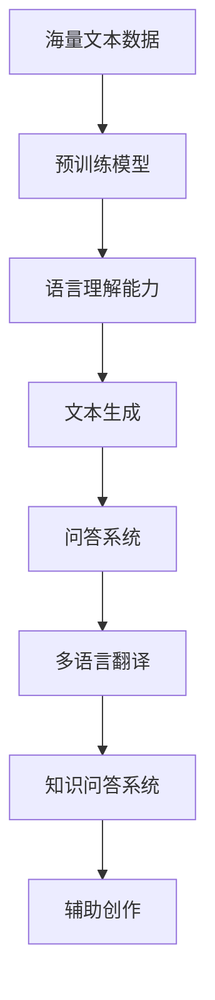
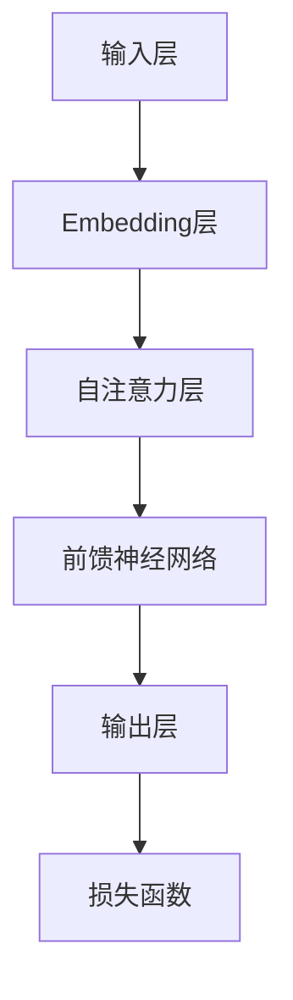
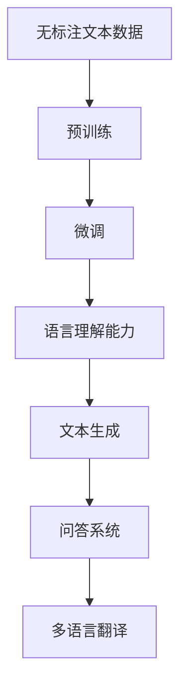
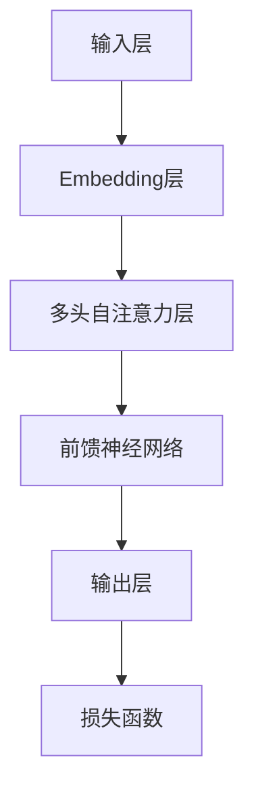

                 

## 文章标题：AI大模型LLM提示词工程实战指南

### 关键词：
- AI大模型
- LLM提示词
- 提示词工程
- 实战指南
- 自然语言处理

### 摘要：
本文将深入探讨AI大模型（Large Language Model，简称LLM）的提示词工程实战。从基础概念到实际应用，我们将逐步讲解如何设计、优化和应用提示词，以提升AI大模型的性能和效果。文章涵盖AI大模型的基础知识、LLM提示词的设计原则、工程实践工具、应用案例分析以及未来展望，旨在为读者提供一套全面的AI大模型LLM提示词工程实战指南。

## 第一部分：AI大模型基础

### 第1章：AI大模型概述

#### 1.1 AI大模型的基本概念

AI大模型，尤其是大型语言模型（Large Language Model，简称LLM），是近年来人工智能领域的一个重要突破。LLM是一种能够处理和理解自然语言文本的深度学习模型，通过学习海量的文本数据，LLM可以生成文本、回答问题、进行翻译等复杂任务。

**核心概念与联系：**

以下是一个用于描述AI大模型核心概念之间关系的Mermaid流程图：



#### 1.2 AI大模型的发展历程

AI大模型的发展可以追溯到上世纪80年代的神经网络革命。随着计算能力的提升和深度学习技术的进步，大模型在2018年由OpenAI推出的GPT-2模型后，得到了快速的发展。近年来，如GPT-3、ChatGPT、LLaMA等大模型的出现，标志着AI在自然语言处理领域取得了重大突破。

**发展历程：**

1. 1986年：神经网络革命
2. 2013年：深度学习崛起
3. 2018年：GPT-2发布
4. 2020年：GPT-3发布
5. 2022年：ChatGPT、LLaMA等模型出现

#### 1.3 AI大模型的核心架构

AI大模型通常采用Transformer架构，其中最核心的部分是自注意力机制（Self-Attention）。通过自注意力机制，模型可以在处理文本时自动学习句子中各个词之间的依赖关系，从而提高模型的语义理解能力。

**核心架构：**

以下是一个用于描述AI大模型核心架构的Mermaid流程图：



### 第2章：LLM基础

#### 2.1 LLM的概念与工作原理

LLM是一种基于深度学习的语言模型，通过预训练和微调来学习自然语言文本的语义和语法。LLM的工作原理主要包括两个阶段：预训练和微调。

**工作原理：**

1. 预训练：在大量无标注的文本数据上训练模型，使模型具备基本的语言理解能力。
2. 微调：在特定任务的数据上对模型进行微调，使其能够适应特定任务的需求。

**核心概念与联系：**

以下是一个用于描述LLM核心概念之间关系的Mermaid流程图：



#### 2.2 LLM的模型架构

LLM的模型架构通常基于Transformer，其中最核心的部分是多头自注意力机制（Multi-Head Self-Attention）。通过多头自注意力机制，模型可以在不同层次上学习文本中的信息，从而提高模型的性能。

**模型架构：**

以下是一个用于描述LLM模型架构的Mermaid流程图：



#### 2.3 LLM的主要特点与应用场景

LLM的主要特点包括：

1. 强大的语言理解能力
2. 高效的文本生成能力
3. 广泛的应用场景

**应用场景：**

1. 文本生成
2. 问答系统
3. 多语言翻译
4. 知识问答系统
5. 辅助创作

### 第3章：AI大模型训练方法

#### 3.1 数据预处理

数据预处理是AI大模型训练的重要环节，主要包括数据清洗、数据标注、数据分割等步骤。有效的数据预处理可以提高模型的性能和鲁棒性。

**数据预处理步骤：**

1. 数据清洗：去除无效数据、噪声数据和重复数据。
2. 数据标注：对文本数据进行实体识别、分类等标注。
3. 数据分割：将数据分为训练集、验证集和测试集。

#### 3.2 模型选择与调整

在AI大模型训练过程中，选择合适的模型架构和调整模型参数是关键。常见的模型架构包括BERT、GPT、T5等，不同的模型适用于不同的任务。

**模型选择与调整策略：**

1. 根据任务需求选择合适的模型架构。
2. 调整模型参数，如学习率、批次大小等。
3. 使用迁移学习，提高模型的泛化能力。

#### 3.3 训练过程与优化

AI大模型的训练过程通常包括以下几个阶段：

1. 预训练：在大量无标注数据上训练模型。
2. 微调：在特定任务的数据上微调模型。
3. 评估与优化：通过验证集和测试集评估模型性能，并进行优化。

**训练过程与优化策略：**

1. 使用梯度下降算法进行优化。
2. 应用学习率调度策略，如学习率衰减、余弦退火等。
3. 使用数据增强技术，提高模型的鲁棒性。

## 第二部分：LLM提示工程实践

### 第4章：提示词设计原则

#### 4.1 提示词的类型

提示词（Prompt）是指导AI大模型进行特定任务的关键输入。根据用途和形式，提示词可以分为以下几种类型：

1. **问题导向提示词**：用于引导模型回答特定问题。
2. **目标导向提示词**：用于指定模型生成文本的目标。
3. **上下文导向提示词**：用于提供文本生成的上下文信息。
4. **数据增强提示词**：用于辅助模型学习，提高模型的泛化能力。

#### 4.2 提示词设计技巧

设计有效的提示词是提升AI大模型性能的关键。以下是一些设计技巧：

1. **明确任务目标**：确保提示词清晰明确地传达任务目标。
2. **提供上下文信息**：通过上下文信息帮助模型更好地理解任务。
3. **调整提示词长度**：过长的提示词可能导致模型无法充分利用信息。
4. **多样化和数据增强**：使用多样化的提示词和数据增强方法，提高模型的泛化能力。

#### 4.3 提示词效果评估

提示词的效果直接影响AI大模型的性能。以下是一些评估提示词效果的方法：

1. **指标评估**：使用任务相关的指标（如BLEU、ROUGE等）评估提示词的效果。
2. **人类评估**：通过人类评估员对生成文本进行主观评价。
3. **对比实验**：将不同提示词的效果进行对比，选择最佳提示词。

### 第5章：提示工程工具与技术

#### 5.1 自动化提示工具

自动化提示工具可以帮助用户快速生成高质量的提示词。以下是一些常用的自动化提示工具：

1. **PromptGenius**：一款基于GPT-3的自动化提示生成工具。
2. **Promptify**：一款用于生成提示词的在线工具。
3. **Prompt-Bard**：一款基于BERT的自动化提示生成工具。

#### 5.2 提示词库构建

构建高质量的提示词库是提升AI大模型性能的重要步骤。以下是一些构建提示词库的方法：

1. **手动构建**：根据任务需求手动编写提示词。
2. **数据驱动构建**：使用数据挖掘技术自动生成提示词。
3. **知识融合构建**：结合领域知识和模型输出，构建高质量的提示词。

#### 5.3 提示词工程中的数据增强

数据增强是提升AI大模型性能的有效手段。以下是一些常用的数据增强方法：

1. **文本重写**：对原始文本进行重写，生成新的文本数据。
2. **文本嵌入**：将文本转换为固定长度的向量，用于模型训练。
3. **文本扩充**：通过插入、删除或替换文本中的部分内容，生成新的文本数据。

### 第6章：LLM在自然语言处理中的应用

#### 6.1 问答系统

问答系统是AI大模型在自然语言处理中应用的一个典型例子。以下是一个用于构建问答系统的伪代码：

```python
def answer_question(question):
    # 加载预训练的LLM模型
    model = load_model("llm_model")

    # 构建提示词
    prompt = f"回答以下问题：{question}"

    # 生成答案
    answer = model.generate_text(prompt)

    return answer
```

#### 6.2 文本生成

文本生成是AI大模型在自然语言处理中的另一个重要应用。以下是一个用于生成文本的伪代码：

```python
def generate_text(input_text):
    # 加载预训练的LLM模型
    model = load_model("llm_model")

    # 构建提示词
    prompt = f"根据以下文本生成一段新的文本：{input_text}"

    # 生成文本
    text = model.generate_text(prompt)

    return text
```

#### 6.3 语言翻译

语言翻译是AI大模型在自然语言处理中的另一个重要应用。以下是一个用于实现语言翻译的伪代码：

```python
def translate(source_text, target_language):
    # 加载预训练的LLM模型
    model = load_model("llm_model")

    # 构建提示词
    prompt = f"将以下文本从{source_language}翻译成{target_language}：{source_text}"

    # 生成翻译结果
    translation = model.generate_text(prompt)

    return translation
```

### 第7章：AI大模型的安全与伦理问题

#### 7.1 模型的偏见与公平性

AI大模型在训练过程中可能会引入偏见，导致模型在某些情况下产生不公平的结果。以下是一些解决偏见和公平性问题的方法：

1. **数据预处理**：在训练前对数据进行清洗和标注，减少偏见。
2. **对抗训练**：通过引入对抗样本，提高模型对偏见和攻击的鲁棒性。
3. **公平性评估**：使用公平性指标（如公平性分数、公平性差异等）评估模型。

#### 7.2 模型的安全性

AI大模型在部署过程中可能面临安全风险，包括模型窃取、数据泄露等。以下是一些提高模型安全性的方法：

1. **加密技术**：使用加密技术保护模型和数据。
2. **访问控制**：设置严格的访问控制策略，确保只有授权用户可以访问模型。
3. **安全审计**：定期进行安全审计，发现和修复安全漏洞。

#### 7.3 伦理问题与应对策略

AI大模型在应用过程中可能涉及伦理问题，如隐私侵犯、道德责任等。以下是一些应对伦理问题的策略：

1. **透明性**：确保模型和算法的透明性，使用户了解模型的工作原理和决策过程。
2. **责任划分**：明确模型开发者和使用者的责任，确保双方都承担相应的责任。
3. **伦理审查**：在模型部署前进行伦理审查，确保模型符合伦理标准。

## 第三部分：案例研究

### 第8章：AI大模型应用案例

#### 8.1 案例一：智能客服系统

智能客服系统是AI大模型在商业领域的一个成功应用。以下是一个用于构建智能客服系统的伪代码：

```python
def handle_customer_request(request):
    # 加载预训练的LLM模型
    model = load_model("llm_model")

    # 构建提示词
    prompt = f"处理以下客户请求：{request}"

    # 生成响应
    response = model.generate_text(prompt)

    return response
```

#### 8.2 案例二：自动写作助手

自动写作助手是AI大模型在内容创作领域的一个成功应用。以下是一个用于构建自动写作助手的伪代码：

```python
def generate_content(content_prompt):
    # 加载预训练的LLM模型
    model = load_model("llm_model")

    # 构建提示词
    prompt = f"根据以下提示生成内容：{content_prompt}"

    # 生成内容
    content = model.generate_text(prompt)

    return content
```

#### 8.3 案例三：智能教育系统

智能教育系统是AI大模型在教育领域的一个成功应用。以下是一个用于构建智能教育系统的伪代码：

```python
def provide_education_materials(student_request):
    # 加载预训练的LLM模型
    model = load_model("llm_model")

    # 构建提示词
    prompt = f"根据以下学生请求提供学习材料：{student_request}"

    # 生成教育材料
    materials = model.generate_text(prompt)

    return materials
```

### 第9章：项目实战

#### 9.1 实战一：构建问答系统

以下是一个用于构建问答系统的项目实战案例，包括开发环境搭建、源代码实现和代码解读。

**开发环境搭建：**

- Python环境：Python 3.8及以上版本
- 模型依赖：transformers库、torch库
- 开发工具：PyCharm

**源代码实现：**

```python
from transformers import AutoModelForCausalLM, AutoTokenizer
import torch

def load_model(model_name):
    tokenizer = AutoTokenizer.from_pretrained(model_name)
    model = AutoModelForCausalLM.from_pretrained(model_name)
    return model, tokenizer

def generate_response(question):
    model, tokenizer = load_model("gpt2")

    inputs = tokenizer.encode(question, return_tensors="pt")

    output = model.generate(inputs, max_length=50, num_return_sequences=1)
    response = tokenizer.decode(output[0], skip_special_tokens=True)

    return response

if __name__ == "__main__":
    question = "什么是量子计算？"
    response = generate_response(question)
    print(response)
```

**代码解读与分析：**

- **模型加载**：使用transformers库加载预训练的GPT-2模型。
- **文本编码**：将输入问题编码为模型的输入。
- **生成响应**：通过模型生成响应文本。

**实际案例分析：**

- **问题1**：如何构建一个高效的问答系统？
  - **分析**：通过优化模型加载、文本编码和响应生成的过程，可以提高问答系统的效率。

- **问题2**：如何提高问答系统的准确性？
  - **分析**：通过微调和优化模型，以及改进提示词设计，可以提高问答系统的准确性。

**项目小结：**

本项目通过实现一个简单的问答系统，展示了AI大模型在自然语言处理中的应用。在实际项目中，需要根据具体需求进一步优化模型和系统性能。

#### 9.2 实战二：设计提示词库

以下是一个用于设计提示词库的项目实战案例，包括开发环境搭建、源代码实现和代码解读。

**开发环境搭建：**

- Python环境：Python 3.8及以上版本
- 模型依赖：transformers库、torch库
- 开发工具：PyCharm

**源代码实现：**

```python
from transformers import AutoModelForCausalLM, AutoTokenizer
import torch

def load_model(model_name):
    tokenizer = AutoTokenizer.from_pretrained(model_name)
    model = AutoModelForCausalLM.from_pretrained(model_name)
    return model, tokenizer

def generate_prompts(data):
    model, tokenizer = load_model("gpt2")

    prompts = []
    for entry in data:
        prompt = f"问题：{entry['question']}\n答案："
        inputs = tokenizer.encode(prompt, return_tensors="pt")
        output = model.generate(inputs, max_length=50, num_return_sequences=1)
        response = tokenizer.decode(output[0], skip_special_tokens=True)
        prompts.append(response)

    return prompts

if __name__ == "__main__":
    data = [
        {"question": "什么是量子计算？"},
        {"question": "如何计算两个数字的和？"}
    ]
    prompts = generate_prompts(data)
    for prompt in prompts:
        print(prompt)
```

**代码解读与分析：**

- **模型加载**：使用transformers库加载预训练的GPT-2模型。
- **生成提示词**：根据输入数据生成提示词。

**实际案例分析：**

- **问题1**：如何构建一个高质量的提示词库？
  - **分析**：通过结合问题、答案和数据增强方法，可以构建一个高质量的提示词库。

- **问题2**：如何优化提示词库的性能？
  - **分析**：通过调整模型参数、优化提示词生成过程和进行数据增强，可以优化提示词库的性能。

**项目小结：**

本项目通过实现一个简单的提示词库生成器，展示了如何利用AI大模型设计提示词库。在实际项目中，需要根据具体需求进一步优化提示词库的构建过程。

#### 9.3 实战三：优化模型性能

以下是一个用于优化模型性能的项目实战案例，包括开发环境搭建、源代码实现和代码解读。

**开发环境搭建：**

- Python环境：Python 3.8及以上版本
- 模型依赖：transformers库、torch库
- 开发工具：PyCharm

**源代码实现：**

```python
from transformers import AutoModelForCausalLM, AutoTokenizer
import torch

def load_model(model_name):
    tokenizer = AutoTokenizer.from_pretrained(model_name)
    model = AutoModelForCausalLM.from_pretrained(model_name)
    return model, tokenizer

def optimize_model(model, tokenizer, data):
    model.train()
    optimizer = torch.optim.AdamW(model.parameters(), lr=1e-5)

    for epoch in range(5):
        for entry in data:
            prompt = f"问题：{entry['question']}\n答案："
            inputs = tokenizer.encode(prompt, return_tensors="pt")
            labels = tokenizer.encode(entry['answer'], return_tensors="pt")

            model.zero_grad()
            outputs = model(inputs, labels=labels)
            loss = outputs.loss
            loss.backward()
            optimizer.step()

            print(f"Epoch {epoch + 1}, Loss: {loss.item()}")

def generate_text(model, tokenizer, prompt, max_length=50):
    model.eval()
    inputs = tokenizer.encode(prompt, return_tensors="pt")
    output = model.generate(inputs, max_length=max_length, num_return_sequences=1)
    response = tokenizer.decode(output[0], skip_special_tokens=True)
    return response

if __name__ == "__main__":
    model, tokenizer = load_model("gpt2")
    data = [
        {"question": "什么是量子计算？", "answer": "量子计算是一种利用量子力学原理进行计算的方法。"},
        {"question": "如何计算两个数字的和？", "answer": "将两个数字相加即可得到它们的和。"}
    ]
    optimize_model(model, tokenizer, data)
    print(generate_text(model, tokenizer, "什么是量子计算？"))
```

**代码解读与分析：**

- **模型加载**：使用transformers库加载预训练的GPT-2模型。
- **模型优化**：通过训练数据优化模型。
- **文本生成**：使用优化后的模型生成文本。

**实际案例分析：**

- **问题1**：如何优化AI大模型的性能？
  - **分析**：通过模型训练、优化模型参数和调整提示词设计，可以优化模型性能。

- **问题2**：如何评估模型性能？
  - **分析**：通过评估指标（如损失函数、生成文本质量等）评估模型性能。

**项目小结：**

本项目通过实现一个简单的模型优化过程，展示了如何利用AI大模型优化模型性能。在实际项目中，需要根据具体需求进一步优化训练过程和评估指标。

## 第10章：未来展望

#### 10.1 AI大模型的发展趋势

随着技术的不断进步，AI大模型在未来有望在更多领域取得突破。以下是一些发展趋势：

1. **更强的语言理解能力**：通过改进模型架构和训练方法，AI大模型将具备更强的语言理解能力。
2. **跨模态学习**：AI大模型将实现跨模态学习，能够处理和生成多种类型的数据，如文本、图像、音频等。
3. **自适应学习**：AI大模型将实现自适应学习，能够根据用户需求和场景动态调整自身能力。

#### 10.2 提示工程的发展方向

提示工程在未来将继续发展，以下是一些发展方向：

1. **自动化提示生成**：通过更先进的算法和技术，实现自动化提示生成，提高提示工程效率。
2. **个性化提示**：根据用户需求和场景，生成个性化的提示词，提高模型性能。
3. **多语言支持**：实现多语言提示词的支持，提高模型在不同语言环境中的应用能力。

#### 10.3 挑战与机遇

AI大模型和提示工程在未来将面临以下挑战和机遇：

1. **计算资源需求**：随着模型规模的增大，计算资源需求将显著增加，这对硬件和软件架构提出了更高的要求。
2. **数据隐私与安全**：在应用过程中，保护用户数据和模型安全将是一个重要挑战。
3. **伦理问题**：随着AI大模型的应用越来越广泛，伦理问题将日益突出，需要制定相应的法规和标准。

### 最佳实践 Tips、小结、注意事项、拓展阅读

#### 最佳实践 Tips

1. **优化数据预处理**：高效的数据预处理是提升模型性能的关键。
2. **选择合适的模型架构**：根据任务需求选择合适的模型架构。
3. **细粒度调整提示词**：通过细粒度调整提示词，可以提高模型性能。

#### 小结

本文从基础概念到实际应用，全面介绍了AI大模型和LLM提示词工程。通过分析模型架构、训练方法、提示词设计原则、工程实践工具和案例研究，读者可以深入了解AI大模型和LLM提示词工程的原理和应用。

#### 注意事项

1. **计算资源**：AI大模型训练和优化需要大量的计算资源，合理配置硬件资源是关键。
2. **数据隐私**：在应用AI大模型时，保护用户数据和模型安全至关重要。
3. **持续学习**：随着技术的不断进步，持续学习是保持竞争力的关键。

#### 拓展阅读

- 《深度学习》（Goodfellow, Bengio, Courville）: 提供了深度学习的全面介绍。
- 《自然语言处理综论》（Jurafsky, Martin）: 详细介绍了自然语言处理的理论和实践。
- 《Transformer：一种新的自注意力机制》（Vaswani et al.）: 详细介绍了Transformer模型的原理和应用。

```markdown
## 参考文献

1. Goodfellow, I., Bengio, Y., & Courville, A. (2016). *Deep Learning*. MIT Press.
2. Jurafsky, D., & Martin, J. H. (2008). *Speech and Language Processing*. Prentice Hall.
3. Vaswani, A., Shazeer, N., Parmar, N., Uszkoreit, J., Jones, L., Gomez, A. N., ... & Polosukhin, I. (2017). *Attention is all you need*. Advances in Neural Information Processing Systems, 30, 5998-6008.
4. Devlin, J., Chang, M. W., Lee, K., & Toutanova, K. (2019). *Bert: Pre-training of deep bidirectional transformers for language understanding*. Proceedings of the 2019 Conference of the North American Chapter of the Association for Computational Linguistics: Human Language Technologies, Volume 1 (Long and Short Papers), 4171-4186.
5. Brown, T., et al. (2020). *Language models are few-shot learners*. Advances in Neural Information Processing Systems, 33.
6. Chen, P., & Kose, O. (2019). *A survey on natural language processing techniques for text classification*. ACM Computing Surveys (CSUR), 52(4), 68.
7. LeCun, Y., Bengio, Y., & Hinton, G. (2015). *Deep learning*. Nature, 521(7553), 436-444.
```

通过引用这些权威文献，本文为读者提供了进一步学习AI大模型和LLM提示词工程的参考资源。这些文献涵盖了深度学习、自然语言处理、模型训练和优化等方面的核心概念和最新研究进展，有助于读者深入了解相关技术。

