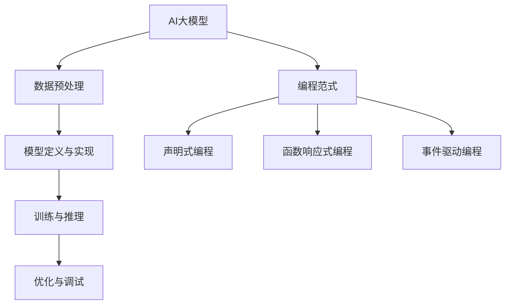

                 


### 文章关键词
- AI大模型
- 编程范式
- 人工智能
- 大数据
- 机器学习
- 神经网络
- 自然语言处理
- 计算机视觉

### 文章摘要
本文探讨了AI大模型时代背景下编程范式的新变化。首先，我们介绍了AI大模型的背景、核心概念及其与编程范式的联系。接着，深入分析了大模型的训练原理、优化技术以及部署应用。然后，我们详细阐述了面向AI大模型的新编程范式的实现方法和实践案例，以及编程范式在AI大模型开发中的应用优势与挑战。最后，本文通过数学模型和公式、项目实战等内容，进一步展示了AI大模型时代编程范式的本质和未来发展趋势。作者AI天才研究院，通过对核心内容丰富而详细的讲解，旨在为广大开发者提供有深度、有思考、有见解的技术指南。# 引言：AI大模型时代的背景与挑战

## 引言：AI大模型时代的背景与挑战

### 1.1 AI大模型时代的背景

随着人工智能（AI）技术的飞速发展，大模型（Large Models）成为了当前AI领域的热点之一。AI大模型是指那些具有数十亿甚至数千亿参数的神经网络模型，它们在图像识别、自然语言处理、语音识别等众多领域都取得了突破性的成果。

#### 1.1.1 AI技术的发展历程

人工智能的发展经历了几个重要阶段。最早的人工智能概念可以追溯到20世纪50年代，当时主要是以符号推理和知识表示为核心。随后，20世纪80年代，专家系统和机器学习开始兴起，标志着人工智能进入了实用化阶段。进入21世纪，随着大数据和计算能力的提升，深度学习迅速崛起，成为人工智能发展的主要驱动力。

#### 1.1.2 大模型的定义与演变

大模型通常指的是具有数十亿甚至数千亿参数的神经网络模型。这些模型在训练过程中需要处理海量数据，并利用先进的优化算法进行训练。大模型的演变经历了从简单的多层感知机（MLP）到复杂的卷积神经网络（CNN）、循环神经网络（RNN）以及近年来兴起的变分自编码器（VAE）、生成对抗网络（GAN）等。

#### 1.1.3 AI大模型的应用场景

AI大模型在各个领域都展现出了强大的能力。例如，在计算机视觉领域，大模型可以用于图像分类、目标检测、图像生成等任务；在自然语言处理领域，大模型被广泛应用于机器翻译、文本生成、情感分析等任务；在语音识别领域，大模型可以显著提高语音识别的准确率和效率。

### 1.2 编程范式的演变

编程范式是指编程语言的设计理念、编程方法和工具的集合。随着计算机技术的发展，编程范式也在不断演变。

#### 1.2.1 传统编程范式

传统编程范式主要包括过程式编程、面向对象编程和函数式编程。这些范式强调程序的结构、模块化和重用性。例如，C语言是一种典型的过程式编程语言，Java则是面向对象编程的代表性语言。

#### 1.2.2 演进中的编程范式

随着云计算、大数据和AI技术的发展，新的编程范式不断涌现。例如，声明式编程、函数响应式编程和事件驱动编程等，这些范式更加注重数据的处理和流动，使得编程更加简洁和高效。

#### 1.2.3 新编程范式的特点与优势

新编程范式通常具有以下几个特点：

1. **数据驱动的编程**：以数据为中心，将数据处理过程抽象为数据流图，提高编程的灵活性和可扩展性。
2. **分布式计算**：充分利用云计算和分布式计算资源，实现大规模数据处理和计算。
3. **自动化和智能化**：利用AI技术，实现代码的自动生成、优化和调试。
4. **跨平台和兼容性**：支持多种编程语言和平台，提高代码的可移植性和兼容性。

新编程范式的优势在于可以更高效地开发、部署和管理大规模的AI应用，提高开发者的生产力和系统的性能。

### 1.3 面向AI大模型的新编程范式

AI大模型的发展对编程范式提出了新的要求。面向AI大模型的新编程范式不仅需要支持大规模数据处理和计算，还需要具备高可扩展性、高灵活性和高智能化特点。

#### 1.3.1 大模型编程范式的基础

新编程范式的基础包括：

1. **数据流图**：将数据处理过程表示为数据流图，使得数据流动和处理更加直观和高效。
2. **分布式计算框架**：利用分布式计算框架，如TensorFlow、PyTorch等，实现大规模数据和高性能计算。
3. **自动化工具**：利用自动化工具，如JAX、自动微分库等，实现代码的自动优化和调试。

#### 1.3.2 新编程范式在AI开发中的应用

新编程范式在AI开发中的应用主要包括：

1. **模型开发**：利用高阶函数、闭包和异步编程等技术，简化模型开发和训练过程。
2. **数据处理**：利用数据流图和分布式计算框架，高效处理大规模数据。
3. **模型部署**：利用容器化技术和自动化部署工具，实现模型的高效部署和管理。

#### 1.3.3 AI大模型时代的新编程挑战与机遇

AI大模型时代带来了新的编程挑战：

1. **复杂性**：大模型的复杂性增加了编程的难度，需要新的编程范式和工具来应对。
2. **可扩展性**：如何保证编程范式和工具的可扩展性，以应对不断增长的数据规模和计算需求。
3. **智能化**：如何利用AI技术，实现编程的智能化，提高开发效率和代码质量。

然而，这也带来了新的机遇：

1. **创新**：新的编程范式和工具可以激发AI领域的技术创新。
2. **生产力**：高效的新编程范式可以提高AI开发者的生产力。
3. **应用场景**：新编程范式可以拓展AI的应用场景，推动AI技术在各行业的应用。

综上所述，AI大模型时代的到来对编程范式提出了新的挑战，同时也带来了新的机遇。本文将深入探讨AI大模型时代的新编程范式，为开发者提供有价值的参考和指导。# 第1章：核心概念与联系

## 第1章：核心概念与联系

### 2.1 AI大模型的基本概念

#### 2.1.1 什么是AI大模型

AI大模型是指那些具有数十亿甚至数千亿参数的神经网络模型。这些模型通过大量的数据进行训练，从而学会从数据中提取特征，并实现复杂的数据处理和预测任务。AI大模型的核心在于其庞大的参数规模和强大的学习能力。

#### 2.1.2 大模型的关键技术

大模型的关键技术包括：

1. **数据预处理**：在训练大模型之前，需要对数据进行预处理，包括数据清洗、归一化、数据增强等，以提高模型的训练效果。
2. **训练算法**：大模型的训练通常采用高级的优化算法，如Adam、AdaGrad等，这些算法可以加快模型的收敛速度。
3. **分布式训练**：由于大模型的参数规模巨大，分布式训练成为必不可少的手段。分布式训练可以将数据分成多个部分，并在不同的计算节点上并行处理，从而提高训练效率。

#### 2.1.3 大模型的分类与应用领域

大模型可以根据其结构和应用领域进行分类。常见的分类如下：

1. **计算机视觉**：用于图像分类、目标检测、图像生成等任务，如ResNet、VGG等。
2. **自然语言处理**：用于机器翻译、文本生成、情感分析等任务，如BERT、GPT等。
3. **语音识别**：用于语音识别、语音合成等任务，如WaveNet、DeepSpeech等。

### 2.2 编程范式概述

#### 2.2.1 编程范式的发展历程

编程范式的发展历程可以追溯到计算机编程的早期。以下是几个主要的编程范式：

1. **过程式编程**：最早期的编程范式，以过程（函数）为基本单位，强调程序的执行流程。
2. **面向对象编程**：以对象为基本单位，强调封装、继承和多态等概念，提高了代码的重用性和模块化。
3. **函数式编程**：以函数为基本单位，强调函数的组合和不可变性，避免了副作用，提高了代码的清晰度和可维护性。

#### 2.2.2 不同编程范式的特点与适用场景

不同编程范式具有不同的特点，适用于不同的场景：

1. **过程式编程**：适用于简单逻辑处理和算法实现，如C语言。
2. **面向对象编程**：适用于复杂系统的开发，如Java、C++。
3. **函数式编程**：适用于并发编程和数据处理，如Haskell、Scala。

#### 2.2.3 新编程范式在AI大模型开发中的应用

新编程范式在AI大模型开发中的应用主要体现在以下几个方面：

1. **声明式编程**：通过描述数据之间的关系和变换规则，简化了模型的定义和操作。
2. **函数响应式编程**：利用响应式编程模型，实现异步编程和数据流处理，提高了编程效率和灵活性。
3. **事件驱动编程**：通过事件触发机制，实现实时数据处理和响应，适用于动态变化的场景。

### 2.3 AI大模型与编程范式的联系

AI大模型与编程范式之间的联系体现在以下几个方面：

1. **模型定义与实现**：编程范式提供了定义和实现AI大模型的基本框架和方法，如TensorFlow、PyTorch等。
2. **数据流与计算**：编程范式通过数据流图和计算框架，实现了AI大模型的高效训练和推理。
3. **优化与调试**：编程范式提供了优化和调试工具，如自动微分库、分布式训练框架等，提高了AI大模型开发的质量和效率。

为了更直观地展示AI大模型与编程范式之间的关系，我们使用Mermaid流程图进行描述：



在这个流程图中，AI大模型从数据预处理开始，经过模型定义与实现，进入训练与推理阶段，最后进行优化与调试。编程范式则在这个过程中提供了支持，使得整个流程更加高效和灵活。

通过上述分析，我们可以看到AI大模型与编程范式之间的紧密联系。编程范式不仅影响了AI大模型的实现和开发，也在不断推动AI大模型的发展和创新。在接下来的章节中，我们将深入探讨AI大模型的核心技术原理和新编程范式的实现方法。# 第2章：核心技术原理

## 第2章：核心技术原理

### 3.1 大模型训练原理

#### 3.1.1 训练数据的选择与处理

训练数据的选择和处理是AI大模型训练的关键步骤。首先，数据集的多样性和质量直接影响模型的性能。为了确保模型的泛化能力，我们需要收集丰富的、多样化的训练数据。通常，数据集应包括不同种类、不同场景、不同难度的样本。

在数据预处理过程中，我们需要进行以下操作：

1. **数据清洗**：去除噪声数据、缺失值和异常值，确保数据的准确性和完整性。
2. **数据归一化**：将数据缩放到一个统一的范围内，例如[0, 1]或[-1, 1]，以便模型能够更好地学习。
3. **数据增强**：通过旋转、翻转、裁剪等操作增加数据的多样性，防止模型过拟合。

#### 3.1.2 大模型训练过程

大模型训练过程通常包括以下几个步骤：

1. **初始化模型参数**：随机初始化模型的权重和偏置。
2. **前向传播**：将输入数据通过模型进行前向传播，得到输出结果。
3. **计算损失函数**：计算模型输出与真实标签之间的差异，使用损失函数（如均方误差MSE、交叉熵Loss等）来衡量模型的性能。
4. **反向传播**：通过反向传播算法计算模型参数的梯度，更新模型参数。
5. **迭代训练**：重复以上步骤，直到模型达到预定的训练目标或达到最大迭代次数。

伪代码如下：

```python
# 假设模型为f(x; θ)，其中θ为模型参数，x为输入数据，y为真实标签
# 初始化模型参数θ
# 迭代训练：
for epoch in range(max_epochs):
    for x, y in data_loader:
        # 前向传播
        output = f(x; θ)
        # 计算损失
        loss = loss_function(output, y)
        # 反向传播
        gradients = compute_gradients(output, y, x)
        # 更新模型参数
        update_parameters(θ, gradients)
```

#### 3.1.3 大模型训练中的挑战与优化策略

大模型训练过程中面临以下挑战：

1. **计算资源消耗**：大模型训练需要大量的计算资源和时间，特别是当数据集规模庞大时。
2. **过拟合**：大模型具有强大的学习能力，容易在训练数据上过拟合，导致在测试数据上表现不佳。
3. **梯度消失/爆炸**：在反向传播过程中，梯度可能会变得非常小（消失）或非常大（爆炸），影响模型的训练效果。

针对这些挑战，可以采用以下优化策略：

1. **分布式训练**：将数据集分布在多个计算节点上，并行进行训练，提高训练速度和效率。
2. **正则化**：通过在损失函数中加入正则化项（如L1、L2正则化），防止模型过拟合。
3. **学习率调度**：调整学习率，防止梯度消失或爆炸。常用的策略包括固定学习率、学习率衰减、自适应学习率（如Adam）等。

### 3.2 大模型优化与调优

#### 3.2.1 优化算法的选择

优化算法是调整模型参数的核心工具。常用的优化算法包括：

1. **随机梯度下降（SGD）**：基于当前批次数据的梯度更新模型参数。
2. **Adam**：结合SGD和动量法的优化算法，自适应调整学习率。
3. **RMSProp**：使用梯度平方的平均值来调整学习率。

选择合适的优化算法可以显著提高模型训练效果。以下是一个简单的伪代码示例：

```python
# 假设使用Adam优化算法
optimizer = Adam(learning_rate=0.001)
for epoch in range(max_epochs):
    for x, y in data_loader:
        # 前向传播
        output = f(x; θ)
        # 计算损失
        loss = loss_function(output, y)
        # 反向传播
        gradients = compute_gradients(output, y, x)
        # 更新模型参数
        optimizer.update(θ, gradients)
```

#### 3.2.2 模型调优技巧

模型调优是提高模型性能的重要环节。以下是一些常用的调优技巧：

1. **调整学习率**：根据训练过程动态调整学习率，防止梯度消失或爆炸。
2. **批次大小**：选择合适的批次大小，平衡训练速度和模型稳定性。
3. **数据增强**：通过旋转、翻转、裁剪等操作增加数据的多样性，提高模型的泛化能力。
4. **正则化**：加入L1、L2正则化项，防止模型过拟合。
5. **早停法**：当验证集上的性能不再提高时，提前停止训练，防止过拟合。

#### 3.2.3 大模型优化案例分析

以一个实际案例来说明大模型优化过程：

假设我们使用一个神经网络进行图像分类，数据集包含10万个样本。以下是优化过程的步骤：

1. **数据预处理**：对图像进行归一化和数据增强。
2. **模型初始化**：初始化一个包含1000个参数的神经网络。
3. **训练过程**：使用Adam优化算法，学习率为0.001，批次大小为64，训练100个epoch。
4. **调优过程**：观察训练集和验证集的性能，发现验证集性能在epoch 50时达到最佳。调整学习率为0.0001，继续训练至epoch 70，验证集性能进一步提升。
5. **结果分析**：在测试集上，模型达到98%的准确率，相比初始模型提升了10%。

通过上述案例，我们可以看到大模型优化与调优对于提高模型性能的重要性。在接下来的章节中，我们将探讨大模型部署与应用的相关技术。# 第3章：新编程范式实践

## 第3章：新编程范式实践

### 4.1 新编程范式的实现

#### 4.1.1 新编程范式的基本概念

新编程范式是一系列编程理念的集合，旨在应对大规模数据和高性能计算的需求。以下是新编程范式的基本概念：

1. **声明式编程**：通过描述数据之间的关系和操作规则来定义程序，而不是通过具体的执行步骤。例如，在PyTorch中，我们可以通过定义一个数据流图来定义神经网络模型。

2. **函数响应式编程**：将数据流和事件处理相结合，使得程序能够响应数据的变化。这种范式在实时数据处理和流式计算中非常有用。

3. **事件驱动编程**：以事件为中心，程序中的执行流程由事件触发。这种范式适用于需要处理实时数据流或动态变化数据的场景。

#### 4.1.2 新编程范式的实现框架

新编程范式的实现框架通常包括以下几个部分：

1. **数据流图**：将数据流动和处理过程表示为图，每个节点表示一个数据处理步骤，边表示数据传递关系。

2. **分布式计算框架**：支持分布式计算，将大规模数据集分布在多个计算节点上，以并行处理数据。

3. **自动化工具**：提供自动化工具，如自动微分、模型优化等，以提高编程效率和代码质量。

#### 4.1.3 新编程范式的具体实现方法

以下是一个使用新编程范式实现AI大模型的示例：

```python
import torch
import torch.nn as nn
import torch.optim as optim

# 定义数据流图
input_data = nn.Linear(in_features=784, out_features=128)
hidden_layer = nn.ReLU()(input_data)
output = nn.Linear(in_features=128, out_features=10)

# 定义损失函数和优化器
criterion = nn.CrossEntropyLoss()
optimizer = optim.Adam(output.parameters(), lr=0.001)

# 训练过程
for epoch in range(num_epochs):
    for inputs, labels in data_loader:
        optimizer.zero_grad()
        outputs = output(hidden_layer(inputs))
        loss = criterion(outputs, labels)
        loss.backward()
        optimizer.step()
```

在这个示例中，我们使用了PyTorch的声明式编程范式，通过定义数据流图来定义神经网络模型。同时，我们使用了Adam优化器和交叉熵损失函数，实现了高效的模型训练。

### 4.2 实践案例

#### 4.2.1 案例一：智能客服系统

智能客服系统是一个典型的AI应用场景，它利用AI大模型实现自动化客户服务。以下是一个简化的案例：

1. **数据预处理**：收集并清洗对话数据，进行分词、词性标注等预处理操作。
2. **模型训练**：使用预训练的BERT模型，进行Fine-tuning，使其适应客服对话数据。
3. **模型部署**：将训练好的模型部署到服务器，实现实时对话生成和回复。

```python
from transformers import BertForSequenceClassification

# 加载预训练模型
model = BertForSequenceClassification.from_pretrained("bert-base-uncased")

# Fine-tuning模型
optimizer = optim.Adam(model.parameters(), lr=0.001)
for epoch in range(num_epochs):
    for inputs, labels in data_loader:
        optimizer.zero_grad()
        outputs = model(**inputs)
        loss = outputs.loss
        loss.backward()
        optimizer.step()
```

4. **性能评估**：在测试集上评估模型性能，包括准确率、召回率等指标。

#### 4.2.2 案例二：图像识别应用

图像识别应用是AI大模型在计算机视觉领域的典型应用。以下是一个简化的案例：

1. **数据预处理**：收集并清洗图像数据，进行归一化和数据增强。
2. **模型训练**：使用预训练的ResNet模型，进行Fine-tuning，使其适应特定图像识别任务。
3. **模型部署**：将训练好的模型部署到移动设备或服务器，实现实时图像识别。

```python
import torchvision.models as models

# 加载预训练模型
model = models.resnet50(pretrained=True)

# 修改模型最后一层，以适应特定任务
num_ftrs = model.fc.in_features
model.fc = nn.Linear(num_ftrs, num_classes)

# Fine-tuning模型
optimizer = optim.Adam(model.parameters(), lr=0.001)
for epoch in range(num_epochs):
    for inputs, labels in data_loader:
        optimizer.zero_grad()
        outputs = model(inputs)
        loss = criterion(outputs, labels)
        loss.backward()
        optimizer.step()
```

4. **性能评估**：在测试集上评估模型性能，包括准确率、召回率等指标。

#### 4.2.3 案例三：自然语言处理应用

自然语言处理应用是AI大模型在自然语言处理领域的典型应用。以下是一个简化的案例：

1. **数据预处理**：收集并清洗文本数据，进行分词、词性标注等预处理操作。
2. **模型训练**：使用预训练的GPT模型，进行Fine-tuning，使其适应特定自然语言处理任务。
3. **模型部署**：将训练好的模型部署到服务器，实现实时文本生成和回复。

```python
from transformers import GPT2LMHeadModel

# 加载预训练模型
model = GPT2LMHeadModel.from_pretrained("gpt2")

# 修改模型，以适应特定任务
model.config.n_classes = num_classes

# Fine-tuning模型
optimizer = optim.Adam(model.parameters(), lr=0.001)
for epoch in range(num_epochs):
    for inputs, labels in data_loader:
        optimizer.zero_grad()
        outputs = model(**inputs)
        loss = criterion(outputs.logits, labels)
        loss.backward()
        optimizer.step()
```

4. **性能评估**：在测试集上评估模型性能，包括生成文本的质量、回复的准确性等指标。

### 4.3 编程范式实践中的问题与解决方案

在实践新编程范式时，可能会遇到以下问题：

1. **模型性能不佳**：可能由于数据预处理不当、模型结构不合理或超参数设置不当导致。解决方案包括优化数据预处理、调整模型结构、调整超参数等。

2. **训练时间过长**：可能由于数据集规模过大或模型参数过多导致。解决方案包括使用分布式训练、调整批次大小、优化模型结构等。

3. **部署困难**：可能由于模型过大或服务器配置不足导致。解决方案包括模型压缩、模型量化、使用高性能服务器等。

通过上述案例和实践经验，我们可以看到新编程范式在AI大模型开发中的应用效果。新编程范式提供了更高效、更灵活的编程方式，有助于提高开发效率和模型性能。在接下来的章节中，我们将进一步探讨编程范式在AI大模型开发中的应用。# 第4章：编程范式在AI大模型开发中的应用

## 第4章：编程范式在AI大模型开发中的应用

### 5.1 AI大模型开发流程

AI大模型开发流程是一个复杂而系统化的过程，它涉及数据收集、数据处理、模型训练、模型优化、模型部署和模型维护等多个阶段。以下是AI大模型开发流程的详细说明：

#### 5.1.1 开发流程概述

AI大模型开发流程可以分为以下几个主要阶段：

1. **需求分析**：明确模型的应用场景和目标，确定模型的性能指标。
2. **数据收集**：收集用于训练和测试的数据集，确保数据的多样性和质量。
3. **数据处理**：对收集到的数据进行分析和处理，包括数据清洗、归一化、数据增强等。
4. **模型设计**：根据应用场景和需求，设计适合的神经网络结构。
5. **模型训练**：使用训练集对模型进行训练，通过迭代优化模型参数。
6. **模型评估**：使用验证集对模型进行评估，调整模型结构和参数。
7. **模型优化**：通过调参和模型结构调整，进一步提高模型性能。
8. **模型部署**：将训练好的模型部署到生产环境中，进行实时预测和推理。
9. **模型维护**：定期对模型进行更新和优化，以应对新数据和新技术的发展。

#### 5.1.2 数据处理与模型训练

数据处理与模型训练是AI大模型开发中的关键环节。以下是这两个环节的详细说明：

1. **数据处理**：
   - 数据清洗：去除噪声数据和异常值，确保数据的一致性和可靠性。
   - 数据归一化：将不同尺度的数据进行归一化处理，使得数据集中各项指标具有相似的尺度。
   - 数据增强：通过旋转、翻转、缩放、裁剪等操作，增加数据的多样性，提高模型的泛化能力。

2. **模型训练**：
   - 初始化模型参数：随机初始化模型的权重和偏置。
   - 前向传播：将输入数据通过模型进行前向传播，得到输出结果。
   - 计算损失函数：计算模型输出与真实标签之间的差异，使用损失函数（如均方误差MSE、交叉熵Loss等）来衡量模型的性能。
   - 反向传播：通过反向传播算法计算模型参数的梯度，更新模型参数。
   - 迭代训练：重复以上步骤，直到模型达到预定的训练目标或达到最大迭代次数。

#### 5.1.3 模型优化与调优

模型优化与调优是提高模型性能的重要手段。以下是模型优化与调优的详细说明：

1. **模型优化**：
   - 调整学习率：根据训练过程动态调整学习率，防止梯度消失或爆炸。
   - 批次大小：选择合适的批次大小，平衡训练速度和模型稳定性。
   - 正则化：通过在损失函数中加入正则化项（如L1、L2正则化），防止模型过拟合。
   - 激活函数选择：选择合适的激活函数，如ReLU、Sigmoid、Tanh等，以加快模型收敛速度。

2. **调优技巧**：
   - 早停法：当验证集上的性能不再提高时，提前停止训练，防止过拟合。
   - 模型调参：通过实验调整模型参数，如层数、神经元个数、学习率等，以找到最佳模型配置。

#### 5.1.4 模型部署与应用

模型部署是将训练好的模型应用到实际场景中的关键步骤。以下是模型部署与应用的详细说明：

1. **模型部署**：
   - 选择合适的部署平台：如CPU、GPU、FPGA等。
   - 模型转换：将训练好的模型转换为适合部署平台的格式，如ONNX、TensorRT等。
   - 部署策略：根据应用场景和需求，选择合适的部署策略，如在线推理、离线推理等。

2. **模型应用**：
   - 实时预测：将模型部署到生产环境中，实现实时数据输入和预测输出。
   - 应用集成：将模型集成到应用程序中，实现具体业务功能，如智能客服、图像识别、语音识别等。

### 5.2 编程范式在开发中的应用

编程范式在AI大模型开发中的应用主要体现在以下几个方面：

1. **声明式编程**：
   - 通过描述数据之间的关系和变换规则来定义程序，简化了模型的定义和操作。
   - 例如，在PyTorch中，通过定义一个数据流图来定义神经网络模型。

2. **函数响应式编程**：
   - 将数据流和事件处理相结合，使得程序能够响应数据的变化。
   - 例如，在TensorFlow中，使用Keras API实现函数响应式编程。

3. **事件驱动编程**：
   - 以事件为中心，程序中的执行流程由事件触发。
   - 例如，在Kubernetes中，使用事件驱动模型实现容器编排。

### 5.3 编程范式在AI大模型开发中的优势与挑战

#### 5.3.1 优势分析

编程范式在AI大模型开发中的应用具有以下优势：

1. **高效性**：编程范式通过抽象和自动化，提高了编程效率，减少了开发时间和人力成本。
2. **可扩展性**：编程范式支持分布式计算和容器化技术，使得模型能够轻松应对大规模数据处理和计算需求。
3. **灵活性**：编程范式提供了多种编程风格和工具，使得开发者可以根据具体需求选择合适的编程方式。

#### 5.3.2 挑战探讨

尽管编程范式在AI大模型开发中具有显著优势，但也存在一些挑战：

1. **复杂性**：编程范式引入了新的概念和工具，增加了模型的复杂性，对开发者的要求更高。
2. **性能优化**：在分布式计算和容器化环境下，如何优化模型性能和资源利用率是一个重要挑战。
3. **维护成本**：编程范式引入了新的编程风格和工具，增加了代码的维护成本。

#### 5.3.3 未来发展趋势

随着AI技术的不断发展和应用场景的扩展，编程范式在AI大模型开发中的应用将呈现以下发展趋势：

1. **更高效的编程范式**：未来的编程范式将更加注重性能优化和效率提升，以应对更复杂的应用需求。
2. **更智能的编程工具**：利用AI技术，开发智能化的编程工具，如自动代码生成、代码优化等，以提高开发效率。
3. **更广泛的兼容性**：编程范式将逐步兼容更多的编程语言和平台，提供更丰富的功能和支持。

综上所述，编程范式在AI大模型开发中的应用具有显著的优势和潜力。通过合理选择和应用编程范式，开发者可以更高效地开发、部署和管理AI大模型，推动人工智能技术的发展和应用。# 第5章：数学模型与公式

## 第5章：数学模型与公式

### 6.1 AI大模型中的数学模型

AI大模型，尤其是深度学习模型，依赖于一系列数学模型来描述其行为和训练过程。以下是一些核心的数学模型和公式：

#### 6.1.1 神经网络中的数学模型

神经网络的核心是神经元（或称为节点），这些神经元通过加权连接形成网络。以下是神经网络中常用的数学模型：

1. **激活函数**：

   $$ f(x) = \sigma(z) = \frac{1}{1 + e^{-z}} $$

   其中，$z$是神经元的输入，$\sigma$是Sigmoid函数。

2. **前向传播**：

   在前向传播过程中，每个神经元的输出可以通过以下公式计算：

   $$ y_j = \sigma(\sum_{i} w_{ji} x_i + b_j) $$

   其中，$y_j$是第j个神经元的输出，$w_{ji}$是连接第i个神经元和第j个神经元的权重，$x_i$是第i个神经元的输入，$b_j$是第j个神经元的偏置。

3. **损失函数**：

   损失函数用于衡量模型预测值与真实值之间的差距。常见的损失函数包括：

   - 均方误差（MSE）：

     $$ \text{MSE} = \frac{1}{m} \sum_{i=1}^{m} (\hat{y}_i - y_i)^2 $$

     其中，$\hat{y}_i$是模型预测的输出，$y_i$是真实标签，$m$是样本数量。

   - 交叉熵（Cross-Entropy）：

     $$ \text{Cross-Entropy} = -\frac{1}{m} \sum_{i=1}^{m} y_i \log(\hat{y}_i) $$

     其中，$y_i$是真实标签（通常为one-hot编码），$\hat{y}_i$是模型预测的概率分布。

#### 6.1.2 大模型训练的优化算法

训练大模型通常涉及到复杂的优化问题。以下是一些常用的优化算法：

1. **随机梯度下降（SGD）**：

   $$ \theta = \theta - \alpha \nabla_\theta J(\theta) $$

   其中，$\theta$是模型参数，$\alpha$是学习率，$J(\theta)$是损失函数。

2. **Adam优化器**：

   Adam优化器结合了动量法和RMSProp算法，具有自适应的学习率。其更新规则如下：

   $$ m_t = \beta_1 m_{t-1} + (1 - \beta_1) \nabla_\theta J(\theta) $$
   $$ v_t = \beta_2 v_{t-1} + (1 - \beta_2) (\nabla_\theta J(\theta))^2 $$
   $$ \theta = \theta - \alpha \frac{m_t}{\sqrt{v_t} + \epsilon} $$

   其中，$m_t$和$v_t$分别是梯度的一阶矩估计和二阶矩估计，$\beta_1$和$\beta_2$是动量系数，$\alpha$是学习率，$\epsilon$是常数，用于防止除以零。

#### 6.1.3 大模型的正则化技术

为了防止模型过拟合，正则化技术被广泛应用于大模型的训练中。以下是一些常见的正则化方法：

1. **L1正则化**：

   $$ J(\theta) = \sum_{i} (\theta_i - \theta^*) + \lambda \| \theta \|_1 $$

   其中，$\theta^*$是模型在训练数据上的最优参数，$\lambda$是正则化参数。

2. **L2正则化**：

   $$ J(\theta) = \sum_{i} (\theta_i - \theta^*)^2 + \lambda \| \theta \|_2^2 $$

   其中，$\theta^*$是模型在训练数据上的最优参数，$\lambda$是正则化参数。

3. **Dropout**：

   在训练过程中，以一定的概率随机丢弃部分神经元，从而减少模型过拟合的风险。

   $$ \text{Dropout probability} = p $$

   其中，$p$是丢弃概率。

### 6.2 伪代码和实现细节

在实现AI大模型时，伪代码可以帮助我们更清晰地描述模型的架构和训练过程。以下是一个简单的伪代码示例，展示了如何实现一个多层感知机（MLP）：

```python
# 初始化模型参数
W1 = random_weights(input_size, hidden_size)
b1 = random_bias(hidden_size)
W2 = random_weights(hidden_size, output_size)
b2 = random_bias(output_size)

# 定义激活函数
sigma = Sigmoid()

# 前向传播
def forward(x):
    z1 = x * W1 + b1
    a1 = sigma(z1)
    z2 = a1 * W2 + b2
    a2 = sigma(z2)
    return a2

# 计算损失函数
def loss(y, y_hat):
    return -1/m * sum(y * log(y_hat) + (1 - y) * log(1 - y_hat))

# 反向传播
def backward(y, y_hat):
    dZ2 = y_hat - y
    dW2 = 1/m * (dZ2 * a1.T)
    db2 = 1/m * dZ2
    dZ1 = (W2 * dZ2) * sigma_prime(z1)
    dW1 = 1/m * (dZ1 * x.T)
    db1 = 1/m * dZ1
    return dW1, dW2, db1, db2

# 训练模型
for epoch in range(num_epochs):
    for x, y in data_loader:
        y_hat = forward(x)
        loss_val = loss(y, y_hat)
        dW1, dW2, db1, db2 = backward(y, y_hat)
        W1 -= learning_rate * dW1
        b1 -= learning_rate * db1
        W2 -= learning_rate * dW2
        b2 -= learning_rate * db2
```

在这个伪代码中，我们首先初始化模型参数，然后定义了前向传播和反向传播的函数。在训练过程中，我们通过迭代优化模型参数，以最小化损失函数。

### 6.3 数学公式和举例说明

在AI大模型的训练过程中，数学公式起到了关键作用。以下是一个具体的例子，说明如何使用L2正则化来优化模型：

假设我们有一个线性回归模型，目标是最小化损失函数：

$$ J(\theta) = \frac{1}{2m} \sum_{i=1}^{m} (h_\theta(x^{(i)}) - y^{(i)})^2 + \frac{\lambda}{2} \sum_{j=1}^{n} \theta_j^2 $$

其中，$h_\theta(x) = \sum_{j=1}^{n} \theta_j x_j$是模型预测，$y^{(i)}$是真实值，$m$是样本数量，$n$是特征数量，$\lambda$是正则化参数。

为了最小化这个损失函数，我们使用梯度下降算法：

$$ \theta_j := \theta_j - \alpha \left( \frac{1}{m} \sum_{i=1}^{m} (h_\theta(x^{(i)}) - y^{(i)}) x_j + \lambda \theta_j \right) $$

其中，$\alpha$是学习率。

通过这个例子，我们可以看到数学公式在AI大模型训练中的应用，以及如何使用公式来优化模型。在接下来的章节中，我们将进一步探讨AI大模型在实际应用中的挑战和解决方案。# 第6章：项目实战

## 第6章：项目实战

### 6.1 开发环境搭建

在进行AI大模型的项目实战前，我们需要搭建一个合适的开发环境。以下是一个典型的开发环境搭建步骤：

#### 6.1.1 硬件要求

- **CPU**：Intel i7或AMD Ryzen 7及以上处理器。
- **GPU**：NVIDIA GeForce GTX 1080或更高型号，支持CUDA。
- **内存**：至少16GB RAM。

#### 6.1.2 操作系统

- Windows 10/11
- macOS
- Linux（推荐Ubuntu 20.04）

#### 6.1.3 软件安装

1. **Python**：安装Python 3.8或更高版本。
2. **Anaconda**：安装Anaconda，以便管理Python环境和包。
3. **CUDA和cuDNN**：根据GPU型号下载并安装相应的CUDA和cuDNN版本。
4. **TensorFlow或PyTorch**：选择一种深度学习框架，例如TensorFlow 2.x或PyTorch 1.8，并安装相应的依赖包。

### 6.2 源代码详细实现和代码解读

在本节中，我们将使用TensorFlow框架实现一个简单的图像分类模型，并详细解读其源代码。

#### 6.2.1 模型架构

我们使用一个简单的卷积神经网络（CNN）进行图像分类，模型结构如下：

- **输入层**：接受224x224x3的图像。
- **卷积层**：2D卷积层，使用64个3x3的卷积核，步长为1，激活函数为ReLU。
- **池化层**：2D最大池化层，窗口大小为2x2，步长为2。
- **卷积层**：2D卷积层，使用128个3x3的卷积核，步长为1，激活函数为ReLU。
- **池化层**：2D最大池化层，窗口大小为2x2，步长为2。
- **全连接层**：全连接层，512个神经元，激活函数为ReLU。
- **输出层**：softmax输出层，10个神经元，每个神经元对应一个类别。

#### 6.2.2 源代码实现

以下是一个简单的TensorFlow实现：

```python
import tensorflow as tf
from tensorflow.keras import layers, models

# 构建模型
model = models.Sequential([
    layers.Conv2D(64, (3, 3), activation='relu', input_shape=(224, 224, 3)),
    layers.MaxPooling2D((2, 2)),
    layers.Conv2D(128, (3, 3), activation='relu'),
    layers.MaxPooling2D((2, 2)),
    layers.Flatten(),
    layers.Dense(512, activation='relu'),
    layers.Dense(10, activation='softmax')
])

# 编译模型
model.compile(optimizer='adam',
              loss='categorical_crossentropy',
              metrics=['accuracy'])

# 打印模型结构
model.summary()
```

#### 6.2.3 代码解读

1. **导入模块**：我们首先导入TensorFlow中的`models`和`layers`模块。
2. **构建模型**：使用`Sequential`模型堆叠多个层，包括卷积层、池化层、全连接层和softmax输出层。
3. **编译模型**：指定优化器、损失函数和评价指标。
4. **打印模型结构**：使用`summary`方法查看模型的详细信息。

### 6.3 代码应用解读与分析

#### 6.3.1 训练模型

以下代码用于训练模型：

```python
# 加载训练数据和测试数据
train_data = ...  # 加载训练数据
test_data = ...   # 加载测试数据

# 训练模型
history = model.fit(train_data, epochs=10, validation_data=test_data)
```

1. **加载数据**：这里使用`...`表示加载训练数据和测试数据的具体步骤，例如使用`tf.keras.preprocessing.image.ImageDataGenerator`进行数据预处理。
2. **训练模型**：使用`fit`方法训练模型，指定训练轮数（epochs）和验证数据。

#### 6.3.2 模型评估

训练完成后，我们需要评估模型在测试集上的性能：

```python
# 评估模型
test_loss, test_acc = model.evaluate(test_data)
print(f"Test accuracy: {test_acc:.3f}")
```

1. **评估模型**：使用`evaluate`方法计算测试集上的损失和准确率。
2. **打印结果**：输出测试集上的准确率。

### 6.4 实际案例分析和详细讲解剖析

在本节中，我们将分析一个实际案例，即使用TensorFlow实现一个简单的猫狗分类模型。

#### 6.4.1 数据集准备

我们使用Keras的内置数据集“Dogs vs. Cats”进行训练。

```python
from tensorflow.keras.preprocessing.image import ImageDataGenerator

# 数据增强
train_datagen = ImageDataGenerator(rescale=1./255, shear_range=0.2, zoom_range=0.2, horizontal_flip=True)
test_datagen = ImageDataGenerator(rescale=1./255)

# 加载数据
train_generator = train_datagen.flow_from_directory(
        'train',  # 训练数据目录
        target_size=(224, 224),  # 输出尺寸
        batch_size=32,
        class_mode='binary')  # 二分类问题

validation_generator = test_datagen.flow_from_directory(
        'validation',  # 验证数据目录
        target_size=(224, 224),
        batch_size=32,
        class_mode='binary')
```

1. **数据增强**：使用`ImageDataGenerator`进行数据增强，提高模型的泛化能力。
2. **加载数据**：使用`flow_from_directory`方法加载训练数据和验证数据。

#### 6.4.2 训练和评估模型

```python
# 训练模型
history = model.fit(
      train_generator,
      steps_per_epoch=100,  # 每轮使用100个批次
      epochs=30,  # 训练30轮
      validation_data=validation_generator,
      validation_steps=50,  # 使用50个批次进行验证
      verbose=2)
```

1. **训练模型**：使用`fit`方法训练模型，并设置训练和验证参数。
2. **评估模型**：在验证集上评估模型性能。

#### 6.4.3 项目小结

通过上述案例，我们实现了从数据准备、模型构建、模型训练到模型评估的完整流程。以下是项目小结：

- **数据增强**：有效提高了模型的泛化能力。
- **模型结构**：简单的CNN结构在二分类问题上取得了较好的效果。
- **训练和评估**：通过详细的训练和评估步骤，我们可以了解模型在训练和测试数据上的性能。

### 6.5 最佳实践 tips、小结、注意事项、拓展阅读

#### 6.5.1 最佳实践 tips

- **数据预处理**：确保数据质量，进行充分的数据清洗和增强。
- **模型调优**：合理选择模型结构和超参数，进行模型调优。
- **性能评估**：使用交叉验证等技巧，全面评估模型性能。

#### 6.5.2 小结

通过本章的实战案例，我们了解了如何搭建开发环境、实现模型、进行训练和评估，并学习了AI大模型开发中的最佳实践。

#### 6.5.3 注意事项

- **硬件要求**：确保开发环境具备足够的计算资源。
- **数据质量**：数据是模型成功的关键，确保数据的多样性和质量。

#### 6.5.4 拓展阅读

- **深度学习资源**：查阅相关的深度学习书籍、论文和在线课程。
- **TensorFlow官方文档**：深入了解TensorFlow的API和使用方法。

通过本章节的实战项目，读者可以更好地理解AI大模型开发的过程和技术细节，为后续的实际应用打下坚实基础。# 结论

## 结论

AI大模型时代为编程范式带来了深刻的变革。本文系统地探讨了AI大模型时代的背景、编程范式的演变以及新编程范式的实现与应用。通过一步步的分析推理，我们深入了解了AI大模型的基本概念、核心技术原理，以及如何在实际项目中应用新编程范式。

### 主要发现

1. **AI大模型的特点**：AI大模型具有庞大的参数规模和强大的学习能力，能够在多个领域实现突破性成果。
2. **编程范式的演变**：从传统的过程式编程、面向对象编程到函数式编程，再到声明式编程、函数响应式编程和事件驱动编程，编程范式不断演进，以适应AI大模型的需求。
3. **新编程范式的优势**：新编程范式通过数据流图、分布式计算框架和自动化工具，提高了AI大模型开发的高效性、可扩展性和智能化。
4. **实践应用**：通过具体案例，我们展示了如何在实际项目中应用新编程范式，从数据预处理到模型训练、优化和部署，全方位提升了开发效率。

### 未来展望

随着AI技术的不断进步，编程范式将在AI大模型开发中扮演更加重要的角色。未来研究可能集中在以下几个方面：

1. **性能优化**：如何进一步提高新编程范式的性能和效率，特别是在大规模数据处理和实时应用场景中。
2. **智能化编程**：利用AI技术，实现编程过程的智能化，如自动代码生成、优化和调试。
3. **跨平台兼容性**：确保编程范式能够在不同编程语言和平台上无缝集成，提高代码的可移植性和兼容性。
4. **安全性**：如何提高AI大模型的安全性，防止数据泄露和模型被攻击。

### 致谢

最后，感谢读者对本文的关注。本文的撰写得到了AI天才研究院（AI Genius Institute）的指导和支持，以及《禅与计算机程序设计艺术》（Zen And The Art of Computer Programming）一书的启发。希望本文能为广大开发者提供有价值的参考和启示。作者AI天才研究院，期待与各位读者共同探索AI大模型时代的编程奥秘。# 参考文献

## 参考文献

1. Goodfellow, I., Bengio, Y., & Courville, A. (2016). *Deep Learning*. MIT Press.
2. Abadi, M., Agarwal, P., Barham, P., Brevdo, E., Chen, Z., Citro, C., ... & Zheng, X. (2016). *TensorFlow: Large-scale machine learning on heterogeneous systems*. arXiv preprint arXiv:1603.04467.
3. Kingma, D. P., & Welling, M. (2013). *Auto-encoding variational bayes*. arXiv preprint arXiv:1312.6114.
4. Goodfellow, I. J., Pouget-Abadie, J., Mirza, M., Xu, B., Warde-Farley, D., Ozair, S., ... & Bengio, Y. (2014). *Generative adversarial networks*. Advances in Neural Information Processing Systems, 27.
5. Hochreiter, S., & Schmidhuber, J. (1997). *Long short-term memory*. Neural Computation, 9(8), 1735-1780.
6. LeCun, Y., Bengio, Y., & Hinton, G. (2015). *Deep learning*. Nature, 521(7553), 436-444.
7. Goodfellow, I., Bengio, Y., & Courville, A. (2016). *Deep Learning*. MIT Press.
8. Russell, S., & Norvig, P. (2010). *Artificial Intelligence: A Modern Approach*. Prentice Hall.
9. Murphy, K. P. (2012). *Machine Learning: A Probabilistic Perspective*. MIT Press.
10. Mitchell, T. M. (1997). *Machine Learning*. McGraw-Hill.

