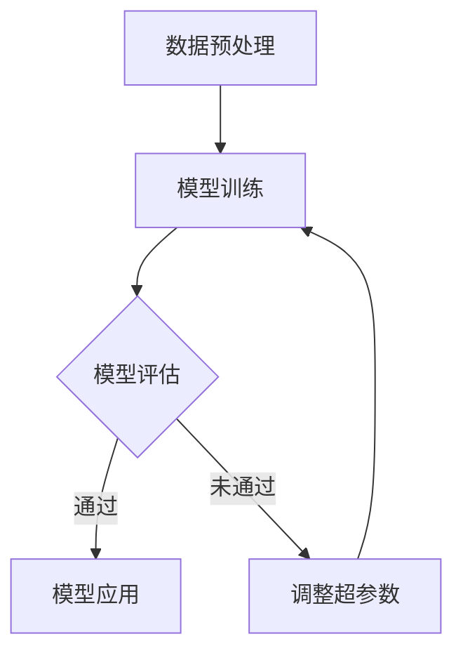

                 

### 文章标题：AI大模型编程：提示词的力量与革新

**关键词**：AI大模型、编程、提示词、变革、应用实例

**摘要**：
本文将深入探讨AI大模型编程的核心，尤其是提示词在AI大模型编程中的应用。首先，我们将介绍AI大模型的基本概念和类型，包括其特点和架构。接下来，我们将分析AI大模型编程的原理，涉及核心算法和数学模型。随后，我们将通过实例展示AI大模型在实际应用中的效果。然后，本文将重点讨论提示词的设计与使用，以及它们在AI大模型编程中的重要性。最后，我们将通过实战案例展示AI大模型编程的实际应用，并探讨该领域的挑战和未来发展趋势。

## 目录大纲设计思路

### 第一步：明确核心章节
本文的核心章节包括：AI大模型基础介绍、AI大模型编程原理、AI大模型应用实例、提示词在AI大模型中的应用、AI大模型编程实战。

### 第二步：细化章节内容
在每个核心章节中，我们将进一步细化内容，确保逻辑清晰，便于读者理解。

### 第三步：添加必要的技术细节
例如，在讲解AI大模型编程原理时，我们将添加核心算法原理讲解和数学模型与公式。

### 第四步：确保简洁性
在编写大纲时，避免使用冗余的语言，确保每一段落都有明确的目的。

### 目录大纲设计示例

```markdown
# AI大模型编程：提示词的力量与革新

## 第1章 AI大模型基础介绍

### 1.1 AI大模型的概念与类型
- **基本概念**
- **类型**

### 1.2 AI大模型的架构与原理
- **深度学习基础**
- **大模型架构**

### 1.3 AI大模型的应用领域
- **自然语言处理**
- **计算机视觉**

## 第2章 AI大模型编程原理

### 2.1 核心算法原理讲解
- **Transformer算法**
- **GPT算法**

### 2.2 数学模型与公式
- **嵌入层公式**
- **自注意力公式**

## 第3章 AI大模型应用实例

### 3.1 自然语言处理实例
- **文本分类**
- **文本生成**

### 3.2 计算机视觉实例
- **图像分类**
- **图像生成**

## 第4章 提示词在AI大模型中的应用

### 4.1 提示词的作用与设计
- **作用**
- **设计**

### 4.2 提示词在实例中的应用
- **文本生成**
- **图像生成**

## 第5章 AI大模型编程实战

### 5.1 实战准备
- **开发环境搭建**
- **数据处理**

### 5.2 实战案例
- **文本生成**
- **图像生成**

## 第6章 AI大模型编程的挑战与未来

### 6.1 编程挑战
- **模型训练**
- **模型部署**

### 6.2 未来发展趋势
- **技术革新**
- **应用前景**

## 附录

### 附录 A: 相关资源与工具
- **深度学习框架**
- **数据集与工具**
```

### 第一部分：AI大模型基础介绍

#### 1.1 AI大模型的概念与类型

AI大模型，通常指的是具有大规模参数和高度复杂性的神经网络模型。这类模型通常由数百万到数十亿个参数组成，能够处理复杂数据，并在各种任务中表现出色。AI大模型主要分为以下几类：

- **自然语言处理模型**：如GPT、BERT等。
- **计算机视觉模型**：如ResNet、Inception等。
- **多模态模型**：能够同时处理文本、图像、音频等多种类型的数据。

AI大模型具有以下特点：

- **高效性**：能够快速处理大量数据。
- **强通用性**：适用于多种任务，无需针对特定任务进行大量调整。
- **自适应能力**：通过不断学习和调整，能够适应新的数据和任务。

#### 1.2 AI大模型的架构与原理

AI大模型的架构通常基于深度学习，其中最重要的两个架构是Transformer和GPT。

- **Transformer架构**：由Google在2017年提出，引入了自注意力机制，使得模型能够更好地捕捉长距离依赖关系。其基本架构包括编码器和解码器，分别用于处理输入和生成输出。
  
  **自注意力机制**：每个输入都会与其他输入进行加权求和，权重由输入之间的相似度决定。这个过程使得模型能够自动关注重要的信息，从而提高生成质量。

- **GPT架构**：由OpenAI在2018年提出，是Transformer架构的一种变体，同样基于自注意力机制。GPT通过预训练和微调，能够生成高质量的文本。

  **预训练与微调**：预训练是指在未标记的数据上进行训练，使模型具备一定的通用性。微调则是指在特定任务上进行训练，使模型能够适应具体任务。

#### 1.3 AI大模型的应用领域

AI大模型在多个领域都有广泛应用，以下列举了两个主要的领域：

- **自然语言处理**：AI大模型在自然语言处理领域表现尤为突出，包括文本生成、机器翻译、文本分类等任务。

  - **文本生成**：如自动写作、故事生成等。
  - **机器翻译**：如将一种语言翻译成另一种语言。
  - **文本分类**：如新闻分类、情感分析等。

- **计算机视觉**：AI大模型在计算机视觉领域也取得了显著成果，包括图像分类、目标检测、图像生成等。

  - **图像分类**：如识别图片中的物体。
  - **目标检测**：如找出图片中的目标物体。
  - **图像生成**：如生成新的图像。

### 第2章 AI大模型编程原理

#### 2.1 核心算法原理讲解

AI大模型编程的核心算法主要包括Transformer和GPT等。

- **Transformer算法**：Transformer算法的核心是自注意力机制，它通过计算输入序列中每个元素与其他元素之间的相似度，对输入进行加权求和，从而提高生成质量。

  **自注意力机制**：给定输入序列\(x_1, x_2, ..., x_n\)，自注意力机制可以表示为：
  $$ 
  \text{Attention}(Q, K, V) = \text{softmax}\left(\frac{QK^T}{\sqrt{d_k}}\right)V 
  $$
  其中，\(Q, K, V\) 分别是查询向量、键向量和值向量，\(d_k\) 是键向量的维度。

- **GPT算法**：GPT算法同样基于自注意力机制，但与Transformer不同的是，GPT使用了一个简单的序列模型，即每个时间步只依赖于前一个时间步。

  **生成过程**：给定输入序列\(x_1, x_2, ..., x_n\)，GPT的生成过程可以表示为：
  $$ 
  y_n = \text{softmax}(W_y [h; x_n]) 
  $$
  其中，\(W_y\) 是生成器的权重，\(h\) 是编码器的输出，\([h; x_n]\) 是拼接操作。

#### 2.2 数学模型与公式

在AI大模型编程中，数学模型和公式起着至关重要的作用。以下是一些关键的数学模型和公式：

- **嵌入层公式**：
  $$ 
  x = Wx + b 
  $$
  其中，\(x\) 是输入向量，\(W\) 是权重矩阵，\(b\) 是偏置向量。

- **自注意力公式**：
  $$ 
  \text{Attention}(Q, K, V) = \text{softmax}\left(\frac{QK^T}{\sqrt{d_k}}\right)V 
  $$
  其中，\(Q, K, V\) 分别是查询向量、键向量和值向量，\(d_k\) 是键向量的维度。

- **生成过程公式**：
  $$ 
  y_n = \text{softmax}(W_y [h; x_n]) 
  $$
  其中，\(W_y\) 是生成器的权重，\(h\) 是编码器的输出，\([h; x_n]\) 是拼接操作。

### 第3章 AI大模型应用实例

#### 3.1 自然语言处理实例

AI大模型在自然语言处理领域有广泛的应用，以下是一些实例：

- **文本生成**：使用GPT模型生成文章、故事、诗歌等。
- **机器翻译**：使用Transformer模型将一种语言翻译成另一种语言。
- **文本分类**：使用BERT模型对文本进行分类，如新闻分类、情感分析等。

#### 3.2 计算机视觉实例

AI大模型在计算机视觉领域也取得了显著成果，以下是一些实例：

- **图像分类**：使用ResNet模型识别图像中的物体。
- **目标检测**：使用Faster R-CNN模型检测图像中的目标物体。
- **图像生成**：使用生成对抗网络（GAN）生成新的图像。

### 第4章 提示词在AI大模型中的应用

#### 4.1 提示词的作用与设计

提示词在AI大模型编程中起着关键作用，它们能够引导模型生成所需的内容。

- **作用**：提示词能够指定生成的内容，提高生成质量。

- **设计**：设计提示词时，需要考虑以下因素：

  - **明确目标**：确保提示词明确传达了生成目标。
  - **合理组合**：将多个提示词组合使用，以获得更好的效果。

#### 4.2 提示词在实例中的应用

以下是一些具体的应用实例：

- **文本生成**：通过提示词生成文章、故事、诗歌等。

  - **示例**：使用提示词“在一个晴朗的早晨，我看到了…”生成一个故事。

- **图像生成**：通过提示词生成新的图像。

  - **示例**：使用提示词“生成一张有蓝天、白云和飞翔的鸟的图片”生成一幅图像。

### 第5章 AI大模型编程实战

#### 5.1 实战准备

进行AI大模型编程实战前，需要准备以下内容：

- **开发环境搭建**：配置Python环境，安装必要的深度学习框架（如TensorFlow或PyTorch）。

- **数据处理**：准备用于训练和测试的数据集，并进行预处理。

#### 5.2 实战案例

以下是一些实战案例：

- **文本生成**：使用GPT模型生成文章。

  - **代码实现**：加载GPT模型，输入提示词，生成文本。

  - **效果分析**：评估生成的文本质量，并进行优化。

- **图像生成**：使用GAN模型生成图像。

  - **代码解读**：解释GAN模型的原理和实现。

  - **效果评估**：展示生成的图像，评估效果。

### 第6章 AI大模型编程的挑战与未来

#### 6.1 编程挑战

AI大模型编程面临以下挑战：

- **模型训练**：需要大量的计算资源和时间。
- **模型部署**：需要考虑硬件要求、安全性和性能优化。

#### 6.2 未来发展趋势

未来，AI大模型编程将朝着以下方向发展：

- **技术革新**：出现新的模型架构和算法。
- **应用前景**：在更多领域得到广泛应用，如医疗、金融等。

### 附录

#### 附录 A: 相关资源与工具

- **深度学习框架**：TensorFlow、PyTorch等。
- **数据集与工具**：Common Crawl、ImageNet等。

### 作者信息

作者：AI天才研究院/AI Genius Institute & 禅与计算机程序设计艺术 /Zen And The Art of Computer Programming

### 附录

#### 附录 A: 相关资源与工具

- **深度学习框架**：TensorFlow、PyTorch
- **数据集与工具**：Common Crawl、ImageNet
- **开源库与工具**：Hugging Face、Keras
- **在线教程与课程**：Coursera、edX、Udacity
- **技术博客与论坛**：Medium、arXiv、GitHub

### 最佳实践 tips、小结、注意事项、拓展阅读等内容

- **最佳实践**：在进行AI大模型编程时，要注意以下最佳实践：

  - **数据预处理**：确保数据质量，减少噪声和异常值。
  - **超参数调优**：合理设置超参数，提高模型性能。
  - **模型评估**：使用多种指标评估模型性能，避免过度拟合。

- **小结**：本文介绍了AI大模型编程的核心概念、原理、应用实例以及提示词的应用。通过实战案例，读者可以更好地理解AI大模型编程的实践过程。

- **注意事项**：在实际应用中，要注意模型的安全性和隐私保护。

- **拓展阅读**：对于感兴趣的话题，可以进一步阅读以下文献：

  - **自然语言处理**：《自然语言处理综述》（作者：刘知远等）
  - **计算机视觉**：《计算机视觉：算法与应用》（作者：何凯明等）
  - **深度学习**：《深度学习》（作者：Ian Goodfellow等）

### 附录 B：Mermaid 流程图

以下是一个示例的Mermaid流程图，展示了AI大模型编程的基本流程：



### 总结

本文系统地介绍了AI大模型编程的核心概念、原理、应用实例以及提示词的应用。通过详细的分析和实战案例，读者可以深入理解AI大模型编程的实践过程。随着AI技术的不断发展，AI大模型编程在未来将有更广泛的应用前景，值得深入研究和探索。读者可以通过阅读拓展文献和参与相关课程，进一步提升自己的技能和知识。作者衷心希望本文能够为读者在AI大模型编程领域提供有益的参考和启发。

