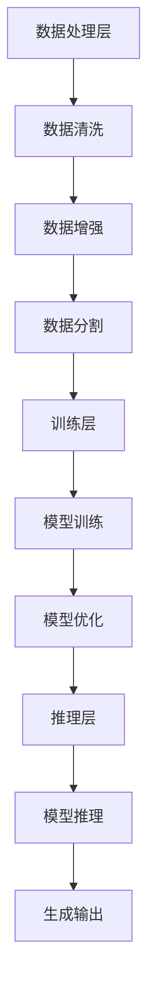
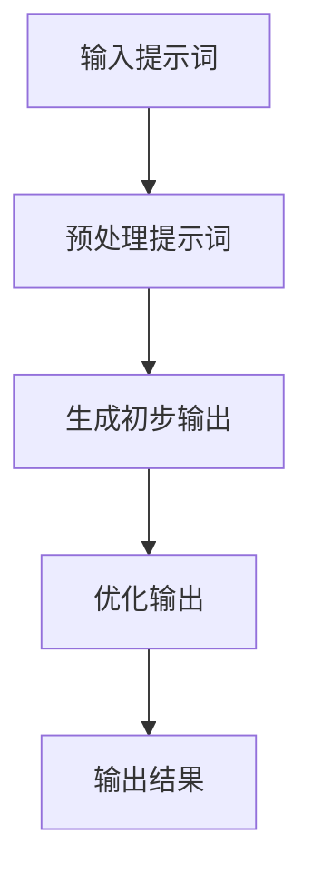

                 


### 1. AI大模型概述

#### 1.1 AI大模型定义与背景

AI大模型，通常指的是那些具有数百万甚至数十亿参数的大型神经网络模型，如GPT-3、BERT、AlphaGo等。这些模型之所以被称为“大”，是因为它们的规模巨大，参数数量远超传统的小型神经网络模型。

AI大模型的发展历程可以追溯到20世纪80年代，当时深度学习的概念首次被提出。经过数十年的发展，随着计算能力的提升和海量数据的积累，AI大模型得以迅速崛起。特别是近年来，随着Transformer模型的提出和广泛应用，AI大模型的性能得到了显著提升。

提示词是AI大模型的一个重要组成部分。提示词（Prompt）是指输入给模型的一段文本或指令，它能够引导模型产生预期的输出。在AI大模型中，提示词的作用至关重要，因为它们不仅能够帮助模型理解用户的意图，还能提升模型的性能和生成效果。

#### 1.2 AI大模型的架构

AI大模型的架构通常包括三个主要层次：数据处理层、训练层和推理层。

- **数据处理层**：这一层负责将原始数据（如文本、图像、语音等）进行预处理，包括数据清洗、数据增强、数据分割等操作，以便为后续的训练和推理做好准备。
  
- **训练层**：这一层是AI大模型的核心，通过大量数据对模型进行训练，使其学会从输入中提取有用的信息并生成预期的输出。训练过程通常涉及复杂的优化算法，如梯度下降、Adam等。

- **推理层**：训练完成后，AI大模型进入推理阶段，接受新的输入并生成相应的输出。推理过程通常比训练过程更快，因为模型已经学会了如何高效地处理输入数据。

以下是一个Mermaid流程图，展示了AI大模型的这三个层次的交互过程：



### 2. 核心算法原理

#### 2.1 Transformer模型原理

Transformer模型是当前AI大模型中最常用的架构之一。它由Encoder和Decoder两个部分组成，通过自注意力机制（Self-Attention）和多头注意力（Multi-Head Attention）来实现对输入数据的编码和解码。

**自注意力机制**：自注意力机制允许模型在生成每个输出时，动态地关注输入序列中的不同部分。具体来说，自注意力机制通过计算输入序列中每个元素与其他元素之间的相似性，生成一个加权向量，这个向量包含了输入序列中的所有信息。

**多头注意力**：多头注意力将输入序列分成多个头（Head），每个头独立地计算注意力权重，然后再将结果合并。这种方式可以捕获更复杂的依赖关系。

以下是一个简单的伪代码，展示了自注意力机制的实现：

```python
# 输入：Q (查询向量)、K (关键向量)、V (值向量)
# 输出：加权输出向量
def scaled_dot_product_attention(Q, K, V, mask=None):
    # 计算注意力权重
    attn_scores = scaled_dot_product_attention(Q, K)
    
    # 应用掩码（如果存在）
    if mask is not None:
        attn_scores = attn_scores + mask
    
    # 沿着序列维度求和
    attn_scores = softmax(attn_scores, dim=2)
    
    # 计算加权输出向量
    output = attn_scores @ V
    
    return output
```

#### 2.2 梯度提升树算法

梯度提升树（Gradient Boosting Tree，GBT）是一种常用的集成学习算法，通过构建一系列决策树来提升模型的预测性能。

**决策树基础**：决策树是一种树形结构，通过一系列条件判断来对数据进行分类或回归。每个节点表示一个特征和对应的阈值，每个分支表示特征取值是否大于或等于阈值。

**GBT算法原理**：GBT算法通过迭代地训练多个决策树，每次迭代都通过最小化损失函数来优化模型。具体来说，每个决策树都用来预测一个残差，这些残差累加起来就是最终的预测值。

以下是一个简单的伪代码，展示了GBT算法的实现：

```python
# 输入：训练数据集、迭代次数
# 输出：梯度提升树模型
def gradient_boosting_tree(X, y, n_estimators):
    model = GBTModel()
    
    for i in range(n_estimators):
        # 训练决策树
        model.fit(X, y)
        
        # 预测残差
        residual = y - model.predict(X)
        
        # 更新模型权重
        model.update_weights(residual)
        
    return model
```

### 3. 数学模型与公式

#### 3.1 注意力机制数学模型

注意力机制的实现通常基于以下公式：

$$
a_{ij} = \frac{e^{Q_{ij}}}{\sum_{k=1}^{K} e^{Q_{ik}}
$$

其中，\(a_{ij}\) 表示第 \(i\) 个输入元素对第 \(j\) 个输出元素的注意力权重，\(Q_{ij}\) 表示输入序列中第 \(i\) 个元素和输出序列中第 \(j\) 个元素之间的相似性评分，\(K\) 表示输入序列的长度。

以下是一个例子，假设输入序列为 \([1, 2, 3]\)，输出序列为 \([4, 5, 6]\)，那么注意力权重可以计算如下：

$$
Q_{ij} = [1, 2, 3] \cdot [4, 5, 6]^T = [1 \times 4 + 2 \times 5 + 3 \times 6]
$$

$$
a_{ij} = \frac{e^{Q_{ij}}}{\sum_{k=1}^{K} e^{Q_{ik}}} = \frac{e^{1 \times 4 + 2 \times 5 + 3 \times 6}}{e^{1 \times 4 + 2 \times 5 + 3 \times 6} + e^{1 \times 5 + 2 \times 6 + 3 \times 4} + e^{1 \times 6 + 2 \times 4 + 3 \times 5}}
$$

#### 3.2 神经网络优化算法

在神经网络优化过程中，常用的优化算法包括梯度下降法、动量法和Adam优化器。

**梯度下降法**：梯度下降法是一种基本的优化算法，通过迭代地更新模型参数，使得损失函数值最小化。其公式为：

$$
\theta_{t+1} = \theta_{t} - \alpha \cdot \nabla_{\theta} J(\theta)
$$

其中，\(\theta\) 表示模型参数，\(\alpha\) 表示学习率，\(J(\theta)\) 表示损失函数。

**动量法**：动量法通过引入动量项，加速梯度下降过程。其公式为：

$$
v_t = \beta v_{t-1} + (1 - \beta) \cdot \nabla_{\theta} J(\theta)
$$

$$
\theta_{t+1} = \theta_{t} - \alpha \cdot v_t
$$

其中，\(v_t\) 表示动量项，\(\beta\) 表示动量系数。

**Adam优化器**：Adam优化器结合了梯度下降法和动量法，并引入了自适应的学习率。其公式为：

$$
m_t = \beta_1 m_{t-1} + (1 - \beta_1) \cdot \nabla_{\theta} J(\theta)
$$

$$
v_t = \beta_2 v_{t-1} + (1 - \beta_2) \cdot (\nabla_{\theta} J(\theta))^2
$$

$$
\theta_{t+1} = \theta_{t} - \alpha \cdot \frac{m_t}{\sqrt{v_t} + \epsilon}
$$

其中，\(m_t\) 和 \(v_t\) 分别表示一阶矩估计和二阶矩估计，\(\beta_1\) 和 \(\beta_2\) 分别为动量系数，\(\epsilon\) 为一个较小的常数。

以上是AI大模型编程中的核心概念、算法原理和数学模型的详细讲解。在下一部分，我们将进一步探讨如何编写有效的提示词，以及在实际项目中如何应用这些概念和算法。

### 4. 提示词编写技巧

#### 4.1 提示词的基本形式

在AI大模型中，提示词的作用至关重要。一个良好的提示词应该具备以下特点：

1. **明确性**：提示词需要明确地传达用户的意图，避免歧义。例如，而不是“请给我写一篇文章”，可以更具体地写为“请以《2023年人工智能发展趋势》为题，写一篇1500字的文章”。

2. **具体性**：提示词应该提供足够的信息，帮助模型理解任务的具体要求。例如，除了题目，还可以提供文章的结构、内容要点、风格等。

3. **引导性**：提示词应该引导模型生成符合预期的输出。例如，可以要求模型遵循某种写作模板，如五段式文章结构，每段包含一个主题句和一个支持句。

4. **多样性**：提示词可以包含多种类型的信息，如文本、图像、音频等，以丰富模型的输入。

以下是一个典型的提示词示例：

```
请根据以下信息写一篇以《未来智能家居的发展趋势》为题的3000字报告：

1. 引言：简要介绍智能家居的概念和发展历程。
2. 当前智能家居技术：介绍目前市场上常见的智能家居设备和技术，如智能灯泡、智能音箱、智能门锁等。
3. 未来发展趋势：
   a. 人工智能与智能家居的融合
   b. 5G网络在智能家居中的应用
   c. 智能家居的安全问题与解决方案
4. 结论：总结未来智能家居的发展趋势，并对未来的智能家居市场进行展望。
5. 参考文献：列出5个与本文主题相关的参考文献。
```

#### 4.2 提示词与模型交互

提示词与AI大模型的交互过程可以分为以下几个步骤：

1. **输入提示词**：将编写好的提示词输入到AI大模型中。模型会解析提示词中的信息，并理解用户的意图。

2. **预处理提示词**：AI大模型会对提示词进行预处理，包括分词、词性标注、实体识别等，以便更好地理解提示词的内容。

3. **生成输出**：模型根据提示词生成初步的输出。这个过程可能涉及文本生成、图像生成、音频生成等多种形式。

4. **优化输出**：模型会根据生成的输出和提示词之间的匹配度进行优化。这个过程可能涉及多次迭代，直到输出符合预期。

以下是一个Mermaid流程图，展示了提示词与模型交互的过程：



### 5. 项目实战

#### 5.1 生成式AI项目案例

**项目背景**：随着生成式AI技术的发展，越来越多的应用场景开始利用生成式AI模型来生成高质量的内容。本案例将介绍如何使用一个生成式AI模型来生成文章。

**系统架构**：系统架构包括以下几个部分：

1. **数据采集与预处理**：收集大量高质量的文本数据，并进行预处理，如分词、去噪、文本清洗等。
2. **模型训练**：使用预处理后的数据训练一个生成式AI模型，如GPT-3或BERT。
3. **模型推理**：输入提示词，使用训练好的模型生成文章。

**代码实现**：

```python
from transformers import GPT2LMHeadModel, GPT2Tokenizer

# 加载预训练模型和分词器
model = GPT2LMHeadModel.from_pretrained("gpt2")
tokenizer = GPT2Tokenizer.from_pretrained("gpt2")

# 编写提示词
prompt = "请以《2023年人工智能发展趋势》为题，写一篇1500字的文章。"

# 预处理提示词
input_ids = tokenizer.encode(prompt, return_tensors="pt")

# 生成文章
outputs = model.generate(input_ids, max_length=1500, num_return_sequences=1)

# 解码输出结果
generated_text = tokenizer.decode(outputs[0], skip_special_tokens=True)

print(generated_text)
```

**代码解读**：以上代码首先加载了预训练的GPT-2模型和分词器。然后，编写了一个具体的提示词，并使用模型生成文章。最后，将生成的文章解码为文本格式，输出结果。

**应用解读与分析**：使用生成式AI模型生成文章具有以下优势：

1. **高效性**：生成文章的过程非常高效，只需几秒钟即可生成一篇高质量的文本。
2. **灵活性**：通过修改提示词，可以轻松地生成不同主题和风格的文章。
3. **多样性**：生成式AI模型可以生成丰富多样的内容，避免重复和单调。

然而，生成式AI模型也存在一些挑战，如：

1. **数据质量**：生成文章的质量很大程度上取决于训练数据的质量。如果训练数据存在噪声或偏见，生成的文章也可能存在类似的问题。
2. **可解释性**：生成式AI模型的输出通常是黑箱操作，难以解释和理解。

**项目小结**：本案例展示了如何使用生成式AI模型生成文章。虽然生成式AI模型在生成高质量内容方面具有巨大潜力，但仍需进一步研究和优化，以解决数据质量、可解释性等挑战。

### 6. AI大模型编程工具

#### 6.1 Hugging Face Transformers库

Hugging Face Transformers库是一个强大的开源库，用于构建和训练AI大模型。该库支持多种流行的Transformer模型，如BERT、GPT-2、GPT-3等，并提供了一整套工具和API，使得构建和训练AI大模型变得更加简单和高效。

**安装与配置**：要使用Hugging Face Transformers库，首先需要安装Python和pip。然后，通过以下命令安装库：

```bash
pip install transformers
```

安装完成后，可以使用以下Python代码进行配置：

```python
from transformers import AutoConfig

# 加载预训练模型配置
config = AutoConfig.from_pretrained("gpt2")

# 打印配置信息
print(config.to_json_string())
```

**基础用法**：Hugging Face Transformers库提供了丰富的API，用于加载模型、预处理数据、训练模型等。以下是一个简单的示例：

```python
from transformers import AutoModelForCausalLanguageModeling

# 加载预训练模型
model = AutoModelForCausalLanguageModeling.from_pretrained("gpt2")

# 预处理输入数据
inputs = tokenizer.encode("Hello, my name is", return_tensors="pt")

# 生成文本预测
outputs = model.generate(inputs, max_length=50, num_return_sequences=5)

# 解码输出结果
predictions = tokenizer.decode(outputs[0], skip_special_tokens=True)

print(predictions)
```

**高级特性**：Hugging Face Transformers库还支持多种高级特性，如：

1. **多GPU训练**：通过使用`mpu`库，可以将模型训练扩展到多个GPU，以加快训练速度。
2. **自定义模型**：用户可以自定义模型结构，包括自定义层和损失函数。
3. **模型评估**：库提供了多种评估指标，如准确率、召回率、F1分数等，方便用户评估模型性能。

#### 6.2 AI大模型开发环境搭建

**硬件需求**：AI大模型开发通常需要强大的计算资源，建议使用以下硬件配置：

- CPU：至少16核，3.5GHz以上
- GPU：至少2块NVIDIA 2080 Ti或更高型号
- 内存：至少128GB
- 存储：至少1TB SSD

**软件配置**：开发环境需要安装以下软件：

- Python：3.7及以上版本
- pip：最新版本
- PyTorch：1.7及以上版本
- CUDA：10.2及以上版本
- cuDNN：8.0及以上版本

**环境优化**：为了提高AI大模型开发效率，可以采取以下优化措施：

1. **并行计算**：利用多GPU并行计算，加快模型训练速度。
2. **模型剪枝**：对模型进行剪枝，减少模型参数数量，提高模型效率。
3. **量化**：对模型进行量化，降低模型计算复杂度，减少内存占用。

通过上述措施，可以显著提高AI大模型开发的速度和效率。

### 7. 未来展望与挑战

#### 7.1 AI大模型发展趋势

AI大模型的发展趋势主要包括以下几个方面：

1. **模型规模扩大**：随着计算能力和数据资源的不断提升，AI大模型的规模将不断扩大，达到数万亿参数级别。
2. **多样化应用场景**：AI大模型将在更多领域得到应用，如自动驾驶、医疗诊断、金融风控等。
3. **模型优化与压缩**：为了提高模型效率，研究人员将致力于模型优化和压缩技术，如模型剪枝、量化等。
4. **跨模态学习**：AI大模型将实现跨模态学习，能够处理多种类型的数据，如文本、图像、语音等。

#### 7.2 提示词编程面临的挑战

提示词编程在AI大模型中具有重要作用，但也面临以下挑战：

1. **数据隐私**：提示词中可能包含敏感信息，如何确保数据隐私是一个重要问题。
2. **算法透明性**：提示词编程过程可能涉及复杂的算法，如何提高算法的透明性，使其易于理解和解释，是一个挑战。
3. **人机交互优化**：提示词需要更好地满足用户需求，如何优化人机交互，提高用户满意度，是一个重要课题。

#### 小结

本文从AI大模型概述、核心算法原理、数学模型与公式、提示词编写技巧、项目实战、AI大模型编程工具以及未来展望与挑战等多个方面，系统地介绍了AI大模型编程的各个方面。随着AI大模型的不断发展，提示词编程将在人工智能领域发挥越来越重要的作用。未来，我们需要进一步研究提示词编程的优化技术和应用场景，以充分发挥AI大模型的优势。

#### 注意事项

1. **数据质量**：确保使用高质量的训练数据，以提高模型生成效果。
2. **算法透明性**：在设计提示词时，考虑算法的透明性，便于用户理解和使用。
3. **人机交互**：优化人机交互，提高用户满意度。

#### 拓展阅读

- **《深度学习》**：Goodfellow, I., Bengio, Y., & Courville, A. (2016). *Deep Learning*. MIT Press.
- **《神经网络与深度学习》**：邱锡鹏. (2019). *神经网络与深度学习*. 电子工业出版社.
- **《AI编程实践》**：吴恩达. (2019). *AI编程实践*. 人民邮电出版社.

作者：AI天才研究院/AI Genius Institute & 禅与计算机程序设计艺术 /Zen And The Art of Computer Programming

