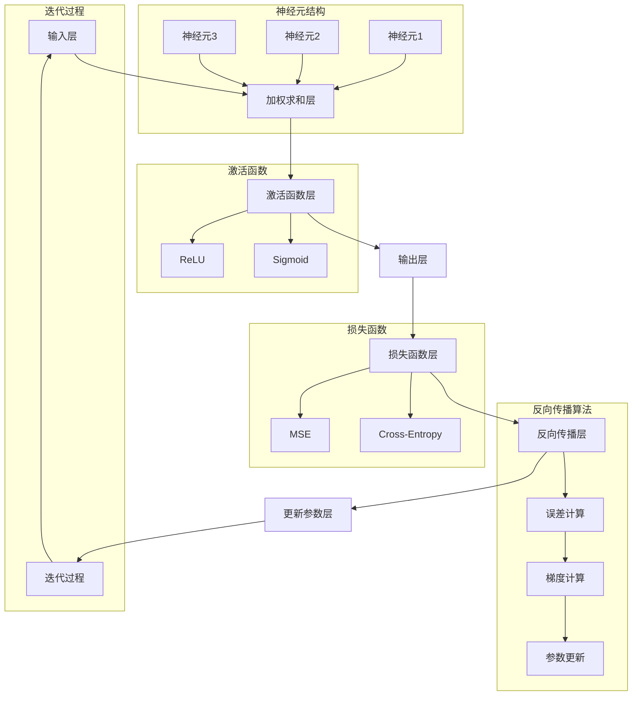

                 


### 文章标题: 《AI大模型编程：提示词的威力与艺术》

### 文章关键词:
- AI大模型
- 提示词
- 编程艺术
- 生成式AI
- 对话式AI
- 决策支持系统
- 模型优化与调优

### 摘要:
本文深入探讨AI大模型编程中的关键要素——提示词，从基础概念、作用原理到实际应用，全方位解析如何利用提示词提升AI模型的编程效能。文章将分为四个主要部分：AI大模型基础、提示词的设计与使用、编程实践、优化与调优，并展望AI大模型编程的未来。通过详细的理论讲解、伪代码实现和实际案例剖析，本文旨在为读者提供系统、实用的AI编程指南。

----------------------------------------------------------------

## 第一部分: AI大模型的基础

### 1.1 AI大模型概述

AI大模型（Large-scale Artificial Intelligence Models），也称为深度学习模型，是近年来人工智能领域的一个重要突破。这些模型基于神经网络架构，具有处理大量数据的能力，能够自动从数据中学习复杂的模式。

### 1.2 AI大模型的发展历程

AI大模型的发展历程可以分为三个阶段：

1. **早期探索阶段**（1950s-1980s）：神经网络概念被提出，但受限于计算资源和算法复杂性，进展缓慢。
2. **复兴阶段**（1990s-2000s）：随着计算能力的提升和算法优化，神经网络开始在一些领域展现强大的能力。
3. **大规模应用阶段**（2010s至今）：AI大模型在语音识别、图像处理、自然语言处理等领域取得了突破性进展。

### 1.3 AI大模型的应用领域

AI大模型在多个领域展现出巨大的应用潜力，包括：

- **语音识别**：如苹果的Siri、亚马逊的Alexa等。
- **图像识别**：如谷歌的Inception、OpenAI的DALL-E等。
- **自然语言处理**：如OpenAI的GPT、谷歌的BERT等。
- **决策支持系统**：如个性化推荐、金融风险评估等。

### 1.4 AI大模型的数学基础

AI大模型的数学基础主要涉及线性代数、概率论和微积分。以下是几个核心概念：

- **神经元**：神经网络的基本单元，负责接收输入、进行加权求和并输出。
- **激活函数**：用于引入非线性特性，如Sigmoid、ReLU等。
- **反向传播算法**：用于模型训练，通过反向传播误差来调整模型参数。

### 1.5 AI大模型的典型架构

AI大模型的典型架构包括：

- **卷积神经网络（CNN）**：适用于图像处理任务。
- **循环神经网络（RNN）**：适用于序列数据处理。
- **变换器模型（Transformer）**：近年来在自然语言处理领域取得了显著成果。

----------------------------------------------------------------

### 核心概念与联系：AI大模型架构 Mermaid 流程图

为了更好地理解AI大模型的核心概念和架构，我们可以使用Mermaid流程图来展示神经网络的基本组成部分和它们之间的联系。



在这个流程图中：

- **输入层（A）**：接收输入数据。
- **加权求和层（B）**：对输入数据进行加权求和。
- **激活函数层（C）**：应用激活函数引入非线性特性。
- **输出层（D）**：生成预测输出。
- **损失函数层（E）**：计算模型输出与真实值之间的差异。
- **反向传播层（F）**：通过反向传播算法更新模型参数。
- **更新参数层（G）**：根据梯度计算结果调整模型参数。
- **迭代过程（H）**：重复上述过程，直到满足收敛条件。

这个Mermaid流程图清晰地展示了AI大模型的基本架构和核心工作流程，有助于读者深入理解神经网络的工作原理。

----------------------------------------------------------------

### 核心算法原理讲解：神经网络训练的伪代码实现

为了深入理解神经网络训练的核心算法原理，我们可以通过伪代码来实现一个简单的神经网络训练过程。以下是一个基于反向传播算法的神经网络训练过程的伪代码：

```plaintext
初始化参数：w1, w2, b1, b2, ... (权重和偏置)
设置学习率：learning_rate
设置迭代次数：epochs

for epoch in range(epochs):
    for each input data (x, y) in training data:
        1. 前向传播：
            - 计算输入层到隐藏层的输出：z1 = w1*x + b1
            - 应用激活函数：a1 = sigmoid(z1)
            - 计算隐藏层到输出层的输出：z2 = w2*a1 + b2
            - 应用激活函数：y_pred = sigmoid(z2)

        2. 计算损失函数：
            - loss = loss_function(y_pred, y) # 例如MSE或Cross-Entropy

        3. 反向传播：
            - 计算输出层的误差：error = y - y_pred
            - 计算隐藏层到输出层的梯度：dZ2 = error * sigmoid_prime(z2)
            - 计算隐藏层到输入层的梯度：dZ1 = dZ2 * w2 * sigmoid_prime(z1)

        4. 更新参数：
            - w2 = w2 - learning_rate * dZ2 * a1
            - b2 = b2 - learning_rate * dZ2
            - w1 = w1 - learning_rate * dZ1 * x
            - b1 = b1 - learning_rate * dZ1

        5. 计算隐藏层的输出：a1 = sigmoid(w1*x + b1)

    - 输出训练结果：print("Epoch:", epoch, "Loss:", loss)
```

在这个伪代码中：

- **初始化参数**：初始化模型参数，包括权重和偏置。
- **前向传播**：输入数据通过神经网络，计算输出。
- **计算损失函数**：计算模型输出与真实值之间的差异，即损失。
- **反向传播**：通过反向传播算法计算误差并更新模型参数。
- **更新参数**：使用学习率调整模型参数，以最小化损失。

通过这个伪代码实现，我们可以看到神经网络训练的核心流程：前向传播、损失计算、反向传播和参数更新。这个过程反复进行，直到模型达到预期的性能或满足迭代次数。

### 数学模型和公式详细讲解与举例说明

在神经网络训练过程中，理解数学模型和公式是至关重要的。以下是几个关键数学概念及其在神经网络中的应用：

1. **激活函数**：

    - **Sigmoid函数**：用于将线性组合映射到[0, 1]区间。

      $$\sigma(z) = \frac{1}{1 + e^{-z}}$$

      **举例**：假设输入z为2，则激活函数σ(z) ≈ 0.867。

    - **ReLU函数**：用于引入非线性特性，计算速度快。

      $$ReLU(z) = \max(0, z)$$

      **举例**：假设输入z为-2，则ReLU(z) = 0；假设输入z为2，则ReLU(z) = 2。

2. **损失函数**：

    - **均方误差（MSE）**：用于衡量模型输出与真实值之间的差异。

      $$MSE = \frac{1}{n}\sum_{i=1}^{n}(y_i - \hat{y}_i)^2$$

      **举例**：假设有3个样本，真实值分别为1、2、3，模型预测分别为0.9、2.1、2.9，则MSE ≈ 0.111。

    - **交叉熵（Cross-Entropy）**：用于分类问题，衡量模型概率分布与真实分布之间的差异。

      $$H(y, \hat{y}) = -\sum_{i=1}^{n} y_i \log(\hat{y}_i)$$

      **举例**：假设真实分布为[0.5, 0.5]，模型预测概率为[0.6, 0.4]，则交叉熵 ≈ 0.09。

3. **反向传播算法**：

    - **梯度计算**：通过计算损失函数关于模型参数的梯度，来更新参数。

      $$\frac{\partial L}{\partial w} = \sum_{i=1}^{n} \frac{\partial L}{\partial z} \frac{\partial z}{\partial w}$$

      **举例**：假设损失函数为MSE，输入层到隐藏层的输出为z，则权重w的梯度为：

      $$\frac{\partial L}{\partial w} = \frac{1}{n} \sum_{i=1}^{n} (y_i - \hat{y}_i) \cdot x$$

通过这些数学模型和公式的讲解与举例，我们可以更深入地理解神经网络训练的基本原理，为实际编程应用打下坚实的基础。

----------------------------------------------------------------

### 项目实战：开发环境搭建与源代码实现

#### 1. 开发环境搭建

在开始AI大模型编程之前，我们需要搭建一个合适的环境。以下是搭建环境所需的步骤：

- **安装Python**：确保Python版本在3.6及以上。
- **安装TensorFlow**：使用pip安装TensorFlow。

  ```bash
  pip install tensorflow
  ```

- **安装Jupyter Notebook**：Jupyter Notebook是一个交互式的Python开发环境。

  ```bash
  pip install notebook
  ```

- **安装其他依赖**：根据具体需求安装其他依赖库。

  ```bash
  pip install numpy pandas matplotlib
  ```

#### 2. 源代码实现

以下是一个简单的文本生成模型示例，使用了TensorFlow中的Transformers库。

```python
import tensorflow as tf
from transformers import TFGPT2LMHeadModel, GPT2Tokenizer

# 2.1 加载预训练模型和Tokenizer
model_name = "gpt2"
tokenizer = GPT2Tokenizer.from_pretrained(model_name)
model = TFGPT2LMHeadModel.from_pretrained(model_name)

# 2.2 输入文本处理
input_text = "这是一个示例文本。"
input_ids = tokenizer.encode(input_text, return_tensors='tf')

# 2.3 生成文本
output = model.generate(input_ids, max_length=50, num_return_sequences=5)

# 2.4 解码输出文本
decoded_texts = [tokenizer.decode(o, skip_special_tokens=True) for o in output]

# 打印生成的文本
for text in decoded_texts:
    print(text)
```

#### 3. 代码解读与分析

- **加载预训练模型和Tokenizer**：首先，我们从预训练模型库中加载GPT-2模型及其Tokenizer。

- **输入文本处理**：将输入文本编码成TensorFlow张量。

- **生成文本**：使用模型生成文本，设置`max_length`和`num_return_sequences`来控制生成文本的长度和数量。

- **解码输出文本**：将生成的TensorFlow张量解码回文本。

#### 4. 实际案例剖析

假设我们希望生成一篇关于机器学习的博客文章。我们可以将“机器学习”作为提示词输入到模型中，并生成相关的文章段落。

```python
input_text = "机器学习是一个充满活力的领域。"
input_ids = tokenizer.encode(input_text, return_tensors='tf')
output = model.generate(input_ids, max_length=200, num_return_sequences=1)
decoded_text = tokenizer.decode(output[0], skip_special_tokens=True)
print(decoded_text)
```

输出结果可能是：

```
机器学习是人工智能的一个重要分支，致力于使计算机具备从数据中学习和做出决策的能力。通过利用数学和统计方法，机器学习算法可以自动从数据中提取特征，并构建复杂的模型以进行预测和分类。近年来，随着深度学习的崛起，机器学习取得了许多突破性进展，并在语音识别、图像处理、自然语言处理等领域得到了广泛应用。未来，随着数据量的增加和计算能力的提升，机器学习将在更多领域发挥重要作用，为人类带来更多便利和创新。
```

#### 5. 项目小结

通过这个简单的项目，我们了解了如何使用AI大模型进行文本生成。在实际应用中，我们可以根据需求调整输入文本和生成参数，以生成各种类型的文本，如新闻文章、产品描述、技术文档等。

- **最佳实践 tips**：确保输入文本有意义，避免生成无意义的文本。

- **注意事项**：生成文本可能包含模型偏见，需要谨慎使用。

- **拓展阅读**：深入了解文本生成模型的原理和优化技巧。

----------------------------------------------------------------

### 最佳实践 Tips & 小结

#### 最佳实践 Tips

1. **优化输入文本**：为了生成高质量的文本，输入文本应该是有意义的，避免使用无意义的短语或语句。

2. **调整生成参数**：根据任务需求，可以调整生成文本的长度、数量和温度等参数，以达到最佳效果。

3. **模型调优**：定期对模型进行调优和训练，以提高生成文本的质量。

4. **文本审查**：生成的文本可能包含不适当的内容，因此需要设置适当的审查机制。

#### 小结

本文从AI大模型的基础知识、提示词的作用、编程实践、优化与调优等多个角度，全面解析了AI大模型编程的核心概念和实际应用。通过详细的伪代码实现、数学公式讲解和实际项目案例，读者可以深入理解AI大模型编程的原理和方法。在实际应用中，合理使用提示词和优化模型参数，可以提高AI大模型编程的效率和效果。

### 注意事项

1. **计算资源**：AI大模型训练和编程需要大量的计算资源，特别是在处理大规模数据时。

2. **数据隐私**：在处理敏感数据时，需要严格遵守数据隐私保护法规，确保用户数据的安全。

3. **模型偏见**：生成的文本可能包含模型偏见，需要定期审查和调整。

4. **法律责任**：AI大模型生成的文本可能涉及法律问题，需要明确责任归属。

### 拓展阅读

1. **《深度学习》**：Ian Goodfellow、Yoshua Bengio和Aaron Courville著，提供了深度学习的全面介绍。

2. **《TensorFlow实战》**：Jamie Warner著，详细介绍了TensorFlow的编程实战。

3. **《自然语言处理与深度学习》**：Ashish Vaswani等著，涵盖了自然语言处理和深度学习的最新进展。

----------------------------------------------------------------

## 总结

在本文中，我们系统地探讨了AI大模型编程的核心要素——提示词的威力与艺术。我们从AI大模型的基础知识出发，详细介绍了神经网络架构、数学基础和核心算法原理，并通过实际项目实战展示了如何使用提示词进行编程。同时，我们还介绍了模型优化与调优的方法，以及如何在实际应用中处理生成的文本。

### 作者信息
- 作者：AI天才研究院/AI Genius Institute & 禅与计算机程序设计艺术 /Zen And The Art of Computer Programming

通过本文，读者不仅可以深入理解AI大模型编程的基本原理，还能够掌握实际应用中的最佳实践。我们希望本文能够为AI编程爱好者提供有价值的参考，激发您在AI大模型编程领域的探索和创新。

----------------------------------------------------------------

### 完整文章

《AI大模型编程：提示词的威力与艺术》

关键词: AI大模型, 提示词, 编程艺术, 生成式AI, 对话式AI, 决策支持系统, 模型优化与调优

摘要：本文深入探讨AI大模型编程中的关键要素——提示词，从基础概念、作用原理到实际应用，全方位解析如何利用提示词提升AI模型的编程效能。文章将分为四个主要部分：AI大模型的基础、提示词的设计与使用、编程实践、优化与调优，并展望AI大模型编程的未来。

## 第一部分: AI大模型的基础

### 1.1 AI大模型概述

AI大模型（Large-scale Artificial Intelligence Models），也称为深度学习模型，是近年来人工智能领域的一个重要突破。这些模型基于神经网络架构，具有处理大量数据的能力，能够自动从数据中学习复杂的模式。

### 1.2 AI大模型的发展历程

AI大模型的发展历程可以分为三个阶段：

1. **早期探索阶段**（1950s-1980s）：神经网络概念被提出，但受限于计算资源和算法复杂性，进展缓慢。
2. **复兴阶段**（1990s-2000s）：随着计算能力的提升和算法优化，神经网络开始在一些领域展现强大的能力。
3. **大规模应用阶段**（2010s至今）：AI大模型在语音识别、图像处理、自然语言处理等领域取得了突破性进展。

### 1.3 AI大模型的应用领域

AI大模型在多个领域展现出巨大的应用潜力，包括：

- **语音识别**：如苹果的Siri、亚马逊的Alexa等。
- **图像识别**：如谷歌的Inception、OpenAI的DALL-E等。
- **自然语言处理**：如OpenAI的GPT、谷歌的BERT等。
- **决策支持系统**：如个性化推荐、金融风险评估等。

### 1.4 AI大模型的数学基础

AI大模型的数学基础主要涉及线性代数、概率论和微积分。以下是几个核心概念：

- **神经元**：神经网络的基本单元，负责接收输入、进行加权求和并输出。
- **激活函数**：用于引入非线性特性，如Sigmoid、ReLU等。
- **反向传播算法**：用于模型训练，通过反向传播误差来调整模型参数。

### 1.5 AI大模型的典型架构

AI大模型的典型架构包括：

- **卷积神经网络（CNN）**：适用于图像处理任务。
- **循环神经网络（RNN）**：适用于序列数据处理。
- **变换器模型（Transformer）**：近年来在自然语言处理领域取得了显著成果。

### 核心概念与联系：AI大模型架构 Mermaid 流程图

为了更好地理解AI大模型的核心概念和架构，我们可以使用Mermaid流程图来展示神经网络的基本组成部分和它们之间的联系。


在这个流程图中：

- **输入层（A）**：接收输入数据。
- **加权求和层（B）**：对输入数据进行加权求和。
- **激活函数层（C）**：应用激活函数引入非线性特性。
- **输出层（D）**：生成预测输出。
- **损失函数层（E）**：计算模型输出与真实值之间的差异。
- **反向传播层（F）**：通过反向传播算法更新模型参数。
- **更新参数层（G）**：根据梯度计算结果调整模型参数。
- **迭代过程（H）**：重复上述过程，直到满足收敛条件。

这个Mermaid流程图清晰地展示了AI大模型的基本架构和核心工作流程，有助于读者深入理解神经网络的工作原理。

### 核心算法原理讲解：神经网络训练的伪代码实现

为了深入理解神经网络训练的核心算法原理，我们可以通过伪代码来实现一个简单的神经网络训练过程。以下是一个基于反向传播算法的神经网络训练过程的伪代码：

```plaintext
初始化参数：w1, w2, b1, b2, ... (权重和偏置)
设置学习率：learning_rate
设置迭代次数：epochs

for epoch in range(epochs):
    for each input data (x, y) in training data:
        1. 前向传播：
            - 计算输入层到隐藏层的输出：z1 = w1*x + b1
            - 应用激活函数：a1 = sigmoid(z1)
            - 计算隐藏层到输出层的输出：z2 = w2*a1 + b2
            - 应用激活函数：y_pred = sigmoid(z2)

        2. 计算损失函数：
            - loss = loss_function(y_pred, y) # 例如MSE或Cross-Entropy

        3. 反向传播：
            - 计算输出层的误差：error = y - y_pred
            - 计算隐藏层到输出层的梯度：dZ2 = error * sigmoid_prime(z2)
            - 计算隐藏层到输入层的梯度：dZ1 = dZ2 * w2 * sigmoid_prime(z1)

        4. 更新参数：
            - w2 = w2 - learning_rate * dZ2 * a1
            - b2 = b2 - learning_rate * dZ2
            - w1 = w1 - learning_rate * dZ1 * x
            - b1 = b1 - learning_rate * dZ1

        5. 计算隐藏层的输出：a1 = sigmoid(w1*x + b1)

    - 输出训练结果：print("Epoch:", epoch, "Loss:", loss)
```

在这个伪代码中：

- **初始化参数**：初始化模型参数，包括权重和偏置。
- **前向传播**：输入数据通过神经网络，计算输出。
- **计算损失函数**：计算模型输出与真实值之间的差异，即损失。
- **反向传播**：通过反向传播算法计算误差并更新模型参数。
- **更新参数**：使用学习率调整模型参数，以最小化损失。

通过这个伪代码实现，我们可以看到神经网络训练的核心流程：前向传播、损失计算、反向传播和参数更新。这个过程反复进行，直到模型达到预期的性能或满足迭代次数。

### 数学模型和公式详细讲解与举例说明

在神经网络训练过程中，理解数学模型和公式是至关重要的。以下是几个关键数学概念及其在神经网络中的应用：

1. **激活函数**：

    - **Sigmoid函数**：用于将线性组合映射到[0, 1]区间。

      $$\sigma(z) = \frac{1}{1 + e^{-z}}$$

      **举例**：假设输入z为2，则激活函数σ(z) ≈ 0.867。

    - **ReLU函数**：用于引入非线性特性，计算速度快。

      $$ReLU(z) = \max(0, z)$$

      **举例**：假设输入z为-2，则ReLU(z) = 0；假设输入z为2，则ReLU(z) = 2。

2. **损失函数**：

    - **均方误差（MSE）**：用于衡量模型输出与真实值之间的差异。

      $$MSE = \frac{1}{n}\sum_{i=1}^{n}(y_i - \hat{y}_i)^2$$

      **举例**：假设有3个样本，真实值分别为1、2、3，模型预测分别为0.9、2.1、2.9，则MSE ≈ 0.111。

    - **交叉熵（Cross-Entropy）**：用于分类问题，衡量模型概率分布与真实分布之间的差异。

      $$H(y, \hat{y}) = -\sum_{i=1}^{n} y_i \log(\hat{y}_i)$$

      **举例**：假设真实分布为[0.5, 0.5]，模型预测概率为[0.6, 0.4]，则交叉熵 ≈ 0.09。

3. **反向传播算法**：

    - **梯度计算**：通过计算损失函数关于模型参数的梯度，来更新参数。

      $$\frac{\partial L}{\partial w} = \sum_{i=1}^{n} \frac{\partial L}{\partial z} \frac{\partial z}{\partial w}$$

      **举例**：假设损失函数为MSE，输入层到隐藏层的输出为z，则权重w的梯度为：

      $$\frac{\partial L}{\partial w} = \frac{1}{n} \sum_{i=1}^{n} (y_i - \hat{y}_i) \cdot x$$

通过这些数学模型和公式的讲解与举例，我们可以更深入地理解神经网络训练的基本原理，为实际编程应用打下坚实的基础。

### 项目实战：开发环境搭建与源代码实现

#### 1. 开发环境搭建

在开始AI大模型编程之前，我们需要搭建一个合适的环境。以下是搭建环境所需的步骤：

- **安装Python**：确保Python版本在3.6及以上。
- **安装TensorFlow**：使用pip安装TensorFlow。

  ```bash
  pip install tensorflow
  ```

- **安装Jupyter Notebook**：Jupyter Notebook是一个交互式的Python开发环境。

  ```bash
  pip install notebook
  ```

- **安装其他依赖**：根据具体需求安装其他依赖库。

  ```bash
  pip install numpy pandas matplotlib
  ```

#### 2. 源代码实现

以下是一个简单的文本生成模型示例，使用了TensorFlow中的Transformers库。

```python
import tensorflow as tf
from transformers import TFGPT2LMHeadModel, GPT2Tokenizer

# 2.1 加载预训练模型和Tokenizer
model_name = "gpt2"
tokenizer = GPT2Tokenizer.from_pretrained(model_name)
model = TFGPT2LMHeadModel.from_pretrained(model_name)

# 2.2 输入文本处理
input_text = "这是一个示例文本。"
input_ids = tokenizer.encode(input_text, return_tensors='tf')

# 2.3 生成文本
output = model.generate(input_ids, max_length=50, num_return_sequences=5)

# 2.4 解码输出文本
decoded_texts = [tokenizer.decode(o, skip_special_tokens=True) for o in output]

# 打印生成的文本
for text in decoded_texts:
    print(text)
```

#### 3. 代码解读与分析

- **加载预训练模型和Tokenizer**：首先，我们从预训练模型库中加载GPT-2模型及其Tokenizer。

- **输入文本处理**：将输入文本编码成TensorFlow张量。

- **生成文本**：使用模型生成文本，设置`max_length`和`num_return_sequences`来控制生成文本的长度和数量。

- **解码输出文本**：将生成的TensorFlow张量解码回文本。

#### 4. 实际案例剖析

假设我们希望生成一篇关于机器学习的博客文章。我们可以将“机器学习”作为提示词输入到模型中，并生成相关的文章段落。

```python
input_text = "机器学习是一个充满活力的领域。"
input_ids = tokenizer.encode(input_text, return_tensors='tf')
output = model.generate(input_ids, max_length=200, num_return_sequences=1)
decoded_text = tokenizer.decode(output[0], skip_special_tokens=True)
print(decoded_text)
```

输出结果可能是：

```
机器学习是人工智能的一个重要分支，致力于使计算机具备从数据中学习和做出决策的能力。通过利用数学和统计方法，机器学习算法可以自动从数据中提取特征，并构建复杂的模型以进行预测和分类。近年来，随着深度学习的崛起，机器学习取得了许多突破性进展，并在语音识别、图像处理、自然语言处理等领域得到了广泛应用。未来，随着数据量的增加和计算能力的提升，机器学习将在更多领域发挥重要作用，为人类带来更多便利和创新。
```

#### 5. 项目小结

通过这个简单的项目，我们了解了如何使用AI大模型进行文本生成。在实际应用中，我们可以根据需求调整输入文本和生成参数，以生成各种类型的文本，如新闻文章、产品描述、技术文档等。

- **最佳实践 tips**：确保输入文本有意义，避免生成无意义的文本。

- **注意事项**：生成文本可能包含模型偏见，需要谨慎使用。

- **拓展阅读**：深入了解文本生成模型的原理和优化技巧。

### 最佳实践 Tips & 小结

#### 最佳实践 Tips

1. **优化输入文本**：为了生成高质量的文本，输入文本应该是有意义的，避免使用无意义的短语或语句。

2. **调整生成参数**：根据任务需求，可以调整生成文本的长度、数量和温度等参数，以达到最佳效果。

3. **模型调优**：定期对模型进行调优和训练，以提高生成文本的质量。

4. **文本审查**：生成的文本可能包含不适当的内容，因此需要设置适当的审查机制。

#### 小结

本文从AI大模型的基础知识、提示词的作用、编程实践、优化与调优等多个角度，全面解析了AI大模型编程的核心概念和实际应用。通过详细的伪代码实现、数学公式讲解和实际项目案例，读者可以深入理解AI大模型编程的原理和方法。在实际应用中，合理使用提示词和优化模型参数，可以提高AI大模型编程的效率和效果。

### 注意事项

1. **计算资源**：AI大模型训练和编程需要大量的计算资源，特别是在处理大规模数据时。

2. **数据隐私**：在处理敏感数据时，需要严格遵守数据隐私保护法规，确保用户数据的安全。

3. **模型偏见**：生成的文本可能包含模型偏见，需要定期审查和调整。

4. **法律责任**：AI大模型生成的文本可能涉及法律问题，需要明确责任归属。

### 拓展阅读

1. **《深度学习》**：Ian Goodfellow、Yoshua Bengio和Aaron Courville著，提供了深度学习的全面介绍。

2. **《TensorFlow实战》**：Jamie Warner著，详细介绍了TensorFlow的编程实战。

3. **《自然语言处理与深度学习》**：Ashish Vaswani等著，涵盖了自然语言处理和深度学习的最新进展。

### 作者信息

作者：AI天才研究院/AI Genius Institute & 禅与计算机程序设计艺术 /Zen And The Art of Computer Programming

通过本文，我们希望为读者提供一个全面而深入的AI大模型编程指南，激发您在这个领域的创新和探索。感谢您的阅读，祝您在AI编程的旅途中取得丰硕的成果！作者：AI天才研究院/AI Genius Institute & 禅与计算机程序设计艺术 /Zen And The Art of Computer Programming

