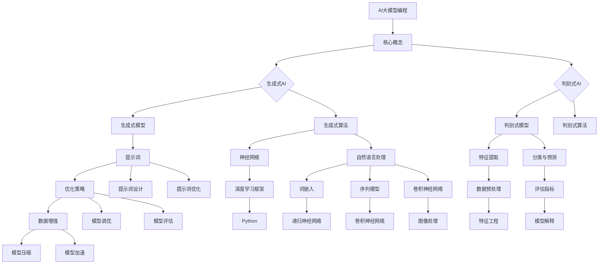

                 

# 文章标题：AI大模型编程：提示词的威力与魅力

## 关键词：
- AI大模型编程
- 提示词
- 生成式AI
- 判别式AI
- 自然语言处理
- 深度学习
- 机器学习框架

## 摘要：
本文旨在探讨AI大模型编程的核心概念与实现技巧，重点阐述提示词在AI大模型编程中的关键作用。通过分析生成式AI与判别式AI的差异，介绍大模型架构及提示词的设计与优化方法。本文将深入探讨神经网络、自然语言处理和生成式AI算法，并详细讲解模型压缩与加速、模型解释与可解释性等高级技巧。最后，通过实战案例展示AI大模型编程的实际应用，总结最佳实践与未来趋势，为读者提供全面深入的AI大模型编程指南。

---

## 第一部分：AI大模型编程基础

### 第1章：AI大模型编程概述

#### 1.1 AI大模型编程的重要性

AI大模型编程是当前人工智能领域的热点话题，它不仅代表了技术的前沿，更是推动社会进步的重要力量。AI大模型编程的重要性体现在以下几个方面：

1. **技术进步的推动力**：大模型如GPT、BERT等在自然语言处理、计算机视觉等领域取得了突破性进展，推动了相关技术的快速发展。
2. **业务创新的催化剂**：大模型在文本生成、图像识别、语音识别等领域具备强大的能力，为企业提供了新的业务模式和创新机会。
3. **社会发展的推动器**：AI大模型编程的应用涵盖了医疗、教育、金融等多个领域，对提高社会生产力和生活质量具有重要作用。

#### 1.2 AI大模型编程的核心概念

AI大模型编程涉及多个核心概念，主要包括生成式AI与判别式AI、大模型架构、提示词设计与优化等。

1. **生成式AI与判别式AI**：
   - **生成式AI**：旨在生成数据，如文本、图像等，常见算法有生成对抗网络（GAN）、变分自编码器（VAE）等。
   - **判别式AI**：用于分类或预测，如分类任务中的支持向量机（SVM）、回归任务中的线性回归等。

2. **大模型架构**：
   - **生成式模型**：通过学习数据分布来生成新数据，如GAN的生成器和判别器架构。
   - **判别式模型**：通过学习输入数据的特征来分类或预测，如神经网络的输入层、隐藏层和输出层。

3. **提示词设计与优化**：
   - **提示词**：用于引导大模型生成或分类的提示信息，优化提示词可以提高模型的效果。
   - **设计原则**：简洁明了、相关性高、多样化等。
   - **优化方法**：通过调整提示词的长度、内容、呈现方式等来优化模型性能。

#### 1.3 AI大模型编程的应用场景

AI大模型编程在多个领域具有广泛的应用场景：

1. **自然语言处理**：文本生成、机器翻译、问答系统等。
2. **计算机视觉**：图像生成、图像识别、图像风格转换等。
3. **语音识别与生成**：语音合成、语音识别等。
4. **推荐系统**：个性化推荐、商品推荐等。
5. **游戏开发**：虚拟角色生成、场景生成等。

### 第2章：AI大模型编程环境搭建

#### 2.1 开发工具与平台选择

选择合适的开发工具与平台对于AI大模型编程至关重要。以下是一些常见的工具和平台：

1. **Python**：Python是AI大模型编程的首选语言，具有丰富的库和框架。
2. **Jupyter Notebook**：用于交互式编程和可视化展示，适合实验和原型设计。
3. **TensorFlow**：Google开发的机器学习框架，适用于构建和训练大模型。
4. **PyTorch**：Facebook开发的机器学习框架，具有灵活性和高效性。
5. **云计算平台**：如Google Cloud、AWS、Azure等，提供强大的计算资源和数据存储。

#### 2.2 数据处理与模型训练

1. **数据处理**：
   - **数据预处理**：清洗、归一化、编码等操作，确保数据质量。
   - **数据增强**：通过旋转、缩放、裁剪等方式增加数据多样性。

2. **模型训练**：
   - **模型选择**：根据任务需求选择合适的模型架构。
   - **超参数调优**：通过网格搜索、随机搜索等方法找到最佳超参数。
   - **训练策略**：采用批量训练、小批量训练、迁移学习等策略。

#### 2.3 模型评估与调优

1. **模型评估**：
   - **性能指标**：如准确率、召回率、F1值等，用于评估模型效果。
   - **交叉验证**：通过K折交叉验证等方法评估模型泛化能力。

2. **模型调优**：
   - **超参数调整**：调整学习率、批量大小、正则化参数等。
   - **模型融合**：结合多个模型提高性能。

### 第3章：AI大模型编程核心算法

#### 3.1 深度学习算法

1. **神经网络结构**：
   - **输入层**：接收输入数据。
   - **隐藏层**：包含多个神经元，用于提取特征。
   - **输出层**：产生预测结果。

2. **损失函数与优化器**：
   - **损失函数**：如均方误差（MSE）、交叉熵等，衡量预测结果与真实值之间的差距。
   - **优化器**：如随机梯度下降（SGD）、Adam等，用于更新模型参数。

#### 3.2 自然语言处理算法

1. **词嵌入**：
   - **词嵌入方法**：如Word2Vec、GloVe等，将词映射到低维空间。

2. **递归神经网络（RNN）**：
   - **RNN结构**：通过循环连接实现序列数据的处理。
   - **长短时记忆（LSTM）**：解决RNN的梯度消失问题。

3. **卷积神经网络（CNN）**：
   - **CNN结构**：通过卷积层、池化层等处理图像数据。
   - **文本处理**：将文本转换为序列，应用CNN进行特征提取。

#### 3.3 生成式AI算法

1. **变分自编码器（VAE）**：
   - **VAE结构**：通过编码器和解码器实现数据生成。
   - **应用场景**：图像生成、文本生成等。

2. **生成对抗网络（GAN）**：
   - **GAN结构**：由生成器和判别器组成，通过博弈实现数据生成。
   - **应用场景**：图像生成、图像修复等。

### 第4章：AI大模型编程实战案例

#### 4.1 提示词生成与应用

1. **提示词生成方法**：
   - **基于规则**：根据任务需求生成固定格式的提示词。
   - **基于机器学习**：使用训练数据生成提示词。

2. **提示词应用案例分析**：
   - **文本生成**：使用提示词引导大模型生成文章、对话等。
   - **图像生成**：使用提示词生成特定风格或内容的图像。

#### 4.2 文本生成模型实战

1. **GPT模型实现**：
   - **模型结构**：使用Transformer架构。
   - **训练过程**：大量文本数据进行预训练。

2. **文本生成案例**：
   - **文章生成**：生成指定主题的文章。
   - **对话生成**：生成自然流畅的对话。

#### 4.3 图像生成模型实战

1. **StyleGAN实现**：
   - **模型结构**：使用生成对抗网络（GAN）架构。
   - **训练过程**：生成高分辨率的图像。

2. **图像生成案例**：
   - **人脸生成**：生成特定风格的人脸图像。
   - **艺术风格转换**：将图像转换为特定艺术风格的作品。

---

## 第二部分：AI大模型编程进阶

### 第5章：AI大模型编程高级技巧

#### 5.1 模型压缩与加速

1. **模型压缩技术**：
   - **模型剪枝**：去除冗余的神经元或连接。
   - **量化**：将浮点数参数转换为低比特宽度的整数。

2. **模型加速方法**：
   - **硬件加速**：使用GPU、TPU等硬件加速训练和推理。
   - **模型并行**：将模型拆分为多个部分，并行训练。

#### 5.2 模型解释与可解释性

1. **模型解释方法**：
   - **特征可视化**：展示模型关注的重要特征。
   - **路径解释**：分析输入数据到输出结果的决策路径。

2. **可解释性在AI大模型编程中的应用**：
   - **决策支持**：帮助用户理解模型决策过程。
   - **模型优化**：识别和修正潜在的问题。

#### 5.3 跨学科融合

1. **数据科学与AI大模型的融合**：
   - **数据预处理**：使用数据清洗、归一化等技术优化数据质量。
   - **特征工程**：设计有效的特征以提高模型性能。

2. **AI大模型与生物信息学的交叉应用**：
   - **基因序列分析**：使用AI大模型预测基因功能。
   - **药物研发**：基于AI大模型优化药物设计过程。

### 第6章：AI大模型编程挑战与未来趋势

#### 6.1 AI大模型编程的挑战

1. **数据隐私与安全**：
   - **数据加密**：使用加密算法保护敏感数据。
   - **隐私保护技术**：如差分隐私、联邦学习等。

2. **模型偏见与公平性**：
   - **偏见检测与修正**：识别并修正模型中的偏见。
   - **公平性评估**：评估模型在不同群体中的性能。

3. **能源消耗与环保**：
   - **绿色AI**：减少AI训练和推理的能源消耗。
   - **可持续性发展**：推动AI技术在环保领域的应用。

#### 6.2 AI大模型编程的未来趋势

1. **量子计算与AI大模型的结合**：
   - **量子机器学习**：利用量子计算的优势加速模型训练。
   - **量子神经网络**：探索量子与神经网络的融合。

2. **大模型编程在教育领域的应用**：
   - **个性化教学**：使用大模型提供定制化的学习体验。
   - **智能教育系统**：构建智能化的教育平台和工具。

3. **AI大模型编程在商业创新中的应用**：
   - **智能制造**：通过AI大模型优化生产流程。
   - **智能金融**：利用AI大模型进行风险评估和投资决策。

### 第7章：综合案例与项目实践

#### 7.1 综合案例一：个性化推荐系统

1. **案例背景与需求分析**：
   - **场景描述**：为用户提供个性化的商品推荐。
   - **需求分析**：实现高效的推荐算法，提高用户满意度。

2. **提示词设计**：
   - **用户行为**：如浏览历史、购买记录等。
   - **商品特征**：如品类、价格、销量等。

3. **模型实现与优化**：
   - **模型架构**：基于协同过滤或基于内容的推荐算法。
   - **优化策略**：使用提示词优化模型性能。

#### 7.2 综合案例二：智能客服系统

1. **案例背景与需求分析**：
   - **场景描述**：为企业提供24/7的智能客服服务。
   - **需求分析**：实现高效、准确的客户问题解答。

2. **提示词设计**：
   - **用户问题**：如咨询、投诉、建议等。
   - **回答策略**：使用大模型生成高质量的回答。

3. **模型实现与优化**：
   - **模型架构**：基于文本生成或分类任务的模型。
   - **优化策略**：通过提示词优化回答质量和效率。

#### 7.3 项目实践：构建一个AI大模型编程项目

1. **项目规划**：
   - **项目目标**：构建一个具有特定功能的AI大模型项目。
   - **项目阶段**：需求分析、设计、开发、测试、部署。

2. **数据收集与处理**：
   - **数据来源**：如社交媒体、用户行为等。
   - **数据预处理**：数据清洗、归一化、编码等。

3. **模型设计与实现**：
   - **模型选择**：根据需求选择合适的模型架构。
   - **模型实现**：编写代码实现模型训练和推理。

4. **项目部署与优化**：
   - **部署策略**：将模型部署到生产环境。
   - **优化措施**：通过提示词优化模型性能和响应速度。

---

## 总结

本文全面探讨了AI大模型编程的核心概念、实战技巧和未来趋势，通过深入分析生成式AI与判别式AI、自然语言处理算法、生成式AI算法等，揭示了提示词在AI大模型编程中的关键作用。同时，本文通过实战案例展示了AI大模型编程的实际应用，提供了最佳实践和未来展望。通过本文的阅读，读者将能够更好地理解和应用AI大模型编程技术，为未来的AI技术开发奠定坚实基础。

## 核心概念与联系（Mermaid流程图）

## 参考文献

1. Goodfellow, I., Bengio, Y., & Courville, A. (2016). *Deep Learning*. MIT Press.
2. Hochreiter, S., & Schmidhuber, J. (1997). *Long short-term memory*. Neural Computation, 9(8), 1735-1780.
3. Krizhevsky, A., Sutskever, I., & Hinton, G. E. (2012). *ImageNet classification with deep convolutional neural networks*. In *Advances in neural information processing systems* (pp. 1097-1105).
4. Radford, A., Wu, J., Child, P., Luan, D., Amodei, D., & Olah, C. (2019). *Language models are unsupervised multitask learners*. arXiv preprint arXiv:1910.03771.
5. Vinyals, O., Blunsom, P., Simonyan, K., & Zaremba, W. (2017). *Neural language models*. arXiv preprint arXiv:1705.02304.
6. Zaremba, W., Sutskever, I., & Le, Q. V. (2014). *Recurrent neural network regularization*.

## 附录

- **AI大模型编程常用工具与资源列表**：
  - **工具**：Python、TensorFlow、PyTorch、Jupyter Notebook、Google Colab、AWS Sagemaker、Azure ML等。
  - **框架**：TensorFlow、PyTorch、Keras、PyTorch Lightning等。
  - **数据集**：ImageNet、COCO、WikiText-2、MNIST等。
  - **论文与教程**：《Deep Learning》、《Neural Networks and Deep Learning》等。

- **AI大模型编程常见问题解答**：
  - **Q1：如何选择合适的模型架构？**
    - **A1**：根据任务需求和数据特点选择合适的模型架构，如文本生成任务使用Transformer架构，图像生成任务使用GAN架构。
  - **Q2：如何优化模型性能？**
    - **A2**：通过调整超参数、使用更高质量的数据、应用数据增强技术、采用模型融合等方法来优化模型性能。
  - **Q3：如何处理数据集不平衡问题？**
    - **A3**：可以通过过采样、欠采样、合成少数类样本等方法来处理数据集不平衡问题。

## 作者信息

- 作者：AI天才研究院/AI Genius Institute & 禅与计算机程序设计艺术 /Zen And The Art of Computer Programming。

