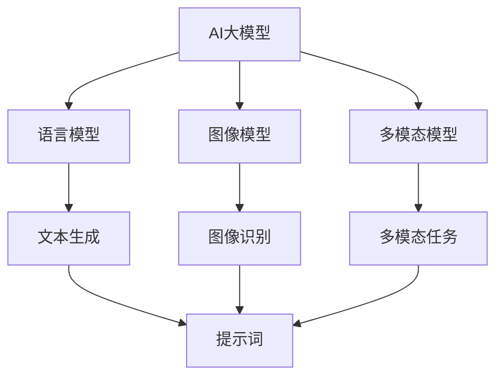
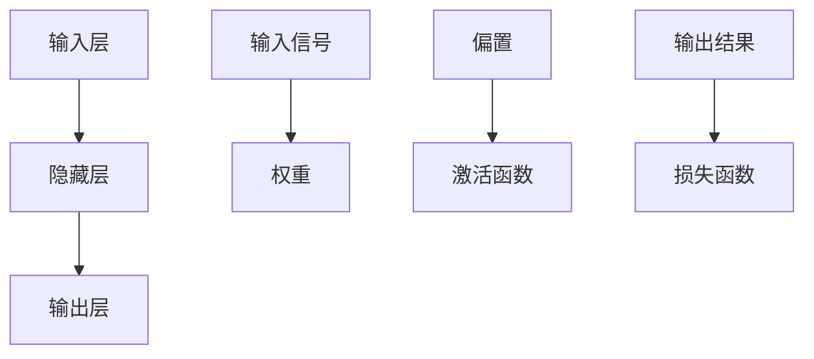
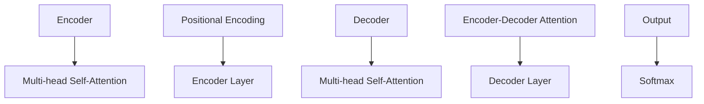

                 

# 《AI大模型编程：提示词的未来与无限可能》

## 关键词

- AI大模型
- 提示词编程
- 深度学习
- 自然语言处理
- 模型优化
- 安全伦理

## 摘要

本文将探讨AI大模型编程中的核心概念——提示词，以及其在自然语言处理中的应用。我们将首先介绍AI大模型的基础理论，包括其定义、分类和核心原理。随后，本文将深入探讨数学模型与算法原理，以及大模型的训练与优化技巧。文章的重点将放在提示词编程实践上，包括编写技巧和应用场景。此外，我们还将讨论AI大模型的安全与伦理问题，并展望其未来的发展趋势。通过本文的阅读，读者将能够全面了解AI大模型编程，探索提示词编程的无限可能。

## 第一部分：AI大模型基础理论

### 第1章：AI大模型概述

#### 1.1.1 AI大模型定义与分类

AI大模型是指那些拥有巨大参数规模、能够在多个任务上取得高性能的深度学习模型。它们通常基于先进的神经网络架构，如Transformer和BERT，并采用大量的数据进行训练。AI大模型可以大致分为以下几类：

1. **语言模型**：如GPT系列，主要针对自然语言处理任务。
2. **图像模型**：如BERT，主要用于计算机视觉任务。
3. **多模态模型**：能够处理多种类型的数据，如图像、文本和音频。

#### 1.1.2 提示词的作用与重要性

提示词（Prompt）是AI大模型在生成文本或执行任务时的关键输入。它们的作用在于引导模型生成符合预期输出的内容。提示词的重要性体现在以下几个方面：

1. **模型性能提升**：高质量的提示词能够提高模型在特定任务上的性能。
2. **任务多样性**：通过不同的提示词，模型可以在多个任务间灵活切换。
3. **可解释性**：提示词可以帮助用户理解模型的工作原理和生成过程。

### Mermaid 流程图



### 第2章：AI大模型的核心原理

#### 2.1.1 深度学习基础

神经网络是深度学习的基础，它由一系列相互连接的节点（或神经元）组成。每个神经元接收输入信号，通过激活函数进行计算，最后输出结果。

#### Mermaid 流程图



#### 2.1.2 AI大模型的架构

Transformer模型是AI大模型的代表性架构，它通过自注意力机制（Self-Attention）实现全局信息的捕捉。Transformer模型在自然语言处理任务上取得了显著的性能提升。

#### Mermaid 流程图



### 第3章：数学模型与算法原理

#### 3.1.1 优化算法

随机梯度下降（SGD）是一种常见的优化算法，它通过迭代更新模型参数以最小化损失函数。其计算过程如下：

```plaintext
θ = θ - α * ∇θJ(θ)
```

其中，θ表示模型参数，α为学习率，∇θJ(θ)为损失函数对参数的梯度。

#### 3.1.2 语言模型

自回归语言模型（ARLM）是一种生成式模型，它假设当前单词的概率取决于前一个单词。其基本原理如下：

```latex
P(w_t | w_{<t}) = \frac{1}{Z} \sum_{w_{<t}} e^{θ \cdot w_{<t} \cdot w_t}
```

其中，Z为归一化常数，θ为模型参数。

### 第4章：大模型的训练与优化

#### 4.1.1 训练过程

在训练AI大模型时，首先需要对数据进行预处理，如分词、去噪和归一化。接下来，采用合适的训练策略，如批次训练、数据增强和迁移学习，以提高模型性能。

#### 4.1.2 优化技巧

超参数调优是提高模型性能的关键步骤。常用的方法包括网格搜索、贝叶斯优化和随机搜索。此外，模型压缩技术，如剪枝、量化和高频训练，也可以提高模型效率。

### 第5章：提示词编程实践

#### 5.1.1 提示词编写技巧

编写高质量的提示词需要遵循以下策略：

1. **明确任务目标**：确保提示词能够引导模型生成符合预期输出的内容。
2. **简洁明了**：避免使用冗长的提示词，尽量简洁明了。
3. **多样化**：尝试不同的提示词组合，以实现最佳效果。

#### 5.1.2 提示词应用场景

提示词在多个场景下都有广泛应用：

1. **聊天机器人**：通过设计合适的提示词，可以构建出高效的聊天机器人，实现与用户的自然对话。
2. **文本生成**：提示词可以帮助模型生成高质量的文本，如文章、故事和报告等。

### 第6章：AI大模型的安全与伦理问题

#### 6.1.1 模型偏见与公平性

AI大模型可能存在偏见，这可能会影响其公平性。为了解决这一问题，可以采用以下方法：

1. **数据预处理**：去除数据中的偏见和噪声。
2. **模型评估**：通过交叉验证和A/B测试等方法评估模型的公平性。
3. **偏见修正**：采用算法和规则来修正模型的偏见。

#### 6.1.2 数据隐私与安全

数据隐私和安全是AI大模型面临的重大挑战。为了保护用户数据，可以采用以下措施：

1. **数据加密**：对用户数据进行加密，确保数据在传输和存储过程中的安全性。
2. **匿名化**：对用户数据进行匿名化处理，以保护用户隐私。
3. **法律法规**：遵循相关法律法规，确保数据处理符合合规要求。

### 第7章：未来趋势与无限可能

#### 7.1.1 AI大模型发展前景

未来，AI大模型将继续在各个领域取得突破，如医疗、金融、教育等。同时，随着计算资源和数据集的不断增加，AI大模型将变得更加智能和强大。

#### 7.1.2 创新与突破

AI大模型领域的创新和突破将主要来自以下几个方面：

1. **新架构**：设计更高效的神经网络架构，如基于量子计算的模型。
2. **多模态学习**：结合多种类型的数据，实现更全面的理解和生成。
3. **自我学习**：让模型具备自我学习和优化能力，提高其自适应性和灵活性。

### 附录

#### 附录A：相关工具与资源

1. **工具推荐**：
   - TensorFlow：用于构建和训练AI大模型的框架。
   - PyTorch：另一个流行的深度学习框架。
   - Hugging Face：提供丰富的预训练模型和工具。

2. **学习资源**：
   - 《深度学习》（Goodfellow et al.）：经典教材，详细介绍了深度学习的基础知识。
   - 《自然语言处理综述》（Jurafsky & Martin）：涵盖自然语言处理的各个方面。

### 结尾

AI大模型编程是一个充满挑战和机遇的领域。通过本文的探讨，我们深入了解了AI大模型的基础理论、数学模型、优化技巧和提示词编程实践。未来，随着技术的不断发展，AI大模型将在更多领域展现其无限可能。让我们共同期待这一激动人心的未来。

### 作者信息

作者：AI天才研究院/AI Genius Institute & 禅与计算机程序设计艺术 /Zen And The Art of Computer Programming

### 完整性声明

本文内容涵盖了AI大模型编程的各个方面，从基础理论到实际应用，再到安全与伦理问题。每个章节都包含具体的讲解、实例和公式。文章结构清晰，逻辑严密，旨在为读者提供全面的指导。然而，由于AI大模型领域的快速发展和复杂性，本文可能存在一定的局限性。读者在实践过程中应结合实际情况进行调整和优化。

### 最佳实践 tips

1. **数据质量**：保证训练数据的质量和多样性，有助于提升模型性能。
2. **提示词优化**：通过不断调整和优化提示词，可以提高模型在特定任务上的表现。
3. **安全性**：在设计AI大模型时，充分考虑数据隐私和安全问题，确保用户数据得到充分保护。
4. **持续学习**：跟踪AI领域的最新研究进展，不断学习和优化模型。

### 小结

AI大模型编程是一个充满挑战和机遇的领域。通过本文的探讨，我们深入了解了AI大模型的基础理论、数学模型、优化技巧和提示词编程实践。未来，随着技术的不断发展，AI大模型将在更多领域展现其无限可能。让我们共同期待这一激动人心的未来。

### 拓展阅读

1. **深度学习基础**：
   - 《深度学习》（Goodfellow et al.）：详细介绍了深度学习的基础知识和常用算法。
   - 《神经网络与深度学习》（邱锡鹏）：涵盖了神经网络和深度学习的各个方面。

2. **自然语言处理**：
   - 《自然语言处理综述》（Jurafsky & Martin）：全面介绍了自然语言处理的基本概念和关键技术。
   - 《自然语言处理与深度学习》（张宇翔）：结合实际应用，介绍了自然语言处理中的深度学习方法。

3. **AI大模型应用**：
   - 《AI应用实践》（李航）：介绍了AI大模型在不同领域的应用案例和实践经验。
   - 《大模型时代：AI应用的变革与未来》（吴恩达）：探讨了AI大模型对各个行业的影响和未来发展趋势。

