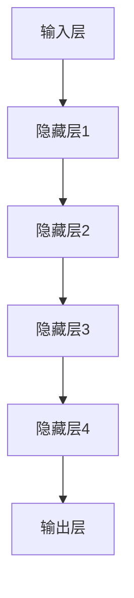

                 

## AI大模型编程：提示词的艺术

### 关键词

- AI大模型
- 编程艺术
- 提示词设计
- 深度学习
- 神经网络
- 应用实战

### 摘要

本文将深入探讨AI大模型编程的核心要素——提示词的艺术。首先，我们将介绍AI大模型的基本概念和架构，包括深度学习、神经网络以及优化算法等相关技术。接着，我们将重点关注提示词的设计原则及其在AI大模型编程中的重要性。随后，我们将介绍如何使用Python等编程语言以及相关工具进行AI大模型编程。文章还将包含实际的AI大模型应用案例，以展示如何将理论知识应用于实际项目开发中。最后，我们将总结最佳实践，并提供拓展阅读建议，帮助读者进一步深入探讨AI大模型编程的深度与广度。

---

## 第1章 AI大模型基础概念与架构

### 1.1 AI大模型概述

AI大模型（Large-scale AI Models），如GPT、BERT等，是基于深度学习技术构建的复杂神经网络模型，它们具有处理大量数据并从中学习的能力。这些模型通常通过大规模数据训练，以获得高精度的预测和决策能力。

AI大模型的发展历程可以追溯到20世纪80年代，最初由简单的感知器模型开始，逐步演变为复杂的深度神经网络。随着计算能力的提升和大数据的普及，AI大模型逐渐从实验室走向实际应用，并在自然语言处理、计算机视觉、语音识别等领域取得了显著成果。

AI大模型的核心架构通常包括以下几个部分：

1. **输入层**：接收外部输入数据，如文本、图像或声音。
2. **隐藏层**：通过一系列神经网络层对输入数据进行处理，提取特征并逐步构建复杂的概念。
3. **输出层**：根据隐藏层的结果生成输出，如文本生成、图像分类或声音识别。

在AI大模型的架构中，深度学习和神经网络是最关键的技术。深度学习通过多层神经网络的堆叠，使模型能够自动从数据中学习并提取有用的特征。神经网络则通过调整网络中的权重和偏置，使模型能够不断优化性能。

### 1.2 AI大模型的关键技术

**深度学习基础**：深度学习是AI大模型的核心技术之一，它通过多层神经网络结构对数据进行处理，从而实现从简单特征到复杂特征的学习和提取。深度学习的基础包括激活函数、反向传播算法和多层网络结构。

**神经网络原理**：神经网络是模仿人脑神经元工作的计算模型，通过调整网络中的权重和偏置，实现输入到输出的映射。神经网络的基本组成部分包括神经元、权重、偏置和激活函数。

**优化算法介绍**：优化算法是深度学习中的关键环节，用于调整网络权重和偏置，以最小化损失函数。常见的优化算法包括梯度下降、随机梯度下降和Adam优化器等。

### 1.3 AI大模型的分类

AI大模型可以根据应用场景和结构特点进行分类，以下是一些知名的AI大模型：

**GPT系列模型**：GPT（Generative Pre-trained Transformer）模型是自然语言处理领域的杰出代表，包括GPT、GPT-2和GPT-3等版本。这些模型通过预训练的方式，在大规模文本数据上进行学习，从而实现了出色的文本生成和语言理解能力。

**BERT及其变体**：BERT（Bidirectional Encoder Representations from Transformers）模型是谷歌提出的双向Transformer模型，它通过双向编码器结构，实现了对文本的全局上下文理解。BERT及其变体模型如RoBERTa、ALBERT等，在多种自然语言处理任务中表现出了卓越的性能。

**其他知名大模型**：除了GPT和BERT，还有许多其他知名的大模型，如OpenAI的GPT-3、Facebook的ALBERT和微软的Turing等。这些模型在不同的应用领域和任务中展现了强大的性能和潜力。

### 1.4 AI大模型的核心架构与联系

为了更好地理解AI大模型的核心架构，我们可以使用Mermaid流程图来展示其基本组成部分和相互关系。

**Mermaid流程图解析**：

1. **输入层（A）**：接收外部输入数据，如文本、图像或声音。
2. **隐藏层1（B）**：对输入数据进行初步处理，提取基本特征。
3. **隐藏层2（C）**：在隐藏层1的基础上，进一步提取高级特征。
4. **隐藏层3（D）**：继续提升特征提取能力，为复杂特征处理做准备。
5. **隐藏层4（E）**：进一步细化特征，为输出层提供高质量的输入。
6. **输出层（F）**：根据隐藏层的结果生成输出，如文本生成、图像分类或声音识别。

通过这种流程图，我们可以清晰地看到AI大模型从输入到输出的整个处理过程，以及各层之间的相互关系和协同作用。

---

在下一章中，我们将深入探讨AI大模型编程中的核心要素——提示词的设计艺术，介绍如何利用提示词优化模型的性能和应用效果。敬请期待！

