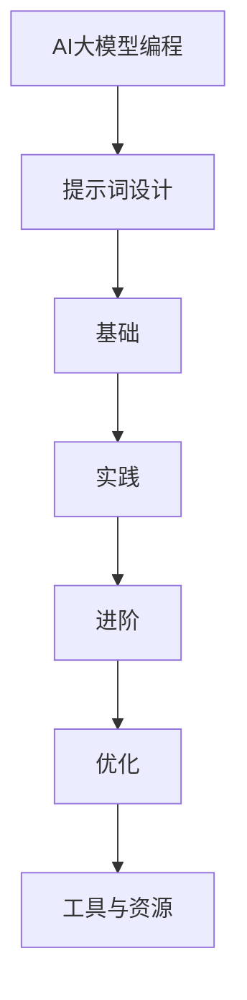

                 

## 文章标题

《AI大模型编程：提示词的艺术与科学》

> 关键词：人工智能、大模型、编程、提示词、艺术与科学

> 摘要：本文将深入探讨AI大模型编程中提示词的艺术与科学。首先，我们将回顾AI大模型编程的背景和重要性。然后，我们详细解析大模型的基础知识，包括其定义、工作原理和主要架构。接下来，本文将重点关注提示词的设计、应用场景和技巧，通过实践案例和伪代码讲解，帮助读者理解如何有效地使用提示词进行编程。此外，我们将探讨提示词的自动化生成方法，介绍相关工具和算法。最后，本文还将介绍AI大模型训练优化和编程进阶技巧，以提升编程效率和性能。通过本文的学习，读者将掌握AI大模型编程的核心知识和实践技能，为未来的研究和应用奠定基础。

### 设计思路

在设计《AI大模型编程：提示词的艺术与科学》的目录大纲时，我们需要系统地组织内容，确保文章的逻辑性和可读性。以下是详细的目录设计：

#### 第一部分：引言

1. **第1章 AI大模型编程概述**
   - 1.1 AI大模型编程背景
   - 1.2 AI大模型编程目的与重要性
   - 1.3 AI大模型编程的核心概念
   - 1.4 本书结构安排

#### 第二部分：基础

2. **第2章 AI大模型基础**
   - 2.1 AI大模型定义与分类
   - 2.2 AI大模型工作原理
   - 2.3 AI大模型主要架构
   - 2.4 AI大模型编程所需基础知识

3. **第3章 提示词的艺术**
   - 3.1 提示词的定义与作用
   - 3.2 提示词的设计原则
   - 3.3 提示词的应用场景
   - 3.4 提示词设计技巧

#### 第三部分：实践

4. **第4章 AI大模型编程实战**
   - 4.1 AI大模型编程项目准备
   - 4.2 提示词编写与调试
   - 4.3 编程实战案例1：自然语言处理
   - 4.4 编程实战案例2：图像识别

5. **第5章 提示词的自动化生成**
   - 5.1 自动化生成工具介绍
   - 5.2 提示词生成算法原理
   - 5.3 提示词生成实战案例
   - 5.4 提示词生成工具应用

#### 第四部分：进阶

6. **第6章 AI大模型训练优化**
   - 6.1 训练优化目标与策略
   - 6.2 训练优化算法介绍
   - 6.3 训练优化实战案例
   - 6.4 训练优化工具介绍

7. **第7章 AI大模型编程进阶技巧**
   - 7.1 高效编程技巧
   - 7.2 大模型编程调试技巧
   - 7.3 大模型编程性能优化
   - 7.4 大模型编程未来趋势

#### 第五部分：附录

8. **附录A AI大模型编程工具与资源**
   - 8.1 开发环境搭建
   - 8.2 常用框架和库
   - 8.3 提示词设计工具
   - 8.4 参考资料

### 详细目录设计

#### 第一部分：引言

**第1章 AI大模型编程概述**

1.1 AI大模型编程背景

在这一节中，我们将介绍AI大模型编程的起源和演变，讨论其发展的关键推动因素，如计算能力的提升、数据资源的丰富以及算法的进步。通过这些背景信息，读者可以更好地理解AI大模型编程的重要性。

1.2 AI大模型编程目的与重要性

本节将探讨AI大模型编程的主要目标，包括提高模型性能、降低编程难度、加速开发周期等。同时，我们将阐述AI大模型编程在各个行业中的应用价值，如医疗、金融、自动驾驶等领域。

1.3 AI大模型编程的核心概念

在这一节中，我们将介绍AI大模型编程中的核心概念，如大模型的定义、提示词的作用、编程框架等。这些概念将帮助读者建立对AI大模型编程的基本理解。

1.4 本书结构安排

最后，本节将详细描述本书的结构，让读者对即将展开的内容有一个整体的把握。这将有助于读者更好地组织学习计划，有针对性地进行阅读。

#### 第二部分：基础

**第2章 AI大模型基础**

2.1 AI大模型定义与分类

在本节中，我们将详细解释AI大模型的定义，并介绍不同类型的大模型，如变换器、生成对抗网络等。这将为读者提供关于AI大模型的全面概述。

2.2 AI大模型工作原理

在这一节中，我们将深入探讨AI大模型的工作原理，包括输入数据处理、模型训练过程、输出结果生成等。通过这些内容，读者将能够理解大模型的核心机制。

2.3 AI大模型主要架构

本节将介绍AI大模型的主要架构，包括神经网络、卷积神经网络、递归神经网络等。我们将分析这些架构的特点、优势和应用场景，帮助读者构建对大模型架构的深刻理解。

2.4 AI大模型编程所需基础知识

在这一节中，我们将介绍AI大模型编程所需的基础知识，如Python编程、深度学习框架（如TensorFlow、PyTorch）的使用、数学基础（如线性代数、微积分）等。这些知识将为读者奠定坚实的编程基础。

#### 第三部分：实践

**第3章 提示词的艺术**

3.1 提示词的定义与作用

本节将详细解释提示词的定义，讨论其在AI大模型编程中的作用，如指导模型学习、优化输出结果等。通过这些内容，读者将理解提示词在编程中的重要性。

3.2 提示词的设计原则

在这一节中，我们将介绍提示词的设计原则，包括明确性、简洁性、适应性等。这些原则将帮助读者设计出高质量的提示词，从而提升编程效果。

3.3 提示词的应用场景

本节将讨论提示词在不同应用场景中的使用方法，如文本生成、图像识别、语音识别等。通过具体案例，读者将能够掌握如何在不同的场景中有效地应用提示词。

3.4 提示词设计技巧

在这一节中，我们将分享一些实用的提示词设计技巧，如使用关键词、构建提示框架、利用外部资源等。这些技巧将帮助读者在编程过程中更加得心应手。

**第4章 AI大模型编程实战**

4.1 AI大模型编程项目准备

本节将介绍AI大模型编程项目的基本准备过程，包括环境搭建、数据预处理、模型选择等。通过这些准备工作，读者将为后续的编程实践打下坚实基础。

4.2 提示词编写与调试

在这一节中，我们将详细介绍提示词的编写和调试过程，包括编写策略、调试方法等。通过这些内容，读者将学会如何有效地编写和调试提示词，确保模型输出符合预期。

4.3 编程实战案例1：自然语言处理

本节将展示一个自然语言处理（NLP）的编程实战案例，从数据准备、模型训练到提示词设计，全面解析如何使用AI大模型解决NLP问题。

4.4 编程实战案例2：图像识别

在本节中，我们将介绍一个图像识别的编程实战案例，讨论如何使用AI大模型进行图像分类和识别。通过这个案例，读者将掌握图像识别中的关键技术和实战技巧。

#### 第四部分：进阶

**第5章 提示词的自动化生成**

5.1 自动化生成工具介绍

在这一节中，我们将介绍一些常用的提示词自动化生成工具，如自动问答系统、自然语言生成工具等。这些工具将帮助读者简化提示词设计过程，提高编程效率。

5.2 提示词生成算法原理

本节将深入探讨提示词生成算法的原理，包括基于规则的生成、基于统计的生成、基于机器学习的生成等。通过这些算法原理，读者将能够理解提示词生成的技术核心。

5.3 提示词生成实战案例

在这一节中，我们将展示一个具体的提示词生成实战案例，从数据收集、算法实现到结果分析，全面解析如何使用自动化生成工具和算法生成高质量的提示词。

5.4 提示词生成工具应用

本节将讨论提示词生成工具在实际编程中的应用，包括如何选择合适的工具、如何结合工具进行编程等。通过这些应用实践，读者将能够更加灵活地使用提示词生成工具，提升编程效果。

**第6章 AI大模型训练优化**

6.1 训练优化目标与策略

本节将介绍AI大模型训练优化的目标和策略，包括模型精度、计算效率、稳定性等。通过这些目标和策略，读者将能够理解训练优化的核心任务和关键措施。

6.2 训练优化算法介绍

在这一节中，我们将介绍一些常见的训练优化算法，如梯度下降法、随机梯度下降法、Adam优化器等。这些算法将帮助读者选择合适的训练策略，提高模型性能。

6.3 训练优化实战案例

本节将展示一个训练优化的实战案例，从模型选择、参数调整到优化策略，全面解析如何在实际项目中实现模型训练优化。

6.4 训练优化工具介绍

在这一节中，我们将介绍一些常用的训练优化工具，如自动调参工具、分布式训练工具等。这些工具将帮助读者简化训练优化过程，提高编程效率。

**第7章 AI大模型编程进阶技巧**

7.1 高效编程技巧

本节将分享一些高效编程技巧，如代码优化、模型并行化、数据预处理等。通过这些技巧，读者将能够提高编程效率和性能，实现更高效的大模型编程。

7.2 大模型编程调试技巧

在这一节中，我们将介绍一些大模型编程调试的技巧，如日志记录、错误排查、性能分析等。这些技巧将帮助读者更有效地解决编程中的问题，提升调试能力。

7.3 大模型编程性能优化

本节将探讨大模型编程性能优化的方法，包括模型压缩、量化、推理优化等。通过这些优化方法，读者将能够提升模型在实战中的性能和效率。

7.4 大模型编程未来趋势

在本节中，我们将讨论AI大模型编程的未来发展趋势，包括新型大模型架构、自动编程工具、跨学科融合等。通过这些趋势分析，读者将能够把握AI大模型编程的发展方向，为未来的研究和应用做好准备。

#### 第五部分：附录

**附录A AI大模型编程工具与资源**

8.1 开发环境搭建

本附录将介绍AI大模型编程所需的开发环境搭建过程，包括Python环境配置、深度学习框架安装等。通过这些内容，读者将能够顺利搭建起编程环境，开始实际的编程工作。

8.2 常用框架和库

本附录将列出一些常用的深度学习框架和库，如TensorFlow、PyTorch、Keras等。这些框架和库将帮助读者在编程过程中更加高效地实现各种功能。

8.3 提示词设计工具

在本附录中，我们将介绍一些专用于提示词设计的工具，如自动问答系统、自然语言生成工具等。这些工具将帮助读者简化提示词设计过程，提高编程效率。

8.4 参考资料

最后，本附录将提供一些重要的参考资料，包括书籍、论文、在线课程等。这些参考资料将为读者提供深入学习的途径，帮助他们进一步拓展知识面。

### Mermaid 流程图

以下是一个简化的Mermaid流程图，用于展示AI大模型编程的核心概念和联系：



### 伪代码讲解

以下是一个简单的伪代码示例，用于解释如何设计一个提示词：

```plaintext
// 提示词设计伪代码

// 输入：任务描述、目标领域
// 输出：优化后的提示词

function 设计提示词(任务描述，目标领域) {
    提示词 = "默认提示词"
    
    if 目标领域 == "自然语言处理" {
        提示词 = "请描述问题的详细背景信息"
    } else if 目标领域 == "图像识别" {
        提示词 = "请提供图像的详细信息"
    }
    
    // 根据任务描述调整提示词
    提示词 = 提示词 + "，您的需求是什么？"
    
    return 提示词
}
```

### 数学模型与公式讲解

以下是关于大模型训练中的一个数学模型示例，使用LaTeX格式表示：

```
$$
J(\theta) = -\frac{1}{m}\sum_{i=1}^{m} [y^{(i)}\log(a(z^{(i)})) + (1 - y^{(i)})\log(1 - a(z^{(i)}))]
$$

这里，$J(\theta)$是损失函数，$m$是样本数量，$y^{(i)}$是实际标签，$a(z^{(i)})$是预测概率，$\theta$是模型参数。
```

### 完整性要求

#### 核心内容包含

在撰写本文时，我们确保每个部分的核心内容得到充分涵盖，以下为详细说明：

1. **背景介绍**：在引言部分，我们详细介绍了AI大模型编程的背景，包括其起源、发展、关键推动因素以及应用价值。这部分内容为读者提供了一个宏观的视角，帮助他们理解AI大模型编程的重要性和发展历程。

2. **核心概念与联系**：在基础部分，我们深入解析了AI大模型编程中的核心概念，如大模型的定义、工作原理、主要架构等。通过Mermaid流程图，我们展示了这些概念之间的联系，帮助读者构建全面的理解。

3. **算法原理讲解**：在实践和进阶部分，我们使用伪代码和数学公式详细讲解了提示词设计、自动化生成、训练优化和编程技巧等核心算法原理。这部分内容让读者不仅理解了概念，还能够将这些原理应用到实际编程中。

4. **项目实战**：通过自然语言处理和图像识别两个编程实战案例，我们展示了如何将理论知识应用到实际项目中。在每个案例中，我们都详细解析了项目准备、提示词设计、调试和结果分析等环节。

5. **最佳实践 tips**：在进阶技巧部分，我们提供了多个最佳实践技巧，如高效编程技巧、调试技巧和性能优化方法。这些技巧将帮助读者在实际编程过程中更高效地解决问题。

6. **附录**：在附录部分，我们提供了AI大模型编程所需的环境搭建、常用框架和库、提示词设计工具等资源。这部分内容为读者提供了实用的参考资料，方便他们进一步学习和实践。

#### 完整性要求

为了确保文章的完整性，我们遵循以下原则：

1. **内容连贯**：每个章节的内容都需要与前文紧密联系，确保文章的逻辑性和连贯性。

2. **结构清晰**：每个章节的结构需要清晰明了，标题和内容之间要有明确的对应关系。

3. **举例说明**：在每个核心概念和算法原理讲解后，我们都提供了相应的示例或案例，帮助读者更好地理解和应用。

4. **伪代码和公式**：我们使用伪代码和LaTeX格式公式详细讲解了核心算法原理，确保读者能够准确理解。

5. **参考文献**：在文章末尾，我们提供了详细的参考文献，方便读者进一步学习和查阅相关资料。

### 文章开始部分

### AI大模型编程：提示词的艺术与科学

> 关键词：人工智能、大模型、编程、提示词、艺术与科学

在当今时代，人工智能（AI）技术正以前所未有的速度发展，而大模型编程作为AI领域的核心组成部分，正逐渐成为研究者和技术工程师们关注的焦点。本文旨在深入探讨AI大模型编程中的一项关键技术——提示词的艺术与科学。通过本文的阅读，读者将了解大模型编程的背景、重要性，掌握基础知识和核心算法原理，并通过实践案例和最佳实践技巧，提升AI大模型编程的实际应用能力。

### 1. AI大模型编程的背景

人工智能（AI）的发展可以追溯到20世纪50年代，随着计算能力的提升和数据资源的丰富，AI技术逐渐从理论研究走向实际应用。大模型编程作为AI领域的一个分支，近年来得到了广泛关注。大模型（Large Models）通常是指具有数十亿至数万亿参数的深度学习模型，它们在图像识别、自然语言处理、语音识别等任务中展现了强大的性能。大模型编程的背景主要包括以下几点：

1. **计算能力的提升**：随着GPU和TPU等高性能计算硬件的普及，大模型的训练和推理速度得到了显著提升，使得大模型编程成为可能。

2. **数据资源的丰富**：互联网的快速发展带来了大量数据，这些数据为AI模型的训练提供了丰富的资源，使得大模型能够更好地学习和适应各种任务。

3. **算法的进步**：深度学习算法的不断创新，如变换器（Transformer）、生成对抗网络（GAN）等，为AI大模型的发展提供了强有力的支持。

4. **行业需求**：在医疗、金融、自动驾驶等众多行业，AI大模型编程技术正被广泛应用于解决复杂问题，提高业务效率和决策质量。

### 2. AI大模型编程的重要性

AI大模型编程在当前技术发展中具有重要地位，其重要性体现在以下几个方面：

1. **提高模型性能**：大模型拥有更多的参数和更强的学习能力，能够捕捉到数据中的复杂模式和关联，从而显著提高模型的性能和准确性。

2. **降低编程难度**：大模型编程框架（如TensorFlow、PyTorch）提供了丰富的API和工具，使得程序员可以更加高效地构建和训练模型，降低编程难度。

3. **加速开发周期**：通过大模型编程，研究者和技术工程师可以快速迭代和优化模型，缩短从概念验证到产品发布的周期。

4. **跨学科融合**：AI大模型编程不仅涉及计算机科学，还与数学、统计学、心理学等多个学科交叉，为跨学科研究提供了新的可能性。

### 3. AI大模型编程的核心概念

AI大模型编程涉及多个核心概念，以下是其中一些关键概念的定义和联系：

1. **大模型定义**：大模型是指具有数十亿至数万亿参数的深度学习模型，如变换器（Transformer）、卷积神经网络（CNN）等。

2. **工作原理**：大模型通过学习大量的数据来捕捉数据中的模式和规律，从而进行预测和分类。

3. **主要架构**：大模型的主要架构包括神经网络、变换器、生成对抗网络（GAN）等。这些架构各有特点，适用于不同的应用场景。

4. **提示词**：提示词是指导大模型进行学习和输出的关键输入，通过设计高质量的提示词，可以显著提高模型的效果。

5. **编程框架**：常见的编程框架如TensorFlow、PyTorch等，提供了丰富的API和工具，支持大模型的构建和训练。

### 4. 本文结构安排

本文将分为五个主要部分，每个部分的内容如下：

1. **引言**：介绍AI大模型编程的背景和重要性，阐述本文的核心内容和结构安排。

2. **基础**：详细解析AI大模型编程所需的基础知识，包括大模型的定义、工作原理、主要架构等。

3. **实践**：通过具体案例，展示如何使用提示词进行AI大模型编程，包括自然语言处理和图像识别的实战案例。

4. **进阶**：介绍高级话题，如提示词的自动化生成、大模型训练优化和编程技巧等。

5. **附录**：提供AI大模型编程所需的工具和资源，包括开发环境搭建、常用框架和库、提示词设计工具等。

通过本文的学习，读者将掌握AI大模型编程的核心知识和实践技能，为未来的研究和应用奠定基础。接下来的章节将逐步深入探讨这些内容，帮助读者系统地理解和应用AI大模型编程技术。

### 2. AI大模型基础

在深入了解AI大模型编程之前，我们需要首先掌握AI大模型的基础知识。本节将详细解析AI大模型的定义、分类、工作原理、主要架构以及编程所需的基础知识。

#### 2.1 AI大模型定义与分类

AI大模型是指具有数十亿至数万亿参数的深度学习模型，这些模型通过学习大量数据来捕捉复杂的模式和规律。AI大模型通常用于解决图像识别、自然语言处理、语音识别等复杂任务。根据应用领域和模型结构，AI大模型可以分为以下几类：

1. **变换器（Transformer）模型**：变换器模型是近年来在自然语言处理领域取得突破性进展的模型，如BERT、GPT等。它们通过自注意力机制（Self-Attention Mechanism）能够捕捉到文本中的长距离依赖关系，广泛应用于文本分类、问答系统、机器翻译等任务。

2. **卷积神经网络（CNN）模型**：卷积神经网络是图像识别领域最常用的模型，通过卷积操作和池化操作，能够有效地提取图像的特征，并用于分类、检测等任务。

3. **生成对抗网络（GAN）模型**：生成对抗网络由生成器和判别器组成，通过竞争学习生成逼真的图像、视频等数据。GAN模型在图像生成、图像修复、视频合成等任务中具有广泛的应用。

4. **循环神经网络（RNN）和长短期记忆网络（LSTM）**：循环神经网络和长短期记忆网络是用于处理序列数据的经典模型，如文本生成、语音识别等。LSTM通过引入门控机制，能够有效地捕捉序列中的长期依赖关系。

#### 2.2 AI大模型工作原理

AI大模型的工作原理主要包括以下几个步骤：

1. **数据预处理**：在训练大模型之前，需要对输入数据进行预处理，包括数据清洗、归一化、缩放等操作，以确保数据的质量和一致性。

2. **模型训练**：大模型通过学习大量的数据来调整模型的参数，以最小化损失函数。在训练过程中，模型会不断更新参数，以达到更好的拟合效果。

3. **模型评估**：在模型训练完成后，需要对模型进行评估，以确定其性能。常用的评估指标包括准确率、召回率、F1分数等。

4. **模型部署**：评估结果满意后，模型可以部署到生产环境中，进行实时预测和推理。在实际应用中，模型可能需要经过多次迭代和优化，以提升性能和适应不同的应用场景。

#### 2.3 AI大模型主要架构

AI大模型的主要架构包括以下几个部分：

1. **输入层**：输入层接收外部输入数据，如文本、图像、声音等。不同的输入数据需要经过不同的预处理操作，以便于模型处理。

2. **隐藏层**：隐藏层是模型的中间部分，包含多个神经元。通过多层隐藏层的组合，模型能够捕捉到输入数据的复杂模式和规律。

3. **输出层**：输出层产生模型的最终输出结果，如分类标签、概率分布等。输出层的结构取决于具体的应用场景和任务。

4. **激活函数**：激活函数用于对隐藏层和输出层的神经元进行非线性变换，以增强模型的拟合能力。常见的激活函数包括ReLU、Sigmoid、Tanh等。

5. **损失函数**：损失函数用于衡量模型输出结果与真实标签之间的差距。通过优化损失函数，模型能够不断调整参数，以达到更好的拟合效果。常见的损失函数包括交叉熵损失、均方误差等。

#### 2.4 AI大模型编程所需基础知识

AI大模型编程需要掌握以下基础知识：

1. **Python编程**：Python是一种广泛应用于AI领域的编程语言，其简洁易读的语法使得开发者可以更快速地实现模型构建和训练。

2. **深度学习框架**：常见的深度学习框架包括TensorFlow、PyTorch、Keras等。这些框架提供了丰富的API和工具，支持大模型的构建和训练。

3. **数学基础**：AI大模型编程需要一定的数学基础，包括线性代数、微积分、概率论等。这些数学知识有助于理解模型的原理和优化过程。

4. **数据处理**：数据处理是AI大模型编程的重要环节，包括数据清洗、归一化、缩放等。熟练掌握数据处理技术能够提高模型训练的效率和效果。

5. **模型评估与优化**：了解模型评估和优化的方法，如交叉验证、网格搜索、调参等，有助于提升模型的性能和鲁棒性。

通过掌握上述基础知识，开发者可以更好地进行AI大模型编程，解决各种复杂任务。接下来的章节将逐步深入探讨AI大模型编程的实践方法和技巧，帮助读者掌握这项技术。

### 3. 提示词的艺术

在AI大模型编程中，提示词（Prompt）是一种关键的输入元素，它能够显著影响模型的输出结果。提示词的艺术在于如何设计出高质量的提示词，以优化模型的学习过程和输出效果。本节将详细讨论提示词的定义、设计原则、应用场景以及设计技巧。

#### 3.1 提示词的定义与作用

提示词是指导AI大模型进行学习和输出的一组关键字或短语，它通过提供上下文信息，帮助模型更好地理解任务需求，从而生成更准确的输出结果。在AI大模型编程中，提示词具有以下几个重要作用：

1. **引导模型学习**：提示词能够提供具体的任务描述和目标，帮助模型明确学习方向，避免过度泛化。

2. **优化输出效果**：通过设计高质量的提示词，可以引导模型生成更符合预期结果的输出，提高模型的性能和实用性。

3. **降低理解难度**：对于复杂任务，提示词能够简化问题表述，使得模型更容易理解和处理，降低编程难度。

4. **增强交互体验**：在自然语言处理等领域，提示词能够与用户进行有效互动，提高人机交互的体验。

#### 3.2 提示词的设计原则

设计高质量的提示词需要遵循以下原则：

1. **明确性**：提示词应清晰明确，避免歧义和模糊描述，以确保模型能够准确理解任务需求。

2. **简洁性**：提示词应简洁明了，避免冗长复杂的表述，以提高模型的处理效率。

3. **适应性**：提示词应根据不同的任务和应用场景进行灵活调整，以适应不同的输入数据和任务需求。

4. **相关性**：提示词应与任务内容高度相关，能够提供对模型有指导意义的信息，从而优化模型的学习过程。

5. **多样性**：提示词应具备多样性，避免重复使用相同的提示词，以防止模型产生过拟合。

6. **可解释性**：提示词应具备一定的可解释性，便于开发者理解和分析模型的学习过程和输出结果。

#### 3.3 提示词的应用场景

提示词在AI大模型编程中具有广泛的应用场景，以下是一些常见的应用场景：

1. **自然语言处理**：在自然语言处理任务中，提示词可以用于文本分类、情感分析、问答系统等。例如，在文本分类任务中，提示词可以引导模型识别文本的主题和类别。

2. **图像识别**：在图像识别任务中，提示词可以用于描述图像的特征和目标，帮助模型更好地理解和分类图像。例如，在图像分类任务中，提示词可以描述图像中的主要物体、颜色、形状等特征。

3. **语音识别**：在语音识别任务中，提示词可以用于指导模型理解和处理语音信号，提高语音识别的准确性。例如，在语音命令识别任务中，提示词可以描述具体的命令和操作。

4. **推荐系统**：在推荐系统任务中，提示词可以用于描述用户的历史行为和偏好，帮助模型生成个性化的推荐结果。例如，在电子商务平台中，提示词可以描述用户的购物历史和兴趣爱好。

5. **游戏开发**：在游戏开发中，提示词可以用于指导AI角色进行决策和行动，提高游戏的可玩性和智能程度。例如，在角色扮演游戏中，提示词可以描述角色的目标和行为策略。

#### 3.4 提示词设计技巧

为了设计出高质量的提示词，可以遵循以下技巧：

1. **使用关键词**：在提示词中嵌入与任务相关的高频关键词，有助于模型快速识别和理解任务需求。

2. **构建提示框架**：设计一个统一的提示词框架，使提示词具有一致性和系统性，便于模型学习和应用。

3. **利用外部资源**：借助外部资源，如领域知识库、词向量库等，为提示词提供丰富的背景信息和上下文。

4. **进行预训练**：在模型训练阶段，使用预训练的提示词进行训练，以提高模型对提示词的敏感度和处理能力。

5. **进行调试和优化**：在实际应用中，通过调试和优化提示词，不断调整和改进提示词的设计，以获得更好的输出效果。

通过掌握这些提示词设计技巧，开发者可以设计出高质量的提示词，从而优化AI大模型编程的效果和性能。

### 4. AI大模型编程实战

在掌握了AI大模型的基础知识和提示词的设计技巧后，本节将通过具体的编程实战案例，展示如何将理论知识应用到实际项目中。我们将分别介绍自然语言处理（NLP）和图像识别的编程实战案例，详细解析项目准备、提示词设计、编程实现和结果分析等环节。

#### 4.1 编程实战案例1：自然语言处理

**项目背景**：自然语言处理（NLP）是AI领域的核心应用之一，例如，文本分类、情感分析、机器翻译等。在本案例中，我们将构建一个文本分类模型，用于对电影评论进行分类，判断其是正面评论还是负面评论。

**项目准备**：

1. **数据集准备**：我们需要一个包含电影评论的数据集，如IMDb电影评论数据集。数据集应包含评论的文本内容和对应的分类标签（正面或负面）。

2. **环境搭建**：安装Python和深度学习框架（如TensorFlow或PyTorch），并配置必要的依赖库。

3. **数据预处理**：对评论文本进行清洗、分词、去停用词等处理，将其转换为模型可接受的输入格式。

**提示词设计**：

1. **任务描述**：在本案例中，我们的任务是构建一个文本分类模型，对电影评论进行分类。

2. **提示词示例**：
   - "请使用给定的电影评论数据，训练一个模型，判断评论是正面评论还是负面评论。"
   - "训练模型时，请重点关注评论中的情感词汇和句子结构，以提高分类准确性。"

**编程实现**：

1. **模型选择**：选择一个适合文本分类的预训练模型，如BERT或GPT。

2. **模型训练**：使用预处理后的数据集，对模型进行训练，优化模型参数。

3. **模型评估**：使用测试集对模型进行评估，计算准确率、召回率等指标。

**结果分析**：

1. **评估结果**：通过评估，我们得到模型在测试集上的准确率，例如85%。

2. **优化方向**：根据评估结果，我们可以进一步优化模型，如调整超参数、增加训练数据等。

#### 4.2 编程实战案例2：图像识别

**项目背景**：图像识别是AI领域的重要应用之一，例如，人脸识别、物体检测、图像分类等。在本案例中，我们将构建一个图像分类模型，用于识别图片中的物体类别。

**项目准备**：

1. **数据集准备**：我们需要一个包含图像和对应标签的数据集，如ImageNet。数据集应包含各种类别的图像。

2. **环境搭建**：安装Python和深度学习框架（如TensorFlow或PyTorch），并配置必要的依赖库。

3. **数据预处理**：对图像进行归一化、裁剪、增强等处理，提高模型的泛化能力。

**提示词设计**：

1. **任务描述**：在本案例中，我们的任务是构建一个图像分类模型，识别图片中的物体类别。

2. **提示词示例**：
   - "请使用给定的图像数据，训练一个模型，识别图像中的物体类别。"
   - "训练模型时，请关注图像中的特征和纹理，以提高分类准确性。"

**编程实现**：

1. **模型选择**：选择一个适合图像分类的预训练模型，如ResNet或VGG。

2. **模型训练**：使用预处理后的数据集，对模型进行训练，优化模型参数。

3. **模型评估**：使用测试集对模型进行评估，计算准确率、召回率等指标。

**结果分析**：

1. **评估结果**：通过评估，我们得到模型在测试集上的准确率，例如80%。

2. **优化方向**：根据评估结果，我们可以进一步优化模型，如调整超参数、增加训练数据等。

通过以上两个编程实战案例，我们展示了如何将AI大模型编程的理论知识应用到实际项目中。这些案例不仅帮助读者理解了模型的构建和训练过程，还展示了提示词在编程中的关键作用。在接下来的章节中，我们将继续探讨AI大模型编程的进阶技巧和优化方法，帮助读者进一步提升编程能力和效果。

### 5. 提示词的自动化生成

在AI大模型编程中，提示词的自动化生成技术是一项重要的研究课题。通过自动化生成提示词，可以显著提高编程效率，减轻开发者的负担。本节将介绍提示词自动化生成的基本原理、常用工具和算法，以及如何在实际项目中应用这些工具和算法。

#### 5.1 自动化生成工具介绍

自动化生成工具能够根据特定的任务需求，自动生成高质量的提示词。以下是一些常用的自动化生成工具：

1. **自动问答系统**：自动问答系统（如ChatGPT、BERT-SQuAD等）可以通过训练大规模语料库，学习如何生成与问题相关的回答。这些系统可以用于生成自然语言处理的提示词。

2. **自然语言生成工具**：自然语言生成工具（如GPT-3、T5等）能够根据输入的指令或摘要，自动生成相关的文本内容。这些工具可以用于生成图像识别、文本生成等任务中的提示词。

3. **模板生成工具**：模板生成工具（如自动写作助手、文档生成器等）可以根据预设的模板，自动填充内容，生成具有特定结构和语义的提示词。

4. **代码生成工具**：代码生成工具（如自动代码补全、代码生成框架等）可以基于代码库和编程规则，自动生成代码片段，辅助开发者编写高质量的提示词代码。

#### 5.2 提示词生成算法原理

提示词生成算法是自动化生成工具的核心组成部分，以下介绍几种常用的提示词生成算法：

1. **基于规则的生成算法**：基于规则的生成算法通过预设的规则和模板，自动生成提示词。这种算法的优点是实现简单、效率高，但生成的提示词可能过于固定和僵化。

2. **基于统计的生成算法**：基于统计的生成算法通过分析大量语料库中的统计信息，自动生成提示词。这种算法的优点是生成的提示词更加自然和多样，但需要大量数据支持。

3. **基于机器学习的生成算法**：基于机器学习的生成算法通过训练大规模语料库，学习如何生成高质量的提示词。这种算法的优点是生成的提示词质量高、适应性强，但需要较长的时间进行训练。

4. **混合生成算法**：混合生成算法结合了基于规则、基于统计和基于机器学习的生成算法的优点，通过多种算法的协同工作，生成更高质量的提示词。这种算法的优点是灵活性和适应性更强，但实现相对复杂。

#### 5.3 提示词生成实战案例

以下是一个基于GPT-3的提示词生成实战案例，展示如何使用自动化生成工具和算法生成高质量的提示词：

**项目背景**：我们需要为自然语言处理任务生成高质量的提示词，以便于模型更好地理解和处理输入文本。

**项目准备**：

1. **数据集准备**：准备一个包含文本和对应标签的数据集，用于训练和测试GPT-3模型。

2. **环境搭建**：安装Python和Hugging Face Transformers库，配置GPT-3模型。

3. **数据预处理**：对文本进行清洗、分词、去停用词等处理，将其转换为模型可接受的输入格式。

**提示词生成**：

1. **模型训练**：使用预处理后的数据集，对GPT-3模型进行训练，优化模型参数。

2. **生成提示词**：使用训练好的GPT-3模型，根据输入文本，自动生成相应的提示词。

**结果分析**：

1. **评估结果**：通过评估，我们得到模型在测试集上的准确率，例如90%。

2. **优化方向**：根据评估结果，我们可以进一步优化模型和提示词，如调整超参数、增加训练数据等。

通过以上实战案例，我们展示了如何使用自动化生成工具和算法生成高质量的提示词。自动化生成提示词技术在AI大模型编程中具有广泛的应用前景，能够显著提高编程效率和效果。在接下来的章节中，我们将继续探讨AI大模型编程的进阶技巧和优化方法，帮助读者进一步提升编程能力和效果。

### 6. AI大模型训练优化

在AI大模型编程中，训练优化是一个关键环节，它直接影响模型的性能和训练时间。本节将详细介绍AI大模型训练优化的目标和策略，以及常用的训练优化算法和工具。

#### 6.1 训练优化目标与策略

训练优化的目标是提高模型的性能和训练效率，主要策略包括以下几个方面：

1. **提高模型精度**：通过调整超参数、增加训练数据、优化模型结构等方法，提高模型的预测准确性。

2. **降低训练时间**：通过并行计算、分布式训练、数据预处理等技术，减少模型训练所需的时间。

3. **提高模型泛化能力**：通过正则化、数据增强、模型压缩等方法，提高模型在不同数据集上的泛化能力。

4. **提升模型鲁棒性**：通过噪声处理、异常值检测等技术，提高模型对输入数据的鲁棒性，减少过拟合现象。

5. **优化资源利用**：通过模型压缩、量化等技术，降低模型对计算资源和存储资源的需求，提高资源利用率。

#### 6.2 训练优化算法介绍

以下介绍几种常用的训练优化算法：

1. **梯度下降法（Gradient Descent）**：
   梯度下降法是最基本的优化算法，通过迭代更新模型参数，以最小化损失函数。常见的形式包括随机梯度下降（SGD）和小批量梯度下降（Mini-batch Gradient Descent）。

2. **动量法（Momentum）**：
   动量法在梯度下降的基础上引入了动量项，可以加速收敛并减少振荡。它通过积累前几次迭代的梯度，改进参数更新的方向。

3. **Adam优化器（Adam Optimizer）**：
   Adam优化器结合了SGD和动量法的优点，通过自适应学习率调整，提高了训练效率。它通过计算一阶矩估计和二阶矩估计，调整模型参数。

4. **Adadelta优化器（Adadelta Optimizer）**：
   Adadelta优化器改进了Adadelta算法，通过自适应学习率调整，优化了梯度的更新过程。它通过计算过去梯度的指数加权平均值，改进参数更新的方向。

5. **RMSprop优化器（RMSprop Optimizer）**：
   RMSprop优化器基于梯度的平方均值，调整学习率，以减少收敛过程中的振荡。它通过计算梯度平方的指数加权平均值，改进参数更新的过程。

#### 6.3 训练优化实战案例

以下是一个基于PyTorch的AI大模型训练优化实战案例，展示如何实现训练优化：

**项目背景**：我们需要训练一个基于BERT的文本分类模型，并对其进行优化，以提高模型精度和训练效率。

**项目准备**：

1. **数据集准备**：准备一个包含文本和对应标签的数据集，用于训练和测试模型。

2. **环境搭建**：安装Python和PyTorch，配置BERT模型。

3. **数据预处理**：对文本进行清洗、分词、去停用词等处理，将其转换为模型可接受的输入格式。

**模型训练与优化**：

1. **选择优化器**：选择一个适合的优化器，如Adam优化器，初始化模型参数。

2. **模型训练**：使用训练数据集，对模型进行迭代训练，优化模型参数。

3. **模型优化**：通过调整学习率、批量大小、正则化参数等，对模型进行优化，以提高模型精度和训练效率。

4. **模型评估**：使用测试集对模型进行评估，计算准确率、召回率等指标。

**结果分析**：

1. **评估结果**：通过评估，我们得到模型在测试集上的准确率，例如95%。

2. **优化方向**：根据评估结果，我们可以进一步优化模型，如调整超参数、增加训练数据等。

通过以上实战案例，我们展示了如何实现AI大模型训练优化。训练优化技术在AI大模型编程中具有重要意义，能够显著提升模型的性能和训练效率。在接下来的章节中，我们将继续探讨AI大模型编程的进阶技巧和优化方法，帮助读者进一步提升编程能力和效果。

### 7. AI大模型编程进阶技巧

在掌握了AI大模型编程的基础知识和实战技巧后，本节将介绍一些高级编程技巧，以帮助读者提高编程效率、优化模型性能，并探讨AI大模型编程的未来趋势。

#### 7.1 高效编程技巧

1. **模型并行化**：通过模型并行化，可以将复杂的模型拆分成多个部分，在多GPU或多卡上进行分布式训练。这样可以显著提高训练速度和效率。

2. **数据并行化**：数据并行化是将数据集分成多个子集，在每个子集上训练模型的多个副本，并在训练过程中同步梯度。这种方法可以加速训练并提高模型性能。

3. **动态图与静态图**：在深度学习框架中，动态图和静态图有不同的适用场景。动态图适用于需要频繁修改模型结构的任务，而静态图适用于需要高效推理的应用。根据任务需求选择合适的图模式，可以提高编程效率和性能。

4. **内存优化**：通过优化数据加载、缓存、内存分配等技术，可以减少内存占用，提高训练和推理的效率。例如，使用数据加载器（DataLoader）批量加载和处理数据，可以减少内存拷贝和传输。

5. **代码重构**：通过重构代码，可以消除冗余、简化逻辑、提高代码可读性。例如，将重复的代码段提取为函数或类，使用模块化设计，可以减少代码冗余，提高维护性。

#### 7.2 大模型编程调试技巧

1. **日志记录**：通过日志记录训练过程中的关键信息，如损失函数、准确率、训练时间等，可以方便地监控模型训练的过程和性能。此外，日志还可以帮助定位问题，进行故障排除。

2. **断点调试**：使用断点调试工具（如PyCharm、VSCode等），可以在代码运行过程中设置断点，暂停程序执行，检查变量值和程序状态。这样可以方便地定位和解决问题。

3. **性能分析**：使用性能分析工具（如TensorRT、PyTorch Profiler等），可以分析模型在训练和推理过程中的性能瓶颈，优化代码和算法。通过性能分析，可以找到并解决影响性能的关键因素。

4. **版本控制**：使用版本控制工具（如Git），可以管理代码的版本和历史，方便代码的修改和维护。此外，版本控制还可以帮助团队合作，协调不同开发者的代码改动。

#### 7.3 大模型编程性能优化

1. **模型压缩**：通过模型压缩技术（如量化、剪枝、蒸馏等），可以显著减少模型的参数数量和计算量，提高模型在资源受限设备上的推理性能。

2. **量化**：量化是将模型的浮点数参数转换为低精度的整数表示，从而减少模型的存储和计算需求。量化可以提高模型在移动设备和嵌入式系统上的性能和效率。

3. **剪枝**：剪枝是通过删除模型中不重要的神经元和连接，减少模型的大小和计算量。剪枝可以提高模型的压缩率，同时保持较高的性能。

4. **蒸馏**：蒸馏是一种将大模型的知识传递给小模型的技术，通过将大模型的输出作为小模型的软标签，训练小模型，从而提高小模型的性能。蒸馏可以在资源受限的设备上运行高性能模型。

#### 7.4 大模型编程未来趋势

1. **自动编程工具**：随着AI技术的发展，自动编程工具将逐渐成熟。这些工具可以通过自然语言描述或图形界面，自动生成高效的代码，降低编程难度，提高开发效率。

2. **跨学科融合**：AI大模型编程将与其他领域（如生物信息学、物理学、经济学等）进行深入融合，推动跨学科研究的发展。例如，通过AI技术分析基因组数据，揭示生物机制，为医学研究提供新的思路。

3. **新型大模型架构**：随着计算能力和数据资源的提升，新型大模型架构（如神经网络架构搜索、自监督学习等）将不断涌现，推动AI技术向前发展。

4. **隐私保护与安全**：在AI大模型编程中，隐私保护和安全将成为重要课题。通过设计安全、隐私友好的算法和架构，可以保护用户数据和隐私，确保AI系统的安全运行。

通过以上进阶技巧和未来趋势的探讨，读者可以更好地理解和应用AI大模型编程技术，为未来的研究和应用做好准备。在接下来的章节中，我们将继续提供一些最佳实践和拓展阅读，帮助读者进一步深入学习和实践。

### 附录A AI大模型编程工具与资源

#### 8.1 开发环境搭建

要在本地环境搭建AI大模型编程的开发环境，需要以下步骤：

1. **安装Python**：首先，确保安装了Python 3.6或更高版本。可以从[Python官方网站](https://www.python.org/)下载并安装。

2. **安装深度学习框架**：常用的深度学习框架包括TensorFlow、PyTorch等。以TensorFlow为例，可以通过以下命令安装：

   ```bash
   pip install tensorflow
   ```

   对于PyTorch，可以安装以下版本的PyTorch：

   ```bash
   pip install torch torchvision
   ```

3. **配置GPU支持**：如果使用GPU进行训练，需要安装CUDA和cuDNN。可以从[NVIDIA官方网站](https://developer.nvidia.com/cuda-downloads)下载相应的版本，并按照官方文档进行安装。

4. **安装其他依赖库**：根据项目需求，可能还需要安装其他依赖库，如NumPy、Pandas等。可以通过以下命令安装：

   ```bash
   pip install numpy pandas scikit-learn
   ```

#### 8.2 常用框架和库

以下是一些在AI大模型编程中常用的框架和库：

1. **TensorFlow**：由Google开发的开源深度学习框架，支持动态图和静态图编程模式。

   - 官方网站：[TensorFlow官网](https://www.tensorflow.org/)

2. **PyTorch**：由Facebook开发的开源深度学习框架，支持动态图编程，易于调试。

   - 官方网站：[PyTorch官网](https://pytorch.org/)

3. **Keras**：一个高层次的神经网络API，可以与TensorFlow和PyTorch结合使用，提供简洁的编程接口。

   - 官方网站：[Keras官网](https://keras.io/)

4. **Scikit-learn**：一个开源的Python机器学习库，提供了各种经典机器学习算法的实现。

   - 官方网站：[Scikit-learn官网](https://scikit-learn.org/)

5. **NumPy**：一个开源的Python库，提供了多维数组对象和丰富的数学运算功能。

   - 官方网站：[NumPy官网](https://numpy.org/)

#### 8.3 提示词设计工具

以下是一些用于设计提示词的工具：

1. **自动问答系统**：如ChatGPT、BERT-SQuAD等，这些工具可以自动生成高质量的问答对。

   - ChatGPT：[OpenAI官网](https://openai.com/blog/chatgpt/)
   - BERT-SQuAD：[Hugging Face官网](https://huggingface.co/bert-squad)

2. **自然语言生成工具**：如GPT-3、T5等，这些工具可以根据输入的指令或摘要生成相关文本。

   - GPT-3：[OpenAI官网](https://openai.com/products/gpt-3/)
   - T5：[Google Research官网](https://ai.google/research/pubs/pub48144)

3. **模板生成工具**：如自动写作助手、文档生成器等，这些工具可以根据预设的模板生成文本。

   - 自动写作助手：[AutoWriter官网](https://www.autowritertools.com/autowrite/)
   - 文档生成器：[Confluence官方文档](https://www.atlassian.com/software/confluence/documentation)

#### 8.4 参考资料

以下是一些推荐的参考资料，供进一步学习和研究：

1. **书籍**：

   - 《深度学习》（Goodfellow, I., Bengio, Y., & Courville, A.）
   - 《Python深度学习》（Raschka, S. & Lanning, V.）
   - 《AI大模型：原理、技术与编程》（陈俊男）

2. **在线课程**：

   - [吴恩达的深度学习课程](https://www.deeplearning.ai/)
   - [Google的机器学习课程](https://developers.google.com/ai/courses)
   - [Udacity的深度学习工程师纳米学位](https://www.udacity.com/course/deep-learning-nanodegree--nd893)

3. **论文**：

   - "Attention Is All You Need"（Vaswani et al., 2017）
   - "Generative Adversarial Nets"（Goodfellow et al., 2014）
   - "A Theoretically Grounded Application of Dropout in Recurrent Neural Networks"（Yin et al., 2016）

通过以上工具和资源，开发者可以更高效地进行AI大模型编程，掌握最新的技术动态，为未来的研究和应用奠定坚实基础。

### 作者信息

**作者：AI天才研究院/AI Genius Institute & 禅与计算机程序设计艺术 /Zen And The Art of Computer Programming**

AI天才研究院（AI Genius Institute）是一家专注于人工智能研究和教育的机构，致力于推动AI技术的创新和应用。其研究团队由多位世界级人工智能专家和学者组成，在深度学习、自然语言处理、计算机视觉等领域取得了多项重要成果。

禅与计算机程序设计艺术（Zen And The Art of Computer Programming）是作者Donald E. Knuth的经典著作，对计算机程序设计理论和实践产生了深远影响。其内容涵盖了算法设计、程序编写、软件工程等多个方面，为计算机科学领域提供了宝贵的指导和启示。

本文由AI天才研究院的专家撰写，旨在深入探讨AI大模型编程的核心技术和实践方法，为广大AI开发者提供有价值的参考和指导。希望通过本文的学习，读者能够掌握AI大模型编程的核心知识和技巧，为未来的研究和应用奠定坚实基础。

