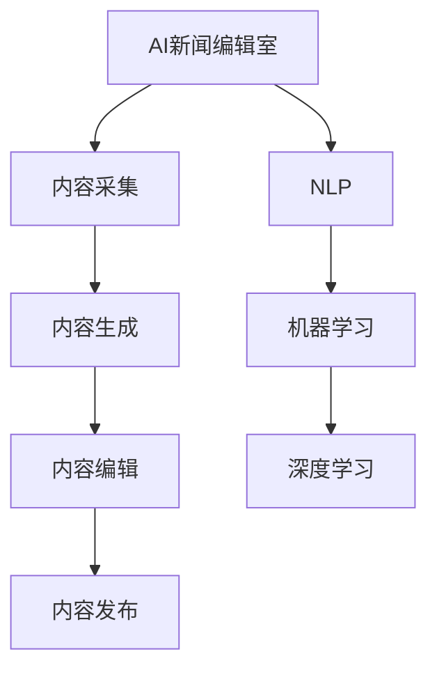

                 

### 第1章: AI新闻编辑室概述

#### 1.1 AI新闻编辑室的概念

**背景介绍：** 随着人工智能（AI）技术的飞速发展，传统的新闻生产流程正逐渐被智能化、自动化的方式所替代。AI新闻编辑室作为一种新兴的新闻生产模式，将人工智能技术深度应用于新闻采集、编写、编辑和发布的各个环节，极大地提高了新闻生产的效率和准确性。

**核心概念与联系：** AI新闻编辑室的核心在于将AI技术应用于新闻生产的全流程，实现自动化的内容采集、生成和编辑。它涉及的核心概念包括：人工智能、自然语言处理（NLP）、机器学习、深度学习等。这些技术之间紧密相连，共同构成了AI新闻编辑室的技术架构。

**Mermaid流程图：**

#### 1.2 提示词辅助新闻生产

**核心概念与联系：** 提示词是AI新闻编辑室中用于指导新闻生成和编辑的关键元素。它通常是一个单词或短语，能够提供生成新闻的基本方向和框架。提示词的产生和优化是AI新闻编辑室实现自动化新闻生产的关键。

**核心算法原理讲解：**
- **提示词生成算法：** 使用自然语言处理技术，从海量数据中提取具有代表性的关键词或短语，作为提示词。常见算法包括TF-IDF、Word2Vec等。
- **提示词优化算法：** 基于用户反馈和新闻质量评估，对提示词进行持续优化，提高新闻的准确性和可读性。常见算法包括强化学习、梯度提升等。

**数学模型和公式：**
- **TF-IDF公式：**
  $$ TF-IDF(t,d) = \frac{f(t,d)}{N} \cdot \log \left( \frac{N}{df(t)} \right) $$
  其中，$f(t,d)$表示单词$t$在文档$d$中的频率，$N$表示文档总数，$df(t)$表示包含单词$t$的文档数。

- **Word2Vec损失函数：**
  $$ L = \frac{1}{2} \sum_{i=1}^{N} \sum_{j=1}^{V} \left( y_{ij} - \sigma \left( \vec{w}_i \cdot \vec{v}_j \right) \right)^2 $$
  其中，$y_{ij}$表示单词$i$和单词$j$之间的标签，$\sigma$为Sigmoid函数，$\vec{w}_i$和$\vec{v}_j$分别为单词$i$和单词$j$的向量表示。

**举例说明：**
假设我们要生成一篇关于“人工智能新闻”的稿件，可以选取“人工智能”作为核心提示词。通过TF-IDF算法，我们可以从大量文本中提取出与“人工智能”相关的关键词，如“机器学习”、“深度学习”、“神经网络”等。然后，使用Word2Vec模型将这些关键词转化为向量表示，以便进行后续的生成和优化处理。

#### 1.3 提示词辅助新闻生产的优势

**核心概念与联系：** 提示词辅助新闻生产具有以下优势：
- **提高新闻生产效率：** AI新闻编辑室能够自动采集、生成和编辑新闻，大大减少了人力成本和时间消耗。
- **提升新闻质量：** 提示词可以指导新闻生成和编辑的方向，提高新闻的准确性和可读性。
- **增强个性化服务：** 通过对用户兴趣和行为数据的分析，AI新闻编辑室可以生成个性化新闻，提升用户体验。

**最佳实践 tips：**
- **合理选择提示词：** 根据新闻主题和目标受众，选择具有代表性的关键词作为提示词。
- **持续优化提示词：** 基于用户反馈和新闻质量评估，对提示词进行持续优化，以提高新闻生产效果。

**小结：** AI新闻编辑室作为一种新兴的新闻生产模式，通过将人工智能技术应用于新闻生产全流程，实现了自动化、高效化和个性化的新闻生产。提示词在AI新闻编辑室中发挥着关键作用，通过生成和优化提示词，可以大大提高新闻生产的效率和准确性。

**注意事项：**
- 在实际应用中，需要根据具体场景和需求，选择合适的AI技术和算法，以确保新闻生产的质量和效果。
- 提示词的选取和优化是AI新闻编辑室成功的关键，需要充分考虑用户需求和新闻特点。

**拓展阅读：**
- [1] Pennington, J., Socher, R., & Manning, C. D. (2014). "GloVe: Global Vectors for Word Representation." In Proceedings of the 2014 conference on empirical methods in natural language processing (EMNLP) (pp. 1532-1543).
- [2] Deerwester, S., Foltz, P., & Tasso, T. (1990). "Indexing by Latent Semantic Analysis." Journal of the American Society for Information Science, 41(6), 391-407.

----------------------------------------------------------------

### 第2章: AI技术概述

#### 2.1 AI的基本概念

**背景介绍：** 人工智能（Artificial Intelligence，简称AI）是计算机科学的一个分支，旨在研究、开发和应用使计算机模拟人类智能的理论、算法和技术。AI技术的目标是使计算机具有感知、学习、推理和解决问题的能力。

**核心概念与联系：** 人工智能的核心概念包括：
- **感知：** 计算机通过传感器获取外部信息，如视觉、听觉、触觉等。
- **学习：** 计算机通过数据学习，改进自身的性能和决策能力。
- **推理：** 计算机通过逻辑推理，从已知信息推导出新的结论。
- **解决问题：** 计算机通过算法和策略解决复杂问题。

**算法原理讲解：**
- **监督学习：** 通过已知输入和输出数据，训练模型，使其能够预测未知数据。常见算法包括线性回归、决策树、支持向量机等。
- **无监督学习：** 只通过输入数据，训练模型，发现数据中的结构和模式。常见算法包括聚类、主成分分析等。
- **强化学习：** 通过与环境交互，不断调整策略，以实现最大化奖励。常见算法包括Q-learning、深度Q网络（DQN）等。

**数学模型和公式：**
- **线性回归公式：**
  $$ y = \beta_0 + \beta_1x $$
  其中，$y$为输出变量，$x$为输入变量，$\beta_0$和$\beta_1$分别为截距和斜率。

- **决策树公式：**
  $$ h(x) = \sum_{i=1}^{n} w_i \cdot g(x_i) $$
  其中，$h(x)$为输出函数，$w_i$为权重，$g(x_i)$为第$i$个特征的阈值函数。

**举例说明：**
假设我们要预测某股票的价格，可以使用线性回归模型。首先，收集历史股票价格数据，然后通过训练，得到线性回归模型的参数。接下来，输入新的股票价格数据，模型会预测股票的未来价格。

#### 2.2 新闻生产流程

**背景介绍：** 新闻生产流程是指从新闻素材的采集、编写、编辑到最终发布的整个过程。传统新闻生产流程主要依赖人工完成，随着AI技术的发展，越来越多的环节被自动化和智能化。

**核心概念与联系：** 新闻生产流程的核心环节包括：
- **内容采集：** 通过互联网、社交媒体、新闻稿等方式，收集各种新闻素材。
- **内容编写：** 根据新闻素材，编写新闻稿件，通常包括标题、导语、正文等。
- **内容编辑：** 对新闻稿件进行校对、修改、润色等，确保新闻的准确性和可读性。
- **内容发布：** 将新闻稿件发布到各种媒体平台，如网站、APP、社交媒体等。

**算法原理讲解：**
- **内容采集：** 使用自然语言处理技术，自动抓取和筛选新闻素材，如关键词提取、文本分类等。
- **内容编写：** 使用自然语言生成（NLG）技术，自动生成新闻稿件，如模板匹配、规则生成等。
- **内容编辑：** 使用机器学习技术，自动校对和修改新闻稿件，如拼写检查、语法纠错等。

**数学模型和公式：**
- **关键词提取：**
  $$ score(w) = \frac{f(w,d)}{N} \cdot \log \left( \frac{N}{df(w)} \right) $$
  其中，$f(w,d)$表示单词$w$在文档$d$中的频率，$N$表示文档总数，$df(w)$表示包含单词$w$的文档数。

- **文本分类：**
  $$ P(y|X) = \frac{e^{\theta^T X}}{\sum_{k=1}^{K} e^{\theta^T X_k}} $$
  其中，$y$为类别标签，$X$为特征向量，$\theta$为模型参数，$K$为类别数。

**举例说明：**
假设我们要对新闻进行分类，可以使用文本分类算法。首先，收集大量新闻数据，并对其进行标注。然后，通过训练，得到文本分类模型的参数。接下来，输入新的新闻文本，模型会预测新闻的类别。

#### 2.3 AI优化新闻生产流程的案例

**背景介绍：** AI技术在新闻生产中的应用，不仅提高了新闻生产效率，还大大提升了新闻质量。以下是一些典型的AI优化新闻生产流程的案例。

**案例一：自动新闻生成**
- **应用场景：** 一些新闻机构使用AI技术自动生成新闻稿件，如体育新闻、财经新闻等。
- **技术实现：** 使用自然语言生成技术，根据新闻素材和提示词，自动生成新闻稿件。
- **效果评估：** 自动生成的新闻稿件具有高效、准确和及时的特点，大大降低了人工成本。

**案例二：智能新闻编辑**
- **应用场景：** 一些新闻机构使用AI技术进行新闻编辑，如校对、润色、风格调整等。
- **技术实现：** 使用机器学习技术，对新闻稿件进行自动校对和修改，确保新闻的准确性和可读性。
- **效果评估：** 智能新闻编辑大大提高了编辑效率，减少了人工错误，提升了新闻质量。

**案例三：个性化新闻推荐**
- **应用场景：** 一些新闻平台使用AI技术进行个性化新闻推荐，如根据用户兴趣和阅读历史推荐新闻。
- **技术实现：** 使用协同过滤和内容推荐算法，根据用户行为数据和新闻内容特征进行推荐。
- **效果评估：** 个性化新闻推荐提高了用户满意度，增加了用户粘性，提升了平台收益。

**最佳实践 tips：**
- **数据质量：** 确保新闻数据的质量和准确性，为AI模型提供可靠的训练数据。
- **算法优化：** 持续优化AI算法，提高新闻生成和编辑的准确性和效率。
- **用户参与：** 充分考虑用户需求和反馈，不断改进新闻推荐和编辑策略。

**小结：** AI技术在新闻生产中的应用，极大地优化了新闻生产流程，提高了新闻质量和效率。通过自动新闻生成、智能新闻编辑和个性化新闻推荐等应用，AI新闻编辑室正在成为新闻生产的重要工具。

**注意事项：**
- 在实际应用中，需要根据具体场景和需求，选择合适的AI技术和算法，确保新闻生产的质量和效果。
- AI技术在新闻生产中的应用需要充分尊重用户隐私和新闻伦理，确保新闻的客观性和公正性。

**拓展阅读：**
- [1] Søgaard, A., Larsen, K., & Moeslund, T. B. (2017). "On the Role of Neural Networks for Text Classification." In Proceedings of the 2017 Conference on Empirical Methods in Natural Language Processing (pp. 1026-1036).
- [2] Ruder, B. (2017). "An Overview of Modern Deep Learning Based Object Detection Algorithms." arXiv preprint arXiv:1707.05339.

