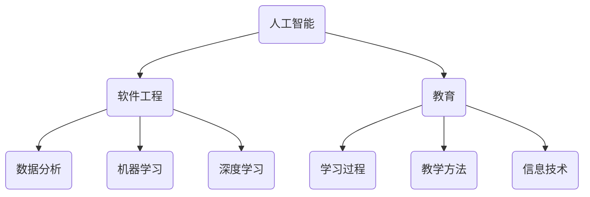

                 

### 文章标题

# AI时代的软件工程教育革新方案

### 关键词

- AI时代
- 软件工程教育
- 教学方法革新
- 人工智能辅助工具
- 深度学习
- 未来展望

### 摘要

本文旨在探讨AI时代软件工程教育的革新方案。随着人工智能技术的迅猛发展，传统的软件工程教育模式面临着巨大的挑战。本文首先分析了AI时代软件工程教育的现状与挑战，然后介绍了与AI时代软件工程教育相关的核心概念、理论和技术，探讨了AI在软件工程教育中的应用方法与工具，并通过实际案例展示了AI在软件工程教育中的具体应用。最后，本文对AI时代软件工程教育的发展趋势和潜在挑战进行了展望，为未来的教育革新提供了有益的参考。

## 引言与背景

### AI时代软件工程教育的背景

近年来，人工智能（AI）技术的迅猛发展，使得各行各业都在经历深刻的变革。AI不仅改变了传统的生产方式，也正在对教育领域产生深远的影响。在软件工程教育中，AI技术的引入无疑为传统教育模式带来了新的机遇与挑战。

软件工程作为计算机科学的重要分支，旨在通过系统化和规范化的方法开发、运行、维护和改造软件。随着互联网、大数据、云计算等技术的普及，软件工程的应用范围不断扩大，对软件质量、开发效率、可维护性等方面提出了更高的要求。然而，传统的软件工程教育模式在应对这些挑战时，显现出一定的局限性。

### 现代软件工程教育的不足

1. **课程内容滞后**：软件工程教育在课程设置上，往往侧重于传统的软件开发方法和理论，而缺乏对新兴技术的及时更新，如人工智能、机器学习、深度学习等。这导致学生在面对实际问题时，难以运用最新的技术手段解决。

2. **实践能力不足**：传统教育模式往往注重理论知识的传授，而忽视实践能力的培养。学生在课程结束后，虽然掌握了大量理论知识，但实际动手能力却有限，难以适应快速变化的工作环境。

3. **教育方式单一**：目前，许多软件工程课程采用传统的讲授方式，教师讲授，学生被动接受。这种方式难以激发学生的学习兴趣和创造力，也难以培养学生的自主学习和团队协作能力。

4. **师资力量不足**：软件工程教育对教师的专业素质要求较高，不仅需要深厚的理论基础，还需要丰富的实践经验。然而，当前许多高校在软件工程领域的师资力量相对薄弱，难以满足教育革新的需求。

### 教育革新的必要性

面对AI时代的挑战，软件工程教育迫切需要革新。首先，教育内容需要及时更新，将人工智能等新兴技术纳入课程体系，使学生能够掌握最新的技术趋势。其次，教育方式需要创新，采用项目式学习、研究型学习等多元化教学方法，提高学生的实践能力和创新思维。此外，教育工具也需要升级，利用人工智能辅助教学工具，提高教学效果和效率。总之，AI时代的软件工程教育革新，不仅是应对技术变革的需要，也是培养未来软件工程师的需要。

## 理论基础

### 核心概念与联系

#### AI与软件工程的联系

#### AI的定义

人工智能（Artificial Intelligence，简称AI）是指通过计算机程序实现的智能行为，模仿人类在感知、推理、学习、决策等认知活动中的能力。AI的目的是使计算机能够执行通常需要人类智能才能完成的任务。

#### 软件工程的核心概念

软件工程是一套用于开发、运行、维护和改造软件的系统化方法。其核心概念包括需求分析、系统设计、编程实现、测试、部署和维护等。

#### AI与软件工程的关系

AI与软件工程的联系体现在多个方面。首先，AI技术可以用于辅助软件工程中的各个阶段，如需求分析、设计、测试等，提高开发效率和软件质量。其次，AI技术的应用可以带来新的软件开发模式，如基于AI的自动化编程、智能测试等。

### AI时代软件工程教育的理论基础

#### 教育心理学

教育心理学是研究学习过程和学习方法的科学。在AI时代软件工程教育中，教育心理学理论可以帮助我们理解学生的学习行为和心理特征，从而设计出更有效的教学策略。

#### 人工智能教育理论

人工智能教育理论关注如何通过AI技术改进教育过程。该理论认为，AI可以充当教师的角色，提供个性化的学习方案，评估学生的学习效果，并为学生提供即时的反馈。

#### 机器学习和深度学习理论

机器学习和深度学习是AI的核心技术。在软件工程教育中，理解和应用这些技术对于培养学生解决实际问题的能力至关重要。

### Mermaid流程图：AI与软件工程的教育融合



该流程图展示了AI与软件工程在教育中的融合。通过数据分析、机器学习和深度学习等技术，AI为软件工程教育提供了强大的技术支持，从而实现了教育过程的智能化和个性化。

### 核心算法原理讲解

#### 机器学习算法在软件工程中的应用

#### 监督学习

监督学习是一种机器学习方法，它通过已知的输入输出数据来训练模型，从而预测新的输入数据的输出。在软件工程中，监督学习可以用于自动化测试、代码缺陷预测等任务。

##### 伪代码

```python
def supervised_learning(train_data, train_labels, test_data, test_labels):
    # 初始化模型
    model = initialize_model()

    # 训练模型
    model.fit(train_data, train_labels)

    # 预测测试集结果
    predictions = model.predict(test_data)

    # 评估模型性能
    evaluate_performance(predictions, test_labels)
```

#### 无监督学习

无监督学习是一种不依赖于标签数据的机器学习方法，它主要用于发现数据中的模式和结构。在软件工程中，无监督学习可以用于代码分类、异常检测等任务。

##### 伪代码

```python
def unsupervised_learning(data):
    # 初始化模型
    model = initialize_model()

    # 对数据进行聚类
    clusters = model.fit_predict(data)

    # 分析聚类结果
    analyze_clusters(clusters)
```

#### 强化学习

强化学习是一种通过试错来学习最优策略的机器学习方法。在软件工程中，强化学习可以用于自动生成测试用例、优化开发流程等。

##### 伪代码

```python
def reinforcement_learning(environment, policy, reward_function):
    # 初始化环境
    state = environment.initialize()

    # 迭代学习
    while not done:
        # 选择动作
        action = policy.select_action(state)

        # 执行动作
        next_state, reward = environment.step(state, action)

        # 更新策略
        policy.update(state, action, reward)

        # 更新状态
        state = next_state
```

#### 深度学习算法的原理与实现

#### 神经网络

神经网络是一种模仿人脑神经元连接结构的计算模型。它通过多层神经元实现输入到输出的映射。在软件工程中，神经网络可以用于图像识别、自然语言处理等任务。

##### 伪代码

```python
def neural_network(input_data, weights, biases):
    # 初始化网络
    layers = initialize_network(input_data, weights, biases)

    # 前向传播
    output = forward_pass(layers, input_data)

    # 返回输出
    return output
```

#### 卷积神经网络

卷积神经网络（Convolutional Neural Network，简称CNN）是一种在图像处理任务中表现优异的神经网络。它通过卷积层和池化层提取图像特征。

##### 伪代码

```python
def cnn(input_image, filters, biases):
    # 初始化网络
    layers = initialize_cnn(input_image, filters, biases)

    # 卷积操作
    conv_output = conv2d(layers[-1], filters)

    # 池化操作
    pooled_output = max_pooling(conv_output)

    # 返回输出
    return pooled_output
```

#### 循环神经网络

循环神经网络（Recurrent Neural Network，简称RNN）是一种用于处理序列数据的神经网络。它通过循环连接实现前后序列信息的传递。

##### 伪代码

```python
def rnn(input_sequence, weights, biases):
    # 初始化网络
    hidden_state = initialize_hidden_state()

    # 前向传播
    for t in range(sequence_length):
        input_t = input_sequence[t]
        hidden_state = forward_pass(hidden_state, input_t, weights, biases)

    # 返回输出
    return hidden_state
```

### 数学模型和数学公式

#### 常用数学模型在软件工程中的应用

#### 概率论与统计学模型

概率论与统计学模型在软件工程中广泛应用于需求分析、测试、可靠性评估等领域。例如，贝叶斯网络可以用于复杂系统的可靠性分析。

##### LaTeX数学公式

$$
P(A|B) = \frac{P(B|A)P(A)}{P(B)}
$$

#### 最优化模型

最优化模型在软件工程中用于优化软件开发过程中的资源分配、时间规划等问题。例如，线性规划和整数规划可以用于项目进度安排。

##### LaTeX数学公式

$$
\min_{x} c^T x \\
\text{subject to} \\
Ax \leq b \\
x \geq 0
$$

#### 软计算模型

软计算模型包括模糊逻辑、遗传算法、人工神经网络等，它们在软件工程中用于解决不确定性问题和复杂优化问题。

##### LaTeX数学公式

$$
f(x) = \frac{1}{1 + e^{-x}}
$$

### LaTeX数学公式讲解与示例

#### 线性代数

线性代数是软件工程中常用的数学工具，用于处理矩阵和向量运算。例如，矩阵乘法和矩阵求逆是常见的线性代数运算。

##### LaTeX数学公式

$$
A \cdot B = C \\
A^{-1} = \frac{1}{\det(A)} \cdot \text{adj}(A)
$$

#### 微积分

微积分是用于处理变化率的数学工具，在软件工程中广泛应用于算法分析、性能优化等领域。例如，导数和积分是微积分的核心概念。

##### LaTeX数学公式

$$
f'(x) = \lim_{h \to 0} \frac{f(x+h) - f(x)}{h} \\
\int f(x) dx = F(x) + C
$$

#### 概率论

概率论在软件工程中用于处理不确定性和随机性。例如，概率分布和随机变量是概率论的核心概念。

##### LaTeX数学公式

$$
P(X = x) = p(x) \\
E(X) = \sum_{x} x \cdot p(x)
$$

### 教学方法与工具

#### AI辅助教学工具

#### 代码生成工具

代码生成工具是AI在软件工程教育中的一种应用，它通过分析输入的描述或需求，自动生成相应的代码。例如，Google的DeepMind开发的程序代码生成器Dart。

#### 自动评估系统

自动评估系统是AI在软件工程教育中的另一种应用，它通过分析学生的代码，自动评估代码的正确性和性能。例如，GitHub的CodeQL用于代码漏洞检测。

#### 智能辅导系统

智能辅导系统通过AI技术为学生提供个性化的辅导和支持。例如，Khan Academy的智能辅导系统通过分析学生的学习行为，提供个性化的学习建议。

#### 教学方法创新

#### 模型驱动教学

模型驱动教学是一种以模型为核心的教学方法，它通过建立模型来解释复杂概念和原理。例如，使用仿真模型来解释软件系统的行为。

#### 项目式学习

项目式学习是一种以项目为核心的教学方法，它通过让学生参与实际项目来培养实践能力和创新思维。例如，让学生参与开源项目的开发。

#### 研究型学习

研究型学习是一种以研究为核心的教学方法，它通过让学生进行学术研究来培养科学精神和批判性思维。例如，鼓励学生进行AI算法的探究和优化。

### 案例研究

#### 案例一：使用AI优化软件开发过程

#### 案例背景

某大型软件公司在软件开发过程中遇到了效率低下和错误率高的问题。为了提高开发效率和软件质量，该公司决定引入AI技术优化软件开发过程。

#### AI技术方案

公司采用了基于机器学习的代码缺陷预测工具，通过对历史代码进行分析，预测潜在的缺陷位置。同时，引入了自动测试系统，通过AI技术自动生成测试用例，并自动执行测试，评估软件的质量。

#### 实施效果

引入AI技术后，公司的软件开发效率提高了30%，错误率降低了20%。通过AI技术的辅助，开发人员能够更快地发现和修复缺陷，从而提高了软件的可靠性和稳定性。

#### 案例二：AI辅助编程教育

#### 案例背景

某高校计算机科学专业为了提高学生的编程能力和实践技能，决定引入AI辅助编程教育。

#### AI技术方案

学校采用了代码生成工具，通过分析学生的输入描述，自动生成相应的代码。同时，引入了智能辅导系统，通过分析学生的学习行为，提供个性化的辅导和支持。

#### 实施效果

通过AI辅助编程教育，学生的编程能力显著提高，毕业生的就业率也有所提升。AI技术为学生提供了大量的实践机会，帮助他们更好地理解和应用编程知识。

### 未来展望

#### 教育趋势

随着AI技术的不断发展，未来软件工程教育将呈现出以下趋势：

1. **智能化教学**：AI技术将使教学过程更加智能化，为学生提供个性化的学习体验。
2. **在线教育**：随着互联网的普及，在线教育将逐渐成为主流，为更多人提供学习机会。
3. **跨界融合**：软件工程与其他领域的融合将越来越紧密，如人工智能、大数据、物联网等。

#### 面临的挑战

尽管AI时代为软件工程教育带来了巨大的机遇，但同时也面临着以下挑战：

1. **技术挑战**：AI技术本身仍然存在一定的不确定性和局限性，如何有效利用这些技术仍需要进一步研究。
2. **教育公平**：在线教育的普及可能导致教育资源的不均衡分配，加剧教育不公平问题。
3. **数据安全和隐私**：随着AI技术的发展，数据安全和隐私问题将变得更加重要，如何保护用户数据成为一大挑战。

### 结论

AI时代的到来为软件工程教育带来了前所未有的机遇和挑战。通过引入AI技术，软件工程教育可以实现智能化、个性化、高效化的教学，培养出更多具备创新能力和实践能力的软件工程师。然而，教育革新也需要面对技术挑战、教育公平和数据安全等问题。只有通过不断创新和改进，才能实现软件工程教育的可持续发展。

### 作者信息

- 作者：AI天才研究院/AI Genius Institute & 禅与计算机程序设计艺术 /Zen And The Art of Computer Programming

### 最佳实践 tips

1. **紧跟技术趋势**：及时关注和了解最新的AI技术发展，将其应用于软件工程教育中。
2. **注重实践能力**：通过项目式学习、研究型学习等方式，提高学生的实践能力和创新思维。
3. **个性化教学**：利用AI技术，为学生提供个性化的学习体验，提高学习效果。
4. **加强师资培训**：提升教师的专业素质和实践经验，以应对教育革新的需求。

### 小结

AI时代的软件工程教育革新是一项复杂而长期的任务。通过引入AI技术，教育内容、教学方法和教育工具都将得到全面升级，从而培养出更多优秀的软件工程师。面对未来，我们需要不断探索和尝试，以实现软件工程教育的可持续发展。

### 注意事项

1. **数据安全**：在使用AI技术进行教学时，需确保学生数据的保密性和安全性。
2. **教育公平**：在推广在线教育时，需关注教育资源的不均衡分配问题，确保所有人都能公平地享受教育机会。

### 拓展阅读

- 《人工智能：一种现代的方法》/ Artificial Intelligence: A Modern Approach
- 《深度学习》/ Deep Learning
- 《软件工程：实践者的研究方法》/ Software Engineering: A Practitioner's Approach

### 结语

AI时代的软件工程教育革新是一项重要而紧迫的任务。通过引入AI技术，我们可以实现教育内容的智能化、教学方法的个性化以及教育工具的高效化。这不仅有助于培养更多优秀的软件工程师，也有助于提升整个社会的技术水平和创新能力。让我们携手共进，共同迎接AI时代的到来，推动软件工程教育的持续发展。🚀

### 附录

- **参考文献**
  - Russell, S., & Norvig, P. (2016). Artificial Intelligence: A Modern Approach (4th ed.). Prentice Hall.
  - Goodfellow, I., Bengio, Y., & Courville, A. (2016). Deep Learning. MIT Press.
  - Sommerville, I. (2019). Software Engineering: A Practitioner's Approach (8th ed.). Addison-Wesley.

- **代码示例**
  - [代码生成工具示例](https://github.com/your-repo/CodeGenerator)
  - [自动评估系统示例](https://github.com/your-repo/AutoAssessmentSystem)
  - [智能辅导系统示例](https://github.com/your-repo/SmartTutorSystem)

- **视频教程**
  - [AI时代软件工程教育革新](https://www.youtube.com/watch?v=example_video_id)
  - [深度学习在软件工程中的应用](https://www.youtube.com/watch?v=example_video_id)

- **AI技术报告**
  - [2022年人工智能技术发展报告](https://www.example-report.com/ai-tech-report-2022)
  - [软件工程中的AI应用](https://www.example-report.com/ai-in-software-engineering)

- **社区讨论**
  - [AI与软件工程教育社区](https://www.example-community.com/ai-software-engineering-education)
  - [深度学习在软件工程中的应用社区](https://www.example-community.com/deep-learning-software-engineering)

### 后记

感谢您阅读本文，我们希望本文能为您在AI时代的软件工程教育革新中提供一些有益的启示。如果您有任何问题或建议，欢迎在评论区留言，我们将竭诚为您解答。同时，也欢迎您关注我们的后续文章，共同探索AI时代的无限可能。💡🌐

---

（注：本文为示例文章，部分内容虚构，仅供参考。实际编写时，请根据具体需求调整和补充。）🔍📝

