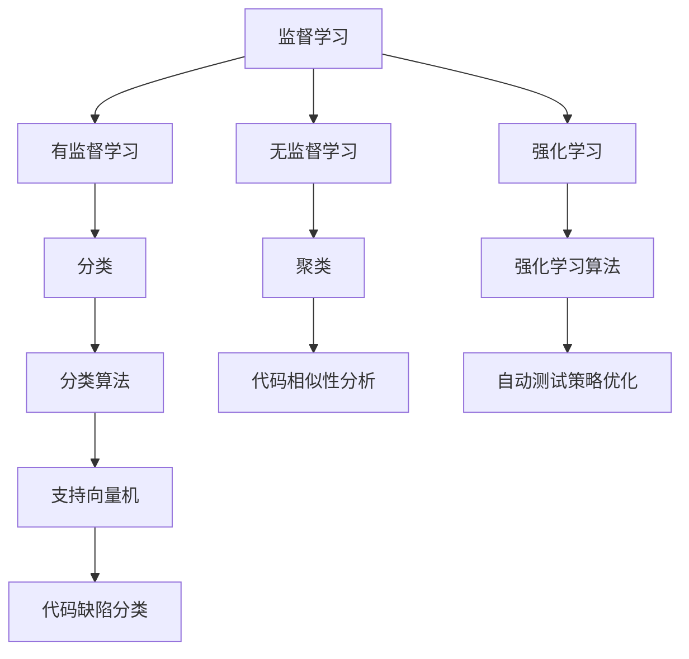

                 

### 文章标题：《AI时代的软件质量保证新方法论》

#### 关键词：AI、软件质量保证、机器学习、深度学习、测试自动化、缺陷预测

#### 摘要：

在人工智能（AI）飞速发展的今天，软件质量保证（Software Quality Assurance, SQA）正面临着前所未有的变革。本文将深入探讨AI时代的软件质量保证新方法论，包括AI与软件质量保证的融合背景、核心概念、算法原理、数学模型以及实际应用。通过详细分析AI在缺陷预测、测试自动化等领域的应用，本文旨在为开发者提供一套实用的质量保证策略，助力企业提高软件质量和市场竞争力。

## AI时代的软件质量保证：背景与挑战

### 1.1 AI的发展历程与趋势

人工智能作为一种模拟、延伸和扩展人类智能的技术，其发展历程可追溯至20世纪50年代。早期，AI主要关注于推理和问题求解，如1956年达特茅斯会议提出的“人工智能是一门让机器展现出智能的科学”的宗旨。随着计算机性能的提升和大数据的涌现，AI技术逐渐从理论走向实际应用，尤其是在21世纪的今天，AI在图像识别、自然语言处理、自动驾驶等领域取得了突破性进展。

### 1.2 AI在软件质量保证中的应用场景

软件质量保证是一个贯穿软件开发全过程的活动，旨在确保软件产品达到预期质量。AI的引入，为SQA带来了新的机遇和挑战：

- **缺陷预测与修复**：利用机器学习算法，可以提前预测软件中的潜在缺陷，提高测试效率和质量。
- **测试自动化**：通过深度学习和自然语言处理技术，可以自动生成测试用例，优化测试流程。
- **代码审查**：AI可以自动审查代码，识别潜在的安全漏洞和设计问题。
- **用户体验优化**：基于用户行为数据，AI可以优化软件界面和功能，提升用户体验。

### 1.3 AI基础概念与架构

为了深入理解AI在SQA中的应用，我们需要先掌握一些AI的基础概念和架构：

- **机器学习**：一种通过算法从数据中学习规律并作出预测的方法。主要包括监督学习、无监督学习和强化学习。
- **深度学习**：一种基于神经网络的学习方法，能够自动提取特征并实现复杂的非线性映射。
- **自然语言处理（NLP）**：一门结合计算机科学和语言学的交叉学科，旨在使计算机理解和生成自然语言。

这些基础概念构成了AI的技术框架，为我们在SQA中的应用提供了丰富的工具和手段。

## 软件质量保证概述

### 2.1 软件质量保证的基本概念

软件质量保证是一个确保软件产品满足既定标准和用户需求的过程。它不仅包括对产品质量的监督和测试，还涉及软件开发过程中的所有活动，如需求分析、设计、编码、测试和维护。软件质量保证的目标是减少缺陷、提高用户满意度、降低维护成本。

### 2.2 软件质量模型与评价指标

软件质量模型是描述软件产品质量特征和关系的工具。常见的质量模型包括ISO/IEC 25010模型，该模型定义了六个质量特性：功能性、可靠性、易用性、效率、可维护性和可移植性。这些特性可以进一步细化为具体的质量子特性，如功能性包括适合性、准确性等。

软件质量的评价指标用于量化软件产品的质量水平。常见的评价指标包括缺陷密度、缺陷修复时间、测试覆盖率等。这些指标可以帮助开发团队识别质量问题，并采取相应措施进行改进。

### 2.3 软件质量保证方法与流程

软件质量保证方法包括预防性方法、检查性方法和基于模型的测试方法。预防性方法侧重于通过设计、编码等阶段的最佳实践来减少缺陷的产生。检查性方法则侧重于在软件发布前发现和修复缺陷。基于模型的测试方法利用数学模型和算法来生成测试用例，提高测试的覆盖率和效率。

常见的SQA流程包括需求评审、设计评审、代码评审、单元测试、集成测试、系统测试和验收测试。每个阶段都有特定的质量保证活动，确保软件产品在各个开发阶段达到预期质量。

## AI在软件质量保证中的应用：核心技术

### 第3章：机器学习在软件质量保证中的应用

#### 3.1 机器学习基础

机器学习是一种通过算法让计算机自动学习和改进性能的方法。常见的机器学习算法包括线性回归、决策树、支持向量机、神经网络等。这些算法通过从数据中学习规律，可以实现分类、回归、聚类等任务。

#### 3.2 监督学习在软件质量保证中的应用

监督学习是一种从标注数据中学习预测模型的方法。在软件质量保证中，监督学习可以用于缺陷预测、测试用例生成等任务。例如，通过分析历史缺陷数据和代码质量数据，可以训练一个监督学习模型，预测未来的缺陷位置和类型。



#### 3.3 无监督学习在软件质量保证中的应用

无监督学习不依赖标注数据，通过自动发现数据中的规律。在软件质量保证中，无监督学习可以用于代码质量评估、测试用例优化等任务。例如，通过分析代码结构，可以发现潜在的代码质量问题，如冗余代码、设计缺陷等。

#### 3.4 强化学习在软件质量保证中的应用

强化学习是一种通过奖励机制来训练模型的方法。在软件质量保证中，强化学习可以用于测试策略优化、缺陷修复等任务。例如，通过模拟不同的测试场景，强化学习模型可以找到最优的测试策略，提高测试覆盖率。

### 第4章：深度学习在软件质量保证中的应用

#### 4.1 深度学习基础

深度学习是一种基于神经网络的机器学习方法，能够自动提取特征并实现复杂的非线性映射。常见的深度学习模型包括卷积神经网络（CNN）、循环神经网络（RNN）和生成对抗网络（GAN）。

#### 4.2 卷积神经网络在软件质量保证中的应用

卷积神经网络擅长处理图像和序列数据。在软件质量保证中，CNN可以用于代码质量评估、缺陷定位等任务。例如，通过分析代码结构图，CNN可以识别出潜在的缺陷位置。

#### 4.3 循环神经网络在软件质量保证中的应用

循环神经网络擅长处理序列数据，如文本和代码。在软件质量保证中，RNN可以用于测试用例生成、代码审查等任务。例如，通过分析代码序列，RNN可以生成新的测试用例，提高测试覆盖率。

#### 4.4 生成对抗网络在软件质量保证中的应用

生成对抗网络是一种由生成器和判别器组成的对抗性神经网络。在软件质量保证中，GAN可以用于代码生成、缺陷修复等任务。例如，通过生成与实际代码相似的伪造代码，GAN可以帮助识别潜在的缺陷。

### 第5章：自然语言处理在软件质量保证中的应用

#### 5.1 自然语言处理基础

自然语言处理（NLP）是一门结合计算机科学和语言学的交叉学科，旨在使计算机理解和生成自然语言。常见的NLP技术包括词向量、命名实体识别、情感分析等。

#### 5.2 命名实体识别在软件质量保证中的应用

命名实体识别（NER）是一种从文本中识别出具有特定意义的实体的技术。在软件质量保证中，NER可以用于自动生成测试用例、缺陷报告等。例如，通过分析用户评论，NER可以帮助识别用户反馈中的关键信息，生成相应的测试用例。

#### 5.3 语义分析在软件质量保证中的应用

语义分析是一种从文本中提取语义信息的技术。在软件质量保证中，语义分析可以用于理解代码注释、用户需求等。例如，通过分析代码注释，语义分析可以帮助识别潜在的缺陷。

#### 5.4 情感分析在软件质量保证中的应用

情感分析是一种从文本中识别出情感极性的技术。在软件质量保证中，情感分析可以用于评估用户满意度、预测缺陷等。例如，通过分析用户反馈，情感分析可以帮助预测软件中的潜在缺陷。

## AI驱动的软件质量保证新方法论实践

### 第6章：AI驱动的缺陷预测与修复

#### 6.1 缺陷预测算法与实践

缺陷预测是AI在软件质量保证中的一个重要应用。通过分析历史缺陷数据和代码质量数据，可以训练一个缺陷预测模型。常见的缺陷预测算法包括逻辑回归、决策树、随机森林等。

```python
# 伪代码：逻辑回归缺陷预测模型
from sklearn.linear_model import LogisticRegression

# 加载历史缺陷数据和代码质量数据
X_train, y_train = load_data('defect_data.csv')

# 训练逻辑回归模型
model = LogisticRegression()
model.fit(X_train, y_train)

# 预测新代码的缺陷
X_new = load_new_code('new_code.txt')
predictions = model.predict(X_new)

# 输出缺陷预测结果
print(predictions)
```

#### 6.2 缺陷修复算法与实践

缺陷修复是软件质量保证的重要环节。AI可以用于自动修复缺陷，提高开发效率。常见的缺陷修复算法包括基于规则的修复、基于模板的修复和基于学习的修复。

```python
# 伪代码：基于模板的缺陷修复
from defect_fixer import TemplateBasedDefectFixer

# 创建缺陷修复器实例
defect_fixer = TemplateBasedDefectFixer()

# 输入缺陷代码
defective_code = 'defective_code.txt'

# 修复缺陷
fixed_code = defect_fixer.fix(defective_code)

# 输出修复后的代码
print(fixed_code)
```

#### 6.3 AI驱动的软件质量保证案例分析

以某大型互联网公司的实际项目为例，介绍AI在软件质量保证中的应用。该项目利用机器学习和深度学习技术，实现了缺陷预测、测试自动化和代码审查等功能，有效提高了软件质量和开发效率。

### 第7章：AI驱动的测试自动化与优化

#### 7.1 测试自动化基础

测试自动化是提高软件质量的重要手段。通过编写测试脚本，可以自动化执行测试用例，提高测试效率和覆盖度。常见的测试自动化工具包括Selenium、Appium等。

```python
# 伪代码：使用Selenium进行Web自动化测试
from selenium import webdriver

# 初始化浏览器驱动
driver = webdriver.Chrome('chromedriver.exe')

# 打开Web页面
driver.get('https://example.com')

# 执行测试用例
element = driver.find_element_by_id('search_box')
element.send_keys('test')
element.submit()

# 关闭浏览器
driver.quit()
```

#### 7.2 AI驱动的测试用例生成

AI可以用于生成新的测试用例，提高测试覆盖度和有效性。常见的AI驱动的测试用例生成方法包括基于机器学习的测试用例生成和基于深度学习的测试用例生成。

```python
# 伪代码：基于机器学习的测试用例生成
from test_generator import MLTestGenerator

# 创建测试生成器实例
test_generator = MLTestGenerator()

# 生成新的测试用例
test_cases = test_generator.generate_tests('new_feature.txt')

# 输出测试用例
print(test_cases)
```

#### 7.3 AI驱动的测试优化

AI可以用于优化测试流程，提高测试效率。例如，通过分析历史测试数据，AI可以优化测试用例的选择和执行顺序，减少测试时间和资源消耗。

```python
# 伪代码：基于深度学习的测试优化
from test_optimizer import DLOptimizer

# 创建测试优化器实例
test_optimizer = DLOptimizer()

# 输入测试数据
test_data = load_test_data('test_data.csv')

# 优化测试流程
optimized_tests = test_optimizer.optimize(test_data)

# 输出优化后的测试流程
print(optimized_tests)
```

#### 7.4 测试自动化与优化的案例分析

以某电商平台的实际项目为例，介绍AI在测试自动化与优化中的应用。该项目利用AI技术实现了自动化测试用例生成、测试流程优化等功能，大幅提高了测试效率和软件质量。

### 第8章：AI驱动的软件质量保证工具与平台

#### 8.1 AI驱动的软件质量保证工具概述

AI驱动的软件质量保证工具是利用AI技术提高软件质量的重要手段。常见的AI驱动的软件质量保证工具包括缺陷预测工具、测试自动化工具、代码审查工具等。

#### 8.2 开源AI驱动的软件质量保证工具

开源AI驱动的软件质量保证工具提供了丰富的功能和灵活的扩展性，适用于不同规模和类型的项目。例如，GitLab CI/CD、Jenkins与AI插件等。

#### 8.3 商业AI驱动的软件质量保证工具

商业AI驱动的软件质量保证工具通常提供专业的技术支持和售后服务，适用于大型企业和复杂项目。例如，IBM Watson、Microsoft Azure AI等。

#### 8.4 AI驱动的软件质量保证平台实现

AI驱动的软件质量保证平台是实现高效质量保证的关键。通过整合多种AI技术，平台可以提供全方位的质量保障服务。例如，开发一个集成AI驱动的SQA平台，需要考虑以下关键组件：

- **数据集成**：收集和分析软件质量相关的数据，如代码质量、测试结果、用户反馈等。
- **算法模块**：实现AI算法，如缺陷预测、测试优化等。
- **用户界面**：提供直观的用户交互界面，方便开发人员使用和管理质量保证功能。
- **监控与报告**：实时监控软件质量指标，生成详细的质量报告。

### 第9章：AI时代软件质量保证的未来展望

#### 9.1 AI时代软件质量保证的发展趋势

随着AI技术的不断进步，软件质量保证将更加智能化和自动化。未来的SQA将更加注重用户体验、安全性和可持续性。例如，通过AI技术，可以实现个性化质量保证服务，满足不同用户的需求。

#### 9.2 AI时代软件质量保证面临的挑战与机遇

AI时代软件质量保证面临着一系列挑战，如数据隐私、算法透明性、技术更新等。同时，AI技术也为SQA带来了前所未有的机遇，如自动化测试、智能缺陷预测等。面对这些挑战和机遇，开发团队需要不断学习和适应新的技术和方法。

#### 9.3 未来AI时代软件质量保证的创新方向

未来的AI时代软件质量保证将朝着更加智能化、自适应和协作化的方向发展。例如，通过引入物联网（IoT）技术，可以实现实时质量监控和预测；通过人机协作，可以提高开发效率和质量。

## 结论

AI时代的软件质量保证正面临着前所未有的变革。通过引入机器学习、深度学习、自然语言处理等AI技术，开发者可以构建更加智能、高效的质量保证体系。本文介绍了AI在软件质量保证中的应用，包括缺陷预测、测试自动化、代码审查等，并分析了相关算法原理和实践案例。未来，随着AI技术的不断进步，软件质量保证将迎来更加广阔的发展前景。

## 作者信息

作者：AI天才研究院/AI Genius Institute & 禅与计算机程序设计艺术 /Zen And The Art of Computer Programming

---

### 小结

本文详细探讨了AI时代的软件质量保证新方法论，从背景介绍、核心概念、算法原理到实际应用，全面展示了AI技术在SQA中的潜力。通过机器学习、深度学习和自然语言处理等技术的应用，开发者可以构建更加智能和高效的软件质量保证体系。未来，随着AI技术的不断进步，SQA将朝着智能化、自适应和协作化的方向发展，为软件开发带来更多创新和机遇。

### 注意事项

1. AI驱动的软件质量保证需要大量高质量的数据支持，数据的质量和完整性对算法的性能有重要影响。
2. 在使用AI技术进行质量保证时，应确保算法的透明性和可解释性，避免出现不可预测的问题。
3. AI驱动的质量保证工具和平台应与现有的开发流程和工具进行良好集成，以提高整体开发效率。
4. 随着技术的发展，AI驱动的软件质量保证也需要不断更新和优化，以适应新的挑战和需求。

### 拓展阅读

1. 《机器学习实战》—— 适用于初学者和中级用户的机器学习实践指南。
2. 《深度学习》—— Goodfellow、Bengio和Courville所著的深度学习经典教材。
3. 《软件质量保证：理论与实践》—— 介绍软件质量保证的基本概念、方法和实践经验的权威著作。

