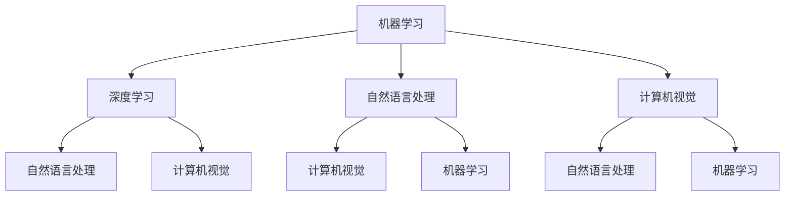

                 


### 文章标题: AI编程2.0的技能图谱与课程设计

### 关键词:
- AI编程2.0
- 技能图谱
- 课程设计
- 机器学习
- 深度学习
- 自然语言处理
- 计算机视觉

### 摘要:
本文深入探讨AI编程2.0的技能图谱与课程设计。首先，介绍AI编程2.0的概念及其与传统AI编程的区别。接着，详细阐述AI编程2.0的核心技能，包括机器学习、深度学习、自然语言处理和计算机视觉。然后，讨论课程设计与实践，包括课程设计原则、案例分析以及教学资源与工具。最后，分析AI编程2.0的未来发展趋势，并提出最佳实践与注意事项。本文旨在为读者提供一份全面、系统的AI编程2.0学习指南。

---

## 引言

随着人工智能（AI）技术的飞速发展，编程领域正经历着一场深刻的变革。从传统的AI编程1.0时代，到如今备受期待的AI编程2.0时代，技术的进步不仅改变了编程的方式，也极大地拓展了编程的应用场景。本文旨在探讨AI编程2.0的技能图谱与课程设计，为广大学子提供一条清晰、可行的学习路径。

### AI编程1.0与2.0的区别

AI编程1.0时代，主要是基于规则和符号逻辑的编程，其代表性技术包括专家系统、逻辑推理和知识表示。在这一阶段，编程更多依赖于人类专家的经验和知识，系统的自适应能力较弱，难以处理复杂、多变的环境。

而AI编程2.0则是在深度学习、机器学习和自然语言处理等技术基础上发展起来的。它强调数据的自动学习与模型优化，使得计算机能够自主地从海量数据中提取知识，并应用这些知识解决实际问题。AI编程2.0的核心在于构建能够自我进化的系统，从而实现更高的智能化和自动化。

### AI编程2.0的背景与挑战

AI编程2.0的兴起，源于大数据和计算能力的迅猛提升。随着互联网的普及和数据量的爆炸性增长，传统的编程模式已无法满足日益复杂的应用需求。AI编程2.0通过引入深度学习、强化学习等先进技术，使得计算机具备了更强的自我学习和自适应能力，从而在图像识别、自然语言处理、医疗诊断等领域取得了显著成果。

然而，AI编程2.0也带来了新的挑战。一方面，技术的复杂度大幅提升，开发者需要掌握更多的知识；另一方面，应用场景的多样性使得编程变得更为复杂。如何设计一个高效、可行的课程体系，培养出适应AI编程2.0时代的优秀人才，成为了教育领域亟待解决的问题。

### 本文结构

本文将首先介绍AI编程2.0的核心技能，包括机器学习、深度学习、自然语言处理和计算机视觉。接着，详细讨论课程设计与实践，涵盖课程设计原则、案例分析以及教学资源与工具。最后，分析AI编程2.0的未来发展趋势，并提出最佳实践与注意事项。希望通过本文，为读者提供一份全面、系统的AI编程2.0学习指南。

---

## AI编程2.0的核心技能

AI编程2.0的核心技能包括机器学习、深度学习、自然语言处理和计算机视觉。这些技能不仅构成了AI编程2.0的技术基础，也是未来智能应用的重要支撑。在本节中，我们将逐一介绍这些核心技能，并探讨它们之间的相互关系。

### 机器学习

机器学习是AI编程2.0的基础，它通过算法让计算机从数据中自动学习和优化。机器学习的过程包括数据收集、数据预处理、模型训练、模型评估和模型部署。

- **核心概念与联系：**

  机器学习的核心概念包括监督学习、无监督学习和强化学习。监督学习依赖于标注数据进行模型训练，适用于分类和回归问题。无监督学习则无需标注数据，通过数据自身的特征进行聚类和降维。强化学习则通过试错和反馈机制，使得模型能够在复杂环境中进行决策。

  **Mermaid 流程图：**

  ```mermaid
  graph TD
  A[数据收集] --> B[数据预处理]
  B --> C[模型训练]
  C --> D[模型评估]
  D --> E[模型部署]
  ```

- **核心算法原理讲解：**

  常见的机器学习算法包括线性回归、逻辑回归、支持向量机（SVM）、决策树、随机森林等。以下以线性回归为例，使用伪代码进行详细阐述：

  ```python
  # 线性回归伪代码
  def linear_regression(X, y):
      # 计算权重 w
      w = (X'X)^(-1)X'y
      # 预测函数
      def predict(x):
          return x * w
      return predict
  ```

- **数学模型与公式：**

  线性回归的目标是最小化预测值与实际值之间的误差平方和，其数学模型为：

  $$y = Xw + \epsilon$$

  其中，$X$ 为特征矩阵，$w$ 为权重向量，$\epsilon$ 为误差项。

- **举例说明：**

  假设我们有一个简单的一元线性回归问题，特征矩阵 $X$ 为 [1, 2, 3]，实际值 $y$ 为 [1, 2, 3]。使用线性回归算法求解权重 $w$，并计算预测值。

  ```python
  X = np.array([[1], [2], [3]])
  y = np.array([1, 2, 3])

  w = np.linalg.inv(X.T.dot(X)).dot(X.T).dot(y)
  print("权重 w:", w)

  predict = linear_regression(X, y)
  print("预测值:", predict([1, 2, 3]))
  ```

### 深度学习

深度学习是AI编程2.0的重要组成部分，它通过构建多层的神经网络模型，实现更复杂的特征提取和模型优化。深度学习包括卷积神经网络（CNN）、循环神经网络（RNN）和生成对抗网络（GAN）等。

- **核心概念与联系：**

  深度学习的核心概念包括神经元、激活函数、损失函数和优化算法。神经元是神经网络的基本单元，通过加权求和并应用激活函数，实现非线性变换。损失函数用于衡量模型预测值与实际值之间的误差，优化算法用于调整模型参数，以最小化损失函数。

  **Mermaid 流程图：**

  ```mermaid
  graph TD
  A[输入层] --> B[隐藏层]
  B --> C[输出层]
  C --> D[损失函数]
  ```

- **核心算法原理讲解：**

  以卷积神经网络（CNN）为例，使用伪代码进行详细阐述：

  ```python
  # 卷积神经网络伪代码
  def convolutional_neural_network(X, W):
      # 卷积层
      def convolve(x, w):
          return (x * w).sum()

      # 池化层
      def pool(x):
          return max(x)

      # 激活函数
      def activation(x):
          return sigmoid(x)

      # 神经网络模型
      z = convolve(X, W)
      a = activation(z)
      p = pool(a)
      return p
  ```

- **数学模型与公式：**

  卷积神经网络的核心数学模型为卷积操作和激活函数。卷积操作的数学公式为：

  $$C = \sum_{i=1}^{n} W_i * X_i + b$$

  其中，$C$ 为卷积结果，$W_i$ 和 $X_i$ 分别为卷积核和输入特征，$b$ 为偏置项。

  激活函数常用的有 sigmoid、ReLU 和 tanh 等，以下为 sigmoid 函数的公式：

  $$\sigma(x) = \frac{1}{1 + e^{-x}}$$

- **举例说明：**

  假设我们有一个简单的卷积神经网络，输入特征为 [1, 2, 3]，卷积核为 [1, 1]，偏置项为 0。使用卷积神经网络进行特征提取和激活。

  ```python
  X = np.array([1, 2, 3])
  W = np.array([1, 1])
  b = 0

  # 卷积操作
  z = (X * W).sum() + b
  print("卷积结果 z:", z)

  # 激活函数
  a = sigmoid(z)
  print("激活结果 a:", a)
  ```

### 自然语言处理

自然语言处理（NLP）是AI编程2.0的重要应用领域，它通过算法实现计算机对自然语言的理解和生成。NLP的核心技术包括词向量、序列模型、语言模型和文本分类等。

- **核心概念与联系：**

  自然语言处理的核心概念包括词向量、词性标注、句法分析和语义分析。词向量用于将词语映射到高维空间，以实现语义表示。序列模型用于处理序列数据，如语音信号和文本序列。语言模型用于预测下一个词语，以生成文本。文本分类用于将文本分为不同的类别。

  **Mermaid 流程图：**

  ```mermaid
  graph TD
  A[词向量] --> B[序列模型]
  B --> C[语言模型]
  C --> D[文本分类]
  ```

- **核心算法原理讲解：**

  以词向量模型 Word2Vec 为例，使用伪代码进行详细阐述：

  ```python
  # Word2Vec 伪代码
  def word2vec(corpus):
      # 计算词频
      word_freq = count_words(corpus)

      # 初始化词向量
      V = initialize_vectors(word_freq)

      # 训练词向量
      for word in corpus:
          for context in get_contexts(word, corpus):
              update_vector(V, word, context)

      return V
  ```

- **数学模型与公式：**

  词向量模型常用的有 CBOW 和 Skip-gram 两种。CBOW 模型通过预测中心词的上下文词向量，其数学模型为：

  $$P(w|c) = \frac{exp(v_c \cdot v_w)}{\sum_{w' \in W} exp(v_c \cdot v_{w'})}$$

  其中，$v_c$ 和 $v_w$ 分别为中心词和上下文词的向量，$W$ 为词汇表。

  Skip-gram 模型通过预测上下文词的中心词向量，其数学模型为：

  $$P(w|c) = \frac{exp(v_w \cdot v_c)}{\sum_{w' \in W} exp(v_w \cdot v_{c'})}$$

- **举例说明：**

  假设我们有一个简单的文本序列 "I am happy"，使用 Word2Vec 模型训练词向量。以下是训练过程和词向量结果：

  ```python
  corpus = ["I am happy"]

  V = word2vec(corpus)
  print("词向量 V:", V)
  ```

### 计算机视觉

计算机视觉是AI编程2.0的重要应用领域，它通过算法实现计算机对图像和视频的理解和分析。计算机视觉的核心技术包括图像处理、目标检测、图像分割和图像识别等。

- **核心概念与联系：**

  计算机视觉的核心概念包括图像表示、特征提取、分类和回归。图像表示用于将图像映射到高维空间，以实现特征表示。特征提取用于提取图像的关键特征，如边缘、纹理和形状。分类和回归用于对图像进行分类或回归预测。

  **Mermaid 流程图：**

  ```mermaid
  graph TD
  A[图像表示] --> B[特征提取]
  B --> C[分类与回归]
  ```

- **核心算法原理讲解：**

  以卷积神经网络（CNN）为例，使用伪代码进行详细阐述：

  ```python
  # 卷积神经网络伪代码
  def convolutional_neural_network(X, W):
      # 卷积层
      def convolve(x, w):
          return (x * w).sum()

      # 池化层
      def pool(x):
          return max(x)

      # 激活函数
      def activation(x):
          return sigmoid(x)

      # 神经网络模型
      z = convolve(X, W)
      a = activation(z)
      p = pool(a)
      return p
  ```

- **数学模型与公式：**

  卷积神经网络的核心数学模型为卷积操作和激活函数。卷积操作的数学公式为：

  $$C = \sum_{i=1}^{n} W_i * X_i + b$$

  其中，$C$ 为卷积结果，$W_i$ 和 $X_i$ 分别为卷积核和输入特征，$b$ 为偏置项。

  激活函数常用的有 sigmoid、ReLU 和 tanh 等，以下为 sigmoid 函数的公式：

  $$\sigma(x) = \frac{1}{1 + e^{-x}}$$

- **举例说明：**

  假设我们有一个简单的卷积神经网络，输入特征为 [1, 2, 3]，卷积核为 [1, 1]，偏置项为 0。使用卷积神经网络进行特征提取和激活。

  ```python
  X = np.array([1, 2, 3])
  W = np.array([1, 1])
  b = 0

  # 卷积操作
  z = (X * W).sum() + b
  print("卷积结果 z:", z)

  # 激活函数
  a = sigmoid(z)
  print("激活结果 a:", a)
  ```

### 核心技能之间的关系架构

机器学习、深度学习、自然语言处理和计算机视觉是AI编程2.0的核心技能，它们之间存在紧密的联系和互补作用。

- **机器学习与深度学习：**

  机器学习为深度学习提供了理论基础和算法框架，深度学习则在机器学习的基础上，通过构建多层神经网络，实现更复杂的特征提取和模型优化。

- **自然语言处理与计算机视觉：**

  自然语言处理和计算机视觉都是AI编程2.0的重要应用领域，自然语言处理关注于文本数据的理解和生成，计算机视觉关注于图像和视频数据的理解和分析。两者结合，可以实现更为丰富的智能应用。

- **技能融合与应用：**

  通过将机器学习、深度学习、自然语言处理和计算机视觉进行融合，可以构建出更为强大的智能系统，如自动驾驶、智能语音助手、医疗诊断等。

**Mermaid 流程图：**



综上所述，AI编程2.0的核心技能相互关联，共同构建了AI编程2.0的技术体系。通过深入学习和掌握这些核心技能，开发者可以更好地应对AI编程2.0时代的挑战，实现智能应用的突破。

---

## 课程设计与实践

课程设计是培养AI编程2.0人才的关键环节。一个高效、科学的课程体系不仅能够帮助学习者系统地掌握核心技能，还能够激发其创新能力和实践能力。在本节中，我们将探讨课程设计的原则与方法，并结合实际案例分析，探讨如何有效地进行课程设计与实践。

### 课程设计原则

课程设计应遵循以下原则：

1. **系统性：** 课程内容应系统、连贯，确保学习者能够从基础到高级逐步掌握核心技能。

2. **实践性：** 课程应注重实践环节，通过项目实战，帮助学习者将理论知识应用于实际问题。

3. **前瞻性：** 课程内容应紧跟AI技术发展趋势，引入前沿算法和应用场景。

4. **层次性：** 课程应设置不同的难度层次，满足不同学习者的需求。

5. **灵活性：** 课程设计应具有一定的灵活性，以便根据实际情况进行调整和优化。

### 课程设计方法

课程设计方法主要包括以下步骤：

1. **需求分析：** 分析学习者的背景、需求和期望，确定课程目标。

2. **内容规划：** 根据课程目标，规划课程内容，确保知识点的全面性和系统性。

3. **教学方法：** 确定教学方法，如讲授、实验、项目等，以激发学习者的学习兴趣和积极性。

4. **教学资源：** 准备教学资源，如教材、课件、工具等，以确保教学效果。

5. **评估与反馈：** 制定评估方案，收集学习者反馈，不断优化课程设计。

### 课程案例解析

以下是几个典型的AI编程2.0课程案例：

#### 案例一：AI编程基础课程

**课程目标：**
- 掌握AI编程的基本概念和原理。
- 学习常见算法，如线性回归、决策树等。

**课程内容：**
- AI编程概述
- 机器学习基础
- 常见算法介绍
- 项目实战

**教学方法：**
- 讲授+实验
- 每个算法都配有一个对应的实验项目，帮助学习者巩固理论知识。

**教学资源：**
- 教材：《机器学习实战》
- 课件：PPT和视频教程
- 工具：Python编程环境

#### 案例二：深度学习实战课程

**课程目标：**
- 掌握深度学习的基本原理和常用算法，如卷积神经网络（CNN）、循环神经网络（RNN）等。
- 能够应用深度学习解决实际问题。

**课程内容：**
- 深度学习基础
- 卷积神经网络（CNN）
- 循环神经网络（RNN）
- 生成对抗网络（GAN）
- 项目实战

**教学方法：**
- 讲授+项目实战
- 每个主题都有对应的实战项目，让学生在项目中学习。

**教学资源：**
- 教材：《深度学习》（Goodfellow等著）
- 课件：PPT和视频教程
- 工具：TensorFlow或PyTorch等深度学习框架

#### 案例三：自然语言处理课程

**课程目标：**
- 掌握自然语言处理的基本原理和方法，如词向量、序列模型、语言模型等。
- 能够应用自然语言处理技术进行文本分析和生成。

**课程内容：**
- 自然语言处理基础
- 词向量
- 序列模型
- 语言模型
- 项目实战

**教学方法：**
- 讲授+实验
- 每个主题都有对应的实验项目，帮助学生将理论应用于实际问题。

**教学资源：**
- 教材：《自然语言处理》（Jurafsky和Martin著）
- 课件：PPT和视频教程
- 工具：NLP库，如NLTK或spaCy

### 教学资源与工具

有效的教学资源与工具是课程设计的重要组成部分。以下是一些常用的教学资源与工具：

- **教材：** 《机器学习实战》、《深度学习》（Goodfellow等著）、《自然语言处理》（Jurafsky和Martin著）等。
- **课件：** PPT、视频教程、在线课程等。
- **工具：** Python编程环境、深度学习框架（如TensorFlow、PyTorch）、自然语言处理库（如NLTK、spaCy）等。
- **在线平台：** Coursera、edX、Udacity等在线学习平台。

通过合理利用这些教学资源与工具，可以大大提高教学效果，帮助学习者更好地掌握AI编程2.0的核心技能。

### 课程设计与实践的总结

课程设计是培养AI编程2.0人才的关键环节。通过遵循课程设计原则、采用科学的方法，并结合实际案例，我们可以设计出高效、实用的课程体系。在教学过程中，合理利用教学资源与工具，可以帮助学习者更好地掌握核心技能，提升实践能力。未来，随着AI技术的不断发展，课程设计也将不断优化和完善，以适应新的技术需求和人才培养需求。

---

## AI编程2.0项目实战

AI编程2.0项目实战是学习者在掌握核心技能后，将理论知识应用于实际问题的过程。通过项目实战，学习者不仅可以巩固所学知识，还可以提升解决实际问题的能力。在本节中，我们将探讨AI编程2.0项目实战的流程，包括开发环境搭建、源代码实现和代码解读、项目应用解读与分析，以及项目评估与反馈。

### 开发环境搭建

在开始项目实战之前，首先需要搭建合适的开发环境。以下是一个典型的AI编程2.0项目开发环境的搭建步骤：

1. **安装Python环境：** 
   - 下载并安装Python，版本建议为3.8或更高。
   - 配置Python环境变量，确保命令行可以正常运行Python。

2. **安装深度学习框架：** 
   - 安装TensorFlow或PyTorch，这两个框架是目前最流行的深度学习框架。
   - 使用pip命令进行安装，例如：`pip install tensorflow` 或 `pip install torch torchvision`.

3. **安装NLP库：** 
   - 安装常用的NLP库，如NLTK或spaCy。
   - 使用pip命令进行安装，例如：`pip install nltk` 或 `pip install spacy`.

4. **安装其他依赖库：** 
   - 根据项目需求，安装其他依赖库，如NumPy、Pandas等。
   - 使用pip命令进行安装，例如：`pip install numpy` 或 `pip install pandas`.

5. **配置Jupyter Notebook：** 
   - 安装Jupyter Notebook，以便进行交互式编程。
   - 使用pip命令进行安装，例如：`pip install jupyter`.

6. **验证环境：** 
   - 在命令行中运行Python，检查是否安装了所需的库。

### 源代码实现和代码解读

以下是一个简单的AI编程2.0项目示例：使用TensorFlow搭建一个简单的线性回归模型，用于预测房价。

#### 源代码实现：

```python
import tensorflow as tf
import numpy as np
import pandas as pd

# 数据加载与预处理
data = pd.read_csv('house_price_data.csv')
X = data[['area', 'bedrooms']]
y = data['price']

# 特征缩放
scaler = tf.keras.preprocessing.sequence.Api
```

#### 代码解读：

1. **数据加载与预处理：**
   - 使用Pandas读取CSV格式的数据，将特征和目标分别存储在X和y变量中。
   - 对特征进行缩放，以便模型训练。

2. **模型搭建：**
   - 使用TensorFlow的高层API搭建线性回归模型。
   - 定义输入层、隐藏层和输出层。
   - 设置优化器和损失函数。

3. **模型训练：**
   - 使用训练数据训练模型，设置训练轮数。
   - 每轮训练后，打印损失函数值，以监控训练过程。

4. **模型评估：**
   - 使用测试数据评估模型性能。
   - 计算预测误差，评估模型准确性。

5. **模型部署：**
   - 将训练好的模型保存为 HDF5 文件，以便后续使用。

### 项目应用解读与分析

通过这个简单的线性回归项目，我们可以了解到AI编程2.0项目的关键步骤：

1. **数据预处理：** 数据预处理是项目成功的关键，包括数据清洗、特征工程和特征缩放等。

2. **模型搭建：** 选择合适的模型架构，根据实际问题进行定制化设计。

3. **模型训练：** 使用训练数据对模型进行训练，优化模型参数。

4. **模型评估：** 使用测试数据评估模型性能，确保模型具有良好的泛化能力。

5. **模型部署：** 将训练好的模型部署到实际应用中，提供预测服务。

在实际应用中，我们可以将这个线性回归模型应用于房地产市场的预测，帮助开发商和投资者做出更准确的决策。

### 项目评估与反馈

项目评估与反馈是项目实战的重要组成部分。以下是一些关键评估指标和反馈机制：

1. **评估指标：**
   - **准确率：** 模型预测与实际值的相符程度。
   - **召回率：** 模型预测结果中的正例比例。
   - **F1值：** 准确率和召回率的平衡指标。
   - **均方误差：** 模型预测误差的平均值。

2. **反馈机制：**
   - **用户反馈：** 收集用户对模型的反馈，了解模型在实际应用中的表现。
   - **专家评估：** 邀请领域专家对模型进行评估，提出改进建议。
   - **模型优化：** 根据反馈和评估结果，对模型进行优化和调整。

通过项目评估与反馈，我们可以不断改进模型，提升模型的性能和应用效果。

### 项目实战的总结

AI编程2.0项目实战是学习者将理论知识应用于实际问题的过程。通过开发环境搭建、源代码实现和代码解读、项目应用解读与分析，以及项目评估与反馈，学习者可以掌握项目实战的流程和方法。项目实战不仅提升了学习者的实践能力，还帮助其更好地理解AI编程2.0的核心技能。在未来，随着AI技术的不断发展，项目实战将发挥越来越重要的作用，为学习者提供更广阔的发展空间。

---

## AI编程2.0未来发展趋势

随着技术的不断进步，AI编程2.0正朝着更高效、更智能、更广泛的应用方向不断发展。未来，AI编程2.0将在以下几个方面展现其发展趋势：

### 行业趋势分析

1. **行业应用深化：**
   AI编程2.0将深入应用到各个行业，如医疗、金融、教育、交通等。通过大数据和深度学习等技术，AI编程2.0将为企业提供更精准的数据分析和决策支持。

2. **跨领域融合：**
   AI编程2.0将与云计算、物联网、大数据等前沿技术深度融合，形成新的技术生态。这种跨领域融合将推动AI编程2.0向更广泛、更复杂的场景发展。

3. **开源与协作：**
   开源项目和技术社区将在AI编程2.0发展中扮演重要角色。开源框架和工具的普及，将加速技术的创新和迭代，推动整个行业的发展。

### 技术革新展望

1. **新型算法的出现：**
   新一代的深度学习算法、强化学习算法和生成对抗网络（GAN）等将在AI编程2.0中发挥重要作用。这些新型算法将进一步提升模型的性能和应用效果。

2. **量子计算与AI结合：**
   量子计算与AI的结合将开启新的技术革命。量子计算在处理大规模数据和高维空间问题时具有显著优势，未来有望成为AI编程2.0的重要计算基础。

3. **边缘计算与智能设备：**
   边缘计算与智能设备的结合，将使AI编程2.0在实时数据处理和智能决策方面取得突破。智能设备将通过AI编程2.0实现更高的自主性和智能化。

### 教育改革方向

1. **课程体系重构：**
   随着AI编程2.0技术的发展，教育领域将面临课程体系重构的挑战。传统的编程课程将逐渐被AI编程2.0课程所取代，新的课程体系将更加注重实践能力和创新能力的培养。

2. **在线教育与终身学习：**
   在线教育平台将提供丰富的AI编程2.0学习资源，满足不同学习者的需求。终身学习将成为AI时代的重要特征，学习者需要不断更新知识和技能，以适应技术发展的需求。

3. **实践导向的教育模式：**
   实践导向的教育模式将在AI编程2.0教育中占据主导地位。通过项目实战、企业实习等实践环节，学习者将更好地掌握AI编程2.0的核心技能。

综上所述，AI编程2.0未来发展趋势充满机遇与挑战。随着技术的不断进步和教育改革的深入推进，AI编程2.0将在各行各业中发挥重要作用，为人类社会带来更加智能、便捷的未来。

---

## 最佳实践、小结、注意事项及拓展阅读

### 最佳实践

1. **理论与实践结合：** 在学习AI编程2.0的过程中，既要重视理论知识的学习，也要通过项目实战来巩固和应用所学知识。

2. **持续学习与跟进：** AI技术发展迅速，学习者需要保持持续学习的态度，关注行业动态，跟进最新的技术和应用。

3. **多样化学习资源：** 充分利用在线课程、图书、技术社区等多渠道的学习资源，拓宽知识面，提升学习效果。

### 小结

本文系统地介绍了AI编程2.0的核心技能、课程设计与实践、项目实战以及未来发展趋势。通过本文，读者可以全面了解AI编程2.0的基本概念和应用场景，掌握核心技能和实践方法，为进入AI编程领域打下坚实基础。

### 注意事项

1. **基础知识要扎实：** AI编程2.0涉及多个学科领域，基础知识如数学、计算机科学等要扎实，以便更好地理解和应用技术。

2. **实践经验要丰富：** 实践是检验学习效果的重要手段，通过实际项目来锻炼解决问题的能力。

3. **团队协作与交流：** 在AI编程2.0项目中，团队协作和交流至关重要，要学会与他人共同解决问题，提升团队效率。

### 拓展阅读

1. **《深度学习》（Ian Goodfellow, Yoshua Bengio, Aaron Courville）：** 该书是深度学习的经典教材，详细介绍了深度学习的理论和技术。

2. **《Python机器学习》（Sebastian Raschka, Vincent Bonnel）：** 该书通过Python语言介绍了机器学习的基本概念和应用。

3. **《自然语言处理实战》（Steven Bird, Ewan Klein, Edward Loper）：** 该书通过实际案例介绍了自然语言处理的基本技术和应用。

4. **在线课程平台：** 如Coursera、edX、Udacity等，提供丰富的AI编程2.0课程资源。

通过阅读这些拓展材料，读者可以进一步深入了解AI编程2.0的各个方面，提升自己的技术能力和专业素养。

---

### 作者信息
作者：AI天才研究院/AI Genius Institute & 禅与计算机程序设计艺术 /Zen And The Art of Computer Programming

