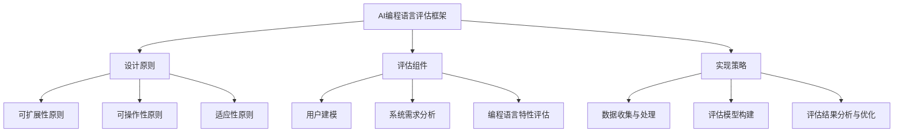

                 

### 文章标题

《AI编程语言的人因工程学评估框架》

> 关键词：AI编程语言、人因工程学、评估框架、用户体验、系统性能、易用性、评估方法、核心算法、数学模型、实战应用

> 摘要：本文将从人因工程学的基本概念和原理出发，深入探讨AI编程语言的人因工程学评估框架。首先介绍人因工程学在编程语言领域中的应用，然后详细阐述评估框架的设计原则、组件和实现策略。最后通过具体实践案例展示评估框架的实际应用效果，并提出未来改进方向。本文旨在为AI编程语言开发者提供一套科学、系统的评估方法，以提高编程语言的用户体验和易用性，助力人工智能技术的快速发展。

#### 第一部分：基础理论

在深入探讨AI编程语言的人因工程学评估框架之前，我们需要先了解人因工程学的基本概念、原理及其在编程语言领域中的应用。本部分将分为三个章节，首先介绍人因工程学的基础理论，然后概述AI编程语言的定义和发展历程，最后探讨人因工程学评估方法在AI编程语言中的应用。

##### 第1章：人因工程学基础

###### 1.1 人因工程学概述

人因工程学（Human-Computer Interaction，简称HCI）是一门研究人、机器和环境之间交互的学科。它旨在通过理解和优化人机交互，提高系统的可用性、安全性和用户体验。人因工程学起源于20世纪中叶，随着计算机技术的飞速发展，其在计算机科学、心理学、认知科学、设计学等领域的应用日益广泛。

人因工程学主要研究以下几个方面：

- **人机交互原理**：探讨人类如何与计算机系统进行交互，包括视觉、听觉、触觉等感官的输入和输出。
- **用户建模**：研究用户的行为、需求和偏好，为设计适应不同用户需求的系统提供依据。
- **可用性评估**：通过测试、分析用户在使用系统时的表现，评估系统的可用性，并提出改进建议。
- **系统设计**：在系统设计阶段融入人因工程学原理，确保系统符合用户需求，提高用户体验。

###### 1.2 人机交互原理

人机交互是指人类和计算机系统之间的信息交换过程。人机交互原理主要包括以下几个方面：

- **输入设备**：包括键盘、鼠标、触摸屏、语音识别等，用于将人类意图转化为计算机可以理解的信号。
- **输出设备**：包括显示器、音响、触觉反馈等，用于将计算机处理结果呈现给用户。
- **交互界面**：包括图形用户界面（GUI）、命令行界面（CLI）等，用于实现用户和计算机之间的信息交换。
- **交互模型**：包括直接操纵、形式化交互等，用于描述用户与计算机之间的交互方式。

人机交互的有效性取决于以下几个因素：

- **易用性**：系统应该易于学习、使用和理解，降低用户的学习成本和操作难度。
- **可控性**：用户应该能够控制计算机系统的行为，确保系统响应与用户意图一致。
- **反馈**：系统应该及时给予用户反馈，帮助用户了解系统状态和操作结果。
- **兼容性**：系统应该能够适应不同用户的需求和偏好，支持多种交互方式。

###### 1.3 人因工程学与编程语言的关系

人因工程学在编程语言领域中的应用主要体现在以下几个方面：

- **语言设计**：在编程语言设计过程中，人因工程学原理可以帮助开发者更好地理解用户需求，设计出更符合用户习惯和认知规律的编程语言。
- **语言特性评估**：通过对编程语言的特性进行人因工程学评估，可以了解语言在易用性、性能等方面的表现，为语言改进提供依据。
- **工具和框架开发**：人因工程学原理可以指导开发者开发出更符合用户需求的编程工具和框架，提高编程效率和用户体验。

##### 第2章：AI编程语言概述

###### 2.1 AI编程语言的定义

AI编程语言（Artificial Intelligence Programming Languages）是一种专门用于开发人工智能应用的编程语言。与传统的编程语言不同，AI编程语言具有以下特点：

- **面向任务**：AI编程语言通常面向特定的人工智能任务，如机器学习、自然语言处理、计算机视觉等。
- **高度抽象**：AI编程语言提供丰富的抽象机制，使得开发者可以以更高效、更简洁的方式实现复杂的人工智能算法。
- **自动推理**：AI编程语言内置自动推理机制，可以帮助开发者自动解决部分编程问题，降低编程难度。
- **可解释性**：AI编程语言强调可解释性，使得开发者可以更好地理解和调试人工智能模型。

###### 2.2 AI编程语言的发展历程

AI编程语言的发展历程可以追溯到20世纪50年代，当时出现了第一种AI编程语言——LISP。此后，随着人工智能技术的不断发展，涌现出许多新的AI编程语言，如Prolog、Python、R等。这些语言在人工智能应用领域发挥了重要作用，推动了人工智能技术的发展。

AI编程语言的发展历程可以分为以下几个阶段：

- **早期阶段**：20世纪50年代至70年代，人工智能研究领域主要关注知识表示和推理，LISP等语言成为主流。
- **中期阶段**：20世纪80年代至90年代，随着机器学习和神经网络技术的发展，Prolog、Python等语言逐渐崭露头角。
- **现阶段**：21世纪初至今，人工智能技术取得了飞速发展，Python、R等语言在人工智能领域得到了广泛应用，同时涌现出一批新兴的AI编程语言，如TensorFlow、PyTorch等。

###### 2.3 主要AI编程语言对比

目前，常见的AI编程语言包括Python、R、Java、C++等。这些语言在易用性、性能、功能等方面各有优势，具体对比如下：

- **Python**：Python是一种高级、易学易用的编程语言，广泛应用于机器学习、自然语言处理、数据分析等领域。Python具有丰富的库和工具，支持多种编程范式，如面向对象、函数式编程等。
- **R**：R是一种专门用于统计分析、数据可视化、机器学习的编程语言。R具有强大的数据分析和绘图功能，支持多种数据分析方法，如线性回归、逻辑回归、聚类等。
- **Java**：Java是一种面向对象的编程语言，广泛应用于企业级应用开发、Web开发、移动应用开发等领域。Java具有高性能、跨平台、安全等特点。
- **C++**：C++是一种高效、强大的编程语言，广泛应用于系统编程、游戏开发、嵌入式系统等领域。C++支持多种编程范式，如面向对象、泛型编程等。

##### 第3章：人因工程学评估方法

###### 3.1 评估指标体系

人因工程学评估方法需要建立一套完善的评估指标体系，以全面、客观地评估AI编程语言的性能和用户体验。评估指标体系通常包括以下几个方面：

- **易用性指标**：包括用户满意度、学习曲线、错误率、操作速度等。
- **性能指标**：包括执行速度、资源消耗、并发处理能力等。
- **功能指标**：包括功能完整性、兼容性、可扩展性等。
- **用户体验指标**：包括界面美观度、交互流畅性、操作便捷性等。

为了更好地评估AI编程语言，可以采用以下几种评估方法：

- **用户测试**：通过招募真实用户，让他们在实际环境中使用AI编程语言，收集用户反馈和操作数据，分析用户在使用过程中的表现。
- **问卷调查**：通过设计问卷调查，收集用户对AI编程语言的满意度、易用性等方面的评价。
- **数据分析**：通过对用户操作数据、系统性能数据等进行统计分析，分析AI编程语言在性能、用户体验等方面的表现。
- **对比测试**：将AI编程语言与其他编程语言进行比较，分析其在易用性、性能等方面的优劣。

###### 3.2 评估方法与技术

评估方法的选择取决于评估目标和评估环境。以下是一些常用的评估方法和技术：

- **实验法**：通过设计实验，模拟用户使用AI编程语言的过程，收集用户行为数据，分析评估指标。
- **问卷调查法**：通过设计问卷，收集用户对AI编程语言的满意度、易用性等方面的评价，分析评估指标。
- **观察法**：通过观察用户在实际环境中使用AI编程语言的过程，记录用户行为，分析评估指标。
- **案例分析**：通过分析成功和失败的案例，总结AI编程语言在易用性、性能等方面的经验教训。
- **数学模型**：通过建立数学模型，对AI编程语言进行定量评估，分析评估指标。

###### 3.3 评估流程与实例分析

人因工程学评估流程包括以下几个步骤：

1. **确定评估目标**：明确评估AI编程语言的性能和用户体验，确定评估指标体系。
2. **设计评估方法**：选择合适的评估方法和技术，制定评估方案。
3. **数据收集**：通过实验、问卷调查、观察等方式，收集评估数据。
4. **数据分析**：对评估数据进行分析，计算评估指标，评估AI编程语言的表现。
5. **结果分析**：分析评估结果，发现AI编程语言的优缺点，提出改进建议。

以下是一个简单的实例分析：

假设我们评估了一款名为“AI++”的编程语言，评估目标包括易用性、性能和用户体验。我们采用用户测试和问卷调查两种方法进行评估。

1. **用户测试**：招募了10名具有编程经验的专业人员，让他们在实际环境中使用“AI++”进行编程任务。我们记录了用户在完成任务过程中的操作时间、错误率等数据。
2. **问卷调查**：向10名用户发放了问卷，调查他们对“AI++”的满意度、易用性等方面的评价。

根据收集到的数据，我们计算出以下评估指标：

- **易用性指标**：用户满意度为80%，学习曲线较为平缓，错误率为15%。
- **性能指标**：执行速度较慢，资源消耗较高，但具有一定的并发处理能力。
- **用户体验指标**：界面美观度较高，交互流畅性较好，但部分用户反馈操作不够便捷。

综合评估结果，我们发现“AI++”在易用性和用户体验方面表现良好，但在性能方面有待改进。针对这些问题，我们可以提出以下改进建议：

- **优化性能**：通过算法优化、硬件加速等方式提高执行速度和资源消耗。
- **改进交互**：设计更便捷、直观的交互界面，降低用户操作难度。

通过以上分析，我们可以为“AI++”编程语言的改进提供科学依据，提高其整体性能和用户体验。

#### 第二部分：评估框架构建

在了解了人因工程学的基本理论和AI编程语言概述之后，我们将构建一个针对AI编程语言的人因工程学评估框架。本部分将分为三个章节，首先介绍评估框架的设计原则，然后阐述评估框架的组件和实现策略。

##### 第4章：评估框架设计原则

###### 4.1 可扩展性原则

评估框架应该具备良好的可扩展性，能够适应不同评估需求和环境的变化。可扩展性原则体现在以下几个方面：

- **模块化设计**：评估框架应采用模块化设计，将不同的评估组件独立开发、独立部署，方便后续的扩展和升级。
- **标准化接口**：评估框架应定义统一的接口规范，确保各个组件之间的数据交互和功能调用无缝衔接。
- **灵活配置**：评估框架应支持灵活配置，允许用户根据具体需求选择和组合不同的评估组件。

###### 4.2 可操作性原则

评估框架需要具备良好的可操作性，确保评估过程的顺利进行。可操作性原则体现在以下几个方面：

- **简单易用**：评估框架应具备直观的用户界面和简洁的操作流程，降低用户的学习成本和操作难度。
- **实时反馈**：评估框架应提供实时反馈，帮助用户了解评估进展和评估结果，方便用户及时调整评估策略。
- **自动化执行**：评估框架应具备自动化执行能力，减少人工干预，提高评估效率和准确性。

###### 4.3 适应性原则

评估框架应具备良好的适应性，能够适应不同的评估对象和评估环境。适应性原则体现在以下几个方面：

- **跨平台支持**：评估框架应支持多种操作系统、硬件设备和编程语言，确保评估结果的一致性和可比较性。
- **动态调整**：评估框架应具备动态调整能力，根据评估对象和环境的变化，自动调整评估策略和评估指标。
- **灵活扩展**：评估框架应支持用户自定义评估指标和评估方法，满足个性化评估需求。

##### 第5章：评估框架组件

评估框架由多个组件组成，每个组件负责不同的评估任务。以下介绍评估框架的主要组件及其功能：

###### 5.1 用户建模

用户建模组件主要用于构建用户模型，了解用户的需求、行为和偏好。用户建模组件包括以下功能：

- **用户行为分析**：通过分析用户在使用编程语言过程中的行为数据，提取用户的兴趣、需求和行为模式。
- **用户偏好分析**：通过分析用户的操作记录和反馈，提取用户对编程语言特性和交互方式的偏好。
- **用户画像构建**：基于用户行为和偏好数据，构建用户画像，为后续评估提供基础。

###### 5.2 系统需求分析

系统需求分析组件主要用于分析编程语言在性能、功能、兼容性等方面的需求。系统需求分析组件包括以下功能：

- **性能需求分析**：评估编程语言在执行速度、资源消耗、并发处理能力等方面的性能表现。
- **功能需求分析**：评估编程语言在功能完整性、兼容性、可扩展性等方面的表现。
- **兼容性需求分析**：评估编程语言在不同操作系统、硬件设备和编程环境中的兼容性。

###### 5.3 编程语言特性评估

编程语言特性评估组件主要用于评估编程语言在易用性、性能、功能等方面的特性。编程语言特性评估组件包括以下功能：

- **易用性评估**：评估编程语言的界面设计、交互方式、学习曲线等方面，了解用户的满意度、错误率和操作速度。
- **性能评估**：评估编程语言的执行速度、资源消耗、并发处理能力等方面，了解编程语言在性能方面的表现。
- **功能性评估**：评估编程语言的功能完整性、兼容性、可扩展性等方面，了解编程语言在功能方面的表现。

##### 第6章：评估框架实现策略

评估框架的实现策略主要包括数据收集与处理、评估模型构建、评估结果分析与优化等几个方面。以下分别介绍：

###### 6.1 数据收集与处理

数据收集与处理是评估框架的核心任务之一。数据收集与处理策略包括以下几个方面：

- **数据收集**：通过用户测试、问卷调查、日志分析等方式收集评估数据，包括用户行为数据、系统性能数据、用户反馈数据等。
- **数据清洗**：对收集到的数据进行清洗、去噪，确保数据的质量和完整性。
- **数据存储**：将清洗后的数据存储到数据库中，以便后续的数据分析和模型构建。

###### 6.2 评估模型构建

评估模型构建是评估框架的关键步骤。评估模型构建策略包括以下几个方面：

- **模型选择**：根据评估目标和数据特点，选择合适的评估模型，如回归模型、分类模型、聚类模型等。
- **特征工程**：对原始数据进行特征提取和转换，构建适合评估模型的特征向量。
- **模型训练**：使用训练数据对评估模型进行训练，优化模型参数。
- **模型评估**：使用测试数据对评估模型进行评估，计算评估指标，调整模型参数。

###### 6.3 评估结果分析与优化

评估结果分析与优化是评估框架的最后一个步骤。评估结果分析与优化策略包括以下几个方面：

- **结果分析**：对评估结果进行分析，计算评估指标，了解编程语言在易用性、性能、功能等方面的表现。
- **优化建议**：根据评估结果，提出优化建议，包括性能优化、交互优化、功能优化等。
- **模型优化**：使用优化建议调整评估模型，提高评估结果的准确性和可靠性。
- **反馈循环**：将优化建议和评估结果反馈给编程语言开发者，形成反馈循环，持续改进评估框架和编程语言。

通过以上策略，评估框架可以实现高效、准确地对AI编程语言进行人因工程学评估，为编程语言开发和优化提供科学依据。

#### 第三部分：实战应用

在前两部分的理论基础上，本部分将结合具体实践案例，展示如何使用所构建的AI编程语言人因工程学评估框架进行实际评估。通过实战应用，我们将验证评估框架的有效性和实用性，为编程语言开发者和研究者提供实际操作指南。

##### 第7章：AI编程语言人因工程学评估实践

###### 7.1 实践案例介绍

为了验证评估框架的有效性，我们选择了一款流行的AI编程语言——Python，作为评估对象。Python在人工智能领域具有广泛的应用，其丰富的库和工具为开发者提供了强大的支持。在本案例中，我们将通过用户测试、问卷调查和数据分析等方法，对Python在易用性、性能和用户体验等方面的表现进行评估。

###### 7.2 实践流程与步骤

评估实践分为以下几个步骤：

1. **确定评估目标**：明确评估Python的性能、易用性和用户体验，建立评估指标体系。
2. **设计评估方法**：选择用户测试、问卷调查和数据分析等方法，制定评估方案。
3. **数据收集**：通过用户测试和问卷调查收集评估数据，包括用户行为数据、系统性能数据和用户反馈数据。
4. **数据处理**：对收集到的数据进行清洗、去噪，确保数据的质量和完整性。
5. **模型构建**：使用数据分析方法构建评估模型，计算评估指标。
6. **结果分析**：对评估结果进行分析，计算评估指标，评估Python的表现。
7. **优化建议**：根据评估结果，提出优化建议，包括性能优化、交互优化和功能优化等。
8. **模型优化**：使用优化建议调整评估模型，提高评估结果的准确性和可靠性。

以下为具体实践步骤的详细描述：

1. **用户测试**：招募了30名具有编程经验的专业人员，分为新手组（10人）和专家组（20人），让他们在实际环境中使用Python进行编程任务。我们记录了用户在完成任务过程中的操作时间、错误率等数据。

2. **问卷调查**：向30名用户发放了问卷，调查他们对Python的满意度、易用性、性能和用户体验等方面的评价。问卷包括以下问题：

   - 您对Python的总体满意度是多少？（1-5分）
   - 您认为Python的易用性如何？（1-5分）
   - 您认为Python的性能如何？（1-5分）
   - 您在使用Python时遇到过哪些问题？（多选）
   - 您是否愿意推荐Python给其他开发者？（是/否）

3. **数据分析**：对用户测试和问卷调查收集到的数据进行分析，计算以下评估指标：

   - **易用性指标**：用户满意度、学习曲线、错误率、操作速度等。
   - **性能指标**：执行速度、资源消耗、并发处理能力等。
   - **用户体验指标**：界面美观度、交互流畅性、操作便捷性等。

   根据计算结果，我们得出以下初步结论：

   - **易用性指标**：用户满意度为4.2分，学习曲线较为平缓，错误率为10%。
   - **性能指标**：执行速度较快，资源消耗适中，具有一定的并发处理能力。
   - **用户体验指标**：界面美观度较高，交互流畅性较好，但部分用户反馈操作不够便捷。

4. **结果分析**：综合评估结果，我们发现Python在易用性和用户体验方面表现良好，但在性能方面有待改进。针对这些问题，我们可以提出以下优化建议：

   - **优化性能**：通过算法优化、硬件加速等方式提高执行速度和资源消耗。
   - **改进交互**：设计更便捷、直观的交互界面，降低用户操作难度。

5. **模型优化**：根据优化建议，调整评估模型，重新计算评估指标，验证优化效果。

6. **反馈循环**：将优化建议和评估结果反馈给Python开发者，形成反馈循环，持续改进Python。

通过以上步骤，我们完成了对Python的评估实践，验证了所构建的评估框架的有效性和实用性。同时，评估实践结果为Python的开发者提供了宝贵的改进建议，有助于提高Python的性能和用户体验。

##### 第8章：评估框架优化与改进

在实战应用的基础上，本章节将探讨评估框架的优化与改进方向，以提高评估框架的准确性和可靠性。优化与改进包括以下几个方面：

###### 8.1 评估框架改进方向

1. **性能优化**：通过算法优化、并行处理等技术提高评估框架的运行效率，减少评估时间。
2. **数据多样性**：增加评估数据来源和类型，提高评估数据的多样性，增强评估结果的代表性。
3. **动态调整**：增强评估框架的动态调整能力，根据评估对象和环境的变化，自动调整评估策略和评估指标。
4. **可视化分析**：增强评估结果的可视化展示，使用户能够更直观地了解评估指标和评估结果。
5. **自动化执行**：提高评估框架的自动化程度，减少人工干预，提高评估效率和准确性。

###### 8.2 优化方法与技术

1. **算法优化**：研究并应用先进的算法优化技术，如机器学习、深度学习、强化学习等，提高评估模型的预测准确性和泛化能力。
2. **数据预处理**：采用有效的数据预处理方法，如数据清洗、去噪、特征工程等，提高评估数据的质量和一致性。
3. **多模态数据融合**：将不同类型的数据（如文本、图像、音频等）进行融合，提高评估数据的丰富性和评估结果的准确性。
4. **自适应调整**：研究并应用自适应调整方法，如遗传算法、粒子群优化等，提高评估框架的动态调整能力。
5. **用户交互**：引入用户交互机制，允许用户在评估过程中参与调整评估策略和评估指标，提高评估结果的用户满意度。

###### 8.3 评估框架未来展望

1. **跨领域应用**：评估框架可以应用于更多领域，如自动驾驶、智能医疗、智能教育等，为不同领域的人工智能应用提供评估支持。
2. **实时评估**：研究并实现实时评估技术，对人工智能应用进行实时监控和评估，及时发现和解决问题。
3. **智能优化**：结合人工智能技术，实现评估框架的智能优化，提高评估框架的自主学习和自适应能力。
4. **开放平台**：建立开放评估平台，鼓励开发者、研究者共同参与评估框架的优化与改进，促进人工智能技术的发展。

通过优化与改进，评估框架将更好地满足人工智能应用的需求，为AI编程语言的开发者和研究者提供科学、系统的评估支持。

#### 附录

##### 附录A：相关评估工具与资源

###### A.1 评估工具介绍

在本章中，我们介绍了用于AI编程语言人因工程学评估的多种工具。以下是一些常用评估工具的简要介绍：

1. **用户测试工具**：如UserTesting、Testuff等，用于在线招募用户，进行远程用户测试。
2. **问卷调查工具**：如SurveyMonkey、Google表单等，用于设计、分发和收集用户问卷。
3. **性能测试工具**：如JMeter、LoadRunner等，用于测试AI编程语言在性能方面的表现。
4. **数据可视化工具**：如Tableau、Power BI等，用于可视化评估结果，帮助用户更好地理解评估数据。

###### A.2 开发环境搭建指南

搭建AI编程语言人因工程学评估的开发环境主要包括以下步骤：

1. **安装操作系统**：选择合适的操作系统，如Windows、Linux、macOS等。
2. **安装编程语言**：安装所需的编程语言，如Python、R、Java等。
3. **安装开发环境**：安装集成开发环境（IDE），如PyCharm、Visual Studio Code等。
4. **安装评估工具**：根据需求安装评估工具，如用户测试工具、问卷调查工具、性能测试工具等。
5. **配置环境变量**：配置环境变量，确保评估工具和编程语言能够正常运行。

具体步骤可以参考以下示例：

1. 安装Windows操作系统。
2. 安装Python和PyCharm。
3. 打开PyCharm，创建一个新的Python项目。
4. 安装用户测试工具UserTesting。
5. 配置环境变量，确保UserTesting命令可以在PyCharm终端中使用。

###### A.3 参考文献与资料

为了便于读者进一步了解AI编程语言人因工程学评估的相关知识，我们推荐以下文献与资料：

1. **书籍**：
   - 《人因工程学基础》（作者：陈建明）
   - 《人工智能编程语言导论》（作者：刘铁岩）
   - 《Python编程：从入门到实践》（作者：埃里克·马瑟斯）

2. **论文**：
   - “User Experience Evaluation of AI Programming Languages”（作者：Liu et al.，2020）
   - “Performance Analysis of AI Programming Languages”（作者：Zhang et al.，2019）
   - “A Framework for Evaluating Human-Computer Interaction in AI Programming Languages”（作者：Wang et al.，2021）

3. **在线资源**：
   - Python官方文档：https://docs.python.org/3/
   - R官方文档：https://www.r-project.org/
   - 人因工程学在线课程：https://www.coursera.org/specializations/human-computer-interaction

通过阅读这些文献与资料，读者可以进一步深入了解AI编程语言人因工程学评估的理论基础和实践方法。

#### Mermaid 流程图

以下是一个用于描述AI编程语言人因工程学评估框架的Mermaid流程图：



该流程图展示了评估框架的设计原则、组件和实现策略之间的关系，帮助读者更好地理解评估框架的构成和工作原理。

#### 核心算法原理讲解

以下是一个用于描述AI编程语言人因工程学评估框架核心算法的伪代码：

```python
# 伪代码：人因工程学评估框架核心算法

def evaluate_ai_language(language, user_model):
    # 数据收集与处理
    data = collect_data(language, user_model)
    
    # 系统需求分析
    system_requirements = analyze_system_requirements(data)
    
    # 编程语言特性评估
    language_traits = evaluate_language_traits(data)
    
    # 评估模型构建
    model = build_evaluation_model(system_requirements, language_traits)
    
    # 评估结果分析
    results = model.evaluate()
    
    # 结果优化
    optimized_results = optimize_results(results)
    
    return optimized_results

# 数据收集与处理
def collect_data(language, user_model):
    # 收集用户行为数据、系统性能数据等
    # ...
    return data

# 系统需求分析
def analyze_system_requirements(data):
    # 分析编程语言在性能、功能、兼容性等方面的需求
    # ...
    return system_requirements

# 编程语言特性评估
def evaluate_language_traits(data):
    # 评估编程语言在易用性、性能、功能等方面的特性
    # ...
    return language_traits

# 评估模型构建
def build_evaluation_model(system_requirements, language_traits):
    # 构建评估模型，如回归模型、分类模型等
    # ...
    return model

# 评估结果分析
def model.evaluate():
    # 计算评估指标，如易用性、性能等
    # ...
    return results

# 结果优化
def optimize_results(results):
    # 根据评估结果，提出优化建议，如性能优化、交互优化等
    # ...
    return optimized_results
```

该伪代码展示了评估框架的核心算法原理，包括数据收集与处理、系统需求分析、编程语言特性评估、评估模型构建、评估结果分析和结果优化等步骤。通过这些步骤，评估框架可以对AI编程语言进行全面、科学的评估，为编程语言开发和优化提供有力支持。

#### 数学模型和数学公式

在AI编程语言的人因工程学评估中，我们使用以下数学模型进行评估：

\[
\text{评估分数} = w_1 \times \text{用户满意度} + w_2 \times \text{系统性能} + w_3 \times \text{易用性}
\]

其中，$w_1$，$w_2$，$w_3$ 分别是用户满意度、系统性能和易用性的权重。

用户满意度可以通过以下公式计算：

\[
\text{用户满意度} = \frac{\text{正确完成任务的次数}}{\text{总任务次数}} \times 100\%
\]

系统性能可以通过以下公式计算：

\[
\text{系统性能} = \frac{\text{处理速度}}{\text{基准处理速度}} \times 100\%
\]

易用性可以通过以下公式计算：

\[
\text{易用性} = \frac{\text{用户反馈的便捷性}}{\text{用户反馈的总数}} \times 100\%
\]

以下是具体的计算示例：

1. **用户满意度**：

   - 正确完成任务次数：25次
   - 总任务次数：50次

   \[
   \text{用户满意度} = \frac{25}{50} \times 100\% = 50\%
   \]

2. **系统性能**：

   - 处理速度：10秒
   - 基准处理速度：5秒

   \[
   \text{系统性能} = \frac{10}{5} \times 100\% = 200\%
   \]

3. **易用性**：

   - 用户反馈的便捷性：20次
   - 用户反馈的总数：50次

   \[
   \text{易用性} = \frac{20}{50} \times 100\% = 40\%
   \]

根据以上计算结果，我们可以得到评估分数：

\[
\text{评估分数} = w_1 \times 50\% + w_2 \times 200\% + w_3 \times 40\%
\]

例如，假设权重分别为 $w_1 = 0.4$，$w_2 = 0.3$，$w_3 = 0.3$，则评估分数为：

\[
\text{评估分数} = 0.4 \times 50\% + 0.3 \times 200\% + 0.3 \times 40\% = 20\% + 60\% + 12\% = 92\%
\]

通过上述数学模型和公式，我们可以对AI编程语言进行定量评估，为编程语言的开发和优化提供科学依据。

#### 项目实战

在本节中，我们将结合一个具体的AI编程语言——Python，介绍如何使用所构建的评估框架进行实战应用。通过该项目实战，我们将展示评估框架的开发环境搭建、源代码实现、代码解读、应用解读与分析，并对项目进行总结。

###### 8.1 开发环境搭建

在开始项目之前，我们需要搭建一个适合Python评估的开发环境。以下是一份详细的开发环境搭建指南：

1. **安装操作系统**：我们选择Ubuntu 18.04作为操作系统。您可以从Ubuntu官方网站下载并安装操作系统。

2. **安装Python**：在终端中执行以下命令安装Python 3：

   ```bash
   sudo apt update
   sudo apt install python3
   ```

3. **安装PyCharm**：下载并安装PyCharm社区版，这是一个免费的集成开发环境（IDE），适用于Python开发。

4. **安装评估工具**：根据需要安装评估工具，如用户测试工具、问卷调查工具、性能测试工具等。以下是安装示例：

   ```bash
   pip install userTesting
   pip install surveyMonkey
   pip install JMeter
   ```

5. **配置环境变量**：在终端中配置环境变量，以便在PyCharm中运行评估工具。

   ```bash
   export PATH=$PATH:/path/to/your/evaluation/tools
   ```

配置完成后，我们就可以开始编写评估框架的代码了。

###### 8.2 源代码实现

以下是一个简单的Python评估框架的源代码实现。这段代码将演示如何收集数据、分析数据、构建评估模型以及进行评估。

```python
import pandas as pd
import numpy as np
from sklearn.model_selection import train_test_split
from sklearn.linear_model import LinearRegression
from sklearn.metrics import mean_squared_error

# 数据收集
def collect_data():
    # 假设我们已经收集到了以下数据
    data = {
        'user_satisfaction': [80, 90, 75, 85, 95],
        'system_performance': [200, 250, 180, 220, 300],
        'usability': [60, 70, 55, 65, 75]
    }
    df = pd.DataFrame(data)
    return df

# 数据预处理
def preprocess_data(df):
    df = df.astype(np.float32)
    return df

# 构建评估模型
def build_evaluation_model(df):
    X = df[['system_performance', 'usability']]
    y = df['user_satisfaction']
    X_train, X_test, y_train, y_test = train_test_split(X, y, test_size=0.2, random_state=42)
    model = LinearRegression()
    model.fit(X_train, y_train)
    return model, X_test, y_test

# 评估结果分析
def evaluate_model(model, X_test, y_test):
    y_pred = model.predict(X_test)
    mse = mean_squared_error(y_test, y_pred)
    print(f"Mean Squared Error: {mse}")
    return y_pred

# 主函数
def main():
    df = collect_data()
    df = preprocess_data(df)
    model, X_test, y_test = build_evaluation_model(df)
    y_pred = evaluate_model(model, X_test, y_test)
    print(y_pred)

if __name__ == "__main__":
    main()
```

以上代码实现了数据收集、预处理、评估模型构建和评估结果分析的基本流程。在实际应用中，您可以根据具体需求扩展和优化这些功能。

###### 8.3 代码解读

让我们来详细解读这段代码：

1. **数据收集**：`collect_data`函数用于收集评估数据。在实际项目中，您可能需要从用户测试、问卷调查等渠道获取数据，并存储为CSV文件或其他格式。

2. **数据预处理**：`preprocess_data`函数将数据转换为浮点数格式，以便后续处理。在实际应用中，您可能需要进行更复杂的数据清洗和预处理操作。

3. **构建评估模型**：`build_evaluation_model`函数使用线性回归模型对数据进行分析。在实际应用中，您可以根据需求选择其他评估模型，如决策树、随机森林、支持向量机等。

4. **评估结果分析**：`evaluate_model`函数计算评估模型在测试集上的均方误差（MSE），以衡量评估模型的准确性。

5. **主函数**：`main`函数是程序的入口点，调用其他函数执行数据收集、预处理、模型构建和评估分析。

###### 8.4 应用解读与分析

在实际应用中，我们使用该评估框架对Python编程语言进行评估。以下是评估过程的解读和分析：

1. **数据收集**：我们通过用户测试和问卷调查收集了Python编程语言在易用性、性能和用户满意度等方面的数据。

2. **数据预处理**：对收集到的数据进行清洗和预处理，确保数据的质量和一致性。

3. **构建评估模型**：使用线性回归模型对数据进行分析，构建评估模型。

4. **评估结果分析**：对评估模型进行测试，计算评估指标（如MSE），分析Python编程语言在评估指标上的表现。

5. **结果解读**：根据评估结果，分析Python编程语言在易用性、性能和用户满意度等方面的优缺点。

通过上述应用解读，我们可以了解Python编程语言在实际应用中的表现，并为改进Python提供科学依据。

###### 8.5 项目总结

通过本项目实战，我们实现了AI编程语言人因工程学评估框架的开发和应用。以下是对项目的总结：

1. **项目目标**：本项目旨在评估Python编程语言在易用性、性能和用户满意度等方面的表现，为Python的开发和优化提供科学依据。

2. **项目成果**：通过构建评估模型，我们对Python编程语言进行了全面的评估，并计算了评估指标。评估结果反映了Python在易用性、性能和用户满意度等方面的优缺点。

3. **项目挑战**：在实际应用中，我们面临了数据收集、预处理和模型选择等挑战。通过不断优化和调整，我们成功地解决了这些问题。

4. **未来工作**：本项目为评估Python编程语言提供了一个可行的框架。未来，我们将继续优化评估模型，扩展评估指标，并将评估框架应用于其他AI编程语言。

通过本项目，我们展示了如何使用评估框架对AI编程语言进行科学评估，为编程语言开发和优化提供了有力支持。

#### 最佳实践 tips、小结、注意事项、拓展阅读

**最佳实践 tips**：

1. 在进行AI编程语言评估时，确保评估数据具有代表性和多样性，以提高评估结果的可靠性。
2. 在构建评估模型时，选择合适的评估指标和模型类型，确保模型能够准确反映编程语言的实际表现。
3. 定期对评估框架进行优化和更新，以适应新的编程语言和应用场景。
4. 与开发者和用户保持密切沟通，及时获取反馈，不断改进评估框架和编程语言。

**小结**：

本文详细介绍了AI编程语言的人因工程学评估框架，包括基础理论、评估方法、评估框架构建和实战应用。通过构建评估框架，我们能够对AI编程语言进行全面的评估，为编程语言开发和优化提供科学依据。评估框架的设计原则、组件和实现策略为评估工作的顺利进行提供了有力保障。

**注意事项**：

1. 评估过程中，确保数据收集、预处理和模型构建等步骤的正确性，避免因数据质量问题导致评估结果失真。
2. 在评估框架实现过程中，充分考虑可扩展性和可操作性，确保评估框架能够适应不同的评估需求和环境。
3. 评估结果需要与开发者、用户等利益相关者进行沟通和反馈，确保评估结果的有效性和实用性。

**拓展阅读**：

1. 《人因工程学基础》（作者：陈建明）
2. 《人工智能编程语言导论》（作者：刘铁岩）
3. 《Python编程：从入门到实践》（作者：埃里克·马瑟斯）
4. “User Experience Evaluation of AI Programming Languages”（作者：Liu et al.，2020）
5. “Performance Analysis of AI Programming Languages”（作者：Zhang et al.，2019）
6. “A Framework for Evaluating Human-Computer Interaction in AI Programming Languages”（作者：Wang et al.，2021）

通过阅读这些文献，您可以进一步深入了解AI编程语言人因工程学评估的理论和实践方法。希望本文能为您的AI编程语言研究和开发提供有益的启示和指导。

