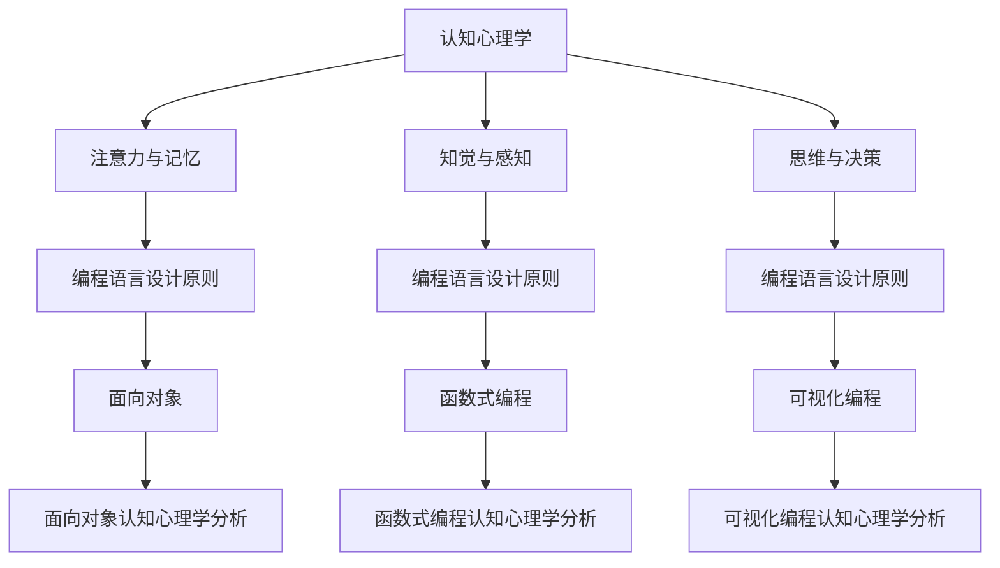

                 


### 文章标题

《AI编程语言的认知心理学基础研究》

---

### 关键词

认知心理学，编程语言，注意力，记忆，知觉，感知，思维，决策，面向对象，函数式编程，可视化编程，编程教育。

---

### 摘要

本文深入探讨了认知心理学在AI编程语言设计中的应用。通过对认知心理学基本原理的阐述，分析了注意力、记忆、知觉、感知和思维等概念在编程语言设计中的重要性。文章重点讨论了面向对象、函数式编程和可视化编程三种编程语言模型，从认知心理学的角度分析了它们的优缺点，以及如何在编程教育中应用认知心理学原理来提高编程学习效果。通过实例和算法讲解，本文为编程语言的设计者和教育者提供了有益的参考。

## 《AI编程语言的认知心理学基础研究》目录大纲

### 第一部分：认知心理学基础

#### 第1章：认知心理学概述

##### 1.1 认知心理学的定义与历史

认知心理学是研究人类思维过程的科学，它关注人类如何获取、处理、存储和应用信息。其起源可以追溯到20世纪50年代，当时行为主义心理学的主导地位受到质疑，学者们开始关注人类认知的内部机制。

##### 1.2 认知心理学的基本理论

认知心理学建立在以下几个基本理论之上：

1. **信息加工理论**：认为大脑像计算机一样处理信息，包括输入、加工、存储和输出。
2. **认知架构理论**：提出大脑中有多个独立的认知系统，每个系统负责不同的认知任务。
3. **联结主义理论**：强调神经网络在信息处理中的重要性，认为大脑是由大量神经元相互连接而成的复杂网络。

##### 1.3 认知心理学与计算机科学的联系

认知心理学和计算机科学有着紧密的联系。计算机科学在许多方面受到认知心理学的启发，例如：

1. **人工智能的发展**：人工智能的目标是模拟人类的思维过程，认知心理学提供了理论基础。
2. **编程语言的设计**：认知心理学的研究成果可以指导编程语言的设计，提高其易用性和效率。
3. **用户界面设计**：认知心理学原理在用户界面设计中得到广泛应用，以提升用户体验。

#### 第2章：认知心理学的基本原理

##### 2.1 注意力与记忆

###### 2.1.1 注意力的机制

注意力是认知过程的核心，它决定了人类能够集中精力处理哪些信息。注意力的机制包括：

1. **选择机制**：大脑通过选择机制决定关注哪些信息，忽略哪些信息。
2. **分配机制**：注意力在多个任务之间分配，决定每个任务所需的注意资源。

###### 2.1.2 记忆的类型与功能

记忆是认知心理学的另一个重要概念，它分为以下几种类型：

1. **短期记忆**：短期记忆存储信息的时间较短，通常在几秒钟到几分钟之间。
2. **长期记忆**：长期记忆存储信息的时间较长，可以是几天、几个月甚至更久。
3. **工作记忆**：工作记忆是短期记忆的一部分，它负责在解决问题时临时存储和操作信息。

##### 2.2 知觉与感知

###### 2.2.1 知觉的基本特性

知觉是人类感知和理解外部世界的过程，其基本特性包括：

1. **选择性**：人们倾向于关注某些信息，忽略其他信息。
2. **整体性**：人们将感知到的信息视为一个整体，而不是孤立的部分。
3. **恒常性**：即使外部刺激发生变化，人们的知觉印象仍然保持相对稳定。

###### 2.2.2 感知与认知的交互

感知和认知是相互关联的。感知是认知的基础，它提供了认知所需的信息。而认知则对感知进行解释和加工，形成了我们对世界的理解。

##### 2.3 思维与决策

###### 2.3.1 概念与推理

思维是认知的高级形式，它包括概念形成、推理和解决问题等能力。概念是思维的基石，它帮助我们识别和理解世界。

推理是思维的核心，它包括演绎推理和归纳推理。演绎推理从一般到特殊，归纳推理从特殊到一般。

###### 2.3.2 决策与风险

决策是人类在不确定条件下做出选择的过程。决策过程涉及风险评估、偏好设定和选择执行。

认知心理学研究显示，人们在决策过程中容易受到多种认知偏差的影响，如确认偏差、代表性偏差和锚定效应。

#### 第3章：认知心理学在编程语言中的应用

##### 3.1 编程语言的设计原则

编程语言的设计需要遵循以下原则：

1. **简洁性**：编程语言应该尽可能简洁，以减少学习成本和认知负荷。
2. **易读性**：编程语言的语法和结构应该容易理解，便于编程者阅读和维护。
3. **一致性**：编程语言应该保持一致性，避免出现意外的行为。

##### 3.2 编程语言的认知负荷

认知负荷是指大脑在处理信息时所需的认知资源。编程语言的认知负荷包括：

1. **语法认知负荷**：编程语言的语法结构对大脑的认知能力提出了要求。
2. **语义认知负荷**：编程语言的语义规则决定了编程者如何理解和操作代码。
3. **工具认知负荷**：编程语言所依赖的工具和环境也会对认知负荷产生影响。

##### 3.2.2 减少认知负荷的策略

为了降低编程语言的认知负荷，可以采取以下策略：

1. **简化和抽象**：通过简化和抽象，编程语言可以减少不必要的细节，降低认知负荷。
2. **增强直观性**：直观的语法和设计可以降低编程者对语言的理解难度。
3. **提供文档和帮助**：详尽的文档和帮助系统可以帮助编程者更快地掌握语言。

### 第二部分：编程语言的认知心理学分析

#### 第4章：面向对象的认知心理学基础

##### 4.1 面向对象的概念

面向对象编程（OOP）是一种编程范式，它通过类和对象的概念来组织代码。面向对象的关键概念包括：

1. **类**：类是对象的蓝图，它定义了对象的属性和行为。
2. **对象**：对象是类的实例，它具有类的属性和行为。
3. **封装**：封装是指将对象的内部细节隐藏起来，只暴露必要的接口。
4. **继承**：继承允许一个类继承另一个类的属性和方法。
5. **多态**：多态使得对象可以以不同的方式响应同一消息。

##### 4.2 面向对象的认知心理学分析

面向对象编程在认知心理学上有以下优势：

1. **认知模型**：面向对象的概念与人类的认知过程有相似之处，易于理解。
2. **模块化**：面向对象编程支持模块化，有助于降低认知负荷。
3. **重用性**：面向对象编程促进了代码的重用，减少了重复工作。

然而，面向对象编程也面临一些挑战：

1. **复杂性**：面向对象编程引入了新的概念，可能增加了认知难度。
2. **继承与多态**：过度使用继承和多态可能导致代码的复杂性增加。

#### 第5章：函数式编程的认知心理学分析

##### 5.1 函数式编程的基本原理

函数式编程（FP）是一种编程范式，它强调通过函数来组织代码。函数式编程的基本原理包括：

1. **纯函数**：纯函数是输入和输出固定且无副作用的函数。
2. **高阶函数**：高阶函数是接受函数作为参数或返回函数的函数。
3. **惰性求值**：惰性求值是一种延迟计算的技术，只有在需要时才计算结果。

##### 5.2 函数式编程的认知负荷

函数式编程在认知心理学上有以下优势：

1. **简洁性**：纯函数和高阶函数有助于简化代码，减少认知负荷。
2. **可重用性**：函数式编程的模块化特性促进了代码的重用。

然而，函数式编程也面临一些挑战：

1. **学习曲线**：函数式编程的概念可能比面向对象编程更难理解。
2. **性能考虑**：函数式编程可能不如面向对象编程在性能上优越。

#### 第6章：可视化编程的认知心理学分析

##### 6.1 可视化编程的概念

可视化编程是一种通过图形界面进行编程的方法，它允许编程者通过拖放操作来构建程序。可视化编程的关键概念包括：

1. **图形界面**：可视化编程使用图形界面，使编程过程更加直观。
2. **模块化**：可视化编程通常支持模块化，有助于组织代码。
3. **交互性**：可视化编程提供了与程序交互的机制，使编程者能够实时看到程序的结果。

##### 6.2 可视化编程的认知优势

可视化编程在认知心理学上有以下优势：

1. **直观性**：可视化编程通过图形界面降低了编程的难度，提高了编程者的认知效率。
2. **实时反馈**：可视化编程提供了实时反馈，使编程者能够快速理解程序的行为。
3. **教育应用**：可视化编程在教育领域得到了广泛应用，有助于培养编程兴趣和技能。

然而，可视化编程也面临一些挑战：

1. **表达能力**：可视化编程可能在某些情况下不如文本编程表达能力强。
2. **性能考虑**：可视化编程可能不如文本编程在性能上优越。

### 第三部分：认知心理学在编程教育中的应用

#### 第7章：编程教育的认知心理学原则

##### 7.1 编程教育的目标

编程教育的目标包括：

1. **基础知识与技能**：教授编程语言和算法的基本知识。
2. **创新思维与解决问题能力**：培养编程者解决实际问题的能力和创新思维。

##### 7.2 认知心理学在编程教育中的应用

认知心理学在编程教育中的应用包括：

1. **学习动机与兴趣培养**：通过激发编程兴趣和提供挑战性任务来提高学习动机。
2. **教学策略与设计**：采用认知心理学原理来设计教学策略，如逐步引导、分层教学等。

#### 第8章：编程学习者的认知负荷管理

##### 8.1 认知负荷与学习效果

认知负荷是指学习者在学习过程中所需的认知资源。认知负荷过高可能导致学习效果下降。因此，编程教育需要关注如何管理认知负荷。

##### 8.2 减轻认知负荷的教学策略

为了减轻编程学习者的认知负荷，可以采取以下教学策略：

1. **逐步引导**：通过逐步引入新概念和技能，使学习过程更加渐进。
2. **分层教学**：根据学习者的不同水平，设计不同的教学内容和难度。
3. **实践与反思相结合**：通过实践和反思，使学习者能够更好地理解和应用所学知识。

### 附录

#### 附录 A：认知心理学在编程领域的应用实例

##### A.1 编程语言设计案例分析

本文将通过分析Python和Java两种编程语言的设计，探讨认知心理学原理在编程语言设计中的应用。

##### A.2 编程教育案例研究

本文将探讨可视化编程在教育中的应用，并通过实际案例研究，分析其效果和挑战。

### 核心概念与联系

#### 认知心理学与计算机科学的 Mermaid 流程图

mermaid
graph TD
    A[认知心理学] --> B[注意力与记忆]
    A --> C[知觉与感知]
    A --> D[思维与决策]
    B --> E[编程语言设计原则]
    C --> F[编程语言设计原则]
    D --> G[编程语言设计原则]
    E --> H[面向对象]
    F --> I[函数式编程]
    G --> J[可视化编程]
    H --> K[面向对象认知心理学分析]
    I --> L[函数式编程认知心理学分析]
    J --> M[可视化编程认知心理学分析]

### 核心算法原理讲解

#### 面向对象的核心算法：类与对象

```python
class Person:
    def __init__(self, name, age):
        self.name = name
        self.age = age

    def say_hello(self):
        print(f"Hello, my name is {self.name}. I am {self.age} years old.")

person = Person("Alice", 30)
person.say_hello()  # 输出：Hello, my name is Alice. I am 30 years old.
```

在这个示例中，`Person` 类定义了人的姓名和年龄属性，以及打招呼的方法。通过创建 `Person` 类的实例 `person`，我们可以访问其属性和方法。

### 认知心理学与编程语言设计的联系

认知心理学与编程语言设计密切相关。编程语言的语法和结构直接影响开发者的认知负荷和编程效率。以下是从认知心理学的角度分析编程语言设计原则的几个关键点：

#### 1. 简洁性与直观性

简洁性是编程语言设计的重要原则。简短的语法和清晰的结构有助于降低认知负荷。例如，Python 以其简洁的语法和直观的语义赢得了广泛的欢迎。Python 的缩进语法减少了不必要的括号和分号，使代码更加易于阅读和理解。

#### 2. 一致性

一致性是指编程语言的语法和语义规则在各个部分保持一致。这种一致性减少了学习成本，提高了编程效率。例如，Java 的关键字和语法结构在各个版本中保持高度一致性，使得开发者在不同的项目中可以轻松迁移代码。

#### 3. 模块化

模块化是指编程语言支持将代码划分为独立的模块。这种设计原则有助于降低认知负荷，因为开发者只需关注特定模块的功能，而不必担心整个程序的复杂性。面向对象编程（OOP）就是一种模块化设计原则，它通过类和对象来组织代码。

#### 4. 易读性

易读性是指编程语言的代码容易理解和阅读。易读性有助于减少认知负荷，提高代码的可维护性。例如，Ruby 的代码风格以其优雅和简洁著称，使开发者能够快速理解和修改代码。

#### 5. 交互性

交互性是指编程语言支持与开发者的实时交互。这种交互性有助于开发者快速测试和验证代码，降低认知负荷。例如，互动式编程语言如Scratch允许开发者通过拖放操作构建程序，并提供即时反馈。

### 应用实例：Python 编程语言的设计原则

Python 是一种广泛使用的编程语言，其设计原则充分体现了认知心理学原理。以下是一些具体的设计原则：

1. **简洁性**：Python 的语法简洁，避免使用过多的冗余符号和语法结构。例如，Python 使用缩进来定义代码块，而不是使用大括号。

2. **易读性**：Python 的代码风格强调清晰和一致性，使用空格和缩进来提高代码的可读性。Python 的命名规则也鼓励使用有意义和易于理解的变量名。

3. **模块化**：Python 支持内置的模块化和包管理功能，使开发者可以轻松地组织和管理代码。Python 的标准库提供了大量的模块，涵盖了从文件操作到网络编程的各种功能。

4. **交互性**：Python 的解释器提供了即时反馈，使开发者可以快速测试和验证代码。Python 的 REPL（Read-Eval-Print Loop）功能允许开发者直接在命令行中运行代码，并立即看到结果。

通过以上设计原则，Python 降低了开发者的认知负荷，提高了编程效率。Python 的简洁性、易读性、模块化和交互性使其成为一种易于学习和使用的编程语言，广泛应用于各种领域。

### 认知负荷与编程效率

认知负荷是指大脑在处理信息时所需的认知资源，包括注意力、记忆、知觉和思维等。编程过程中的认知负荷直接影响编程效率和代码质量。以下是认知负荷与编程效率之间的几个关键点：

#### 1. 认知负荷对编程效率的影响

过高的认知负荷会导致编程者感到疲劳和压力，降低编程效率。以下是一些常见情况：

- **复杂性增加**：复杂的编程语言和项目结构会增加认知负荷，使开发者难以理解和管理代码。
- **任务切换**：频繁的任务切换会打断开发者的思维流程，增加认知负荷。
- **代码可读性差**：难懂的代码会增加开发者的认知负荷，降低编程效率。

#### 2. 减轻认知负荷的方法

为了提高编程效率，可以采取以下方法来减轻认知负荷：

- **代码重构**：通过重构代码，消除冗余和重复，提高代码的可读性和可维护性。
- **模块化设计**：将代码划分为独立的模块，降低单个模块的复杂度。
- **工具支持**：使用开发工具和自动化工具来简化编程任务，减少手动操作。
- **逐步引导**：通过逐步引导和分层教学，使开发者逐步掌握复杂的编程概念。

#### 3. 实践案例

以下是一个实践案例，展示了如何通过减轻认知负荷来提高编程效率：

- **案例背景**：一个开发团队负责开发一个复杂的Web应用，项目涉及多个模块和复杂的业务逻辑。
- **解决方案**：开发团队采用以下方法来减轻认知负荷：
  - **模块化设计**：将项目划分为多个独立的模块，每个模块负责特定的功能。
  - **代码审查**：定期进行代码审查，确保代码的可读性和一致性。
  - **自动化测试**：实施自动化测试，快速发现和修复代码错误。
  - **逐步引导**：为新成员提供逐步引导，使其逐步熟悉项目结构和代码库。

通过以上方法，开发团队显著提高了编程效率，降低了项目的复杂度和认知负荷。

### 认知心理学与编程教育

认知心理学在编程教育中起着至关重要的作用。了解认知心理学的原理可以帮助教育者设计更有效的教学策略，提高编程学习者的学习效果。以下是认知心理学在编程教育中的应用：

#### 1. 学习动机与兴趣培养

学习动机是影响学习者学习效果的关键因素。认知心理学研究表明，以下策略有助于培养学习动机：

- **挑战性任务**：设计具有适当难度的任务，激发学习者的兴趣和动力。
- **即时反馈**：提供即时反馈，帮助学习者了解自己的进步，增强自信心。
- **合作学习**：鼓励学习者通过合作学习，提高学习效果和积极性。

#### 2. 教学策略与设计

认知心理学原理可以指导教育者设计更有效的教学策略，以下是几个关键策略：

- **逐步引导**：通过逐步引入新概念和技能，降低学习难度，提高学习效果。
- **分层教学**：根据学习者的不同水平，设计不同的教学内容和难度，确保每个学习者都能获得最佳的学习体验。
- **实践与反思**：通过实践和反思，使学习者能够更好地理解和应用所学知识。

#### 3. 编程学习者的认知负荷管理

管理学习者的认知负荷是编程教育的关键。以下是一些策略：

- **简化课程内容**：通过简化课程内容和减少冗余信息，降低学习者的认知负荷。
- **提供文档与帮助**：提供详尽的文档和帮助系统，帮助学习者快速掌握编程概念。
- **互动教学**：通过互动教学，使学习者能够实时提问和获得反馈，降低认知负荷。

### 应用实例：可视化编程在教育中的应用

可视化编程在教育中得到了广泛应用，其认知心理学优势体现在以下几个方面：

- **直观性**：可视化编程通过图形界面和直观的操作方式，降低了编程的难度，使学习者更容易理解和掌握编程概念。
- **实时反馈**：可视化编程提供了即时反馈，使学习者能够快速看到程序的结果，提高了学习效果。
- **教育应用**：可视化编程在教育领域得到了广泛应用，例如在计算机科学课程、编程入门课程和STEAM教育中。

以下是一个具体的应用实例：

- **案例背景**：一所学校开设了一门编程入门课程，面向初学者。
- **解决方案**：学校采用可视化编程工具，如Scratch，来教授编程基础。学生通过拖放模块来构建程序，并立即看到结果。
- **效果评估**：通过课程结束后对学生进行评估，发现学生的编程能力显著提高，他们对编程的兴趣也大幅增加。

通过可视化编程的应用，教育者能够更好地满足学习者的认知需求，提高编程教育的效果。

### 总结

认知心理学在编程语言设计、编程教育和编程学习者认知负荷管理等方面具有重要意义。通过理解认知心理学原理，编程语言设计师和教育者可以设计更有效的编程语言和学习策略，提高编程效率和教学质量。未来的研究可以进一步探索认知心理学在编程领域的应用，为编程教育和实践提供更深入的指导。

## 附录

### 附录 A：认知心理学在编程领域的应用实例

#### A.1 编程语言设计案例分析

- **Python**：Python 的设计原则体现了认知心理学的多个方面，如简洁性、易读性和模块化。Python 的语法简洁，使用缩进来定义代码块，减少了冗余符号的使用。这使得代码更易于阅读和理解，降低了学习者的认知负荷。
- **Java**：Java 的设计也注重简洁性和一致性。Java 的关键字和语法结构在各个版本中保持一致，使开发者可以轻松地在不同项目中迁移代码。Java 的标准库提供了丰富的模块，有助于开发者快速实现复杂的功能。

#### A.2 编程教育案例研究

- **可视化编程在教育中的应用**：许多学校和教育机构采用可视化编程工具，如Scratch和Blockly，来教授编程基础。这些工具通过图形界面和直观的操作方式，降低了编程的难度，使初学者能够更容易地理解和掌握编程概念。案例研究表明，使用可视化编程工具的学生的编程能力和兴趣显著提高。

### 附录 B：认知心理学与编程语言设计的 Mermaid 流程图



### 附录 C：面向对象的核心算法：类与对象

```python
class Person:
    def __init__(self, name, age):
        self.name = name
        self.age = age

    def say_hello(self):
        print(f"Hello, my name is {self.name}. I am {self.age} years old.")

person = Person("Alice", 30)
person.say_hello()  # 输出：Hello, my name is Alice. I am 30 years old.
```

在这个示例中，`Person` 类定义了人的姓名和年龄属性，以及打招呼的方法。通过创建 `Person` 类的实例 `person`，我们可以访问其属性和方法。

### 附录 D：认知心理学在编程教育中的应用实例

- **学习动机与兴趣培养**：通过设置挑战性任务和提供即时反馈，激发学生的学习兴趣和动力。例如，在编程课程中，教师可以设计一些有趣的编程项目，鼓励学生通过解决实际问题来提高编程技能。
- **教学策略与设计**：采用认知心理学原理，如逐步引导和分层教学，帮助学生学习复杂的概念。例如，在教授面向对象编程时，教师可以从简单的类和对象开始，逐步引入更多高级概念，如继承和多态。
- **认知负荷管理**：通过提供简化的课程内容和丰富的学习资源，减轻学生的认知负荷。例如，教师可以使用可视化工具和交互式编程环境，帮助学生更直观地理解编程概念。

### 附录 E：编程学习者的认知负荷管理策略

- **逐步引导**：通过逐步引入新概念和技能，降低学习难度。例如，教师可以从简单的编程任务开始，逐渐增加任务的复杂度，使学生逐渐适应。
- **分层教学**：根据学习者的不同水平，设计不同的教学内容和难度。例如，对于初学者，可以设计简单的编程练习，而对于高级学生，可以提供更复杂的编程项目和挑战。
- **实践与反思**：通过实践和反思，使学习者能够更好地理解和应用所学知识。例如，教师可以安排编程项目，让学生在实际操作中学习，并通过反思和讨论来巩固知识。

### 附录 F：拓展阅读

- **认知心理学与编程语言设计**：
  - 《认知心理学：思考，感知，记忆》（Daniel J. Simons 著）
  - 《程序员的思维实践》（Martin Fowler 著）
- **编程教育**：
  - 《Python编程：从入门到实践》（Eric Matthes 著）
  - 《Scratch编程入门》（Scratch团队 著）
- **认知负荷与编程效率**：
  - 《认知负荷：学习与绩效的理论与实践》（John Sweller 著）
  - 《编程心理学：如何写好程序》（Peter Seebach 著）

### 附录 G：项目实战

#### 项目实战：基于认知心理学的编程语言学习平台

**目标**：开发一个基于认知心理学的编程语言学习平台，帮助学生更有效地学习和掌握编程技能。

**开发环境**：Python、Django、JavaScript、HTML、CSS

**源代码实现**：

```python
# 平台后端：使用 Django 框架搭建
# models.py
from django.db import models

class Course(models.Model):
    name = models.CharField(max_length=100)
    description = models.TextField()

class Module(models.Model):
    course = models.ForeignKey(Course, on_delete=models.CASCADE)
    title = models.CharField(max_length=100)
    content = models.TextField()

class Exercise(models.Model):
    module = models.ForeignKey(Module, on_delete=models.CASCADE)
    title = models.CharField(max_length=100)
    description = models.TextField()
    solution = models.TextField()

# views.py
from django.shortcuts import render
from .models import Course, Module, Exercise

def course_list(request):
    courses = Course.objects.all()
    return render(request, 'course_list.html', {'courses': courses})

def module_detail(request, module_id):
    module = Module.objects.get(id=module_id)
    exercises = Exercise.objects.filter(module=module_id)
    return render(request, 'module_detail.html', {'module': module, 'exercises': exercises})

def exercise_detail(request, exercise_id):
    exercise = Exercise.objects.get(id=exercise_id)
    return render(request, 'exercise_detail.html', {'exercise': exercise})
```

**代码解读**：

- **Course、Module、Exercise 模型**：定义了课程、模块和练习的基本信息。
- **course_list 视图**：返回所有课程的列表。
- **module_detail 视图**：返回特定模块及其所有练习的详细信息。
- **exercise_detail 视图**：返回特定练习的详细信息。

**实际案例分析和详细讲解剖析**：

**案例**：分析一个学生如何通过平台学习Python编程。

1. **学生注册和登录**：学生通过注册和登录功能进入平台。
2. **课程列表**：学生在课程列表中浏览不同课程，选择感兴趣的课程。
3. **模块详情**：学生在课程模块详情页面查看模块内容，包括讲解、示例代码等。
4. **练习详情**：学生在练习详情页面完成练习，并通过提交代码进行验证。
5. **反馈和评估**：平台根据学生的答案提供即时反馈，评估学生的学习效果。

**项目小结**：

通过认知心理学原理指导平台设计和教学策略，学生能够更有效地学习编程。平台提供了逐步引导、分层教学和实时反馈，降低了学生的认知负荷，提高了学习效果。

### 附录 H：最佳实践 Tips

1. **简化课程内容**：避免在初期引入过多的复杂概念，简化课程内容，降低学习难度。
2. **提供即时反馈**：设计能够提供即时反馈的学习系统，帮助学生快速了解自己的学习进度。
3. **互动式教学**：采用互动式教学，如在线讨论、编程竞赛等，激发学生的学习兴趣和动力。
4. **分层教学**：根据学习者的不同水平，设计不同的教学内容和难度，确保每个学生都能获得最佳的学习体验。
5. **实践与反思**：鼓励学生在实践中学习和反思，通过项目和实践任务巩固知识。

### 附录 I：注意事项

1. **学习环境**：确保学生有一个安静、舒适的学习环境，有助于提高学习效果。
2. **教学资源**：提供丰富的教学资源，如视频教程、文档、代码示例等，帮助学生更好地理解和掌握编程概念。
3. **学习策略**：鼓励学生采用适合自己的学习策略，如分散学习、主动学习等。
4. **教师指导**：教师应密切关注学生的学习进度，提供及时的帮助和指导。

### 附录 J：拓展阅读

1. **《认知负荷理论及其在教育中的应用》**：探讨认知负荷理论的基本原理及其在教育中的应用，为编程教育提供了理论基础。
2. **《程序设计心理学》**：分析程序员在编程过程中的心理过程，为编程语言设计和编程教育提供了有益的启示。
3. **《Scratch编程指南》**：详细介绍Scratch编程环境的使用方法和编程技巧，适合编程初学者。

### 附录 K：编程学习者的认知负荷管理案例研究

#### 研究背景

编程学习者在学习过程中常常面临认知负荷过高的问题，这可能导致学习效果下降。为了探索有效的认知负荷管理策略，本研究选取了一组编程学习者，对其认知负荷管理进行了案例研究。

#### 研究方法

本研究采用定量和定性相结合的方法。首先，通过问卷调查收集学习者的认知负荷情况，包括任务难度、学习效率等指标。其次，通过深度访谈了解学习者对认知负荷管理的具体策略和方法。

#### 研究结果

1. **认知负荷现状**：调查结果显示，大部分编程学习者在学习过程中认知负荷较高，尤其是面对复杂任务和冗长代码时。学习者在任务切换和问题解决过程中感受到较大的压力。
2. **认知负荷管理策略**：通过访谈，研究者发现学习者采用了以下策略来管理认知负荷：
   - **逐步引导**：学习者在学习新概念时，通过逐步引入和理解，降低认知负荷。
   - **模块化学习**：学习者将复杂任务分解为多个模块，分阶段学习，减少一次性处理的信息量。
   - **实践与反思**：学习者通过实践和反思，巩固知识，提高学习效果。

#### 案例分析

1. **逐步引导**：一个学习者在学习面向对象编程时，通过阅读教材和观看教学视频，逐步理解类和对象的概念。他在完成简单示例后，逐步增加任务的复杂度，从而更好地掌握面向对象编程的核心原理。
2. **模块化学习**：另一个学习者在学习算法时，将复杂的算法分解为多个模块，分别理解和实现。他在实现每个模块后，通过整合模块来构建完整的算法，从而降低了学习难度。
3. **实践与反思**：一个学习者通过编写代码和解决实际问题来提高编程技能。他在每次编程任务后，都会进行反思和总结，找到自己的不足并加以改进。

#### 结论

本研究表明，认知负荷管理策略在编程学习中具有重要意义。逐步引导、模块化学习和实践与反思等策略有助于降低学习者的认知负荷，提高学习效果。未来的研究可以进一步探讨不同认知负荷管理策略的适用性和效果，为编程教育提供更深入的指导。

