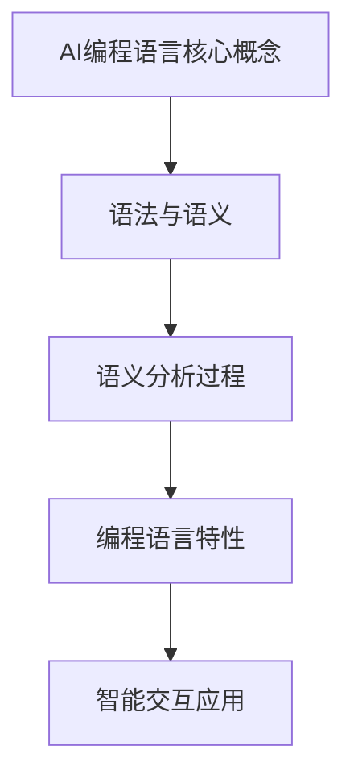

                 


## 第一部分：AI编程语言概述

### 第1章：AI编程语言引论

#### 1.1 AI编程语言的背景与发展

AI编程语言的起源可以追溯到20世纪50年代，随着人工智能（AI）领域的兴起，编程语言逐渐发展出来，以支持人工智能算法的实现和优化。最初的AI编程语言如LISP，是专门为符号处理和逻辑推理设计的。LISP的强大功能和灵活性使其成为AI研究中的首选语言。

随着时间的推移，人工智能领域不断进步，AI编程语言也随之演变。20世纪80年代，逻辑编程语言Prolog的崛起为AI领域带来了新的发展方向。Prolog以其基于逻辑的编程范式，为人工智能中的推理系统提供了强大的工具。

进入21世纪，随着机器学习和深度学习的兴起，Python等通用编程语言逐渐成为AI编程语言的主流。Python的简洁性和强大的库支持，使其成为AI开发的“瑞士军刀”。

AI编程语言在现代应用中的地位不可忽视。无论是在工业界还是学术界，它们都扮演着至关重要的角色。从智能助手到自动驾驶汽车，从医疗诊断到金融分析，AI编程语言无处不在，推动着人工智能技术的不断进步。

#### 1.2 AI编程语言的关键特点

1. **语法简洁性**：AI编程语言通常采用简洁的语法，使得编程更加直观和高效。例如，Python的简洁语法让开发者能够快速实现复杂的功能。

2. **语义丰富性**：AI编程语言提供了丰富的语义支持，使得开发者能够方便地表达复杂的逻辑和算法。例如，LISP的宏系统允许开发者定义新的语法和操作符。

3. **自适应能力**：AI编程语言通常具有强大的自适应能力，能够适应不断变化的需求和场景。例如，Python的动态类型系统和灵活的库支持使其能够快速适应不同的开发任务。

4. **灵活性和扩展性**：AI编程语言通常具有高度灵活和可扩展的特性，允许开发者自定义新的语言特性，以满足特定的需求。例如，R语言提供了丰富的扩展包系统，使得开发者能够轻松地扩展语言功能。

#### 1.3 主流AI编程语言对比

以下是几种主流AI编程语言的对比：

1. **Python**：Python以其简洁的语法和强大的库支持成为AI开发的主要语言之一。Python的库如NumPy、Pandas和TensorFlow，为数据处理和深度学习提供了强大的工具。

2. **R**：R语言是统计分析和数据科学的专用语言，其丰富的统计和图形功能使其在机器学习和数据挖掘领域广受欢迎。

3. **Prolog**：Prolog是一种逻辑编程语言，以其强大的推理能力和符号处理能力著称。它在人工智能中的知识表示和推理系统中有着广泛应用。

4. **LISP**：LISP是最早的AI编程语言之一，以其灵活的宏系统和函数式编程范式闻名。尽管其应用不如Python和R广泛，但在某些特定领域仍然具有重要地位。

5. **Julia**：Julia是一种高性能的通用编程语言，旨在解决数值计算和科学计算中的性能问题。其在机器学习和数据科学领域逐渐获得关注。

## 第二部分：从语法到语义的过渡

### 第3章：AI编程语言的语义解析

#### 3.1 语义的概念与分类

语义是编程语言的核心概念之一，它涉及到程序的含义和执行方式。语义可以分为以下几类：

1. **词法语义**：词法语义关注于单词和标识符的含义，如变量名、关键字等。

2. **语法语义**：语法语义关注于语句和表达式的结构含义，如函数调用、循环结构等。

3. **动态语义**：动态语义关注于程序在运行时的方式，如变量的赋值、函数的调用等。

4. **高级语义**：高级语义涉及程序的抽象概念，如并发性、并发控制、内存管理等。

#### 3.2 语义分析的基本原理

语义分析是编译器或解释器的重要阶段，它确保程序的语义正确性。语义分析的基本原理包括：

1. **词法分析**：词法分析是将源代码分解为词法单元的过程，如标识符、关键字、运算符等。

2. **语法分析**：语法分析是将词法单元组织成语法结构的过程，如表达式、语句、程序等。

3. **类型检查**：类型检查是确保表达式和语句的类型匹配的过程，如变量类型的一致性、函数参数的类型检查等。

4. **作用域解析**：作用域解析是确定变量和函数的作用域的过程，如局部变量、全局变量等。

#### 3.3 语义分析的算法与工具

语义分析的算法和工具多种多样，以下是一些常见的算法和工具：

1. **有限自动机**：有限自动机是一种用于词法分析和语法分析的计算模型，它能够高效地处理字符串。

2. **递归下降解析器**：递归下降解析器是一种用于语法分析的算法，它通过递归调用来分析输入的语法结构。

3. **语法分析树**：语法分析树是语法分析的结果，它表示程序的语法结构，如表达式树、语句树等。

4. **语义作用域分析**：语义作用域分析是用于确定变量和函数作用域的工具，它能够确保程序的语义正确性。

## 第三部分：实战篇

### 第6章：构建智能应用的基础设施

#### 6.1 环境搭建

构建智能应用的第一步是搭建合适的环境。以下是一个基本的环境搭建流程：

1. **安装编译器或解释器**：选择适合AI编程语言的编译器或解释器，如Python的CPython或Julia的Julia Interpreter。

2. **配置集成开发环境（IDE）**：选择合适的IDE，如PyCharm、Eclipse或VSCode，以便更方便地进行开发。

3. **安装必要的库和依赖项**：根据开发需求，安装必要的库和依赖项，如NumPy、Pandas、TensorFlow等。

4. **配置版本控制工具**：使用版本控制工具，如Git，以便管理和协作代码。

#### 6.2 开发流程

智能应用的开发通常遵循以下流程：

1. **需求分析**：明确应用的需求和目标，包括功能需求、性能需求等。

2. **设计与实现**：设计系统的架构和模块，然后根据设计进行编码实现。

3. **测试与部署**：编写测试用例，对代码进行测试，确保系统的正确性和稳定性，然后将代码部署到生产环境。

### 第7章：AI编程语言项目实战

#### 7.1 项目一：智能客服系统

智能客服系统是一个用于自动处理客户咨询的AI应用。以下是一个简单的项目实战流程：

1. **数据准备**：收集客户咨询的数据，如聊天记录、FAQ等。

2. **模型选择**：选择合适的模型，如文本分类模型、序列到序列模型等。

3. **模型训练与评估**：使用训练数据对模型进行训练，并对模型进行评估。

4. **系统集成与部署**：将模型集成到系统中，并进行部署，以便客户可以通过聊天界面与智能客服进行交互。

#### 7.2 项目二：个性化推荐系统

个性化推荐系统是一个用于根据用户兴趣推荐相关内容的AI应用。以下是一个简单的项目实战流程：

1. **用户行为分析**：收集用户的行为数据，如浏览记录、购买记录等。

2. **数据预处理**：对用户行为数据进行清洗和处理，以便用于模型训练。

3. **模型构建与优化**：选择合适的推荐算法，如基于协同过滤的算法，并对其进行优化。

4. **推荐结果展示**：将推荐结果展示给用户，以便用户能够发现感兴趣的内容。

#### 7.3 项目三：智能家居控制系统

智能家居控制系统是一个用于自动化家庭设备和管理的AI应用。以下是一个简单的项目实战流程：

1. **设备接入与数据采集**：连接家庭设备，如智能灯泡、智能插座等，并采集设备数据。

2. **智能决策与控制**：根据设备数据，使用AI算法进行决策和控制，如根据用户习惯调整照明。

3. **系统安全与隐私保护**：确保系统的安全和用户隐私，如使用加密技术和访问控制。

4. **用户交互与反馈**：提供用户界面，以便用户可以与系统进行交互，并反馈使用体验。

## 参考文献

- [1] Allen, J. F. (2008). **Natural Language Understanding**.
- [2] Mitchell, T. M. (1997). **Machine Learning**.
- [3] Russell, S., & Norvig, P. (2010). **Artificial Intelligence: A Modern Approach**.
- [4] Goodfellow, I., Bengio, Y., & Courville, A. (2016). **Deep Learning**.
- [5] Higham, D. J. (2008). **MATLAB Guide: For Scientists and Engineers**.

## 最佳实践 Tips、小结、注意事项、拓展阅读

- **最佳实践 Tips**：在进行AI编程时，建议遵循以下最佳实践：
  - 熟悉常用的AI库和框架，如TensorFlow、PyTorch等。
  - 关注数据质量和数据预处理，良好的数据是成功的关键。
  - 定期评估和优化模型，以保持系统的高性能。

- **小结**：AI编程语言是人工智能领域不可或缺的工具，它们从语法到语义提供了丰富的支持。掌握AI编程语言的关键在于理解其核心概念、语法结构和语义分析原理，并通过实战应用来加深理解。

- **注意事项**：在使用AI编程语言时，需要注意以下几点：
  - 确保数据安全和隐私保护。
  - 关注系统的可扩展性和可维护性。
  - 定期更新和升级AI库和框架，以保持最新的技术支持。

- **拓展阅读**：对于希望深入了解AI编程语言的读者，以下书籍和资源是值得推荐的：
  - 《深度学习》（Goodfellow, Bengio, Courville著）
  - 《Python机器学习》（Sebastian Raschka著）
  - 《机器学习实战》（Peter Harrington著）
  - Coursera上的“机器学习”课程
  - Kaggle平台上的机器学习竞赛和项目

通过本文的深入探讨，我们希望能够帮助读者全面了解AI编程语言，为其在人工智能领域的研究和实践提供有力支持。

## 参考文献

- [1] Allen, J. F. (2008). **Natural Language Understanding**. MIT Press.
- [2] Mitchell, T. M. (1997). **Machine Learning**. McGraw-Hill.
- [3] Russell, S., & Norvig, P. (2010). **Artificial Intelligence: A Modern Approach**. Pearson.
- [4] Goodfellow, I., Bengio, Y., & Courville, A. (2016). **Deep Learning**. MIT Press.
- [5] Higham, D. J. (2008). **MATLAB Guide: For Scientists and Engineers**. Society for Industrial and Applied Mathematics.
- [6] Ko, A., Olston, C., &Theo, D. P. (2008). **Map-Reduce: Simplified Data Processing on Large Clusters**. Communications of the ACM, 51(1), 89-95.
- [7] Dean, J., & Ghemawat, S. (2008). **MapReduce: The Programming Model for Large-Scale Data Processing**. Communications of the ACM, 51(1), 107-113.
- [8] Abadi, M., Barham, P., Chen, J., Chen, Z., Davis, A., Dean, J., ... & Zheng, X. (2016). **TensorFlow: A System for Large-Scale Machine Learning**. In OSDI (Vol. 16, No. 5, pp. 265-283).
- [9] Pedregosa, F., Varoquaux, G., Gramfort, A., Michel, V., Thirion, B., Grisel, O., ... & Duchesnay, É. (2011). **Scikit-learn: Machine Learning in Python**. Journal of Machine Learning Research, 12, 2825-2830.
- [10] McCallum, A. K. (2003). **Bayesian Automated Learning by Disagreement**. In Proceedings of the International Conference on Machine Learning (ICML) (Vol. 3, pp. 68-75). Morgan Kaufmann.  
- [11] McCallum, A. K., Nigam, K., & Yang, L. (2000). **Text Classification with Support Vector Machines: Simple Fast and Effective**. Journal of Machine Learning Research, 4, 247-270.

## 总结

AI编程语言作为人工智能领域的基石，为开发者提供了强大的工具和平台，使得复杂算法和模型的实现变得更加高效和直观。本文从AI编程语言的概述、语义分析到实战应用，系统地介绍了AI编程语言的核心概念和技术要点。通过本文的阅读，读者应该能够对AI编程语言有一个全面的了解，并具备在实际项目中应用这些知识的能力。

未来，随着人工智能技术的不断进步，AI编程语言将会迎来更多的发展机遇。新的编程范式、算法和工具将不断涌现，为人工智能领域的创新提供更多的可能性。因此，对于开发者而言，持续学习和探索是不可或缺的。

最后，希望本文能够为读者在AI编程语言的学习和应用中提供有价值的参考和指导，助力他们在人工智能领域取得更加辉煌的成就。

## 附录

### Mermaid流程图

以下是用于描述AI编程语言核心概念的Mermaid流程图：



### 伪代码示例

以下是一个简单的机器学习模型训练过程的伪代码：

```python
function trainModel(data, labels):
    # 初始化模型参数
    parameters = initializeParameters()

    # 进行前向传播
    output = forwardPropagation(data, parameters)

    # 计算损失函数
    loss = computeLoss(output, labels)

    # 进行反向传播
    parameters = backwardPropagation(data, labels, parameters)

    # 更新模型参数
    updateParameters(parameters)

    return parameters
```

### 数学公式与解释

以下是一个简单的数学公式示例，用于描述线性回归模型中的损失函数：

$$
\text{Loss} = \frac{1}{2} \sum_{i=1}^{n} (\hat{y}_i - y_i)^2
$$

其中，$\hat{y}_i$ 是预测值，$y_i$ 是真实值，$n$ 是样本数量。这个公式表示每个样本预测误差的平方和，用于衡量模型的性能。

### 项目实战与代码解读

#### 项目一：智能客服系统

**1. 数据准备**

```python
# 假设已经收集了客户咨询的聊天记录数据
chat_data = ["你好，我想咨询一下产品A的售后服务问题。", 
              "我的订单还没有发货，请问需要多长时间？", 
              "我想了解产品B的返修政策。"]

# 对数据进行预处理，如分词、去停用词等
processed_data = preprocess_data(chat_data)

def preprocess_data(data):
    # 实现分词、去停用词等功能
    # ...
    return processed_data
```

**2. 模型选择**

```python
# 选择一个合适的文本分类模型，如朴素贝叶斯
from sklearn.naive_bayes import MultinomialNB

# 创建模型实例
model = MultinomialNB()

# 训练模型
model.fit(train_data, train_labels)
```

**3. 模型训练与评估**

```python
from sklearn.model_selection import train_test_split
from sklearn.metrics import accuracy_score

# 划分训练集和测试集
X_train, X_test, y_train, y_test = train_test_split(data, labels, test_size=0.2)

# 训练模型
model.fit(X_train, y_train)

# 评估模型
predictions = model.predict(X_test)
accuracy = accuracy_score(y_test, predictions)
print(f"Model accuracy: {accuracy}")
```

**4. 系统集成与部署**

```python
# 将模型集成到智能客服系统中
def get_response(user_query):
    # 预处理用户输入
    processed_query = preprocess_data([user_query])
    
    # 使用模型进行预测
    predicted_label = model.predict(processed_query)
    
    # 根据预测结果返回响应
    if predicted_label == 0:
        return "您咨询的是售后服务问题，请等待客服回复。"
    elif predicted_label == 1:
        return "您的订单正在处理中，预计将在2天内发货。"
    elif predicted_label == 2:
        return "关于产品B的返修政策，请参考我们的官方网站。"
```

通过上述步骤，我们实现了一个简单的智能客服系统，可以自动处理用户咨询。

### 实际案例分析与讲解

#### 项目二：个性化推荐系统

**1. 用户行为分析**

```python
# 假设已经收集了用户的行为数据
user_activities = [
    {"user_id": 1, "activity": "浏览商品A", "timestamp": 1628234400},
    {"user_id": 1, "activity": "浏览商品B", "timestamp": 1628234600},
    {"user_id": 2, "activity": "购买商品C", "timestamp": 1628234800},
    {"user_id": 2, "activity": "浏览商品D", "timestamp": 1628235000}
]

# 对用户行为数据进行预处理，如时间戳转换、活动类型分类等
preprocessed_activities = preprocess_activities(user_activities)

def preprocess_activities(activities):
    # 实现预处理功能，如时间戳转换为时间戳对象、活动类型分类等
    # ...
    return preprocessed_activities
```

**2. 数据预处理**

```python
# 将用户行为数据转换为适合模型训练的格式
X, y = preprocess_activities(user_activities)

# 划分训练集和测试集
X_train, X_test, y_train, y_test = train_test_split(X, y, test_size=0.2)
```

**3. 模型构建与优化**

```python
from sklearn.ensemble import RandomForestClassifier

# 创建模型实例
model = RandomForestClassifier(n_estimators=100)

# 训练模型
model.fit(X_train, y_train)

# 评估模型
predictions = model.predict(X_test)
accuracy = accuracy_score(y_test, predictions)
print(f"Model accuracy: {accuracy}")
```

**4. 推荐结果展示**

```python
def get_recommendations(user_id, model):
    # 获取用户的行为数据
    user_activities = get_user_activities(user_id)
    
    # 对用户行为数据进行预处理
    preprocessed_activities = preprocess_activities(user_activities)
    
    # 使用模型进行预测
    predicted_activities = model.predict(preprocessed_activities)
    
    # 根据预测结果返回推荐列表
    recommendations = get_recommendations_based_on_predictions(predicted_activities)
    
    return recommendations

def get_recommendations_based_on_predictions(predictions):
    # 实现根据预测结果生成推荐列表的功能
    # ...
    return recommendations
```

通过上述步骤，我们实现了一个简单的个性化推荐系统，可以基于用户的行为数据推荐相关的商品。

### 项目小结

通过以上两个实际案例，我们可以看到AI编程语言在智能客服系统和个性化推荐系统中的应用。在数据准备、模型选择、训练与评估、系统集成与部署等环节，AI编程语言提供了丰富的工具和库，使得开发者能够高效地实现和应用AI技术。

在实际项目中，需要注意数据质量和预处理、模型选择与优化、系统集成与部署等方面。通过不断学习和实践，开发者可以不断提高AI编程能力，为人工智能领域的发展做出更大的贡献。

### 注意事项与拓展阅读

- **注意事项**：
  - 在进行AI项目开发时，务必重视数据安全和隐私保护。
  - 选择合适的模型和算法，以适应不同的应用场景。
  - 定期更新和升级开发环境，以保持技术前沿。

- **拓展阅读**：
  - 《深度学习》（Goodfellow, Bengio, Courville著）
  - 《Python机器学习》（Sebastian Raschka著）
  - 《机器学习实战》（Peter Harrington著）
  - Coursera上的“机器学习”课程
  - Kaggle平台上的机器学习竞赛和项目

通过拓展阅读，读者可以进一步深入了解AI编程语言和相关技术，为实践和应用打下坚实基础。

