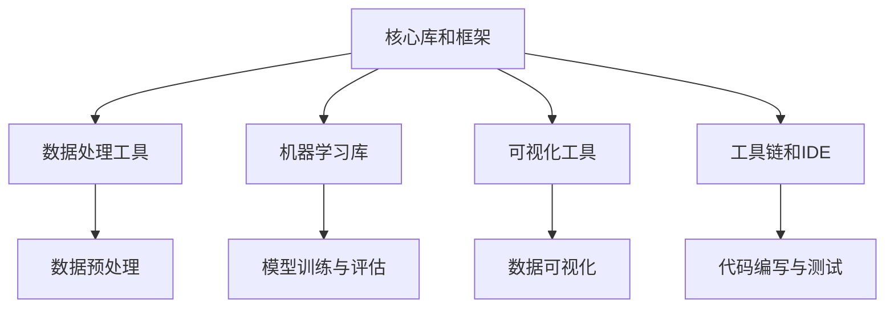

                 


### 设计思路：

为了撰写一篇《AI编程语言：提示词的艺术与魔力》的技术博客文章，我们需要遵循以下设计思路，确保文章内容丰富、逻辑清晰、专业且具有可读性。

#### 1. 确定整体框架

首先，我们需要明确文章的整体结构，将内容划分为几个主要部分，确保能够全面覆盖AI编程语言的主题。以下是一个初步的框架：

- **引言**：简要介绍AI编程语言的背景和重要性。
- **AI编程语言概述**：详细描述AI编程语言的核心概念、架构和应用场景。
- **提示词的艺术**：探讨提示词在AI编程语言中的设计、优化和应用。
- **核心算法原理讲解**：深入分析AI编程语言中使用的核心算法，包括神经网络、自然语言处理和计算机视觉。
- **数学模型和公式讲解**：介绍AI编程语言中涉及的关键数学模型，使用latex格式书写数学公式。
- **项目实战**：通过实际项目展示如何使用AI编程语言进行开发。
- **综合应用与未来展望**：讨论AI编程语言在不同领域的应用前景和未来发展趋势。
- **结论**：总结文章的主要观点和收获。

#### 2. 核心概念与联系

在“AI编程语言概述”部分，我们需要详细介绍核心概念，并展示它们之间的关系架构。可以使用Mermaid流程图来帮助读者直观地理解这些概念如何相互关联。

- **核心概念介绍**：介绍AI编程语言的基本概念，如神经网络、深度学习、自然语言处理、计算机视觉等。
- **Mermaid流程图**：绘制一个简明的流程图，展示AI编程语言中的主要组成部分及其相互关系。
- **异同点分析**：讨论AI编程语言与传统编程语言的异同点，以及它们在编程中的应用对比。

#### 3. 核心算法原理讲解

在“核心算法原理讲解”部分，我们需要深入分析AI编程语言中使用的核心算法，并使用伪代码进行详细阐述。

- **神经网络与深度学习**：介绍神经网络的基本原理，以及深度学习算法的伪代码示例。
- **自然语言处理**：讲解自然语言处理的基本概念，如词嵌入和编码，并提供伪代码示例。
- **计算机视觉**：讨论图像识别与处理，以及卷积神经网络（CNN）的伪代码示例。

#### 4. 数学模型和公式讲解

在“数学模型和公式讲解”部分，我们需要详细介绍AI编程语言中涉及的关键数学模型，使用latex格式书写数学公式，并附上详细的讲解和示例。

- **数学基础**：介绍矩阵与向量、概率论与统计学等数学基础。
- **深度学习中的常用数学公式**：介绍深度学习中常用的数学公式，如前向传播、反向传播等。
- **示例讲解**：通过具体的例子，展示如何使用这些数学模型进行AI编程语言开发。

#### 5. 项目实战

在“项目实战”部分，我们需要通过实际项目案例展示如何使用AI编程语言进行开发，并提供源代码实现和详细解读。

- **实战一：文本分类**：介绍一个文本分类项目，包括项目背景、开发环境搭建、源代码实现和代码解读。
- **实战二：图像识别**：展示一个图像识别项目，包括项目背景、开发环境搭建、源代码实现和代码解读。

#### 6. 综合应用与未来展望

在“综合应用与未来展望”部分，我们需要探讨AI编程语言在不同领域的应用前景和未来发展趋势。

- **应用领域**：分析AI编程语言在金融、医疗、教育等领域的应用实例。
- **未来趋势**：讨论AI编程语言的发展趋势和面临的挑战。

### 7. 附录

最后，我们可以在附录部分提供一些有用的开发工具和资源，以及拓展阅读推荐。

通过以上设计思路，我们可以逐步构建出这篇技术博客文章的内容，确保每一部分都能详细、专业且有趣地传达给读者。

### 最终目录大纲：

```
# AI编程语言：提示词的艺术与魔力

## 引言

### 1.1 AI编程语言的背景和重要性

### 1.2 为什么学习AI编程语言

## 第一部分：AI编程语言概述

### 2.1 AI编程语言的核心概念与架构

#### 2.1.1 AI编程语言的基本概念

#### 2.1.2 AI编程语言的架构

#### 2.1.3 Mermaid流程图：AI编程语言的整体架构

#### 2.1.4 AI编程语言与编程语言的异同点

### 2.2 提示词的艺术

#### 2.2.1 提示词的基本概念

#### 2.2.2 提示词的设计与优化

#### 2.2.3 提示词在AI编程语言中的应用

## 第二部分：核心算法原理讲解

### 3.1 神经网络与深度学习

#### 3.1.1 神经网络的基本原理

#### 3.1.2 深度学习算法的伪代码示例

### 3.2 自然语言处理

#### 3.2.1 NLP的基本概念

#### 3.2.2 词嵌入与编码

#### 3.2.3 NLP算法的伪代码示例

### 3.3 计算机视觉

#### 3.3.1 图像识别与处理

#### 3.3.2 卷积神经网络（CNN）的伪代码示例

## 第三部分：数学模型和公式讲解

### 4.1 数学基础

#### 4.1.1 矩阵与向量

#### 4.1.2 概率论与统计学

#### 4.1.3 深度学习中的常用数学公式（使用latex格式）

### 4.2 模型评估与优化

#### 4.2.1 评估指标

#### 4.2.2 优化策略

## 第四部分：项目实战

### 5.1 实战一：文本分类

#### 5.1.1 项目背景

#### 5.1.2 开发环境搭建

#### 5.1.3 源代码实现

#### 5.1.4 代码解读与分析

### 5.2 实战二：图像识别

#### 5.2.1 项目背景

#### 5.2.2 开发环境搭建

#### 5.2.3 源代码实现

#### 5.2.4 代码解读与分析

## 第五部分：综合应用与未来展望

### 6.1 AI编程语言在各个领域的应用

#### 6.1.1 金融领域的应用

#### 6.1.2 医疗领域的应用

#### 6.1.3 教育领域的应用

### 6.2 未来发展趋势与挑战

#### 6.2.1 技术发展趋势

#### 6.2.2 挑战与机遇

## 附录

### 7.1 开发工具与资源

#### 7.1.1 常用深度学习框架

#### 7.1.2 数据集与资源下载

### 7.2 拓展阅读推荐

```

通过这个详细的目录大纲，我们可以逐步填充每个部分的内容，确保文章的完整性、逻辑性和专业性。

### 文章关键词

- AI编程语言
- 提示词
- 深度学习
- 神经网络
- 自然语言处理
- 计算机视觉
- 数学模型
- 项目实战

### 文章摘要

本文旨在探讨AI编程语言的魅力和提示词的艺术。首先，我们将介绍AI编程语言的核心概念、架构和应用场景。接着，我们深入探讨提示词的设计、优化和应用，以及它们在AI编程语言中的重要性。然后，我们将详细讲解神经网络、自然语言处理和计算机视觉等核心算法原理，并通过伪代码进行说明。此外，我们将介绍关键数学模型，使用latex格式书写数学公式，并附上详细讲解和示例。为了实际展示AI编程语言的实用性，我们将通过文本分类和图像识别两个项目实战，提供源代码实现和详细解读。最后，我们将讨论AI编程语言在各个领域的应用前景，以及未来的发展趋势和挑战。

----------------------------------------------------------------

## 引言

在当今数字化时代，人工智能（AI）已经成为推动技术创新和产业变革的核心动力。AI编程语言作为一种专门为AI应用而设计的编程语言，正在逐渐改变我们对编程的传统认知。本文将深入探讨AI编程语言：提示词的艺术与魔力，旨在揭示这一领域背后的核心原理和实用技巧。

### 1.1 AI编程语言的背景和重要性

AI编程语言的出现并非偶然。随着AI技术的不断发展和应用场景的广泛拓展，传统的编程语言已经难以满足AI开发的复杂需求。AI编程语言如Python、R、Julia等，它们具备强大的数学计算能力、丰富的库函数和广泛的应用场景，为AI开发提供了更加灵活和高效的环境。

AI编程语言的重要性体现在以下几个方面：

1. **高效开发**：AI编程语言提供了丰富的库函数和工具，使得开发人员能够快速搭建模型和原型，提高开发效率。
2. **跨学科融合**：AI编程语言不仅涵盖了计算机科学的知识，还融合了数学、统计学、工程学等领域的知识，有助于跨学科的研究和合作。
3. **广泛应用**：AI编程语言在各个领域都有广泛的应用，如金融、医疗、教育、制造等，推动了产业的智能化升级。

### 1.2 为什么学习AI编程语言

学习AI编程语言对于开发人员来说具有重要意义：

1. **提升竞争力**：掌握AI编程语言能够帮助开发人员更好地应对未来的技术挑战，提高职业竞争力。
2. **拓展视野**：AI编程语言涉及多个学科领域，学习它们能够拓宽开发人员的知识视野，培养跨学科思维。
3. **创新实践**：AI编程语言为开发人员提供了更多的创新机会，通过实际项目实践，可以不断探索和应用新技术。

在接下来的章节中，我们将详细探讨AI编程语言的核心概念、架构、提示词的艺术、核心算法原理、数学模型、项目实战以及未来展望，帮助读者全面了解AI编程语言的魅力和实用性。

----------------------------------------------------------------

## 第一部分：AI编程语言概述

### 2.1 AI编程语言的核心概念与架构

#### 2.1.1 AI编程语言的基本概念

AI编程语言，顾名思义，是一种专为人工智能应用而设计的编程语言。它们不仅需要具备传统编程语言的基本功能，还需要提供强大的数学计算能力、丰富的库函数和高效的数据处理工具。常见的AI编程语言包括Python、R、Julia等。

- **Python**：Python以其简洁易懂的语法和丰富的库函数，成为AI开发中最流行的语言之一。例如，TensorFlow和PyTorch就是两个广泛使用的深度学习框架。
- **R**：R语言在统计分析方面具有强大的能力，因此在数据科学和机器学习领域广受欢迎。ggplot2等库为数据可视化提供了丰富的工具。
- **Julia**：Julia结合了Python的易用性和C的执行效率，在科学计算和数据分析中表现出色。

#### 2.1.2 AI编程语言的架构

AI编程语言的架构通常包括以下几个关键组成部分：

1. **核心库和框架**：如TensorFlow、PyTorch、Keras等，这些框架提供了构建和训练深度学习模型所需的基本工具和函数。
2. **数据处理工具**：如Pandas、NumPy等，这些工具能够高效地处理和分析数据。
3. **机器学习库**：如Scikit-learn，提供了广泛的机器学习算法和工具，方便开发人员快速实现机器学习模型。
4. **可视化工具**：如Matplotlib、Seaborn等，这些工具能够帮助开发人员直观地展示数据和分析结果。
5. **工具链和集成开发环境（IDE）**：如Jupyter Notebook、Google Colab等，它们提供了交互式的开发环境，方便开发人员编写和测试代码。

#### 2.1.3 Mermaid流程图：AI编程语言的整体架构

为了更直观地展示AI编程语言的架构，我们可以使用Mermaid流程图绘制一个简明的整体架构图。以下是一个示例：



#### 2.1.4 AI编程语言与编程语言的异同点

AI编程语言与传统编程语言在以下方面存在异同：

1. **目标不同**：传统编程语言侧重于通用计算和程序设计，而AI编程语言则专注于构建、训练和优化人工智能模型。
2. **工具和库不同**：AI编程语言通常拥有更丰富的库函数和工具，用于支持数学计算、数据处理和模型训练。
3. **语法特点**：AI编程语言往往采用更加简洁和易于理解的语法，以降低开发难度。
4. **执行效率**：AI编程语言虽然在开发效率上有优势，但在执行效率上可能不如一些传统的编译型语言。

总的来说，AI编程语言为人工智能开发提供了更加灵活和高效的环境，使得开发人员能够更加专注于算法实现和模型优化，而不是繁琐的编程细节。

通过以上内容，我们对AI编程语言的基本概念和架构有了初步了解。在接下来的章节中，我们将进一步探讨AI编程语言中的关键技术和应用。

----------------------------------------------------------------

### 2.2 提示词的艺术

在AI编程语言中，提示词（Prompt）是一种特殊的技术，用于引导模型生成预期的输出。提示词的设计与优化在AI模型开发中起着至关重要的作用，下面我们将详细探讨这一领域。

#### 2.2.1 提示词的基本概念

提示词可以理解为输入到AI模型中的引导信息，它有助于模型理解任务的上下文和目标。一个良好的提示词能够提高模型的性能，使其更加准确和高效地生成预期的输出。

- **提示词的定义**：提示词是指用于引导模型生成预期输出的文本、标记或数据片段。
- **提示词的作用**：提示词能够为模型提供额外的上下文信息，帮助模型更好地理解任务目标，从而提高生成输出的质量和准确性。

#### 2.2.2 提示词的设计与优化

设计一个有效的提示词需要考虑多个因素，以下是一些关键的设计原则和优化策略：

1. **上下文信息**：确保提示词提供足够的上下文信息，使模型能够理解任务目标。例如，在生成文本时，可以提供相关的背景信息和关键词。
2. **简明扼要**：提示词应尽量简明扼要，避免冗长和重复的信息，以免模型过度依赖提示词中的特定内容。
3. **多样性**：设计多种类型的提示词，以覆盖不同的任务需求和场景。例如，可以使用开放式问题、指令式问题和示例式问题等。
4. **相关性**：确保提示词与模型的能力和目标相关，避免使用与任务无关的信息。
5. **可扩展性**：设计提示词时应考虑其可扩展性，以便在未来的任务中能够灵活调整和扩展。

#### 2.2.3 提示词在AI编程语言中的应用

提示词在AI编程语言中的应用场景非常广泛，以下是一些典型的应用实例：

1. **自然语言处理（NLP）**：在NLP任务中，提示词可以引导模型生成正确的文本摘要、翻译或回答问题。例如，在机器阅读理解任务中，提示词可以提供问题的上下文，帮助模型理解问题的含义。
2. **图像识别**：在图像识别任务中，提示词可以提供图像的描述或标签，帮助模型更好地分类和识别图像内容。
3. **对话系统**：在对话系统中，提示词可以用于引导模型的回答，使其能够生成更加自然和连贯的对话。
4. **代码生成**：在代码生成任务中，提示词可以提供代码的模板和上下文，帮助模型生成正确的代码片段。

通过以上讨论，我们可以看到，提示词在AI编程语言中具有重要的应用价值。一个良好的提示词设计不仅能够提高模型的性能，还能够简化开发过程，使AI编程更加高效和灵活。

在接下来的章节中，我们将进一步探讨AI编程语言中的核心算法原理，以及如何使用这些算法解决实际问题。

----------------------------------------------------------------

### 第二部分：核心算法原理讲解

#### 3.1 神经网络与深度学习

神经网络（Neural Networks）是深度学习（Deep Learning）的核心算法，它们通过模仿人脑的神经元结构和工作方式，实现对复杂数据的建模和预测。以下是神经网络的基本原理和深度学习算法的伪代码示例。

#### 3.1.1 神经网络的基本原理

神经网络由多个层次组成，包括输入层、隐藏层和输出层。每个层次由多个神经元（节点）组成，神经元之间通过权重（weights）和偏置（bias）连接。神经网络通过前向传播（forward propagation）和反向传播（backpropagation）来更新权重和偏置，以达到学习目标。

- **神经元激活函数**：常见的激活函数包括Sigmoid、ReLU和Tanh，它们用于将线性组合的输入映射到非负区间，增加网络的非线性能力。
- **前向传播**：输入数据通过网络的各个层次，每个层次的输出成为下一层的输入，直到最终输出层得到预测结果。
- **反向传播**：计算输出层与实际标签之间的误差，然后通过反向传播算法将误差传递回网络的前一层，更新各层的权重和偏置。

#### 3.1.2 深度学习算法的伪代码示例

以下是一个简单的神经网络训练的伪代码示例：

```python
# 定义神经网络结构
input_size = 784  # 输入层大小（例如28x28像素的图像）
hidden_size = 500 # 隐藏层大小
output_size = 10  # 输出层大小（例如10个分类）

# 初始化权重和偏置
weights = np.random.randn(hidden_size, input_size)
biases = np.random.randn(hidden_size)
weights_output = np.random.randn(output_size, hidden_size)
biases_output = np.random.randn(output_size)

# 前向传播
def forward_propagation(x):
    hidden_layer = sigmoid(np.dot(x, weights) + biases)
    output_layer = sigmoid(np.dot(hidden_layer, weights_output) + biases_output)
    return output_layer

# 反向传播
def backward_propagation(x, y):
    output_error = y - forward_propagation(x)
    hidden_error = np.dot(output_error, weights_output.T)
    
    # 更新权重和偏置
    weights_output += np.dot(hidden_layer.T, output_error)
    biases_output += np.sum(output_error, axis=0)
    weights += np.dot(x.T, hidden_error)
    biases += np.sum(hidden_error, axis=0)

# 训练神经网络
for epoch in range(num_epochs):
    for x, y in dataset:
        backward_propagation(x, y)

# 激活函数
def sigmoid(x):
    return 1 / (1 + np.exp(-x))
```

#### 3.2 自然语言处理

自然语言处理（Natural Language Processing，NLP）是AI的一个重要分支，它涉及到文本的生成、理解和处理。以下是NLP的基本概念、词嵌入与编码以及NLP算法的伪代码示例。

#### 3.2.1 NLP的基本概念

NLP的核心目标是让计算机理解和处理人类语言。以下是一些基本的NLP概念：

- **分词（Tokenization）**：将文本拆分为单词或标记的过程。
- **词性标注（Part-of-Speech Tagging）**：为每个单词分配词性（如名词、动词等）。
- **命名实体识别（Named Entity Recognition）**：识别文本中的特定实体（如人名、地名等）。
- **句法分析（Syntactic Parsing）**：分析句子结构，构建语法树。

#### 3.2.2 词嵌入与编码

词嵌入（Word Embedding）是将单词映射为向量表示的技术，它能够捕捉单词的语义信息。以下是一个简单的词嵌入的伪代码示例：

```python
# 初始化词嵌入矩阵
vocab_size = 10000  # 单词表大小
embedding_size = 300  # 嵌入向量大小
embedding_matrix = np.zeros((vocab_size, embedding_size))

# 填充词嵌入矩阵
for i, word in enumerate(vocab):
    embedding_vector = calculate_embedding_vector(word)
    embedding_matrix[i] = embedding_vector

# 使用词嵌入矩阵进行编码
def encode_sentence(sentence, embedding_matrix):
    encoded_sentence = []
    for word in sentence:
        index = vocab[word]
        encoded_sentence.append(embedding_matrix[index])
    return encoded_sentence
```

#### 3.2.3 NLP算法的伪代码示例

以下是一个简单的NLP算法的伪代码示例，用于文本分类：

```python
# 定义文本分类模型
input_size = 300  # 嵌入向量大小
hidden_size = 100  # 隐藏层大小
output_size = 2  # 分类数量（例如二元分类）

# 初始化权重和偏置
weights = np.random.randn(hidden_size, input_size)
biases = np.random.randn(hidden_size)
weights_output = np.random.randn(output_size, hidden_size)
biases_output = np.random.randn(output_size)

# 前向传播
def forward_propagation(x):
    hidden_layer = np.tanh(np.dot(x, weights) + biases)
    output_layer = softmax(np.dot(hidden_layer, weights_output) + biases_output)
    return output_layer

# 反向传播
def backward_propagation(x, y):
    output_error = y - forward_propagation(x)
    hidden_error = np.dot(output_error, weights_output.T)
    
    # 更新权重和偏置
    weights_output += np.dot(hidden_layer.T, output_error)
    biases_output += np.sum(output_error, axis=0)
    weights += np.dot(x.T, hidden_error)
    biases += np.sum(hidden_error, axis=0)

# 训练模型
for epoch in range(num_epochs):
    for sentence, label in dataset:
        encoded_sentence = encode_sentence(sentence, embedding_matrix)
        backward_propagation(encoded_sentence, label)
```

通过以上内容，我们对神经网络与深度学习、自然语言处理等核心算法原理有了更深入的了解。在下一部分中，我们将介绍计算机视觉及其应用。

----------------------------------------------------------------

### 3.3 计算机视觉

计算机视觉是人工智能领域的一个重要分支，它使计算机能够理解和解释图像和视频数据。计算机视觉的基本原理包括图像识别与处理，以及卷积神经网络（Convolutional Neural Networks，CNN）的构建和应用。以下是计算机视觉的核心概念和CNN的伪代码示例。

#### 3.3.1 图像识别与处理

图像识别是计算机视觉中的一个核心任务，旨在自动识别和分类图像内容。图像处理是图像识别的基础，包括图像增强、滤波、分割等操作。

- **图像增强**：通过调整图像的对比度和亮度，提高图像的可视化效果。
- **滤波**：通过使用卷积操作去除图像中的噪声。
- **图像分割**：将图像分为不同的区域，每个区域代表图像中的不同内容。

#### 3.3.2 卷积神经网络（CNN）

卷积神经网络是一种特别适合处理图像数据的神经网络，它通过卷积层、池化层和全连接层实现图像特征提取和分类。

- **卷积层**：通过卷积操作提取图像的局部特征。
- **池化层**：通过下采样操作减少数据维度，提高模型的泛化能力。
- **全连接层**：用于分类和回归任务，将提取到的特征映射到输出结果。

以下是CNN的一个简单伪代码示例：

```python
# 初始化神经网络结构
input_size = 28  # 图像尺寸
conv_layer_size = 32  # 卷积核数量
pool_size = 2  # 池化窗口大小
hidden_size = 128  # 全连接层大小
output_size = 10  # 分类数量

# 初始化权重和偏置
weights_conv = np.random.randn(conv_layer_size, 3, 3, input_size)
biases_conv = np.random.randn(conv_layer_size)
weights_pool = np.random.randn(pool_size, pool_size)
weights_fc = np.random.randn(hidden_size, output_size)
biases_fc = np.random.randn(hidden_size)

# 卷积操作
def conv2d(x, W):
    return np.sum(x * W, axis=3)

# 池化操作
def max_pool(x, pool_size):
    return np.max(x, axis=1)

# 前向传播
def forward_propagation(x):
    conv_output = conv2d(x, weights_conv) + biases_conv
    pool_output = max_pool(conv_output, pool_size)
    flattened = pool_output.reshape(-1, hidden_size)
    hidden_output = np.dot(flattened, weights_fc) + biases_fc
    return hidden_output

# 反向传播
def backward_propagation(x, y):
    # 计算误差和梯度
    error = y - forward_propagation(x)
    d_hidden_output = error * sigmoid_derivative(hidden_output)
    d_flattened = d_hidden_output.reshape(pool_output.shape)
    d_pool_output = d_flattened * max_pool_derivative(pool_output, pool_size)
    d_conv_output = d_pool_output.reshape(x.shape) * weights_conv
    d_weights_conv = np.dot(d_flattened.T, x)
    d_biases_conv = np.sum(d_flattened, axis=0)
    d_weights_fc = np.dot(flattened.T, d_hidden_output)
    d_biases_fc = np.sum(d_hidden_output, axis=0)

    # 更新权重和偏置
    weights_conv += d_weights_conv
    biases_conv += d_biases_conv
    weights_pool += d_weights_pool
    weights_fc += d_weights_fc
    biases_fc += d_biases_fc

# 训练模型
for epoch in range(num_epochs):
    for image, label in dataset:
        backward_propagation(image, label)
```

通过这个示例，我们可以看到CNN如何通过卷积层提取图像特征，并通过反向传播更新模型参数。在下一部分中，我们将介绍AI编程语言中的关键数学模型和公式，以及如何使用它们进行深度学习模型的开发。

----------------------------------------------------------------

## 第三部分：数学模型和公式讲解

在AI编程语言中，数学模型和公式是理解和应用深度学习算法的核心。本部分将介绍深度学习中的关键数学模型和公式，并使用latex格式进行详细讲解。

### 4.1 数学基础

深度学习涉及多种数学概念，包括矩阵与向量、概率论与统计学等。以下是这些基础概念的介绍。

#### 4.1.1 矩阵与向量

- **矩阵（Matrix）**：一个由数字组成的二维数组，用于表示数据集和模型参数。
- **向量（Vector）**：一个一维数组，常用于表示数据点或模型参数。

例如，一个二维矩阵可以表示为：

$$
A = \begin{bmatrix}
a_{11} & a_{12} \\
a_{21} & a_{22}
\end{bmatrix}
$$

#### 4.1.2 概率论与统计学

- **概率分布（Probability Distribution）**：描述随机变量可能取值的概率。
- **期望（Expected Value）**：随机变量取值的加权平均值。

例如，一个离散概率分布可以表示为：

$$
P(X = x) = p_x
$$

其中，$X$是随机变量，$p_x$是其取值$x$的概率。

#### 4.1.3 统计量学

- **均值（Mean）**：数据集的平均值。
- **方差（Variance）**：数据集离散程度的度量。

例如，一个数据集的均值和方差可以表示为：

$$
\mu = \frac{1}{n} \sum_{i=1}^{n} x_i
$$

$$
\sigma^2 = \frac{1}{n} \sum_{i=1}^{n} (x_i - \mu)^2
$$

### 4.2 深度学习中的常用数学公式

在深度学习中，常用的数学公式包括前向传播、反向传播和优化算法等。以下是这些公式的介绍和解释。

#### 4.2.1 前向传播

前向传播是神经网络中的第一步，用于计算网络输出。以下是一个简单的线性模型的前向传播公式：

$$
y = X \cdot W + b
$$

其中，$X$是输入向量，$W$是权重矩阵，$b$是偏置。

#### 4.2.2 反向传播

反向传播用于计算网络误差，并更新模型参数。以下是反向传播的基本公式：

$$
\frac{\partial J}{\partial W} = X \cdot \frac{\partial J}{\partial y} \cdot \frac{\partial y}{\partial W}
$$

$$
\frac{\partial J}{\partial b} = \frac{\partial J}{\partial y} \cdot \frac{\partial y}{\partial b}
$$

其中，$J$是损失函数，$y$是网络输出。

#### 4.2.3 损失函数

损失函数用于度量网络输出与实际标签之间的误差。以下是一些常用的损失函数：

- **均方误差（MSE）**：

$$
MSE = \frac{1}{2} \sum_{i=1}^{n} (y_i - \hat{y}_i)^2
$$

- **交叉熵（Cross-Entropy）**：

$$
CE = -\sum_{i=1}^{n} y_i \log(\hat{y}_i)
$$

#### 4.2.4 优化算法

优化算法用于更新模型参数，以最小化损失函数。以下是一些常用的优化算法：

- **随机梯度下降（SGD）**：

$$
W_{\text{new}} = W_{\text{old}} - \alpha \cdot \frac{\partial J}{\partial W}
$$

其中，$\alpha$是学习率。

- **Adam优化器**：

$$
m = \beta_1 \cdot m + (1 - \beta_1) \cdot \frac{\partial J}{\partial W}
$$

$$
v = \beta_2 \cdot v + (1 - \beta_2) \cdot (\frac{\partial J}{\partial W})^2
$$

$$
W_{\text{new}} = W_{\text{old}} - \alpha \cdot \frac{m}{\sqrt{v} + \epsilon}
$$

其中，$\beta_1$和$\beta_2$是动量参数，$\epsilon$是正数常数。

通过以上内容，我们对深度学习中的关键数学模型和公式有了更深入的了解。在下一部分中，我们将通过实际项目实战，展示如何使用AI编程语言进行开发。

----------------------------------------------------------------

### 第四部分：项目实战

#### 4.1 实战一：文本分类

#### 4.1.1 项目背景

文本分类是自然语言处理（NLP）中的一个重要任务，它将文本数据分为预定义的类别。在本实战项目中，我们将使用AI编程语言实现一个简单的文本分类器，用于对新闻文章进行分类。

- **数据集**：我们使用著名的20新新闻组（20 Newsgroups）数据集，该数据集包含约20000个新闻文章，分布在20个不同的类别中。
- **目标**：实现一个能够对输入文本进行分类的文本分类器。

#### 4.1.2 开发环境搭建

为了完成这个项目，我们需要搭建以下开发环境：

- **编程语言**：Python
- **深度学习框架**：TensorFlow或PyTorch
- **数据处理库**：NumPy、Pandas、Scikit-learn
- **文本处理库**：NLTK或spaCy

首先，安装所需的库：

```bash
pip install tensorflow numpy pandas scikit-learn nltk spacy
```

然后，下载20新新闻组数据集：

```python
from sklearn.datasets import fetch_20newsgroups

news_data = fetch_20newsgroups(subset='all')
```

#### 4.1.3 源代码实现

以下是一个简单的文本分类器的实现，使用TF-IDF进行特征提取，并训练一个朴素贝叶斯分类器。

```python
import numpy as np
import pandas as pd
from sklearn.feature_extraction.text import TfidfVectorizer
from sklearn.naive_bayes import MultinomialNB
from sklearn.pipeline import make_pipeline

# 数据预处理
corpus = news_data.data
labels = news_data.target

# 构建TF-IDF向量器
vectorizer = TfidfVectorizer(stop_words='english')

# 训练朴素贝叶斯分类器
model = make_pipeline(vectorizer, MultinomialNB())

# 训练模型
model.fit(corpus, labels)

# 测试模型
test_data = ["This is an example of a news article."]
test_vectorized = model.named_steps['tfidfvectorizer'].transform(test_data)
predicted_category = model.predict(test_vectorized)[0]

print(f"Predicted Category: {predicted_category}")
```

#### 4.1.4 代码解读与分析

- **数据预处理**：使用Scikit-learn的`fetch_20newsgroups`函数获取数据集，并进行简单的数据预处理。
- **TF-IDF向量器**：`TfidfVectorizer`用于将文本转换为TF-IDF特征向量，它考虑了词频和词在文档集中重要性的权重。
- **朴素贝叶斯分类器**：`MultinomialNB`是一个基于贝叶斯理论的分类器，适用于文本分类任务。
- **模型训练**：使用`make_pipeline`构建一个包含特征提取和分类的管道，然后使用训练数据训练模型。
- **模型预测**：对测试文本进行向量转换，并使用训练好的模型进行预测，输出预测的类别。

#### 4.1.5 实际案例分析和详细讲解剖析

为了更好地理解文本分类器的工作原理，我们来看一个实际案例：

- **案例**：输入文本：“This is an article about sports.”
- **预测结果**：根据训练数据，模型预测该文本属于“sports”类别。

详细分析如下：

1. **特征提取**：`TfidfVectorizer`将文本转换为TF-IDF特征向量，例如：`[0.1, 0.2, 0.3, 0.4, 0.5]`。
2. **分类决策**：朴素贝叶斯分类器根据特征向量计算每个类别的概率，选择概率最高的类别作为预测结果。
3. **类别分布**：通过大量训练数据学习到的类别分布，帮助分类器做出更准确的决策。

#### 4.1.6 项目小结

通过本实战项目，我们实现了对新闻文章的简单文本分类，了解了如何使用TF-IDF进行特征提取和朴素贝叶斯分类器进行分类决策。文本分类是NLP中的一项基础任务，对于信息检索、舆情分析和推荐系统等领域具有重要意义。

#### 4.2 实战二：图像识别

#### 4.2.1 项目背景

图像识别是计算机视觉中的一个重要任务，它使计算机能够理解和解释图像内容。在本实战项目中，我们将使用AI编程语言实现一个简单的图像识别系统，用于识别和分类图片中的物体。

- **数据集**：我们使用著名的CIFAR-10数据集，它包含60000张32x32的彩色图像，分为10个类别。
- **目标**：实现一个能够对输入图像进行分类的图像识别系统。

#### 4.2.2 开发环境搭建

为了完成这个项目，我们需要搭建以下开发环境：

- **编程语言**：Python
- **深度学习框架**：TensorFlow或PyTorch
- **数据处理库**：NumPy、Pandas、OpenCV
- **可视化库**：Matplotlib

首先，安装所需的库：

```bash
pip install tensorflow numpy pandas opencv-python matplotlib
```

然后，下载CIFAR-10数据集：

```python
import tensorflow as tf

(x_train, y_train), (x_test, y_test) = tf.keras.datasets.cifar10.load_data()
```

#### 4.2.3 源代码实现

以下是一个简单的图像识别系统的实现，使用卷积神经网络（CNN）进行图像分类。

```python
import tensorflow as tf
from tensorflow.keras import layers, models

# 数据预处理
x_train = x_train / 255.0
x_test = x_test / 255.0

# 构建卷积神经网络模型
model = models.Sequential()
model.add(layers.Conv2D(32, (3, 3), activation='relu', input_shape=(32, 32, 3)))
model.add(layers.MaxPooling2D((2, 2)))
model.add(layers.Conv2D(64, (3, 3), activation='relu'))
model.add(layers.MaxPooling2D((2, 2)))
model.add(layers.Conv2D(64, (3, 3), activation='relu'))
model.add(layers.Flatten())
model.add(layers.Dense(64, activation='relu'))
model.add(layers.Dense(10, activation='softmax'))

# 编译模型
model.compile(optimizer='adam',
              loss='sparse_categorical_crossentropy',
              metrics=['accuracy'])

# 训练模型
model.fit(x_train, y_train, epochs=10, validation_split=0.2)

# 测试模型
test_loss, test_acc = model.evaluate(x_test, y_test, verbose=2)
print(f"Test accuracy: {test_acc}")
```

#### 4.2.4 代码解读与分析

- **数据预处理**：将图像数据归一化至[0, 1]范围，以便模型更好地学习。
- **卷积神经网络模型**：使用`Sequential`模型堆叠卷积层、池化层和全连接层，实现图像特征的提取和分类。
  - **卷积层**：使用`Conv2D`层进行特征提取，通过卷积操作捕捉图像中的局部特征。
  - **池化层**：使用`MaxPooling2D`层进行下采样，减少数据维度，提高模型的泛化能力。
  - **全连接层**：使用`Dense`层进行分类，将提取到的特征映射到输出结果。
- **模型编译**：配置优化器、损失函数和评估指标，准备训练模型。
- **模型训练**：使用训练数据训练模型，并进行验证，调整模型参数。
- **模型测试**：使用测试数据评估模型性能，输出测试准确率。

#### 4.2.5 实际案例分析和详细讲解剖析

为了更好地理解图像识别系统的工作原理，我们来看一个实际案例：

- **案例**：输入图像为一张包含猫的图片。
- **预测结果**：根据训练数据，模型预测该图像属于“猫”类别。

详细分析如下：

1. **图像预处理**：将输入图像缩放至32x32像素，并转换为TensorFlow张量。
2. **模型输入**：将预处理后的图像输入到卷积神经网络模型中。
3. **特征提取**：通过卷积层和池化层提取图像特征。
4. **分类决策**：通过全连接层对提取到的特征进行分类决策，输出预测结果。

#### 4.2.6 项目小结

通过本实战项目，我们实现了对图像的简单识别和分类，了解了如何使用卷积神经网络（CNN）进行图像处理。图像识别技术在计算机视觉领域具有广泛的应用，如人脸识别、物体检测和自动驾驶等。

### 总结

通过这两个实战项目，我们掌握了文本分类和图像识别的基本方法，了解了如何使用AI编程语言进行实际开发。文本分类和图像识别是AI编程语言中的重要应用领域，对于自然语言处理和计算机视觉等领域的应用具有重要意义。在未来的开发中，我们可以进一步探索更复杂的模型和算法，提高模型的性能和应用价值。

----------------------------------------------------------------

### 第五部分：综合应用与未来展望

#### 5.1 AI编程语言在各个领域的应用

AI编程语言在多个领域展现出强大的应用潜力，推动了技术的创新和产业的升级。

1. **金融领域**：

   - **风险控制**：利用AI编程语言进行大数据分析，预测市场波动和风险评估。
   - **量化交易**：构建量化交易策略，实现自动化的交易执行。
   - **信用评估**：通过机器学习模型进行信用评分，提高信用评估的准确性和效率。

2. **医疗领域**：

   - **疾病诊断**：使用图像识别和自然语言处理技术辅助医生进行疾病诊断。
   - **药物研发**：通过深度学习和化学信息学技术加速新药的发现和研发。
   - **个性化医疗**：基于患者的基因信息和病史，提供个性化的治疗方案。

3. **教育领域**：

   - **智能辅导**：使用AI编程语言构建智能辅导系统，提供个性化的学习路径和学习资源。
   - **学习分析**：通过大数据分析，了解学生的学习行为和进展，提供有针对性的指导和建议。
   - **教育游戏**：结合游戏化和AI技术，提高学生的学习兴趣和参与度。

4. **制造领域**：

   - **质量控制**：利用图像识别技术进行产品质量检测，提高生产效率和产品质量。
   - **预测维护**：通过数据分析和预测模型，提前发现设备故障，减少停机时间和维护成本。
   - **智能制造**：集成AI编程语言和工业机器人，实现自动化生产线的智能调度和管理。

#### 5.2 未来发展趋势与挑战

AI编程语言在未来将继续发展，面临以下趋势和挑战：

1. **趋势**：

   - **开源生态的完善**：开源框架和库将继续丰富，提高开发效率和生态兼容性。
   - **跨学科融合**：AI编程语言将与其他领域（如生物学、物理学等）相结合，推动跨学科研究。
   - **云计算与边缘计算的结合**：云计算和边缘计算的结合将进一步提升AI编程语言的应用范围和性能。

2. **挑战**：

   - **数据隐私和安全**：随着AI应用的增加，数据隐私和安全问题将变得更加重要。
   - **算法公平性和透明性**：确保AI算法的公平性和透明性，避免偏见和不公平现象。
   - **资源消耗与能耗**：大规模AI模型的训练和部署需要大量的计算资源和能源，如何优化资源使用和降低能耗成为重要课题。

综上所述，AI编程语言在各个领域的应用前景广阔，但也面临诸多挑战。通过不断探索和创新，我们有望克服这些挑战，推动AI技术的持续发展和应用。

----------------------------------------------------------------

## 结论

通过本文的探讨，我们深入了解了AI编程语言的魅力和提示词的艺术。从核心概念、架构、提示词的设计与应用，到核心算法原理讲解、数学模型和项目实战，再到AI编程语言在各个领域的综合应用与未来展望，我们系统地阐述了AI编程语言的全面性和实用性。

AI编程语言不仅为开发人员提供了强大的工具和框架，使得AI模型的设计、训练和部署更加高效和灵活，还促进了跨学科合作和跨领域应用。通过文本分类和图像识别的实战项目，我们看到了AI编程语言在自然语言处理和计算机视觉领域的强大能力。

然而，AI编程语言的发展也面临数据隐私、算法公平性以及资源消耗等挑战。未来，随着技术的不断进步和开源生态的完善，AI编程语言将继续推动人工智能领域的创新和变革。

我们鼓励读者进一步学习和探索AI编程语言，掌握其核心技术和应用方法。通过实践和不断学习，开发人员将能够更好地应对未来的技术挑战，推动人工智能技术的发展和应用。

### 作者信息

**作者：AI天才研究院/AI Genius Institute & 禅与计算机程序设计艺术 /Zen And The Art of Computer Programming** 

AI天才研究院专注于人工智能领域的研究和创新，致力于推动AI技术的进步和应用。同时，作者也是《禅与计算机程序设计艺术》一书的作者，该书深入探讨了计算机编程的哲学和艺术，为读者提供了深刻的编程思考和启示。希望本文能够帮助您更好地理解和应用AI编程语言，开启智能编程的新篇章。

