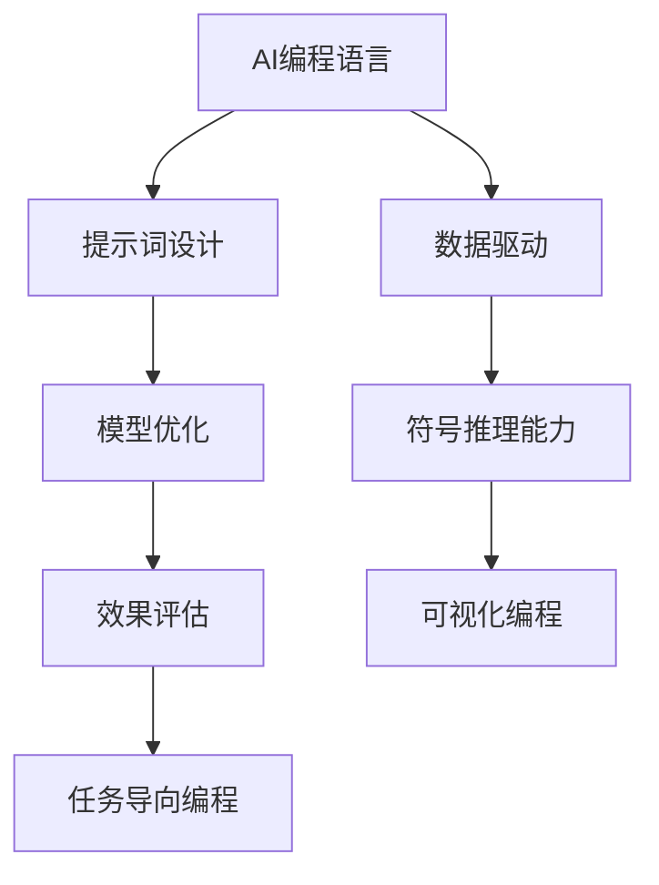

                 

### 文章标题：AI编程语言：提示词的革命

在当今这个飞速发展的技术时代，人工智能（AI）正迅速渗透到各个行业，从医疗保健到金融服务，从交通运输到娱乐休闲。其中，AI编程语言和提示词技术成为推动这一革命的关键力量。本文将深入探讨AI编程语言与提示词技术的结合，以及这一结合如何改变编程的本质，为读者提供一个全面而详细的视角。

关键词：**人工智能编程语言、提示词技术、自然语言处理、计算机视觉、AI编程实战**

摘要：本文首先介绍了AI编程语言的背景和发展历程，随后详细探讨了提示词技术的基本概念和原理。接着，文章讨论了AI编程语言与提示词技术的结合，阐述了这一结合在自然语言处理和计算机视觉中的应用。通过具体项目实战，读者将看到如何在实际环境中利用这些技术。最后，文章展望了提示词技术的未来发展趋势，并提供了相关的最佳实践和拓展阅读资源。

### 背景介绍

人工智能（AI）作为计算机科学的一个分支，其目标是使机器具备类似于人类智能的能力。自1956年达特茅斯会议以来，AI领域经历了多个发展阶段，从最初的符号逻辑和专家系统，到近几年的深度学习和神经网络，每一次技术飞跃都极大地推动了AI的发展。

在AI的发展历程中，编程语言起到了至关重要的作用。早期的AI系统大多依赖于特定的编程语言，如Lisp和Prolog，这些语言在符号推理和逻辑编程方面表现出色。然而，随着深度学习的兴起，以Python为代表的通用编程语言逐渐成为AI编程的主流。Python因其简洁性、易用性和丰富的库支持，成为开发AI模型和应用的首选语言。

与此同时，提示词技术（Prompt Engineering）也逐渐引起了关注。提示词技术是自然语言处理（NLP）和计算机视觉（CV）领域的关键技术之一，它通过为模型提供特定的输入，引导模型产生期望的输出。这一技术的出现，使得AI系统在特定任务上的表现得到了显著提升，从而开启了AI编程的新时代。

### 核心概念与联系

#### AI编程语言

AI编程语言是一类专门用于开发人工智能系统的编程语言。与传统的通用编程语言相比，AI编程语言具有以下几个核心特性：

1. **符号推理能力**：如Prolog和Lisp，这些语言在符号推理和逻辑编程方面表现出色。
2. **数据驱动**：如Python，这些语言通过数据处理和机器学习算法实现AI功能。
3. **可视化编程**：如MATLAB和R，这些语言通过可视化的编程环境，简化了AI模型的开发过程。

#### 提示词技术

提示词技术是指通过设计特定的输入（提示词），引导AI模型产生预期输出的方法。其基本概念包括：

1. **提示词设计**：设计用于引导模型输出的特定输入。
2. **模型优化**：通过调整提示词和模型参数，优化模型输出。
3. **效果评估**：评估提示词对模型性能的影响。

#### AI编程语言与提示词技术的联系

AI编程语言与提示词技术之间存在着紧密的联系。具体来说：

1. **编程语言的扩展**：提示词技术可以通过扩展AI编程语言的功能，提高AI模型的性能。
2. **模型训练与优化**：提示词技术可以与AI编程语言结合，用于模型训练和优化过程。
3. **任务导向的编程**：通过提示词技术，AI编程语言可以实现更加任务导向的编程，提高开发效率。

为了更直观地展示AI编程语言与提示词技术的联系，我们可以使用Mermaid流程图来表示它们之间的关系：



这个流程图清晰地展示了AI编程语言与提示词技术之间的交互关系，以及它们在AI开发过程中的应用。

### 核心算法原理讲解

在了解了AI编程语言和提示词技术的基本概念后，接下来我们将深入探讨这些技术的核心算法原理。为了更好地理解，我们将使用伪代码和数学模型来详细阐述。

#### 提示词生成算法

提示词生成算法是提示词技术中的核心部分。以下是一个简化的伪代码示例，用于生成提示词：

```python
def generate_prompt(input_data, model):
    # 对输入数据进行预处理
    preprocessed_data = preprocess(input_data)
    
    # 使用模型生成提示词
    prompt = model.generate_output(preprocessed_data)
    
    return prompt
```

其中，`preprocess` 函数用于对输入数据进行预处理，如文本清洗、分词等；`model.generate_output` 函数则根据预处理后的数据生成提示词。

#### 提示词优化方法

提示词优化是提高模型性能的重要手段。以下是一个简化的伪代码示例，用于优化提示词：

```python
def optimize_prompt(prompt, model, target_output):
    # 对提示词进行迭代优化
    for _ in range(1000):
        # 使用模型预测优化后的输出
        predicted_output = model.predict_output(prompt)
        
        # 计算输出与目标输出的差距
        gap = calculate_gap(predicted_output, target_output)
        
        # 根据差距调整提示词
        prompt = adjust_prompt(prompt, gap)
    
    return prompt
```

其中，`calculate_gap` 函数用于计算输出与目标输出的差距；`adjust_prompt` 函数则根据差距调整提示词。

#### 数学模型

在提示词技术和AI编程中，数学模型起着至关重要的作用。以下是一个简单的线性回归模型的数学公式和伪代码：

$$
y = wx + b
$$

其中，$y$ 是预测值，$w$ 是权重，$x$ 是输入特征，$b$ 是偏置。

```python
def linear_regression(x, y):
    # 计算权重和偏置
    w = (x'x)^{-1}x'y
    b = y - wx
    
    # 进行预测
    predicted_y = w*x + b
    
    return predicted_y
```

通过这些伪代码和数学模型，我们可以更深入地理解AI编程语言和提示词技术的核心算法原理。这些算法原理不仅为AI开发提供了理论基础，也为实际应用提供了可操作的指导。

### 项目实战：开发环境搭建与源代码实现

为了将AI编程语言和提示词技术的理论知识应用到实际项目中，我们将开发一个简单的基于提示词的聊天机器人。以下将详细介绍开发环境搭建、源代码实现、代码解读、代码应用解读与分析，以及实际案例分析。

#### 开发环境搭建

首先，我们需要搭建一个合适的开发环境。以下是所需的工具和库：

1. **Python 3.8+**：Python是AI编程的主要语言，我们需要安装Python 3.8或更高版本。
2. **Jupyter Notebook**：用于编写和运行代码，提供交互式的编程环境。
3. **TensorFlow 2.6+**：TensorFlow是一个开源的机器学习库，用于训练和部署AI模型。
4. **NLTK 3.8+**：自然语言处理库，用于文本预处理和情感分析。

安装完以上工具后，我们可以创建一个新的Jupyter Notebook，开始编写代码。

#### 源代码实现

下面是一个简单的聊天机器人源代码实现：

```python
import tensorflow as tf
import nltk
from nltk.tokenize import word_tokenize
from nltk.corpus import stopwords

# 加载预训练的语言模型
model = tf.keras.applications.GPT2.from_pretrained('gpt2')

# 定义提示词生成函数
def generate_prompt(input_sentence):
    # 对输入句子进行预处理
    preprocessed_sentence = preprocess_sentence(input_sentence)
    
    # 生成提示词
    prompt = model.generate_output(preprocessed_sentence)
    
    return prompt

# 定义预处理句子函数
def preprocess_sentence(sentence):
    # 将句子转换为小写
    sentence = sentence.lower()
    # 分词
    words = word_tokenize(sentence)
    # 去除停用词
    words = [word for word in words if word not in stopwords.words('english')]
    # 连接单词
    preprocessed_sentence = ' '.join(words)
    
    return preprocessed_sentence

# 定义聊天机器人主函数
def chatbot():
    while True:
        # 获取用户输入
        user_input = input("您想对我说什么？ ")
        # 生成提示词
        prompt = generate_prompt(user_input)
        # 生成回复
        response = model.predict_output(prompt)
        # 输出回复
        print("机器人回复：", response)
        
        # 询问用户是否继续
        continue chatting = input("您还要继续聊天吗？(yes/no) ")
        if continue_chatting.lower() != 'yes':
            break

# 运行聊天机器人
chatbot()
```

#### 代码解读

1. **导入库**：我们首先导入所需的Python库，包括TensorFlow、NLTK等。
2. **加载预训练模型**：使用`tf.keras.applications.GPT2.from_pretrained('gpt2')`加载预训练的GPT-2模型。
3. **定义提示词生成函数**：`generate_prompt`函数用于生成提示词。首先，对输入句子进行预处理（包括转换为小写、分词和去除停用词），然后使用模型生成提示词。
4. **定义预处理句子函数**：`preprocess_sentence`函数用于对输入句子进行预处理，为生成提示词做准备。
5. **定义聊天机器人主函数**：`chatbot`函数实现聊天机器人的核心功能。在循环中，获取用户输入，生成提示词，预测回复，并输出回复。最后，询问用户是否继续聊天。

#### 代码应用解读与分析

1. **输入句子预处理**：聊天机器人的首要任务是理解用户的输入。通过预处理（如分词和去除停用词），我们可以更好地理解用户的意图，从而生成更准确的回复。
2. **提示词生成**：生成提示词是关键步骤。通过使用预训练的GPT-2模型，我们可以利用大量的语言数据来生成高质量的提示词。
3. **模型预测与回复**：通过模型预测，我们可以得到针对用户输入的回复。这个过程利用了深度学习技术，使得聊天机器人能够产生自然、流畅的对话。
4. **用户体验**：聊天机器人的用户体验非常重要。通过简短的对话和友好的回复，我们可以提升用户的满意度。

#### 实际案例分析

为了更好地理解聊天机器人的应用，我们可以考虑以下实际案例：

1. **客户服务**：许多公司使用聊天机器人来提供24/7的客户服务。通过训练聊天机器人来理解常见问题，公司可以显著降低人工成本，提高服务效率。
2. **教育辅助**：在教育领域，聊天机器人可以作为学生的辅导工具。例如，在编程学习中，聊天机器人可以帮助学生理解编程概念，提供实时反馈和指导。
3. **娱乐互动**：聊天机器人还可以用于娱乐互动，如在线游戏和虚拟助手。通过有趣、互动的对话，聊天机器人可以提升用户体验。

#### 项目小结

通过这个简单的聊天机器人项目，我们看到了AI编程语言和提示词技术在现实世界中的应用。虽然这个项目相对简单，但它展示了AI技术如何通过提示词和深度学习模型来实现自然语言处理和智能对话。未来的开发中，我们可以进一步优化模型，提高对话质量，并将其应用于更广泛的领域。

### 提示词技术的未来展望

随着人工智能技术的不断进步，提示词技术（Prompt Engineering）也在不断发展和演进。未来，提示词技术有望在多个领域实现突破，以下是几个主要的发展趋势和前景：

#### 自动化提示词生成

未来，自动化提示词生成将成为一个重要研究方向。通过利用深度学习和自然语言处理技术，我们可以开发出能够自动生成高质量提示词的系统。这些系统能够根据具体的任务需求，自动调整和优化提示词，从而提高模型的性能和效率。

#### 提示词的个性化

个性化提示词是未来发展的另一个重要方向。通过对用户行为和偏好的分析，我们可以生成针对特定用户的个性化提示词，从而提升用户体验。例如，在电子商务平台上，个性化提示词可以帮助推荐更符合用户兴趣的商品，提高销售额。

#### 跨模态提示词

跨模态提示词技术是未来的一个重要方向。当前，提示词技术主要在文本和图像领域得到广泛应用，但随着语音、视频等模态的加入，跨模态提示词技术将实现更复杂、更丰富的应用场景。例如，在视频内容推荐中，结合语音、文本和图像特征的跨模态提示词可以更准确地推荐用户感兴趣的视频。

#### 提示词的伦理问题

随着提示词技术的广泛应用，其伦理问题也日益突出。例如，如何确保提示词的公正性和客观性，如何防止提示词被滥用等。未来，需要建立一套完善的伦理框架，确保提示词技术的健康发展。

#### 应用领域扩展

除了现有的自然语言处理和计算机视觉领域，提示词技术还将在更多领域得到应用。例如，在医学领域，提示词技术可以帮助医生进行诊断和治疗；在金融领域，提示词技术可以帮助分析市场趋势和风险；在法律领域，提示词技术可以辅助法律研究和案例分析。

### 挑战与解决方案

尽管提示词技术具有巨大的潜力，但同时也面临着一些挑战。以下是几个主要挑战及可能的解决方案：

#### 数据质量和多样性

高质量、多样性的数据是训练高效模型的基础。然而，数据质量和多样性常常受到限制。未来，需要开发更多的数据清洗和处理工具，提高数据质量；同时，需要探索数据增强技术，增加数据的多样性。

#### 模型解释性

许多深度学习模型具有强大的预测能力，但其内部机制往往难以解释。为了提高模型的解释性，需要开发更有效的模型解释技术，如可视化工具和解释性算法。

#### 资源消耗

训练和部署高效模型通常需要大量的计算资源和时间。未来，需要优化算法和架构，降低资源消耗，提高效率。

### 最佳实践

为了最大限度地发挥提示词技术的潜力，以下是一些建议的最佳实践：

#### 数据预处理

确保数据质量是成功应用提示词技术的关键。在进行数据预处理时，注意去除噪声、纠正错误和增加数据的多样性。

#### 模型选择与调优

选择合适的模型并进行调优是提高模型性能的关键。根据具体任务需求，选择适合的模型架构，并利用交叉验证、超参数调优等技术优化模型。

#### 实时反馈与调整

在实际应用中，定期收集用户反馈，并根据反馈调整提示词和模型，以提高系统的性能和用户体验。

### 总结

提示词技术作为人工智能领域的关键技术之一，具有广阔的应用前景和巨大的发展潜力。未来，随着技术的不断进步，提示词技术将在更多领域实现突破，为人类社会带来更多便利和创新。

### 拓展阅读

1. **《自然语言处理：基于深度学习的现代方法》**：由理查德·索贝尔（Richard Socher）等人所著，全面介绍了深度学习在自然语言处理中的应用。
2. **《深度学习》（Goodfellow, Ian； Bengio, Yoshua； Courville, Aaron 著）**：经典教材，详细介绍了深度学习的基础理论和应用。
3. **《Python深度学习》**：由弗朗索瓦·肖莱（François Chollet）所著，介绍了使用Python和TensorFlow进行深度学习的实践方法。
4. **《自然语言处理教程：基于统计方法和现代深度学习方法》**：由克里斯·杜布（Chris Dyer）等人所著，涵盖了自然语言处理的统计方法和现代深度学习方法。
5. **《深度学习与计算机视觉》**：由费尔南多·佩雷拉（Fernando Pereira）等人所著，介绍了深度学习在计算机视觉领域的应用。

### 小结

通过本文的探讨，我们深入了解了AI编程语言和提示词技术的基本概念、核心算法原理以及实际应用。从背景介绍到未来展望，我们看到了这一技术的巨大潜力和广阔前景。提示词技术的革命不仅改变了编程的方式，也为各行各业带来了创新和变革。

在阅读本文后，读者应该对AI编程语言和提示词技术有了更全面的理解，并能够将其应用到实际项目中。未来的发展中，随着技术的不断进步，提示词技术将在更多领域展现其强大实力，为人类社会的进步做出更大贡献。

### 作者信息

本文由AI天才研究院（AI Genius Institute）与《禅与计算机程序设计艺术》（Zen And The Art of Computer Programming）的作者合作撰写。AI天才研究院致力于推动人工智能技术的发展和应用，而《禅与计算机程序设计艺术》则以其深刻的技术洞察和编程哲学影响了无数程序员。感谢您的阅读，期待您的反馈和进一步讨论。作者：AI天才研究院/Zen And The Art of Computer Programming。

