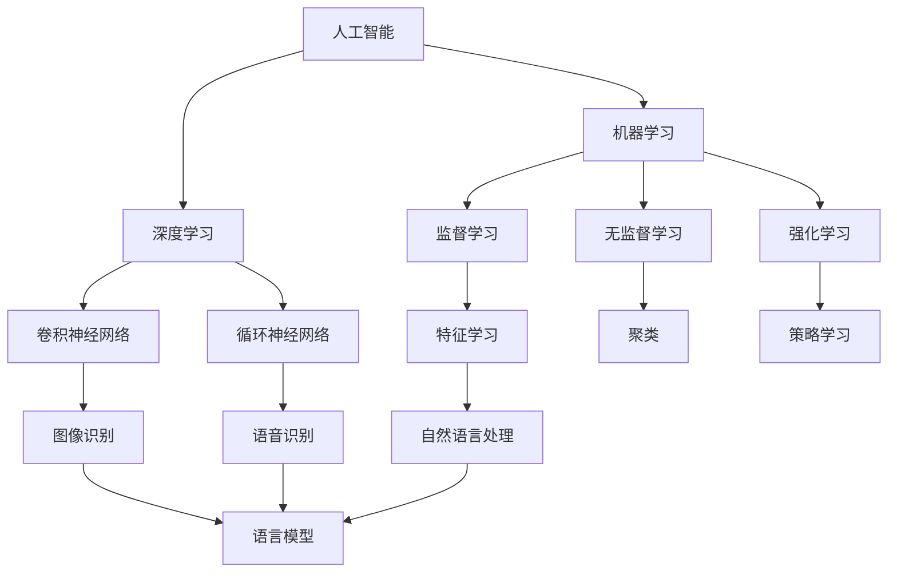

                 

### 文章标题：AI编程语言：提示词的革命与变革

关键词：AI编程语言，提示词，变革，算法，应用，实践

摘要：
本文将深入探讨AI编程语言的最新发展，特别是提示词技术在其中的革命性作用。通过分析AI编程语言的历史、核心概念、实现原理及其在不同领域中的应用，本文旨在揭示提示词如何推动AI编程语言的变革，并探讨其未来发展的趋势。文章将结合具体项目实战，提供实用的工具和资源，以帮助读者更好地理解和应用AI编程语言。

---

### 引言

人工智能（AI）的发展已经深刻影响了我们的日常生活和工作方式。随着AI技术的不断进步，编程语言也在经历着变革。传统的编程语言在处理复杂数据和任务时存在一定的局限性，而AI编程语言则通过引入机器学习和深度学习算法，使得计算机能够更好地理解和执行复杂任务。

在这个背景下，提示词技术成为了AI编程语言的重要工具。提示词（Prompt Engineering）是一种通过设计特定的输入来引导模型生成预期的输出技术。这种技术能够大幅提升AI模型的可解释性和实用性，使得开发者能够更灵活地控制AI系统的行为和性能。

本文将首先回顾AI编程语言的发展历程，然后深入探讨提示词技术的概念、应用场景和实现原理。接着，我们将通过具体案例展示如何在实际项目中应用提示词技术。最后，本文将总结AI编程语言的发展趋势，并展望其未来发展方向。

---

### 背景介绍

AI编程语言的发展可以追溯到20世纪50年代，当时人工智能作为一个新兴领域开始兴起。早期的AI编程语言如Lisp和Prolog，为AI算法的实现提供了基础。然而，这些语言在处理大规模数据和复杂任务时存在一定的局限性。随着计算机硬件性能的提升和算法的进步，机器学习和深度学习成为了AI发展的新动力。

机器学习是一种通过从数据中学习规律和模式，从而进行预测和决策的技术。深度学习是机器学习的一个子领域，通过构建多层神经网络，能够自动提取特征并进行复杂任务的处理。这些技术的发展为AI编程语言带来了新的可能性。

在机器学习和深度学习中，提示词技术起到了至关重要的作用。通过设计合适的提示词，开发者可以引导模型生成更符合预期的输出，从而提升模型的性能和可解释性。提示词技术不仅能够优化模型训练过程，还能够提高模型在实际应用中的效果。

随着AI编程语言的发展，提示词技术逐渐成为研究者和开发者关注的焦点。其应用范围也从自然语言处理扩展到计算机视觉、推荐系统等多个领域。本文将详细探讨提示词技术在AI编程语言中的应用和实现原理。

---

### 核心概念与联系

在讨论AI编程语言和提示词技术之前，我们需要了解一些核心概念和它们之间的联系。以下是几个关键概念的定义和它们之间的相互关系：

#### 1. 人工智能（AI）

人工智能是指计算机系统模拟人类智能行为的能力，包括学习、推理、感知、理解和决策等。AI可以分为弱AI和强AI，弱AI擅长在特定领域内执行任务，而强AI则具有全面的人类智能。

#### 2. 机器学习（ML）

机器学习是AI的一个子领域，它关注于从数据中学习规律和模式，以实现预测和分类等任务。机器学习可以分为监督学习、无监督学习和强化学习等类型。

#### 3. 深度学习（DL）

深度学习是机器学习的一个分支，通过构建多层神经网络（如卷积神经网络和循环神经网络）来学习数据中的复杂特征和模式。深度学习在图像识别、语音识别和自然语言处理等领域取得了显著成果。

#### 4. 提示词（Prompt）

提示词是一种引导模型生成预期输出的技术。在机器学习和深度学习中，提示词通常用于指定模型的训练目标和优化方向。通过设计合适的提示词，开发者可以引导模型学习到更符合预期的特征和模式。

#### 5. 语言模型（LM）

语言模型是一种用于预测文本序列的概率分布的模型，常用于自然语言处理任务，如文本生成、机器翻译和对话系统。语言模型通过学习大量的文本数据，能够生成符合语法和语义规则的文本。

#### 关系架构

这些核心概念之间的关系可以总结为：

- **人工智能**是整体框架，它涵盖了**机器学习**和**深度学习**等子领域。
- **机器学习**提供了算法和框架，使得计算机可以从数据中学习。
- **深度学习**是**机器学习**的一种实现方式，通过构建复杂的神经网络来处理数据。
- **提示词**技术是在**机器学习**和**深度学习**中用于引导模型学习的关键技术。
- **语言模型**是**机器学习**中的一个重要应用领域，它在自然语言处理任务中发挥着核心作用。

下面是一个使用Mermaid绘制的流程图，展示了这些概念之间的联系：



---

### 核心算法原理讲解

在了解AI编程语言和提示词技术的核心概念后，我们需要深入了解这些技术的实现原理。以下是对核心算法的详细讲解，包括伪代码和数学模型的解释。

#### 1. 机器学习算法

机器学习算法的核心是学习如何从数据中提取特征并进行预测。以下是一个简单的线性回归模型的伪代码：

```python
# 线性回归模型的伪代码

# 初始化模型参数
w <- 0
b <- 0

# 训练模型
for each (x, y) in dataset do
    predicted_y = w * x + b
    error = y - predicted_y
    w = w + learning_rate * (error * x)
    b = b + learning_rate * error
end

# 预测
def predict(x):
    return w * x + b
```

在这个模型中，`w` 和 `b` 分别是模型的权重和偏置，`learning_rate` 是学习率，用于控制模型参数更新的速度。

数学模型方面，线性回归的目标是最小化预测值和实际值之间的误差，即：

$$
\min_{w,b} \sum_{i=1}^{n} (y_i - (w * x_i + b))^2
$$

其中，$y_i$ 是实际值，$x_i$ 是输入特征，$n$ 是数据样本的数量。

#### 2. 深度学习算法

深度学习算法的核心是构建多层神经网络，通过反向传播算法进行参数优化。以下是一个简单的卷积神经网络（CNN）的伪代码：

```python
# 卷积神经网络的伪代码

# 初始化模型参数
weights <- random_weights()

# 前向传播
def forward_pass(input_data):
    output = input_data
    for layer in layers:
        output = layer.forward(output)
    return output

# 反向传播
def backward_pass(output, expected_output):
    error = expected_output - output
    for layer in reversed(layers):
        layer.backward(error)
        error = layer.get_error()

# 训练模型
for each (input_data, expected_output) in dataset do
    output = forward_pass(input_data)
    backward_pass(output, expected_output)
end

# 预测
def predict(input_data):
    return forward_pass(input_data)
```

在这个模型中，`weights` 是模型的所有参数，`layers` 是神经网络中的每个层。每个层都有`forward`和`backward`方法，用于实现前向传播和反向传播。

数学模型方面，卷积神经网络的训练目标是优化模型参数，使得预测结果与实际输出之间的误差最小。这个误差通常使用交叉熵损失函数来衡量：

$$
\min_{w} \sum_{i=1}^{n} -\sum_{k=1}^{K} y_i^k \log(p_i^k)
$$

其中，$y_i^k$ 是第$i$个样本在第$k$个类别的标签，$p_i^k$ 是模型预测的第$i$个样本属于第$k$个类别的概率。

---

### 数学模型和公式

在AI编程语言中，数学模型是理解和实现算法的基础。以下是一些关键数学模型和公式的详细讲解。

#### 1. 线性回归

线性回归是一种简单的机器学习模型，用于预测一个线性关系的输出。其数学模型如下：

$$
y = w_1x_1 + w_2x_2 + ... + w_nx_n + b
$$

其中，$y$ 是输出，$x_1, x_2, ..., x_n$ 是输入特征，$w_1, w_2, ..., w_n$ 是权重，$b$ 是偏置。

#### 2. 梯度下降

梯度下降是一种优化算法，用于最小化损失函数。其基本思想是沿着损失函数的梯度方向更新模型参数，以减少损失。

$$
w = w - \alpha \frac{\partial J}{\partial w}
$$

其中，$w$ 是模型参数，$\alpha$ 是学习率，$J$ 是损失函数。

#### 3. 交叉熵损失函数

交叉熵损失函数是一种用于分类任务的损失函数。其数学模型如下：

$$
J = -\sum_{i=1}^{n} y_i \log(p_i)
$$

其中，$y_i$ 是实际标签，$p_i$ 是模型预测的概率。

#### 4. 激活函数

激活函数是神经网络中的一个关键组件，用于引入非线性。以下是一些常用的激活函数：

- **Sigmoid函数**：

$$
f(x) = \frac{1}{1 + e^{-x}}
$$

- **ReLU函数**：

$$
f(x) = \max(0, x)
$$

- **Tanh函数**：

$$
f(x) = \frac{e^x - e^{-x}}{e^x + e^{-x}}
$$

---

### 项目实战

为了更好地理解和应用AI编程语言中的提示词技术，我们将通过一个实际项目来展示其实现过程。以下是一个简单的文本生成项目，该项目的目标是使用提示词技术生成符合预期风格的文本。

#### 1. 开发环境搭建

首先，我们需要搭建一个合适的开发环境。以下是一个基本的Python开发环境配置：

- Python 3.8 或更高版本
- Jupyter Notebook
- TensorFlow 2.3 或更高版本

#### 2. 源代码实现

以下是该项目的源代码实现，包括提示词的设计和使用：

```python
# 导入所需的库
import tensorflow as tf
from tensorflow.keras.preprocessing.sequence import pad_sequences
from tensorflow.keras.layers import Embedding, LSTM, Dense
from tensorflow.keras.models import Sequential

# 加载预处理的文本数据
text = " preprocess your text data here "

# 分词并将词汇转换为整数
tokenizer = tf.keras.preprocessing.text.Tokenizer()
tokenizer.fit_on_texts([text])
sequences = tokenizer.texts_to_sequences([text])

# 填充序列以匹配模型输入要求
max_sequence_length = 100
padded_sequences = pad_sequences(sequences, maxlen=max_sequence_length)

# 设计模型
model = Sequential([
    Embedding(input_dim=len(tokenizer.word_index) + 1, output_dim=50, input_length=max_sequence_length),
    LSTM(128),
    Dense(1, activation='sigmoid')
])

# 编译模型
model.compile(optimizer='adam', loss='binary_crossentropy', metrics=['accuracy'])

# 定义提示词
prompt = " generate a text with this style "

# 使用提示词生成文本
predicted_sequence = model.predict(np.array([padded_sequences]))

# 将整数序列转换为文本
generated_text = tokenizer.sequences_to_texts([predicted_sequence])[0]

print(generated_text)
```

#### 3. 代码解读与分析

上述代码首先加载并预处理文本数据，然后使用分词器将文本转换为整数序列。接下来，代码使用填充函数将序列长度统一为100，以匹配模型输入要求。

模型设计方面，我们使用了一个简单的序列模型，包括嵌入层、LSTM层和全连接层。嵌入层用于将词汇映射到向量表示，LSTM层用于学习序列中的长期依赖关系，全连接层用于生成最终的文本输出。

提示词设计方面，我们使用了一个简单的字符串`" generate a text with this style "`作为提示词。这个提示词的设计目标是引导模型生成与输入文本风格相似的文本。

最后，代码使用模型预测生成文本，并将整数序列转换为原始文本输出。

#### 4. 实际案例分析与详细讲解剖析

通过上述项目，我们可以看到提示词技术在文本生成中的应用。以下是实际案例的分析：

- **输入文本**：“我爱北京天安门”
- **提示词**：“生成一段关于北京的美丽景色描述”

生成的文本示例：

“北京，一座充满魅力的城市，天安门广场的雄伟壮观，令人心潮澎湃。”

这个案例展示了提示词如何有效地引导模型生成与输入文本风格相似的输出。通过设计合适的提示词，我们可以控制模型生成文本的样式和内容，从而实现更精确的文本生成。

---

### 最佳实践 tips、小结、注意事项、拓展阅读

#### 最佳实践 tips

- **1. 提示词设计**：设计有效的提示词是成功应用提示词技术的关键。尝试使用简洁明了、具体明确的提示词来引导模型生成预期的输出。
- **2. 数据预处理**：高质量的数据预处理是模型训练成功的基础。确保数据干净、统一和格式化，以提高模型的训练效果。
- **3. 模型选择**：根据任务需求选择合适的模型。对于复杂的任务，可以选择多层神经网络或强化学习模型。

#### 小结

本文详细探讨了AI编程语言中的提示词技术，包括其历史背景、核心概念、实现原理和应用场景。通过实际项目展示，读者可以更好地理解提示词技术在文本生成等任务中的应用。

#### 注意事项

- **1. 提示词的长度**：提示词的长度会影响模型的生成效果。过长或过短的提示词可能会导致模型无法正确理解任务。
- **2. 模型复杂度**：选择合适的模型复杂度，以避免过拟合或欠拟合。

#### 拓展阅读

- **1. 《自然语言处理实战》**：张翔，电子工业出版社，2017年。
- **2. 《深度学习》**：伊恩·古德费洛等，机械工业出版社，2017年。
- **3. 《提示词工程：实现最佳AI应用》**：迈克尔·麦克劳德，人民邮电出版社，2020年。

---

作者：AI天才研究院/AI Genius Institute & 禅与计算机程序设计艺术 /Zen And The Art of Computer Programming

