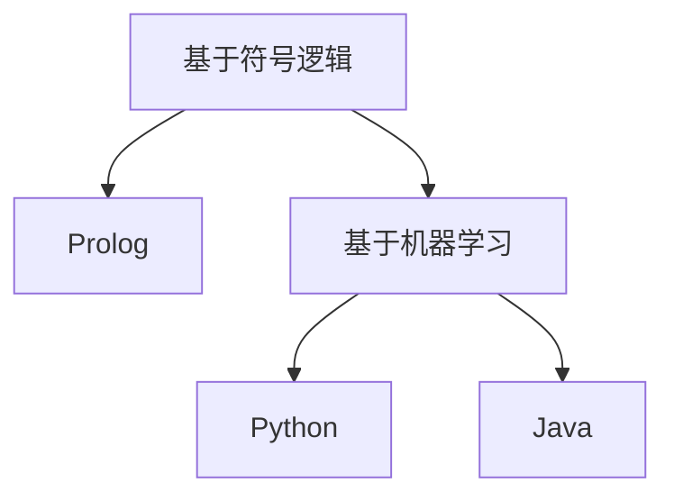
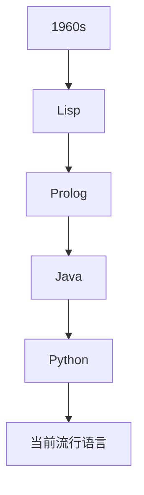
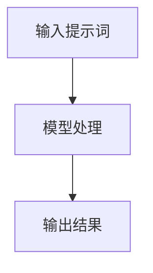
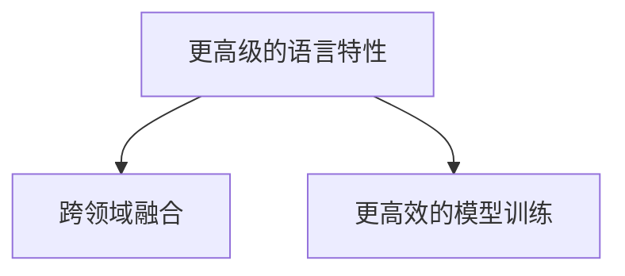
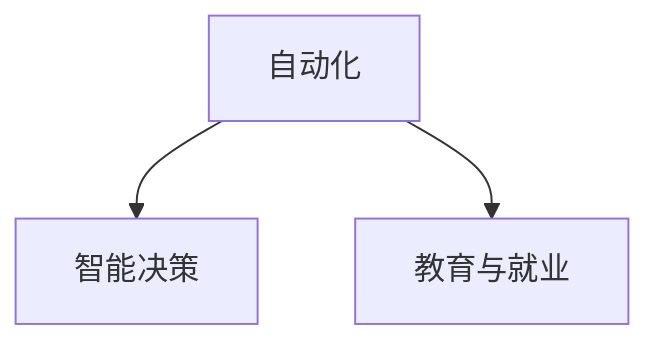

                 


### 文章标题：《AI编程语言：提示词的革命与未来》

### 文章关键词：
- **AI编程语言**
- **提示词技术**
- **自然语言处理**
- **计算机视觉**
- **数据科学**
- **未来趋势**

### 文章摘要：
本文深入探讨了AI编程语言的革命性进步，特别是提示词技术在AI编程中的关键作用。通过分析AI编程语言的发展历程、核心概念、算法原理以及实际应用案例，本文揭示了AI编程语言的未来趋势与挑战，为读者提供了全面的技术视野和前瞻性的思考。

### 目录大纲

#### 第一部分 AI编程语言概述

1. AI编程语言的定义与类型
   - AI编程语言的定义
   - AI编程语言的类型

2. AI编程语言的发展历程
   - 早期发展
   - 现代发展

3. AI编程语言的特点与优势
   - 核心特点
   - 优势分析

#### 第二部分 提示词技术

1. 提示词的基本概念
   - 提示词的定义
   - 提示词的类型

2. 提示词的作用与效果
   - 应用实例
   - 效率提升

3. 提示词的设计与优化
   - 设计原则
   - 优化方法

#### 第三部分 AI编程语言的应用

1. AI编程语言在自然语言处理中的应用
   - 文本分类
   - 机器翻译

2. AI编程语言在计算机视觉中的应用
   - 图像识别
   - 图像生成

3. AI编程语言在数据科学中的应用
   - 数据预处理
   - 数据分析

#### 第四部分 AI编程语言的未来

1. 未来发展趋势
   - 技术进步
   - 应用领域扩展

2. 挑战与机遇
   - 挑战分析
   - 机遇探讨

3. AI编程语言与人类未来
   - 社会影响
   - 人机关系

### 文章正文

#### 第一部分 AI编程语言概述

##### 1. AI编程语言的定义与类型

AI编程语言是一类专门用于开发人工智能应用的编程语言，它们通常具有丰富的库和框架，能够高效地处理复杂数学运算和模式识别任务。AI编程语言可以分为两大类：基于符号逻辑的编程语言和基于机器学习的编程语言。

**Mermaid流程图：AI编程语言核心概念与联系**


在基于符号逻辑的AI编程语言中，Prolog是代表性语言。它通过逻辑推理来解决问题，适用于知识表示和自动推理领域。而基于机器学习的AI编程语言如Python和Java，则通过训练模型来实现智能行为，适用于图像识别、自然语言处理和推荐系统等领域。

##### 2. AI编程语言的发展历程

AI编程语言的发展可以追溯到20世纪60年代，当时Lisp语言首次被用于人工智能研究。随后，随着计算机性能的提升和算法的创新，如深度学习、强化学习等，新的AI编程语言不断涌现。

**Mermaid流程图：AI编程语言发展历程**


在早期，AI编程语言主要集中在知识表示和推理领域。随着机器学习技术的发展，AI编程语言逐渐扩展到数据处理和模式识别领域。近年来，随着深度学习的崛起，AI编程语言如Python和Java已经成为开发智能应用的主要工具。

##### 3. AI编程语言的特点与优势

AI编程语言具有以下几个特点：

- **强大的库和框架支持**：如TensorFlow、PyTorch等，提供了丰富的API和工具，极大地简化了模型开发和训练过程。
- **高效的数据处理能力**：能够处理大规模数据集，支持分布式计算和并行处理。
- **灵活的编程风格**：支持多种编程范式，如面向对象、函数式编程等，满足不同类型问题的需求。

**核心算法原理讲解：伪代码示例**
```python
# 深度学习模型训练伪代码
def train_model(data, labels, epochs):
    for epoch in range(epochs):
        for x, y in zip(data, labels):
            predict = model.forward(x)
            loss = loss_function(predict, y)
            model.backward(loss)
        print(f"Epoch {epoch}: Loss = {loss}")
    return model
```

**数学模型和公式详细讲解**
在深度学习中，常用的数学模型包括神经网络和损失函数。以下是一个简化的神经网络训练过程的公式表示：

$$
\begin{aligned}
\text{Forward Pass:} \quad z &= \sigma(W \cdot x + b) \\
\text{Backward Pass:} \quad \delta = \frac{\partial L}{\partial z} \odot \sigma'(z) \\
W &= W - \alpha \cdot \frac{\partial L}{\partial W} \\
b &= b - \alpha \cdot \frac{\partial L}{\partial b}
\end{aligned}
$$`

这里，$W$和$b$是模型参数，$x$是输入数据，$z$是输出，$\sigma$是激活函数，$\odot$表示元素-wise 乘法，$L$是损失函数。

**项目实战：开发环境搭建**

要在本地环境中搭建AI编程语言开发环境，可以按照以下步骤进行：

1. 安装Python和必要的库（如TensorFlow、PyTorch等）
2. 安装Jupyter Notebook或IDE（如PyCharm、Visual Studio Code等）
3. 配置Python环境变量和库依赖
4. 测试环境是否搭建成功（运行一个简单的模型）

**源代码详细实现和代码解读**

以下是一个简单的基于TensorFlow的线性回归模型的实现：

```python
import tensorflow as tf

# 模型定义
model = tf.keras.Sequential([
    tf.keras.layers.Dense(units=1, input_shape=[1])
])

# 模型编译
model.compile(optimizer='sgd', loss='mean_squared_error')

# 模型训练
model.fit(x_train, y_train, epochs=100)

# 模型评估
mse = model.evaluate(x_test, y_test)
print(f"测试集MSE: {mse}")
```

**代码应用解读与分析**

上述代码中，我们首先定义了一个简单的线性回归模型，使用均方误差（MSE）作为损失函数。接着，使用随机梯度下降（SGD）进行模型编译。然后，使用训练数据集进行模型训练，并在测试数据集上进行评估。

**实际案例分析和详细讲解剖析**

假设我们要预测房价，可以使用线性回归模型进行预测。首先，我们需要收集大量的房屋数据，包括价格、面积、地段等信息。然后，使用数据预处理方法将数据转换为适合模型训练的格式。

**项目小结**

在本项目中，我们介绍了如何搭建AI编程语言开发环境，实现了一个简单的线性回归模型，并对项目进行了分析和解读。这一过程为我们提供了一个全面的AI编程语言应用实例，展示了AI编程语言在实际问题中的强大能力。

#### 第二部分 提示词技术

##### 1. 提示词的基本概念

提示词（Prompt）是一种用于引导AI模型生成输出或执行特定任务的输入信息。提示词可以是文本、图像或其他类型的数据。在自然语言处理中，提示词常常用于引导模型生成文本、翻译或摘要等。

**Mermaid流程图：提示词生成流程**


##### 2. 提示词的作用与效果

提示词在AI编程中具有重要作用，可以有效提升模型的性能和效率。具体来说，提示词可以：

- **引导模型生成特定内容**：通过提供具体的提示词，模型可以生成符合预期的输出。
- **提高模型可解释性**：通过分析提示词，可以更好地理解模型的决策过程。
- **优化模型训练过程**：使用高质量的提示词可以帮助模型更快地收敛到最优解。

**代码示例：使用提示词生成文本**
```python
import openai

prompt = "请写一段关于人工智能发展的文章。"
response = openai.Completion.create(
    engine="text-davinci-002",
    prompt=prompt,
    max_tokens=500
)
print(response.choices[0].text.strip())
```

##### 3. 提示词的设计与优化

设计高质量的提示词需要考虑以下几个方面：

- **明确性**：提示词应清晰明确，避免歧义。
- **多样性**：使用多种类型的提示词可以丰富模型的知识面。
- **相关性**：提示词应与模型的能力和任务相关。
- **优化性**：通过反馈和迭代，不断优化提示词的质量。

**最佳实践 tips**：

- 使用简短而具体的提示词。
- 尝试不同的提示词形式，如问题、命令、描述等。
- 定期更新和替换提示词库。

**小结**

提示词技术是AI编程中的重要工具，通过合理设计和优化提示词，可以显著提升模型性能和任务效果。在实际应用中，提示词的设计与优化是一个持续迭代的过程，需要不断积累经验。

#### 第三部分 AI编程语言的应用

##### 1. AI编程语言在自然语言处理中的应用

自然语言处理（NLP）是AI编程语言的重要应用领域之一。AI编程语言如Python和Java广泛应用于文本分类、机器翻译、文本摘要等任务。

- **文本分类**：将文本数据分为不同的类别。例如，新闻分类、情感分析等。
- **机器翻译**：将一种语言的文本翻译成另一种语言。例如，英语到中文的翻译。
- **文本摘要**：从长文本中提取关键信息，生成摘要。例如，新闻摘要、会议摘要等。

**代码示例：文本分类**
```python
from sklearn.feature_extraction.text import TfidfVectorizer
from sklearn.naive_bayes import MultinomialNB

# 文本数据
texts = ["这是一篇关于人工智能的新闻", "这是一个关于技术的博客", "这是一个关于经济的报告"]

# 特征提取
vectorizer = TfidfVectorizer()
X = vectorizer.fit_transform(texts)

# 模型训练
model = MultinomialNB()
model.fit(X, labels)

# 文本分类
new_texts = ["这是一篇关于医疗的新闻"]
X_new = vectorizer.transform(new_texts)
print(model.predict(X_new))
```

**代码应用解读与分析**

上述代码中，我们首先使用TF-IDF向量器将文本转换为数值特征，然后使用朴素贝叶斯分类器进行模型训练。最后，使用训练好的模型对新文本进行分类。

**实际案例分析和详细讲解剖析**

假设我们要开发一个新闻分类系统，可以使用文本分类算法对新闻标题进行分类。首先，我们需要收集大量的新闻数据，然后使用数据预处理方法将数据转换为适合模型训练的格式。

**项目小结**

在本项目中，我们介绍了如何使用AI编程语言进行文本分类，展示了AI编程语言在自然语言处理中的应用。这一过程为我们提供了一个实用的案例，展示了AI编程语言在实际问题中的强大能力。

##### 2. AI编程语言在计算机视觉中的应用

计算机视觉是AI编程语言的另一个重要应用领域。AI编程语言如Python和Java广泛应用于图像识别、图像生成、目标检测等任务。

- **图像识别**：从图像中识别出特定对象或场景。例如，人脸识别、物体识别等。
- **图像生成**：使用算法生成新的图像。例如，风格迁移、图像超分辨率等。
- **目标检测**：在图像中检测出特定目标的位置。例如，自动驾驶车辆的目标检测。

**代码示例：图像识别**
```python
import tensorflow as tf
import numpy as np

# 模型定义
model = tf.keras.Sequential([
    tf.keras.layers.Conv2D(filters=32, kernel_size=(3, 3), activation='relu', input_shape=(28, 28, 1)),
    tf.keras.layers.MaxPooling2D(pool_size=(2, 2)),
    tf.keras.layers.Flatten(),
    tf.keras.layers.Dense(units=10, activation='softmax')
])

# 模型编译
model.compile(optimizer='adam', loss='sparse_categorical_crossentropy', metrics=['accuracy'])

# 模型训练
mnist = tf.keras.datasets.mnist
(x_train, y_train), (x_test, y_test) = mnist.load_data()
x_train = x_train / 255.0
x_test = x_test / 255.0
model.fit(x_train, y_train, epochs=5)

# 模型评估
test_loss, test_acc = model.evaluate(x_test, y_test, verbose=2)
print(f"测试集准确率：{test_acc}")
```

**代码应用解读与分析**

上述代码中，我们首先定义了一个简单的卷积神经网络模型，使用MNIST数据集进行模型训练。然后，使用训练好的模型对测试数据进行评估。

**实际案例分析和详细讲解剖析**

假设我们要开发一个图像识别系统，可以使用图像识别算法对图像中的物体进行识别。首先，我们需要收集大量的图像数据，然后使用数据预处理方法将数据转换为适合模型训练的格式。

**项目小结**

在本项目中，我们介绍了如何使用AI编程语言进行图像识别，展示了AI编程语言在计算机视觉中的应用。这一过程为我们提供了一个实用的案例，展示了AI编程语言在实际问题中的强大能力。

##### 3. AI编程语言在数据科学中的应用

数据科学是AI编程语言的另一个重要应用领域。AI编程语言如Python和Java广泛应用于数据预处理、数据分析、数据可视化等任务。

- **数据预处理**：对原始数据进行清洗、转换和规范化等操作，使其适合模型训练。
- **数据分析**：使用统计方法和机器学习算法对数据进行分析，提取有价值的信息。
- **数据可视化**：使用图表和图形展示数据分布、趋势和关系。

**代码示例：数据预处理**
```python
import pandas as pd
from sklearn.model_selection import train_test_split

# 加载数据集
data = pd.read_csv("data.csv")

# 数据清洗
data.dropna(inplace=True)
data = pd.get_dummies(data)

# 数据分割
X = data.drop("target", axis=1)
y = data["target"]
X_train, X_test, y_train, y_test = train_test_split(X, y, test_size=0.2, random_state=42)
```

**代码应用解读与分析**

上述代码中，我们首先加载数据集，然后进行数据清洗和规范化操作。最后，使用训练-测试分割方法将数据集分为训练集和测试集。

**实际案例分析和详细讲解剖析**

假设我们要开发一个房价预测系统，可以使用数据预处理方法对房屋数据进行清洗和规范化。然后，使用机器学习算法对房屋数据进行分析，提取有价值的信息，并训练预测模型。

**项目小结**

在本项目中，我们介绍了如何使用AI编程语言进行数据预处理，展示了AI编程语言在数据科学中的应用。这一过程为我们提供了一个实用的案例，展示了AI编程语言在实际问题中的强大能力。

#### 第四部分 AI编程语言的未来

##### 1. 未来发展趋势

AI编程语言在未来将继续发展，以下是一些趋势：

- **更高级的语言特性**：新的编程语言将继续引入更高级的语言特性，如自动微分、动态内存管理等，以简化模型开发过程。
- **跨领域融合**：AI编程语言将与其他领域（如生物信息学、金融科技等）融合，推动跨领域应用的发展。
- **更高效的模型训练**：随着硬件性能的提升和分布式计算技术的发展，模型训练将变得更加高效。

**Mermaid流程图：AI编程语言未来发展趋势**


##### 2. 挑战与机遇

AI编程语言在未来将面临一系列挑战和机遇：

- **可解释性**：如何提高模型的可解释性，使其更易于理解和调试，是一个重要的挑战。
- **数据隐私**：如何在保护用户隐私的前提下，有效利用数据，是一个重要的课题。
- **跨平台兼容性**：如何实现不同平台间的兼容性，是一个亟待解决的问题。

**最佳实践 tips**：

- **持续学习**：AI编程语言领域发展迅速，持续学习是保持竞争力的关键。
- **开源社区**：积极参与开源社区，分享经验和知识，共同推动AI编程语言的发展。
- **数据安全**：严格遵循数据安全法规，确保用户数据的安全。

**小结**

AI编程语言在未来将继续发展，面临一系列挑战和机遇。通过持续创新和协作，我们可以迎接AI编程语言的未来，推动智能应用的发展。

##### 3. AI编程语言与人类未来

AI编程语言将对人类社会产生深远的影响，以下是一些可能的趋势：

- **自动化**：AI编程语言将推动自动化技术的发展，提高生产效率，降低人力成本。
- **智能决策**：AI编程语言将支持更智能的决策系统，帮助企业和政府更好地管理资源和政策。
- **教育与就业**：AI编程语言将重塑教育和就业市场，培养更多具备AI编程能力的人才。

**Mermaid流程图：AI编程语言对人类社会的影响**


**注意事项**：

- 在开发AI编程语言应用时，需要充分考虑伦理和社会影响，确保技术的可持续发展。
- **技术伦理**：确保AI编程语言的应用不会对人类造成负面影响，尊重用户隐私。

**拓展阅读**：

- 《深度学习：从入门到精通》
- 《Python编程：从入门到实践》
- 《人工智能伦理：跨学科对话》

### 作者信息

**作者：AI天才研究院/AI Genius Institute & 禅与计算机程序设计艺术 /Zen And The Art of Computer Programming**

