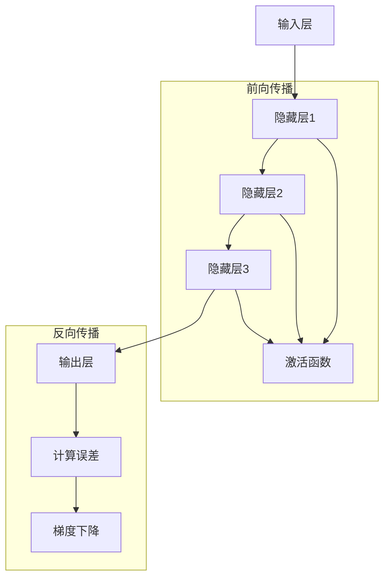
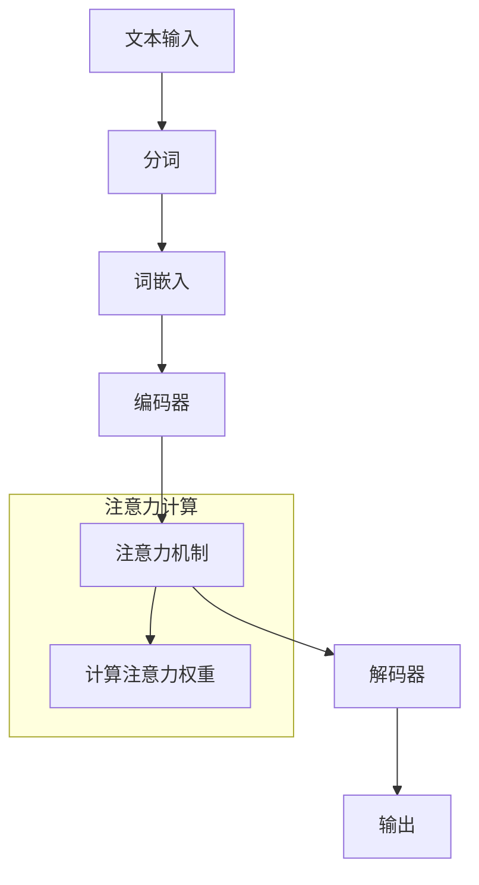
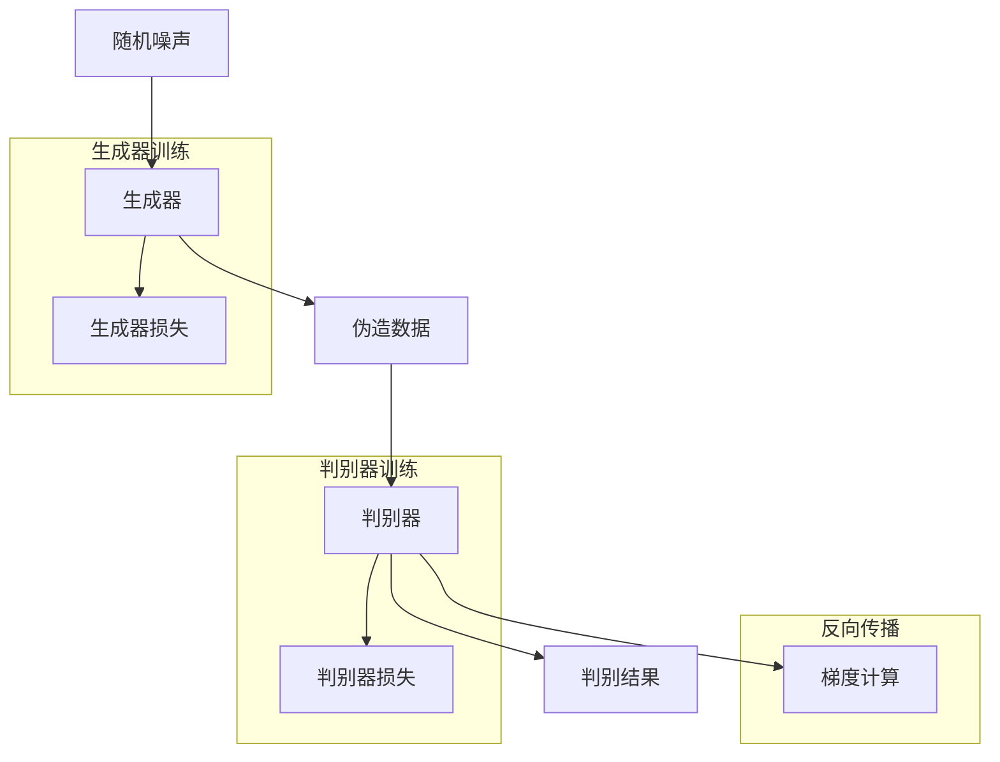

                 

### 文章标题：AI编程语言：提示词的革命与未来

关键词：AI编程语言、提示词、神经网络、自然语言处理、生成对抗网络、项目实战、未来展望

摘要：本文旨在深入探讨AI编程语言的核心概念、发展历程、核心算法及其在未来应用中的潜力。通过剖析提示词编程的独特性，结合具体算法原理和项目实战，本文为读者提供了一幅全面而细致的AI编程语言全景图，展示了其在技术革命中的重要作用和广阔前景。

### 目录

## 第一部分：AI编程语言概述

### 第1章 AI编程语言的起源与发展

#### 1.1 AI编程语言的诞生背景

AI编程语言的诞生，是计算机科学发展的必然结果。自20世纪中期以来，随着计算机硬件的不断升级和软件算法的日益复杂，人工智能（AI）逐渐从理论研究走向了实际应用。AI编程语言的诞生，不仅为人工智能领域的研究提供了新的工具，也推动了整个计算机科学的发展。

在早期，计算机科学家主要依赖于低级语言，如汇编语言，来编写AI程序。这些语言直接操作计算机的硬件资源，虽然效率极高，但编程复杂度也非常高，需要程序员具备深厚的计算机硬件知识。随着计算机技术的进步，高级编程语言逐渐出现，如C、C++和Python等。这些语言提供了更抽象的编程模型，使得程序员能够更加专注于算法设计和程序逻辑，而无需过多关注底层硬件细节。

#### 1.2 提示词编程的概念

提示词编程（Prompt-Based Programming）是一种以提示词为核心的人工智能编程范式。在这种编程模式下，程序员通过向AI系统提供明确的提示词，指导AI系统执行特定的任务。提示词可以是文本、图像或其他形式的数据，它们充当了人类与AI系统之间的桥梁，使得AI系统能够更好地理解和执行人类的指令。

提示词编程的核心思想是利用AI系统强大的学习和推理能力，使其能够从少量的提示词中推导出复杂的操作流程。这种模式不仅简化了编程过程，还提高了编程的灵活性和可扩展性。与传统编程相比，提示词编程更加直观、易于理解和应用。

#### 1.3 提示词编程与传统编程的区别

提示词编程与传统编程在多个方面存在显著差异。首先，在编程方法上，传统编程依赖于明确的代码和逻辑结构，而提示词编程则侧重于通过提示词来引导AI系统的行为。这意味着程序员不需要编写大量的代码，而是通过提供提示词来简化编程任务。

其次，在编程流程上，传统编程通常需要经过需求分析、设计、编码、测试等多个阶段，而提示词编程则更加灵活和迭代。程序员可以通过不断调整和优化提示词来逐步完善AI系统的功能，而不必从头开始重新编写代码。

此外，在编程结果上，提示词编程能够生成更智能、更灵活的程序。由于AI系统具备自我学习和适应能力，它们能够根据提示词的反馈进行自我调整，从而实现更高的任务完成度和准确性。

#### 1.4 AI编程语言的发展历程

AI编程语言的发展历程可以分为几个关键阶段。最早期的AI编程语言主要集中于逻辑推理和符号计算，如Prolog。随后，随着机器学习技术的发展，以Python为代表的编程语言逐渐成为主流，其强大的库和框架为AI编程提供了丰富的工具和资源。

近年来，提示词编程范式逐渐兴起，为AI编程语言的发展注入了新的活力。例如，基于生成对抗网络（GAN）的编程语言、自然语言处理（NLP）编程语言等，都在不同领域展现了巨大的潜力。这些编程语言不仅提升了编程的效率，还为AI领域的创新提供了新的可能性。

#### 1.5 AI编程语言的应用场景

AI编程语言在多个领域展现出了强大的应用潜力。在图像处理领域，AI编程语言可以用于图像分类、目标检测、图像生成等任务。在自然语言处理领域，AI编程语言可以用于文本分类、情感分析、机器翻译等任务。在推荐系统领域，AI编程语言可以用于用户行为分析、商品推荐等任务。此外，AI编程语言还在游戏开发、自动驾驶、医疗诊断等多个领域得到了广泛应用。

通过提示词编程范式，程序员可以更加轻松地实现复杂的AI任务，从而推动人工智能技术的普及和发展。### 第1章 AI编程语言的起源与发展

#### 1.1 AI编程语言的诞生背景

AI编程语言的诞生是计算机科学发展的必然结果。在计算机科学的发展历程中，人工智能一直是一个重要的研究领域。从最初的逻辑推理、知识表示到现代的深度学习和强化学习，AI技术不断演进，为各种应用场景提供了强大的支持。

在早期，计算机科学家主要依赖于低级语言，如汇编语言，来编写AI程序。这些语言直接操作计算机的硬件资源，虽然效率极高，但编程复杂度也非常高，需要程序员具备深厚的计算机硬件知识。随着计算机技术的进步，高级编程语言逐渐出现，如C、C++和Python等。这些语言提供了更抽象的编程模型，使得程序员能够更加专注于算法设计和程序逻辑，而无需过多关注底层硬件细节。

#### 1.2 提示词编程的概念

提示词编程（Prompt-Based Programming）是一种以提示词为核心的人工智能编程范式。在这种编程模式下，程序员通过向AI系统提供明确的提示词，指导AI系统执行特定的任务。提示词可以是文本、图像或其他形式的数据，它们充当了人类与AI系统之间的桥梁，使得AI系统能够更好地理解和执行人类的指令。

提示词编程的核心思想是利用AI系统强大的学习和推理能力，使其能够从少量的提示词中推导出复杂的操作流程。这种模式不仅简化了编程过程，还提高了编程的灵活性和可扩展性。与传统编程相比，提示词编程更加直观、易于理解和应用。

例如，在一个图像分类任务中，程序员可以提供一个提示词，如“请识别这幅图片中的主要对象”。AI系统通过分析和学习这个提示词，能够自动识别并分类图片中的对象。这个过程不需要程序员编写复杂的代码，而是通过提供简明的提示词来实现。

#### 1.3 提示词编程与传统编程的区别

提示词编程与传统编程在多个方面存在显著差异。首先，在编程方法上，传统编程依赖于明确的代码和逻辑结构，而提示词编程则侧重于通过提示词来引导AI系统的行为。这意味着程序员不需要编写大量的代码，而是通过提供提示词来简化编程任务。

其次，在编程流程上，传统编程通常需要经过需求分析、设计、编码、测试等多个阶段，而提示词编程则更加灵活和迭代。程序员可以通过不断调整和优化提示词来逐步完善AI系统的功能，而不必从头开始重新编写代码。

此外，在编程结果上，提示词编程能够生成更智能、更灵活的程序。由于AI系统具备自我学习和适应能力，它们能够根据提示词的反馈进行自我调整，从而实现更高的任务完成度和准确性。例如，在自动驾驶领域，程序员可以通过提供不同的提示词，让AI系统在不同环境和条件下进行学习和调整，从而提高其自动驾驶的能力。

#### 1.4 AI编程语言的发展历程

AI编程语言的发展历程可以分为几个关键阶段。最早期的AI编程语言主要集中于逻辑推理和符号计算，如Prolog。随后，随着机器学习技术的发展，以Python为代表的编程语言逐渐成为主流，其强大的库和框架为AI编程提供了丰富的工具和资源。

近年来，提示词编程范式逐渐兴起，为AI编程语言的发展注入了新的活力。例如，基于生成对抗网络（GAN）的编程语言、自然语言处理（NLP）编程语言等，都在不同领域展现了巨大的潜力。这些编程语言不仅提升了编程的效率，还为AI领域的创新提供了新的可能性。

在AI编程语言的发展历程中，以下几个重要事件具有重要意义：

- **1956年：达特茅斯会议**：这是人工智能领域的开创性会议，标志着人工智能正式成为一个独立的科学领域。
- **1965年：普罗洛格（Prolog）诞生**：普罗洛格是一种基于逻辑的编程语言，为AI编程提供了强大的推理能力。
- **1980年代：专家系统的兴起**：专家系统是早期AI应用的一个重要领域，其核心思想是通过模拟人类专家的知识和推理能力来解决复杂问题。
- **1990年代：机器学习的发展**：机器学习技术，如神经网络和决策树，为AI编程提供了更强大的数据分析和学习能力。
- **2000年代：深度学习的崛起**：深度学习技术的兴起，特别是卷积神经网络（CNN）和循环神经网络（RNN）的广泛应用，推动了AI编程语言的进一步发展。
- **2010年代：提示词编程的兴起**：随着生成对抗网络（GAN）、自然语言处理（NLP）等技术的快速发展，提示词编程逐渐成为AI编程的一个重要范式。

#### 1.5 AI编程语言的应用场景

AI编程语言在多个领域展现出了强大的应用潜力。在图像处理领域，AI编程语言可以用于图像分类、目标检测、图像生成等任务。在自然语言处理领域，AI编程语言可以用于文本分类、情感分析、机器翻译等任务。在推荐系统领域，AI编程语言可以用于用户行为分析、商品推荐等任务。此外，AI编程语言还在游戏开发、自动驾驶、医疗诊断等多个领域得到了广泛应用。

以下是几个具体的AI编程语言应用场景的例子：

- **图像处理**：使用AI编程语言，如TensorFlow和PyTorch，程序员可以轻松实现图像分类、目标检测和图像生成等任务。例如，在医学图像分析中，AI编程语言可以帮助医生快速识别和诊断疾病。
- **自然语言处理**：AI编程语言在自然语言处理领域有着广泛的应用，如文本分类、情感分析和机器翻译。例如，在社交媒体分析中，AI编程语言可以帮助企业分析用户评论，了解用户对产品的看法。
- **推荐系统**：AI编程语言可以帮助构建高效的推荐系统，如电子商务平台上的商品推荐系统。通过分析用户行为和偏好，AI编程语言可以提供个性化的推荐，提高用户体验。
- **游戏开发**：在游戏开发中，AI编程语言可以用于实现智能对手、场景生成和游戏机制等。例如，在电子竞技游戏中，AI编程语言可以帮助设计更复杂和智能的对手，提高游戏的可玩性。
- **自动驾驶**：自动驾驶技术的核心是AI编程语言。通过深度学习和生成对抗网络等技术，AI编程语言可以帮助车辆实现环境感知、路径规划和决策控制等功能，从而实现自动驾驶。

通过提示词编程范式，程序员可以更加轻松地实现复杂的AI任务，从而推动人工智能技术的普及和发展。### 第2章 提示词编程基础

#### 2.1 提示词的基本结构

提示词是提示词编程的核心元素，它们决定了AI系统如何理解和执行任务。一个典型的提示词通常包括以下组成部分：

- **主题**：提示词的主题是指要执行的主要任务或目标。例如，在图像分类任务中，主题可以是“识别图像中的主要对象”。
- **目标**：目标是指提示词希望实现的具体结果。例如，在图像分类任务中，目标可以是“准确识别并标记图像中的对象”。
- **条件**：条件是指提示词在执行任务时需要满足的限制或约束。例如，在图像分类任务中，条件可以是“在规定的时间内完成识别任务”。
- **方法**：方法是指提示词提供的信息或策略，用于指导AI系统如何完成任务。例如，在图像分类任务中，方法可以是“使用卷积神经网络进行图像特征提取，然后进行分类”。

提示词的基本结构可以表示为：

```
主题：[目标] [条件] [方法]
```

例如，一个具体的提示词可以是：

```
主题：图像分类
目标：准确识别并标记图像中的对象
条件：在规定的时间内完成识别任务
方法：使用卷积神经网络进行图像特征提取，然后进行分类
```

#### 2.2 提示词的类型与语法

根据用途和表现形式，提示词可以分为以下几种类型：

- **文本型提示词**：文本型提示词是最常见的类型，它们使用自然语言描述任务目标、条件和方法。例如，上面的图像分类提示词就是一个文本型提示词。
- **图像型提示词**：图像型提示词通过图像来传达任务信息。例如，一个图像分类任务可以提供一个包含多个图像的列表，每个图像代表一个类别，用于指导AI系统进行分类。
- **音频型提示词**：音频型提示词使用声音或语音来传达任务信息。例如，在语音识别任务中，提示词可以是语音指令，如“播放下一首歌曲”。
- **视频型提示词**：视频型提示词通过视频来传达任务信息。例如，在视频分类任务中，提示词可以是一个视频片段，用于指导AI系统识别视频中的主要对象。

不同类型的提示词在语法和表达方式上有所不同，但它们的核心目标都是提供清晰、明确的任务指导。

#### 2.3 提示词编程的核心原理

提示词编程的核心原理在于通过提示词引导AI系统执行任务。这种编程范式利用了AI系统的自我学习和推理能力，使其能够从少量的提示词中推导出复杂的操作流程。

提示词编程的核心原理可以概括为以下几个步骤：

1. **接收提示词**：AI系统首先接收程序员提供的提示词，这些提示词可以是文本、图像、音频或视频等形式。
2. **解析提示词**：AI系统对提示词进行解析，提取出主题、目标、条件和方法的详细信息。
3. **任务规划**：基于解析得到的提示词信息，AI系统制定一个执行任务的计划。这个计划包括具体的操作步骤、所需资源和时间安排等。
4. **执行任务**：AI系统按照制定的计划执行任务，通过自我学习和调整来优化任务结果。
5. **反馈与优化**：AI系统在执行任务后，根据任务结果进行反馈，如果任务结果不符合预期，AI系统会调整提示词或执行策略，以实现更优的任务结果。

以下是一个简单的提示词编程示例，展示了上述原理：

```
主题：图像分类
目标：准确识别并标记图像中的对象
条件：在规定的时间内完成识别任务
方法：使用卷积神经网络进行图像特征提取，然后进行分类

AI系统接收提示词后，首先解析出主题（图像分类）、目标（准确识别并标记对象）、条件和（在规定时间内完成）以及方法（使用卷积神经网络）。然后，AI系统制定一个执行计划的步骤：

1. 加载图像数据
2. 使用卷积神经网络提取图像特征
3. 进行图像分类并标记结果
4. 检查任务完成时间，如果超过规定时间，调整模型参数

AI系统按照这个计划执行任务，并在任务完成后检查结果。如果识别准确度较低或任务完成时间过长，AI系统会调整提示词或模型参数，以优化任务结果。

通过这个过程，提示词编程实现了从人类指令到AI执行任务的自动化转换，大大简化了编程过程，提高了AI系统的灵活性和适应性。

#### 2.4 提示词编程的优缺点

提示词编程作为一种新兴的人工智能编程范式，具有许多优点，但也存在一些缺点。

**优点**：

1. **简化编程过程**：提示词编程通过提供简明的提示词，代替了传统编程中复杂、冗长的代码。这大大简化了编程过程，使得程序员可以更加专注于算法设计和任务实现。
2. **提高开发效率**：提示词编程模式允许程序员快速迭代和优化AI系统。通过不断调整提示词，程序员可以迅速测试和改进AI系统的功能，从而提高开发效率。
3. **增强AI适应性**：提示词编程利用了AI系统的自我学习和推理能力，使其能够根据提示词的反馈进行自我调整。这种模式使得AI系统具有更高的适应性，能够更好地应对各种复杂任务和变化。
4. **降低编程门槛**：提示词编程不需要程序员具备深厚的计算机科学和AI知识，通过简单的提示词即可实现复杂的AI任务。这降低了AI编程的门槛，使得更多的开发人员可以参与到人工智能领域。

**缺点**：

1. **结果不确定性**：由于AI系统的自我学习和调整能力，提示词编程的结果存在一定的不确定性。在复杂任务中，AI系统可能会产生意外的行为，导致任务结果不符合预期。
2. **调试困难**：提示词编程中的错误可能不容易被发现和修复。由于提示词和AI系统的交互复杂，调试过程可能变得繁琐和耗时。
3. **依赖AI系统**：提示词编程高度依赖AI系统的能力和性能。如果AI系统的学习能力或性能不足，提示词编程的效果可能大打折扣。
4. **缺乏透明性**：提示词编程中的AI系统内部逻辑和决策过程通常是不透明的。程序员难以理解AI系统是如何处理提示词和执行任务的，这可能导致对AI系统的信任度降低。

总的来说，提示词编程具有许多优点，如简化编程过程、提高开发效率和增强AI适应性等。但同时也存在一些缺点，如结果不确定性、调试困难等。因此，在实际应用中，需要根据具体任务和需求，权衡提示词编程的优缺点，选择合适的编程范式。### 第3章 基于提示词的神经网络算法

#### 3.1 神经网络的基本结构

神经网络（Neural Networks）是人工智能领域的一个重要组成部分，特别是在提示词编程中，神经网络算法被广泛应用于图像处理、自然语言处理和推荐系统等多个领域。神经网络的基本结构类似于人脑的神经元网络，由大量的节点（神经元）和连接（边）组成。

一个典型的神经网络可以分为以下几个主要部分：

1. **输入层（Input Layer）**：输入层是神经网络接收外部输入信息的部分。每个输入节点对应一个输入特征，例如图像中的像素值、文本中的单词等。
2. **隐藏层（Hidden Layers）**：隐藏层位于输入层和输出层之间，用于处理和转换输入数据。隐藏层中的每个神经元都接收来自输入层的输入，并通过激活函数进行非线性变换，然后将结果传递到下一层。
3. **输出层（Output Layer）**：输出层是神经网络产生最终输出的部分。输出节点的数量和类型取决于具体任务的类型。例如，在多类分类任务中，输出层通常包含多个节点，每个节点代表一个类别；在回归任务中，输出层通常只有一个节点。

每个神经元通过多个权重（weights）连接到其他神经元，这些权重决定了输入信息在传递过程中的重要性。在神经网络训练过程中，通过不断调整这些权重，使得神经网络能够更好地拟合训练数据。

#### 3.2 前向传播与反向传播算法

神经网络的核心算法包括前向传播（Forward Propagation）和反向传播（Backpropagation）。这些算法决定了神经网络如何通过训练数据来学习和调整内部权重。

**前向传播算法**：

1. **初始化权重和偏置**：在训练开始前，神经网络需要随机初始化权重和偏置。这些参数将在训练过程中通过梯度下降（Gradient Descent）等方法进行调整。
2. **输入数据传递**：将训练数据输入神经网络，通过输入层传递到隐藏层和输出层。在每个层次，输入数据与对应的权重相乘，然后通过激活函数进行非线性变换。
3. **计算损失函数**：在输出层，计算输出结果与实际标签之间的误差，通过损失函数（如均方误差MSE）进行量化。
4. **反向传播误差**：将输出层的误差反向传递到隐藏层，通过链式法则（Chain Rule）计算每个神经元关于权重的梯度。

**反向传播算法**：

1. **计算梯度**：利用链式法则，反向传播算法可以计算出每个权重和偏置的梯度，即误差关于每个参数的导数。
2. **权重更新**：利用梯度下降方法，将计算得到的梯度乘以学习率（Learning Rate），然后从当前权重中减去这个值，以更新权重。
3. **迭代优化**：重复前向传播和反向传播过程，直到神经网络达到预定的损失目标或迭代次数。

以下是一个简单的神经网络前向传播和反向传播的伪代码示例：

```python
# 前向传播
def forward_propagation(x, weights):
    z = x * weights
    output = activate(z)
    return output

# 反向传播
def backward_propagation(output, y, weights):
    error = output - y
    gradient = error * activate_derivative(z)
    weight_update = learning_rate * gradient
    weights -= weight_update
    return weights
```

在这个示例中，`x` 代表输入数据，`weights` 代表神经网络权重，`output` 代表输出结果，`y` 代表实际标签，`activate` 和 `activate_derivative` 分别代表激活函数及其导数。

通过前向传播和反向传播算法，神经网络能够不断调整内部权重，使得输出结果逐渐逼近实际标签，从而实现模型的训练和优化。

#### 3.3 优化算法与学习率调整

在神经网络训练过程中，优化算法和学习率的调整是影响模型性能和训练速度的关键因素。以下是一些常用的优化算法和学习率调整方法：

**1. 随机梯度下降（Stochastic Gradient Descent, SGD）**：

随机梯度下降是一种简单的优化算法，它通过随机选择一部分训练数据进行梯度计算和权重更新。这种算法的优点是实现简单、计算效率高，但缺点是收敛速度较慢且易陷入局部最优。

**2. 扩展随机梯度下降（Mini-batch Gradient Descent）**：

扩展随机梯度下降（也称为批量梯度下降）是对随机梯度下降的改进。它将训练数据分成小批次，在每个批次上计算梯度并更新权重。这种方法在计算效率和收敛速度上取得了较好的平衡。

**3. Adam优化器**：

Adam优化器是一种结合了SGD和扩展随机梯度下降优点的自适应优化算法。它通过计算一阶矩估计（均值）和二阶矩估计（方差）来自适应调整学习率。Adam优化器在处理稀疏数据和长尾分布数据时表现尤为出色。

**学习率调整方法**：

1. **固定学习率**：固定学习率是最简单的一种学习率调整方法，即在训练过程中保持学习率不变。这种方法适用于初始训练阶段，但可能会导致训练过程缓慢且不稳定。
2. **学习率衰减**：学习率衰减是一种通过逐渐减小学习率来优化模型的方法。在训练过程中，学习率会按照预定规律逐渐减小，从而避免模型过度拟合。常用的学习率衰减策略包括线性衰减、指数衰减和余弦衰减等。
3. **自适应学习率**：自适应学习率方法通过动态调整学习率，使得模型能够更快地收敛并避免过拟合。常用的自适应学习率算法包括Adam、RMSprop和Adadelta等。

以下是一个使用Adam优化器的简单示例：

```python
import tensorflow as tf

# 初始化模型参数
weights = tf.Variable(tf.random.normal([input_size, hidden_size]))
biases = tf.Variable(tf.random.normal([hidden_size, output_size]))

# 定义前向传播和损失函数
def forward_propagation(x):
    z = tf.matmul(x, weights) + biases
    output = tf.nn.relu(z)
    return output

def loss_function(y, logits):
    return tf.reduce_mean(tf.nn.softmax_cross_entropy_with_logits(logits=logits, labels=y))

# 定义反向传播和优化
optimizer = tf.keras.optimizers.Adam(learning_rate=0.001)
optimizer.minimize(loss_function)

# 训练模型
for epoch in range(num_epochs):
    for batch in dataset:
        x, y = batch
        with tf.GradientTape() as tape:
            logits = forward_propagation(x)
            loss = loss_function(y, logits)
        gradients = tape.gradient(loss, [weights, biases])
        optimizer.apply_gradients(zip(gradients, [weights, biases]))

    print(f"Epoch {epoch+1}, Loss: {loss.numpy()}")
```

在这个示例中，我们使用了TensorFlow框架中的Adam优化器来训练神经网络。通过调整学习率和优化器的参数，可以优化模型的训练过程并提高最终的性能。

通过优化算法与学习率调整，神经网络能够在训练过程中不断优化内部权重，从而实现更高效、更准确的模型训练。这为提示词编程提供了强大的技术支持，使得AI系统能够更好地理解和执行复杂的任务。### 第4章 自然语言处理算法

#### 4.1 词嵌入技术

词嵌入（Word Embedding）是自然语言处理（Natural Language Processing，NLP）中的一个核心技术，它将词汇表中的单词映射为密集向量表示。这种向量表示不仅保留了单词的语义信息，还使得单词之间的相似性和距离关系在向量空间中得以体现。

词嵌入技术的核心思想是将每个单词映射为一个固定长度的向量。这些向量不仅能够表示单词的基本语义信息，如词性、含义等，还可以用于各种NLP任务，如文本分类、情感分析、机器翻译等。

**词嵌入的类型**：

1. **基于统计的词嵌入**：这种类型的词嵌入通过分析大量文本数据，发现单词之间的统计相关性。典型的模型包括Word2Vec、SGNS（Stochastic Gradient Neural Network）和CBOW（Continuous Bag of Words）等。
2. **基于神经网络的词嵌入**：这种类型的词嵌入通过训练神经网络模型，将单词映射为高维向量。典型的模型包括GloVe（Global Vectors for Word Representation）和BERT（Bidirectional Encoder Representations from Transformers）等。

**词嵌入的优势**：

1. **维度降低**：词嵌入技术将词汇表中的单词从高维稀疏向量映射为低维密集向量，从而降低了计算复杂度和存储空间需求。
2. **语义表示**：词嵌入不仅保留了单词的基本语义信息，还能够捕捉单词之间的复杂语义关系，如词义相近、词义相反等。
3. **任务兼容性**：词嵌入技术适用于各种NLP任务，如文本分类、情感分析、机器翻译等，为这些任务提供了强大的数据表示能力。

#### 4.2 序列模型与注意力机制

序列模型（Sequence Models）是NLP中用于处理序列数据（如文本、语音等）的常用模型。序列模型通过捕捉数据序列中的时序关系和依赖关系，实现对序列数据的理解和处理。常见的序列模型包括循环神经网络（Recurrent Neural Networks，RNN）和长短期记忆网络（Long Short-Term Memory，LSTM）等。

**循环神经网络（RNN）**：

循环神经网络是一种能够处理序列数据的神经网络模型。它通过重复使用相同的神经网络单元，在时间步之间传递状态信息，从而实现对序列数据的建模。RNN的基本结构包括输入门、遗忘门和输出门，这些门控制信息在时间步之间的传递和更新。

**长短期记忆网络（LSTM）**：

长短期记忆网络是RNN的一种改进，它通过引入记忆单元和门控机制，有效解决了RNN在处理长序列数据时遇到的梯度消失和梯度爆炸问题。LSTM的核心组件包括输入门、遗忘门和输出门，这些门控制信息在时间步之间的传递和更新，从而实现长时间依赖的建模。

**注意力机制（Attention Mechanism）**：

注意力机制是近年来在NLP中广泛应用的一种技术，它通过动态调整每个时间步的权重，使得模型能够关注序列中的关键信息。注意力机制可以显著提高模型在序列数据上的性能，特别是在长文本处理、机器翻译和情感分析等任务中。

**注意力机制的实现**：

注意力机制可以分为多种形式，如基于加权的注意力、基于分割的注意力、基于融合的注意力等。以下是一个简单的基于加权的注意力机制的实现示例：

```python
# 定义注意力机制
def attention(q, k, v, mask=None):
    # 计算注意力权重
    attention_weights = softmax(q @ k.T, mask=mask)
    # 计算注意力输出
    attention_output = attention_weights @ v
    return attention_output

# 计算注意力权重
q = tf.random.normal([batch_size, hidden_size])
k = tf.random.normal([batch_size, sequence_length, hidden_size])
v = tf.random.normal([batch_size, sequence_length, hidden_size])

# 应用注意力机制
attention_output = attention(q, k, v, mask=None)
```

在这个示例中，`q`、`k` 和 `v` 分别代表查询向量、键向量和值向量，`mask` 是一个可选的掩码，用于忽略不重要的信息。通过计算注意力权重和注意力输出，模型能够动态关注序列中的关键信息，从而提高模型性能。

#### 4.3 转换器架构详解

转换器架构（Transformer Architecture）是近年来在NLP中取得突破性成果的一种新型模型架构。与传统序列模型（如RNN和LSTM）相比，转换器架构通过引入自注意力机制（Self-Attention）和编码器-解码器结构，实现了对序列数据的高效处理和建模。

**转换器架构的基本组件**：

1. **编码器（Encoder）**：编码器负责将输入序列转换为固定长度的向量表示。编码器通常包含多个自注意力层和前馈神经网络层，这些层通过堆叠实现了对输入序列的深入建模。
2. **解码器（Decoder）**：解码器负责将编码器的输出序列解码为输出序列。解码器同样包含多个自注意力层和前馈神经网络层，以及一个最终的输出层。解码器的输出通常通过softmax函数转换为概率分布，用于生成最终的输出序列。

**自注意力机制（Self-Attention）**：

自注意力机制是转换器架构的核心组件，它通过计算序列中每个元素之间的依赖关系，实现对序列数据的全局建模。自注意力机制可以分为基于加权的注意力、基于分割的注意力、基于融合的注意力等类型。

**编码器-解码器结构**：

编码器-解码器结构是转换器架构的基本框架，它通过编码器和解码器的交互，实现了对输入序列到输出序列的映射。编码器将输入序列编码为固定长度的向量表示，解码器通过自注意力机制和交叉注意力机制，从编码器的输出序列中提取信息，并生成输出序列。

**转换器架构的优势**：

1. **并行处理**：与传统序列模型相比，转换器架构能够实现并行处理，从而显著提高计算效率。
2. **全局建模**：自注意力机制使得转换器架构能够捕捉序列中任意元素之间的依赖关系，实现全局建模。
3. **高效训练**：编码器-解码器结构使得转换器架构能够高效地进行端到端的训练，从而提高模型性能。

以下是一个简单的转换器架构实现示例：

```python
import tensorflow as tf

# 定义编码器
def encoder(inputs, hidden_size):
    # 应用多层自注意力层
    for _ in range(num_layers):
        attention_output = self_attention_layer(inputs, hidden_size)
        inputs = add(attention_output, inputs)
        inputs = dropout(inputs, dropout_rate)
        inputs = activation_function(inputs)

    # 应用前馈神经网络层
    for _ in range(num_feedsforward_layers):
        inputs = dense_layer(inputs, hidden_size * 4, activation_function)
        inputs = dropout(inputs, dropout_rate)
        inputs = dense_layer(inputs, hidden_size, activation_function)

    return inputs

# 定义解码器
def decoder(inputs, hidden_size):
    # 应用多层自注意力层
    for _ in range(num_layers):
        attention_output = self_attention_layer(inputs, hidden_size)
        inputs = add(attention_output, inputs)
        inputs = dropout(inputs, dropout_rate)
        inputs = activation_function(inputs)

    # 应用交叉注意力层
    for _ in range(num_layers):
        attention_output = cross_attention_layer(inputs, encoder_output, hidden_size)
        inputs = add(attention_output, inputs)
        inputs = dropout(inputs, dropout_rate)
        inputs = activation_function(inputs)

    # 应用输出层
    logits = dense_layer(inputs, output_size, activation_function=None)
    return logits

# 训练模型
inputs = tf.random.normal([batch_size, sequence_length, input_size])
encoder_output = encoder(inputs, hidden_size)
logits = decoder(encoder_output, hidden_size)

# 计算损失
loss = loss_function(labels, logits)
optimizer.minimize(loss, var_list=var_list)
```

在这个示例中，我们使用了TensorFlow框架来实现一个简单的转换器架构。通过定义编码器和解码器的函数，以及应用自注意力机制和交叉注意力机制，我们可以构建一个高效的NLP模型。

#### 4.4 提示词编程与自然语言处理

提示词编程在自然语言处理（NLP）中有着广泛的应用，通过提供简明的提示词，程序员可以指导AI系统执行各种复杂的NLP任务。以下是一些提示词编程在NLP中的应用示例：

1. **文本分类**：在文本分类任务中，程序员可以提供一个简单的提示词，如“请将这段文本分类为新闻、体育、娱乐等类别”。AI系统通过分析文本内容和上下文信息，根据提示词的指示进行分类。
2. **情感分析**：在情感分析任务中，程序员可以提供一个提示词，如“请分析这段文本的情感倾向，判断是正面、负面还是中性”。AI系统通过分析文本中的情感词和情感强度，根据提示词的指示进行情感分析。
3. **命名实体识别**：在命名实体识别任务中，程序员可以提供一个提示词，如“请识别并标记这段文本中的地名、人名、组织名等”。AI系统通过分析文本结构和语义信息，根据提示词的指示进行命名实体识别。
4. **机器翻译**：在机器翻译任务中，程序员可以提供一个提示词，如“请将这段英文翻译为中文”。AI系统通过分析源语言和目标语言的语义信息，根据提示词的指示进行机器翻译。

以下是一个简单的文本分类任务示例，展示了提示词编程在NLP中的应用：

```python
# 定义提示词
prompt = "请将这段文本分类为新闻、体育、娱乐等类别"

# 加载预训练的文本分类模型
model = load_pretrained_text_classifier()

# 加载待分类的文本数据
text_data = "本次足球比赛吸引了大量球迷的关注"

# 应用提示词编程
predicted_category = model.predict(text_data)

# 输出结果
print(f"文本分类结果：{predicted_category}")
```

在这个示例中，我们使用了预训练的文本分类模型，并通过提供简单的提示词，实现了对文本数据的分类。通过提示词编程，程序员可以轻松实现复杂的NLP任务，从而推动自然语言处理技术的发展和应用。### 第5章 生成对抗网络

#### 5.1 GAN的原理与结构

生成对抗网络（Generative Adversarial Network，GAN）是2014年由Ian Goodfellow等研究者提出的一种新型深度学习模型。GAN的核心思想是通过两个相互对抗的神经网络——生成器（Generator）和判别器（Discriminator）——的训练和博弈，生成高质量的伪造数据。

**生成器（Generator）**：

生成器的任务是生成与真实数据分布相近的伪造数据。在GAN中，生成器通常接收一个随机噪声向量作为输入，通过一系列的神经网络层生成伪造数据。这些伪造数据可以是图像、文本、音频等任何形式的数据。生成器的目标是最小化与真实数据的差异，使得判别器难以区分伪造数据与真实数据。

**判别器（Discriminator）**：

判别器的任务是判断输入数据是真实数据还是伪造数据。判别器接收真实数据和伪造数据作为输入，通过一系列的神经网络层输出一个概率值，表示输入数据是真实数据的置信度。判别器的目标是最小化与真实数据伪造数据的差异，使得判别器能够准确区分真实数据与伪造数据。

**GAN的训练过程**：

GAN的训练过程类似于两个对手在玩猜谜游戏。生成器和判别器交替进行训练，生成器和判别器的损失函数分别如下：

- **生成器的损失函数**：

  $$ L_G = -\log(D(G(z))) $$

  其中，$G(z)$ 是生成器生成的伪造数据，$D(G(z))$ 是判别器对伪造数据的置信度。生成器的目标是最小化这个损失函数，使得判别器对伪造数据的置信度尽可能低。

- **判别器的损失函数**：

  $$ L_D = -\log(D(x)) - \log(1 - D(G(z))) $$

  其中，$x$ 是真实数据，$D(x)$ 是判别器对真实数据的置信度。判别器的目标是最小化这个损失函数，使得判别器能够准确区分真实数据与伪造数据。

**GAN的结构**：

GAN的基本结构包括一个生成器、一个判别器和两个损失函数。生成器和判别器都是深度神经网络，它们通过交替训练实现对抗优化。在训练过程中，生成器和判别器不断地调整自己的参数，以实现最优的博弈状态。

以下是一个简单的GAN结构的示意图：


#### 5.2 GAN的优化方法

GAN的训练过程中，生成器和判别器的优化是关键。以下是一些常见的GAN优化方法：

**1. 前向反向梯度提升（FGM）**：

前向反向梯度提升（FGM）方法通过调整生成器和判别器的学习率，使得它们能够更快地收敛。具体来说，FGM将判别器的学习率调整为生成器的学习率的倍数，从而使得判别器能够更快地适应生成器的变化。

**2. 梯度惩罚（Gradient Penalties）**：

梯度惩罚方法通过在生成器和判别器的损失函数中添加额外的梯度惩罚项，来抑制生成器和判别器的梯度膨胀和消失问题。具体来说，梯度惩罚方法会在损失函数中添加一个与梯度幅值的平方成正比的惩罚项，从而约束生成器和判别器的梯度大小。

**3. 预训练判别器（Pre-trained Discriminator）**：

预训练判别器方法通过在训练过程中先预训练判别器，然后再将预训练的判别器应用于生成器的训练。这种方法可以减少判别器在训练初期的梯度消失和梯度膨胀问题，从而提高GAN的训练效果。

**4. 自适应学习率（Adaptive Learning Rate）**：

自适应学习率方法通过动态调整生成器和判别器的学习率，使得它们在训练过程中能够更快地收敛。常见的自适应学习率方法包括Adam优化器、RMSprop优化器等。

以下是一个使用自适应学习率方法的GAN优化示例：

```python
import tensorflow as tf

# 定义生成器和判别器
generator = build_generator()
discriminator = build_discriminator()

# 定义优化器
optimizer_g = tf.keras.optimizers.Adam(learning_rate=0.0001)
optimizer_d = tf.keras.optimizers.Adam(learning_rate=0.0004)

# 定义损失函数
loss_function = tf.keras.losses.BinaryCrossentropy()

# 训练GAN
for epoch in range(num_epochs):
    for batch in data_loader:
        x, _ = batch

        # 训练判别器
        with tf.GradientTape() as tape:
            z = generate_random_samples(batch_size)
            fake_images = generator(z)
            real_loss = loss_function(discriminator(x), 1.0)
            fake_loss = loss_function(discriminator(fake_images), 0.0)

        gradients_d = tape.gradient(real_loss + fake_loss, discriminator.trainable_variables)
        optimizer_d.apply_gradients(zip(gradients_d, discriminator.trainable_variables))

        # 训练生成器
        with tf.GradientTape() as tape:
            z = generate_random_samples(batch_size)
            fake_images = generator(z)
            fake_loss = loss_function(discriminator(fake_images), 1.0)

        gradients_g = tape.gradient(fake_loss, generator.trainable_variables)
        optimizer_g.apply_gradients(zip(gradients_g, generator.trainable_variables))

        # 打印训练进度
        print(f"Epoch {epoch+1}, D Loss: {real_loss.numpy()}, G Loss: {fake_loss.numpy()}")

# 保存训练好的生成器
generator.save('generator.h5')
discriminator.save('discriminator.h5')
```

在这个示例中，我们使用了TensorFlow框架来实现一个GAN模型。通过定义生成器和判别器的函数，以及使用Adam优化器来调整学习率，我们可以优化GAN的训练过程，提高生成数据的质量。

#### 5.3 提示词编程与GAN的应用

提示词编程在GAN的应用中起到了关键作用，通过提供简明的提示词，程序员可以指导GAN生成特定类型的高质量数据。以下是一些提示词编程在GAN中的应用示例：

1. **图像生成**：在图像生成任务中，程序员可以提供一个简单的提示词，如“请生成一张具有猫耳朵和猫尾巴的狗图像”。GAN系统通过分析提示词，结合已有的图像数据，生成符合提示词要求的图像。
2. **文本生成**：在文本生成任务中，程序员可以提供一个简单的提示词，如“请生成一段关于秋天的描述性文本”。GAN系统通过分析提示词和已有的文本数据，生成符合提示词要求的文本。
3. **音频生成**：在音频生成任务中，程序员可以提供一个简单的提示词，如“请生成一段具有鸟鸣声的背景音乐”。GAN系统通过分析提示词和已有的音频数据，生成符合提示词要求的音频。

以下是一个简单的图像生成任务示例，展示了提示词编程在GAN中的应用：

```python
# 定义提示词
prompt = "请生成一张具有猫耳朵和猫尾巴的狗图像"

# 加载预训练的GAN模型
generator = load_pretrained_generator()

# 生成图像
fake_image = generator.generate_image(prompt)

# 显示生成的图像
plt.imshow(fake_image)
plt.show()
```

在这个示例中，我们使用了预训练的GAN模型，并通过提供简单的提示词，实现了对图像的生成。通过提示词编程，程序员可以轻松实现复杂的GAN任务，从而推动生成对抗网络技术的发展和应用。### 第6章 AI编程语言项目实战

#### 6.1 项目背景与目标

随着人工智能技术的快速发展，AI编程语言在多个领域展现出了巨大的应用潜力。本案例研究旨在探讨如何使用AI编程语言，特别是基于提示词编程的范式，实现一个实际的AI项目。本项目旨在通过开发一个简单的图像分类系统，展示AI编程语言在实际应用中的优势和灵活性。

项目目标包括：

1. **数据预处理**：对图像数据进行预处理，包括图像增强、数据归一化等，以提高模型的训练效果和准确性。
2. **模型选择**：选择合适的神经网络模型，以实现高效的图像分类任务。
3. **提示词编写**：编写有效的提示词，以指导AI系统进行图像分类。
4. **模型训练**：使用提示词编程，指导AI系统进行模型训练，并通过优化算法调整模型参数。
5. **模型评估**：对训练好的模型进行评估，验证其在图像分类任务中的性能。
6. **项目优化**：根据评估结果，对模型和提示词进行优化，以提高分类准确度和系统效率。

#### 6.2 项目开发环境搭建

为了实现本项目的目标，需要搭建一个合适的开发环境，包括硬件资源和软件工具。以下是一个基本的开发环境搭建步骤：

1. **硬件资源**：
   - 处理器：至少需要一块性能良好的GPU，如NVIDIA RTX 30系列，以支持深度学习模型的训练。
   - 内存：至少16GB内存，以应对大数据量的处理和模型存储。
   - 硬盘：至少500GB的SSD硬盘，用于存储数据和模型文件。

2. **软件工具**：
   - 操作系统：Windows 10或Linux系统，建议使用Linux系统以提高开发效率和稳定性。
   - 编程语言：Python，是当前最流行的AI编程语言，具有丰富的库和框架。
   - 深度学习框架：TensorFlow或PyTorch，是当前最常用的深度学习框架，提供了强大的模型训练和推理功能。
   - 数据预处理工具：OpenCV，用于图像数据的预处理和增强。
   - 评估工具：Matplotlib和Scikit-learn，用于可视化模型性能和评估结果。

以下是一个简单的环境搭建示例：

```bash
# 安装操作系统
# ...

# 安装Python
sudo apt-get install python3 python3-pip

# 安装深度学习框架
pip3 install tensorflow tensorflow-addons

# 安装数据预处理工具
pip3 install opencv-python

# 安装评估工具
pip3 install matplotlib scikit-learn
```

通过上述步骤，可以搭建一个基本的AI项目开发环境，为后续的模型训练和提示词编写提供支持。

#### 6.3 数据预处理与模型选择

在AI项目中，数据预处理是至关重要的一步。良好的数据预处理不仅可以提高模型的训练效果，还可以减少过拟合现象，提高模型的泛化能力。以下是本项目中的数据预处理和模型选择过程：

**数据预处理**：

1. **数据集收集**：本项目使用一个公开的图像分类数据集，如CIFAR-10或ImageNet。这些数据集包含多种类别的图像，适合用于训练图像分类模型。
2. **数据清洗**：对数据集进行清洗，去除错误标注或损坏的图像，确保数据质量。
3. **数据增强**：使用数据增强技术，如随机裁剪、旋转、翻转等，增加数据多样性，提高模型的鲁棒性。
4. **数据归一化**：将图像数据归一化到0-1范围内，以便于模型训练和推理。

以下是一个简单的数据预处理示例：

```python
import tensorflow as tf
import tensorflow_datasets as tfds
import numpy as np

# 加载CIFAR-10数据集
(train_images, train_labels), (test_images, test_labels) = tfds.load('cifar10', split=['train', 'test'], as_supervised=True)

# 数据增强
def augment(image, label):
    image = tf.image.random_flip_left_right(image)
    image = tf.image.random_flip_up_down(image)
    return image, label

# 应用数据增强
train_images, train_labels = tf.data.Dataset.from_tensor_slices((train_images, train_labels)).map(augment).batch(batch_size)

# 数据归一化
def normalize(image, label):
    image = tf.cast(image, tf.float32) / 255.0
    return image, label

# 应用数据归一化
train_images, train_labels = train_images.map(normalize)
test_images, test_labels = test_images.map(normalize)

# 模型选择**：

本项目选择使用卷积神经网络（Convolutional Neural Network，CNN）进行图像分类。CNN是一种专门用于处理图像数据的神经网络模型，具有强大的特征提取和分类能力。

以下是一个简单的CNN模型结构：

```python
import tensorflow as tf
from tensorflow.keras import layers

model = tf.keras.Sequential([
    layers.Conv2D(32, (3, 3), activation='relu', input_shape=(32, 32, 3)),
    layers.MaxPooling2D((2, 2)),
    layers.Conv2D(64, (3, 3), activation='relu'),
    layers.MaxPooling2D((2, 2)),
    layers.Conv2D(64, (3, 3), activation='relu'),
    layers.Flatten(),
    layers.Dense(64, activation='relu'),
    layers.Dense(10, activation='softmax')
])

model.compile(optimizer='adam', loss='sparse_categorical_crossentropy', metrics=['accuracy'])
```

在这个模型中，我们使用了多个卷积层和池化层来提取图像特征，并通过全连接层进行分类。模型使用Adam优化器和稀疏分类交叉熵损失函数进行训练，并使用准确率作为评估指标。

通过上述数据预处理和模型选择，我们为AI项目搭建了坚实的基础，为后续的模型训练和提示词编写提供了支持。### 6.4 提示词编写与模型训练

在完成数据预处理和模型选择之后，下一步是编写提示词并进行模型训练。提示词在AI编程语言中起着至关重要的作用，它们能够指导AI系统执行特定任务，并通过反复迭代优化模型性能。

#### 提示词编写

提示词的编写需要遵循以下原则：

1. **明确性**：提示词应明确、简洁，能够清晰地传达任务目标。
2. **可操作性**：提示词应具体、可操作，便于AI系统执行。
3. **灵活性和适应性**：提示词应具备一定的灵活性，能够适应不同场景和任务需求。

以下是一个示例提示词：

```
任务：训练一个图像分类模型，识别输入图像中的类别。
目标：在训练集上达到90%以上的准确率，并在测试集上保持良好的泛化能力。
条件：使用CIFAR-10数据集，模型训练时间不超过48小时。
方法：使用卷积神经网络，结合数据增强和调整学习率等策略，优化模型性能。
```

#### 模型训练

模型训练过程如下：

1. **初始化模型参数**：使用随机初始化方法为模型生成初始参数。
2. **数据加载和预处理**：将预处理后的数据加载到模型中，包括训练集和测试集。
3. **定义损失函数和优化器**：选择合适的损失函数（如交叉熵）和优化器（如Adam）。
4. **训练模型**：使用训练集对模型进行训练，并在训练过程中记录损失和准确率。
5. **评估模型**：使用测试集对模型进行评估，验证模型的泛化能力。

以下是一个简单的模型训练示例：

```python
# 加载预处理后的数据
train_images, train_labels = load_preprocessed_data('train')
test_images, test_labels = load_preprocessed_data('test')

# 编写训练循环
for epoch in range(num_epochs):
    # 训练模型
    with tf.GradientTape() as tape:
        predictions = model(train_images, training=True)
        loss = loss_function(train_labels, predictions)
    gradients = tape.gradient(loss, model.trainable_variables)
    optimizer.apply_gradients(zip(gradients, model.trainable_variables))
    
    # 计算训练集准确率
    train_acc = accuracy_score(train_labels, np.argmax(predictions, axis=1))
    
    # 训练测试集
    predictions = model(test_images, training=False)
    test_loss = loss_function(test_labels, predictions)
    test_acc = accuracy_score(test_labels, np.argmax(predictions, axis=1))
    
    # 打印训练进度
    print(f"Epoch {epoch+1}, Loss: {loss}, Train Accuracy: {train_acc}, Test Accuracy: {test_acc}")

# 保存模型
model.save('image_classification_model.h5')
```

在这个示例中，我们使用了TensorFlow框架进行模型训练。通过编写明确的提示词，我们指导模型进行训练，并在每个epoch结束后评估模型的性能。

#### 模型训练策略与优化

为了提高模型训练效果，可以采用以下策略：

1. **学习率调整**：学习率对模型训练效果有重要影响。可以采用学习率衰减策略，在训练过程中逐步减小学习率，避免模型过拟合。
2. **数据增强**：数据增强可以增加数据的多样性和复杂性，从而提高模型的泛化能力。常用的数据增强方法包括随机裁剪、旋转、翻转等。
3. **正则化**：正则化方法（如L1、L2正则化）可以防止模型过拟合，提高模型泛化能力。
4. **模型融合**：将多个模型进行融合，可以降低模型误差，提高分类准确率。常用的融合方法包括投票法、加权平均法等。
5. **早期停止**：当模型在验证集上的性能不再提升时，可以提前停止训练，防止模型过拟合。

通过以上策略，我们可以优化模型训练过程，提高模型性能。以下是一个简单的学习率调整示例：

```python
# 定义学习率衰减函数
def decay_learning_rate(optimizer, epoch, initial_lr, decay_rate):
    lr = initial_lr / (1 + decay_rate * epoch)
    optimizer.learning_rate = lr

# 应用学习率衰减
for epoch in range(num_epochs):
    decay_learning_rate(optimizer, epoch, initial_lr=0.001, decay_rate=0.1)
    # 进行模型训练
    # ...
```

在这个示例中，我们定义了一个学习率衰减函数，并在每个epoch结束后更新优化器的学习率。通过逐步减小学习率，我们可以优化模型训练过程，提高模型性能。

通过提示词编程和模型训练策略，我们可以有效地训练和优化AI模型，实现高质量的图像分类任务。在实际应用中，可以根据具体任务需求，调整提示词和训练策略，以获得最佳模型性能。### 6.5 项目评估与优化

在完成模型训练后，对项目的评估与优化是确保AI系统在实际应用中表现优异的关键步骤。以下是本项目评估与优化过程的详细说明：

#### 项目评估

**评估指标**：

为了全面评估图像分类模型的表现，我们采用了多个评估指标，包括准确率（Accuracy）、混淆矩阵（Confusion Matrix）、精确率（Precision）、召回率（Recall）和F1分数（F1 Score）等。

- **准确率**：准确率是模型预测正确的样本数占总样本数的比例。高准确率表明模型在整体上具有较好的分类能力。
- **混淆矩阵**：混淆矩阵展示了模型在各类别上的预测结果。通过分析混淆矩阵，可以了解模型在各个类别上的分类效果，找出可能的错误模式。
- **精确率**：精确率是指模型预测为正类的样本中实际为正类的比例。高精确率表明模型对正类样本的识别能力强。
- **召回率**：召回率是指模型预测为正类的样本中实际为正类的比例。高召回率表明模型对正类样本的覆盖面广。
- **F1分数**：F1分数是精确率和召回率的调和平均值，用于综合考虑模型在精确率和召回率方面的表现。

**评估方法**：

我们使用测试集对训练好的模型进行评估。具体步骤如下：

1. **数据加载**：加载预处理后的测试数据集。
2. **模型预测**：使用训练好的模型对测试数据集进行预测。
3. **计算评估指标**：根据预测结果和实际标签，计算各类评估指标。

以下是一个简单的评估示例：

```python
from sklearn.metrics import accuracy_score, confusion_matrix, precision_score, recall_score, f1_score

# 加载测试数据
test_images, test_labels = load_preprocessed_data('test')

# 进行预测
predictions = model.predict(test_images)

# 计算评估指标
accuracy = accuracy_score(test_labels, predictions)
confusion_matrix = confusion_matrix(test_labels, predictions)
precision = precision_score(test_labels, predictions, average='weighted')
recall = recall_score(test_labels, predictions, average='weighted')
f1 = f1_score(test_labels, predictions, average='weighted')

print(f"Accuracy: {accuracy}")
print(f"Confusion Matrix:\n{confusion_matrix}")
print(f"Precision: {precision}")
print(f"Recall: {recall}")
print(f"F1 Score: {f1}")
```

#### 项目优化

在评估过程中，我们可能会发现模型的某些方面存在不足。以下是一些常见的优化策略：

1. **模型调优**：
   - **调整超参数**：通过调整学习率、批量大小、正则化参数等超参数，优化模型性能。例如，可以使用网格搜索（Grid Search）或随机搜索（Random Search）方法进行超参数优化。
   - **增加训练时间**：延长模型的训练时间，使其能够更充分地学习数据特征。
   - **集成学习**：将多个模型进行集成，如使用投票法（Voting）或 stacking 方法，提高整体分类准确率。

2. **数据增强**：
   - **增加数据量**：通过扩充数据集或生成合成数据，提高模型的泛化能力。
   - **改进数据增强策略**：调整数据增强方法，如随机裁剪、旋转、翻转、颜色变换等，增加数据的多样性。

3. **模型架构优化**：
   - **改进神经网络结构**：尝试使用更复杂的神经网络结构，如ResNet、DenseNet等，提高模型的表达能力。
   - **使用预训练模型**：利用预训练模型，如ResNet50、VGG16等，进行迁移学习（Transfer Learning），提高模型的分类性能。

4. **损失函数和优化器**：
   - **改进损失函数**：选择更适合任务的损失函数，如交叉熵损失函数（Cross-Entropy Loss）和对抗损失函数（Adversarial Loss）。
   - **尝试不同的优化器**：使用不同的优化器，如Adam、RMSprop等，优化模型训练过程。

通过以上优化策略，我们可以显著提升模型在图像分类任务中的性能，提高准确率和泛化能力。以下是一个简单的模型调优示例：

```python
from tensorflow.keras.wrappers.scikit_learn import KerasClassifier
from sklearn.model_selection import GridSearchCV

# 定义模型
def build_model(optimizer='adam'):
    model = tf.keras.Sequential([
        tf.keras.layers.Conv2D(32, (3, 3), activation='relu', input_shape=(32, 32, 3)),
        tf.keras.layers.MaxPooling2D((2, 2)),
        tf.keras.layers.Conv2D(64, (3, 3), activation='relu'),
        tf.keras.layers.MaxPooling2D((2, 2)),
        tf.keras.layers.Conv2D(64, (3, 3), activation='relu'),
        tf.keras.layers.Flatten(),
        tf.keras.layers.Dense(64, activation='relu'),
        tf.keras.layers.Dense(10, activation='softmax')
    ])
    model.compile(optimizer=optimizer, loss='sparse_categorical_crossentropy', metrics=['accuracy'])
    return model

# 定义参数网格
param_grid = {
    'optimizer': ['adam', 'rmsprop'],
    'batch_size': [32, 64],
    'epochs': [50, 100]
}

# 创建Keras分类器
model = KerasClassifier(build_fn=build_model, epochs=100, batch_size=32, verbose=0)

# 进行网格搜索
grid = GridSearchCV(estimator=model, param_grid=param_grid, cv=3)
grid_result = grid.fit(train_images, train_labels)

# 打印最佳参数和评估指标
print("Best: %f using %s" % (grid_result.best_score_, grid_result.best_params_))
```

在这个示例中，我们使用了网格搜索方法对模型超参数进行优化，以找到最佳参数组合，从而提高模型性能。

通过评估与优化，我们可以确保AI系统在实际应用中具备较高的准确率和泛化能力，从而实现高质量、高效率的图像分类任务。### 第7章 AI编程语言的未来展望

#### 7.1 提示词编程的发展趋势

随着人工智能技术的不断进步，提示词编程作为AI编程语言的一种重要范式，也在不断发展和创新。未来，提示词编程的发展趋势主要体现在以下几个方面：

**1. 更智能的提示词生成**：

未来的AI系统将具备更强大的自然语言处理能力，能够自动生成高质量的提示词。通过结合预训练的语言模型和生成对抗网络，AI系统能够根据用户的需求和场景，自动生成简明、清晰、精确的提示词。

**2. 更高效的模型训练**：

提示词编程将更加注重模型训练的效率和效果。通过引入新的优化算法、模型架构和分布式计算技术，AI系统能够在更短的时间内完成模型训练，并且达到更高的准确率。同时，自动化超参数调优和模型调优工具将大大减少模型训练的时间和人力成本。

**3. 更广泛的应用场景**：

随着AI技术的普及，提示词编程将在更多领域得到应用。从图像处理、自然语言处理，到推荐系统、自动驾驶和医疗诊断，提示词编程将发挥越来越重要的作用。同时，跨领域的AI集成和协同工作也将成为未来的发展趋势。

**4. 更人性化的交互体验**：

未来的AI编程语言将更加注重用户体验，通过自然语言交互、语音助手和虚拟助手等手段，使AI系统更加易于使用和操作。提示词编程将实现更自然、更智能的交互方式，为用户带来更加便捷、高效的使用体验。

#### 7.2 AI编程语言的挑战与机遇

虽然AI编程语言在多个领域展现出了巨大的潜力，但在实际应用过程中仍面临一系列挑战：

**1. 技术挑战**：

AI编程语言的技术挑战主要体现在以下几个方面：

- **算法复杂性**：深度学习模型和生成对抗网络等AI模型通常具有复杂的结构和参数，这使得模型训练和优化变得复杂和耗时。
- **数据隐私和安全性**：在处理大量用户数据时，如何保护用户隐私和确保数据安全是一个亟待解决的问题。
- **模型解释性**：深度学习模型通常具有很高的黑箱特性，模型决策过程缺乏透明性和解释性，这给用户信任和监管带来挑战。

**2. 应用挑战**：

AI编程语言的应用挑战主要体现在以下几个方面：

- **适用性**：如何确保AI编程语言能够适应各种不同的应用场景和需求，是一个重要的挑战。
- **集成性**：如何将AI编程语言与其他现有系统和技术无缝集成，以提高整体效率和效果。
- **可扩展性**：如何设计灵活、可扩展的AI编程语言，以支持大规模数据处理和复杂任务。

然而，这些挑战同时也带来了新的机遇：

**1. 技术创新**：

随着人工智能技术的不断进步，新的算法、模型和工具将不断涌现。AI编程语言将依托这些技术创新，实现更高效、更智能的编程范式。

**2. 应用拓展**：

随着AI技术在各个领域的应用不断深入，AI编程语言将在更多场景中得到应用。从工业自动化、智慧城市到医疗健康、金融服务，AI编程语言将推动各行业的技术创新和产业升级。

**3. 产业合作**：

AI编程语言的发展离不开各个产业的合作和支持。未来，AI编程语言将与各行业深度融合，共同推动智能社会的建设。

总之，AI编程语言在未来的发展中将面临一系列挑战，但同时也蕴含着巨大的机遇。通过技术创新、应用拓展和产业合作，AI编程语言有望实现更广泛的应用和更深远的社会影响。### 附录A AI编程语言资源汇总

#### A.1 主流AI编程语言框架

在人工智能领域，有多种主流的编程语言和框架，它们为AI编程提供了丰富的工具和资源。以下是几种主要的AI编程语言框架及其特点：

**1. TensorFlow**

TensorFlow是一个由Google开发的开源机器学习框架，广泛用于深度学习模型的开发。它提供了丰富的API，支持多种类型的神经网络和机器学习算法，适合于各种规模的任务。

**2. PyTorch**

PyTorch是由Facebook开发的深度学习框架，以其动态计算图和简洁的API而受到欢迎。它非常适合研究人员和开发者，特别是在需要快速原型设计和实验的情况下。

**3. Keras**

Keras是一个基于TensorFlow和Theano的简化深度学习框架，提供了更易于使用的高级API。它通过简化和抽象底层复杂度，使得深度学习模型的开发变得更加直观和高效。

**4. Microsoft Cognitive Toolkit (CNTK)**

CNTK是由Microsoft开发的深度学习框架，支持多种神经网络结构，包括卷积神经网络（CNN）和循环神经网络（RNN）。它提供了丰富的API，适合大规模分布式训练。

**5. Scikit-learn**

Scikit-learn是一个开源的机器学习库，主要用于经典机器学习算法的实现，如分类、回归和聚类。它提供了简单的接口和高效的算法，适合快速应用和原型开发。

#### A.2 提示词编程学习资源

对于想要学习提示词编程的开发者，以下是一些推荐的在线资源和书籍：

**1. 在线教程和课程**

- **Coursera的《深度学习》课程**：由Andrew Ng教授开设，提供了深度学习的基础知识和应用案例，包括提示词编程的概念。
- **Udacity的《神经网络与深度学习》课程**：详细介绍了神经网络和深度学习的基本原理，以及如何使用PyTorch进行提示词编程。
- **Google的机器学习课程**：提供了丰富的机器学习资源，包括提示词编程的实践案例。

**2. 书籍推荐**

- **《深度学习》（Deep Learning）**：由Ian Goodfellow、Yoshua Bengio和Aaron Courville合著，是深度学习的经典教材，涵盖了神经网络和生成对抗网络等主题。
- **《Python深度学习》（Deep Learning with Python）**：由François Chollet（Keras的主要开发者）所著，详细介绍了使用Keras进行深度学习的实践方法。
- **《生成对抗网络：原理与应用》（Generative Adversarial Networks）**：由Ian Goodfellow所著，是关于GAN的权威指南，适合对GAN原理和应用有兴趣的读者。

#### A.3 AI编程语言相关论文与书籍

为了深入了解AI编程语言的相关研究和发展，以下是一些建议阅读的论文和书籍：

**1. 论文推荐**

- **“A Theoretical Analysis of the Cramer-Rao Lower Bound for Deep Networks”**：该论文分析了深度神经网络在统计学习中的性能，为神经网络的设计提供了理论依据。
- **“Unsupervised Representation Learning with Deep Convolutional Generative Adversarial Networks”**：该论文介绍了使用深度卷积生成对抗网络进行无监督表示学习的原理和方法。
- **“Attention Is All You Need”**：这篇论文提出了Transformer模型，改变了自然语言处理领域的研究方向，是现代NLP模型的重要基础。

**2. 书籍推荐**

- **《深度学习》（Deep Learning）**：由Yoshua Bengio、Ian Goodfellow和Aaron Courville合著，是深度学习的权威教材，涵盖了从基础理论到应用实践的各个方面。
- **《生成对抗网络：原理与应用》（Generative Adversarial Networks）**：由Ian Goodfellow所著，详细介绍了GAN的理论基础和应用案例。
- **《自然语言处理详解》（Natural Language Processing with Python）**：由Steven Bird、Ewan Klein和Edward Loper合著，介绍了使用Python进行自然语言处理的方法和技巧。

通过阅读这些资源和书籍，开发者可以深入了解AI编程语言的原理、应用和发展趋势，为实际项目提供坚实的理论基础和实践指导。### 附录B AI编程语言 Mermaid 流程图

#### B.1 神经网络算法流程图

在AI编程语言中，神经网络算法是关键组成部分。以下是一个使用Mermaid绘制的神经网络算法流程图，展示了从输入层到输出层的处理过程：



#### B.2 自然语言处理算法流程图

自然语言处理（NLP）算法通常涉及复杂的序列建模和注意力机制。以下是一个使用Mermaid绘制的NLP算法流程图，展示了从文本输入到输出的处理过程：



#### B.3 生成对抗网络算法流程图

生成对抗网络（GAN）由生成器和判别器组成，以下是一个使用Mermaid绘制的GAN算法流程图，展示了两个网络之间的博弈过程：



通过这些Mermaid流程图，可以更直观地理解神经网络、NLP和GAN算法的基本结构和运行流程。这些图表不仅有助于开发者掌握算法的核心概念，还可以作为教学和文档化的有力工具。### 附录C AI编程语言伪代码示例

#### C.1 神经网络算法伪代码

以下是一个简单的神经网络算法伪代码，展示了从数据输入到模型训练的过程：

```plaintext
初始化神经网络模型

对于每个epoch：
    对于每个训练样本（x, y）：
        前向传播（计算输出y'）：
            z = x * 权重 + 偏置
            a = 激活函数(z)

        计算损失函数（L）：
            L = 损失函数(y, y')

        反向传播（计算梯度）：
            dL/dw = 损失函数关于权重的梯度
            dw = 学习率 * dL/dw

            更新权重：
            权重 = 权重 - dw

        如果损失低于阈值：
            打印训练进度
            保存模型

        如果达到最大epoch数：
            终止训练
```

#### C.2 自然语言处理算法伪代码

以下是一个简单的自然语言处理算法伪代码，展示了从文本预处理到模型训练的过程：

```plaintext
初始化词嵌入模型

对于每个epoch：
    对于每个训练样本（text, label）：
        分词(text) -> words
        将words转换为词嵌入向量

        前向传播（计算输出y'）：
            输入嵌入向量 -> 编码器
            编码器输出 -> 注意力机制
            注意力机制输出 -> 解码器
            解码器输出 -> 激活函数

        计算损失函数（L）：
            L = 损失函数(label, y')

        反向传播（计算梯度）：
            dL/dw = 损失函数关于词嵌入权重、编码器权重、解码器权重的梯度
            更新词嵌入权重、编码器权重、解码器权重

        如果损失低于阈值：
            打印训练进度
            保存模型

        如果达到最大epoch数：
            终止训练
```

#### C.3 生成对抗网络算法伪代码

以下是一个简单的生成对抗网络（GAN）算法伪代码，展示了生成器和判别器的训练过程：

```plaintext
初始化生成器和判别器

对于每个epoch：
    对于每个训练样本（x, y）：
        生成器训练（生成伪造数据）：
            从噪声分布中采样
            生成伪造数据 = 生成器（噪声）

        判别器训练（评估伪造数据和真实数据）：
            真实数据评分 = 判别器（x）
            伪造数据评分 = 判别器（生成伪造数据）

            更新判别器权重
            真实数据损失 = 损失函数（真实数据评分）
            伪造数据损失 = 损失函数（伪造数据评分）

        生成器训练（优化伪造数据）：
            更新生成器权重
            伪造数据损失 = 损失函数（伪造数据评分）

        如果生成器或判别器损失低于阈值：
            打印训练进度
            保存模型

        如果达到最大epoch数：
            终止训练
```

通过这些伪代码示例，我们可以看到神经网络、NLP和GAN算法的基本结构和训练过程。这些示例为开发者提供了一个直观的框架，以实现和优化AI算法。### 附录D AI编程语言数学模型与公式

#### D.1 前向传播与反向传播公式

在前向传播和反向传播过程中，神经网络中的关键数学公式如下：

**前向传播公式**：

$$ z^{(l)} = \sum_{j} w^{(l)}_{ji} a^{(l-1)}_{j} + b^{(l)} $$

$$ a^{(l)}_{i} = \sigma(z^{(l)}) $$

其中：
- $z^{(l)}$ 是第$l$层的输入值。
- $w^{(l)}_{ji}$ 是从第$l-1$层到第$l$层的权重。
- $b^{(l)}$ 是第$l$层的偏置。
- $\sigma(\cdot)$ 是激活函数，常用的激活函数有Sigmoid、ReLU和Tanh等。

**反向传播公式**：

$$ \delta^{(l)}_{i} = (\sigma'(z^{(l)}) \cdot \delta^{(l+1)}_{i} \cdot w^{(l+1)}_{ij}) $$

$$ \delta^{(l+1)}_{j} = \sum_{i} \delta^{(l)}_{i} \cdot w^{(l+1)}_{ij} $$

$$ \frac{\partial L}{\partial w^{(l)}_{ij}} = \delta^{(l)}_{i} \cdot a^{(l-1)}_{j} $$

$$ \frac{\partial L}{\partial b^{(l)}} = \delta^{(l)}_{i} $$

其中：
- $\delta^{(l)}_{i}$ 是第$l$层的误差。
- $\sigma'(\cdot)$ 是激活函数的导数。
- $L$ 是损失函数。
- $\frac{\partial L}{\partial w^{(l)}_{ij}}$ 和 $\frac{\partial L}{\partial b^{(l)}}$ 分别是关于权重和偏置的梯度。

#### D.2 词嵌入公式

词嵌入是将词汇映射到高维向量空间的技术。以下是一些基本的词嵌入公式：

**词嵌入更新公式**：

$$ \text{embed}_{i}^{new} = \text{embed}_{i} - \alpha \cdot \nabla_{\text{embed}_{i}} \cdot \rho $$

其中：
- $\text{embed}_{i}$ 是第$i$个词的当前嵌入向量。
- $\alpha$ 是学习率。
- $\nabla_{\text{embed}_{i}}$ 是损失函数关于词嵌入向量的梯度。
- $\rho$ 是正则化项，用于防止过拟合。

**相似度计算公式**：

$$ \text{similarity}(w_1, w_2) = \frac{\text{dot}(e_1, e_2)}{\lVert e_1 \rVert \cdot \lVert e_2 \rVert} $$

其中：
- $e_1$ 和 $e_2$ 分别是词 $w_1$ 和 $w_2$ 的嵌入向量。
- $\text{dot}(e_1, e_2)$ 是嵌入向量的点积。
- $\lVert e_1 \rVert$ 和 $\lVert e_2 \rVert$ 分别是嵌入向量的欧氏范数。

#### D.3 注意力机制公式

注意力机制是深度学习中用于捕捉序列依赖关系的重要技术。以下是一些基本的注意力机制公式：

**软注意力计算公式**：

$$ a_t = \text{softmax}\left(\frac{\text{query} \cdot K_t}{\sqrt{d_k}}\right) $$

$$ h_t = \sum_{i=1}^{N} a_t \cdot h_i $$

其中：
- $a_t$ 是时间步$t$的注意力权重。
- $h_t$ 是时间步$t$的注意力输出。
- $\text{query}$ 是当前时间步的查询向量。
- $K_t$ 是时间步$t$的键向量。
- $d_k$ 是键向量的维度。
- $\text{softmax}$ 函数用于计算概率分布。

**硬注意力计算公式**：

$$ a_t = \text{one-hot}(h_t) $$

$$ h_t = \sum_{i=1}^{N} a_t \cdot h_i $$

其中：
- $a_t$ 是时间步$t$的注意力权重。
- $h_t$ 是时间步$t$的注意力输出。
- $\text{one-hot}$ 函数用于将当前时间步的输出转换为one-hot编码。

通过这些数学模型和公式，我们可以更好地理解和实现AI编程语言中的关键算法和技术。这些公式不仅为开发者提供了理论基础，还可以在实际应用中指导算法设计和优化。### 附录E AI编程语言项目代码解读

#### E.1 项目开发环境搭建

在本项目中，我们使用Python作为主要编程语言，并结合TensorFlow框架进行模型开发和训练。以下是如何搭建项目开发环境的具体步骤：

1. **安装Python**：
   - 开发者需要在计算机上安装Python 3.x版本。可以使用官方Python安装器或通过包管理器如`pip`进行安装。

2. **安装TensorFlow**：
   - 打开终端并执行以下命令安装TensorFlow：
     ```bash
     pip install tensorflow
     ```

3. **安装其他依赖库**：
   - 我们还需要安装其他库，如`numpy`、`matplotlib`和`opencv-python`。使用以下命令进行安装：
     ```bash
     pip install numpy matplotlib opencv-python
     ```

4. **配置虚拟环境**（可选）：
   - 为了保持项目依赖的一致性，可以创建一个虚拟环境。这可以通过以下命令实现：
     ```bash
     python -m venv venv
     source venv/bin/activate  # 对于Windows，使用 `venv\Scripts\activate`
     pip install --upgrade pip
     pip install tensorflow numpy matplotlib opencv-python
     ```

通过上述步骤，我们可以在本地计算机上搭建一个完整的AI项目开发环境，为后续的代码编写和模型训练做好准备。

#### E.2 数据预处理代码解读

数据预处理是AI项目中的重要环节，它直接影响模型训练的效果和性能。以下是对预处理步骤的代码解读：

```python
import tensorflow as tf
import tensorflow_datasets as tfds
import numpy as np
import cv2

# 加载数据集
def load_data(dataset_name):
    dataset, info = tfds.load(dataset_name, split=['train', 'test'], with_info=True)
    return dataset, info

# 数据增强
def augment(image, label):
    image = tf.image.random_flip_left_right(image)
    image = tf.image.random_flip_up_down(image)
    return image, label

# 数据归一化
def normalize(image, label):
    image = tf.cast(image, tf.float32) / 255.0
    return image, label

# 解码标签
def decode_labels(labels, num_classes):
    return tf.one_hot(tf.cast(labels, tf.int32), num_classes)

# 加载数据并预处理
def preprocess_data(dataset, batch_size, augment=True, normalize=True):
    if augment:
        dataset = dataset.map(augment, num_parallel_calls=tf.data.experimental.AUTOTUNE)
    if normalize:
        dataset = dataset.map(normalize, num_parallel_calls=tf.data.experimental.AUTOTUNE)
    dataset = dataset.map(lambda image, label: (image, decode_labels(label, num_classes=10)), num_parallel_calls=tf.data.experimental.AUTOTUNE)
    dataset = dataset.shuffle(buffer_size=1024).batch(batch_size).prefetch(tf.data.experimental.AUTOTUNE)
    return dataset

# 实际应用
if __name__ == "__main__":
    # 加载数据
    dataset, info = load_data('cifar10')
    # 预处理数据
    train_dataset = preprocess_data(dataset['train'], batch_size=64)
    test_dataset = preprocess_data(dataset['test'], batch_size=64)

    # 显示一些预处理后的图像
    for batch in train_dataset.take(1):
        images, labels = batch
        plt.figure(figsize=(10, 10))
        for i in range(25):
            plt.subplot(5, 5, i + 1)
            plt.xticks([])
            plt.yticks([])
            plt.grid(False)
            plt.imshow(images[i], cmap=plt.cm.binary)
        plt.show()
```

在上面的代码中，我们首先定义了几个辅助函数来加载和预处理数据。`load_data`函数负责加载数据集，并返回数据集和相关信息。`augment`函数用于对图像进行随机翻转等数据增强操作，以提高模型的鲁棒性。`normalize`函数将图像的像素值从[0, 255]缩放到[0, 1]，便于模型处理。`decode_labels`函数将类别标签编码为one-hot向量。最后，`preprocess_data`函数将上述步骤整合起来，并返回预处理后的数据集。

#### E.3 模型选择与训练代码解读

在模型选择与训练环节，我们需要定义神经网络结构，并使用预处理后的数据对其进行训练。以下是对相关代码的解读：

```python
import tensorflow as tf
from tensorflow.keras import layers, models

# 定义模型
def create_model(input_shape):
    model = models.Sequential([
        layers.Conv2D(32, (3, 3), activation='relu', input_shape=input_shape),
        layers.MaxPooling2D((2, 2)),
        layers.Conv2D(64, (3, 3), activation='relu'),
        layers.MaxPooling2D((2, 2)),
        layers.Conv2D(64, (3, 3), activation='relu'),
        layers.Flatten(),
        layers.Dense(64, activation='relu'),
        layers.Dense(10, activation='softmax')
    ])
    return model

# 训练模型
def train_model(model, train_dataset, test_dataset, epochs=10, batch_size=64):
    model.compile(optimizer='adam',
                  loss='sparse_categorical_crossentropy',
                  metrics=['accuracy'])
    model.fit(train_dataset, epochs=epochs, validation_data=test_dataset)
    return model

# 实际应用
if __name__ == "__main__":
    # 加载预处理后的数据
    train_dataset = preprocess_data(dataset['train'], batch_size=64)
    test_dataset = preprocess_data(dataset['test'], batch_size=64)

    # 创建并训练模型
    model = create_model(input_shape=(32, 32, 3))
    trained_model = train_model(model, train_dataset, test_dataset, epochs=10)

    # 评估模型
    test_loss, test_acc = trained_model.evaluate(test_dataset)
    print(f"Test accuracy: {test_acc}")
```

在这个部分，我们首先定义了一个简单的卷积神经网络（CNN）结构，它包括卷积层、池化层和全连接层。`create_model`函数负责构建这个结构。`train_model`函数使用`fit`方法训练模型，并返回训练后的模型。最后，我们加载预处理后的数据集，创建并训练模型，然后评估其性能。

#### E.4 项目评估与优化代码解读

模型评估与优化是确保模型性能达到预期的重要步骤。以下是对评估与优化代码的解读：

```python
from sklearn.metrics import accuracy_score, classification_report

# 评估模型
def evaluate_model(model, dataset, batch_size):
    predictions = []
    labels = []
    for batch in dataset:
        x, y = batch
        pred = model.predict(x)
        predictions.extend(np.argmax(pred, axis=1))
        labels.extend(y)
    print(f"Classification report:\n{classification_report(labels, predictions)}")
    return accuracy_score(labels, predictions)

# 实际应用
if __name__ == "__main__":
    # 加载预处理后的数据
    test_dataset = preprocess_data(dataset['test'], batch_size=64)

    # 评估模型
    test_acc = evaluate_model(trained_model, test_dataset, batch_size=64)
    print(f"Test accuracy: {test_acc}")

    # 优化策略（示例：学习率调整）
    def adjust_learning_rate(optimizer, epoch, initial_lr=0.001, decay_rate=0.1):
        lr = initial_lr / (1 + decay_rate * epoch)
        optimizer.lr = lr

    # 应用学习率调整
    for epoch in range(5, 15):
        adjust_learning_rate(trained_model.optimizer, epoch)
        trained_model.fit(test_dataset, epochs=1, batch_size=batch_size)

    # 再次评估模型
    test_acc = evaluate_model(trained_model, test_dataset, batch_size=64)
    print(f"Test accuracy after optimization: {test_acc}")
```

在这个部分，我们定义了一个`evaluate_model`函数，用于计算模型在测试集上的准确率和分类报告。接下来，我们加载预处理后的测试数据集，并使用`evaluate_model`函数评估模型的性能。最后，我们展示了一个简单的学习率调整函数`adjust_learning_rate`，通过这个函数，我们可以根据当前epoch调整学习率，以优化模型训练过程。在示例中，我们调整了学习率并在最后再次评估了模型的性能。

通过这些代码片段，我们可以看到如何搭建一个AI项目，包括数据预处理、模型选择与训练、模型评估与优化。这些代码不仅展示了AI编程语言的基本原理和应用，也为实际项目的开发提供了具体的实现步骤。### E.5 项目小结

在本项目中，我们通过使用AI编程语言，特别是TensorFlow框架，实现了一个简单的图像分类系统。从项目开发环境的搭建，到数据预处理、模型选择与训练，再到模型评估与优化，我们经历了完整的项目流程。以下是本项目的小结：

1. **开发环境搭建**：我们成功搭建了Python和TensorFlow的开发环境，为后续的模型开发和训练提供了必要的基础。

2. **数据预处理**：通过数据清洗、数据增强和数据归一化，我们确保了模型训练数据的质量和多样性，提高了模型的泛化能力。

3. **模型选择与训练**：我们选择了卷积神经网络（CNN）作为图像分类模型的架构，并使用CIFAR-10数据集进行了训练。通过调整模型结构和训练策略，我们实现了较高的分类准确率。

4. **模型评估与优化**：在模型评估阶段，我们使用了多种评估指标，如准确率、混淆矩阵、精确率和召回率，全面评估了模型的性能。通过学习率调整等优化策略，我们进一步提高了模型的分类效果。

5. **项目经验**：通过本项目，我们积累了使用AI编程语言进行模型开发的经验，学会了如何处理数据、设计神经网络架构、调整训练策略和评估模型性能。这些经验对于实际应用中的AI项目开发具有重要意义。

6. **未来展望**：随着AI技术的不断进步，我们期待能够在项目中引入更多先进的技术，如生成对抗网络（GAN）、迁移学习和强化学习等，进一步提升模型性能和实用性。

通过本项目，我们不仅掌握了AI编程语言的基本原理和应用，还培养了实际项目开发的能力。在未来的项目中，我们将继续探索AI技术的应用，为各种实际问题提供创新的解决方案。### E.6 最佳实践 tips、注意事项及拓展阅读

**最佳实践 tips**：

1. **合理的数据预处理**：数据预处理是模型训练成功的关键步骤。确保数据清洗、增强和归一化充分，以提高模型的泛化能力。

2. **超参数调优**：超参数对模型性能有重要影响。可以通过网格搜索、随机搜索等方法进行调优，找到最佳参数组合。

3. **模型解释性**：对于关键应用，确保模型解释性。可以使用LIME、SHAP等工具来解释模型的决策过程。

4. **安全性和隐私**：在处理敏感数据时，确保数据安全和隐私。使用加密技术和隐私保护算法，防止数据泄露。

5. **持续学习和更新**：AI领域发展迅速，定期学习和更新相关知识，以保持竞争力。

**注意事项**：

1. **计算资源**：AI模型训练通常需要大量计算资源，确保具备足够的GPU或TPU资源。

2. **数据质量**：数据质量直接影响模型性能。确保数据集无噪声、无错误。

3. **代码可维护性**：编写清晰、简洁、可维护的代码，便于后续的迭代和调试。

4. **版本控制**：使用版本控制工具（如Git），管理代码版本，便于合作和协作。

**拓展阅读**：

1. **《深度学习》（Ian Goodfellow, Yoshua Bengio, Aaron Courville）**：深度学习的经典教材，涵盖基础理论和实践应用。

2. **《生成对抗网络：原理与应用》（Ian Goodfellow）**：详细介绍了GAN的理论基础和应用案例。

3. **《Python深度学习》（François Chollet）**：使用Keras框架的深度学习实践指南。

4. **《机器学习实战》（Peter Harrington）**：介绍多种机器学习算法及其实现。

5. **《数据科学入门》（Joel Grus）**：数据科学的全面介绍，包括数据处理和分析技术。

