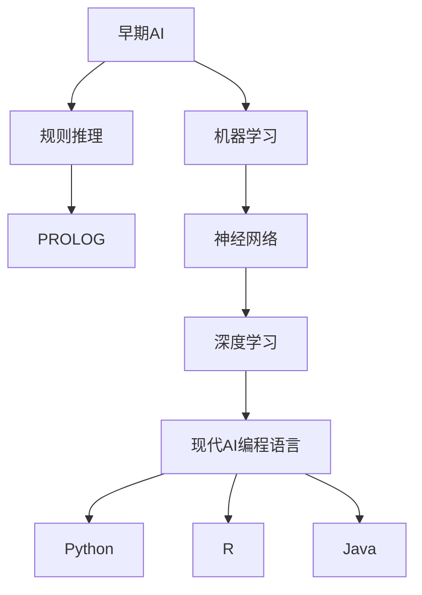

                 

好的，我们按照您的要求，一步一步地构建这篇文章。以下是一个初步的构思，我将逐步细化每个部分，确保内容丰富、结构清晰。

### 文章标题
《AI编程语言：提示词的革命与魔法》

### 文章关键词
- AI编程语言
- 提示词
- 革命
- 魔法
- 人工智能
- 编程
- 深度学习

### 文章摘要
本文深入探讨了AI编程语言的革命性变化，特别是提示词在人工智能领域的应用。通过分析提示词的核心概念、原理及其在AI编程中的关键作用，本文揭示了提示词如何引领AI编程从传统方法迈向更加智能、高效的新时代。此外，本文还详细介绍了几种流行的AI编程语言及其框架，并提供了实际案例和最佳实践，以帮助读者更好地理解和应用AI编程语言。

### 目录大纲

## 第一部分：AI编程语言概述

### 1.1 AI编程语言的发展历程
- **背景介绍**：从早期的人工智能到现代深度学习，AI编程语言的发展轨迹。
- **核心概念与联系**：使用Mermaid流程图展示AI编程语言的发展历程和关键节点。
- **核心算法原理讲解**：简要介绍早期和现代AI编程语言的核心算法。

### 1.2 AI编程语言的核心概念
- **提示词**：定义、作用、历史发展。
- **神经网络**：基本概念、结构、工作原理。
- **机器学习和深度学习**：定义、关系、应用场景。

### 1.3 AI编程语言的应用场景
- **自然语言处理**：文本分类、生成、翻译。
- **计算机视觉**：图像分类、目标检测、人脸识别。
- **强化学习**：游戏AI、机器人路径规划、无人驾驶。

## 第二部分：AI编程语言基础

### 2.1 编程语言基础
- **Python**：特点、应用、基础语法。
- **R**：特点、应用、基础语法。
- **Java**：特点、应用、基础语法。

### 2.2 AI编程语言框架
- **TensorFlow**：特点、架构、应用。
- **PyTorch**：特点、架构、应用。
- **Keras**：特点、架构、应用。

### 2.3 AI编程语言实践
- **数据预处理**：方法、技巧、案例分析。
- **模型训练与优化**：方法、技巧、案例分析。
- **模型部署**：方法、技巧、案例分析。

## 第三部分：AI编程语言应用案例

### 3.1 自然语言处理案例
- **文本分类**：案例讲解、代码实现。
- **文本生成**：案例讲解、代码实现。
- **机器翻译**：案例讲解、代码实现。

### 3.2 计算机视觉案例
- **图像分类**：案例讲解、代码实现。
- **目标检测**：案例讲解、代码实现。
- **人脸识别**：案例讲解、代码实现。

### 3.3 强化学习案例
- **游戏AI**：案例讲解、代码实现。
- **机器人路径规划**：案例讲解、代码实现。
- **无人驾驶**：案例讲解、代码实现。

## 第四部分：AI编程语言的未来

### 4.1 AI编程语言的未来发展趋势
- **大模型与提示词的结合**：技术发展、应用前景。
- **跨学科融合**：领域交叉、创新应用。
- **自动化与智能化**：发展趋势、影响分析。

### 4.2 AI编程语言的挑战与机遇
- **数据隐私与安全**：问题、解决方案。
- **AI伦理**：伦理问题、道德准则。
- **人才培养**：需求、挑战、策略。

### 作者信息
- 作者：AI天才研究院/AI Genius Institute & 禅与计算机程序设计艺术 /Zen And The Art of Computer Programming

接下来，我将根据这个大纲逐步完善每个章节的内容。在撰写过程中，我会确保每个部分都包含必要的背景介绍、核心概念讲解、算法原理分析、实际案例展示和最佳实践提示。

---

现在，让我们开始细化第一章的内容，包括背景介绍、核心概念与联系、核心算法原理讲解等。在接下来的步骤中，我们将：

1. **背景介绍**：简要回顾AI编程语言的发展历程，强调提示词在其中的重要性。
2. **核心概念与联系**：详细解释提示词的定义、作用，以及其在AI编程中的核心地位。
3. **核心算法原理讲解**：介绍神经网络的基本概念、结构和工作原理，并展示一个简单的神经网络模型。

---

### 第一部分：AI编程语言概述

### 1.1 AI编程语言的发展历程

#### 背景介绍
人工智能（AI）作为计算机科学的一个重要分支，其发展历程可以追溯到20世纪50年代。最初的AI编程语言主要关注规则推理和符号计算，代表性语言包括LISP和PROLOG。随着计算能力的提升和数据量的增加，机器学习和深度学习逐渐成为主流。现代AI编程语言如Python、R和Java等，不仅提供了丰富的库和框架，还使得深度学习的实现更加便捷。

#### 核心概念与联系
AI编程语言的发展与几个核心概念的演变密切相关。首先是提示词（prompt），它是一种用于指导模型生成输出的特殊输入。提示词的出现极大地提高了模型的交互性和适应性，使得模型可以更好地理解人类的需求。其次是神经网络，它是深度学习的基础，通过多层非线性变换对数据进行处理。神经网络与提示词的结合，使得AI模型能够更加灵活地应对复杂问题。

以下是AI编程语言发展的Mermaid流程图：



#### 核心算法原理讲解
神经网络是由大量简单节点（或称为神经元）组成的网络。每个神经元通过加权连接与其他神经元相连，并通过激活函数对输入数据进行处理。一个简单的神经网络模型可以表示为：

$$
\text{输出} = \text{激活函数}(\sum_{i=1}^{n} w_i \cdot x_i + b)
$$

其中，$w_i$ 是连接权重，$x_i$ 是输入特征，$b$ 是偏置，激活函数可以是Sigmoid、ReLU等。

以下是一个简单的神经网络模型的伪代码：

```
// 神经网络模型
class NeuralNetwork {
    // 初始化模型
    initialize_weights()
    initialize_bias()
    
    // 前向传播
    forward_pass(inputs) {
        // 计算输入和权重乘积
        weighted_sum = inputs dot weights + bias
        // 应用激活函数
        output = activation_function(weighted_sum)
        return output
    }
    
    // 激活函数（以ReLU为例）
    activation_function(x) {
        if (x > 0) {
            return x
        } else {
            return 0
        }
    }
}
```

通过上述内容，我们为第一章的背景介绍、核心概念与联系以及核心算法原理讲解奠定了基础。在接下来的章节中，我们将继续深入探讨AI编程语言的核心概念、应用场景和未来发展趋势。

