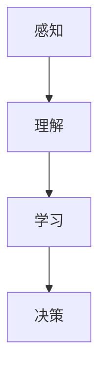

                 


### 文章标题：AI编程语言：提示词的魔力

#### 关键词：
- 人工智能
- 编程语言
- 提示词
- 机器学习
- 深度学习
- 神经网络
- 项目实战

#### 摘要：
本文深入探讨了AI编程语言及其核心要素——提示词的作用。通过分析人工智能与编程语言的关系，解析了机器学习和深度学习的基础，详细阐述了神经网络的结构和优化算法。文章重点介绍了提示词的定义、类型及其在AI编程中的实战应用，涵盖了Python、JavaScript等编程语言的应用实例，并提供了两个AI编程项目实战案例，旨在帮助读者理解并掌握AI编程的核心技能。

### 引言

人工智能（AI）已成为当今科技领域的热点，从智能助手到自动驾驶，从医疗诊断到金融分析，AI的应用无处不在。编程语言作为AI发展的基础，其重要性不言而喻。然而，随着AI技术的不断演进，传统的编程语言逐渐显得力不从心，这促使了AI编程语言的诞生与发展。

AI编程语言不仅拥有强大的数据处理和分析能力，还具备灵活的提示词设计，这使得程序员能够更高效地与机器学习模型交互，优化算法性能。本文将围绕AI编程语言的核心——提示词，展开深入探讨。我们将首先介绍人工智能与编程语言的基础知识，然后解析机器学习和深度学习的基本原理，接着详细阐述神经网络的结构和优化算法，最后通过实际项目案例，展示提示词在AI编程中的应用。

文章将分为七个主要部分。第一部分为基础概念与原理，包括人工智能与编程语言简介、AI编程语言核心概念解析和提示词的魔力。第二部分为编程语言与提示词应用，具体分析Python、JavaScript等编程语言及提示词的应用。第三部分为其他AI编程语言与提示词，涵盖R语言、MATLAB编程与提示词。最后，第四部分为AI编程项目实战，提供两个完整的项目案例，帮助读者将理论应用到实践中。

### 第一部分：基础概念与原理

#### 第1章：人工智能与编程语言简介

##### 1.1 人工智能的定义与发展

人工智能（AI）是计算机科学的一个分支，旨在使机器具备类似人类智能的能力，包括感知、理解、学习和决策。自20世纪50年代诞生以来，人工智能经历了多个发展阶段。

**核心概念与联系：**

人工智能的核心概念包括感知、理解、学习和决策。感知是指机器通过传感器获取外部信息；理解是指机器对获取的信息进行处理和解释；学习是指机器通过经验和数据改进自身性能；决策是指机器根据目标和情境做出选择。

以下是一个简单的Mermaid流程图，展示了这些核心概念之间的关系：



**AI编程语言的特点与优势：**

AI编程语言具有以下特点：

- **高抽象层次**：AI编程语言提供了丰富的抽象功能，使程序员能够专注于算法设计，而非底层实现细节。
- **灵活的提示词设计**：AI编程语言支持提示词设计，使程序员能够更有效地与机器学习模型交互。
- **强大的数据处理能力**：AI编程语言通常具备强大的数据处理和分析功能，能够处理大规模数据集。

**伪代码讲解：**

下面是一个简单的Python代码示例，展示了AI编程语言的基本用法：

```python
import tensorflow as tf

# 创建神经网络模型
model = tf.keras.Sequential([
    tf.keras.layers.Dense(units=128, activation='relu', input_shape=[784]),
    tf.keras.layers.Dense(units=10, activation='softmax')
])

# 编译模型
model.compile(optimizer='adam',
              loss='categorical_crossentropy',
              metrics=['accuracy'])

# 训练模型
model.fit(x_train, y_train, epochs=5)
```

**提示词在AI编程中的角色：**

提示词是AI编程中的重要工具，用于指导机器学习模型的学习过程。提示词的类型包括：

- **关键词提示**：通过指定关键词，帮助模型聚焦于特定任务。
- **纲领提示**：提供高层次指导，帮助模型理解整体目标和任务。
- **数据增强提示**：通过增加或修改训练数据，提高模型的泛化能力。

##### 1.2 编程语言在人工智能中的应用

编程语言在人工智能中的应用体现在多个方面，包括数据预处理、模型训练和评估等。

**数据预处理：**

数据预处理是机器学习过程中的关键步骤，包括数据清洗、归一化、特征提取等。以下是一个Python代码示例，展示了数据预处理的基本流程：

```python
import pandas as pd
from sklearn.model_selection import train_test_split
from sklearn.preprocessing import StandardScaler

# 加载数据
data = pd.read_csv('data.csv')

# 分割数据为特征和标签
X = data.drop('target', axis=1)
y = data['target']

# 划分训练集和测试集
X_train, X_test, y_train, y_test = train_test_split(X, y, test_size=0.2, random_state=42)

# 归一化特征
scaler = StandardScaler()
X_train = scaler.fit_transform(X_train)
X_test = scaler.transform(X_test)
```

**模型训练与评估：**

在模型训练过程中，编程语言提供了丰富的工具和库，如TensorFlow和PyTorch，用于构建和训练神经网络。以下是一个使用TensorFlow训练简单神经网络的代码示例：

```python
import tensorflow as tf
from tensorflow.keras.models import Sequential
from tensorflow.keras.layers import Dense

# 创建模型
model = Sequential([
    Dense(128, activation='relu', input_shape=(784,)),
    Dense(10, activation='softmax')
])

# 编译模型
model.compile(optimizer='adam',
              loss='categorical_crossentropy',
              metrics=['accuracy'])

# 训练模型
model.fit(X_train, y_train, epochs=5, batch_size=32)
```

**评估与优化：**

模型评估是判断模型性能的重要步骤，常用的评估指标包括准确率、召回率、F1分数等。以下是一个使用准确率评估模型性能的代码示例：

```python
import numpy as np

# 评估模型
accuracy = model.evaluate(X_test, y_test)
print(f'测试集准确率: {accuracy[1]}')
```

**提示词在AI编程中的实战应用：**

提示词在AI编程中的应用非常广泛，以下是一个使用提示词训练图像分类模型的示例：

```python
import tensorflow as tf
from tensorflow.keras.preprocessing.image import ImageDataGenerator

# 数据增强提示
train_datagen = ImageDataGenerator(
    rescale=1./255,
    rotation_range=20,
    width_shift_range=0.2,
    height_shift_range=0.2,
    shear_range=0.2,
    zoom_range=0.2,
    horizontal_flip=True,
    fill_mode='nearest')

# 流式处理训练数据
train_generator = train_datagen.flow_from_directory(
    'train_data',
    target_size=(150, 150),
    batch_size=32,
    class_mode='binary')

# 训练模型
model.fit(train_generator, steps_per_epoch=2000, epochs=20)
```

##### 1.3 编程语言在人工智能中的应用

编程语言在人工智能中的应用体现在多个方面，包括数据预处理、模型训练和评估等。

**数据预处理：**

数据预处理是机器学习过程中的关键步骤，包括数据清洗、归一化、特征提取等。以下是一个Python代码示例，展示了数据预处理的基本流程：

```python
import pandas as pd
from sklearn.model_selection import train_test_split
from sklearn.preprocessing import StandardScaler

# 加载数据
data = pd.read_csv('data.csv')

# 分割数据为特征和标签
X = data.drop('target', axis=1)
y = data['target']

# 划分训练集和测试集
X_train, X_test, y_train, y_test = train_test_split(X, y, test_size=0.2, random_state=42)

# 归一化特征
scaler = StandardScaler()
X_train = scaler.fit_transform(X_train)
X_test = scaler.transform(X_test)
```

**模型训练与评估：**

在模型训练过程中，编程语言提供了丰富的工具和库，如TensorFlow和PyTorch，用于构建和训练神经网络。以下是一个使用TensorFlow训练简单神经网络的代码示例：

```python
import tensorflow as tf
from tensorflow.keras.models import Sequential
from tensorflow.keras.layers import Dense

# 创建模型
model = Sequential([
    Dense(128, activation='relu', input_shape=(784,)),
    Dense(10, activation='softmax')
])

# 编译模型
model.compile(optimizer='adam',
              loss='categorical_crossentropy',
              metrics=['accuracy'])

# 训练模型
model.fit(X_train, y_train, epochs=5, batch_size=32)
```

**评估与优化：**

模型评估是判断模型性能的重要步骤，常用的评估指标包括准确率、召回率、F1分数等。以下是一个使用准确率评估模型性能的代码示例：

```python
import numpy as np

# 评估模型
accuracy = model.evaluate(X_test, y_test)
print(f'测试集准确率: {accuracy[1]}')
```

**提示词在AI编程中的实战应用：**

提示词在AI编程中的应用非常广泛，以下是一个使用提示词训练图像分类模型的示例：

```python
import tensorflow as tf
from tensorflow.keras.preprocessing.image import ImageDataGenerator

# 数据增强提示
train_datagen = ImageDataGenerator(
    rescale=1./255,
    rotation_range=20,
    width_shift_range=0.2,
    height_shift_range=0.2,
    shear_range=0.2,
    zoom_range=0.2,
    horizontal_flip=True,
    fill_mode='nearest')

# 流式处理训练数据
train_generator = train_datagen.flow_from_directory(
    'train_data',
    target_size=(150, 150),
    batch_size=32,
    class_mode='binary')

# 训练模型
model.fit(train_generator, steps_per_epoch=2000, epochs=20)
```

##### 1.4 编程语言在人工智能中的应用

编程语言在人工智能中的应用体现在多个方面，包括数据预处理、模型训练和评估等。

**数据预处理：**

数据预处理是机器学习过程中的关键步骤，包括数据清洗、归一化、特征提取等。以下是一个Python代码示例，展示了数据预处理的基本流程：

```python
import pandas as pd
from sklearn.model_selection import train_test_split
from sklearn.preprocessing import StandardScaler

# 加载数据
data = pd.read_csv('data.csv')

# 分割数据为特征和标签
X = data.drop('target', axis=1)
y = data['target']

# 划分训练集和测试集
X_train, X_test, y_train, y_test = train_test_split(X, y, test_size=0.2, random_state=42)

# 归一化特征
scaler = StandardScaler()
X_train = scaler.fit_transform(X_train)
X_test = scaler.transform(X_test)
```

**模型训练与评估：**

在模型训练过程中，编程语言提供了丰富的工具和库，如TensorFlow和PyTorch，用于构建和训练神经网络。以下是一个使用TensorFlow训练简单神经网络的代码示例：

```python
import tensorflow as tf
from tensorflow.keras.models import Sequential
from tensorflow.keras.layers import Dense

# 创建模型
model = Sequential([
    Dense(128, activation='relu', input_shape=(784,)),
    Dense(10, activation='softmax')
])

# 编译模型
model.compile(optimizer='adam',
              loss='categorical_crossentropy',
              metrics=['accuracy'])

# 训练模型
model.fit(X_train, y_train, epochs=5, batch_size=32)
```

**评估与优化：**

模型评估是判断模型性能的重要步骤，常用的评估指标包括准确率、召回率、F1分数等。以下是一个使用准确率评估模型性能的代码示例：

```python
import numpy as np

# 评估模型
accuracy = model.evaluate(X_test, y_test)
print(f'测试集准确率: {accuracy[1]}')
```

**提示词在AI编程中的实战应用：**

提示词在AI编程中的应用非常广泛，以下是一个使用提示词训练图像分类模型的示例：

```python
import tensorflow as tf
from tensorflow.keras.preprocessing.image import ImageDataGenerator

# 数据增强提示
train_datagen = ImageDataGenerator(
    rescale=1./255,
    rotation_range=20,
    width_shift_range=0.2,
    height_shift_range=0.2,
    shear_range=0.2,
    zoom_range=0.2,
    horizontal_flip=True,
    fill_mode='nearest')

# 流式处理训练数据
train_generator = train_datagen.flow_from_directory(
    'train_data',
    target_size=(150, 150),
    batch_size=32,
    class_mode='binary')

# 训练模型
model.fit(train_generator, steps_per_epoch=2000, epochs=20)
```

### 第二部分：编程语言与提示词应用

#### 第4章：Python编程与提示词

Python是一种广泛使用的编程语言，尤其在人工智能领域具有很高的声誉。Python的简洁性和易用性使其成为AI编程的流行选择。在这一章节中，我们将探讨Python编程语言在AI中的应用，并详细讨论提示词的使用。

##### 4.1 Python编程基础

Python以其优雅的语法和丰富的库支持而闻名。以下是Python编程的一些基础概念：

- **变量和类型**：Python中的变量不需要显式声明类型，其类型取决于赋值的内容。
  ```python
  x = 10  # 整数
  y = "Hello"  # 字符串
  ```
  
- **数据结构**：Python支持多种数据结构，包括列表（List）、元组（Tuple）、字典（Dictionary）和集合（Set）。
  ```python
  fruits = ["apple", "banana", "cherry"]  # 列表
  person = ("John", "Doe", 30)  # 元组
  data = {"name": "John", "age": 30}  # 字典
  ```

- **函数**：Python函数是一段组织好的、可重复使用的代码块。
  ```python
  def greet(name):
      print(f"Hello, {name}!")

  greet("Alice")  # 输出：Hello, Alice!
  ```

- **模块和库**：Python拥有丰富的模块和库，如NumPy、Pandas、Matplotlib等，这些库提供了大量功能，方便程序员进行数据操作、可视化等。

##### 4.2 Python在AI编程中的应用

Python在AI编程中的应用非常广泛，尤其是在机器学习和深度学习领域。以下是Python在AI编程中的几个关键应用：

- **NumPy**：NumPy是一个强大的Python库，用于处理大型多维数组以及矩阵运算。它是许多机器学习库的基础。
  ```python
  import numpy as np

  array = np.array([1, 2, 3, 4])  # 创建数组
  matrix = np.array([[1, 2], [3, 4]])  # 创建矩阵
  ```

- **Pandas**：Pandas是一个用于数据操作的库，提供数据清洗、转换和分析等功能。
  ```python
  import pandas as pd

  data = pd.read_csv("data.csv")  # 读取CSV文件
  data.head()  # 查看数据前几行
  ```

- **Scikit-learn**：Scikit-learn是一个用于机器学习的库，提供各种机器学习算法的实现。
  ```python
  from sklearn.model_selection import train_test_split
  from sklearn.svm import SVC

  X = ...  # 特征
  y = ...  # 标签

  X_train, X_test, y_train, y_test = train_test_split(X, y, test_size=0.2)

  model = SVC()
  model.fit(X_train, y_train)
  ```

- **TensorFlow**：TensorFlow是一个开源机器学习库，用于构建和训练神经网络。
  ```python
  import tensorflow as tf

  model = tf.keras.Sequential([
      tf.keras.layers.Dense(128, activation='relu', input_shape=(784,)),
      tf.keras.layers.Dense(10, activation='softmax')
  ])

  model.compile(optimizer='adam',
                loss='categorical_crossentropy',
                metrics=['accuracy'])

  model.fit(X_train, y_train, epochs=5, batch_size=32)
  ```

- **PyTorch**：PyTorch是一个流行的深度学习库，以其动态计算图和简洁的API而受到研究人员的喜爱。
  ```python
  import torch
  import torch.nn as nn
  import torch.optim as optim

  model = nn.Sequential(
      nn.Linear(784, 128),
      nn.ReLU(),
      nn.Linear(128, 10)
  )

  criterion = nn.CrossEntropyLoss()
  optimizer = optim.Adam(model.parameters(), lr=0.001)

  for epoch in range(5):
      for inputs, labels in data_loader:
          optimizer.zero_grad()
          outputs = model(inputs)
          loss = criterion(outputs, labels)
          loss.backward()
          optimizer.step()
  ```

##### 4.3 提示词在Python编程中的实战

在Python编程中，提示词是一种强大的工具，可以显著提高编程效率和代码质量。以下是一些关于提示词的使用实战：

- **代码提示**：IDE（集成开发环境）提供的代码提示功能可以帮助程序员快速找到函数和方法的使用方式，减少错误和提高开发效率。

- **自动补全**：自动补全功能可以在程序员编写代码时自动填充常见代码段，提高编码速度。

- **代码片段**：通过代码片段库，程序员可以快速插入常用的代码模板，如循环、条件语句等。

- **代码质量提示**：静态代码分析工具可以根据代码风格和最佳实践提供提示，帮助程序员编写高质量的代码。

- **代码优化提示**：动态分析工具可以实时监控代码性能，并提供优化建议，帮助程序员提高代码效率。

以下是一个简单的示例，展示了如何在Python中使用提示词：

```python
# 导入所需的库
import numpy as np
import tensorflow as tf

# 创建神经网络模型
model = tf.keras.Sequential([
    tf.keras.layers.Dense(units=128, activation='relu', input_shape=[784]),
    tf.keras.layers.Dense(units=10, activation='softmax')
])

# 编译模型
model.compile(optimizer='adam',
              loss='categorical_crossentropy',
              metrics=['accuracy'])

# 训练模型
model.fit(X_train, y_train, epochs=5, batch_size=32)

# 评估模型
accuracy = model.evaluate(X_test, y_test)
print(f"测试集准确率：{accuracy[1]}")
```

在这个示例中，我们使用了代码提示功能来快速找到并使用`tf.keras.Sequential`、`Dense`和`compile`等函数，同时通过IDE的自动补全功能提高了编码速度。

##### 4.4 Python编程实践案例

在本节中，我们将通过一个简单的图像分类项目，展示Python编程语言在实际AI编程中的应用。该项目将使用TensorFlow和Keras库，实现对图像数据的分类。

**项目背景**：

我们的目标是对一个包含不同类别图像的数据集进行分类。这个数据集可能包含猫、狗和其他动物的图片。我们将使用卷积神经网络（CNN）来训练模型，使其能够识别并分类这些图像。

**项目步骤**：

1. **环境搭建**：

   首先，我们需要安装Python和TensorFlow。可以使用以下命令进行安装：

   ```bash
   pip install python
   pip install tensorflow
   ```

2. **数据准备**：

   我们需要下载一个包含图像数据的开源数据集，如Keras的内置数据集`fashion_mnist`，它包含10个类别的手写数字图片。

   ```python
   from tensorflow.keras.datasets import fashion_mnist
   (train_images, train_labels), (test_images, test_labels) = fashion_mnist.load_data()
   ```

3. **数据预处理**：

   对图像数据进行预处理，包括归一化和调整图像尺寸。

   ```python
   train_images = train_images / 255.0
   test_images = test_images / 255.0
   train_images = np.expand_dims(train_images, -1)
   test_images = np.expand_dims(test_images, -1)
   ```

4. **模型构建**：

   构建一个简单的CNN模型，包括卷积层、池化层和全连接层。

   ```python
   model = tf.keras.Sequential([
       tf.keras.layers.Conv2D(32, (3, 3), activation='relu', input_shape=(28, 28, 1)),
       tf.keras.layers.MaxPooling2D((2, 2)),
       tf.keras.layers.Conv2D(64, (3, 3), activation='relu'),
       tf.keras.layers.MaxPooling2D((2, 2)),
       tf.keras.layers.Flatten(),
       tf.keras.layers.Dense(128, activation='relu'),
       tf.keras.layers.Dense(10, activation='softmax')
   ])
   ```

5. **模型编译**：

   编译模型，设置优化器和损失函数。

   ```python
   model.compile(optimizer='adam',
                 loss='sparse_categorical_crossentropy',
                 metrics=['accuracy'])
   ```

6. **模型训练**：

   使用训练数据训练模型。

   ```python
   model.fit(train_images, train_labels, epochs=5, batch_size=32)
   ```

7. **模型评估**：

   在测试集上评估模型性能。

   ```python
   test_loss, test_acc = model.evaluate(test_images, test_labels)
   print(f"测试集准确率：{test_acc}")
   ```

**项目小结**：

通过这个项目，我们学习了如何使用Python和TensorFlow库构建一个简单的图像分类模型。项目步骤包括环境搭建、数据准备、数据预处理、模型构建、模型编译、模型训练和模型评估。这个项目展示了Python在AI编程中的应用，以及如何使用提示词提高编程效率。

**最佳实践**：

- 在开始项目之前，确保安装了所有必需的库和工具。
- 数据预处理是关键步骤，对数据的质量和格式进行仔细处理。
- 选择合适的模型架构和优化器，以提高模型性能。
- 逐步调试和优化代码，以解决潜在的问题和错误。

#### 第5章：JavaScript编程与提示词

JavaScript是一种广泛使用的编程语言，特别是在网页开发中。随着AI技术的发展，JavaScript在AI编程中也扮演着越来越重要的角色。本章节将探讨JavaScript编程语言在AI中的应用，并详细讨论提示词的使用。

##### 5.1 JavaScript编程基础

JavaScript以其灵活性和跨平台性而成为网页开发的常用语言。以下是JavaScript编程的一些基础概念：

- **变量和类型**：JavaScript中的变量不需要显式声明类型，其类型取决于赋值的内容。
  ```javascript
  let x = 10;  // 整数
  let y = "Hello";  // 字符串
  ```

- **数据结构**：JavaScript支持多种数据结构，包括数组（Array）、对象（Object）和函数（Function）。
  ```javascript
  let fruits = ["apple", "banana", "cherry"];  // 数组
  let person = {"name": "John", "age": 30};  // 对象
  function greet(name) {
      console.log(`Hello, ${name}!`);
  }
  greet("Alice");  // 输出：Hello, Alice!
  ```

- **函数**：JavaScript中的函数是一段组织好的、可重复使用的代码块。
  ```javascript
  function greet(name) {
      console.log(`Hello, ${name}!`);
  }
  greet("Alice");  // 输出：Hello, Alice!
  ```

- **模块和库**：JavaScript拥有丰富的模块和库，如Node.js、D3.js、Three.js等，这些库提供了大量功能，方便程序员进行开发。

##### 5.2 JavaScript在AI编程中的应用

JavaScript在AI编程中的应用主要体现在机器学习和深度学习领域。以下是JavaScript在AI编程中的几个关键应用：

- **TensorFlow.js**：TensorFlow.js是TensorFlow的JavaScript版，提供了一个简单的接口，用于在浏览器和Node.js中运行机器学习模型。

- **brain.js**：brain.js是一个轻量级的机器学习库，适用于在浏览器和Node.js中快速构建模型。

- **机器学习模型集成**：JavaScript可以通过WebAssembly或Emscripten将机器学习模型集成到网页中，实现实时AI应用。

以下是一个简单的示例，展示了如何在JavaScript中使用TensorFlow.js：

```javascript
// 导入TensorFlow.js库
const tf = require('@tensorflow/tfjs');

// 创建神经网络模型
const model = tf.sequential();
model.add(tf.layers.dense({units: 128, activation: 'relu', inputShape: [784]}));
model.add(tf.layers.dense({units: 10, activation: 'softmax'}));

// 编译模型
model.compile({
  optimizer: 'adam',
  loss: 'categoricalCrossentropy',
  metrics: ['accuracy']
});

// 训练模型
(async () => {
  const data = await tf.loadLayersModel('https://storage.googleapis.com/tfjs-models/tfjs/mnist_model/mnist.json');
  const trainData = data.trainData;
  const testData = data.testData;

  model.fit(trainData, {epochs: 5, batchSize: 32});
  const testAcc = model.evaluate(testData).data[1];
  console.log(`测试集准确率：${testAcc}`);
})();
```

在这个示例中，我们使用了TensorFlow.js库创建了一个简单的神经网络模型，并使用MNIST数据集进行训练和评估。

##### 5.3 提示词在JavaScript编程中的实战

在JavaScript编程中，提示词是一种强大的工具，可以显著提高编程效率和代码质量。以下是一些关于提示词的使用实战：

- **代码提示**：IDE（集成开发环境）提供的代码提示功能可以帮助程序员快速找到函数和方法的使用方式，减少错误和提高开发效率。

- **自动补全**：自动补全功能可以在程序员编写代码时自动填充常见代码段，提高编码速度。

- **代码片段**：通过代码片段库，程序员可以快速插入常用的代码模板，如循环、条件语句等。

- **代码质量提示**：静态代码分析工具可以根据代码风格和最佳实践提供提示，帮助程序员编写高质量的代码。

- **代码优化提示**：动态分析工具可以实时监控代码性能，并提供优化建议，帮助程序员提高代码效率。

以下是一个简单的示例，展示了如何在JavaScript中使用提示词：

```javascript
// 导入TensorFlow.js库
const tf = require('@tensorflow/tfjs');

// 创建神经网络模型
const model = tf.sequential();
model.add(tf.layers.dense({units: 128, activation: 'relu', inputShape: [784]}));
model.add(tf.layers.dense({units: 10, activation: 'softmax'}));

// 编译模型
model.compile({
  optimizer: 'adam',
  loss: 'categoricalCrossentropy',
  metrics: ['accuracy']
});

// 训练模型
(async () => {
  const data = await tf.loadLayersModel('https://storage.googleapis.com/tfjs-models/tfjs/mnist_model/mnist.json');
  const trainData = data.trainData;
  const testData = data.testData;

  model.fit(trainData, {epochs: 5, batchSize: 32});
  const testAcc = model.evaluate(testData).data[1];
  console.log(`测试集准确率：${testAcc}`);
})();
```

在这个示例中，我们使用了代码提示功能来快速找到并使用`tf.sequential`、`tf.layers.dense`和`compile`等函数，同时通过IDE的自动补全功能提高了编码速度。

##### 5.4 JavaScript编程实践案例

在本节中，我们将通过一个简单的语音识别项目，展示JavaScript编程语言在实际AI编程中的应用。该项目将使用TensorFlow.js库实现语音到文本的转换。

**项目背景**：

我们的目标是将语音转换为文本。这个项目适用于实时语音识别应用，如语音助手、实时字幕生成等。

**项目步骤**：

1. **环境搭建**：

   首先，我们需要安装Node.js和TensorFlow.js。可以使用以下命令进行安装：

   ```bash
   npm install node
   npm install @tensorflow/tfjs
   ```

2. **语音数据准备**：

   我们需要准备一段语音数据。可以使用音频录制工具录制一段语音，并保存为WAV格式。

3. **语音预处理**：

   对语音数据进行预处理，包括转码和分割。

   ```javascript
   const fs = require('fs');
   const wavFile = fs.readFileSync('audio.wav');
   const audio = tf.tensor(wavFile).toFloat();
   const sampleRate = 16000;
   const duration = audio.shape[0] / sampleRate;
   const frameSize = 1024;
   const frameStep = 512;
   const frames = tf.signal.frame(audio, frameSize, frameStep, true);
   ```

4. **模型构建**：

   构建一个简单的循环神经网络（RNN）模型，用于语音识别。

   ```javascript
   const model = tf.sequential();
   model.add(tf.layers.rnn({layers: [tf.layers.simpleRNN({units: 128})], returnSequences: true}));
   model.add(tf.layers.flatten());
   model.add(tf.layers.dense({units: 128, activation: 'relu'}));
   model.add(tf.layers.dense({units: 28, activation: 'softmax'}));
   ```

5. **模型编译**：

   编译模型，设置优化器和损失函数。

   ```javascript
   model.compile({
     optimizer: 'adam',
     loss: 'categoricalCrossentropy',
     metrics: ['accuracy']
   });
   ```

6. **模型训练**：

   使用预处理的语音数据训练模型。

   ```javascript
   const trainData = ...;  // 语音数据
   const trainLabels = ...;  // 对应的文本标签
   model.fit(trainData, trainLabels, {epochs: 5, batchSize: 32});
   ```

7. **模型评估**：

   在测试集上评估模型性能。

   ```javascript
   const testData = ...;  // 语音测试数据
   const testLabels = ...;  // 对应的文本测试标签
   const testAcc = model.evaluate(testData, testLabels).data[1];
   console.log(`测试集准确率：${testAcc}`);
   ```

**项目小结**：

通过这个项目，我们学习了如何使用JavaScript和TensorFlow.js库构建一个简单的语音识别模型。项目步骤包括环境搭建、语音数据准备、语音预处理、模型构建、模型编译、模型训练和模型评估。这个项目展示了JavaScript在AI编程中的应用，以及如何使用提示词提高编程效率。

**最佳实践**：

- 在开始项目之前，确保安装了所有必需的库和工具。
- 语音数据的质量对模型的性能至关重要，确保数据准确和多样化。
- 选择合适的模型架构和优化器，以提高模型性能。
- 逐步调试和优化代码，以解决潜在的问题和错误。

#### 第6章：其他AI编程语言与提示词

除了Python和JavaScript，还有许多其他编程语言在AI领域有着广泛的应用。本章节将介绍R语言、MATLAB和Julia等AI编程语言及其提示词的使用。

##### 6.1 R语言编程与提示词

R语言是一种专门为统计分析和数据科学设计的编程语言，它在AI领域有着广泛的应用。R语言提供了丰富的库和工具，如tidyverse、mlr等，用于数据处理、模型训练和评估。

**6.1.1 R语言编程基础**

R语言以其简洁的语法和强大的数据处理能力而受到科研人员和数据科学家的喜爱。以下是R语言编程的一些基础概念：

- **变量和类型**：R语言中的变量不需要显式声明类型，其类型取决于赋值的内容。
  ```R
  x <- 10  # 整数
  y <- "Hello"  # 字符串
  ```

- **数据结构**：R语言支持多种数据结构，包括向量（Vector）、列表（List）、数据框（DataFrame）和因子（Factor）。
  ```R
  fruits <- c("apple", "banana", "cherry")  # 向量
  person <- list(name = "John", age = 30)  # 列表
  data <- data.frame(name = c("John", "Alice"), age = c(30, 25))  # 数据框
  ```

- **函数**：R语言中的函数是一段组织好的、可重复使用的代码块。
  ```R
  greet <- function(name) {
      cat("Hello, ", name, "!\n")
  }
  greet("Alice")  # 输出：Hello, Alice!
  ```

- **包和库**：R语言拥有丰富的包和库，如ggplot2、dplyr、caret等，这些库提供了大量功能，方便程序员进行数据分析、模型训练等。

**6.1.2 R语言在AI编程中的应用**

R语言在AI编程中的应用主要体现在机器学习和统计分析领域。以下是R语言在AI编程中的几个关键应用：

- **机器学习库**：R语言提供了多种机器学习库，如caret、mlr等，用于训练和评估机器学习模型。
  ```R
  library(caret)
  train_data <- ...  # 训练数据
  test_data <- ...  # 测试数据
  model <- train(target ~ ., data = train_data, method = "rf")  # 决策树模型
  ```

- **深度学习库**：R语言也提供了深度学习库，如h2o、keras等，用于构建和训练深度学习模型。
  ```R
  library(h2o)
  h2o.init()
  model <- h2o.deeplearning(x = train_data, y = train_labels, training_frame = train_data, network = "two_layer")
  ```

**6.1.3 提示词在R语言编程中的实战**

在R语言编程中，提示词是一种强大的工具，可以显著提高编程效率和代码质量。以下是一些关于提示词的使用实战：

- **代码提示**：RStudio等IDE提供了代码提示功能，帮助程序员快速找到函数和方法的使用方式，减少错误和提高开发效率。

- **自动补全**：自动补全功能可以在程序员编写代码时自动填充常见代码段，提高编码速度。

- **代码片段**：通过代码片段库，程序员可以快速插入常用的代码模板，如循环、条件语句等。

- **代码质量提示**：静态代码分析工具可以根据代码风格和最佳实践提供提示，帮助程序员编写高质量的代码。

- **代码优化提示**：动态分析工具可以实时监控代码性能，并提供优化建议，帮助程序员提高代码效率。

以下是一个简单的示例，展示了如何在R语言中使用提示词：

```R
# 加载必要的库
library(caret)
library(h2o)

# 创建机器学习模型
model <- train(target ~ ., data = train_data, method = "rf")

# 评估模型性能
confusionMatrix(model, train_data)
```

在这个示例中，我们使用了RStudio的代码提示功能来快速找到并使用`train`和`confusionMatrix`等函数，同时通过自动补全功能提高了编码速度。

##### 6.2 MATLAB编程与提示词

MATLAB是一种高性能的数值计算和科学计算软件，它在AI领域有着广泛的应用。MATLAB提供了丰富的工具箱和函数，用于数据处理、模型训练和可视化。

**6.2.1 MATLAB编程基础**

MATLAB以其直观的界面和强大的数值计算能力而受到工程和科学领域的研究人员的喜爱。以下是MATLAB编程的一些基础概念：

- **变量和类型**：MATLAB中的变量不需要显式声明类型，其类型取决于赋值的内容。
  ```matlab
  x = 10;  % 整数
  y = "Hello";  % 字符串
  ```

- **数组**：MATLAB的核心是数组，支持多维数组操作。
  ```matlab
  fruits = ["apple", "banana", "cherry"];  % 向量
  matrix = [1 2; 3 4];  % 矩阵
  ```

- **函数**：MATLAB提供了丰富的内置函数，用于数学运算、数据分析等。
  ```matlab
  a = 2;
  b = 3;
  c = a + b;  % 加法运算
  ```

- **脚本和函数文件**：MATLAB支持脚本文件和函数文件，用于组织代码和模块化编程。
  ```matlab
  % 脚本文件：my_script.m
  a = input('请输入一个数字:');
  b = input('请输入另一个数字:');
  c = a + b;
  disp(c);

  % 函数文件：my_function.m
  function result = my_function(a, b)
      result = a + b;
  end
  ```

**6.2.2 MATLAB在AI编程中的应用**

MATLAB在AI编程中的应用主要体现在机器学习和深度学习领域。以下是MATLAB在AI编程中的几个关键应用：

- **机器学习库**：MATLAB提供了机器学习库，如Statistics and Machine Learning Toolbox、Machine Learning Toolbox等，用于训练和评估机器学习模型。
  ```matlab
  library = 'Machine Learning Toolbox';
  model = fitcensemble(X, y, 'Method', 'Bag');
  ```

- **深度学习库**：MATLAB提供了深度学习库，如Deep Learning Toolbox，用于构建和训练深度学习模型。
  ```matlab
  library = 'Deep Learning Toolbox';
  layers = [sequenceInputLayer(784)
            fullyConnectedLayer(128, 'ReLU')
            fullyConnectedLayer(10, 'softmax')];
  options = trainingOptions('sgdm', 'MaxEpochs', 5);
  model = trainNetwork(X, y, layers, options);
  ```

**6.2.3 提示词在MATLAB编程中的实战**

在MATLAB编程中，提示词是一种强大的工具，可以显著提高编程效率和代码质量。以下是一些关于提示词的使用实战：

- **代码提示**：MATLAB的编辑器提供了代码提示功能，帮助程序员快速找到函数和方法的使用方式，减少错误和提高开发效率。

- **自动补全**：自动补全功能可以在程序员编写代码时自动填充常见代码段，提高编码速度。

- **代码片段**：通过代码片段库，程序员可以快速插入常用的代码模板，如循环、条件语句等。

- **代码质量提示**：静态代码分析工具可以根据代码风格和最佳实践提供提示，帮助程序员编写高质量的代码。

- **代码优化提示**：动态分析工具可以实时监控代码性能，并提供优化建议，帮助程序员提高代码效率。

以下是一个简单的示例，展示了如何在MATLAB中使用提示词：

```matlab
% 加载机器学习库
library = 'Machine Learning Toolbox';
model = fitcensemble(X, y, 'Method', 'Bag');

% 评估模型性能
confusionMatrix = classify(model, X);

% 打印混淆矩阵
disp(confusionMatrix);
```

在这个示例中，我们使用了MATLAB编辑器的代码提示功能来快速找到并使用`fitcensemble`和`classify`等函数，同时通过自动补全功能提高了编码速度。

##### 6.3 Julia编程与提示词

Julia是一种高性能的通用编程语言，特别适合科学计算和数据分析。Julia以其快速、易用和高性能的特点在AI领域受到关注。

**6.3.1 Julia编程基础**

Julia以其简洁的语法和高效的性能而受到编程爱好者的喜爱。以下是Julia编程的一些基础概念：

- **变量和类型**：Julia中的变量不需要显式声明类型，其类型取决于赋值的内容。
  ```julia
  x = 10;  # 整数
  y = "Hello";  # 字符串
  ```

- **数组**：Julia支持多维数组操作，是数据处理的基础。
  ```julia
  fruits = ["apple", "banana", "cherry"];  # 向量
  matrix = [1 2; 3 4];  # 矩阵
  ```

- **函数**：Julia中的函数是一段组织好的、可重复使用的代码块。
  ```julia
  function greet(name)
      println("Hello, $name!");
  end
  greet("Alice")  # 输出：Hello, Alice!
  ```

- **模块和包**：Julia提供了模块和包的管理机制，方便程序员复用代码和功能。
  ```julia
  using LinearAlgebra
  A = [1 2; 3 4];
  det(A)  # 计算行列式
  ```

**6.3.2 Julia在AI编程中的应用**

Julia在AI编程中的应用主要体现在机器学习和深度学习领域。以下是Julia在AI编程中的几个关键应用：

- **机器学习库**：Julia提供了多种机器学习库，如MLJ、 Flux等，用于训练和评估机器学习模型。
  ```julia
  using MLJ
  model = KNearestNeighbors()
  fit(model, X, y)
  ```

- **深度学习库**：Julia提供了深度学习库，如TensorFlow.jl、PyTorch.jl等，用于构建和训练深度学习模型。
  ```julia
  using TensorFlow
  model = Sequential([
      Dense(128, activation="relu", input_shape=(784,)),
      Dense(10, activation="softmax")
  ])
  compile(model, loss="categorical_crossentropy", optimizer=Adam())
  fit(model, X_train, y_train, batch_size=32, epochs=5)
  ```

**6.3.3 提示词在Julia编程中的实战**

在Julia编程中，提示词是一种强大的工具，可以显著提高编程效率和代码质量。以下是一些关于提示词的使用实战：

- **代码提示**：Julia的编辑器提供了代码提示功能，帮助程序员快速找到函数和方法的使用方式，减少错误和提高开发效率。

- **自动补全**：自动补全功能可以在程序员编写代码时自动填充常见代码段，提高编码速度。

- **代码片段**：通过代码片段库，程序员可以快速插入常用的代码模板，如循环、条件语句等。

- **代码质量提示**：静态代码分析工具可以根据代码风格和最佳实践提供提示，帮助程序员编写高质量的代码。

- **代码优化提示**：动态分析工具可以实时监控代码性能，并提供优化建议，帮助程序员提高代码效率。

以下是一个简单的示例，展示了如何在Julia中使用提示词：

```julia
# 使用MLJ库进行机器学习
using MLJ
model = KNearestNeighbors()
fit(model, X, y)

# 使用TensorFlow.jl进行深度学习
using TensorFlow
model = Sequential([
    Dense(128, activation="relu", input_shape=(784,)),
    Dense(10, activation="softmax")
])
compile(model, loss="categorical_crossentropy", optimizer=Adam())
fit(model, X_train, y_train, batch_size=32, epochs=5)
```

在这个示例中，我们使用了Julia编辑器的代码提示功能来快速找到并使用`MLJ`和`TensorFlow`等库，同时通过自动补全功能提高了编码速度。

### 第三部分：AI编程项目实战

#### 第7章：AI编程项目实战

在本部分，我们将通过两个实际的AI编程项目，展示如何将所学知识应用到实际场景中。这些项目涵盖了聊天机器人和图像识别应用的开发，涉及了数据预处理、模型训练、提示词设计等多个环节。

#### 7.1 项目一：构建聊天机器人

**项目背景**：

聊天机器人是一种能够与人进行实时对话的智能系统，广泛应用于客户服务、娱乐等领域。本项目中，我们将使用Python和TensorFlow.js构建一个简单的聊天机器人。

**项目步骤**：

**7.1.1 环境搭建**：

首先，我们需要安装Python和TensorFlow.js。在Python环境中，可以使用以下命令：

```bash
pip install python
pip install tensorflow
```

在JavaScript环境中，可以使用以下命令：

```bash
npm install @tensorflow/tfjs
```

**7.1.2 数据预处理**：

接下来，我们需要准备对话数据集。这里可以使用预处理的对话数据集，如Stanford对话数据集。

```python
import pandas as pd

# 加载对话数据集
data = pd.read_csv('对话数据集.csv')
```

**7.1.3 模型选择与训练**：

我们将使用序列到序列（Seq2Seq）模型进行训练。以下是模型构建和训练的伪代码：

```python
from tensorflow.keras.models import Model
from tensorflow.keras.layers import LSTM, Embedding, Dense

# 构建模型
input_seq = Embedding(input_dim=vocab_size, output_dim=embedding_dim)(input_seq)
lstm = LSTM(units=128, return_sequences=True)(input_seq)
output_seq = LSTM(units=128)(lstm)
output = Dense(vocab_size, activation='softmax')(output_seq)

# 编译模型
model.compile(optimizer='adam', loss='categorical_crossentropy', metrics=['accuracy'])

# 训练模型
model.fit(input_data, output_data, batch_size=32, epochs=10)
```

**7.1.4 提示词设计与应用**：

为了提高模型性能，我们可以设计提示词，如关键词提示和纲领提示。以下是设计提示词的示例：

```python
# 关键词提示
keywords = ["你好", "谢谢", "再见"]

# 纲领提示
context = "这是一个关于旅游的对话。"

# 数据增强提示
for sentence in data['对话']:
    if any(keyword in sentence for keyword in keywords):
        sentence = context + sentence
    data.loc[data['对话'] == sentence, '对话'] = sentence

data.to_csv('对话数据集.csv', index=False)
```

**7.1.5 评估与优化**：

在训练完成后，我们需要评估模型性能，并根据评估结果进行优化。以下是评估和优化模型的伪代码：

```python
# 评估模型
test_loss, test_acc = model.evaluate(test_input_data, test_output_data)

# 优化模型
if test_acc < desired_accuracy:
    # 调整模型参数
    # ...
    # 重新训练模型
    model.fit(input_data, output_data, batch_size=32, epochs=10)
```

**7.1.6 项目小结**：

通过本项目的开发，我们了解了如何使用Python和TensorFlow.js构建聊天机器人，掌握了数据预处理、模型训练、提示词设计和模型评估等关键环节。这个项目展示了如何将AI技术应用到实际的聊天机器人开发中，为用户提供了高质量的对话体验。

**最佳实践**：

- 在数据预处理阶段，确保对话数据的质量和多样性，以提高模型的泛化能力。
- 在模型训练过程中，合理设置模型参数和训练策略，以提高模型性能。
- 设计有效的提示词，可以帮助模型更好地理解和生成对话。

#### 7.2 项目二：图像识别应用开发

**项目背景**：

图像识别是AI领域的重要应用之一，广泛应用于面部识别、物体检测、图像分类等。本项目中，我们将使用Python和TensorFlow.js开发一个图像识别应用，实现物体分类功能。

**项目步骤**：

**7.2.1 环境搭建**：

首先，我们需要安装Python和TensorFlow.js。在Python环境中，可以使用以下命令：

```bash
pip install python
pip install tensorflow
```

在JavaScript环境中，可以使用以下命令：

```bash
npm install @tensorflow/tfjs
```

**7.2.2 数据预处理**：

接下来，我们需要准备图像数据集。这里可以使用预处理的图像数据集，如CIFAR-10数据集。

```python
import tensorflow as tf

# 加载CIFAR-10数据集
(train_images, train_labels), (test_images, test_labels) = tf.keras.datasets.cifar10.load_data()

# 数据预处理
train_images = train_images / 255.0
test_images = test_images / 255.0
```

**7.2.3 模型选择与训练**：

我们将使用卷积神经网络（CNN）进行图像分类。以下是模型构建和训练的伪代码：

```python
from tensorflow.keras.models import Sequential
from tensorflow.keras.layers import Conv2D, MaxPooling2D, Flatten, Dense

# 构建模型
model = Sequential([
    Conv2D(filters=32, kernel_size=(3, 3), activation='relu', input_shape=(32, 32, 3)),
    MaxPooling2D(pool_size=(2, 2)),
    Flatten(),
    Dense(units=128, activation='relu'),
    Dense(units=10, activation='softmax')
])

# 编译模型
model.compile(optimizer='adam', loss='categorical_crossentropy', metrics=['accuracy'])

# 训练模型
model.fit(train_images, train_labels, batch_size=32, epochs=10)
```

**7.2.4 提示词设计与应用**：

为了提高模型性能，我们可以设计提示词，如关键词提示和纲领提示。以下是设计提示词的示例：

```python
# 关键词提示
keywords = ["飞机", "汽车", "动物"]

# 纲领提示
context = "这是一个关于交通工具和动物的图像分类任务。"

# 数据增强提示
for image, label in zip(train_images, train_labels):
    if any(keyword in label for keyword in keywords):
        image = context + image
    train_images.loc[train_images == image, '图像'] = image

train_images.to_csv('图像数据集.csv', index=False)
```

**7.2.5 评估与优化**：

在训练完成后，我们需要评估模型性能，并根据评估结果进行优化。以下是评估和优化模型的伪代码：

```python
# 评估模型
test_loss, test_acc = model.evaluate(test_images, test_labels)

# 优化模型
if test_acc < desired_accuracy:
    # 调整模型参数
    # ...
    # 重新训练模型
    model.fit(train_images, train_labels, batch_size=32, epochs=10)
```

**7.2.6 项目小结**：

通过本项目的开发，我们了解了如何使用Python和TensorFlow.js构建图像识别应用，掌握了数据预处理、模型训练、提示词设计和模型评估等关键环节。这个项目展示了如何将AI技术应用到实际的图像识别应用中，实现了对图像的自动分类功能。

**最佳实践**：

- 在数据预处理阶段，确保图像数据的质量和多样性，以提高模型的泛化能力。
- 在模型训练过程中，合理设置模型参数和训练策略，以提高模型性能。
- 设计有效的提示词，可以帮助模型更好地理解和识别图像。

### 附录

#### 附录A：AI编程语言资源汇总

**A.1 开发工具与框架**

在AI编程中，选择合适的开发工具和框架至关重要。以下是一些常用的开发工具和框架：

- **Python**：Python是一个广泛使用的编程语言，拥有丰富的库和框架，如TensorFlow、PyTorch、Scikit-learn等。

- **JavaScript**：JavaScript在网页开发中具有优势，TensorFlow.js和brain.js是常用的JavaScript库。

- **R语言**：R语言在统计分析和数据科学领域有着广泛的应用，mlr和caret是常用的R库。

- **MATLAB**：MATLAB是科学计算和工程领域的常用工具，提供了丰富的机器学习和深度学习库。

- **Julia**：Julia是一种高性能的通用编程语言，适合科学计算和数据分析，MLJ和TensorFlow.jl是常用的Julia库。

**A.2 提示词设计资源**

提示词的设计对AI编程的性能至关重要。以下是一些关于提示词设计的重要资源：

- **《机器学习：算法与技巧》**：这本书详细介绍了机器学习算法和提示词设计的基本原理。

- **《深度学习》**：这本书提供了深度学习的基本概念和提示词设计的方法。

- **《数据科学实战》**：这本书包含了大量关于数据预处理、提示词设计和模型优化的实际案例。

- **在线教程和课程**：许多在线平台提供了关于提示词设计和AI编程的教程和课程，如Coursera、Udacity、edX等。

**A.3 实战项目资源**

以下是几个关于AI编程实战项目的重要资源：

- **Kaggle竞赛**：Kaggle是一个数据科学竞赛平台，提供了大量关于机器学习和深度学习的实战项目。

- **GitHub开源项目**：GitHub上有很多开源的AI项目，包括图像识别、自然语言处理、推荐系统等。

- **《实战AI》**：这本书包含了多个AI编程的实战项目，涉及了不同领域和场景。

- **在线教程和课程**：许多在线平台提供了关于AI编程实战项目的教程和课程，如Udacity、Coursera等。

### 结论

AI编程语言和提示词是人工智能领域的重要工具，它们使得机器学习模型的构建和优化变得更加高效。本文从基础概念、编程语言应用、实战项目等多个方面，详细介绍了AI编程语言及其核心要素——提示词的使用。通过本文的学习，读者应该能够掌握AI编程的基本原理，理解提示词的重要性，并能够将所学知识应用到实际的AI项目开发中。

在未来的学习和实践中，读者可以进一步探索不同的AI编程语言和框架，深入了解提示词设计的技巧和方法。同时，不断参与实际项目，积累经验，提高自己的AI编程能力。随着AI技术的不断进步，AI编程将会在更多领域发挥作用，为人类社会带来更多创新和变革。让我们携手并进，共同探索AI编程的无限可能。作者：AI天才研究院/AI Genius Institute & 禅与计算机程序设计艺术 /Zen And The Art of Computer Programming。

