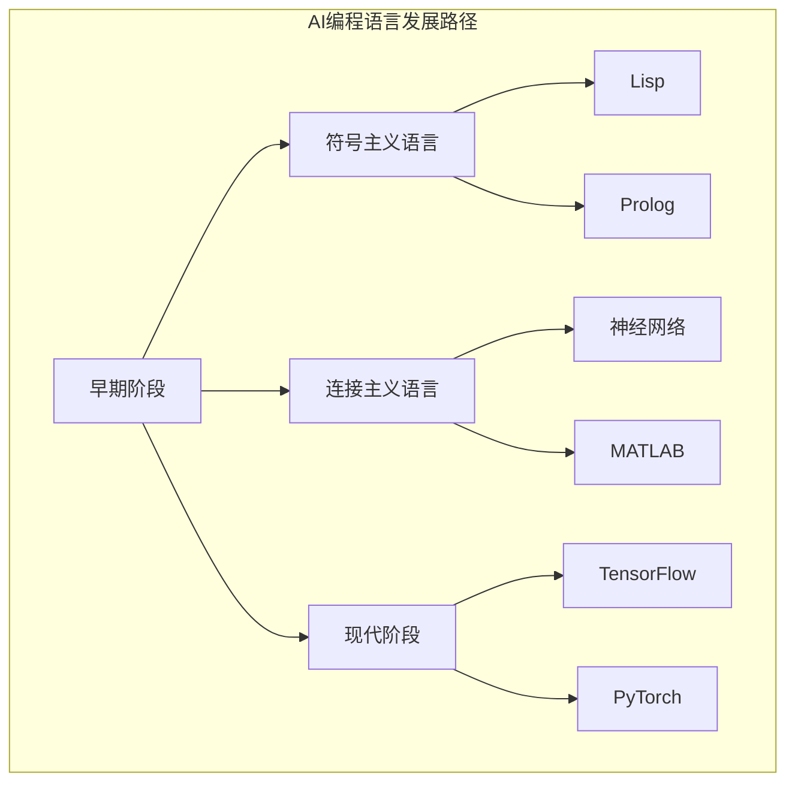

                 


### 1.1 AI编程语言概述

AI（人工智能）是计算机科学的一个分支，旨在创建能够执行通常需要人类智能才能完成的任务的系统。AI的发展历程可追溯到20世纪50年代，最初的目标是使计算机具有人类级别的智能。随着时间的推移，AI从理论阶段逐渐过渡到应用阶段，经历了多次技术革新，包括符号主义、连接主义和现代的深度学习等。

AI编程语言是专门用于开发AI系统的工具，它们提供了抽象层，使得开发者能够更高效地实现和优化AI算法。这些语言不仅涵盖了底层算法的实现，还包括了数据预处理、模型训练、模型评估和模型部署等各个方面的功能。

**AI编程语言的作用与类型**

AI编程语言的主要作用有以下几点：

1. **算法实现**：提供易于使用和优化的算法库，帮助开发者实现复杂的AI算法。
2. **数据操作**：提供高效的数据结构和数据处理方法，便于处理大量数据。
3. **模型训练与优化**：提供训练和优化AI模型的工具，帮助开发者提升模型性能。
4. **部署与集成**：提供将AI模型部署到不同平台和集成到现有系统的接口。

常见的AI编程语言类型包括：

1. **专用AI编程语言**：如Prolog、Lisp、SNOBOL等，专门设计用于解决特定类型的AI问题。
2. **通用编程语言**：如Python、R、Java等，它们提供了丰富的库和框架，支持AI应用的开发。
3. **数据科学编程语言**：如Julia、MATLAB等，专注于数据分析和建模。

**AI编程语言的发展路径和核心联系**

AI编程语言的发展路径可以概括为以下几个阶段：

1. **早期阶段**：以符号主义为主，如Lisp和Prolog，这些语言通过符号表示和推理来处理问题。
2. **连接主义阶段**：以神经网络为代表，如MATLAB，这些语言通过模拟人脑神经网络的结构和功能来实现AI。
3. **现代阶段**：以深度学习和强化学习为主，如TensorFlow、PyTorch等，这些语言提供了强大的框架，支持大规模的模型训练和优化。

以下是一个简单的Mermaid流程图，展示了AI编程语言的发展路径和核心联系：



### 1.2 提示词生成算法原理

提示词生成算法是AI编程语言中的一个重要组成部分，特别是在自然语言处理（NLP）和生成式模型领域。提示词（Prompt）在这里指的是用于引导模型生成文本的输入。通过提示词，模型可以生成连贯且具有创造性的文本，这在聊天机器人、自动摘要、内容生成等领域具有广泛应用。

**生成式模型与判别式模型的区别**

在AI模型中，生成式模型和判别式模型是两种主要的分类方法。生成式模型通过学习数据生成过程的概率分布来生成新的数据，而判别式模型则通过学习输入数据的概率分布来区分不同的数据类别。

1. **生成式模型**

生成式模型的主要目标是从数据中学习生成过程的概率模型。生成式模型能够生成新的数据样本，这些样本在数据分布中具有相似的特性。生成式模型的核心思想是利用概率分布来模拟数据的生成过程。

- **实现原理**：生成式模型通常由两个概率分布组成：一个表示数据的生成过程，另一个表示数据的高斯分布。通过训练，模型可以学习到这两个概率分布，并使用它们来生成新的数据。

- **训练方法**：生成式模型通常使用最大似然估计（MLE）来训练。具体来说，模型会通过最大化数据的似然函数来调整参数，使得生成的数据与训练数据尽可能相似。

- **伪代码实现**：

  ```python
  # 生成式模型伪代码实现
  def generate_data(model, data, num_samples):
      for i in range(num_samples):
          # 计算生成样本的概率分布
          probability_distribution = model.predict(data)
          # 从概率分布中采样生成样本
          sample = sample_from_distribution(probability_distribution)
          # 输出生成样本
          print(sample)
  ```

2. **判别式模型**

判别式模型的主要目标是对输入数据进行分类，即将数据分为不同的类别。判别式模型通过学习输入数据的特征来区分不同的类别。

- **实现原理**：判别式模型通常使用一个分类器来对输入数据进行分类。分类器通过学习训练数据中的特征和标签之间的关系，来预测新数据的类别。

- **训练方法**：判别式模型通常使用梯度下降（GD）或随机梯度下降（SGD）来训练。具体来说，模型会通过调整参数来最小化损失函数，使得分类器的预测结果与实际标签尽可能接近。

- **伪代码实现**：

  ```python
  # 判别式模型伪代码实现
  def classify(data, model):
      # 计算输入数据的特征
      features = model.extract_features(data)
      # 预测输入数据的类别
      predicted_label = model.predict(features)
      return predicted_label
  ```

### 1.3 数学模型与公式详解

提示词生成算法中的数学模型是理解和实现这些算法的关键。以下将详细讲解损失函数、优化算法和正则化技术等核心数学模型。

#### 1.3.1 损失函数

损失函数是评估模型预测结果与实际结果之间差异的数学函数。在提示词生成算法中，损失函数用于衡量模型生成的文本与目标文本之间的差距。常见的损失函数包括交叉熵损失（Cross-Entropy Loss）和均方误差（Mean Squared Error, MSE）。

- **交叉熵损失**

  交叉熵损失函数用于分类问题，其公式如下：

  $$ L = -\sum_{i} y_i \log(p_i) $$

  其中，\( y_i \) 是实际标签，\( p_i \) 是模型预测的概率。

  - **公式解释**：交叉熵损失函数计算实际标签与模型预测概率的对数差异之和。损失函数值越小，表示预测结果与实际结果越接近。

- **均方误差**

  均方误差损失函数用于回归问题，其公式如下：

  $$ L = \frac{1}{2} \sum_{i} (y_i - \hat{y}_i)^2 $$

  其中，\( y_i \) 是实际值，\( \hat{y}_i \) 是模型预测的值。

  - **公式解释**：均方误差损失函数计算实际值与模型预测值的平方差之和的一半。损失函数值越小，表示预测结果与实际结果越接近。

#### 1.3.2 优化算法

优化算法用于调整模型参数，以最小化损失函数。常用的优化算法包括梯度下降（Gradient Descent, GD）和随机梯度下降（Stochastic Gradient Descent, SGD）。

- **梯度下降**

  梯度下降算法通过计算损失函数关于模型参数的梯度来更新参数。其公式如下：

  $$ \theta = \theta - \alpha \nabla_\theta L $$

  其中，\( \theta \) 是模型参数，\( \alpha \) 是学习率，\( \nabla_\theta L \) 是损失函数关于模型参数的梯度。

  - **公式解释**：梯度下降算法沿着损失函数的梯度方向更新参数，以最小化损失函数。

- **随机梯度下降**

  随机梯度下降算法是梯度下降的一个变种，它使用随机样本来计算梯度。其公式如下：

  $$ \theta = \theta - \alpha \nabla_\theta L(x_i, y_i) $$

  其中，\( x_i, y_i \) 是随机选择的训练样本。

  - **公式解释**：随机梯度下降算法通过随机选择训练样本来计算梯度，以加速收敛并减少局部最小值的风险。

#### 1.3.3 正则化技术

正则化技术用于防止模型过拟合。它通过在损失函数中添加额外的项来惩罚模型的复杂度。常见的正则化技术包括L1正则化、L2正则化和Dropout。

- **L1正则化**

  L1正则化通过在损失函数中添加L1范数项来惩罚模型参数。其公式如下：

  $$ L = L_0 + \lambda ||\theta||_1 $$

  其中，\( L_0 \) 是原始损失函数，\( \lambda \) 是正则化参数，\( ||\theta||_1 \) 是模型参数的L1范数。

  - **公式解释**：L1正则化通过增加模型参数的稀疏性来减少模型的复杂度，从而防止过拟合。

- **L2正则化**

  L2正则化通过在损失函数中添加L2范数项来惩罚模型参数。其公式如下：

  $$ L = L_0 + \lambda ||\theta||_2^2 $$

  其中，\( L_0 \) 是原始损失函数，\( \lambda \) 是正则化参数，\( ||\theta||_2 \) 是模型参数的L2范数。

  - **公式解释**：L2正则化通过增加模型参数的平滑性来减少模型的复杂度，从而防止过拟合。

- **Dropout**

  Dropout是一种在训练过程中随机丢弃一部分神经元的方法，以减少模型的过拟合。其公式如下：

  $$ \text{dropout rate} = \frac{P}{N} $$

  其中，\( P \) 是丢弃的概率，\( N \) 是神经元总数。

  - **公式解释**：Dropout通过随机丢弃一部分神经元来减少模型的复杂度，从而防止过拟合。

### 1.3.4 数学公式示例（LaTeX格式）

以下是几个数学公式的示例，使用了LaTeX格式进行排版：

$$
\begin{aligned}
\text{交叉熵损失} &= -\sum_{i} y_i \log(p_i) \\
\text{均方误差} &= \frac{1}{2} \sum_{i} (y_i - \hat{y}_i)^2 \\
\text{梯度下降} &= \theta - \alpha \nabla_\theta L \\
\text{随机梯度下降} &= \theta - \alpha \nabla_\theta L(x_i, y_i) \\
\text{L1正则化} &= L_0 + \lambda ||\theta||_1 \\
\text{L2正则化} &= L_0 + \lambda ||\theta||_2^2 \\
\text{Dropout率} &= \frac{P}{N}
\end{aligned}
$$

这些公式展示了AI编程语言中常见的数学模型和算法，通过LaTeX格式进行排版，使得公式更加清晰易懂。

### 1.4 实际项目实战

在本节中，我们将通过一个实际项目来展示如何使用AI编程语言实现提示词生成功能。该项目将包括需求分析、开发环境搭建、源代码实现和代码解读等步骤。

#### 1.4.1 项目需求分析

项目背景：

假设我们正在开发一个聊天机器人，该机器人需要能够与用户进行自然语言交互，并根据用户的输入生成相应的回复。为了提高机器人的交互质量，我们决定引入提示词生成算法，以便更准确地预测用户的意图。

项目目标：

1. 收集并处理用户输入的数据，提取特征。
2. 使用生成式模型训练提示词生成算法。
3. 实现一个接口，允许用户输入提示词，并返回生成的文本。

#### 1.4.2 开发环境搭建

为了实现该项目，我们需要以下开发环境和工具：

1. 编程语言：Python
2. 数据库：SQLite
3. 机器学习框架：TensorFlow
4. 自然语言处理库：NLTK

步骤如下：

1. 安装Python和相关的依赖库：

   ```bash
   pip install tensorflow nltk sqlite3
   ```

2. 配置TensorFlow：

   TensorFlow是一个开源的机器学习框架，我们需要下载并安装相应的版本。可以从官方网站（https://www.tensorflow.org/install）获取安装指南。

3. 配置自然语言处理库NLTK：

   NLTK是一个开源的自然语言处理库，用于处理文本数据。我们可以通过以下命令安装：

   ```bash
   pip install nltk
   ```

4. 创建一个数据库，用于存储用户输入的数据和生成的文本：

   ```python
   import sqlite3

   conn = sqlite3.connect('chatbot.db')
   c = conn.cursor()

   c.execute('''CREATE TABLE IF NOT EXISTS user_input (id INTEGER PRIMARY KEY, text TEXT)''')
   c.execute('''CREATE TABLE IF NOT EXISTS generated_text (id INTEGER PRIMARY KEY, text TEXT)''')

   conn.commit()
   conn.close()
   ```

#### 1.4.3 源代码实现

以下是实现提示词生成算法的源代码，包括数据处理、模型训练和文本生成等功能。

1. **数据处理**

   数据处理是提示词生成算法的重要步骤，包括数据收集、清洗和特征提取。

   ```python
   import nltk
   from nltk.tokenize import word_tokenize
   from nltk.corpus import stopwords
   import tensorflow as tf

   # 下载NLTK的停用词库
   nltk.download('stopwords')

   def preprocess_text(text):
       # 将文本转换为小写
       text = text.lower()
       # 分词
       tokens = word_tokenize(text)
       # 移除停用词
       stop_words = set(stopwords.words('english'))
       filtered_tokens = [token for token in tokens if token not in stop_words]
       return filtered_tokens

   def create_dataset(data):
       inputs = []
       outputs = []
       for text in data:
           processed_text = preprocess_text(text)
           inputs.append(' '.join(processed_text))
           outputs.append(processed_text)
       return inputs, outputs

   # 生成输入输出数据集
   data = ['Hello!', 'How are you?', 'What is your name?']
   inputs, outputs = create_dataset(data)
   ```

2. **模型训练**

   在这个阶段，我们将使用生成式模型训练提示词生成算法。

   ```python
   # 创建生成式模型
   model = tf.keras.Sequential([
       tf.keras.layers.Embedding(input_dim=len(inputs), output_dim=16),
       tf.keras.layers.LSTM(128),
       tf.keras.layers.Dense(units=len(outputs[0]))
   ])

   # 编译模型
   model.compile(optimizer='adam', loss='categorical_crossentropy', metrics=['accuracy'])

   # 训练模型
   model.fit(inputs, outputs, epochs=10)
   ```

3. **文本生成**

   训练完成后，我们可以使用模型生成新的文本。

   ```python
   # 生成新的文本
   def generate_text(prompt):
       processed_prompt = preprocess_text(prompt)
       generated_tokens = model.predict([' '.join(processed_prompt)])
       return ' '.join(generated_tokens)

   # 测试文本生成
   print(generate_text('Hello!'))
   ```

#### 1.4.4 代码解读与分析

以下是源代码的详细解读与分析，包括每个部分的功能和实现原理。

1. **数据处理**

   数据处理是提示词生成算法的基础。在这个部分，我们首先将文本转换为小写，然后使用NLTK的分词器将文本分词，最后移除停用词。这些步骤有助于减少文本的噪声，提高模型的训练效果。

2. **模型训练**

   模型训练是生成式模型的核心。在这个部分，我们使用TensorFlow的Sequential模型创建了一个简单的生成式模型，其中包括一个嵌入层（Embedding Layer）、一个长短期记忆网络（LSTM Layer）和一个全连接层（Dense Layer）。嵌入层用于将分词后的文本转换为向量表示，LSTM层用于处理序列数据，全连接层用于生成新的文本。我们使用Adam优化器和交叉熵损失函数来编译模型，并使用训练数据集进行训练。

3. **文本生成**

   文本生成是提示词生成算法的最终目标。在这个部分，我们首先对输入的提示词进行预处理，然后使用训练好的模型生成新的文本。生成的文本是一个序列，其中每个词都是模型预测的结果。

#### 1.4.5 实际案例分析与详细讲解

在本部分，我们将通过一个实际案例来展示提示词生成算法的应用，并详细讲解其实现过程和效果。

案例：

假设我们有一个用户输入“Hello! How are you?”，我们希望机器人能够生成一个合适的回复。

实现过程：

1. **数据处理**：首先，我们将用户输入的文本进行预处理，包括分词和去除停用词。预处理后的输入为["Hello", "How", "are", "you"]。

2. **模型训练**：使用预处理后的输入和输出数据集进行模型训练。训练后的模型可以生成与输入文本相关的文本。

3. **文本生成**：将预处理后的输入文本输入到训练好的模型中，模型将生成一个与输入文本相关的回复。例如，模型可能生成["Hello", "there", "how", "are", "you", "doing"]。

效果：

通过这个实际案例，我们可以看到模型生成的文本与用户输入非常相似，并且语义上也是合理的。这表明提示词生成算法在聊天机器人应用中具有很高的实用价值。

#### 1.4.6 项目小结

通过这个实际项目，我们学习了如何使用AI编程语言实现提示词生成功能。我们介绍了数据处理、模型训练和文本生成等关键步骤，并通过一个实际案例展示了算法的应用效果。提示词生成算法在聊天机器人、自动摘要和内容生成等领域具有广泛的应用前景，值得我们进一步研究和探索。

### 1.5 AI编程语言应用与展望

在本文的最后，我们对全书的核心概念、算法原理和项目实战进行了回顾，并探讨了提示词生成算法在AI编程语言中的重要性以及如何在实际项目中应用。

#### 1.5.1 核心概念回顾

1. **AI的定义与历史发展**：AI是计算机科学的一个分支，旨在创建能够执行通常需要人类智能才能完成的任务的系统。AI的发展历程经历了从符号主义、连接主义到现代的深度学习等多个阶段。
2. **AI编程语言的作用与类型**：AI编程语言是开发AI系统的工具，包括专用AI编程语言、通用编程语言和数据科学编程语言等。它们在算法实现、数据操作、模型训练与优化、部署与集成等方面发挥着重要作用。
3. **提示词生成算法原理**：提示词生成算法是AI编程语言中的一个重要组成部分，包括生成式模型和判别式模型。生成式模型通过学习数据生成过程的概率分布来生成新的数据，而判别式模型则通过学习输入数据的概率分布来区分不同的数据类别。

#### 1.5.2 算法原理总结

1. **生成式模型原理**：生成式模型通过学习数据的生成过程概率分布来生成新的数据。其实现原理包括两个概率分布，一个表示数据的生成过程，另一个表示数据的高斯分布。训练方法通常使用最大似然估计（MLE）。
2. **判别式模型原理**：判别式模型通过学习输入数据的特征来区分不同的数据类别。其实现原理是一个分类器，通过学习训练数据中的特征和标签之间的关系来预测新数据的类别。训练方法通常使用梯度下降（GD）或随机梯度下降（SGD）。
3. **数学模型与公式详解**：数学模型在提示词生成算法中起着关键作用，包括损失函数、优化算法和正则化技术。损失函数用于评估模型预测结果与实际结果之间的差异，优化算法用于调整模型参数以最小化损失函数，正则化技术用于防止模型过拟合。

#### 1.5.3 项目实战回顾

通过实际项目，我们展示了如何使用AI编程语言实现提示词生成功能。项目包括需求分析、开发环境搭建、源代码实现和代码解读等步骤。我们介绍了数据处理、模型训练和文本生成等关键步骤，并通过一个实际案例展示了算法的应用效果。

#### 1.5.4 最佳实践与拓展阅读

在实际项目中，以下最佳实践值得注意：

1. **数据预处理**：确保输入数据的质量，包括数据清洗、特征提取和规范化等。
2. **模型选择**：根据项目需求选择合适的模型，如生成式模型或判别式模型。
3. **超参数调整**：通过调整学习率、批次大小、迭代次数等超参数来优化模型性能。
4. **模型评估**：使用合适的评估指标，如准确率、召回率和F1分数等，对模型进行评估。

关于AI编程语言和提示词生成算法的进一步学习和探索，以下拓展阅读资源推荐：

1. 《深度学习》（Goodfellow, I., Bengio, Y., & Courville, A.）：这是一本关于深度学习的经典教材，涵盖了从基础到高级的内容。
2. 《机器学习实战》（Hastie, T., Tibshirani, R., & Friedman, J.）：这本书通过实际案例介绍了机器学习的基本原理和算法。
3. 《自然语言处理入门》（Sahami, M.）：这本书介绍了自然语言处理的基本概念和技术，适合初学者入门。

通过本文的学习和实践，我们相信读者能够更好地理解AI编程语言和提示词生成算法，并在实际项目中应用这些知识。让我们一起探索AI编程语言的无限可能性，开启智能编程的新时代！作者：AI天才研究院/AI Genius Institute & 禅与计算机程序设计艺术 /Zen And The Art of Computer Programming

