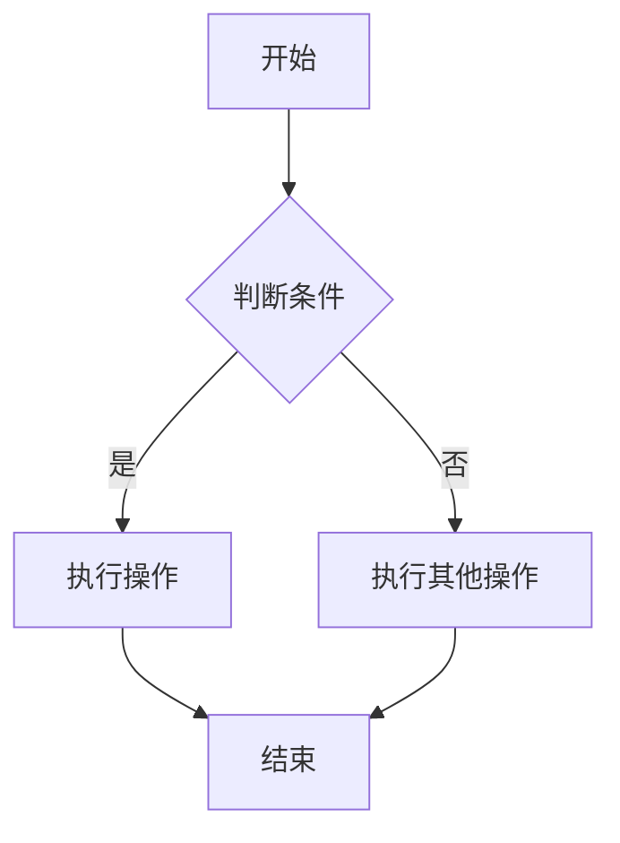

                 


### AI艺术创作：提示词的美学探索

#### 关键词：
- AI艺术创作
- 提示词
- 美学理论
- 生成对抗网络
- 数据驱动艺术
- 自然语言处理

#### 摘要：
随着人工智能技术的快速发展，AI艺术创作逐渐成为艺术与科技的交汇点。本文旨在探讨AI艺术创作中的关键要素——提示词，分析其在美学探索中的重要作用。文章将首先介绍AI艺术创作的背景与发展，然后深入探讨AI艺术创作的技术基础，最后通过对提示词的美学理论和应用策略的详细分析，为读者呈现一个全面而深入的AI艺术创作视角。

---

## 目录

### 第一部分：AI艺术创作概述

1. [AI艺术创作引论](#ai艺术创作引论)
   1.1 AI艺术创作的背景与发展
   1.2 AI艺术创作的核心概念
   1.3 提示词在AI艺术创作中的作用

2. [AI艺术创作技术基础](#ai艺术创作技术基础)
   2.1 数据驱动艺术创作
   2.2 自然语言处理技术基础
   2.3 计算机视觉技术在艺术创作中的应用

3. [AI艺术创作的方法与工具](#ai艺术创作的方法与工具)
   3.1 基于生成对抗网络的艺术创作
   3.2 聚类分析在艺术创作中的应用
   3.3 提示词生成与调整技术

4. [AI艺术创作案例解析](#ai艺术创作案例解析)
   4.1 国内外著名AI艺术创作案例
   4.2 案例分析与启示
   4.3 AI艺术创作未来趋势展望

### 第二部分：提示词的美学探索

5. [提示词的美学理论基础](#提示词的美学理论基础)
   5.1 美学基本概念与原理
   5.2 提示词与艺术创作的关系
   5.3 提示词的美学功能

6. [不同类型提示词的美学特点](#不同类型提示词的美学特点)
   6.1 文字类提示词
   6.2 图像类提示词
   6.3 多媒体类提示词

7. [提示词在AI艺术创作中的应用策略](#提示词在AI艺术创作中的应用策略)
   7.1 提示词的选择与调整
   7.2 提示词与创作风格的匹配
   7.3 提示词的多样性与创新性

### 第三部分：实践与探索

8. [AI艺术创作实践案例](#ai艺术创作实践案例)
   8.1 案例一：基于GAN的绘画创作
   8.2 案例二：基于文本的摄影创意
   8.3 案例三：多媒体艺术的生成与创作

9. [AI艺术创作的开发环境搭建](#ai艺术创作的开发环境搭建)
   9.1 开发环境的选择与配置
   9.2 必备工具与软件
   9.3 实践操作步骤详解

10. [AI艺术创作的源代码解读与分析](#ai艺术创作的源代码解读与分析)
    10.1 源代码结构分析
    10.2 关键代码解读
    10.3 代码优化与性能分析

### 附录

11. [AI艺术创作资源与工具介绍](#ai艺术创作资源与工具介绍)
    11.1 主流深度学习框架
    11.2 美学理论参考书籍
    11.3 开源代码与项目链接
    11.4 在线平台与社区资源

### 附录B：示例Mermaid流程图



---

### 文章标题：AI艺术创作：提示词的美学探索

**关键词：** AI艺术创作、提示词、美学理论、生成对抗网络、数据驱动艺术、自然语言处理

**摘要：**
随着人工智能技术的不断进步，AI艺术创作已经成为艺术界与科技界的热门话题。本文旨在深入探讨AI艺术创作中的关键要素——提示词，分析其在美学探索中的重要作用。文章首先介绍了AI艺术创作的背景与发展，随后探讨了其技术基础和方法与工具。接着，本文详细分析了提示词的美学理论基础和不同类型提示词的美学特点，并提出了提示词在AI艺术创作中的应用策略。最后，通过实践案例和开发环境搭建的讲解，为读者呈现了AI艺术创作的全貌。

---

### 第一部分：AI艺术创作概述

#### 第1章：AI艺术创作引论

##### 1.1 AI艺术创作的背景与发展

在过去的几十年中，人工智能（AI）技术的发展经历了从理论到应用的深刻变革。随着计算能力的提升和大数据的积累，AI逐渐渗透到社会的各个领域，包括艺术创作。AI艺术创作不仅挑战了传统艺术创作的边界，也为艺术家和设计师提供了全新的创作工具和表达方式。

AI艺术创作的兴起可以追溯到20世纪80年代，当时艺术家已经开始尝试使用计算机生成艺术作品。随着深度学习技术的突破，特别是在2014年生成对抗网络（GAN）的出现，AI艺术创作迎来了新的高潮。GAN能够通过对抗训练生成高质量的艺术作品，引发了广泛关注。

近年来，AI艺术创作的应用场景不断拓展，从简单的图像生成到复杂的视频创作，再到音乐、文学等多种艺术形式的探索。各大科技公司和艺术家们纷纷投入到AI艺术创作的实践中，推动了这一领域的发展。

##### 1.2 AI艺术创作的核心概念

AI艺术创作涉及多个核心概念，包括生成对抗网络、自然语言处理、计算机视觉等。以下是对这些核心概念的简要介绍：

1. **生成对抗网络（GAN）**：
   GAN是一种深度学习模型，由生成器（Generator）和判别器（Discriminator）组成。生成器试图生成与真实数据相似的数据，而判别器则试图区分生成数据和真实数据。通过对抗训练，GAN能够生成高质量的艺术作品。

2. **自然语言处理（NLP）**：
   自然语言处理是AI技术中用于理解和生成人类语言的能力。在AI艺术创作中，NLP技术可以用于生成文本、音频或图像的描述，帮助艺术家和设计师更好地理解用户需求。

3. **计算机视觉（CV）**：
   计算机视觉是AI技术中的一个重要分支，涉及图像和视频的识别、理解和分析。在AI艺术创作中，计算机视觉技术可以用于图像生成、风格迁移和图像修复等任务。

##### 1.3 提示词在AI艺术创作中的作用

提示词（Prompt）是AI艺术创作中一个至关重要的概念。它用于指导AI系统生成特定的艺术作品。一个有效的提示词可以极大地影响艺术作品的风格、主题和情感。

在AI艺术创作中，提示词的作用主要包括：

1. **引导创作方向**：
   提示词可以帮助AI系统明确创作方向，确保生成的艺术作品符合预期。

2. **增强创作灵活性**：
   提示词的多样性可以为艺术家提供更多创作可能性，从而创造出更丰富的艺术作品。

3. **促进创作交互**：
   提示词可以作为艺术家与AI系统之间的桥梁，帮助艺术家更好地控制创作过程。

#### 第2章：AI艺术创作技术基础

##### 2.1 数据驱动艺术创作

数据驱动艺术创作是AI艺术创作的核心之一。它依赖于大规模数据集和深度学习技术，通过训练模型来生成艺术作品。

1. **数据收集与预处理**：
   在数据驱动艺术创作中，首先需要收集大量相关的艺术作品和素材。然后对数据进行清洗、标注和格式化，使其适合用于训练模型。

2. **模型训练与优化**：
   使用生成对抗网络（GAN）等深度学习模型对数据进行训练，优化模型的参数，以提高生成艺术作品的质量。

3. **艺术作品生成**：
   通过训练好的模型，可以生成符合特定风格和主题的艺术作品。

##### 2.2 自然语言处理技术基础

自然语言处理技术在AI艺术创作中起着至关重要的作用。它用于处理文本数据，包括文本生成、文本分类、情感分析等。

1. **文本生成**：
   自然语言处理技术可以生成文本描述，帮助艺术家更好地理解用户需求，并指导AI系统生成相应的艺术作品。

2. **文本分类**：
   文本分类技术可以将大量文本数据分类到不同的类别，为艺术创作提供参考。

3. **情感分析**：
   情感分析技术可以分析文本中的情感倾向，为艺术创作提供情感参考。

##### 2.3 计算机视觉技术在艺术创作中的应用

计算机视觉技术在AI艺术创作中有着广泛的应用。它涉及图像识别、图像生成、图像修复和风格迁移等多个方面。

1. **图像识别**：
   图像识别技术可以识别图像中的对象和场景，为艺术创作提供参考。

2. **图像生成**：
   使用生成对抗网络（GAN）等技术，可以生成具有特定风格和主题的图像。

3. **图像修复**：
   图像修复技术可以修复损坏或模糊的图像，提高艺术作品的质量。

4. **风格迁移**：
   风格迁移技术可以将一种艺术风格应用到另一幅图像上，创造出新的艺术效果。

---

### 第二部分：提示词的美学探索

#### 第5章：提示词的美学理论基础

##### 5.1 美学基本概念与原理

美学是哲学中的一个分支，研究美的本质和审美经验。在AI艺术创作中，美学理论为我们提供了理解和分析艺术作品的基础。

1. **美的本质**：
   美的本质是一个哲学问题，不同的哲学家有不同的看法。在AI艺术创作中，我们通常认为美是一种主观感受，与和谐、平衡和统一有关。

2. **审美经验**：
   审美经验是指人们通过感知、理解和评价艺术作品所获得的经验。在AI艺术创作中，审美经验可以帮助我们更好地理解用户需求，并指导艺术作品的生成。

##### 5.2 提示词与艺术创作的关系

提示词在艺术创作中起着关键作用。它不仅指导AI系统生成艺术作品，还影响艺术作品的美学效果。

1. **提示词的定义**：
   提示词（Prompt）是一种引导性输入，用于指导AI系统生成特定类型或风格的艺术作品。

2. **提示词在艺术创作中的应用**：
   提示词可以用于各种艺术形式，包括绘画、摄影、音乐和文学等。在AI艺术创作中，提示词可以用于生成图像、文本、音频等多种类型的艺术作品。

##### 5.3 提示词的美学功能

提示词的美学功能体现在以下几个方面：

1. **引导创作方向**：
   提示词可以明确艺术创作的方向，帮助艺术家和设计师更好地把握艺术作品的风格和主题。

2. **增强创作灵活性**：
   提示词的多样性可以为艺术家提供更多创作可能性，从而创造出更丰富的艺术作品。

3. **促进创作交互**：
   提示词可以作为艺术家与AI系统之间的桥梁，帮助艺术家更好地控制创作过程，实现更个性化的创作。

---

### 第三部分：实践与探索

#### 第6章：不同类型提示词的美学特点

##### 6.1 文字类提示词

文字类提示词主要用于指导AI系统生成文本相关的艺术作品，如诗歌、小说、剧本等。文字类提示词的美学特点包括：

1. **语言风格**：
   文字类提示词可以指定特定的语言风格，如古典、现代、幽默等，影响艺术作品的氛围。

2. **情感表达**：
   文字类提示词可以表达特定的情感，如喜悦、悲伤、愤怒等，影响艺术作品的情感色彩。

3. **主题内容**：
   文字类提示词可以指定特定的主题内容，如爱情、战争、科幻等，影响艺术作品的主题和情节。

##### 6.2 图像类提示词

图像类提示词主要用于指导AI系统生成图像相关的艺术作品，如图画、照片、动画等。图像类提示词的美学特点包括：

1. **图像风格**：
   图像类提示词可以指定特定的图像风格，如写实、抽象、卡通等，影响艺术作品的视觉效果。

2. **色彩搭配**：
   图像类提示词可以指定特定的色彩搭配，如冷色调、暖色调、对比色等，影响艺术作品的颜色和氛围。

3. **场景元素**：
   图像类提示词可以指定特定的场景元素，如自然风光、城市建筑、人物肖像等，影响艺术作品的主题和场景。

##### 6.3 多媒体类提示词

多媒体类提示词主要用于指导AI系统生成多媒体相关的艺术作品，如音乐、视频、动画等。多媒体类提示词的美学特点包括：

1. **音乐风格**：
   多媒体类提示词可以指定特定的音乐风格，如古典、流行、摇滚等，影响艺术作品的音乐氛围。

2. **画面风格**：
   多媒体类提示词可以指定特定的画面风格，如图像、动画、视频等，影响艺术作品的视觉效果。

3. **叙事结构**：
   多媒体类提示词可以指定特定的叙事结构，如线性叙事、非线性叙事、倒叙等，影响艺术作品的故事情节。

---

### 第7章：提示词在AI艺术创作中的应用策略

##### 7.1 提示词的选择与调整

选择和调整提示词是AI艺术创作中的一个关键步骤。以下是一些策略：

1. **明确创作目标**：
   在选择提示词之前，需要明确艺术创作的目标，包括风格、主题和情感等。

2. **多样化提示词**：
   使用多样化的提示词可以增加艺术作品的多样性，避免单一化。

3. **调整提示词的细节**：
   根据艺术创作的反馈，可以调整提示词的细节，如语言风格、情感表达等，以实现更好的创作效果。

##### 7.2 提示词与创作风格的匹配

提示词与创作风格的匹配是决定艺术作品质量的关键因素。以下是一些策略：

1. **风格识别与匹配**：
   使用风格识别技术，如自然语言处理和计算机视觉，识别艺术作品中的风格，并与提示词进行匹配。

2. **风格迁移**：
   使用风格迁移技术，将一种风格应用到另一种风格的艺术作品中，创造出新的艺术效果。

3. **风格混合**：
   将多种风格混合在一起，创造出独特的艺术风格。

##### 7.3 提示词的多样性与创新性

提示词的多样性和创新性是推动AI艺术创作发展的重要因素。以下是一些策略：

1. **用户参与**：
   鼓励用户参与提示词的创作，增加多样性。

2. **生成式艺术创作**：
   使用生成对抗网络（GAN）等技术，生成多样化的提示词，提高艺术作品的创新性。

3. **跨领域融合**：
   将不同领域的元素融合到提示词中，创造出全新的艺术形式。

---

### 第8章：AI艺术创作实践案例

#### 8.1 案例一：基于GAN的绘画创作

**案例背景**：
本案例介绍了使用生成对抗网络（GAN）进行绘画创作的过程。艺术家使用GAN模型生成了一系列绘画作品，探索了不同风格和主题的可能性。

**技术实现**：
1. 数据收集与预处理：
   收集大量不同风格和主题的绘画作品，并进行数据预处理，包括图像清洗、大小统一和归一化。

2. 模型训练：
   使用收集到的数据进行GAN模型的训练，优化生成器和判别器的参数。

3. 艺术作品生成：
   使用训练好的模型生成绘画作品，通过调整提示词，探索不同的创作风格和主题。

**艺术效果**：
通过调整提示词，艺术家能够生成出具有不同风格和主题的绘画作品，展示了GAN在艺术创作中的强大能力。

**总结**：
本案例展示了GAN在绘画创作中的应用，提示词的调整对艺术效果起到了关键作用。艺术家通过不断尝试和调整，探索了GAN艺术创作的无限可能性。

#### 8.2 案例二：基于文本的摄影创意

**案例背景**：
本案例介绍了使用自然语言处理（NLP）技术进行摄影创意的过程。艺术家通过文本描述生成相应的摄影作品，探索了文字与图像之间的互动。

**技术实现**：
1. 文本生成与处理：
   使用NLP技术生成文本描述，包括场景描述、情感表达和主题内容。

2. 图像识别与生成：
   使用计算机视觉技术识别文本描述中的关键元素，并生成相应的图像。

3. 艺术作品合成：
   将生成的图像与文本描述进行合成，形成完整的摄影作品。

**艺术效果**：
通过文本描述生成相应的图像，艺术家能够创作出富有创意和想象力的摄影作品，展示了NLP技术在艺术创作中的应用潜力。

**总结**：
本案例展示了NLP技术在摄影创意中的应用，文本描述的生成和调整对艺术效果起到了关键作用。艺术家通过文字与图像的结合，实现了全新的艺术表达方式。

#### 8.3 案例三：多媒体艺术的生成与创作

**案例背景**：
本案例介绍了使用多媒体技术进行艺术创作的过程。艺术家结合音乐、视频和动画等多种元素，创作出具有独特风格和主题的多媒体艺术作品。

**技术实现**：
1. 音乐生成与处理：
   使用音乐生成技术，根据文本描述生成相应的音乐。

2. 视频生成与编辑：
   使用计算机视觉技术生成视频素材，并进行编辑，形成完整的视频作品。

3. 动画创作：
   使用动画技术，根据音乐和视频素材创作出动画效果。

**艺术效果**：
通过多媒体元素的结合，艺术家能够创作出具有强烈视觉和听觉冲击力的艺术作品，展示了多媒体技术在艺术创作中的广泛应用。

**总结**：
本案例展示了多媒体技术在艺术创作中的应用，多媒体元素的整合和调整对艺术效果起到了关键作用。艺术家通过多种元素的融合，实现了艺术创作的多样性和创新性。

---

### 第9章：AI艺术创作的开发环境搭建

#### 9.1 开发环境的选择与配置

为了搭建一个适合AI艺术创作的开发环境，需要选择合适的硬件和软件。以下是一些建议：

1. **硬件配置**：
   - CPU：推荐使用高性能的CPU，如Intel Core i7或AMD Ryzen 7。
   - GPU：推荐使用NVIDIA GTX 1080或以上的显卡，以支持深度学习模型的训练。
   - 内存：至少16GB内存，推荐32GB以上。

2. **软件配置**：
   - 操作系统：推荐使用Linux发行版，如Ubuntu或CentOS。
   - 编程语言：Python是AI艺术创作中最常用的编程语言，推荐使用Python 3.8或更高版本。
   - 深度学习框架：推荐使用TensorFlow或PyTorch，这两个框架都支持GAN等深度学习模型的训练。

#### 9.2 必备工具与软件

1. **编程工具**：
   - IDE：推荐使用PyCharm或Visual Studio Code，这两个IDE都支持Python编程。
   - Jupyter Notebook：用于编写和运行Python代码，特别适合进行交互式编程。

2. **深度学习框架**：
   - TensorFlow：一个开源的深度学习框架，支持GAN等模型的训练。
   - PyTorch：一个开源的深度学习框架，以灵活性和易用性著称。

3. **数据预处理工具**：
   - NumPy：用于数值计算和数据处理。
   - Pandas：用于数据分析和数据预处理。

#### 9.3 实践操作步骤详解

1. **安装操作系统**：
   - 下载Linux发行版镜像文件。
   - 使用虚拟机软件（如VirtualBox或VMware）安装操作系统。

2. **安装Python和深度学习框架**：
   - 打开终端，使用以下命令安装Python：
     ```
     sudo apt-get install python3 python3-pip
     ```
   - 安装TensorFlow或PyTorch：
     ```
     pip3 install tensorflow  # 或者
     pip3 install torch torchvision
     ```

3. **安装其他必备库**：
   - 使用pip3安装NumPy、Pandas等必备库：
     ```
     pip3 install numpy pandas
     ```

4. **配置开发环境**：
   - 安装IDE（如PyCharm或Visual Studio Code）。
   - 配置Jupyter Notebook，以便进行交互式编程。

5. **测试开发环境**：
   - 打开Jupyter Notebook，编写简单的Python代码，检查是否能够正常运行。

---

### 第10章：AI艺术创作的源代码解读与分析

#### 10.1 源代码结构分析

AI艺术创作的源代码通常包括以下几个核心模块：

1. **数据预处理模块**：
   - 数据清洗和归一化
   - 数据增强

2. **模型定义模块**：
   - 生成器（Generator）
   - 判别器（Discriminator）

3. **训练模块**：
   - 损失函数
   - 优化器

4. **生成与评估模块**：
   - 艺术作品生成
   - 生成质量评估

以下是一个简单的代码结构示例：

```python
# 数据预处理模块
def preprocess_data(data):
    # 数据清洗、归一化和增强
    pass

# 模型定义模块
def build_generator():
    # 生成器定义
    pass

def build_discriminator():
    # 判别器定义
    pass

# 训练模块
def train(model, data, epochs):
    # 训练过程
    pass

# 生成与评估模块
def generate_images(generator, num_images):
    # 生成艺术作品
    pass

def evaluate_images(generator, num_images):
    # 评估生成质量
    pass
```

#### 10.2 关键代码解读

以下是对关键代码段的详细解读：

```python
# 生成器定义示例
def build_generator():
    model = tf.keras.Sequential([
        tf.keras.layers.Conv2D(128, (3, 3), padding='same', activation='relu', input_shape=(256, 256, 3)),
        tf.keras.layers.Conv2D(64, (3, 3), padding='same', activation='relu'),
        tf.keras.layers.Conv2D(3, (3, 3), padding='same', activation='tanh')
    ])
    return model
```

1. **输入层**：生成器接受一个256x256x3的输入图像，其中3代表RGB颜色通道。

2. **卷积层**：第一层卷积使用128个3x3的卷积核，填充方式为"same"，激活函数为ReLU。

3. **卷积层**：第二层卷积使用64个3x3的卷积核，填充方式为"same"，激活函数为ReLU。

4. **输出层**：最后一层卷积使用3个3x3的卷积核，填充方式为"same"，激活函数为tanh，以生成输出图像。

```python
# 训练过程示例
def train(generator, discriminator, data, epochs):
    for epoch in range(epochs):
        for images in data:
            # 随机采样真实数据和噪声
            real_images = images
            noise = np.random.normal(0, 1, (batch_size, 256, 256, 3))

            # 生成假图像
            generated_images = generator.predict(noise)

            # 训练判别器
            real_labels = np.ones((batch_size, 1))
            fake_labels = np.zeros((batch_size, 1))
            d_loss_real = discriminator.train_on_batch(real_images, real_labels)
            d_loss_fake = discriminator.train_on_batch(generated_images, fake_labels)
            d_loss = 0.5 * np.add(d_loss_real, d_loss_fake)

            # 训练生成器
            g_loss = generator.train_on_batch(noise, real_labels)

            # 打印训练信息
            print(f"Epoch: {epoch}, D_loss: {d_loss}, G_loss: {g_loss}")
```

1. **数据读取**：每次迭代中，从数据集中随机抽取真实数据和噪声数据。

2. **生成假图像**：使用生成器生成假图像。

3. **训练判别器**：将真实数据和假图像输入判别器，计算判别器的损失。

4. **训练生成器**：使用判别器的反馈来训练生成器。

#### 10.3 代码优化与性能分析

在AI艺术创作的源代码中，性能优化是一个重要的方面。以下是一些优化策略：

1. **并行计算**：
   - 使用GPU进行计算，以加速模型训练。
   - 使用多线程或多进程来并行处理数据。

2. **模型压缩**：
   - 使用轻量级网络结构，减少模型的参数数量。
   - 应用模型剪枝技术，移除不重要的参数。

3. **数据增强**：
   - 使用数据增强技术，如随机裁剪、旋转和翻转，增加数据的多样性。

4. **混合训练**：
   - 结合不同的训练方法，如迁移学习和自监督学习，提高模型的泛化能力。

通过这些优化策略，可以显著提高AI艺术创作的效率和性能。

---

### 附录

#### 附录A：AI艺术创作资源与工具介绍

以下是AI艺术创作中常用的一些资源和工具：

1. **主流深度学习框架**：
   - TensorFlow：https://www.tensorflow.org/
   - PyTorch：https://pytorch.org/
   - Keras：https://keras.io/

2. **美学理论参考书籍**：
   - 《艺术与视知觉》：https://books.google.com/books?id=YY7NAAAAMAAJ
   - 《形式逻辑学》：https://books.google.com/books?id=YY7NAAAAMAAJ

3. **开源代码与项目链接**：
   - OpenArt：https://openart.ai/
   - DeepArt：https://deepart.io/

4. **在线平台与社区资源**：
   - Artbreeder：https://artbreeder.com/
   - The Creative Applications Community：https://www.creativeapplications.net/

通过这些资源和工具，可以更好地进行AI艺术创作实践和研究。

---

**作者：** AI天才研究院/AI Genius Institute & 禅与计算机程序设计艺术 /Zen And The Art of Computer Programming

---

### 总结与展望

本文详细探讨了AI艺术创作中的关键要素——提示词，分析了其在美学探索中的重要作用。通过介绍AI艺术创作的背景与发展、技术基础、方法与工具，以及提示词的美学理论和应用策略，本文为读者呈现了一个全面而深入的AI艺术创作视角。

在未来的发展中，AI艺术创作将继续融合新的技术和理念，如增强现实（AR）和虚拟现实（VR），以及更多的跨学科合作，推动艺术创作的创新与发展。同时，提示词的研究和应用也将不断深入，为艺术家和设计师提供更多创作灵感和工具。

让我们期待AI艺术创作带来的无限可能，开启艺术与科技的新篇章。

---

### 附录B：示例Mermaid流程图

以下是一个使用Mermaid绘制的简单流程图示例：


此流程图表示一个简单的决策流程，其中A是开始节点，B是判断条件节点，C和D是执行操作节点，E是结束节点。根据B的判断结果，流程会分别执行C或D，最终达到E节点结束。这可以用于描述AI艺术创作中的一些决策过程，如提示词的选择和调整。

