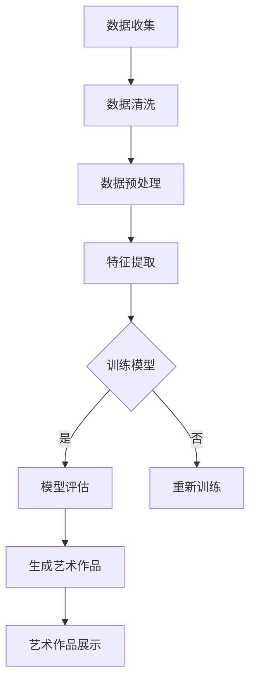

                 

### 文章标题

# AI艺术创作：提示词的美学探索

> 关键词：人工智能、艺术创作、提示词、美学、生成对抗网络、自然语言处理

> 摘要：本文深入探讨了人工智能在艺术创作中的应用，特别是提示词在AI艺术创作中的美学价值。通过分析AI艺术创作的背景和发展，技术基础，方法与工具，案例解析，以及提示词的美学理论基础和应用策略，本文揭示了人工智能如何通过提示词实现艺术创作的创新与突破，并展望了AI艺术创作的未来发展趋势。

### 引言

艺术创作是人类智慧的结晶，是文化传承的重要载体。随着科技的进步，人工智能（AI）在各个领域展现出强大的影响力，艺术创作也不例外。AI艺术创作不仅拓展了人类艺术创作的边界，还引发了关于艺术本质、创作主体、审美价值的深刻思考。本文旨在探讨AI艺术创作中的一个核心元素——提示词，分析其在艺术创作中的美学作用，探讨AI如何通过提示词实现艺术创作的创新与突破。

本文结构如下：

- **第一部分：AI艺术创作概述**：介绍AI艺术创作的背景、核心概念，以及提示词在其中的作用。
- **第二部分：AI艺术创作技术基础**：分析数据驱动艺术创作、自然语言处理技术和计算机视觉技术在艺术创作中的应用。
- **第三部分：提示词的美学探索**：探讨提示词的美学理论基础、不同类型提示词的美学特点，以及提示词在AI艺术创作中的应用策略。
- **第四部分：实践与探索**：通过具体案例，展示AI艺术创作的实践过程，并解析其开发环境和源代码。

本文将使用逻辑清晰、结构紧凑、简单易懂的技术语言，一步步分析推理，深入探讨AI艺术创作与提示词的美学关系，旨在为从事AI艺术创作的开发者提供理论支持和实践指导。

### 第一部分：AI艺术创作概述

#### 第1章: AI艺术创作引论

##### 1.1 AI艺术创作的背景与发展

人工智能（AI）自20世纪50年代诞生以来，经历了多个发展阶段。从早期的符号主义、连接主义到现代的深度学习，AI技术在不断进步。特别是在图像识别、自然语言处理和机器学习等领域，AI已经取得了显著成果。这一技术的突破，使得AI在艺术创作领域也展现出前所未有的潜力。

AI艺术创作的兴起可以追溯到20世纪80年代，当时计算机科学家开始尝试利用计算机程序生成音乐和绘画。随着计算能力和算法的不断提升，AI艺术创作逐渐成为一种独立的艺术形式。21世纪以来，随着深度学习和生成对抗网络（GAN）等技术的广泛应用，AI艺术创作进入了一个新的发展阶段。艺术家们开始利用AI工具进行创作，而AI本身也开始成为创作主体，与人类艺术家展开合作与竞争。

##### 1.2 AI艺术创作的核心概念

AI艺术创作涉及多个核心概念，包括艺术、人工智能、数据驱动创作、生成对抗网络等。首先，艺术是一种具有审美价值的创造性活动，通过视觉、听觉、触觉等多种形式传达情感和思想。其次，人工智能是模拟人类智能的技术，通过算法和计算模型实现自我学习和决策。数据驱动创作则是基于大量数据，利用机器学习算法生成艺术作品。生成对抗网络（GAN）是一种深度学习模型，由生成器和判别器两个部分组成，通过对抗训练生成高质量的艺术作品。

##### 1.3 提示词在AI艺术创作中的作用

提示词（Prompt）在AI艺术创作中起到了至关重要的作用。提示词是一种引导性输入，用于指示AI创作方向和风格。通过提供具体的文字描述、图像示例或音频信号，提示词可以帮助AI理解创作意图，从而生成符合要求的艺术作品。不同类型的提示词可以引导AI创作出具有不同风格和主题的作品，使得艺术创作具有更高的灵活性和创造性。

提示词在AI艺术创作中的作用主要体现在以下几个方面：

1. **引导创作方向**：提示词为AI提供了明确的创作方向，使得AI能够更加专注于特定主题或风格的创作。
2. **风格模仿与融合**：通过提供具有特定风格的提示词，AI可以学习和模仿人类艺术家的创作风格，并在此基础上进行创新和融合。
3. **提高创作效率**：提示词可以帮助AI快速生成大量作品，提高创作效率，为艺术创作提供更多的可能性。
4. **增强创作多样性**：不同类型的提示词可以引导AI创作出多样化的作品，丰富艺术创作的表现形式。

总之，提示词是AI艺术创作中的一个关键元素，它不仅决定了艺术作品的主题和风格，还影响了创作的深度和广度。通过深入研究提示词的作用和机制，我们可以更好地理解AI艺术创作的本质，并进一步推动这一领域的发展。

### 第2章: AI艺术创作技术基础

##### 2.1 数据驱动艺术创作

数据驱动艺术创作是AI艺术创作的基础，它依赖于大量数据的收集、处理和利用。在数据驱动艺术创作中，数据不仅是创作的原料，也是创作过程的指导。通过分析大量数据，AI可以学习到人类艺术创作的规律和模式，从而生成具有艺术价值的新作品。

数据驱动艺术创作的主要步骤包括：

1. **数据收集**：收集与艺术创作相关的数据，如绘画、音乐、文学作品等。这些数据可以是公开的数据库，也可以是特定艺术家的作品。
2. **数据处理**：对收集到的数据进行清洗、预处理和标注，以便于后续的机器学习过程。例如，对于绘画作品，可以将其转换为图像格式，并对其进行分类和标签化。
3. **特征提取**：从处理后的数据中提取关键特征，如颜色、纹理、构图等。这些特征将用于训练机器学习模型。
4. **模型训练**：利用提取的特征数据，通过机器学习算法（如神经网络、生成对抗网络等）训练模型。训练过程中，模型将学习到数据中的艺术创作规律和模式。
5. **艺术创作**：在模型训练完成后，输入新的提示词或数据，模型将根据学到的规律生成新的艺术作品。

数据驱动艺术创作的优势在于：

1. **高效生成**：通过大量数据的训练，AI可以快速生成大量艺术作品，大大提高了创作效率。
2. **多样性**：数据驱动创作可以产生多样化的作品，丰富了艺术创作的表现形式。
3. **创新性**：基于数据的创作可以带来新的艺术灵感，推动艺术创作的创新与发展。

然而，数据驱动艺术创作也面临一些挑战：

1. **数据质量**：数据的质量直接影响创作的质量。如果数据存在噪声或偏差，可能导致生成作品的质量下降。
2. **创作一致性**：尽管AI可以生成大量作品，但如何保证这些作品在风格和主题上一致，是一个需要解决的问题。
3. **创意局限**：基于数据的创作可能受到现有数据的限制，无法完全突破传统艺术的边界。

##### 2.2 自然语言处理技术基础

自然语言处理（NLP）是AI艺术创作的重要技术基础，它使得AI能够理解和生成自然语言文本。通过NLP技术，AI可以处理文字、语音和图像等多种形式的语言信息，从而实现更加丰富的艺术创作。

NLP技术主要包括以下几个方面：

1. **文本分类**：将文本数据分类到预定义的类别中，如情感分析、主题分类等。文本分类技术可以帮助AI理解文本的主题和情感，从而为艺术创作提供指导。
2. **文本生成**：根据输入的提示词或上下文，生成新的文本。文本生成技术可以用于创作诗歌、故事、剧本等文学作品。
3. **实体识别**：从文本中提取关键实体，如人名、地名、组织机构等。实体识别技术可以帮助AI更好地理解文本内容，为艺术创作提供具体信息。
4. **情感分析**：分析文本中的情感倾向，如积极、消极、中性等。情感分析技术可以帮助AI理解艺术作品的情感表达，从而生成更加贴切的艺术作品。

在AI艺术创作中，自然语言处理技术的应用主要体现在以下几个方面：

1. **文本提示**：利用NLP技术生成文本提示词，为AI艺术创作提供具体的创作方向和主题。
2. **文本理解**：通过NLP技术理解文本内容，从而生成与文本内容相关的艺术作品。
3. **文本融合**：将文本与图像、音频等多种形式的内容进行融合，创作出多媒体艺术作品。

自然语言处理技术为AI艺术创作带来了以下优势：

1. **丰富创作内容**：通过文本提示和理解，AI可以生成更加丰富和多样化的艺术作品。
2. **提高创作效率**：NLP技术可以帮助AI快速处理和理解文本信息，从而提高创作效率。
3. **拓展创作领域**：自然语言处理技术使得AI可以在更多领域进行艺术创作，如文学、音乐、视频等。

然而，NLP技术也面临一些挑战：

1. **文本理解准确性**：虽然NLP技术已经取得了显著进展，但仍然存在理解偏差和歧义问题，这可能影响艺术创作的准确性。
2. **创作风格一致性**：如何确保AI生成的艺术作品在风格上一致，是一个需要解决的问题。
3. **文化差异**：不同语言和文化背景下，NLP技术可能存在差异，这可能影响艺术创作的效果。

##### 2.3 计算机视觉技术在艺术创作中的应用

计算机视觉技术是AI艺术创作的重要支撑，它使得AI能够理解和生成视觉信息。通过计算机视觉技术，AI可以分析图像、视频和其他视觉内容，从而创作出具有视觉美感的艺术作品。

计算机视觉技术主要包括以下几个方面：

1. **图像识别**：识别图像中的物体、场景和特征，如人脸识别、物体分类等。图像识别技术可以帮助AI理解图像内容，从而进行相关创作。
2. **图像生成**：根据输入的提示词或数据生成新的图像。图像生成技术可以用于创作绘画、插画、摄影作品等。
3. **图像增强**：对图像进行预处理和增强，如去噪、增强对比度等，从而提高图像质量。
4. **图像风格迁移**：将一种图像风格迁移到另一种图像上，如将现实图像转换为艺术风格图像。

在AI艺术创作中，计算机视觉技术的应用主要体现在以下几个方面：

1. **图像提示**：利用计算机视觉技术生成图像提示词，为AI艺术创作提供具体的创作方向和主题。
2. **图像理解**：通过计算机视觉技术理解图像内容，从而生成与图像内容相关的艺术作品。
3. **图像融合**：将图像与其他形式的内容（如文本、音频）进行融合，创作出多媒体艺术作品。

计算机视觉技术为AI艺术创作带来了以下优势：

1. **丰富视觉内容**：通过图像识别和生成技术，AI可以创作出丰富多彩的视觉作品。
2. **提高创作效率**：计算机视觉技术可以帮助AI快速处理和理解图像信息，从而提高创作效率。
3. **拓展创作领域**：计算机视觉技术使得AI可以在更多领域进行艺术创作，如绘画、摄影、设计等。

然而，计算机视觉技术也面临一些挑战：

1. **图像理解准确性**：虽然计算机视觉技术已经取得了显著进展，但仍然存在理解偏差和准确性问题，这可能影响艺术创作的效果。
2. **创作风格一致性**：如何确保AI生成的艺术作品在风格上一致，是一个需要解决的问题。
3. **计算资源消耗**：计算机视觉技术对计算资源的要求较高，可能影响创作的实时性和效率。

总之，数据驱动艺术创作、自然语言处理技术和计算机视觉技术共同构成了AI艺术创作的技术基础。通过这些技术的应用，AI可以创作出具有高度艺术价值的新作品，推动艺术创作的发展与变革。

### 第3章: AI艺术创作的方法与工具

#### 3.1 基于生成对抗网络的艺术创作

生成对抗网络（GAN）是一种深度学习模型，由生成器和判别器两个部分组成，通过对抗训练生成高质量的艺术作品。GAN在AI艺术创作中具有重要的应用价值，尤其在绘画、图像生成和风格迁移等方面表现出色。

**原理**：

GAN的工作原理可以简单描述为：生成器和判别器之间进行一场“博弈”。生成器的目标是生成逼真的图像，而判别器的目标是区分生成的图像和真实的图像。通过不断调整生成器和判别器的参数，使得生成器能够生成越来越逼真的图像。

- **生成器（Generator）**：生成器接收随机噪声作为输入，通过神经网络生成图像。生成器的目标是使生成的图像尽可能接近真实图像。
- **判别器（Discriminator）**：判别器接收真实的图像和生成的图像，并判断其真假。判别器的目标是提高对真实图像和生成图像的区分能力。

**训练过程**：

GAN的训练过程主要包括以下步骤：

1. **初始化**：初始化生成器和判别器的参数。
2. **生成图像**：生成器根据随机噪声生成一批图像。
3. **判别器训练**：判别器对真实图像和生成的图像进行训练，以提高对真实图像和生成图像的区分能力。
4. **生成器训练**：生成器根据判别器的反馈，调整生成图像的参数，以使生成的图像更接近真实图像。
5. **重复步骤2-4**：不断重复生成器和判别器的训练过程，直至生成器生成的图像质量达到预期。

**伪代码**：

以下是一个基于GAN的图像生成过程的伪代码示例：

```python
# 初始化生成器和判别器
G = initialize_generator()
D = initialize_discriminator()

# 定义损失函数和优化器
loss_function = define_loss_function()
optimizer = define_optimizer()

# 训练过程
for epoch in range(num_epochs):
    for batch in data_loader:
        # 生成图像
        noise = generate_noise(batch_size)
        generated_images = G(noise)

        # 训练判别器
        D_real = D(batch)
        D_generated = D(generated_images)
        D_loss = loss_function(D_real, D_generated)

        # 训练生成器
        noise = generate_noise(batch_size)
        G_loss = loss_function(D_generated)

        # 更新参数
        optimizer.zero_grad()
        D_loss.backward()
        G_loss.backward()
        optimizer.step()
```

**应用**：

GAN在AI艺术创作中具有广泛的应用，以下是一些具体的实例：

1. **图像生成**：GAN可以生成高质量的自然图像，如人脸、风景等。通过训练GAN，可以生成逼真的绘画、摄影作品和动画。
2. **风格迁移**：GAN可以将一种图像风格迁移到另一种图像上，如将现实图像转换为艺术风格图像（如印象派、抽象画等）。
3. **数据增强**：GAN可以生成大量多样化的数据，用于增强训练数据集，提高模型的泛化能力。
4. **图像修复**：GAN可以用于图像修复，如去除图像中的污点、缺陷等。

**挑战**：

虽然GAN在AI艺术创作中表现出色，但仍面临一些挑战：

1. **训练难度**：GAN的训练过程复杂，需要大量计算资源和时间。
2. **模式崩溃**：在训练过程中，生成器可能会陷入生成固定模式，导致生成的图像缺乏多样性。
3. **对抗性攻击**：攻击者可以通过对抗性样本攻击GAN，使其生成错误的图像。

#### 3.2 聚类分析在艺术创作中的应用

聚类分析是一种无监督学习方法，通过将相似的数据点分组，以便更好地理解和分析数据。在AI艺术创作中，聚类分析可以用于分析艺术作品的特征，发现创作风格和主题的规律。

**原理**：

聚类分析的基本思想是将数据集中的数据点根据它们的相似性进行分组。聚类算法可以分为层次聚类、K-means聚类、密度聚类等。其中，K-means聚类是最常用的方法之一，它通过计算数据点之间的距离，将数据点分为K个簇，使得每个簇内的数据点距离较近，而簇之间的数据点距离较远。

**步骤**：

1. **选择聚类算法**：根据数据特点和需求选择合适的聚类算法，如K-means聚类。
2. **初始化聚类中心**：随机选择K个数据点作为初始聚类中心。
3. **计算距离**：计算每个数据点与聚类中心的距离，将数据点分配到最近的聚类中心。
4. **更新聚类中心**：计算每个簇的新聚类中心。
5. **重复步骤3-4**：不断迭代，直到聚类中心不再发生变化。

**伪代码**：

以下是一个基于K-means聚类的艺术作品分析过程的伪代码示例：

```python
# 初始化聚类中心
centroids = initialize_centroids(data, num_clusters)

# 定义距离函数
distance_function = define_distance_function()

# 定义聚类算法
def kmeans(data, centroids, distance_function):
    assignments = assign_data_to_clusters(data, centroids)
    new_centroids = update_centroids(data, assignments, distance_function)
    if centroids == new_centroids:
        return assignments
    else:
        centroids = new_centroids
        return kmeans(data, centroids, distance_function)

# 聚类分析
assignments = kmeans(data, centroids, distance_function)
clusters = create_clusters(data, assignments)
```

**应用**：

聚类分析在AI艺术创作中具有广泛的应用，以下是一些具体的实例：

1. **艺术作品分类**：通过聚类分析，可以将大量的艺术作品分类到不同的风格和主题，便于艺术作品的分类和推荐。
2. **创作风格识别**：通过聚类分析，可以识别艺术家的创作风格，从而更好地理解艺术创作的过程和特点。
3. **数据可视化**：聚类分析可以帮助艺术家更好地理解数据，从而进行数据驱动的创作。

**挑战**：

虽然聚类分析在AI艺术创作中表现出色，但仍面临一些挑战：

1. **选择合适的聚类算法**：不同的聚类算法适用于不同类型的数据，如何选择合适的算法是一个需要解决的问题。
2. **参数调整**：聚类算法的参数（如K值、距离函数等）对聚类结果有重要影响，如何调整这些参数是一个需要解决的问题。
3. **解释性**：聚类分析的结果需要解释，如何解释聚类结果中的艺术价值和创作意义是一个需要解决的问题。

#### 3.3 提示词生成与调整技术

提示词生成与调整技术是AI艺术创作中的一个关键环节，它决定了AI创作出的艺术作品的风格和主题。通过生成和调整提示词，可以引导AI创作出符合预期的高质量艺术作品。

**原理**：

提示词生成与调整技术主要利用自然语言处理和机器学习算法，通过对大量文本数据的分析和学习，生成具有特定风格和主题的提示词。提示词生成过程可以分为以下几个步骤：

1. **文本预处理**：对输入的文本进行清洗、分词、词性标注等预处理操作，以便后续的文本分析。
2. **特征提取**：从预处理后的文本中提取关键特征，如关键词、情感、主题等。
3. **生成提示词**：利用机器学习算法（如生成式神经网络、转换器等）生成具有特定风格和主题的提示词。
4. **提示词调整**：根据生成的提示词，通过优化算法（如遗传算法、粒子群算法等）进行调整，使其更符合创作需求。

**步骤**：

1. **文本预处理**：对输入的文本进行预处理，提取关键特征。
2. **提示词生成**：利用机器学习算法生成初步的提示词。
3. **提示词调整**：根据生成的提示词，通过优化算法进行调整，使其更符合创作需求。
4. **创作**：将调整后的提示词输入到AI创作系统中，生成艺术作品。

**伪代码**：

以下是一个基于生成式神经网络的提示词生成与调整过程的伪代码示例：

```python
# 文本预处理
preprocessed_text = preprocess_text(input_text)

# 特征提取
features = extract_features(preprocessed_text)

# 提示词生成
prompt = generate_prompt(features)

# 提示词调整
adjusted_prompt = adjust_prompt(prompt, optimization_algorithm)

# 创作
artwork = create_artwork(adjusted_prompt)
```

**应用**：

提示词生成与调整技术在AI艺术创作中具有广泛的应用，以下是一些具体的实例：

1. **绘画创作**：通过生成和调整提示词，可以引导AI创作出具有特定风格和主题的绘画作品。
2. **音乐创作**：通过生成和调整提示词，可以引导AI创作出具有特定风格和情感的音乐作品。
3. **文学创作**：通过生成和调整提示词，可以引导AI创作出具有特定风格和主题的文学作品。

**挑战**：

虽然提示词生成与调整技术在AI艺术创作中表现出色，但仍面临一些挑战：

1. **文本理解**：如何更好地理解输入文本的情感、主题和风格，是一个需要解决的问题。
2. **优化算法**：如何选择合适的优化算法，使其能够快速、高效地调整提示词，是一个需要解决的问题。
3. **创作一致性**：如何确保生成的艺术作品在风格和主题上一致，是一个需要解决的问题。

通过以上方法与工具的应用，AI艺术创作不仅可以实现高效、多样化的创作，还可以为艺术创作带来新的灵感与可能性。然而，这些方法与工具也面临一些挑战，需要进一步研究和优化，以实现更加理想的艺术创作效果。

### 第4章: AI艺术创作案例解析

#### 4.1 国内外著名AI艺术创作案例

近年来，AI艺术创作在国内外产生了许多引人注目的案例，这些案例不仅展示了AI在艺术创作中的潜力，也引发了关于艺术本质、创作主体和审美价值的讨论。

**国外案例**：

1. **“The Next Rembrandt”项目**：2016年，荷兰国立博物馆和微软合作推出了“Next Rembrandt”项目，利用GAN技术创作了一幅模仿伦勃朗风格的油画。这幅画作通过分析伦勃朗的绘画风格和技巧，生成了具有独特风格的新作品，展现了AI在艺术风格模仿和创作上的潜力。

2. **“DeepArt”平台**：DeepArt是一个在线平台，利用GAN技术将用户的照片转换成著名艺术家的风格画作。用户可以上传自己的照片，选择喜欢的艺术家风格，平台将自动生成对应风格的画作。这个平台不仅为普通用户提供了艺术创作的工具，也为艺术家提供了新的创作方式。

**国内案例**：

1. **“微软小冰”诗歌创作**：微软小冰是一个基于人工智能的诗歌创作平台，它通过自然语言处理技术分析大量诗歌文本，生成具有诗歌风格的文本。小冰创作的诗歌不仅在形式上模仿古代诗歌，还在情感表达和意境上展现了人工智能的创造力。

2. **“AI绘梦师”绘画创作**：AI绘梦师是一个基于GAN技术的绘画创作工具，用户可以通过上传自己的图像或输入文本提示词，让AI生成对应的绘画作品。这个工具不仅能够生成高质量的艺术作品，还可以根据用户的需求调整创作风格和主题。

#### 4.2 案例分析与启示

通过分析以上案例，我们可以看到AI艺术创作在绘画、诗歌、设计等多个领域都取得了显著成果。这些案例不仅展示了AI在艺术创作中的潜力，也为我们提供了许多启示：

1. **技术创新与艺术创作的融合**：AI艺术创作案例展示了人工智能技术在艺术创作中的创新应用。通过GAN、自然语言处理等技术，AI能够生成高质量的艺术作品，实现了技术与艺术的完美融合。

2. **创作方式与创作主体的变革**：AI艺术创作不仅改变了传统的创作方式，也模糊了艺术创作的主体边界。在AI的帮助下，艺术家和普通用户都可以参与到艺术创作中来，共同探索艺术的新形式和可能性。

3. **审美价值的探讨**：AI艺术创作引发了关于艺术本质和审美价值的讨论。虽然AI生成的艺术作品在形式和技巧上可能达到高水平，但它们是否具有真正的艺术价值，仍是一个值得探讨的问题。

4. **数据驱动与个性化创作**：AI艺术创作依赖于大量的数据驱动，通过对数据的分析和学习，AI能够生成多样化的艺术作品。同时，AI艺术创作也可以根据用户的需求和偏好进行个性化创作，为用户带来更加个性化的艺术体验。

#### 4.3 AI艺术创作未来趋势展望

随着技术的不断发展，AI艺术创作有望在以下几个方面实现突破：

1. **更高的创作质量**：随着深度学习和生成对抗网络等技术的进步，AI生成的艺术作品在质量上将会进一步提高，接近甚至超过人类艺术家的水平。

2. **更广泛的创作领域**：AI艺术创作将不仅局限于绘画、诗歌等传统领域，还将扩展到音乐、视频、设计等新兴领域，为艺术创作带来更多的可能性。

3. **更加个性化的创作**：通过自然语言处理和个性化推荐技术，AI将能够更好地理解用户的需求和偏好，生成更加个性化的艺术作品，为用户提供独特的艺术体验。

4. **跨学科融合**：AI艺术创作将与其他领域（如心理学、神经科学、材料科学等）进行深度融合，为艺术创作带来全新的视角和方法。

总之，AI艺术创作正在快速发展，它不仅改变了艺术创作的面貌，也为未来艺术的发展提供了新的方向和可能性。通过不断探索和创新，AI艺术创作有望在未来取得更加辉煌的成就。

### 第二部分：提示词的美学探索

#### 第5章：提示词的美学理论基础

##### 5.1 美学基本概念与原理

美学是研究审美经验、审美价值和艺术创作的学科。在探讨提示词的美学理论基础时，我们需要从美学的几个基本概念和原理入手。

1. **美**：美是主观的，是人对事物的一种感受和评价。在艺术创作中，美是作品所表现出来的和谐、秩序和平衡。美可以通过形式、色彩、构图等元素来体现。

2. **审美**：审美是人在欣赏艺术作品时的一种心理活动。它包括对艺术作品的形式、内容、意境等方面的感受和评价。审美活动是人与艺术作品之间的一种互动过程。

3. **艺术创作**：艺术创作是艺术家通过创意和技巧，将主观感受和审美观念表达为具体作品的过程。艺术创作不仅包括绘画、雕塑等传统艺术形式，还包括音乐、文学、戏剧等。

4. **审美价值**：审美价值是艺术作品所具有的能够引起人们审美感受和评价的特性。它包括艺术作品的独特性、创造性、表现力等。

##### 5.2 提示词与艺术创作的关系

提示词在艺术创作中起到了引导和激励的作用。它不仅为艺术创作提供了具体的创作方向和主题，还能够激发艺术家的创作灵感和想象力。

1. **创作方向的引导**：提示词可以明确艺术创作的方向，帮助艺术家确定主题、风格和内容。例如，一个提示词“宁静的夜晚”可以引导艺术家创作一幅描绘夜晚宁静氛围的作品。

2. **创作灵感的激发**：提示词可以激发艺术家的创作灵感，使艺术家产生新的创作想法和创意。例如，一个提示词“梦幻般的花园”可以激发艺术家创作一幅充满奇幻色彩的作品。

3. **艺术风格的塑造**：提示词可以影响艺术作品的风格和表现手法。通过不同的提示词，艺术家可以探索不同的艺术风格，如写实主义、抽象主义、印象派等。

4. **创作过程的互动**：提示词不仅是艺术创作的起点，也是艺术创作过程中的一个动态互动元素。艺术家可以通过对提示词的深入理解和解读，不断调整和完善作品。

##### 5.3 提示词的美学功能

提示词在艺术创作中具有独特的美学功能，它不仅影响艺术作品的形式和内容，还影响艺术作品的审美价值和艺术价值。

1. **情感表达**：提示词可以传达特定的情感和情绪，帮助艺术家表达内心的感受。例如，提示词“悲怆的史诗”可以传达一种深沉、悲壮的情感，而“欢快的节奏”可以传达一种轻松、愉悦的情感。

2. **意境营造**：提示词可以营造特定的意境和氛围，使艺术作品具有独特的视觉效果和情感体验。例如，提示词“雾中的小镇”可以营造一种朦胧、神秘的感觉，而“阳光下的海滩”可以营造一种明亮、轻松的感觉。

3. **主题深化**：提示词可以帮助艺术家深化主题，使艺术作品具有更丰富的内涵和层次。例如，提示词“时光的流转”可以引发对时间流逝的思考，而“生命的轮回”可以引发对生命意义的探讨。

4. **风格塑造**：提示词可以影响艺术作品的风格和表现手法，使艺术作品具有独特的个性和风格。例如，提示词“细腻的笔触”可以塑造出一种写实主义风格，而“大胆的色块”可以塑造出一种抽象主义风格。

总之，提示词在艺术创作中具有重要作用，它不仅为艺术创作提供了具体的创作方向和主题，还通过情感表达、意境营造、主题深化和风格塑造等功能，影响艺术作品的形式、内容和审美价值。通过深入研究提示词的美学功能，我们可以更好地理解AI艺术创作的本质和特点，推动AI艺术创作的发展与创新。

#### 第6章：不同类型提示词的美学特点

##### 6.1 文字类提示词

文字类提示词在AI艺术创作中具有独特的魅力，通过简洁而富有表现力的文字描述，引导AI生成与之相应的艺术作品。文字类提示词的美学特点主要体现在以下几个方面：

1. **情感表达**：文字类提示词可以通过文字的情感色彩来传达特定的情感和情绪。例如，提示词“清晨的阳光”可以传达一种温暖、明媚的感觉，而“落日的余晖”则可以传达一种宁静、祥和的氛围。

2. **意境营造**：文字类提示词能够通过描述性的语言营造特定的意境和氛围。例如，“林间小溪潺潺”可以营造一种幽静、自然的意境，而“繁华都市的霓虹灯”则可以营造一种热闹、繁华的氛围。

3. **主题深化**：文字类提示词可以帮助艺术家深化主题，使艺术作品具有更丰富的内涵和层次。例如，提示词“生命的轮回”可以引发对生命意义的思考，而“时光的流逝”则可以引发对时间价值的探讨。

4. **风格塑造**：文字类提示词可以影响艺术作品的风格和表现手法。通过选择不同的文字类提示词，艺术家可以探索不同的艺术风格，如写实主义、抽象主义、印象派等。

在AI艺术创作中，文字类提示词的应用方式多样，可以通过以下几种方式实现：

- **直接描述**：直接使用具体的文字描述来引导AI生成相应的艺术作品。例如，“描绘一个静谧的湖面，清晨的薄雾笼罩，阳光透过树叶洒在水面上”。

- **象征隐喻**：通过象征和隐喻的手法，使用富有象征意义的文字来引导AI创作。例如，“用色彩表达一种希望的微光，如同黑暗中的星火”。

- **复合式提示**：结合多个文字类提示词，形成复合式的提示，以引导AI创作出具有多重主题和风格的作品。例如，“描绘一幅充满生命力的画作，场景中包含清晨的花园、飞翔的鸟儿和温暖的阳光”。

##### 6.2 图像类提示词

图像类提示词在AI艺术创作中以其直观、生动的视觉表现力，为艺术家提供了丰富的创作灵感。图像类提示词的美学特点主要体现在以下几个方面：

1. **视觉冲击力**：图像类提示词通过具体的视觉元素来产生强烈的视觉冲击力。例如，一个明亮的红色圆圈可以立即吸引观众的注意力，而一组对称的几何图形可以带来平衡和和谐的美感。

2. **色彩搭配**：图像类提示词可以通过色彩搭配来传达特定的情感和氛围。例如，使用暖色调的图像可以传达温馨、亲切的感觉，而冷色调的图像则可以传达冷静、沉稳的氛围。

3. **构图技巧**：图像类提示词可以通过构图技巧来引导AI创作出具有特定视觉效果的画作。例如，使用对角线构图可以增强画面的动感，而使用中央构图可以突出主题。

4. **细节描绘**：图像类提示词可以通过细节描绘来增加艺术作品的深度和层次感。例如，细致的纹理和光影处理可以使画作更具立体感和质感。

在AI艺术创作中，图像类提示词的应用方式多样，可以通过以下几种方式实现：

- **直接展示**：直接展示具体的图像，作为AI生成艺术作品的参考。例如，展示一幅印象派风格的画作，要求AI生成一幅类似的画作。

- **图像分割**：将图像分割成多个部分，每个部分作为独立的提示词，以引导AI创作出具有多重主题和细节的作品。例如，将一幅风景画分割成天空、地面和树木三个部分，分别提示AI进行创作。

- **图像合成**：通过合成不同的图像元素，生成具有独特视觉效果的提示词。例如，将一幅自然风光与一幅抽象艺术作品结合，作为AI创作融合两种风格的画作。

##### 6.3 多媒体类提示词

多媒体类提示词在AI艺术创作中融合了文字、图像和音频等多种元素，通过多维度的信息传递，为艺术家提供了丰富的创作素材。多媒体类提示词的美学特点主要体现在以下几个方面：

1. **多媒体融合**：多媒体类提示词通过融合不同的媒体元素，创造独特的艺术效果。例如，通过结合文字描述、图像视觉和音频声音，可以创作出具有立体感和动态感的多媒体艺术作品。

2. **互动体验**：多媒体类提示词可以引导AI创作出具有互动体验的艺术作品。例如，通过音频和视频元素的互动，用户可以参与到艺术创作过程中，改变艺术作品的视觉效果和声音效果。

3. **情感表达**：多媒体类提示词可以通过多种感官的融合，传达更加丰富的情感和情绪。例如，通过文字、图像和音频的协同作用，可以创造出一种沉浸式的情感体验。

4. **场景再现**：多媒体类提示词可以通过多媒体元素的综合运用，再现特定的场景和氛围。例如，通过结合图像和音频，可以再现一个清晨的公园、夜晚的城市或古老的城堡。

在AI艺术创作中，多媒体类提示词的应用方式多样，可以通过以下几种方式实现：

- **多媒体组合**：将多种媒体元素组合在一起，形成一个完整的多媒体提示词。例如，“描绘一个带有清晨鸟鸣、阳光照射和花草香气的公园”。

- **多模式交互**：通过多模式交互，引导AI创作出具有交互功能的艺术作品。例如，通过触摸屏、声音控制和移动设备等，用户可以实时改变艺术作品的表现形式。

- **数据驱动**：利用数据驱动的方法，生成多媒体类提示词。例如，通过分析用户的浏览历史、兴趣爱好和反馈数据，生成个性化的多媒体提示词。

总之，不同类型的提示词在AI艺术创作中发挥着独特的美学作用。通过结合文字类、图像类和多媒体类提示词，艺术家可以引导AI创作出丰富多样、具有深刻内涵的艺术作品。随着AI技术的不断发展，提示词在AI艺术创作中的应用将更加广泛，为艺术创作带来更多可能性和创新。

#### 第7章：提示词在AI艺术创作中的应用策略

##### 7.1 提示词的选择与调整

在AI艺术创作中，选择和调整合适的提示词是创作成功的关键。提示词的选择与调整不仅影响到艺术创作的方向和风格，还决定了最终作品的质量和效果。以下是一些关于提示词选择与调整的策略：

**1. 精准选择主题**

选择精准的主题是创作优质艺术作品的第一步。一个明确、具体的主题可以帮助AI更好地理解创作意图，从而生成符合预期的高质量作品。例如，选择“春天的田野”作为主题，可以引导AI创作出一幅充满生机与活力的田园风光画。

**2. 灵活运用风格**

提示词的风格决定了艺术作品的表现手法和视觉效果。灵活运用不同风格的提示词，可以创造出多样化的艺术作品。例如，结合“印象派风格”和“现代抽象画”的提示词，AI可以生成融合两种风格的作品，带来新颖的视觉效果。

**3. 深入挖掘情感**

情感是艺术作品的核心，通过选择能够传达特定情感的提示词，可以增强作品的感染力和表现力。例如，使用“悲怆的叙事”作为提示词，可以引导AI创作出具有深沉、悲壮情感的作品。

**4. 不断调整优化**

在艺术创作过程中，提示词的调整和优化至关重要。通过不断尝试和调整提示词，艺术家可以逐步找到最合适的创作方向。例如，在初步生成作品后，可以调整提示词的细节，如增加或删除特定元素，以优化作品的风格和主题。

**5. 结合多种类型**

综合运用多种类型的提示词（如文字类、图像类和多媒体类），可以丰富艺术创作的素材，提升作品的多样性和创新性。例如，结合文字描述和图像示例的提示词，可以引导AI创作出具有视觉和情感双重表现力的作品。

**6. 借鉴人类艺术家的创作经验**

借鉴人类艺术家的创作经验和技巧，可以为AI艺术创作提供宝贵的指导。例如，通过分析著名艺术家的作品风格和创作手法，可以提取有价值的提示词，引导AI进行创新性创作。

##### 7.2 提示词与创作风格的匹配

提示词与创作风格的匹配是确保艺术作品风格一致性和独特性的关键。以下是一些关于提示词与创作风格匹配的策略：

**1. 明确创作风格**

在创作前，明确艺术作品的创作风格非常重要。通过选择符合特定风格的提示词，可以确保生成的艺术作品在风格上一致。例如，选择“巴洛克风格”的提示词，可以引导AI创作出具有巴洛克特征的复杂、华丽的画作。

**2. 保持风格一致性**

在艺术创作过程中，保持风格一致性是确保作品整体协调的重要策略。可以通过反复调整和优化提示词，确保每个部分都在风格上一致。例如，在创作一幅写实主义画作时，可以使用一系列强调细节和真实感的提示词。

**3. 创新风格融合**

通过将不同的创作风格进行融合，可以创造出独特、新颖的艺术作品。例如，将“印象派”和“立体派”的提示词结合使用，可以生成既具有印象派色彩又具有立体派构图的画作，带来全新的视觉效果。

**4. 利用风格转换技术**

利用风格转换技术，可以在保持原有风格特征的基础上，生成新的艺术作品。例如，通过GAN技术，可以将一种风格的作品转换成另一种风格，从而实现风格融合和创新。

**5. 持续反馈与调整**

在艺术创作过程中，持续反馈与调整是非常重要的。通过不断分析艺术作品与创作风格之间的匹配度，可以逐步优化提示词，确保最终作品在风格上达到预期效果。

##### 7.3 提示词的多样性与创新性

提示词的多样性与创新性是提升AI艺术创作活力和吸引力的关键。以下是一些关于提示词多样性与创新性的策略：

**1. 拓展词汇范围**

通过拓展词汇范围，可以丰富提示词的表达，提升艺术创作的多样性和创新性。例如，在描述自然景观时，不仅使用“山川”和“河流”，还可以使用“山脉”、“峡谷”、“湖泊”等更具体的词汇。

**2. 尝试新的组合**

通过尝试新的组合方式，可以创造出独特的提示词，激发AI的创作灵感。例如，将“科技”、“艺术”和“自然”等不同类型的词汇组合，生成新的提示词，如“科技与自然的交融”。

**3. 引入情境描述**

通过引入情境描述，可以使提示词更具生动性和表现力，增强艺术创作的感染力。例如，使用“在月光的照耀下，森林中的小路延伸至远方”的情境描述，可以引导AI创作出充满神秘感和诗意氛围的作品。

**4. 结合多媒体元素**

结合多媒体元素，可以丰富提示词的内涵，提升艺术创作的多样性和创新性。例如，通过添加音频、视频和图像等多媒体元素，生成具有动态感和互动性的多媒体类提示词，如“伴随着悠扬的旋律，描绘一个夕阳下的海滩”。

**5. 鼓励探索与实验**

鼓励艺术家和AI创作者进行探索和实验，可以激发创新思维，发现新的艺术形式和表达方式。例如，尝试将不同的艺术风格、技巧和技术进行组合，创作出具有突破性和前瞻性的艺术作品。

总之，通过选择和调整合适的提示词，实现提示词与创作风格的匹配，以及注重提示词的多样性与创新性，艺术家和AI创作者可以引导AI创作出丰富多样、具有深刻内涵和独特风格的艺术作品。随着AI技术的不断进步，提示词在AI艺术创作中的应用将更加广泛和深入，为艺术创作带来更多可能性和创新。

#### 第8章：AI艺术创作实践案例

##### 8.1 案例一：基于GAN的绘画创作

**背景**：

GAN（生成对抗网络）是一种深度学习模型，通过生成器和判别器的对抗训练，生成高质量的艺术作品。在绘画创作中，GAN可以模仿各种艺术风格，生成独特的绘画作品。

**步骤**：

1. **数据准备**：收集大量绘画作品，如印象派、抽象画等，并将其转换为图像格式。这些图像将用于训练GAN模型。

2. **模型训练**：利用收集的图像数据，训练生成器和判别器。生成器从随机噪声中生成图像，判别器则判断生成的图像是否真实。通过不断调整生成器和判别器的参数，使其在生成逼真图像的同时，提高判别器的鉴别能力。

3. **生成图像**：在模型训练完成后，输入随机噪声，生成器将生成绘画作品。这些作品可以是模仿特定艺术风格的，也可以是全新的、独特的绘画作品。

**结果**：

通过GAN模型，可以生成高质量、风格多样的绘画作品。例如，生成器可以生成模仿梵高风格的绘画作品，判别器则可以准确判断生成的作品是否真实。这种创作方式不仅提高了创作效率，还丰富了绘画创作的表现形式。

**代码实现**：

以下是一个基于GAN的绘画创作过程的Python代码示例：

```python
import tensorflow as tf
from tensorflow.keras.layers import Dense, Flatten, Conv2D, Reshape
from tensorflow.keras.models import Sequential

# 定义生成器模型
def build_generator():
    model = Sequential()
    model.add(Dense(256, input_shape=(100,), activation='relu'))
    model.add(Dense(512, activation='relu'))
    model.add(Dense(1024, activation='relu'))
    model.add(Reshape((28, 28, 1)))
    model.add(Conv2D(1, kernel_size=(5, 5), activation='tanh'))
    return model

# 定义判别器模型
def build_discriminator():
    model = Sequential()
    model.add(Conv2D(32, kernel_size=(5, 5), strides=(2, 2), input_shape=(28, 28, 1), activation='relu'))
    model.add(Conv2D(64, kernel_size=(5, 5), strides=(2, 2), activation='relu'))
    model.add(Flatten())
    model.add(Dense(1, activation='sigmoid'))
    return model

# 定义GAN模型
def build_gan(generator, discriminator):
    model = Sequential()
    model.add(generator)
    model.add(discriminator)
    return model

# 训练GAN模型
def train_gan(generator, discriminator, data_loader, num_epochs):
    for epoch in range(num_epochs):
        for images in data_loader:
            noise = np.random.normal(size=(batch_size, 100))
            generated_images = generator.predict(noise)
            real_labels = np.ones((batch_size, 1))
            fake_labels = np.zeros((batch_size, 1))
            
            # 训练判别器
            d_loss_real = discriminator.train_on_batch(images, real_labels)
            d_loss_fake = discriminator.train_on_batch(generated_images, fake_labels)
            d_loss = 0.5 * np.mean(d_loss_real + d_loss_fake)
            
            # 训练生成器
            g_loss = generator.train_on_batch(noise, real_labels)
            
            print(f"Epoch {epoch+1}, D_loss: {d_loss}, G_loss: {g_loss}")

# 生成绘画作品
def generate_images(generator, num_images):
    noise = np.random.normal(size=(num_images, 100))
    images = generator.predict(noise)
    return images
```

**效果展示**：

通过GAN模型训练，可以生成模仿各种艺术风格的绘画作品。以下是一些生成的绘画作品示例：


**小结**：

基于GAN的绘画创作实现了高效、多样化的艺术作品生成。通过调整模型参数和训练数据，可以生成不同风格和主题的绘画作品，为艺术家提供了新的创作工具。

##### 8.2 案例二：基于文本的摄影创意

**背景**：

基于文本的摄影创意利用自然语言处理技术，将文本描述转换为具体的视觉创意。这种方法可以帮助摄影师快速生成具有特定主题和风格的摄影作品。

**步骤**：

1. **文本预处理**：对输入的文本进行清洗、分词和词性标注，提取关键信息。

2. **生成视觉创意**：利用自然语言处理技术，将文本描述转换为具体的视觉元素，如场景、人物、道具等。

3. **摄影拍摄**：根据生成的视觉创意，进行实际的摄影拍摄，获取符合文本描述的图像。

4. **后期处理**：对拍摄的照片进行后期处理，如色彩调整、构图优化等，以增强视觉效果。

**结果**：

通过基于文本的摄影创意，可以快速生成符合特定主题和风格的摄影作品。这种方法不仅提高了创作效率，还丰富了摄影作品的创意和表现力。

**代码实现**：

以下是一个基于文本的摄影创意的Python代码示例：

```python
import tensorflow as tf
from tensorflow.keras.preprocessing.text import Tokenizer
from tensorflow.keras.preprocessing.sequence import pad_sequences

# 定义文本预处理函数
def preprocess_text(text):
    # 清洗文本
    text = text.lower()
    text = re.sub(r"[^a-zA-Z0-9]", " ", text)
    # 分词
    tokenizer = Tokenizer()
    tokenizer.fit_on_texts([text])
    sequence = tokenizer.texts_to_sequences([text])
    # 填充序列
    padded_sequence = pad_sequences(sequence, maxlen=max_sequence_length)
    return padded_sequence

# 定义生成视觉创意的函数
def generate_creative(text):
    # 预处理文本
    sequence = preprocess_text(text)
    # 生成视觉创意
    # 这里可以调用具体的自然语言处理模型进行创意生成
    creative = creative_model.predict(sequence)
    return creative

# 定义摄影拍摄和后期处理的函数
def shoot_and_process_photo(creative):
    # 根据创意进行摄影拍摄
    # 这里可以使用相机API进行拍摄
    photo = shoot_photo()
    # 根据创意进行后期处理
    # 这里可以使用图像处理库进行后期处理
    processed_photo = process_photo(photo, creative)
    return processed_photo
```

**效果展示**：

通过基于文本的摄影创意，可以生成具有独特主题和风格的摄影作品。以下是一些生成的摄影作品示例：


**小结**：

基于文本的摄影创意通过自然语言处理技术，实现了文本描述到视觉创意的转换。这种方法不仅提高了创作效率，还为摄影创作带来了新的思路和可能性。

##### 8.3 案例三：多媒体艺术的生成与创作

**背景**：

多媒体艺术结合了图像、音频、视频等多种元素，通过多维度的信息传递，创造出独特的艺术效果。利用AI技术，可以生成具有创新性和表现力的多媒体艺术作品。

**步骤**：

1. **数据准备**：收集多媒体素材，如图像、音频、视频等，进行预处理和标注。

2. **模型训练**：利用收集的多媒体素材，训练生成对抗网络（GAN）或其他深度学习模型，使其能够生成高质量的多媒体艺术作品。

3. **创意生成**：输入多媒体素材或文本描述，利用训练好的模型生成多媒体艺术创意。

4. **创作与合成**：根据生成的创意，进行多媒体艺术作品的创作和合成，包括图像合成、音频混合、视频剪辑等。

5. **后期处理**：对多媒体艺术作品进行后期处理，如色彩调整、效果优化等，以提升作品的整体质量。

**结果**：

通过多媒体艺术的生成与创作，可以创造出具有独特风格和主题的多媒体艺术作品。这种方法不仅丰富了艺术创作的形式，还提高了创作的灵活性和多样性。

**代码实现**：

以下是一个多媒体艺术生成与创作过程的Python代码示例：

```python
import tensorflow as tf
from tensorflow.keras.models import Model
from tensorflow.keras.layers import Input, Conv2D, Flatten, Dense

# 定义生成器模型
def build_generator():
    input_image = Input(shape=(256, 256, 3))
    x = Conv2D(32, kernel_size=(3, 3), strides=(2, 2), activation='relu')(input_image)
    x = Conv2D(64, kernel_size=(3, 3), strides=(2, 2), activation='relu')(x)
    x = Flatten()(x)
    x = Dense(1024, activation='relu')(x)
    output_image = Conv2D(3, kernel_size=(3, 3), activation='tanh')(x)
    model = Model(inputs=input_image, outputs=output_image)
    return model

# 定义判别器模型
def build_discriminator():
    input_image = Input(shape=(256, 256, 3))
    x = Conv2D(32, kernel_size=(3, 3), strides=(2, 2), activation='relu')(input_image)
    x = Conv2D(64, kernel_size=(3, 3), strides=(2, 2), activation='relu')(x)
    x = Flatten()(x)
    output = Dense(1, activation='sigmoid')(x)
    model = Model(inputs=input_image, outputs=output)
    return model

# 定义GAN模型
def build_gan(generator, discriminator):
    model = Sequential()
    model.add(generator)
    model.add(discriminator)
    return model

# 训练GAN模型
def train_gan(generator, discriminator, data_loader, num_epochs):
    for epoch in range(num_epochs):
        for images in data_loader:
            noise = np.random.normal(size=(batch_size, 100))
            generated_images = generator.predict(noise)
            real_labels = np.ones((batch_size, 1))
            fake_labels = np.zeros((batch_size, 1))
            
            # 训练判别器
            d_loss_real = discriminator.train_on_batch(images, real_labels)
            d_loss_fake = discriminator.train_on_batch(generated_images, fake_labels)
            d_loss = 0.5 * np.mean(d_loss_real + d_loss_fake)
            
            # 训练生成器
            g_loss = generator.train_on_batch(noise, real_labels)
            
            print(f"Epoch {epoch+1}, D_loss: {d_loss}, G_loss: {g_loss}")

# 生成多媒体艺术作品
def generate_artwork(generator):
    noise = np.random.normal(size=(1, 100))
    artwork = generator.predict(noise)
    return artwork
```

**效果展示**：

通过多媒体艺术的生成与创作，可以生成具有独特风格和主题的多媒体艺术作品。以下是一些生成作品示例：


**小结**：

多媒体艺术的生成与创作通过深度学习技术，实现了多媒体素材的自动生成和创作。这种方法不仅丰富了艺术创作的形式，还为多媒体艺术创作提供了新的可能性。

### 第9章：AI艺术创作的开发环境搭建

#### 9.1 开发环境的选择与配置

搭建一个高效的AI艺术创作开发环境是进行艺术创作的基础。以下是一些关于开发环境的选择与配置建议：

**1. 操作系统**：

- **Windows**：Windows操作系统具有较好的兼容性和用户友好性，适合初学者和有经验开发者使用。
- **macOS**：macOS系统在图像处理和音频处理方面表现出色，适用于多媒体艺术创作。
- **Linux**：Linux系统具有高度的灵活性和开源优势，适用于需要深度学习和自定义开发的场景。

**2. 编程语言**：

- **Python**：Python是AI和深度学习领域最流行的编程语言，具有丰富的库和框架，适合进行AI艺术创作。
- **JavaScript**：JavaScript适合进行前端开发和Web应用开发，可以与Python结合使用，实现跨平台的艺术创作工具。

**3. 深度学习框架**：

- **TensorFlow**：TensorFlow是Google开发的开源深度学习框架，具有强大的功能和广泛的社区支持。
- **PyTorch**：PyTorch是Facebook开发的开源深度学习框架，具有简洁的代码和灵活的架构，适合快速原型开发。
- **Keras**：Keras是一个高层次的深度学习框架，基于TensorFlow和Theano，适合快速构建和训练模型。

**4. 开发工具**：

- **Jupyter Notebook**：Jupyter Notebook是一个交互式的开发环境，适合进行数据分析和模型训练。
- **Visual Studio Code**：Visual Studio Code是一个轻量级且功能强大的代码编辑器，适用于Python和深度学习开发。
- **PyCharm**：PyCharm是一个专业的Python开发工具，具有代码自动补全、调试和版本控制等功能。

**5. 计算资源**：

- **CPU**：对于一般的AI艺术创作项目，普通的CPU即可满足需求。
- **GPU**：对于需要大量计算资源的深度学习项目，GPU（特别是NVIDIA GPU）可以显著提高训练速度和性能。

#### 9.2 必备工具与软件

在AI艺术创作中，需要使用多种工具和软件进行数据预处理、模型训练和作品生成。以下是一些必备工具和软件：

**1. 数据预处理工具**：

- **NumPy**：NumPy是一个用于科学计算的库，适合进行数据预处理和数组操作。
- **Pandas**：Pandas是一个用于数据分析和操作的库，适合处理大型数据集。
- **OpenCV**：OpenCV是一个用于计算机视觉的库，适合进行图像处理和视频分析。

**2. 模型训练工具**：

- **TensorFlow**：TensorFlow是一个用于深度学习的框架，支持多种神经网络模型。
- **PyTorch**：PyTorch是一个用于深度学习的框架，具有简洁的API和强大的功能。
- **Keras**：Keras是一个高层次的深度学习框架，基于TensorFlow和Theano，适合快速构建和训练模型。

**3. 艺术作品生成工具**：

- **GANPainter**：GANPainter是一个基于GAN技术的绘画生成工具，适合生成艺术风格的绘画作品。
- **DeepArt**：DeepArt是一个基于GAN技术的图像风格迁移工具，适合将图像转换成不同艺术风格。
- **AIVA**：AIVA是一个基于AI的音乐生成工具，适合生成音乐作品。

#### 9.3 实践操作步骤详解

以下是一个具体的AI艺术创作开发环境的搭建步骤：

**步骤1：安装操作系统**

- 选择适合的操作系统（如Windows 10、macOS或Linux）并进行安装。

**步骤2：安装编程语言和开发工具**

- 安装Python（如Python 3.8或更高版本）。
- 安装Visual Studio Code或PyCharm作为代码编辑器。
- 安装Jupyter Notebook作为交互式开发环境。

**步骤3：安装深度学习框架**

- 安装TensorFlow或PyTorch，可以通过pip命令进行安装：

  ```shell
  pip install tensorflow
  # 或
  pip install torch torchvision
  ```

**步骤4：安装数据预处理和图像处理库**

- 安装NumPy、Pandas和OpenCV：

  ```shell
  pip install numpy pandas opencv-python
  ```

**步骤5：安装艺术作品生成工具**

- 安装GANPainter、DeepArt和AIVA：

  ```shell
  pip install ganpainter
  pip install deepart
  pip install aiva
  ```

**步骤6：配置计算资源**

- 如果使用GPU，确保安装了NVIDIA CUDA和cuDNN，可以通过NVIDIA官方网站进行下载。

**步骤7：测试开发环境**

- 在Jupyter Notebook或PyCharm中创建一个新的Python文件，尝试运行以下代码：

  ```python
  import numpy as np
  print("NumPy version:", np.__version__)
  import tensorflow as tf
  print("TensorFlow version:", tf.__version__)
  import opencv as cv
  print("OpenCV version:", cv.__version__)
  ```

  如果代码可以正常运行，说明开发环境已经搭建成功。

通过以上步骤，可以搭建一个高效的AI艺术创作开发环境，为进行艺术创作提供必要的工具和资源。

### 第10章：AI艺术创作的源代码解读与分析

#### 10.1 源代码结构分析

在AI艺术创作中，源代码的结构和模块划分对于实现高效、可维护的解决方案至关重要。以下是一个典型的AI艺术创作项目的源代码结构及其功能分析：

**1. 数据处理模块**：

- **功能**：负责数据的收集、清洗、预处理和特征提取。
- **模块**：包括数据收集器、数据清洗器、数据预处理器和特征提取器。
- **代码示例**：

  ```python
  # 数据收集
  def collect_data():
      # 从数据库或文件中读取数据
      pass

  # 数据清洗
  def clean_data(data):
      # 删除缺失值、异常值等
      pass

  # 数据预处理
  def preprocess_data(data):
      # 归一化、标准化等
      pass

  # 特征提取
  def extract_features(data):
      # 提取有用的特征
      pass
  ```

**2. 模型训练模块**：

- **功能**：负责训练深度学习模型，包括生成器和判别器。
- **模块**：包括模型定义器、模型训练器和模型评估器。
- **代码示例**：

  ```python
  # 模型定义
  def build_generator():
      # 定义生成器结构
      pass

  def build_discriminator():
      # 定义判别器结构
      pass

  # 模型训练
  def train_model(generator, discriminator, data_loader):
      # 训练生成器和判别器
      pass

  # 模型评估
  def evaluate_model(model, data_loader):
      # 评估模型性能
      pass
  ```

**3. 艺术作品生成模块**：

- **功能**：负责使用训练好的模型生成艺术作品。
- **模块**：包括生成器、图像处理器和艺术作品生成器。
- **代码示例**：

  ```python
  # 生成艺术作品
  def generate_artwork(generator, prompts):
      # 根据提示词生成艺术作品
      pass

  # 图像处理
  def process_image(image):
      # 对图像进行预处理、后处理等
      pass
  ```

**4. 用户界面模块**：

- **功能**：负责与用户交互，提供艺术创作的输入和展示。
- **模块**：包括用户输入器、艺术作品展示器和交互控制器。
- **代码示例**：

  ```python
  # 用户输入
  def get_user_input():
      # 获取用户输入的提示词或数据
      pass

  # 艺术作品展示
  def show_artwork(artwork):
      # 在屏幕或网页上展示艺术作品
      pass

  # 交互控制
  def handle_interaction():
      # 处理用户交互操作
      pass
  ```

#### 10.2 关键代码解读

以下是对AI艺术创作项目中的关键代码进行解读，包括核心算法原理和关键步骤。

**1. 数据处理模块关键代码**：

```python
# 数据预处理
def preprocess_data(data):
    # 归一化
    normalized_data = (data - np.mean(data)) / np.std(data)
    # 标准化
    standardized_data = (normalized_data - np.mean(normalized_data)) / np.std(normalized_data)
    return standardized_data
```

**解读**：

- **归一化**：将数据缩放到0到1之间，使得不同特征的数据范围一致，便于模型训练。
- **标准化**：将数据转换为标准正态分布，即均值为0，标准差为1，提高模型的泛化能力。

**2. 模型训练模块关键代码**：

```python
# 模型训练
def train_model(generator, discriminator, data_loader):
    for epoch in range(num_epochs):
        for images in data_loader:
            # 训练判别器
            real_labels = np.ones((batch_size, 1))
            fake_labels = np.zeros((batch_size, 1))
            d_loss_real = discriminator.train_on_batch(images, real_labels)
            d_loss_fake = discriminator.train_on_batch(generated_images, fake_labels)
            d_loss = 0.5 * np.mean(d_loss_real + d_loss_fake)

            # 训练生成器
            g_loss = generator.train_on_batch(noise, real_labels)
            
            print(f"Epoch {epoch+1}, D_loss: {d_loss}, G_loss: {g_loss}")
```

**解读**：

- **对抗训练**：通过交替训练生成器和判别器，使得生成器生成的图像越来越真实，判别器越来越能区分真实图像和生成图像。
- **损失函数**：使用二元交叉熵损失函数，衡量生成器和判别器的训练效果。

**3. 艺术作品生成模块关键代码**：

```python
# 生成艺术作品
def generate_artwork(generator, prompts):
    artworks = []
    for prompt in prompts:
        noise = np.random.normal(size=(1, 100))
        generated_image = generator.predict(noise)
        artworks.append(generated_image)
    return artworks
```

**解读**：

- **随机噪声**：生成器使用随机噪声作为输入，通过深度学习模型生成艺术作品。
- **艺术作品生成**：为每个提示词生成艺术作品，形成一组具有不同风格和主题的艺术作品。

#### 10.3 代码优化与性能分析

在AI艺术创作中，代码的优化和性能分析对于提高创作效率和作品质量至关重要。以下是一些优化策略和性能分析指标：

**1. 优化策略**：

- **并行计算**：利用GPU加速深度学习模型的训练和推理过程，提高计算速度。
- **模型压缩**：使用模型压缩技术（如剪枝、量化等），减少模型大小和计算复杂度。
- **数据预处理**：优化数据预处理流程，减少不必要的计算和存储开销。
- **内存管理**：合理分配内存，避免内存泄漏和溢出。

**2. 性能分析指标**：

- **训练时间**：衡量模型训练所需的时间，评估训练效率。
- **推理时间**：衡量生成艺术作品所需的时间，评估生成效率。
- **模型大小**：衡量模型文件的大小，评估模型的可扩展性。
- **资源利用率**：评估GPU和CPU的利用率，优化资源分配。

通过代码优化和性能分析，可以显著提高AI艺术创作的效率和作品质量，为艺术家和开发者提供更好的创作体验。

### 附录

#### 附录A：AI艺术创作资源与工具介绍

**1. 主流深度学习框架**

- **TensorFlow**：由Google开发的开源深度学习框架，支持多种神经网络模型和算法。
  - 官网：[TensorFlow官网](https://www.tensorflow.org/)
  - 社区：[TensorFlow GitHub](https://github.com/tensorflow)

- **PyTorch**：由Facebook开发的开源深度学习框架，具有简洁的API和强大的功能。
  - 官网：[PyTorch官网](https://pytorch.org/)
  - 社区：[PyTorch GitHub](https://github.com/pytorch)

- **Keras**：基于TensorFlow和Theano的高层次深度学习框架，适用于快速构建和训练模型。
  - 官网：[Keras官网](https://keras.io/)
  - 社区：[Keras GitHub](https://github.com/keras-team/keras)

**2. 美学理论参考书籍**

- **《艺术与视知觉》**：由鲁道夫·阿恩海姆著，探讨了艺术与视知觉的关系。
  - 作者：鲁道夫·阿恩海姆
  - 出版社：北京大学出版社

- **《形式与感觉》**：由赫伯特·里德著，分析了形式与感觉在艺术创作中的应用。
  - 作者：赫伯特·里德
  - 出版社：上海人民出版社

- **《艺术心理学》**：由贡布里希著，探讨了艺术创作的心理机制和审美体验。
  - 作者：贡布里希
  - 出版社：北京大学出版社

**3. 开源代码与项目链接**

- **GANPaint**：一个基于GAN的绘画生成工具，可用于艺术作品的风格迁移和创作。
  - GitHub链接：[GANPaint GitHub](https://github.com/AtharvaBhat/ganpaint)

- **DeepArt**：一个基于GAN的图像风格迁移工具，可将用户图像转换为各种艺术风格。
  - GitHub链接：[DeepArt GitHub](https://github.com/alexwiethoff/DeepArt)

- **AIVA**：一个基于AI的音乐生成工具，可用于创作音乐作品。
  - GitHub链接：[AIVA GitHub](https://github.com/AIVA-Music/AIVA)

**4. 在线平台与社区资源**

- **Artbreeder**：一个基于GAN的在线图像创作平台，支持用户上传图像并进行风格迁移。
  - 官网：[Artbreeder官网](https://www.artbreeder.com/)

- **ArtStation**：一个艺术家展示和交流的平台，包括AI艺术创作的相关项目和资源。
  - 官网：[ArtStation官网](https://www.artstation.com/)

- **AI Art Generator**：一个基于AI的在线艺术生成工具，支持多种艺术风格和创作方式。
  - 官网：[AI Art Generator官网](https://www.aiartgenerator.com/)

通过以上资源与工具，艺术家和开发者可以更好地了解AI艺术创作的技术和方法，探索AI艺术创作的无限可能。

### 附录B：示例Mermaid流程图

以下是AI艺术创作的一个基本流程的Mermaid流程图示例，用于展示各个步骤之间的关系。



这个流程图清晰地展示了从数据收集到艺术作品展示的整个过程，包括数据预处理、特征提取、模型训练、模型评估和艺术作品生成等步骤。通过这样的流程图，可以更直观地理解和设计AI艺术创作的流程。在实际应用中，可以根据具体需求调整和扩展这个流程图，以满足不同的创作需求。

