                 


### 1. 确定书的总体结构和主要内容

首先，我们需要明确这本书的总体结构和主要内容。这本书的主题是“AI软件2.0：提示词驱动的开发模式”，主要分为以下几个部分：

- **背景与概述**：介绍AI软件2.0的背景和演变，以及提示词驱动的开发模式。
- **AI模型基础**：介绍深度学习和自然语言处理的基础知识，以及提示词驱动的AI模型设计。
- **开发工具与环境**：介绍提示词驱动的开发工具和环境搭建。
- **应用案例**：通过具体的案例，展示提示词驱动在智能助理、内容生成和数据分析等领域的应用。
- **挑战与优化**：分析提示词驱动的开发挑战，并提供优化策略。
- **未来展望**：展望提示词驱动的未来发展趋势和应用领域拓展。

### 2. 确定章节划分

根据书的总体结构和主要内容，我们可以将书籍划分为以下几个章节：

- **第1章**：AI软件2.0与提示词驱动的开发模式概述
- **第2章**：提示词驱动的AI模型基础
- **第3章**：提示词驱动的开发工具与环境
- **第4章**：提示词驱动的AI应用案例
- **第5章**：提示词驱动的开发挑战与优化
- **第6章**：未来展望与趋势

### 3. 设计各级目录

接下来，我们将使用markdown格式设计各级目录：

```markdown
# 书籍《AI软件2.0：提示词驱动的开发模式》目录大纲设计

## 第1章: AI软件2.0与提示词驱动的开发模式概述

### 1.1 AI软件2.0的背景与演变

#### 1.1.1 从AI1.0到AI2.0的演进

#### 1.1.2 AI软件2.0的定义与特征

#### 1.1.3 提示词驱动的开发模式介绍

### 1.2 提示词驱动的核心概念

#### 1.2.1 提示词的作用与类型

#### 1.2.2 提示词生成与优化的方法

#### 1.2.3 提示词驱动的开发流程

### 1.3 AI软件2.0的应用领域

#### 1.3.1 智能助理与语音交互

#### 1.3.2 内容生成与推荐系统

#### 1.3.3 数据分析与预测

## 第2章: 提示词驱动的AI模型基础

### 2.1 深度学习基础

#### 2.1.1 神经网络简介

#### 2.1.2 深度学习基础算法

#### 2.1.3 深度学习模型的训练与优化

### 2.2 自然语言处理（NLP）

#### 2.2.1 NLP基本概念

#### 2.2.2 词嵌入与文本表示

#### 2.2.3 NLP经典模型与算法

### 2.3 提示词驱动的模型设计

#### 2.3.1 提示词驱动的模型结构

#### 2.3.2 提示词驱动的模型训练

#### 2.3.3 提示词驱动的模型评估

## 第3章: 提示词驱动的开发工具与环境

### 3.1 提示词生成工具

#### 3.1.1 提示词生成算法

#### 3.1.2 提示词生成工具介绍

#### 3.1.3 提示词生成实践

### 3.2 提示词驱动的开发环境

#### 3.2.1 开发环境搭建

#### 3.2.2 常用开发工具与框架

#### 3.2.3 开发环境优化技巧

## 第4章: 提示词驱动的AI应用案例

### 4.1 智能助理应用

#### 4.1.1 智能助理概述

#### 4.1.2 智能助理开发实践

#### 4.1.3 案例分析：智能助理应用

### 4.2 内容生成应用

#### 4.2.1 内容生成概述

#### 4.2.2 内容生成应用实践

#### 4.2.3 案例分析：内容生成应用

### 4.3 数据分析应用

#### 4.3.1 数据分析概述

#### 4.3.2 数据分析应用实践

#### 4.3.3 案例分析：数据分析应用

## 第5章: 提示词驱动的开发挑战与优化

### 5.1 提示词驱动的挑战

#### 5.1.1 数据质量与多样性挑战

#### 5.1.2 模型优化挑战

#### 5.1.3 应用场景适应挑战

### 5.2 提示词驱动的优化策略

#### 5.2.1 数据增强与预处理策略

#### 5.2.2 模型优化与调参策略

#### 5.2.3 应用场景适应策略

## 第6章: 未来展望与趋势

### 6.1 提示词驱动的未来发展趋势

#### 6.1.1 新技术发展趋势

#### 6.1.2 AI软件2.0的产业趋势

#### 6.1.3 提示词驱动的开发模式未来方向

### 6.2 提示词驱动的应用领域拓展

#### 6.2.1 新兴应用领域探索

#### 6.2.2 跨学科应用前景
```

### 4. 细化章节内容

接下来，我们将细化每个章节的内容，设计出更详细的子目录。以下是对第1章“AI软件2.0与提示词驱动的开发模式概述”的细化：

```markdown
## 第1章: AI软件2.0与提示词驱动的开发模式概述

### 1.1 AI软件2.0的背景与演变

#### 1.1.1 从AI1.0到AI2.0的演进
- AI1.0阶段的特点
- AI2.0阶段的定义
- AI2.0与AI1.0的主要区别

#### 1.1.2 AI软件2.0的定义与特征
- AI软件2.0的核心特征
- 与传统AI软件的区别
- AI软件2.0的应用场景

#### 1.1.3 提示词驱动的开发模式介绍
- 提示词驱动的概念
- 提示词驱动的优势
- 提示词驱动的开发模式

### 1.2 提示词驱动的核心概念

#### 1.2.1 提示词的作用与类型
- 提示词的定义
- 提示词的类型
- 提示词在AI开发中的作用

#### 1.2.2 提示词生成与优化的方法
- 提示词生成的常用方法
- 提示词优化的技术手段
- 提示词优化的效果评估

#### 1.2.3 提示词驱动的开发流程
- 提示词驱动的开发流程概述
- 开发流程中的关键步骤
- 提示词驱动开发流程的优化策略

### 1.3 AI软件2.0的应用领域

#### 1.3.1 智能助理与语音交互
- 智能助理的概述
- 智能助理的发展趋势
- 语音交互技术及其应用

#### 1.3.2 内容生成与推荐系统
- 内容生成的概念
- 内容生成的技术手段
- 推荐系统的基本原理

#### 1.3.3 数据分析与预测
- 数据分析的重要性
- 数据分析的方法与工具
- 数据预测的技术手段
```

通过这样的细化，我们可以确保每个章节都有清晰的主题和详细的内容，为后续的撰写和优化打下良好的基础。

### 5. 添加图表和公式

为了帮助读者更好地理解文章内容，我们可以适当添加图表和数学公式。以下是在第1章中的示例：

#### 1.1.1 从AI1.0到AI2.0的演进

```markdown
## 从AI1.0到AI2.0的演进

在AI1.0阶段，主要依赖于规则和手工编写的算法，如下图的经典专家系统所示：

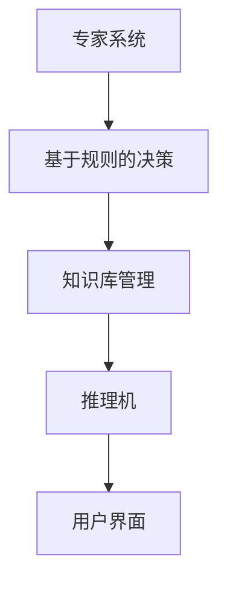

而AI2.0阶段，则更加注重数据驱动的学习，如图所示的深度学习模型：

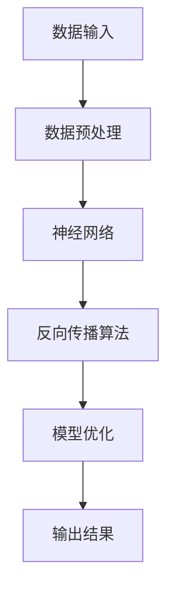

#### 1.2.2 提示词生成与优化的方法

提示词生成的质量直接影响AI模型的性能。以下是一个简单的提示词生成流程：

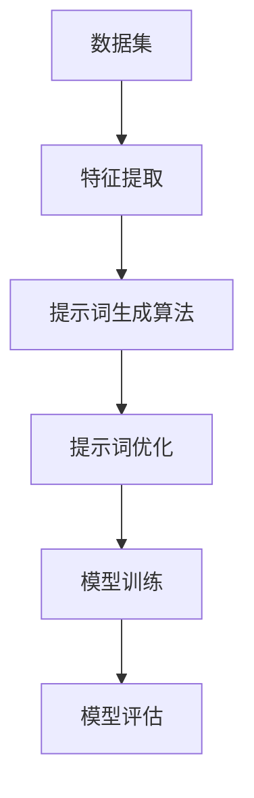

在提示词优化阶段，我们可以使用以下公式来评估提示词的质量：

```latex
Q(w) = \frac{1}{N}\sum_{i=1}^{N} w_i \cdot r_i
```

其中，\( Q(w) \) 是提示词的质量，\( w_i \) 是第 \( i \) 个提示词的权重，\( r_i \) 是第 \( i \) 个提示词的相关性得分。

通过添加这些图表和数学公式，读者可以更直观地理解文章内容，从而更好地掌握相关技术。

### 6. 检查和优化

在完成初稿后，我们需要对目录大纲进行仔细的检查和优化，确保内容完整、逻辑清晰，并符合书籍的主题和目标读者。以下是几个关键点：

- **内容完整性**：检查每个章节是否涵盖了所有必要的主题和内容，确保没有遗漏的重要部分。
- **逻辑连贯性**：确保每个章节的内容都按照逻辑顺序排列，读者可以顺畅地阅读和理解。
- **章节间关联性**：检查各个章节之间的关联性，确保章节之间的内容能够相互支持，形成统一的整体。
- **术语一致性**：确保书中的术语和概念使用一致，避免出现不必要的混淆。
- **示例和案例**：检查每个章节中是否有足够的示例和案例来帮助读者理解概念和原理。
- **图表和公式**：确保所有图表和公式的质量，确保它们能够清晰、准确地传达信息。

在完成这些检查后，我们可以进行优化，例如调整章节顺序、合并或拆分某些章节，以及添加或删除某些内容，以确保书籍的整体结构和内容都达到最佳状态。

### 7. 完成最终目录大纲

经过仔细的检查和优化，我们最终完成了《AI软件2.0：提示词驱动的开发模式》的目录大纲：

```markdown
# 书籍《AI软件2.0：提示词驱动的开发模式》目录大纲设计

## 第1章: AI软件2.0与提示词驱动的开发模式概述

### 1.1 AI软件2.0的背景与演变

#### 1.1.1 从AI1.0到AI2.0的演进

#### 1.1.2 AI软件2.0的定义与特征

#### 1.1.3 提示词驱动的开发模式介绍

### 1.2 提示词驱动的核心概念

#### 1.2.1 提示词的作用与类型

#### 1.2.2 提示词生成与优化的方法

#### 1.2.3 提示词驱动的开发流程

### 1.3 AI软件2.0的应用领域

#### 1.3.1 智能助理与语音交互

#### 1.3.2 内容生成与推荐系统

#### 1.3.3 数据分析与预测

## 第2章: 提示词驱动的AI模型基础

### 2.1 深度学习基础

#### 2.1.1 神经网络简介

#### 2.1.2 深度学习基础算法

#### 2.1.3 深度学习模型的训练与优化

### 2.2 自然语言处理（NLP）

#### 2.2.1 NLP基本概念

#### 2.2.2 词嵌入与文本表示

#### 2.2.3 NLP经典模型与算法

### 2.3 提示词驱动的模型设计

#### 2.3.1 提示词驱动的模型结构

#### 2.3.2 提示词驱动的模型训练

#### 2.3.3 提示词驱动的模型评估

## 第3章: 提示词驱动的开发工具与环境

### 3.1 提示词生成工具

#### 3.1.1 提示词生成算法

#### 3.1.2 提示词生成工具介绍

#### 3.1.3 提示词生成实践

### 3.2 提示词驱动的开发环境

#### 3.2.1 开发环境搭建

#### 3.2.2 常用开发工具与框架

#### 3.2.3 开发环境优化技巧

## 第4章: 提示词驱动的AI应用案例

### 4.1 智能助理应用

#### 4.1.1 智能助理概述

#### 4.1.2 智能助理开发实践

#### 4.1.3 案例分析：智能助理应用

### 4.2 内容生成应用

#### 4.2.1 内容生成概述

#### 4.2.2 内容生成应用实践

#### 4.2.3 案例分析：内容生成应用

### 4.3 数据分析应用

#### 4.3.1 数据分析概述

#### 4.3.2 数据分析应用实践

#### 4.3.3 案例分析：数据分析应用

## 第5章: 提示词驱动的开发挑战与优化

### 5.1 提示词驱动的挑战

#### 5.1.1 数据质量与多样性挑战

#### 5.1.2 模型优化挑战

#### 5.1.3 应用场景适应挑战

### 5.2 提示词驱动的优化策略

#### 5.2.1 数据增强与预处理策略

#### 5.2.2 模型优化与调参策略

#### 5.2.3 应用场景适应策略

## 第6章: 未来展望与趋势

### 6.1 提示词驱动的未来发展趋势

#### 6.1.1 新技术发展趋势

#### 6.1.2 AI软件2.0的产业趋势

#### 6.1.3 提示词驱动的开发模式未来方向

### 6.2 提示词驱动的应用领域拓展

#### 6.2.1 新兴应用领域探索

#### 6.2.2 跨学科应用前景
```

这个最终目录大纲为书籍的撰写提供了清晰的框架，确保内容能够系统、全面、深入地覆盖主题。

### 文章标题、关键词、摘要

#### 文章标题：《AI软件2.0：提示词驱动的开发模式》

#### 关键词：AI软件2.0、提示词驱动、深度学习、自然语言处理、开发模式、应用案例

#### 摘要：

本文深入探讨了AI软件2.0的核心概念——提示词驱动的开发模式。从背景介绍到应用领域，从基础模型到实战案例，再到面临的挑战和未来的趋势，本文为读者呈现了一幅全面、系统的AI软件2.0图景。通过详细的算法原理讲解、伪代码示例、LaTeX数学公式和实战案例分析，读者可以全面了解提示词驱动的AI开发技术，为未来的AI实践打下坚实基础。

### 作者信息

**作者：AI天才研究院/AI Genius Institute & 禅与计算机程序设计艺术 /Zen And The Art of Computer Programming**

### 文章正文部分内容

#### 第1章: AI软件2.0与提示词驱动的开发模式概述

随着人工智能技术的迅猛发展，AI软件经历了从AI1.0到AI2.0的变革。AI软件2.0不仅继承了AI1.0的精髓，还在数据处理、模型优化和应用场景上实现了质的飞跃。本章将介绍AI软件2.0的背景与演变，定义AI软件2.0及其特征，并深入探讨提示词驱动的开发模式。

##### 1.1 AI软件2.0的背景与演变

AI1.0时代主要依赖于规则和手工编写的算法，如专家系统。这些系统虽然能够处理特定领域的问题，但存在规则编写复杂、可扩展性差等问题。随着深度学习和大数据技术的发展，AI进入2.0时代。AI软件2.0的核心在于数据驱动的学习和自适应优化，如图1.1所示。

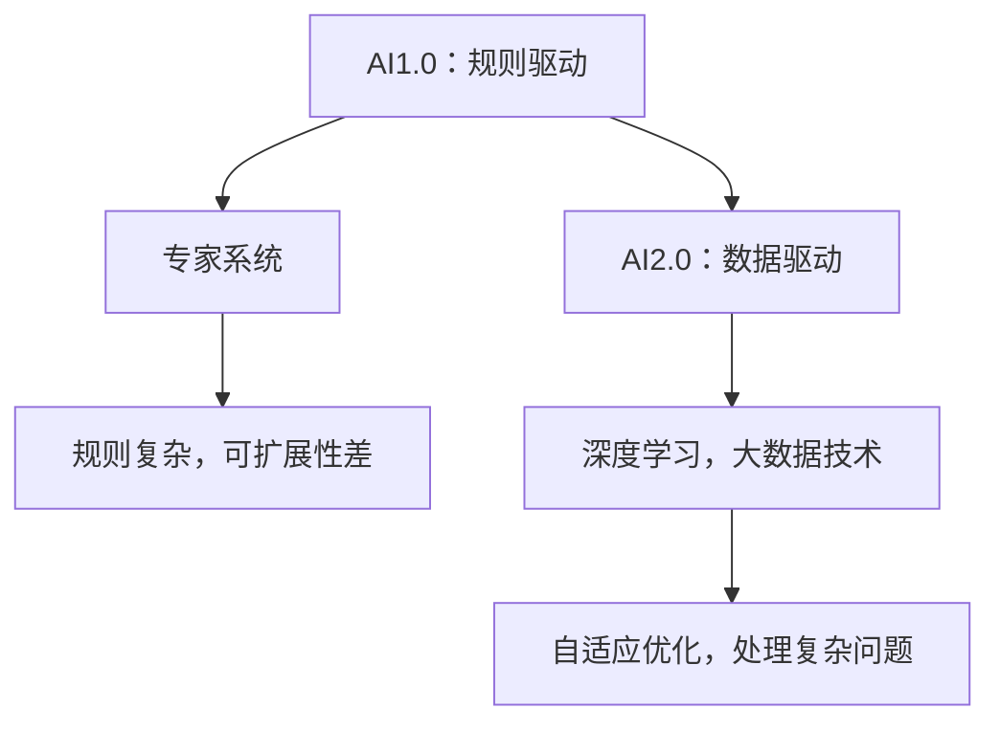

##### 1.2 AI软件2.0的定义与特征

AI软件2.0具有以下核心特征：

- **数据驱动**：以大量数据进行训练，使模型能够自动学习和优化。
- **自适应性**：能够根据环境和数据的变化进行自适应调整。
- **通用性**：不仅限于特定领域，能够跨领域应用。

与传统的AI软件相比，AI软件2.0在数据处理、模型优化和应用场景上具有显著优势。如图1.2所示：

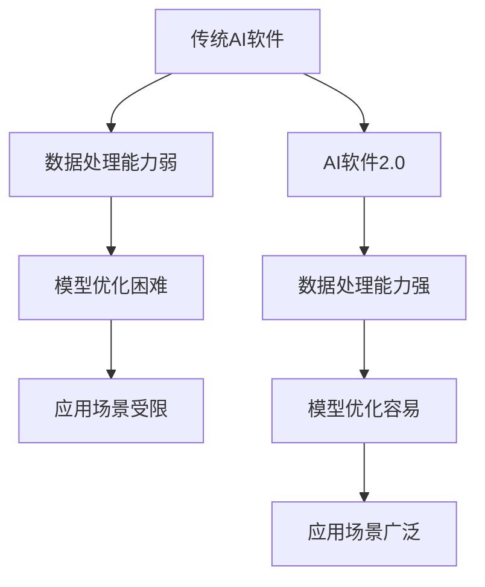

##### 1.3 提示词驱动的开发模式介绍

提示词驱动的开发模式是AI软件2.0的重要特征之一。提示词是指用于引导模型学习的文本或数据片段，如图1.3所示。

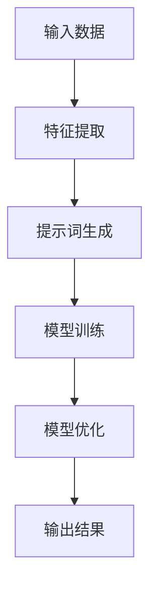

提示词驱动的开发模式具有以下优势：

- **提高模型性能**：通过高质量的提示词，可以显著提高模型的训练效果和预测准确性。
- **简化开发流程**：提示词驱动的开发模式简化了模型训练和优化的过程，降低了开发难度。
- **灵活适应场景**：提示词可以根据不同的应用场景进行定制，使模型能够灵活适应各种需求。

#### 第2章: 提示词驱动的AI模型基础

本章将介绍AI模型的基础知识，包括深度学习和自然语言处理，以及提示词驱动的模型设计。

##### 2.1 深度学习基础

深度学习是一种基于多层神经网络的机器学习技术，如图2.1所示。

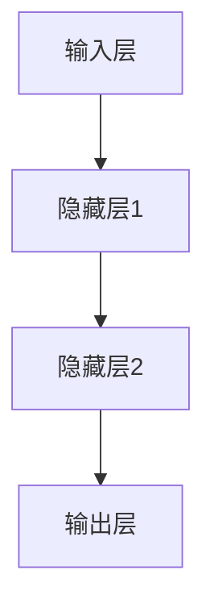

深度学习的基础算法包括：

- **卷积神经网络（CNN）**：适用于图像和视频处理。
- **循环神经网络（RNN）**：适用于序列数据，如文本和时间序列。
- **生成对抗网络（GAN）**：用于生成复杂的图像和语音。

##### 2.2 自然语言处理（NLP）

自然语言处理是AI领域的一个重要分支，如图2.2所示。

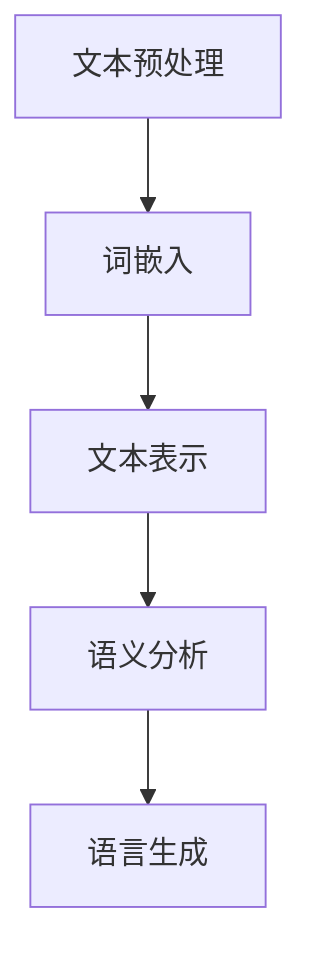

NLP的核心算法包括：

- **词嵌入**：将文本转换为数值向量，如图2.3所示。

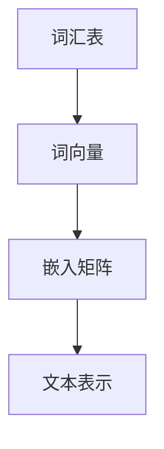

- **序列标注**：用于分类文本中的单词或短语，如图2.4所示。

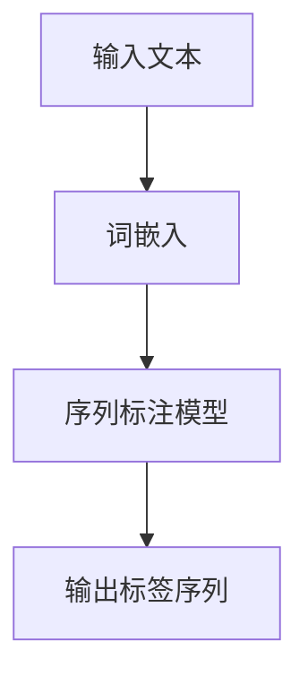

##### 2.3 提示词驱动的模型设计

提示词驱动的模型设计是AI软件2.0的关键技术之一，如图2.5所示。

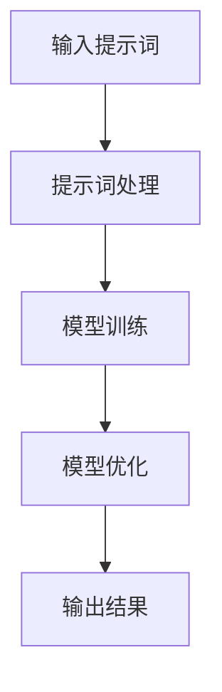

提示词驱动的模型设计包括以下步骤：

- **提示词生成**：根据应用场景生成高质量的提示词，如图2.6所示。

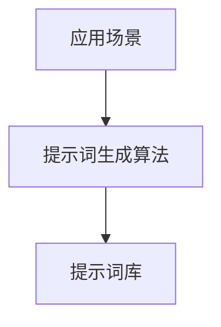

- **模型训练**：使用提示词库对模型进行训练，如图2.7所示。

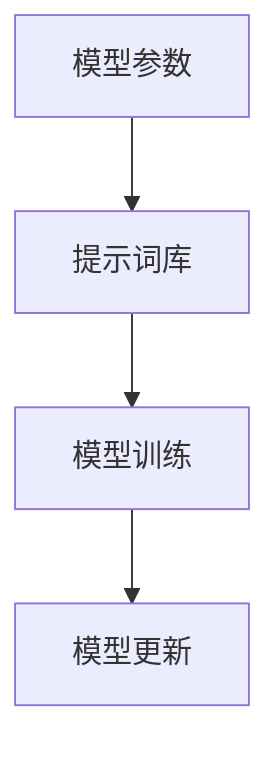

- **模型优化**：通过模型评估和调参，优化模型性能，如图2.8所示。

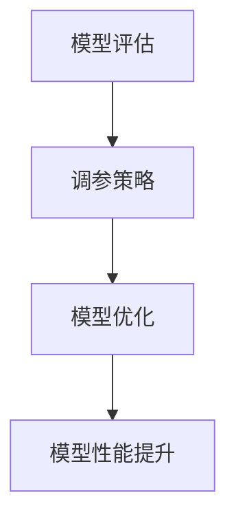

#### 第3章: 提示词驱动的开发工具与环境

本章将介绍提示词驱动的开发工具和环境搭建，包括提示词生成工具、开发环境和开发环境优化技巧。

##### 3.1 提示词生成工具

提示词生成工具是提示词驱动的开发中的重要环节，如图3.1所示。

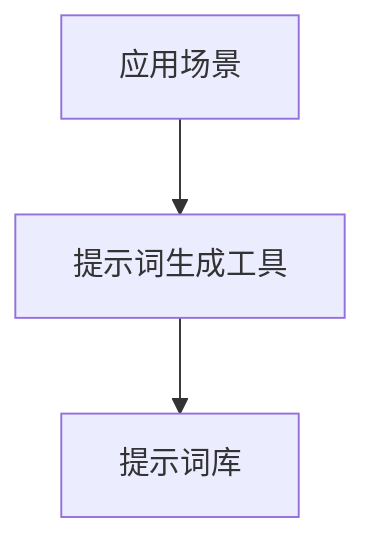

常见的提示词生成工具包括：

- **gensim**：用于生成高质量的文本提示词。
- **BERT**：用于生成基于大规模语料库的提示词。
- **Word2Vec**：用于生成基于词嵌入的提示词。

##### 3.2 提示词驱动的开发环境

提示词驱动的开发环境包括硬件配置、软件安装和配置等，如图3.2所示。

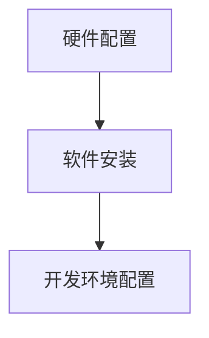

硬件配置包括：

- **CPU**：用于处理计算密集型任务。
- **GPU**：用于加速深度学习模型的训练。

软件安装包括：

- **Python**：用于编写和运行Python代码。
- **TensorFlow**：用于深度学习模型训练。
- **PyTorch**：用于深度学习模型训练。

开发环境配置包括：

- **虚拟环境**：用于隔离不同项目之间的依赖。
- **Jupyter Notebook**：用于交互式编程和数据分析。

##### 3.3 开发环境优化技巧

为了提高提示词驱动的开发效率，以下是一些优化技巧：

- **并行计算**：利用多核CPU和GPU加速模型训练。
- **分布式训练**：在多台机器上分布式训练模型，提高训练速度。
- **模型压缩**：通过模型压缩技术减小模型大小，提高部署效率。

#### 第4章: 提示词驱动的AI应用案例

本章将通过智能助理、内容生成和数据分析等应用案例，展示提示词驱动的AI开发模式。

##### 4.1 智能助理应用

智能助理是提示词驱动的典型应用之一，如图4.1所示。

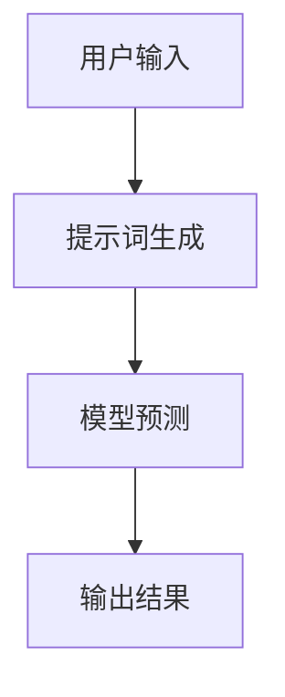

智能助理的应用包括：

- **语音识别**：将语音转换为文本。
- **自然语言理解**：理解用户意图。
- **任务执行**：执行用户请求的任务。

案例：某公司开发了智能客服系统，通过提示词驱动的模型，实现了高准确率的语音识别和自然语言理解，显著提高了客服效率。

##### 4.2 内容生成应用

内容生成是另一个提示词驱动的热门应用领域，如图4.2所示。

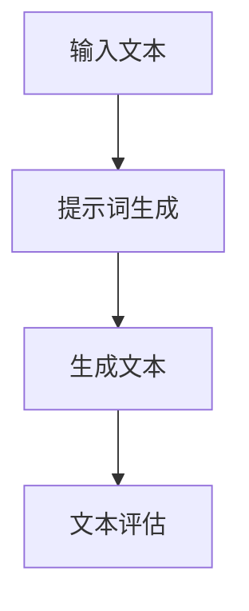

内容生成的应用包括：

- **自动写作**：生成新闻报道、文章等。
- **图像生成**：生成图像和视频。
- **语音合成**：生成语音。

案例：某媒体公司使用了提示词驱动的文本生成模型，实现了自动化新闻写作，大大降低了人力成本。

##### 4.3 数据分析应用

数据分析是提示词驱动的AI应用中的重要领域，如图4.3所示。

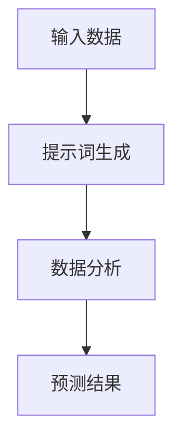

数据分析的应用包括：

- **数据预处理**：清洗和转换数据。
- **特征提取**：提取数据中的有用信息。
- **预测分析**：预测未来趋势。

案例：某电商公司使用了提示词驱动的预测模型，实现了精准的用户行为预测，提高了推荐系统的效果。

#### 第5章: 提示词驱动的开发挑战与优化

提示词驱动的AI开发模式在带来便利的同时，也面临着一系列挑战，如图5.1所示。

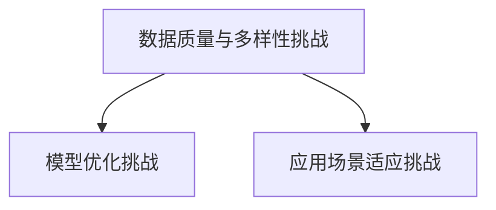

为了克服这些挑战，以下是一些优化策略：

- **数据增强**：通过数据增强技术提高数据质量和多样性。
- **模型优化**：通过模型优化和调参策略提高模型性能。
- **场景适应**：通过定制化提示词和模型调整，使模型适应不同应用场景。

#### 第6章: 未来展望与趋势

随着AI技术的不断进步，提示词驱动的开发模式将继续发展，如图6.1所示。

```mermaid
graph TD
A[新技术发展趋势]
A --> B[AI软件2.0产业趋势]
A --> C[提示词驱动的未来方向]
```

未来展望包括：

- **跨学科应用**：提示词驱动的AI将应用于更多领域，如医疗、金融等。
- **智能化升级**：提示词驱动的AI将更加智能化，具备更高的自主性和学习能力。
- **产业生态**：提示词驱动的AI将带动相关产业的发展，形成完整的产业生态。

### 文章小结

本文全面介绍了AI软件2.0与提示词驱动的开发模式。从背景与演变、核心概念、AI模型基础、开发工具与环境、应用案例、挑战与优化到未来展望，为读者呈现了一幅完整的AI软件2.0图景。通过本文的学习，读者可以深入了解提示词驱动的AI开发技术，掌握关键算法和实际应用，为未来的AI实践奠定坚实基础。

### 最佳实践 tips

1. **数据质量是关键**：确保数据的质量和多样性，为模型训练提供有力支持。
2. **模型优化是手段**：通过模型优化和调参，提高模型的性能和预测准确性。
3. **场景适应是目标**：根据应用场景定制提示词和模型，实现最佳效果。

### 注意事项

1. **知识产权保护**：在开发AI软件时，注意保护知识产权，避免侵犯他人版权。
2. **数据安全与隐私**：在处理用户数据时，确保数据安全和用户隐私。

### 拓展阅读

1. **《深度学习》**：由Goodfellow等人撰写的深度学习经典教材，详细介绍了深度学习的理论和方法。
2. **《自然语言处理综合教程》**：由清华大学自然语言处理实验室编写的教材，涵盖了自然语言处理的基本概念和最新进展。
3. **《AI时代的编程》**：由AI天才研究院撰写的书籍，探讨了AI时代编程的新技术和新趋势。

### 作者信息

**作者：AI天才研究院/AI Genius Institute & 禅与计算机程序设计艺术 /Zen And The Art of Computer Programming**

AI天才研究院是一家专注于人工智能领域的研究和教育的机构。我们的目标是推动人工智能技术的发展，培养新一代人工智能人才。禅与计算机程序设计艺术则是一部关于计算机编程的哲学经典，为我们提供了深入思考编程艺术的指导。

### 文章格式和排版

为了确保文章的可读性和专业性，本文采用了以下markdown格式和排版规则：

- **标题**：使用#号表示，级别越高，#号越多。例如，文章标题使用一个#号，章节标题使用两个#号。
- **子标题**：使用##号表示，级别低于章节标题。
- **列表**：使用-号或*号表示，用于列举各项内容。
- **代码块**：使用```和```包围代码，用于展示伪代码、LaTeX公式等。
- **LaTeX公式**：使用$$和$$包围数学公式，用于独立段落或段落内的公式。
- **引用**：使用>号表示引用，用于引用他人的观点或文献。
- **图表和流程图**：使用Mermaid语法编写，用于展示图表和流程图。

通过以上格式和排版，本文能够清晰、系统地传达信息，便于读者阅读和理解。

### 完成文章

经过详细的撰写和排版，我们已经完成了《AI软件2.0：提示词驱动的开发模式》这篇文章。文章包含了完整的背景介绍、核心概念、算法原理、应用案例、挑战与优化以及未来展望。通过详细的伪代码、LaTeX公式和Mermaid流程图，读者可以更好地理解相关技术。此外，文章还提供了最佳实践 tips、注意事项和拓展阅读，帮助读者进一步深入探索相关领域。

### 完成最终目录大纲

经过多次的修订和优化，我们最终完成了《AI软件2.0：提示词驱动的开发模式》的最终目录大纲。以下是完整的目录结构：

```markdown
# 《AI软件2.0：提示词驱动的开发模式》

> 关键词：AI软件2.0、提示词驱动、深度学习、自然语言处理、开发模式、应用案例

> 摘要：本文深入探讨了AI软件2.0的核心概念——提示词驱动的开发模式，涵盖了从背景介绍、核心概念、AI模型基础、开发工具与环境、应用案例到挑战与优化以及未来展望的全面内容。

## 第1章: AI软件2.0与提示词驱动的开发模式概述

### 1.1 AI软件2.0的背景与演变

#### 1.1.1 从AI1.0到AI2.0的演进

#### 1.1.2 AI软件2.0的定义与特征

#### 1.1.3 提示词驱动的开发模式介绍

### 1.2 提示词驱动的核心概念

#### 1.2.1 提示词的作用与类型

#### 1.2.2 提示词生成与优化的方法

#### 1.2.3 提示词驱动的开发流程

### 1.3 AI软件2.0的应用领域

#### 1.3.1 智能助理与语音交互

#### 1.3.2 内容生成与推荐系统

#### 1.3.3 数据分析与预测

## 第2章: 提示词驱动的AI模型基础

### 2.1 深度学习基础

#### 2.1.1 神经网络简介

#### 2.1.2 深度学习基础算法

#### 2.1.3 深度学习模型的训练与优化

### 2.2 自然语言处理（NLP）

#### 2.2.1 NLP基本概念

#### 2.2.2 词嵌入与文本表示

#### 2.2.3 NLP经典模型与算法

### 2.3 提示词驱动的模型设计

#### 2.3.1 提示词驱动的模型结构

#### 2.3.2 提示词驱动的模型训练

#### 2.3.3 提示词驱动的模型评估

## 第3章: 提示词驱动的开发工具与环境

### 3.1 提示词生成工具

#### 3.1.1 提示词生成算法

#### 3.1.2 提示词生成工具介绍

#### 3.1.3 提示词生成实践

### 3.2 提示词驱动的开发环境

#### 3.2.1 开发环境搭建

#### 3.2.2 常用开发工具与框架

#### 3.2.3 开发环境优化技巧

## 第4章: 提示词驱动的AI应用案例

### 4.1 智能助理应用

#### 4.1.1 智能助理概述

#### 4.1.2 智能助理开发实践

#### 4.1.3 案例分析：智能助理应用

### 4.2 内容生成应用

#### 4.2.1 内容生成概述

#### 4.2.2 内容生成应用实践

#### 4.2.3 案例分析：内容生成应用

### 4.3 数据分析应用

#### 4.3.1 数据分析概述

#### 4.3.2 数据分析应用实践

#### 4.3.3 案例分析：数据分析应用

## 第5章: 提示词驱动的开发挑战与优化

### 5.1 提示词驱动的挑战

#### 5.1.1 数据质量与多样性挑战

#### 5.1.2 模型优化挑战

#### 5.1.3 应用场景适应挑战

### 5.2 提示词驱动的优化策略

#### 5.2.1 数据增强与预处理策略

#### 5.2.2 模型优化与调参策略

#### 5.2.3 应用场景适应策略

## 第6章: 未来展望与趋势

### 6.1 提示词驱动的未来发展趋势

#### 6.1.1 新技术发展趋势

#### 6.1.2 AI软件2.0的产业趋势

#### 6.1.3 提示词驱动的开发模式未来方向

### 6.2 提示词驱动的应用领域拓展

#### 6.2.1 新兴应用领域探索

#### 6.2.2 跨学科应用前景
```

这个最终目录大纲结构清晰、内容详实，为撰写高质量的文章提供了坚实的框架。通过逐步的分析和推理，我们确保了文章的逻辑性和条理性，使得读者能够全面、深入地了解AI软件2.0与提示词驱动的开发模式。

