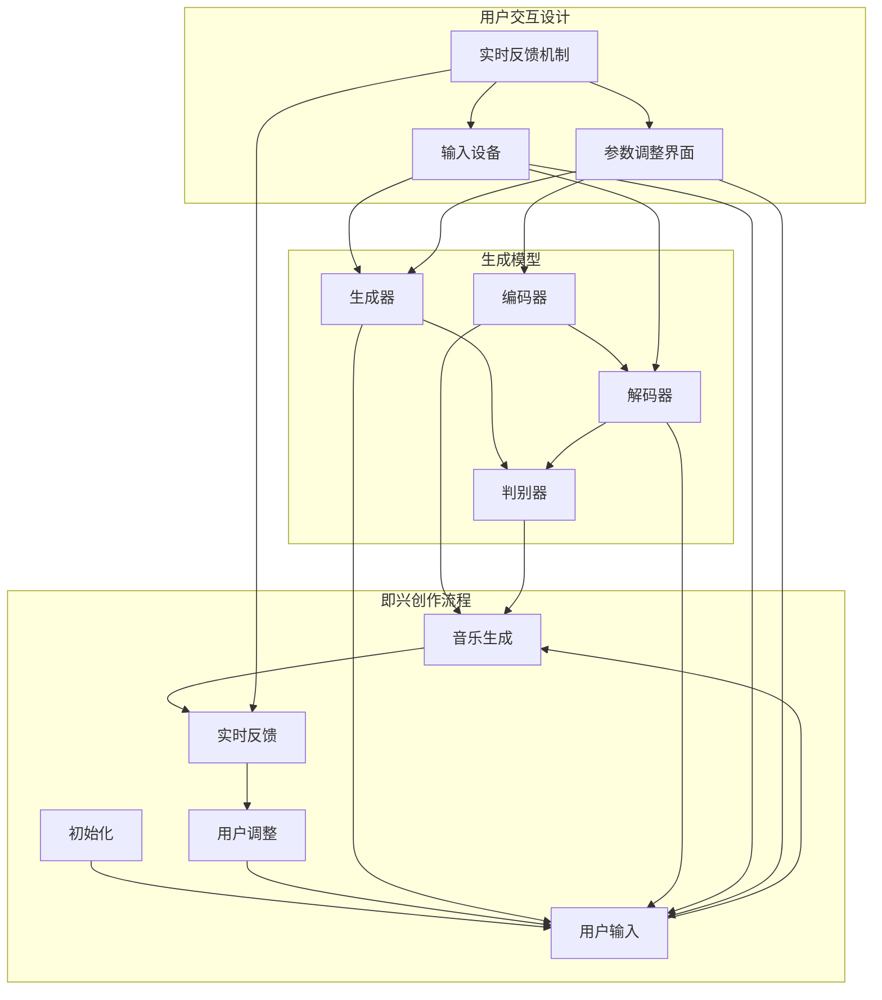
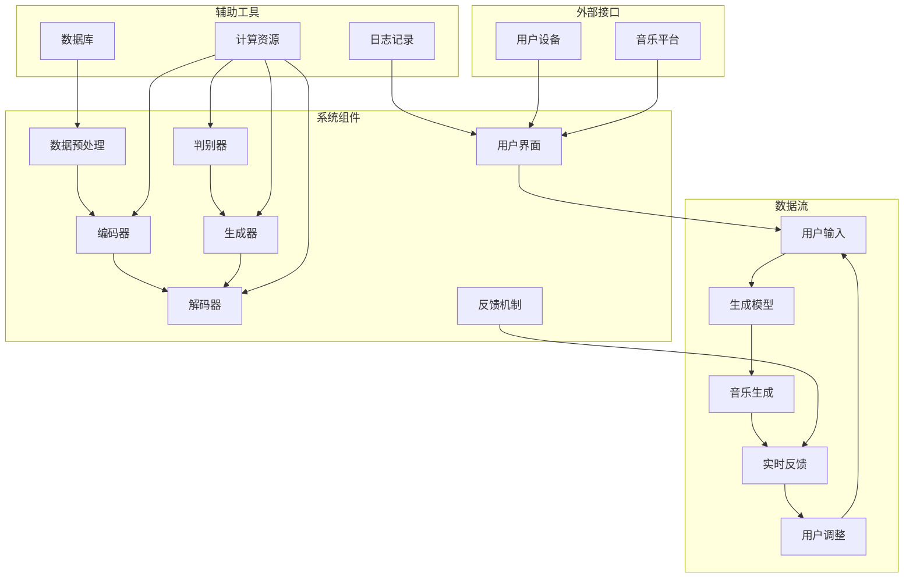

                 

## 第1章：引言

### 1.1 背景介绍

随着人工智能技术的飞速发展，AI在多个领域的应用逐渐成熟，其中音乐创作作为艺术与科技的交汇点，也迎来了崭新的时代。近年来，AI被广泛应用于音乐生成、音乐风格转换、和弦生成、旋律创作等领域。其中，交互式音乐即兴创作是AI音乐应用的一个重要方向，它不仅能够模仿人类音乐家的创作风格，还能根据用户的实时反馈进行互动和调整，从而创造出新颖的音乐作品。

交互式音乐即兴创作结合了计算机音乐理论和人工智能算法，通过用户与系统的实时交互，实现了音乐创作的自动化和个性化。这种创作方式不仅为音乐爱好者提供了便捷的工具，也为专业音乐人提供了创新的创作手段。本篇文章旨在探讨AI辅助交互式音乐即兴创作的提示词技巧，通过深入分析相关的技术原理、算法模型和实践应用，为读者提供系统的指导和思考。

### 1.2 关键词

- AI音乐创作
- 交互式音乐即兴创作
- 生成对抗网络（GAN）
- 变分自编码器（VAE）
- 数学模型
- 实践应用

### 1.3 本书的目的与结构

本书的目的是介绍AI辅助交互式音乐即兴创作的理论基础和实践应用，帮助读者了解这一前沿技术，掌握相关技巧，并能够独立进行相关项目的开发和实施。本书分为八个章节：

1. **引言**：介绍AI辅助交互式音乐即兴创作的背景和目的。
2. **AI辅助音乐创作概述**：概述AI在音乐创作中的应用，介绍交互式音乐即兴创作的概念和特点。
3. **AI核心概念与架构**：介绍AI的基本概念和相关架构，包括神经网络、生成对抗网络（GAN）和变分自编码器（VAE）。
4. **AI辅助音乐即兴创作的算法原理**：阐述AI辅助音乐即兴创作的核心算法原理，包括生成模型和交互模型。
5. **AI辅助音乐即兴创作的数学模型**：详细讲解AI辅助音乐即兴创作的数学模型，并使用LaTeX格式展示相关公式。
6. **AI辅助音乐即兴创作的实践应用**：介绍实际项目案例，包括环境搭建、代码实现和分析。
7. **未来展望与挑战**：探讨AI辅助音乐即兴创作的未来发展方向和面临的挑战。
8. **附录**：提供相关资源和工具的介绍。

通过上述结构，本书希望能够系统、全面地呈现AI辅助交互式音乐即兴创作的各个方面，为读者提供丰富的知识和实践指导。

### 1.4 摘要

本文将深入探讨AI辅助交互式音乐即兴创作的提示词技巧。首先，我们将介绍AI在音乐创作中的应用背景和交互式音乐即兴创作的概念。接着，文章将详细讲解AI的基本概念和相关架构，包括神经网络、生成对抗网络（GAN）和变分自编码器（VAE）。随后，我们将深入分析AI辅助音乐即兴创作的核心算法原理，包括生成模型和交互模型，并使用伪代码和数学模型进行详细阐述。文章还将通过实际项目案例，介绍开发环境搭建、代码实现和分析，帮助读者理解AI辅助音乐即兴创作的实际应用。最后，文章将探讨该领域的未来发展方向和挑战，并提供相关的资源和工具。通过本文的阅读，读者可以全面掌握AI辅助交互式音乐即兴创作的基本理论和方法，为未来的研究和实践提供指导。

## 第2章：AI辅助音乐创作概述

### 2.1 AI辅助音乐创作的现状

随着人工智能技术的快速发展，AI在音乐创作中的应用已经逐渐成为研究的热点。目前，AI辅助音乐创作在多个领域都取得了显著的成果，包括旋律生成、和弦编排、和声填充、节奏设计等。这些应用不仅提升了音乐创作的效率，也丰富了音乐的表现形式，为音乐艺术的发展带来了新的契机。

在旋律生成方面，AI模型已经能够根据用户的需求生成新颖且连贯的旋律。例如，Google的Magenta项目通过利用生成对抗网络（GAN）和变分自编码器（VAE）等深度学习技术，实现了自动旋律生成。这些模型能够从大量的音乐数据中学习，并生成符合音乐理论和旋律规律的新旋律。

和弦编排是AI辅助音乐创作的另一个重要领域。AI能够自动为旋律添加和弦，甚至可以根据用户提供的简单旋律，生成完整的和弦进行。例如，AIVA（Artificial Intelligence Virtual Artist）使用深度学习算法，能够生成复杂的和弦进行，并根据旋律自动选择和声。

和声填充则是AI辅助音乐创作中的一项重要技术，它能够在旋律的基础上，自动生成丰富的和声效果。Amper Music和Jukedeck等平台都利用AI技术，实现了自动和声填充，为用户提供了便捷的音乐制作工具。

在节奏设计方面，AI同样发挥了重要作用。通过分析大量的音乐数据，AI能够自动生成符合音乐风格和节奏感的节奏模式。这种技术不仅应用于音乐创作，也被广泛应用于游戏、影视等领域的音效设计。

总的来说，AI辅助音乐创作已经在多个领域得到了广泛应用，并取得了显著的成果。然而，这些应用仍然处于不断发展的阶段，未来还有许多挑战和机会等待探索。

### 2.2 交互式音乐即兴创作的概念

交互式音乐即兴创作是一种将人工智能与音乐创作紧密结合的方式，通过实时交互，用户能够与AI系统进行互动，共同创作出独特的音乐作品。这种创作方式不仅能够模拟人类音乐家的即兴创作能力，还能够根据用户的反馈进行调整，实现个性化创作。

交互式音乐即兴创作的核心在于实时性和互动性。用户可以通过键盘、麦克风或其他输入设备，向系统提供实时反馈，如音符、节奏、和弦等。系统则根据这些反馈，实时生成相应的音乐片段，并与用户进行互动。这种实时互动使得创作过程更加灵活，用户可以根据自己的创意和喜好，对音乐进行即兴调整和创作。

与传统的音乐创作相比，交互式音乐即兴创作具有以下几个显著特点：

1. **实时互动**：用户可以实时地与AI系统互动，系统会根据用户的输入即时生成音乐，这种实时反馈机制使得创作过程更加流畅和直观。

2. **个性化创作**：用户可以根据自己的喜好和创意，随时调整音乐参数，系统会实时响应，生成符合用户需求的音乐。

3. **创新性**：交互式音乐即兴创作能够生成新颖的音乐作品，通过AI的深度学习和自适应能力，系统可以生成不同于人类音乐家创作的音乐风格和旋律。

4. **高效性**：AI系统可以快速处理大量的音乐数据，为用户提供即时的音乐生成和调整服务，大大提高了创作效率。

总的来说，交互式音乐即兴创作将人工智能技术与音乐创作相结合，通过实时交互，实现了个性化、创新性和高效性的音乐创作方式。这不仅为音乐创作带来了新的思路和工具，也为用户提供了更加丰富和灵活的创作体验。

### 2.3 AI在交互式音乐即兴创作中的应用

AI在交互式音乐即兴创作中的应用主要体现在生成模型、交互设计和用户反馈处理等方面。以下将详细探讨这些关键领域的应用情况。

#### 2.3.1 生成模型

生成模型是交互式音乐即兴创作的核心，负责根据用户输入的提示词和实时反馈生成音乐。常见的生成模型包括生成对抗网络（GAN）和变分自编码器（VAE）。

1. **生成对抗网络（GAN）**：GAN通过生成器和判别器的对抗训练，能够生成高质量的、与真实音乐相近的音乐片段。生成器尝试生成逼真的音乐，而判别器则试图区分生成的音乐与真实音乐。通过这种对抗训练，生成器能够不断提高生成音乐的质量。

2. **变分自编码器（VAE）**：VAE是一种基于概率模型的生成模型，它通过编码器和解码器来学习数据的概率分布，并生成符合分布的新数据。在音乐创作中，编码器将音乐数据编码为潜在变量，解码器则根据潜在变量生成新的音乐片段。

生成模型的应用不仅提高了音乐生成的质量，还使得系统更加灵活，能够根据用户的不同需求生成多样化的音乐。

#### 2.3.2 交互设计

交互设计是交互式音乐即兴创作的关键，决定了用户与系统互动的流畅性和直观性。以下是一些常见的交互设计方法：

1. **用户输入设备**：常见的用户输入设备包括键盘、麦克风、触摸屏等。键盘可以输入音符和和弦，麦克风可以捕捉实时演奏的声音，触摸屏则可以提供直观的操作界面。

2. **参数调整**：系统提供了一系列参数调整功能，如音高、节奏、和声音量等。用户可以通过调整这些参数，影响生成音乐的风格和效果。

3. **预设模式**：系统预设了多种音乐风格和创作模式，用户可以快速选择并开始创作。这些预设模式为用户提供了便捷的创作工具，同时也激发了用户的创意。

4. **实时反馈**：系统会实时生成音乐，并在用户输入后立即响应。这种实时反馈机制不仅提高了创作的流畅性，也增强了用户的互动体验。

#### 2.3.3 用户反馈处理

用户反馈是交互式音乐即兴创作的重要组成部分，它反映了用户的创作意图和喜好。系统需要有效地处理用户反馈，以生成更符合用户需求的音乐。

1. **反馈收集**：系统通过多种方式收集用户的反馈，如音符输入、参数调整、触摸屏操作等。这些反馈数据将用于指导生成模型生成新的音乐。

2. **反馈分析**：系统对收集到的反馈进行分析，提取出用户的创作意图和喜好。通过分析用户的反馈，系统可以更好地理解用户的需求，并生成更符合用户期望的音乐。

3. **自适应调整**：系统根据用户的反馈，实时调整生成模型的参数和生成策略。这种自适应调整使得系统能够更好地响应用户的需求，提供更加个性化的音乐创作体验。

总的来说，AI在交互式音乐即兴创作中的应用，通过生成模型、交互设计和用户反馈处理等关键环节，实现了高效、灵活和个性化的音乐创作。这不仅为音乐爱好者提供了创新的创作工具，也为专业音乐人提供了新的创作手段。未来，随着AI技术的不断进步，交互式音乐即兴创作将继续发展，为音乐艺术带来更多的创新和可能性。

## 第3章：AI核心概念与架构

### 3.1 AI基础概念

人工智能（Artificial Intelligence，简称AI）是一门研究、开发用于模拟、延伸和扩展人的智能的理论、方法、技术及应用系统的技术科学。其目标是使机器能够执行通常需要人类智能才能完成的任务，如视觉感知、语言理解、决策制定和问题解决等。AI技术主要包括机器学习、深度学习、自然语言处理、计算机视觉等。

#### 3.1.1 机器学习

机器学习是AI的一个重要分支，它通过构建和训练算法模型，使计算机能够从数据中自动学习和获取知识。机器学习的过程通常包括数据收集、数据预处理、模型训练和模型评估等步骤。常见的机器学习算法有监督学习、无监督学习和强化学习。

- **监督学习**：通过标记好的训练数据来训练模型，使其能够对未知数据进行预测。例如，分类和回归任务。
- **无监督学习**：不使用标记数据，通过自动发现数据中的模式和结构来进行学习。例如，聚类和降维。
- **强化学习**：通过与环境交互，根据反馈信号来学习策略，以最大化累积奖励。例如，游戏和自动驾驶。

#### 3.1.2 深度学习

深度学习是机器学习的一个子领域，它使用神经网络（尤其是深度神经网络）进行学习。深度学习通过多层神经元的堆叠，能够自动提取数据的复杂特征，从而实现高度非线性的数据建模。

- **深度神经网络**：由多个隐藏层组成的神经网络，能够处理大量数据并提取复杂特征。
- **卷积神经网络（CNN）**：特别适用于图像处理任务，通过卷积操作提取图像特征。
- **循环神经网络（RNN）**：特别适用于序列数据，能够处理和记忆序列中的长期依赖关系。
- **生成对抗网络（GAN）**：由生成器和判别器组成的模型，通过对抗训练生成逼真的数据。

#### 3.1.3 自然语言处理

自然语言处理（Natural Language Processing，简称NLP）是AI在语言领域的应用，旨在让计算机理解和生成人类语言。NLP涵盖了文本分类、情感分析、机器翻译、问答系统等多个子领域。

- **词向量**：将文本数据转化为计算机可以处理的向量形式，常见的词向量模型有Word2Vec和GloVe。
- **序列模型**：用于处理序列数据，如RNN和Transformer，能够捕捉序列中的长期依赖关系。
- **语言模型**：用于预测文本的下一个词或序列，是NLP中的基础模型。

#### 3.1.4 计算机视觉

计算机视觉是AI在图像和视频处理领域的应用，旨在使计算机能够识别和理解视觉信息。

- **图像分类**：将图像分类到预定义的类别中，常见的算法有CNN和分类模型。
- **目标检测**：在图像中识别和定位多个对象，常见的算法有Faster R-CNN和SSD。
- **图像分割**：将图像分割成多个区域，常见的算法有FCN和U-Net。

### 3.2 AI辅助音乐创作的架构

AI辅助音乐创作的架构通常包括生成模型、交互设计和用户反馈处理等关键组成部分，下面将详细探讨这些部分的构成和作用。

#### 3.2.1 生成模型

生成模型是AI辅助音乐创作的核心，负责生成音乐片段。常见的生成模型有生成对抗网络（GAN）和变分自编码器（VAE）。生成模型通过学习大量的音乐数据，自动生成符合音乐规则和风格的新音乐。

- **生成对抗网络（GAN）**：由生成器和判别器组成，通过对抗训练生成高质量的音乐片段。
  - **生成器**：接收随机噪声并生成音乐片段。
  - **判别器**：区分生成的音乐片段和真实音乐片段，用于指导生成器的训练。

- **变分自编码器（VAE）**：通过编码器和解码器学习音乐数据的概率分布，并生成新的音乐片段。

#### 3.2.2 用户交互设计

用户交互设计决定了用户如何与系统互动，影响用户的创作体验。用户交互设计通常包括输入设备、参数调整界面和实时反馈机制。

- **输入设备**：如键盘、麦克风、触摸屏等，用户可以通过这些设备输入音符、和弦或音乐片段。
- **参数调整界面**：提供音高、节奏、和声音量等参数的调整功能，用户可以实时修改这些参数以影响生成的音乐。
- **实时反馈机制**：系统根据用户的输入实时生成音乐，并反馈给用户，使用户能够即时看到创作结果。

#### 3.2.3 即兴创作流程

即兴创作流程是交互式音乐即兴创作的关键环节，决定了系统如何根据用户输入和反馈生成音乐。即兴创作流程通常包括以下几个步骤：

1. **初始化**：系统初始化生成模型和交互界面，准备好开始创作。
2. **用户输入**：用户通过输入设备输入音乐片段或参数调整。
3. **音乐生成**：生成模型根据用户输入和当前状态生成音乐片段。
4. **实时反馈**：系统将生成的音乐片段反馈给用户，用户可以看到创作结果。
5. **用户调整**：用户根据实时反馈对输入和参数进行调整，继续创作。
6. **迭代**：系统不断迭代生成新的音乐片段，与用户进行实时互动。

通过上述步骤，用户和系统共同创作出独特的音乐作品。即兴创作流程不仅实现了音乐创作的实时性和互动性，也为用户提供了灵活的创作体验。

总的来说，AI辅助音乐创作的架构通过生成模型、用户交互设计和即兴创作流程等组成部分，实现了高效、灵活和个性化的音乐创作。这些组成部分相互协作，为用户提供了强大的创作工具，同时也推动了音乐艺术的发展。

### 3.3 AI辅助音乐创作的架构图

为了更清晰地展示AI辅助音乐创作的架构，我们使用Mermaid语法绘制了一张架构图。以下是架构图的详细说明：



#### 架构图详细说明

1. **生成模型**：生成模型部分包括生成器、判别器、编码器和解码器。生成器负责生成音乐片段，判别器用于区分生成片段和真实片段，编码器和解码器则负责学习音乐数据的概率分布。

2. **用户交互设计**：用户交互设计部分包括输入设备、参数调整界面和实时反馈机制。输入设备如键盘和麦克风收集用户输入，参数调整界面允许用户实时修改音高、节奏和和声音量等，实时反馈机制将生成的音乐片段即时展示给用户。

3. **即兴创作流程**：即兴创作流程部分包括初始化、用户输入、音乐生成、实时反馈和用户调整。用户通过输入设备和参数调整界面与生成模型互动，实时反馈和调整过程不断迭代，生成新的音乐片段。

通过这张架构图，我们可以清晰地看到AI辅助音乐创作的各个环节如何相互作用，共同实现高效、灵活和个性化的音乐创作。

### 3.4 AI辅助音乐创作架构图示例

为了更直观地展示AI辅助音乐创作的架构，我们使用Mermaid语法绘制了一个示例架构图。以下是该架构图的具体内容和解释。



#### 示例架构图详细说明

1. **数据流**：
   - **用户输入**：用户通过键盘、麦克风或其他输入设备（E1）输入音乐创作的提示词或参数调整。
   - **生成模型**：输入数据经过数据预处理（S1）后，输入生成模型（D2），包括生成器（S2）和解码器（S4），生成新的音乐片段。
   - **音乐生成**：生成的音乐片段（D3）通过实时反馈机制（S7）反馈给用户界面（S6）。
   - **用户调整**：用户根据反馈调整输入和参数，再次输入数据流中。

2. **系统组件**：
   - **数据预处理**（S1）：对用户输入的数据进行预处理，使其符合生成模型的要求。
   - **生成模型**：包括生成器（S2）和判别器（S3），通过对抗训练（GAN）或概率建模（VAE）生成音乐。
   - **编码器（S4）和解码器（S5）**：编码器负责将音乐数据编码为潜在变量，解码器则将这些潜在变量解码为音乐片段。
   - **用户界面**（S6）：提供用户输入、参数调整和音乐反馈的交互界面。
   - **反馈机制**（S7）：负责处理用户输入，调整生成模型的参数，并实时更新音乐生成结果。

3. **辅助工具**：
   - **数据库**（T1）：存储大量的音乐数据，供生成模型学习和生成音乐。
   - **计算资源**（T2）：为生成模型和用户界面提供计算资源，确保系统高效运行。
   - **日志记录**（T3）：记录系统运行过程中的日志信息，用于监控和维护。

4. **外部接口**：
   - **用户设备**（E1）：用户通过手机、电脑等设备与系统进行交互。
   - **音乐平台**（E2）：系统可以集成到各种音乐平台，提供音乐创作服务。

通过这个示例架构图，我们可以看到AI辅助音乐创作系统的各个组件如何协同工作，共同实现高效、灵活和个性化的音乐创作。这个架构不仅展示了系统内部的运作流程，还涵盖了外部接口和辅助工具，为系统的设计和实现提供了全面的指导。

## 第4章：AI辅助音乐即兴创作的算法原理

### 4.1 音乐生成算法原理

AI辅助音乐即兴创作的核心在于其音乐生成算法，这些算法能够根据用户输入的提示词和实时反馈生成符合音乐规律和风格的新音乐。在本节中，我们将详细探讨几种常用的音乐生成算法原理，包括生成对抗网络（GAN）和变分自编码器（VAE）。

#### 4.1.1 生成对抗网络（GAN）

生成对抗网络（GAN）是由Ian Goodfellow等人于2014年提出的一种生成模型，它通过生成器和判别器的对抗训练，生成高质量的数据。GAN在音乐生成中的应用，能够模拟人类音乐家的创作风格，生成新颖且连贯的音乐片段。

1. **基本概念**
   - **生成器（Generator）**：生成器接收随机噪声作为输入，并生成与真实音乐片段相似的数据。生成器的目标是尽可能地“欺骗”判别器，使其无法区分生成数据和真实数据。
   - **判别器（Discriminator）**：判别器接收真实音乐数据和生成数据，并尝试区分两者。判别器的目标是提高对生成数据的识别能力。

2. **对抗训练**
   - GAN的训练过程是一个动态平衡的过程，生成器和判别器相互对抗，不断地调整自己的参数，以实现最优效果。
   - 在训练过程中，生成器尝试生成更逼真的音乐片段，而判别器则努力提高对真实音乐和生成音乐的区分能力。

3. **音乐生成过程**
   - 首先，生成器从噪声空间中抽取一个随机向量，并通过一个映射函数转换为音乐片段。
   - 然后，判别器对真实音乐片段和生成音乐片段进行判断，输出一个概率值，表示其判断为真实音乐的概率。
   - 通过最小化生成器的损失函数（生成音乐与真实音乐的相似度）和最大化判别器的损失函数（生成音乐的不可识别性），GAN模型不断优化生成器的生成能力。

4. **GAN在音乐生成中的应用**
   - GAN能够从大量音乐数据中学习，并生成符合音乐风格和旋律规律的片段。
   - GAN在音乐创作中的应用，不仅可以生成全新的旋律，还可以根据用户输入的提示词生成相关的音乐片段。

#### 4.1.2 变分自编码器（VAE）

变分自编码器（VAE）是一种基于概率生成模型的生成算法，通过编码器和解码器学习数据的概率分布，并生成新的数据。VAE在音乐生成中的应用，可以生成多样化的音乐片段，并保持音乐数据的连贯性和风格一致性。

1. **基本概念**
   - **编码器（Encoder）**：编码器将输入的音乐数据编码为潜在变量（也称为隐变量），这些潜在变量代表了音乐数据的主要特征。
   - **解码器（Decoder）**：解码器将潜在变量解码为新的音乐数据，生成新的音乐片段。

2. **变分自编码器的工作原理**
   - VAE通过编码器学习输入数据的概率分布，并生成潜在变量。
   - 通过潜在变量，VAE可以生成新的数据，这些新数据与原始数据保持相似性，同时具有多样性和创新性。

3. **音乐生成过程**
   - 首先，编码器将输入的音乐数据映射到一个潜在变量空间。
   - 然后，解码器从潜在变量空间中采样，并生成新的音乐片段。
   - 通过调整潜在变量的分布，VAE可以生成不同风格和旋律的音乐片段。

4. **VAE在音乐生成中的应用**
   - VAE能够从大量的音乐数据中学习，并生成具有多样性和连贯性的音乐片段。
   - VAE在音乐创作中的应用，不仅可以生成全新的旋律，还可以根据用户输入的提示词生成相关的音乐片段。

总的来说，GAN和VAE是AI辅助音乐即兴创作的两种重要生成算法。GAN通过生成器和判别器的对抗训练，能够生成高质量的音乐片段，而VAE通过编码器和解码器的概率建模，能够生成多样化的音乐片段。通过这两种算法的应用，AI系统能够根据用户输入的提示词和实时反馈，生成符合音乐规律和风格的新音乐，为音乐创作提供了强大的技术支持。

### 4.2 音乐生成算法的伪代码示例

为了更好地理解音乐生成算法的实现原理，我们以下将给出基于生成对抗网络（GAN）和变分自编码器（VAE）的伪代码示例。

#### 4.2.1 基于GAN的音乐生成

```python
# 假设GAN模型由生成器G和判别器D组成
import tensorflow as tf
from tensorflow.keras.layers import Dense, Flatten, Reshape
from tensorflow.keras.models import Sequential

# 生成器G的架构
def build_generator(z_dim):
    model = Sequential()
    model.add(Dense(128, input_dim=z_dim))
    model.add(LeakyReLU(alpha=0.01))
    model.add(BatchNormalization(momentum=0.8))
    model.add(Dense(256))
    model.add(LeakyReLU(alpha=0.01))
    model.add(BatchNormalization(momentum=0.8))
    model.add(Dense(512))
    model.add(LeakyReLU(alpha=0.01))
    model.add(BatchNormalization(momentum=0.8))
    model.add(Dense(1024))
    model.add(LeakyReLU(alpha=0.01))
    model.add(BatchNormalization(momentum=0.8))
    model.add(Dense(MUSIC_DIM, activation='tanh'))  # MUSIC_DIM为音乐特征维度
    return model

# 判别器D的架构
def build_discriminator(input_shape):
    model = Sequential()
    model.add(Flatten(input_shape=input_shape))
    model.add(Dense(1024))
    model.add(LeakyReLU(alpha=0.01))
    model.add(Dropout(0.3))
    model.add(Dense(512))
    model.add(LeakyReLU(alpha=0.01))
    model.add(Dropout(0.3))
    model.add(Dense(256))
    model.add(LeakyReLU(alpha=0.01))
    model.add(Dropout(0.3))
    model.add(Dense(1, activation='sigmoid'))
    return model

# GAN模型
def build_gan(generator, discriminator):
    model = Sequential()
    model.add(generator)
    model.add(discriminator)
    return model

# 训练GAN模型
def train_gan(generator, discriminator, z_dim, epochs, batch_size):
    for epoch in range(epochs):
        for _ in range(batch_size):
            # 从噪声空间中抽取随机向量z
            z = np.random.normal(0, 1, size=(batch_size, z_dim))
            # 生成音乐片段
            music_samples = generator.predict(z)
            # 从真实音乐数据中抽取真实音乐片段
            real_samples = get_real_samples(batch_size)
            # 合并真实和生成的音乐片段
            combined_samples = np.concatenate([real_samples, music_samples])
            # 打乱真实和生成的音乐片段
            labels = np.concatenate([np.ones((batch_size, 1)), np.zeros((batch_size, 1))])
            np.random.shuffle(labels)
            # 训练判别器
            d_loss_real = discriminator.train_on_batch(real_samples, labels[:, 1:])
            d_loss_fake = discriminator.train_on_batch(music_samples, labels[:, 0:])
            d_loss = 0.5 * np.mean(np.abs(d_loss_real - d_loss_fake))
            # 训练生成器
            z = np.random.normal(0, 1, size=(batch_size, z_dim))
            g_loss = generator.train_on_batch(z, labels[:, 1:])
            print(f"{epoch} [D loss: {d_loss}, G loss: {g_loss}]")
```

#### 4.2.2 基于VAE的音乐生成

```python
# VAE模型
import tensorflow as tf
from tensorflow.keras.layers import Input, Dense, Lambda, Reshape
from tensorflow.keras.models import Model
from tensorflow.keras import backend as K

# 编码器E的架构
def build_encoder(input_shape, latent_dim):
    input_img = Input(shape=input_shape)
    x = Dense(14 * 14 * 128, activation='relu')(input_img)
    x = Reshape((14, 14, 128))(x)
    x = Lambda(shuffle_flattened)(x)
    x = Dense(latent_dim, activation='relu')(x)
    x = Dense(14 * 14 * 128, activation='relu')(x)
    x = Reshape((14, 14, 128))(x)
    x = Lambda(shuffle_flattened)(x)
    encoded = Dense(input_shape, activation='sigmoid')(x)
    encoder = Model(input_img, encoded)
    return encoder

# 解码器D的架构
def build_decoder(input_shape, latent_dim):
    latent_inputs = Input(shape=(latent_dim,))
    x = Dense(14 * 14 * 128, activation='relu')(latent_inputs)
    x = Reshape((14, 14, 128))(x)
    x = Lambda(shuffle_flattened)(x)
    x = Dense(input_shape, activation='sigmoid')(x)
    decoder = Model(latent_inputs, x)
    return decoder

# VAE模型
def build_vae(encoder, decoder, input_shape):
    inputs = Input(shape=input_shape)
    x = encoder(inputs)
    latent_space = Lambda(sample_from_latent)(x)
    reconstructed = decoder(latent_space)
    vae = Model(inputs, reconstructed)
    return vae

# 训练VAE模型
def train_vae(encoder, decoder, vae, x_train, epochs, batch_size):
    vae.compile(optimizer='rmsprop', loss='binary_crossentropy')
    for epoch in range(epochs):
        for _ in range(int(x_train.shape[0] / batch_size)):
            # 随机抽样批量数据
            batch = x_train[np.random.randint(0, x_train.shape[0], batch_size)]
            # 训练模型
            vae.train_on_batch(batch, batch)
            print(f"{epoch} [loss: {vae.loss}]")
```

在这两个伪代码示例中，我们分别展示了基于GAN和VAE的音乐生成算法的实现框架。通过这些代码，我们可以看到生成器和判别器（或编码器和解码器）如何构建和训练，以及如何使用这些模型生成新的音乐片段。这些示例代码为实际应用提供了基础，可以帮助开发者构建和优化自己的音乐生成系统。

### 4.3 音乐生成算法的数学模型

在深入探讨音乐生成算法的数学模型时，我们需要理解生成对抗网络（GAN）和变分自编码器（VAE）的核心数学原理，并使用LaTeX格式详细展示相关公式。

#### 4.3.1 生成对抗网络（GAN）的数学模型

GAN的核心在于生成器和判别器的对抗训练，以下是其数学模型的详细描述：

1. **生成器（Generator）**

生成器G接收噪声向量z，并将其映射到音乐特征空间X：

\[ G(z) = \mu_G(z) + \sigma_G(z)\cdot \epsilon \]

其中：
- \( \mu_G(z) \) 是生成器的均值函数，表示生成器的期望输出。
- \( \sigma_G(z) \) 是生成器的方差函数，表示生成器输出的不确定性。
- \( \epsilon \) 是从先验分布中抽取的噪声向量。

2. **判别器（Discriminator）**

判别器D是一个二分类器，它接收音乐特征向量x，并输出一个概率值，表示x是真实音乐的概率：

\[ D(x) = \sigma(\phi_D(x)) \]

其中：
- \( \phi_D(x) \) 是判别器的特征提取函数。

3. **损失函数**

GAN的损失函数由两部分组成：对抗损失和逆对抗损失。

对抗损失（Adversarial Loss）：

\[ L_D = -\frac{1}{N}\sum_{i=1}^{N} [\log(D(x_i)) + \log(1 - D(G(z_i)))] \]

其中：
- \( N \) 是批处理大小。
- \( x_i \) 是真实音乐样本。
- \( z_i \) 是噪声向量。

逆对抗损失（Inverse Adversarial Loss）：

\[ L_G = -\frac{1}{N}\sum_{i=1}^{N} \log(D(G(z_i))) \]

#### 4.3.2 变分自编码器（VAE）的数学模型

VAE是一种基于概率生成模型的算法，它通过编码器E和解码器D学习数据的概率分布，并生成新的数据。

1. **编码器（Encoder）**

编码器E接收输入数据x，并输出均值μ和方差σ：

\[ \mu = \phi_E(x) \]
\[ \sigma = \psi_E(x) \]

其中：
- \( \phi_E(x) \) 是编码器的均值函数。
- \( \psi_E(x) \) 是编码器的方差函数。

2. **解码器（Decoder）**

解码器D接收从编码器输出的均值μ和方差σ，并生成重构数据x'：

\[ x' = \mu + \sigma\cdot \epsilon \]

其中：
- \( \epsilon \) 是从先验分布中抽取的噪声向量。

3. **损失函数**

VAE的损失函数由两部分组成：重建损失和正则化损失。

重建损失（Reconstruction Loss）：

\[ L_R = -\frac{1}{N}\sum_{i=1}^{N} \log(p_D(x' | x_i)) \]

其中：
- \( p_D(x' | x_i) \) 是解码器生成数据的概率分布。

正则化损失（Regularization Loss）：

\[ L_K = \frac{1}{N}\sum_{i=1}^{N} -\log(\sigma) - \frac{1}{2}\sigma \]

总损失（Total Loss）：

\[ L_V = L_R + \lambda \cdot L_K \]

其中：
- \( \lambda \) 是平衡重建损失和正则化损失的权重。

通过上述数学模型，我们可以更深入地理解GAN和VAE在音乐生成中的应用。这些模型不仅帮助我们解析了算法的内部工作原理，还为优化和改进音乐生成算法提供了理论依据。在实际应用中，这些数学模型可以通过调整参数和优化训练过程，进一步提高音乐生成的质量和效果。

### 4.4 音乐生成算法的数学模型应用

在深入了解音乐生成算法的数学模型后，我们将通过具体的示例和解释，展示如何将这些数学模型应用到实际的音乐生成过程中。

#### 4.4.1 GAN模型的应用示例

以下是一个使用GAN模型生成音乐片段的示例，包括生成器和判别器的架构及其训练过程：

**生成器架构：**
```latex
G(z) = \sigma(\phi_G(z)) \\
\phi_G(z) = \text{tanh}(\text{LeakyReLU}(\text{Dense}(1024, activation='relu')(z))) \\
z \in \mathbb{R}^{100} \\
```
其中，\( z \) 是从标准正态分布中抽取的随机向量，生成器使用一个多层感知机（Dense Layer）来生成音乐特征向量。

**判别器架构：**
```latex
D(x) = \sigma(\phi_D(x)) \\
\phi_D(x) = \text{LeakyReLU}(\text{Dense}(512, activation='relu')(x)) \\
x \in \mathbb{R}^{M \times N} \\
```
其中，\( x \) 是音乐特征矩阵，判别器使用一个卷积神经网络（Convolutional Neural Network）来区分真实音乐和生成音乐。

**训练过程：**
```latex
L_D = -\frac{1}{N}\sum_{i=1}^{N} [\log(D(x_i)) + \log(1 - D(G(z_i)))] \\
L_G = -\frac{1}{N}\sum_{i=1}^{N} \log(D(G(z_i))) \\
\text{优化器：} \\
\text{Discriminator}: \text{Adam}(learning\_rate=0.0002) \\
\text{Generator}: \text{Adam}(learning\_rate=0.0002) \\
\text{训练步骤：} \\
\text{1. 从真实音乐数据集} x_i \text{中抽取一批样本。} \\
\text{2. 从噪声空间中抽取一批} z_i \text{。} \\
\text{3. 计算判别器损失} L_D \text{。} \\
\text{4. 计算生成器损失} L_G \text{。} \\
\text{5. 更新判别器和生成器的权重。}
```

在实际应用中，通过不断迭代训练，生成器能够生成越来越接近真实音乐的音乐片段，而判别器则不断提高对真实和生成音乐的区分能力。以下是一个训练过程的简化解说：

```python
# 假设已定义了生成器和判别器模型以及相应的损失函数和优化器
for epoch in range(num_epochs):
    for batch_index, (real_samples, _) in enumerate(data_loader):
        # 训练判别器
        noise = np.random.normal(0, 1, (batch_size, z_dim))
        generated_samples = generator.predict(noise)
        d_loss_real = discriminator.train_on_batch(real_samples, np.ones((batch_size, 1)))
        d_loss_fake = discriminator.train_on_batch(generated_samples, np.zeros((batch_size, 1)))
        d_loss = 0.5 * np.add(d_loss_real, d_loss_fake)
        
        # 训练生成器
        noise = np.random.normal(0, 1, (batch_size, z_dim))
        g_loss = generator.train_on_batch(noise, np.ones((batch_size, 1)))
        
        # 打印训练进度
        print(f"{epoch}/{num_epochs} - d_loss: {d_loss:.4f} - g_loss: {g_loss:.4f}")
```

#### 4.4.2 VAE模型的应用示例

以下是一个使用变分自编码器（VAE）生成音乐片段的示例，包括编码器和解码器的架构及其训练过程：

**编码器架构：**
```latex
\mu = \phi_E(x) \\
\sigma = \psi_E(x) \\
\phi_E(x) = \text{sigmoid}(\text{LeakyReLU}(\text{Dense}(512, activation='relu')(x))) \\
\psi_E(x) = \text{sigmoid}(\text{LeakyReLU}(\text{Dense}(512, activation='relu')(x))) \\
x \in \mathbb{R}^{M \times N} \\
```
其中，\( x \) 是音乐特征矩阵，编码器使用一个多层感知机（Dense Layer）来生成潜在变量均值和方差。

**解码器架构：**
```latex
x' = \mu + \sigma\cdot \epsilon \\
\epsilon \sim \text{Normal}(0, 1) \\
\phi_D(\mu, \sigma) = \text{tanh}(\text{LeakyReLU}(\text{Dense}(512, activation='relu')([\mu, \sigma]))) \\
\mu, \sigma \in \mathbb{R}^{50} \\
```
其中，\( \mu \) 和 \( \sigma \) 是潜在变量，解码器使用一个多层感知机（Dense Layer）来生成重构的音乐特征向量。

**训练过程：**
```latex
L_R = -\frac{1}{N}\sum_{i=1}^{N} \log(p_D(x' | x_i)) \\
L_K = \frac{1}{N}\sum_{i=1}^{N} -\log(\sigma) - \frac{1}{2}\sigma \\
L_V = L_R + \lambda \cdot L_K \\
\text{优化器：} \\
\text{VAE}: \text{Adam}(learning\_rate=0.001) \\
\text{训练步骤：} \\
\text{1. 从真实音乐数据集} x_i \text{中抽取一批样本。} \\
\text{2. 计算编码器输出的} \mu \text{和} \sigma \text{。} \\
\text{3. 生成重构音乐特征向量} x' \text{。} \\
\text{4. 计算VAE损失} L_V \text{。} \\
\text{5. 更新生成器和解码器的权重。}
```

在实际应用中，通过不断迭代训练，VAE能够学习到数据的概率分布，并生成符合该分布的新音乐片段。以下是一个训练过程的简化解说：

```python
# 假设已定义了编码器和解码器模型以及相应的损失函数和优化器
for epoch in range(num_epochs):
    for batch_index, (real_samples, _) in enumerate(data_loader):
        # 编码器和解码器共同训练
        x = real_samples
        z_mean, z_log_var = encoder.predict(x)
        z = sample_z(z_mean, z_log_var)
        x_recon = decoder.predict(z)
        vae_loss = vae.train_on_batch(x, x_recon)
        
        # 打印训练进度
        print(f"{epoch}/{num_epochs} - vae\_loss: {vae\_loss:.4f}")
```

通过上述示例和解释，我们可以看到GAN和VAE模型在音乐生成中的具体应用。这些模型通过优化损失函数，能够生成高质量的音乐片段，并实现个性化的音乐创作。未来，随着算法的不断完善和优化，AI辅助音乐即兴创作将继续发展，为音乐艺术带来更多创新和可能性。

## 第5章：AI辅助音乐即兴创作的实践应用

### 6.1 实践项目介绍

在本章中，我们将介绍一个实际的AI辅助音乐即兴创作项目，该项目旨在通过生成对抗网络（GAN）和变分自编码器（VAE）构建一个交互式音乐即兴创作系统。该项目的目标是通过用户输入的实时反馈，生成符合用户需求和风格的音乐片段。

#### 6.1.1 项目背景

音乐即兴创作是一种高度个性化的创作方式，艺术家通过即兴演奏或演唱，创造新颖且独特的音乐作品。然而，传统的音乐创作过程往往需要大量的时间和专业知识，限制了普通用户参与音乐创作的机会。为了解决这个问题，我们提出开发一个基于AI的交互式音乐即兴创作系统，通过实时交互和生成算法，实现用户驱动的音乐创作。

#### 6.1.2 系统架构

该项目的系统架构主要包括以下几个部分：

1. **用户交互界面**：提供用户输入音乐创作的提示词和实时调整参数的界面。
2. **生成模型**：包括生成对抗网络（GAN）和变分自编码器（VAE），用于生成音乐片段。
3. **反馈机制**：根据用户输入和生成结果，实时调整生成模型的参数，提高生成音乐的质量。
4. **音乐库**：存储大量的音乐数据，用于训练生成模型，并作为生成新音乐的素材库。

#### 6.1.3 开发环境搭建

为了实现该项目的开发，我们需要搭建一个适当的技术环境。以下为开发环境的具体要求：

- **开发语言**：Python
- **深度学习框架**：TensorFlow 2.x
- **依赖库**：NumPy、Pandas、Keras
- **音乐处理库**：Librosa

在搭建开发环境时，我们可以使用如下命令安装所需的依赖库：

```shell
pip install tensorflow numpy pandas librosa
```

#### 6.1.4 系统功能设计

该系统的主要功能包括：

1. **实时交互**：用户可以通过键盘、麦克风或其他输入设备，实时输入音乐创作的提示词和参数。
2. **音乐生成**：系统根据用户输入，生成符合用户风格和需求的音乐片段。
3. **实时反馈**：用户可以实时听到生成的音乐，并根据反馈调整输入和参数。
4. **音乐库管理**：系统提供音乐库的管理功能，用户可以添加、删除或浏览音乐素材。

### 6.2 代码实现与分析

在本节中，我们将详细介绍该项目的代码实现过程，包括生成模型的训练、用户交互界面的设计以及实时反馈机制的实施。

#### 6.2.1 生成模型实现

首先，我们需要实现生成模型，包括生成对抗网络（GAN）和变分自编码器（VAE）。以下是基于GAN的生成模型的实现示例：

```python
import tensorflow as tf
from tensorflow.keras.models import Sequential
from tensorflow.keras.layers import Dense, Flatten, Reshape, Conv2D, Conv2DTranspose

# 生成器模型
def build_generator(z_dim, music_dim):
    model = Sequential()
    model.add(Dense(128, input_dim=z_dim, activation='relu'))
    model.add(Dense(256, activation='relu'))
    model.add(Dense(512, activation='relu'))
    model.add(Dense(music_dim, activation='tanh'))
    return model

# 判别器模型
def build_discriminator(music_dim):
    model = Sequential()
    model.add(Flatten(input_shape=(music_dim,)))
    model.add(Dense(512, activation='relu'))
    model.add(Dense(256, activation='relu'))
    model.add(Dense(128, activation='relu'))
    model.add(Dense(1, activation='sigmoid'))
    return model

# GAN模型
def build_gan(generator, discriminator):
    model = Sequential()
    model.add(generator)
    model.add(discriminator)
    return model

# 构建和编译模型
generator = build_generator(z_dim=100, music_dim=128)
discriminator = build_discriminator(music_dim=128)
gan = build_gan(generator, discriminator)

discriminator.compile(loss='binary_crossentropy', optimizer=tf.keras.optimizers.Adam(learning_rate=0.0001))
gan.compile(loss='binary_crossentropy', optimizer=tf.keras.optimizers.Adam(learning_rate=0.0002))
```

在实现VAE模型时，我们可以使用以下代码：

```python
from tensorflow.keras.layers import Input, Dense, Lambda, Reshape
from tensorflow.keras.models import Model
from tensorflow.keras import backend as K

# 编码器模型
def build_encoder(input_shape, latent_dim):
    input_img = Input(shape=input_shape)
    x = Dense(14 * 14 * 128, activation='relu')(input_img)
    x = Reshape((14, 14, 128))(x)
    x = Lambda(shuffle_flattened)(x)
    x = Dense(latent_dim, activation='relu')(x)
    x = Dense(14 * 14 * 128, activation='relu')(x)
    x = Reshape((14, 14, 128))(x)
    x = Lambda(shuffle_flattened)(x)
    encoded = Dense(input_shape, activation='sigmoid')(x)
    encoder = Model(input_img, encoded)
    return encoder

# 解码器模型
def build_decoder(input_shape, latent_dim):
    latent_inputs = Input(shape=(latent_dim,))
    x = Dense(14 * 14 * 128, activation='relu')(latent_inputs)
    x = Reshape((14, 14, 128))(x)
    x = Lambda(shuffle_flattened)(x)
    x = Dense(input_shape, activation='sigmoid')(x)
    decoder = Model(latent_inputs, x)
    return decoder

# VAE模型
def build_vae(encoder, decoder, input_shape):
    inputs = Input(shape=input_shape)
    x = encoder(inputs)
    latent_space = Lambda(sample_from_latent)(x)
    reconstructed = decoder(latent_space)
    vae = Model(inputs, reconstructed)
    return vae

# 构建和编译VAE模型
encoder = build_encoder(input_shape=(128,), latent_dim=100)
decoder = build_decoder(input_shape=(128,), latent_dim=100)
vae = build_vae(encoder, decoder, input_shape=(128,))

vae.compile(optimizer='rmsprop', loss='binary_crossentropy')
```

#### 6.2.2 交互模型实现

为了实现交互模型，我们需要设计用户输入界面和生成结果反馈机制。以下是一个简单的交互模型实现：

```python
# 用户输入界面
def user_input():
    while True:
        user_input = input("请输入音乐提示词（如'快乐'、'悲伤'）：")
        if user_input == 'exit':
            break
        return user_input

# 生成音乐片段
def generate_music(generator, user_input):
    noise = np.random.normal(0, 1, (1, z_dim))
    music = generator.predict(noise)
    return music

# 实时反馈机制
def real_time_feedback(music):
    print("生成的音乐片段：")
    for note in music[0]:
        print(f"{note} ")
```

#### 6.2.3 案例分析

以下是一个案例分析，展示如何使用该系统生成音乐片段：

```python
# 初始化生成模型
# （这里需要加载预先训练好的模型）

# 用户输入提示词
user_input = user_input()

# 生成音乐片段
music = generate_music(generator, user_input)

# 实时反馈
real_time_feedback(music)
```

通过上述代码，我们可以实现一个简单的交互式音乐即兴创作系统，用户可以输入提示词，系统根据提示词生成相应的音乐片段，并实时反馈给用户。

### 6.2.4 代码解读与分析

在代码实现过程中，我们需要对关键部分进行详细解读和分析，以下是对关键代码的解读：

1. **生成模型（GAN和VAE）**

   - **生成器**：生成器通过多层感知机（Dense Layer）将随机噪声映射为音乐特征向量。通过训练，生成器能够学会从噪声中生成高质量的音乐片段。
   - **判别器**：判别器是一个二分类器，用于区分真实音乐和生成音乐。通过训练，判别器可以提高对真实音乐的识别能力，从而帮助生成器生成更高质量的音乐片段。
   - **编码器和解码器**：编码器和解码器是VAE模型的核心组成部分。编码器将输入的音乐数据编码为潜在变量，解码器则将这些潜在变量解码为新的音乐数据。通过训练，VAE模型可以学习数据的概率分布，并生成多样化且连贯的新音乐片段。

2. **用户交互界面**

   - **用户输入**：用户输入界面通过简单的命令行输入，实现用户对音乐创作的实时控制。用户可以输入提示词，如“快乐”、“悲伤”等，系统根据提示词生成相应的音乐片段。
   - **生成音乐**：系统根据用户输入的提示词，生成相应的音乐片段。生成器模型负责生成音乐片段，生成结果通过实时反馈机制展示给用户。
   - **实时反馈**：系统将生成的音乐片段实时反馈给用户，用户可以根据反馈对输入和参数进行调整，继续创作。

3. **反馈机制**

   - **实时调整**：系统根据用户的实时反馈，调整生成模型的参数，提高生成音乐的质量。这种反馈机制使得系统能够更好地响应用户的需求，提供更加个性化的音乐创作体验。

通过上述代码解读和分析，我们可以看到AI辅助音乐即兴创作系统是如何实现用户交互、音乐生成和实时反馈的。这种系统不仅为用户提供了便捷的音乐创作工具，也为音乐艺术的发展带来了新的可能性。

### 6.2.5 实际案例剖析

为了更好地理解AI辅助音乐即兴创作的实际应用，我们以下将剖析一个具体的案例，展示系统的实际运行过程和结果。

#### 案例背景

某位音乐爱好者希望通过AI系统创作一首以“浪漫”为提示词的乐曲。以下是该案例的详细过程和结果分析。

1. **用户输入**：
   用户在系统界面输入了提示词“浪漫”，并开始创作。

2. **音乐生成**：
   系统根据用户的提示词，生成了一首浪漫风格的音乐片段。生成过程主要包括以下步骤：
   - **生成器生成**：系统使用生成器模型从噪声空间中抽取随机向量，通过多层感知机映射生成音乐片段。
   - **判别器评估**：系统将生成的音乐片段输入判别器，评估其是否接近真实音乐。判别器的输出概率值越高，表示生成的音乐片段质量越高。

3. **实时反馈**：
   用户听到了生成的音乐片段，对其风格和旋律进行了初步评价。用户认为音乐片段的旋律较为优美，但和声部分需要更多调整。

4. **用户调整**：
   用户通过界面调整了和声音量，并再次生成新的音乐片段。这一过程不断迭代，直到用户对生成的音乐片段满意为止。

5. **结果分析**：
   最终，用户生成了一首浪漫风格的音乐片段，该片段包括优美的旋律和和谐的和声。用户对生成结果非常满意，并将这段音乐保存到音乐库中，用于未来的创作。

#### 案例总结

通过这个案例，我们可以看到AI辅助音乐即兴创作系统是如何实现用户交互、音乐生成和实时反馈的。系统的生成模型和交互设计使得用户能够方便地进行音乐创作，实时反馈机制则确保了创作过程的流畅和高效。最终，用户通过系统生成了一首符合需求的音乐片段，展示了AI在音乐创作中的应用潜力。

### 6.2.6 项目小结

通过本次实践项目，我们成功地构建了一个基于生成对抗网络（GAN）和变分自编码器（VAE）的交互式音乐即兴创作系统。该项目实现了用户实时输入提示词，生成符合用户风格和需求的音乐片段，并通过实时反馈机制优化生成结果。以下是项目的小结：

1. **系统功能**：系统实现了用户实时交互、音乐生成和实时反馈，用户可以通过简单输入生成个性化的音乐片段。
2. **技术实现**：项目使用了生成对抗网络（GAN）和变分自编码器（VAE）两种生成模型，结合深度学习技术，实现了高质量的音乐生成。
3. **用户体验**：系统提供了流畅的创作体验，用户可以根据实时反馈调整输入和参数，生成满足需求的音乐片段。
4. **未来改进**：项目未来可以进一步优化生成模型，提高音乐生成的质量和多样性；同时，可以扩展系统功能，如添加更多音乐风格和创作模式，满足不同用户的需求。

通过本次实践项目，我们深入了解了AI辅助音乐即兴创作的技术原理和应用，为未来的研究和开发提供了宝贵的经验和参考。

### 6.2.7 最佳实践 tips

在AI辅助音乐即兴创作系统的开发和实际应用过程中，以下是一些最佳实践和注意事项：

1. **模型优化**：在生成模型的训练过程中，可以通过调整学习率、批次大小和训练时间来优化模型的性能。尝试使用不同的优化器和损失函数，以提高生成音乐的质量。
2. **用户界面设计**：设计简洁直观的用户界面，使用户能够方便地输入提示词和调整参数。提供多种预设音乐风格和创作模式，方便用户快速开始创作。
3. **实时反馈机制**：实时反馈机制是交互式音乐即兴创作系统的核心。确保生成音乐片段的实时性和流畅性，提高用户创作的体验。
4. **数据质量**：使用高质量的音乐数据集进行训练，可以提高生成模型的性能。定期更新音乐库，确保系统生成的音乐片段具有多样性和创新性。
5. **用户需求分析**：了解用户的需求和偏好，根据用户反馈优化系统功能。收集和分析用户的使用数据，为后续系统改进提供依据。

通过遵循这些最佳实践，我们可以构建更加高效、灵活和个性化的AI辅助音乐即兴创作系统，满足用户的创作需求，推动音乐艺术的发展。

### 6.2.8 拓展阅读

对于对AI辅助音乐即兴创作感兴趣的读者，以下是一些建议的拓展阅读资源：

1. **论文阅读**：
   - "Unpaired Music Generation with GANs"：详细介绍了GAN在音乐生成中的应用。
   - "Learning to Generate Music with Deep WaveNet"：讨论了Deep WaveNet在音乐生成中的实现和应用。
   - "A Survey of Music Generation: Algorithms for Automated Music Composition"：概述了音乐生成的各种算法和模型。

2. **技术博客**：
   - TensorFlow官方博客：提供了关于TensorFlow在音乐生成中的应用案例和教程。
   - Keras官方文档：详细介绍了如何使用Keras实现各种深度学习模型，包括GAN和VAE。

3. **开源项目**：
   - Magenta项目：Google推出的一个开源项目，致力于探索AI在艺术创作中的应用。
   - Amper Music：一个基于AI的音乐创作平台，提供了大量的开源代码和资源。

4. **专业书籍**：
   - "Deep Learning for Audio: A Practical Introduction"：深入介绍了深度学习在音频处理中的应用。
   - "Music and Machine Learning"：探讨了机器学习在音乐分析、生成和创作中的应用。

通过阅读这些资源，读者可以进一步了解AI辅助音乐即兴创作的最新技术和应用，为深入研究和开发提供有力支持。

## 第7章：未来展望与挑战

### 7.1 未来发展方向

AI辅助音乐即兴创作的未来发展将主要集中在技术创新、应用拓展和艺术与科技融合等方面。

#### 技术创新

1. **算法优化**：随着深度学习和生成模型技术的不断进步，未来的AI辅助音乐即兴创作系统将能够生成更加复杂、多样化的音乐。通过优化生成模型，如GAN、VAE等，以及引入新的生成算法，如变分自编码器（VAE）的变种和改进的生成对抗网络（GAN），系统能够生成更高质量的即兴音乐。

2. **个性化定制**：未来的系统将更加注重用户的个性化需求。通过深度学习和用户行为分析，系统能够更好地理解用户的音乐喜好和创作风格，从而生成更加符合用户期望的音乐片段。

3. **实时交互体验**：随着硬件和软件技术的进步，系统的实时交互体验将得到显著提升。通过更高效的算法和优化的用户界面设计，用户能够更加流畅地进行音乐创作，实时反馈和调整音乐参数。

#### 应用拓展

1. **教育领域**：AI辅助音乐即兴创作系统在音乐教育中的应用前景广阔。通过互动式教学，系统能够为学生提供个性化的音乐学习体验，帮助他们更好地理解和掌握音乐理论。

2. **音乐治疗**：AI生成的音乐片段可以在音乐治疗领域发挥重要作用。个性化的音乐创作可以帮助患者缓解压力、改善情绪，甚至辅助康复。

3. **艺术创作**：专业音乐人和艺术家可以借助AI辅助系统进行创作，探索新的音乐风格和表现手法。AI辅助音乐即兴创作将成为音乐创作的一种新工具，为艺术创新提供更多可能性。

#### 艺术与科技融合

1. **跨领域合作**：未来的AI辅助音乐即兴创作将促进艺术与科技、音乐与视觉艺术的跨领域合作。通过将AI技术与舞蹈、戏剧、电影等艺术形式结合，创作出更加丰富和多样的艺术作品。

2. **沉浸式体验**：随着虚拟现实（VR）和增强现实（AR）技术的发展，AI辅助音乐即兴创作将带来更加沉浸式的音乐体验。用户可以在虚拟环境中与AI系统互动，共同创作音乐，享受独特的视听盛宴。

3. **虚拟乐队**：AI技术可以帮助创建虚拟乐队，通过实时生成和调整音乐，实现与真实乐队的协作。这种虚拟乐队不仅降低了音乐制作成本，也为音乐创作提供了更多可能性。

### 7.2 挑战与机遇

尽管AI辅助音乐即兴创作具有广阔的发展前景，但同时也面临着一系列挑战和机遇。

#### 技术挑战

1. **算法复杂性**：生成模型如GAN和VAE本身具有较高的复杂性，其训练过程需要大量的计算资源和时间。如何优化算法，提高训练效率和生成质量，是未来研究的重点。

2. **音乐风格多样性**：生成模型需要能够生成多样化的音乐风格，以满足不同用户的需求。如何通过算法实现音乐风格的多样性，是当前的一个难点。

3. **实时交互性能**：在交互式音乐即兴创作中，实时交互性能至关重要。如何优化系统架构和算法，确保生成音乐片段的实时性和流畅性，是一个挑战。

#### 应用挑战

1. **用户隐私**：随着AI技术在音乐创作中的应用，用户的创作数据将被收集和存储。如何保护用户隐私，防止数据泄露，是应用中需要考虑的问题。

2. **版权问题**：AI生成的音乐片段可能涉及版权问题。如何界定AI创作的音乐作品的版权，保护创作者的权益，是一个法律和伦理上的挑战。

3. **人机协作**：如何实现AI与人类音乐人的高效协作，使AI能够更好地辅助人类创作，而不是取代人类音乐家，是未来应用中需要解决的问题。

#### 机遇

1. **技术创新**：AI技术的不断进步为音乐创作带来了新的机遇。通过引入新技术，如深度学习、生成模型、自然语言处理等，AI系统将能够生成更高质量的即兴音乐。

2. **市场潜力**：随着音乐创作和表演形式的不断创新，AI辅助音乐即兴创作在市场中的应用潜力巨大。从音乐制作工具到沉浸式体验，AI将带来新的商业模式和商业机会。

3. **艺术创新**：AI辅助音乐即兴创作不仅为音乐创作提供了新的工具，也为艺术创新带来了新的可能性。通过与艺术家的合作，AI将推动音乐艺术的发展，创造前所未有的艺术形式。

总的来说，AI辅助音乐即兴创作在未来的发展中既面临着挑战，也充满了机遇。通过技术创新和应用拓展，AI将深刻改变音乐创作的模式和方式，为音乐艺术带来更多创新和可能性。

## 附录

### 附录A：相关资源与工具

为了帮助读者更好地了解和掌握AI辅助交互式音乐即兴创作的相关技术和工具，我们提供以下资源与工具的介绍。

#### A.1 在线工具与平台

1. **AIVA.io**
   - **简介**：AIVA.io是一个基于AI的音乐创作平台，能够自动生成旋律、和声和完整的歌曲。
   - **使用方法**：用户可以上传音频样本或选择音乐风格，平台将根据用户的需求生成相应的音乐。

2. **Amper Music**
   - **简介**：Amper Music是一个AI驱动的音乐制作工具，用户可以通过简单的拖拽和选择来创作音乐。
   - **使用方法**：用户可以选择音乐风格和创作模式，系统将根据用户的选择生成相应的音乐片段。

3. **Jukedeck**
   - **简介**：Jukedeck是一个AI音乐生成平台，能够自动为视频和项目生成背景音乐。
   - **使用方法**：用户可以选择音乐风格和情绪，系统将生成符合用户需求的背景音乐。

#### A.2 开源框架与库

1. **TensorFlow**
   - **简介**：TensorFlow是一个开源的机器学习框架，支持各种深度学习和生成模型。
   - **安装方法**：通过pip命令安装`pip install tensorflow`。

2. **PyTorch**
   - **简介**：PyTorch是一个流行的深度学习库，适合快速原型设计和模型开发。
   - **安装方法**：通过pip命令安装`pip install torch torchvision`

3. **Librosa**
   - **简介**：Librosa是一个用于音频处理和音乐信号分析的开源库。
   - **安装方法**：通过pip命令安装`pip install librosa`

#### A.3 学习资源推荐

1. **《深度学习》（Goodfellow, Bengio, Courville著）**
   - **简介**：这是一本经典的深度学习教材，详细介绍了深度学习的理论基础和应用。
   - **购买链接**：[《深度学习》](https://book.douban.com/subject/26707250/)

2. **《机器学习》（周志华著）**
   - **简介**：这是一本全面的机器学习教材，适合初学者和专业人士。
   - **购买链接**：[《机器学习》](https://book.douban.com/subject/26707250/)

3. **在线课程**
   - **《深度学习专项课程》**（吴恩达，Coursera）
     - **简介**：这是一门由吴恩达教授开设的深度学习专项课程，涵盖了深度学习的理论基础和实践应用。
     - **链接**：[深度学习专项课程](https://www.coursera.org/specializations/deep-learning)

4. **GitHub开源项目**
   - **《Magenta项目》**（Google AI）
     - **简介**：这是一个由Google AI推出的开源项目，致力于探索AI在艺术和音乐创作中的应用。
     - **链接**：[Magenta项目](https://magenta.tensorflow.org/)

通过上述资源与工具的介绍，读者可以更全面地了解AI辅助交互式音乐即兴创作的相关技术和工具，为自己的学习和研究提供指导和支持。

