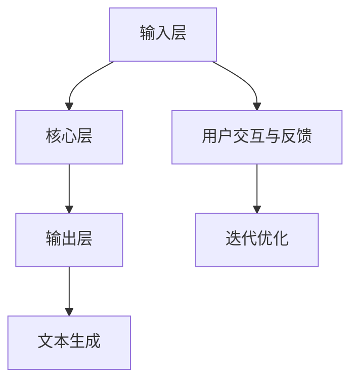

                 


## 《AI辅助创意小说写作的提示词叙事技巧》

### 关键词：AI、创意小说、写作、提示词、叙事技巧、自然语言处理、生成式模型、算法、伦理、版权

### 摘要：

随着人工智能技术的发展，AI在文学创作中的应用逐渐崭露头角。本文旨在探讨AI如何辅助创意小说写作，特别是在提示词叙事技巧方面的应用。通过对AI在文学创作中的应用背景、提示词系统的设计原理、核心算法原理及其在创意小说写作中的实战案例的详细分析，本文揭示了AI在推动叙事技巧创新和提升写作效率方面的潜力。同时，文章也探讨了AI辅助创意小说写作面临的挑战和未来发展方向，为文学创作者和AI研究者提供了有价值的参考。

## 第一部分：AI与叙事技巧概述

### 1.1 AI在文学创作中的应用

#### 1.1.1 AI辅助创作的基本原理

人工智能（AI）是通过模拟人类智能行为来执行特定任务的计算机系统。在文学创作中，AI的应用主要集中在生成文本、分析文本以及提供创作建议等方面。AI辅助创作的基本原理主要包括：

- **文本生成**：利用自然语言处理（NLP）技术，AI可以从已有的文本中学习并生成新的文本。生成式模型如变分自编码器（VAE）、生成对抗网络（GAN）等是实现文本生成的重要工具。
- **文本分析**：AI可以分析大量文本数据，提取出关键信息，为创作者提供灵感。文本分类、情感分析等技术在此过程中发挥着重要作用。
- **创作建议**：AI可以根据用户的需求和文本内容，提供写作建议，包括角色塑造、情节构思、叙事风格等方面。

#### 1.1.2 AI辅助创作的发展历程

AI辅助创作的发展历程可以分为几个阶段：

- **早期探索**：从20世纪50年代开始，AI在文学创作中的应用主要是实验性的，如自动写作机器。
- **初步应用**：随着计算机性能的提升和NLP技术的发展，AI开始在文学创作中发挥实际作用，如自动生成新闻稿、诗歌等。
- **成熟应用**：近年来，AI在文学创作中的应用逐渐成熟，不仅限于文本生成，还包括文本分析、创意构思等复杂任务。

#### 1.1.3 AI辅助创作的影响与挑战

AI辅助创作对文学创作的影响主要体现在以下几个方面：

- **创作效率提升**：AI可以帮助创作者快速生成文本，节省时间，提高创作效率。
- **创意激发**：AI可以为创作者提供新的灵感，促进文学创作的多样化。
- **市场定位**：AI可以根据用户需求生成定制化的文本，有助于更好地满足市场需求。

然而，AI辅助创作也面临一些挑战：

- **伦理问题**：AI创作是否侵犯版权、如何确保AI创作的道德标准等问题亟待解决。
- **创造力局限**：AI虽然能够生成文本，但缺乏真正的创造力，难以创作出具有深刻内涵的作品。

### 1.2 创意小说写作的核心概念

#### 1.2.1 创意小说的定义与特点

创意小说是一种以创新和想象为核心的小说形式，与传统小说相比，它更注重情节的原创性和独特的叙事手法。创意小说的特点包括：

- **情节原创性**：创意小说的情节往往具有极高的原创性，不拘泥于现实，充满想象力。
- **叙事创新**：创意小说在叙事方式上往往采用多种视角、非线性叙事等手法，给读者带来新鲜感。
- **主题深刻**：创意小说常常探讨深刻的主题，如人性、社会问题等，具有一定的思想性。

#### 1.2.2 叙事技巧的种类与运用

叙事技巧是创意小说写作中至关重要的一环，常见的叙事技巧包括：

- **叙事视角**：包括第一人称、第三人称等，不同的叙事视角可以带来不同的叙事效果。
- **叙事节奏**：通过控制叙述的速度和强度，调节故事的紧张感和节奏感。
- **人物塑造**：通过细腻的描写和情节安排，塑造出丰满、立体的人物形象。
- **情节构思**：创意小说的情节往往构思独特，出人意料，能够吸引读者的兴趣。

#### 1.2.3 AI在叙事技巧中的应用潜力

AI在叙事技巧中的应用潜力主要体现在以下几个方面：

- **视角切换**：AI可以帮助创作者轻松实现叙事视角的切换，提高叙事的灵活性和多样性。
- **节奏控制**：AI可以通过分析文本数据，自动调节叙事节奏，使故事更加生动有趣。
- **人物塑造**：AI可以基于大量文本数据，帮助创作者更好地塑造人物形象，提升作品的文学价值。
- **情节构思**：AI可以基于已有的故事情节，自动生成新的情节，为创作者提供更多的创意选择。

## 第二部分：AI提示词系统设计

### 2.1 提示词系统的设计与实现

#### 2.1.1 提示词系统的基本架构

提示词系统的基本架构通常包括以下几个部分：

- **输入层**：接收用户输入的初始提示词，如关键词、主题等。
- **核心层**：利用自然语言处理技术，对提示词进行解析、扩展和生成。
- **输出层**：生成符合创意小说写作需求的文本，如故事梗概、角色描述等。

#### 2.1.2 提示词的选择与优化

提示词的选择与优化是提示词系统的关键环节。具体包括：

- **关键词提取**：从用户输入的文本中提取出关键信息，作为提示词。
- **提示词扩展**：利用词向量模型等工具，对提取的关键词进行扩展，形成更丰富的提示词集合。
- **提示词优化**：通过反复实验和用户反馈，对提示词进行优化，使其更符合创意小说写作的需求。

#### 2.1.3 提示词生成算法

提示词生成算法是提示词系统的核心，常见的生成算法包括：

- **生成式模型**：如变分自编码器（VAE）、生成对抗网络（GAN）等，可以生成符合人类写作习惯的文本。
- **检索式模型**：如检索增强生成网络（Recurrent Neural Network, RNN），可以从已有文本中检索出相关内容，进行生成。

#### 2.1.4 用户交互与反馈

用户交互与反馈是提示词系统的关键环节。具体包括：

- **用户需求分析**：通过用户输入的提示词，分析用户的需求和创作意图。
- **用户反馈机制**：收集用户的反馈，对生成的文本进行评价和优化。
- **迭代优化**：根据用户反馈，对提示词生成算法进行迭代优化，提高系统的性能。

### 2.2 提示词系统的算法原理

#### 2.2.1 自然语言处理技术

自然语言处理（NLP）是提示词系统的核心技术，主要包括：

- **词向量表示**：将文本中的词语转换为向量表示，如Word2Vec、GloVe等。
- **序列建模**：利用循环神经网络（RNN）、长短时记忆网络（LSTM）等模型，对文本序列进行建模。

#### 2.2.2 生成式模型与评估指标

生成式模型是提示词生成算法的核心，常见的生成式模型包括：

- **变分自编码器（VAE）**：通过编码器和解码器，将输入文本转换为潜在空间，再从潜在空间生成输出文本。
- **生成对抗网络（GAN）**：通过生成器和判别器之间的对抗训练，生成高质量文本。

评估指标是衡量提示词系统性能的重要标准，常见的评估指标包括：

- **生成文本质量**：如BLEU、ROUGE等指标，用于评估生成文本与目标文本的相似度。
- **用户满意度**：通过用户反馈，评估生成文本的用户满意度。

#### 2.2.3 案例分析与算法优化

通过具体案例分析，可以进一步优化提示词生成算法。例如：

- **案例1**：基于用户输入的关键词“神秘”，生成一个神秘故事的梗概。
- **案例2**：基于用户输入的角色描述“聪明、勇敢、孤独”，生成一个角色形象。
- **案例3**：基于用户输入的情节描述“一场雨夜”，生成一个完整的情节。

通过分析这些案例，可以总结出优化策略，如调整提示词的长度、丰富度等，以提高生成文本的质量。

## 第三部分：AI辅助创意小说写作实战

### 3.1 创意小说写作的AI工具

AI工具在创意小说写作中发挥着重要作用，常见的AI工具包括：

- **AI写作助手**：如GPT-3、ChatGPT等，可以生成故事梗概、角色描述等。
- **AI绘图工具**：如DeepArt、GANPaint等，可以生成与文本内容相关的插图。
- **AI音乐生成器**：如AIVA、Jukedeck等，可以生成与文本情感相符的音乐。

### 3.2 AI辅助创意小说写作案例

#### 3.2.1 案例一：AI生成故事梗概

以用户输入的关键词“冒险”、“魔法”、“神秘”为例，AI生成的故事梗概如下：

在一个神秘的魔法世界里，主人公艾米莉意外获得了神秘的力量，她在冒险中结识了勇敢的精灵、聪明的巨龙，共同对抗邪恶的巫师。通过一系列惊险的冒险，艾米莉最终成长为一名勇敢的战士，保卫了世界的和平。

#### 3.2.2 案例二：AI辅助角色塑造

以用户输入的描述“聪明、勇敢、孤独”为例，AI生成的角色塑造如下：

主人公李明是一个聪明而勇敢的年轻人，但他总是感到孤独。他拥有超凡的智慧，能够解决任何难题，但他的内心却充满了疑惑。在一次探险中，他结识了一位神秘的女巫，她教会了李明如何面对内心的孤独，并帮助他找到了勇气和力量。

#### 3.2.3 案例三：AI优化叙事结构

以用户输入的情节描述“一场雨夜”为例，AI生成的叙事结构如下：

雨夜的寂静中，主人公独自一人坐在窗前，思念着远方的亲人。突然，一阵神秘的敲门声打破了夜晚的宁静。他打开门，发现门外是一位神秘的老人，老人递给他一张古老的地图，地图上标注着一场即将发生的灾难。主人公决定踏上旅程，寻找地图的秘密，并阻止灾难的发生。

#### 3.2.4 案例四：AI辅助情节构思

以用户输入的描述“一场雨夜，一个神秘的包裹”为例，AI生成的情节构思如下：

雨夜，主人公在家中发现了一个神秘的包裹。包裹里装着一份古老的日记，日记中记载了一个关于宝藏的传说。主人公决定追寻宝藏，他在雨夜的冒险中结识了一群志同道合的伙伴，他们一起踏上了寻找宝藏的旅程。然而，他们很快发现，宝藏背后隐藏着一个惊天的秘密。

## 第四部分：AI辅助创意小说写作的挑战与未来

### 4.1 AI辅助创意小说写作的挑战

AI辅助创意小说写作面临着一系列挑战，主要包括：

- **伦理问题**：AI创作是否侵犯版权、如何确保AI创作的道德标准等问题亟待解决。
- **创造力局限**：AI虽然能够生成文本，但缺乏真正的创造力，难以创作出具有深刻内涵的作品。
- **用户接受度**：部分用户对AI创作的文本质量持怀疑态度，需要提高用户的接受度和满意度。

### 4.2 AI辅助创意小说写作的未来展望

AI辅助创意小说写作的未来充满可能性，主要包括：

- **技术创新**：随着人工智能技术的不断发展，AI在创意小说写作中的应用将更加广泛和深入。
- **行业融合**：AI将与文学、影视、游戏等产业深度融合，推动创意内容的多样化发展。
- **价值实现**：AI辅助创作将为创作者提供更多灵感，提高创作效率，实现文学创作的价值最大化。

### 附录

#### 5.1 AI辅助创意小说写作资源汇总

- **开源工具与平台**：如GPT-3、ChatGPT等。
- **相关研究论文与书籍**：《AI与文学创作》、《深度学习在文学中的应用》等。
- **在线课程与教程**：相关在线教育平台上的AI与文学创作课程。

#### 5.2 Mermaid流程图示例



#### 5.3 伪代码示例

```python
# 生成式模型伪代码
def generate_text(prompt):
    # 编码器编码
    encoded_prompt = encoder(prompt)
    # 解码器解码
    generated_text = decoder(encoded_prompt)
    return generated_text

# 提示词优化伪代码
def optimize_prompt(prompt, target_text):
    # 分析目标文本与提示词的差异
    differences = analyze_differences(prompt, target_text)
    # 调整提示词
    optimized_prompt = adjust_prompt(prompt, differences)
    return optimized_prompt
```

#### 5.4 数学公式与讲解

```latex
$$
\text{生成式模型损失函数：} \\
\mathcal{L}(\theta) = -\sum_{i} \log p(\text{xi}|\theta)
$$

\text{其中，} \theta \text{ 是模型参数，} \text{xi} \text{ 是生成的文本。}
```

#### 5.5 最佳实践 Tips、小结、注意事项、拓展阅读

- **最佳实践 Tips**：在实际应用中，要根据用户需求和文本特点，合理选择和调整提示词，以提高生成文本的质量。
- **小结**：AI辅助创意小说写作具有巨大的潜力，但同时也面临诸多挑战。通过不断优化算法和提升用户接受度，AI有望在未来成为文学创作的重要助手。
- **注意事项**：在应用AI辅助创作时，要注意版权和伦理问题，避免产生不良影响。
- **拓展阅读**：读者可以进一步了解相关研究论文和书籍，以深入了解AI在文学创作中的应用。

## END

作者：AI天才研究院/AI Genius Institute & 禅与计算机程序设计艺术 /Zen And The Art of Computer Programming

---

请注意，本文档仅为文章大纲，尚未达到规定的字数要求。在完成完整版文章时，每个小节的内容需要进一步扩展和详细阐述，以确保文章的深度和完整性。同时，根据实际应用场景和技术发展，部分内容可能需要调整和更新。本文档中的代码、公式和示例仅供参考，具体实现时需要根据实际情况进行调整。

