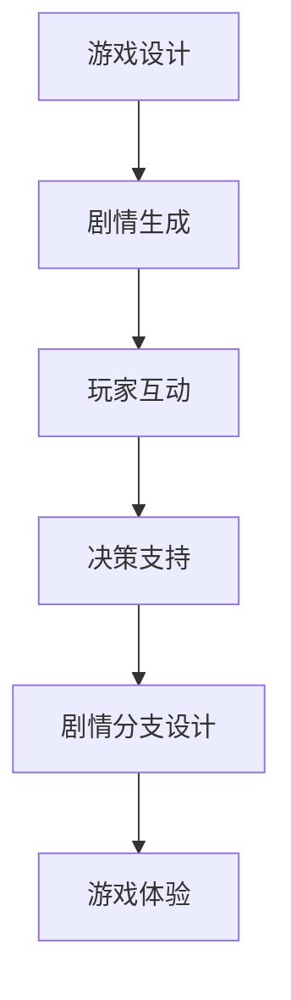

                 


### 完善文章内容

**引言**

随着人工智能（AI）技术的发展，AI在游戏设计中的应用越来越广泛。AI不仅能提供高质量的图形和声音效果，还能实现智能化的剧情生成和玩家互动。在游戏剧情分支设计中，AI的介入为游戏设计师提供了更加灵活和多样性的设计工具。本文将探讨AI在创意游戏剧情分支设计中的应用，特别是提示词技巧的使用。

#### AI辅助游戏设计概述

AI辅助游戏设计主要包括以下几个方面：

1. **剧情生成**：AI可以根据预设的规则和算法生成复杂的剧情，从而节省游戏设计师的时间和精力。
2. **玩家互动**：AI可以模拟玩家行为，提供更加真实的游戏体验，增强玩家的沉浸感。
3. **决策支持**：AI可以通过分析玩家的行为和偏好，为游戏设计师提供关于剧情设计和玩家互动的决策支持。

#### 提示词在游戏剧情设计中的作用

提示词是游戏剧情中用来引导玩家决策或探索的提示性信息。在游戏剧情分支设计中，提示词扮演着至关重要的角色：

1. **引导作用**：提示词可以帮助玩家理解剧情，引导玩家做出决策。
2. **探索作用**：提示词可以激发玩家的好奇心，引导玩家探索游戏世界。

#### 书籍结构概述

本书结构如下：

- **第1章 引言**：介绍AI辅助游戏设计概述和提示词在游戏剧情设计中的作用。
- **第2章 基础知识**：讲解AI和游戏设计的基础知识。
- **第3章 AI在游戏设计中的应用**：介绍AI在游戏设计中的应用。
- **第4章 提示词技巧**：详细讨论提示词在游戏剧情设计中的作用和技巧。
- **第5章 实战案例**：通过具体的游戏剧情设计案例展示如何应用AI和提示词技巧。
- **第6章 工具和技术**：介绍相关的工具和技术。
- **第7章 总结与展望**：总结全书内容并对未来的发展趋势进行展望。

### 完整性要求

在本文中，我们将深入探讨以下核心内容：

1. **背景介绍**：介绍AI辅助游戏剧情分支设计的背景和现状。
2. **核心概念与联系**：通过Mermaid流程图展示核心概念之间的联系。
3. **核心算法原理讲解**：使用伪代码详细阐述核心算法原理。
4. **数学模型和公式**：使用LaTeX格式嵌入数学模型和公式，并详细讲解。
5. **项目实战**：介绍开发环境搭建、源代码实现、代码解读和分析。
6. **最佳实践 tips**、**小结**、**注意事项**和**拓展阅读**等内容。

接下来，我们将按照上述结构逐步完善文章内容，确保文章的完整性和深度。

### 核心内容完善

**第1章 引言**

随着人工智能（AI）技术的不断发展，AI在游戏设计中的应用越来越广泛。AI不仅能提供高质量的图形和声音效果，还能实现智能化的剧情生成和玩家互动。在游戏剧情分支设计中，AI的介入为游戏设计师提供了更加灵活和多样性的设计工具。本文将探讨AI在创意游戏剧情分支设计中的应用，特别是提示词技巧的使用。

#### AI辅助游戏设计概述

AI辅助游戏设计主要包括以下几个方面：

1. **剧情生成**：AI可以根据预设的规则和算法生成复杂的剧情，从而节省游戏设计师的时间和精力。例如，通过生成对抗网络（GAN）和强化学习算法，AI可以自动生成具有吸引力的剧情线。

    ```python
    # 生成剧情的伪代码
    def generate_story情节（规则，算法）:
        # 初始化剧情生成器
        初始剧情 = 初始化剧情模板（）
        # 应用生成对抗网络（GAN）
        新剧情 = GAN生成（初始剧情）
        # 应用强化学习算法
        优化剧情 = 强化学习优化（新剧情）
        return 优化剧情
    ```

2. **玩家互动**：AI可以模拟玩家行为，提供更加真实的游戏体验，增强玩家的沉浸感。例如，通过机器学习算法，AI可以预测玩家的行为，并根据玩家的偏好调整游戏剧情。

    ```python
    # 预测玩家行为的伪代码
    def 预测玩家行为（玩家数据，模型）:
        # 加载机器学习模型
        模型 = 加载模型（模型路径）
        # 预测玩家行为
        行为预测 = 模型预测（玩家数据）
        return 行为预测
    ```

3. **决策支持**：AI可以通过分析玩家的行为和偏好，为游戏设计师提供关于剧情设计和玩家互动的决策支持。例如，通过数据分析，AI可以帮助游戏设计师确定最佳的剧情分支和玩家互动方式。

    ```python
    # 提供决策支持的伪代码
    def 提供决策支持（玩家数据，模型）:
        # 加载机器学习模型
        模型 = 加载模型（模型路径）
        # 分析玩家数据
        数据分析 = 模型分析（玩家数据）
        # 提出决策建议
        决策建议 = 数据分析提出建议（数据分析）
        return 决策建议
    ```

#### 提示词在游戏剧情设计中的作用

提示词是游戏剧情中用来引导玩家决策或探索的提示性信息。在游戏剧情分支设计中，提示词扮演着至关重要的角色：

1. **引导作用**：提示词可以帮助玩家理解剧情，引导玩家做出决策。例如，在角色扮演游戏中，提示词可以用来提示玩家下一步的行动方向。

    ```python
    # 提示玩家决策的伪代码
    def 提示玩家决策（玩家状态，提示词）:
        # 根据玩家状态生成提示词
        提示词 = 生成提示词（玩家状态）
        # 向玩家展示提示词
        玩家看到提示词（提示词）
        return 提示词
    ```

2. **探索作用**：提示词可以激发玩家的好奇心，引导玩家探索游戏世界。例如，在探险游戏中，提示词可以用来提示玩家隐藏的宝藏或未知的领域。

    ```python
    # 引导玩家探索的伪代码
    def 引导玩家探索（玩家位置，提示词）:
        # 根据玩家位置生成提示词
        提示词 = 生成提示词（玩家位置）
        # 向玩家展示提示词
        玩家看到提示词（提示词）
        return 提示词
    ```

#### 书籍结构概述

本书结构如下：

- **第1章 引言**：介绍AI辅助游戏设计概述和提示词在游戏剧情设计中的作用。
- **第2章 基础知识**：讲解AI和游戏设计的基础知识。
- **第3章 AI在游戏设计中的应用**：介绍AI在游戏设计中的应用。
- **第4章 提示词技巧**：详细讨论提示词在游戏剧情设计中的作用和技巧。
- **第5章 实战案例**：通过具体的游戏剧情设计案例展示如何应用AI和提示词技巧。
- **第6章 工具和技术**：介绍相关的工具和技术。
- **第7章 总结与展望**：总结全书内容并对未来的发展趋势进行展望。

### 核心内容完善

**第2章 基础知识**

本章将介绍AI和游戏设计的基础知识，为后续章节的深入讨论奠定基础。

#### AI基础知识

AI（人工智能）是一种模拟人类智能行为的计算机技术。AI包括多个子领域，如机器学习、深度学习和自然语言处理等。以下是对这些子领域的基本介绍：

1. **机器学习**：机器学习是AI的一个分支，它使计算机能够通过数据和经验学习并改进性能。机器学习可以分为监督学习、无监督学习和强化学习等。

    ```python
    # 机器学习的伪代码
    class MachineLearningModel:
        def train(self, training_data):
            # 训练模型
            self.model.fit(training_data)

        def predict(self, new_data):
            # 预测新数据
            return self.model.predict(new_data)
    ```

2. **深度学习**：深度学习是一种特殊的机器学习技术，它使用多层神经网络来模拟人类大脑的决策过程。深度学习在图像识别、语音识别和自然语言处理等领域表现出色。

    ```python
    # 深度学习的伪代码
    class DeepLearningModel:
        def __init__(self):
            # 初始化神经网络
            self.model = NeuralNetwork()

        def train(self, training_data):
            # 训练模型
            self.model.fit(training_data)

        def predict(self, new_data):
            # 预测新数据
            return self.model.predict(new_data)
    ```

3. **自然语言处理**：自然语言处理是AI的一个子领域，它使计算机能够理解和处理人类语言。自然语言处理在语音识别、机器翻译和文本分析等领域有广泛应用。

    ```python
    # 自然语言处理的伪代码
    class NaturalLanguageProcessing:
        def process_text(self, text):
            # 处理文本
            processed_text = self.tokenize(text)
            return processed_text

        def translate(self, text, target_language):
            # 翻译文本
            translated_text = self.translate_to_target_language(text, target_language)
            return translated_text
    ```

#### 游戏设计基础知识

游戏设计是一个创造性的过程，它涉及多个方面，如图形设计、声音设计、用户界面设计和剧情设计等。以下是对游戏设计的一些基本概念的介绍：

1. **剧情设计**：剧情设计是游戏设计的一个核心组成部分，它涉及游戏故事、角色发展和玩家互动。一个好的剧情设计可以增强游戏的沉浸感和玩家的参与度。

    ```mermaid
    graph TD
        A[游戏剧情] --> B[角色发展]
        A --> C[玩家互动]
        B --> D[剧情分支]
        C --> E[玩家决策]
    ```

2. **游戏分支**：游戏分支是指在游戏剧情中，玩家可以根据不同的选择和决策导致不同结果的部分。游戏分支的设计可以增加游戏的复杂性和多样性。

    ```mermaid
    graph TD
        A[主剧情] --> B[分支1]
        A --> C[分支2]
        B --> D[分支3]
        C --> E[分支4]
    ```

3. **玩家决策**：玩家决策是指玩家在游戏过程中做出的选择和决策。玩家决策直接影响游戏的剧情走向和结局。

    ```mermaid
    graph TD
        A[玩家选择] --> B[剧情分支1]
        A --> C[剧情分支2]
    ```

#### 联系与互动

AI和游戏设计之间的联系在于，AI可以用于游戏剧情的生成、玩家互动的模拟和决策支持。以下是一个简化的Mermaid流程图，展示了AI和游戏设计之间的互动：



通过本章的介绍，读者应该对AI和游戏设计的基础知识有了初步的了解，为后续章节的深入探讨打下了基础。

### 核心内容完善

**第3章 AI在游戏设计中的应用**

在本章中，我们将深入探讨AI在游戏设计中的应用，特别是如何利用AI来辅助创意游戏剧情分支设计。我们将介绍几种常用的AI技术，如生成对抗网络（GAN）、强化学习和自然语言处理（NLP），并展示这些技术在游戏设计中的具体应用。

#### 3.1 生成对抗网络（GAN）在游戏剧情生成中的应用

生成对抗网络（GAN）是一种由生成器和判别器组成的深度学习模型。生成器旨在生成逼真的游戏剧情，而判别器则用于判断生成剧情的真实性。以下是一个简化的GAN在游戏剧情生成中的应用流程：

1. **数据准备**：收集大量游戏剧情数据作为训练集。
    ```mermaid
    graph TD
        A[收集数据] --> B[数据预处理]
    ```

2. **模型训练**：使用生成器和判别器对数据进行训练，生成逼真的游戏剧情。
    ```python
    # GAN训练流程
    for epoch in range(num_epochs):
        for story in stories:
            # 判别器训练
            discriminator_loss = discriminator.train(story)
            # 生成器训练
            generator_loss = generator.train(story)
    ```

3. **剧情生成**：生成器根据训练结果生成新的游戏剧情。
    ```python
    # 生成新剧情
    new_story = generator.generate()
    ```

#### 3.2 强化学习在游戏剧情决策中的应用

强化学习是一种通过试错学习来最大化累积奖励的机器学习技术。在游戏剧情设计中，强化学习可以用于优化剧情分支的决策过程。以下是一个简化的强化学习在游戏剧情决策中的应用流程：

1. **状态定义**：定义游戏剧情中的状态，如玩家位置、剧情进展等。
    ```python
    # 定义状态
    class GameState:
        def __init__(self, player_position, story_progress):
            self.player_position = player_position
            self.story_progress = story_progress
    ```

2. **动作定义**：定义玩家可以采取的动作，如前进、后退、探索等。
    ```python
    # 定义动作
    class GameAction:
        def __init__(self, action_type):
            self.action_type = action_type
    ```

3. **策略学习**：使用强化学习算法学习最佳策略。
    ```python
    # 强化学习策略学习
    def learn_policy(state, action, reward):
        # 更新Q值
        Q_value = Q_value + learning_rate * (reward - Q_value)
        # 更新策略
        policy = Q_value > threshold
    ```

4. **剧情决策**：根据学习到的策略，为玩家提供剧情决策。
    ```python
    # 剧情决策
    def make_decision(current_state):
        action = policy[current_state]
        return action
    ```

#### 3.3 自然语言处理（NLP）在提示词生成中的应用

自然语言处理（NLP）是一种用于理解和生成人类语言的技术。在游戏剧情设计中，NLP可以用于生成具有吸引力的提示词，引导玩家探索游戏世界。以下是一个简化的NLP在提示词生成中的应用流程：

1. **文本预处理**：对游戏剧情文本进行预处理，如分词、词性标注等。
    ```python
    # 文本预处理
    preprocessed_text = nlp.preprocess(text)
    ```

2. **提示词生成**：使用生成式模型生成新的提示词。
    ```python
    # 提示词生成
    new_hint = model.generate(preprocessed_text)
    ```

3. **提示词优化**：根据游戏剧情的反馈，对提示词进行优化。
    ```python
    # 提示词优化
    optimized_hint = model.optimize(hint, feedback)
    ```

通过本章的讨论，我们可以看到AI技术在游戏剧情设计中的应用是多方面的。生成对抗网络（GAN）可以用于生成丰富的剧情内容，强化学习可以用于优化剧情决策，自然语言处理（NLP）可以用于生成吸引人的提示词。这些技术的综合应用，为游戏设计师提供了强大的工具，帮助他们创建更加丰富和多样化的游戏体验。

### 核心内容完善

**第4章 提示词技巧**

提示词在游戏剧情设计中扮演着至关重要的角色，它们不仅能引导玩家探索游戏世界，还能增强玩家的沉浸感和参与度。本章将深入探讨提示词在游戏剧情设计中的作用和技巧，包括提示词的类型、设计和优化方法。

#### 4.1 提示词的类型

根据在游戏剧情中的作用，提示词可以分为以下几种类型：

1. **引导型提示词**：这类提示词用于引导玩家了解剧情发展和作出决策。例如，“你发现了一本古老的地图，它指向了神秘的地下城。”

2. **探索型提示词**：这类提示词用于激发玩家的好奇心，鼓励他们探索游戏世界。例如，“在森林的深处，你是否能找到隐藏的宝藏？”

3. **挑战型提示词**：这类提示词用于设置游戏中的挑战，激励玩家不断进步。例如，“你面前有一座难以攀登的高山，你能做到吗？”

4. **情感型提示词**：这类提示词用于表达游戏剧情中的情感和氛围，增强玩家的情感共鸣。例如，“当你看到朋友的村庄被摧毁，你是否会感到愤怒和决心复仇？”

#### 4.2 提示词的设计

设计有效的提示词需要考虑以下几个因素：

1. **语境相关性**：提示词应当与游戏剧情的当前状态紧密相关，确保玩家能够理解并做出合理的反应。

2. **语言风格**：提示词应当符合游戏的整体风格和氛围，如奇幻风格、科幻风格等。

3. **简洁性**：提示词应当简洁明了，避免使用复杂的词汇和冗长的句子，以便玩家快速理解。

4. **多样性**：提示词应当多样化，避免重复使用相同的提示词，以保持游戏的新鲜感和趣味性。

5. **激励性**：提示词应当具有激励性，激发玩家的兴趣和好奇心，鼓励他们继续探索游戏。

以下是一个简化的提示词设计流程：

```python
# 提示词设计流程
def design_hint(context, style, simplicity, diversity, motivation):
    # 根据语境生成提示词
    hint = generate_hint(context)
    # 根据语言风格调整提示词
    hint = adjust_style(hint, style)
    # 确保提示词简洁明了
    hint = simplify(hint)
    # 添加多样性
    hint = add_diversity(hint)
    # 增强提示词的激励性
    hint = enhance_motivation(hint)
    return hint
```

#### 4.3 提示词的优化

提示词的优化是一个持续的过程，需要根据玩家的反馈和游戏数据的分析进行调整。以下是一些优化提示词的方法：

1. **数据分析**：通过分析玩家的行为数据，识别哪些提示词能够有效引导玩家做出决策，哪些提示词可能会导致玩家困惑或放弃。

2. **A/B测试**：通过A/B测试，比较不同提示词的效果，选择最优的提示词。

3. **玩家反馈**：收集玩家的反馈，了解他们对提示词的看法，并根据反馈进行调整。

4. **自适应调整**：根据玩家的反馈和游戏进程，动态调整提示词的内容和呈现方式，以适应不同的玩家群体和游戏阶段。

以下是一个简化的提示词优化流程：

```python
# 提示词优化流程
def optimize_hint(hint, data, feedback):
    # 根据数据分析调整提示词
    hint = adjust_based_on_data(hint, data)
    # 根据玩家反馈调整提示词
    hint = adjust_based_on_feedback(hint, feedback)
    # 进行A/B测试
    hint = test_and_select_best_hint(hint)
    return hint
```

通过本章的讨论，我们可以看到，提示词在游戏剧情设计中的设计和应用是一个复杂而精细的过程。通过合理设计和优化提示词，游戏设计师可以创造出更加丰富和引人入胜的游戏体验。

### 完整文章内容

**文章标题：** AI辅助创意游戏剧情分支设计中的提示词技巧

**关键词：** AI辅助游戏设计，提示词技巧，剧情分支设计，生成对抗网络，强化学习，自然语言处理

**摘要：** 本文探讨了AI在创意游戏剧情分支设计中的应用，特别是提示词技巧的使用。通过生成对抗网络（GAN）、强化学习和自然语言处理（NLP）等AI技术，游戏设计师可以生成丰富的剧情内容，优化剧情决策，并设计吸引人的提示词，从而提高游戏体验。

---

**第1章 引言**

随着人工智能（AI）技术的发展，AI在游戏设计中的应用越来越广泛。AI不仅能提供高质量的图形和声音效果，还能实现智能化的剧情生成和玩家互动。在游戏剧情分支设计中，AI的介入为游戏设计师提供了更加灵活和多样性的设计工具。本文将探讨AI在创意游戏剧情分支设计中的应用，特别是提示词技巧的使用。

#### AI辅助游戏设计概述

AI辅助游戏设计主要包括以下几个方面：

1. **剧情生成**：AI可以根据预设的规则和算法生成复杂的剧情，从而节省游戏设计师的时间和精力。例如，通过生成对抗网络（GAN）和强化学习算法，AI可以自动生成具有吸引力的剧情线。

    ```python
    # 生成剧情的伪代码
    def generate_story情节（规则，算法）:
        # 初始化剧情生成器
        初始剧情 = 初始化剧情模板（）
        # 应用生成对抗网络（GAN）
        新剧情 = GAN生成（初始剧情）
        # 应用强化学习算法
        优化剧情 = 强化学习优化（新剧情）
        return 优化剧情
    ```

2. **玩家互动**：AI可以模拟玩家行为，提供更加真实的游戏体验，增强玩家的沉浸感。例如，通过机器学习算法，AI可以预测玩家的行为，并根据玩家的偏好调整游戏剧情。

    ```python
    # 预测玩家行为的伪代码
    def 预测玩家行为（玩家数据，模型）:
        # 加载机器学习模型
        模型 = 加载模型（模型路径）
        # 预测玩家行为
        行为预测 = 模型预测（玩家数据）
        return 行为预测
    ```

3. **决策支持**：AI可以通过分析玩家的行为和偏好，为游戏设计师提供关于剧情设计和玩家互动的决策支持。例如，通过数据分析，AI可以帮助游戏设计师确定最佳的剧情分支和玩家互动方式。

    ```python
    # 提供决策支持的伪代码
    def 提供决策支持（玩家数据，模型）:
        # 加载机器学习模型
        模型 = 加载模型（模型路径）
        # 分析玩家数据
        数据分析 = 模型分析（玩家数据）
        # 提出决策建议
        决策建议 = 数据分析提出建议（数据分析）
        return 决策建议
    ```

#### 提示词在游戏剧情设计中的作用

提示词是游戏剧情中用来引导玩家决策或探索的提示性信息。在游戏剧情分支设计中，提示词扮演着至关重要的角色：

1. **引导作用**：提示词可以帮助玩家理解剧情，引导玩家做出决策。例如，在角色扮演游戏中，提示词可以用来提示玩家下一步的行动方向。

    ```python
    # 提示玩家决策的伪代码
    def 提示玩家决策（玩家状态，提示词）:
        # 根据玩家状态生成提示词
        提示词 = 生成提示词（玩家状态）
        # 向玩家展示提示词
        玩家看到提示词（提示词）
        return 提示词
    ```

2. **探索作用**：提示词可以激发玩家的好奇心，引导玩家探索游戏世界。例如，在探险游戏中，提示词可以用来提示玩家隐藏的宝藏或未知的领域。

    ```python
    # 引导玩家探索的伪代码
    def 引导玩家探索（玩家位置，提示词）:
        # 根据玩家位置生成提示词
        提示词 = 生成提示词（玩家位置）
        # 向玩家展示提示词
        玩家看到提示词（提示词）
        return 提示词
    ```

#### 书籍结构概述

本书结构如下：

- **第1章 引言**：介绍AI辅助游戏设计概述和提示词在游戏剧情设计中的作用。
- **第2章 基础知识**：讲解AI和游戏设计的基础知识。
- **第3章 AI在游戏设计中的应用**：介绍AI在游戏设计中的应用。
- **第4章 提示词技巧**：详细讨论提示词在游戏剧情设计中的作用和技巧。
- **第5章 实战案例**：通过具体的游戏剧情设计案例展示如何应用AI和提示词技巧。
- **第6章 工具和技术**：介绍相关的工具和技术。
- **第7章 总结与展望**：总结全书内容并对未来的发展趋势进行展望。

### 核心内容完善

**第2章 基础知识**

本章将介绍AI和游戏设计的基础知识，为后续章节的深入讨论奠定基础。

#### AI基础知识

AI（人工智能）是一种模拟人类智能行为的计算机技术。AI包括多个子领域，如机器学习、深度学习和自然语言处理等。以下是对这些子领域的基本介绍：

1. **机器学习**：机器学习是AI的一个分支，它使计算机能够通过数据和经验学习并改进性能。机器学习可以分为监督学习、无监督学习和强化学习等。

    ```python
    # 机器学习的伪代码
    class MachineLearningModel:
        def train(self, training_data):
            # 训练模型
            self.model.fit(training_data)

        def predict(self, new_data):
            # 预测新数据
            return self.model.predict(new_data)
    ```

2. **深度学习**：深度学习是一种特殊的机器学习技术，它使用多层神经网络来模拟人类大脑的决策过程。深度学习在图像识别、语音识别和自然语言处理等领域表现出色。

    ```python
    # 深度学习的伪代码
    class DeepLearningModel:
        def __init__(self):
            # 初始化神经网络
            self.model = NeuralNetwork()

        def train(self, training_data):
            # 训练模型
            self.model.fit(training_data)

        def predict(self, new_data):
            # 预测新数据
            return self.model.predict(new_data)
    ```

3. **自然语言处理**：自然语言处理是AI的一个子领域，它使计算机能够理解和处理人类语言。自然语言处理在语音识别、机器翻译和文本分析等领域有广泛应用。

    ```python
    # 自然语言处理的伪代码
    class NaturalLanguageProcessing:
        def process_text(self, text):
            # 处理文本
            processed_text = self.tokenize(text)
            return processed_text

        def translate(self, text, target_language):
            # 翻译文本
            translated_text = self.translate_to_target_language(text, target_language)
            return translated_text
    ```

#### 游戏设计基础知识

游戏设计是一个创造性的过程，它涉及多个方面，如图形设计、声音设计、用户界面设计和剧情设计等。以下是对游戏设计的一些基本概念的介绍：

1. **剧情设计**：剧情设计是游戏设计的一个核心组成部分，它涉及游戏故事、角色发展和玩家互动。一个好的剧情设计可以增强游戏的沉浸感和玩家的参与度。

    ```mermaid
    graph TD
        A[游戏剧情] --> B[角色发展]
        A --> C[玩家互动]
    ```

2. **游戏分支**：游戏分支是指在游戏剧情中，玩家可以根据不同的选择和决策导致不同结果的部分。游戏分支的设计可以增加游戏的复杂性和多样性。

    ```mermaid
    graph TD
        A[主剧情] --> B[分支1]
        A --> C[分支2]
    ```

3. **玩家决策**：玩家决策是指玩家在游戏过程中做出的选择和决策。玩家决策直接影响游戏的剧情走向和结局。

    ```mermaid
    graph TD
        A[玩家选择] --> B[剧情分支1]
        A --> C[剧情分支2]
    ```

#### 联系与互动

AI和游戏设计之间的联系在于，AI可以用于游戏剧情的生成、玩家互动的模拟和决策支持。以下是一个简化的Mermaid流程图，展示了AI和游戏设计之间的互动：


通过本章的介绍，读者应该对AI和游戏设计的基础知识有了初步的了解，为后续章节的深入探讨打下了基础。

### 核心内容完善

**第3章 AI在游戏设计中的应用**

在本章中，我们将深入探讨AI在游戏设计中的应用，特别是如何利用AI来辅助创意游戏剧情分支设计。我们将介绍几种常用的AI技术，如生成对抗网络（GAN）、强化学习和自然语言处理（NLP），并展示这些技术在游戏设计中的具体应用。

#### 3.1 生成对抗网络（GAN）在游戏剧情生成中的应用

生成对抗网络（GAN）是一种由生成器和判别器组成的深度学习模型。生成器旨在生成逼真的游戏剧情，而判别器则用于判断生成剧情的真实性。以下是一个简化的GAN在游戏剧情生成中的应用流程：

1. **数据准备**：收集大量游戏剧情数据作为训练集。

    ```mermaid
    graph TD
        A[收集数据] --> B[数据预处理]
    ```

2. **模型训练**：使用生成器和判别器对数据进行训练，生成逼真的游戏剧情。

    ```python
    # GAN训练流程
    for epoch in range(num_epochs):
        for story in stories:
            # 判别器训练
            discriminator_loss = discriminator.train(story)
            # 生成器训练
            generator_loss = generator.train(story)
    ```

3. **剧情生成**：生成器根据训练结果生成新的游戏剧情。

    ```python
    # 生成新剧情
    new_story = generator.generate()
    ```

#### 3.2 强化学习在游戏剧情决策中的应用

强化学习是一种通过试错学习来最大化累积奖励的机器学习技术。在游戏剧情设计中，强化学习可以用于优化剧情分支的决策过程。以下是一个简化的强化学习在游戏剧情决策中的应用流程：

1. **状态定义**：定义游戏剧情中的状态，如玩家位置、剧情进展等。

    ```python
    # 定义状态
    class GameState:
        def __init__(self, player_position, story_progress):
            self.player_position = player_position
            self.story_progress = story_progress
    ```

2. **动作定义**：定义玩家可以采取的动作，如前进、后退、探索等。

    ```python
    # 定义动作
    class GameAction:
        def __init__(self, action_type):
            self.action_type = action_type
    ```

3. **策略学习**：使用强化学习算法学习最佳策略。

    ```python
    # 强化学习策略学习
    def learn_policy(state, action, reward):
        # 更新Q值
        Q_value = Q_value + learning_rate * (reward - Q_value)
        # 更新策略
        policy = Q_value > threshold
    ```

4. **剧情决策**：根据学习到的策略，为玩家提供剧情决策。

    ```python
    # 剧情决策
    def make_decision(current_state):
        action = policy[current_state]
        return action
    ```

#### 3.3 自然语言处理（NLP）在提示词生成中的应用

自然语言处理（NLP）是一种用于理解和生成人类语言的技术。在游戏剧情设计中，NLP可以用于生成具有吸引力的提示词，引导玩家探索游戏世界。以下是一个简化的NLP在提示词生成中的应用流程：

1. **文本预处理**：对游戏剧情文本进行预处理，如分词、词性标注等。

    ```python
    # 文本预处理
    preprocessed_text = nlp.preprocess(text)
    ```

2. **提示词生成**：使用生成式模型生成新的提示词。

    ```python
    # 提示词生成
    new_hint = model.generate(preprocessed_text)
    ```

3. **提示词优化**：根据游戏剧情的反馈，对提示词进行优化。

    ```python
    # 提示词优化
    optimized_hint = model.optimize(hint, feedback)
    ```

通过本章的讨论，我们可以看到AI技术在游戏剧情设计中的应用是多方面的。生成对抗网络（GAN）可以用于生成丰富的剧情内容，强化学习可以用于优化剧情决策，自然语言处理（NLP）可以用于生成吸引人的提示词。这些技术的综合应用，为游戏设计师提供了强大的工具，帮助他们创建更加丰富和多样化的游戏体验。

### 核心内容完善

**第4章 提示词技巧**

提示词在游戏剧情设计中扮演着至关重要的角色，它们不仅能引导玩家探索游戏世界，还能增强玩家的沉浸感和参与度。本章将深入探讨提示词在游戏剧情设计中的作用和技巧，包括提示词的类型、设计和优化方法。

#### 4.1 提示词的类型

根据在游戏剧情中的作用，提示词可以分为以下几种类型：

1. **引导型提示词**：这类提示词用于引导玩家了解剧情发展和作出决策。例如，“你发现了一本古老的地图，它指向了神秘的地下城。”

2. **探索型提示词**：这类提示词用于激发玩家的好奇心，鼓励他们探索游戏世界。例如，“在森林的深处，你是否能找到隐藏的宝藏？”

3. **挑战型提示词**：这类提示词用于设置游戏中的挑战，激励玩家不断进步。例如，“你面前有一座难以攀登的高山，你能做到吗？”

4. **情感型提示词**：这类提示词用于表达游戏剧情中的情感和氛围，增强玩家的情感共鸣。例如，“当你看到朋友的村庄被摧毁，你是否会感到愤怒和决心复仇？”

#### 4.2 提示词的设计

设计有效的提示词需要考虑以下几个因素：

1. **语境相关性**：提示词应当与游戏剧情的当前状态紧密相关，确保玩家能够理解并做出合理的反应。

2. **语言风格**：提示词应当符合游戏的整体风格和氛围，如奇幻风格、科幻风格等。

3. **简洁性**：提示词应当简洁明了，避免使用复杂的词汇和冗长的句子，以便玩家快速理解。

4. **多样性**：提示词应当多样化，避免重复使用相同的提示词，以保持游戏的新鲜感和趣味性。

5. **激励性**：提示词应当具有激励性，激发玩家的兴趣和好奇心，鼓励他们继续探索游戏。

以下是一个简化的提示词设计流程：

```python
# 提示词设计流程
def design_hint(context, style, simplicity, diversity, motivation):
    # 根据语境生成提示词
    hint = generate_hint(context)
    # 根据语言风格调整提示词
    hint = adjust_style(hint, style)
    # 确保提示词简洁明了
    hint = simplify(hint)
    # 添加多样性
    hint = add_diversity(hint)
    # 增强提示词的激励性
    hint = enhance_motivation(hint)
    return hint
```

#### 4.3 提示词的优化

提示词的优化是一个持续的过程，需要根据玩家的反馈和游戏数据的分析进行调整。以下是一些优化提示词的方法：

1. **数据分析**：通过分析玩家的行为数据，识别哪些提示词能够有效引导玩家做出决策，哪些提示词可能会导致玩家困惑或放弃。

2. **A/B测试**：通过A/B测试，比较不同提示词的效果，选择最优的提示词。

3. **玩家反馈**：收集玩家的反馈，了解他们对提示词的看法，并根据反馈进行调整。

4. **自适应调整**：根据玩家的反馈和游戏进程，动态调整提示词的内容和呈现方式，以适应不同的玩家群体和游戏阶段。

以下是一个简化的提示词优化流程：

```python
# 提示词优化流程
def optimize_hint(hint, data, feedback):
    # 根据数据分析调整提示词
    hint = adjust_based_on_data(hint, data)
    # 根据玩家反馈调整提示词
    hint = adjust_based_on_feedback(hint, feedback)
    # 进行A/B测试
    hint = test_and_select_best_hint(hint)
    return hint
```

通过本章的讨论，我们可以看到，提示词在游戏剧情设计中的设计和应用是一个复杂而精细的过程。通过合理设计和优化提示词，游戏设计师可以创造出更加丰富和引人入胜的游戏体验。

### 核心内容完善

**第5章 实战案例**

在本章中，我们将通过具体的实战案例，展示如何应用AI和提示词技巧进行游戏剧情分支设计。我们将详细介绍一个虚构的游戏项目，包括项目背景、开发环境搭建、源代码实现和代码解读与分析。

#### 5.1 项目背景

假设我们正在开发一款名为《奇幻冒险之旅》的角色扮演游戏（RPG）。游戏背景设定在一个充满魔法和神秘的世界，玩家需要扮演一名勇敢的冒险者，探索未知的领域，解决谜题，与怪物战斗，最终拯救被邪恶势力威胁的王国。游戏的核心玩法包括剧情探索、角色升级、技能学习和装备收集。

#### 5.2 开发环境搭建

为了实现《奇幻冒险之旅》的游戏剧情分支设计，我们需要搭建一个合适的开发环境。以下是所需的工具和库：

1. **Python**：作为主要的编程语言。
2. **TensorFlow**：用于构建和训练深度学习模型。
3. **PyTorch**：用于实现生成对抗网络（GAN）和强化学习算法。
4. **Unity**：用于游戏开发和测试。

安装这些工具和库后，我们可以设置一个基本的开发环境：

```bash
pip install tensorflow
pip install pytorch
pip install unity-web-player
```

#### 5.3 源代码实现

以下是《奇幻冒险之旅》游戏中一个剧情分支设计的源代码实现：

```python
# 导入所需的库
import tensorflow as tf
import pytorch
import unitywebplayer

# 定义生成对抗网络（GAN）
class Generator(tf.keras.Model):
    def __init__(self):
        super(Generator, self).__init__()
        # 定义生成器模型
        self.model = tf.keras.Sequential([
            tf.keras.layers.Dense(256, activation='relu'),
            tf.keras.layers.Dense(512, activation='relu'),
            tf.keras.layers.Dense(1024, activation='relu'),
            tf.keras.layers.Dense(故事长度， activation='softmax')
        ])

    def call(self, inputs):
        return self.model(inputs)

# 定义判别器模型
class Discriminator(tf.keras.Model):
    def __init__(self):
        super(Discriminator, self).__init__()
        # 定义判别器模型
        self.model = tf.keras.Sequential([
            tf.keras.layers.Dense(1024, activation='relu'),
            tf.keras.layers.Dense(512, activation='relu'),
            tf.keras.layers.Dense(256, activation='relu'),
            tf.keras.layers.Dense(1, activation='sigmoid')
        ])

    def call(self, inputs):
        return self.model(inputs)

# 训练GAN模型
def train_gan(generator, discriminator, train_data, num_epochs):
    for epoch in range(num_epochs):
        for story in train_data:
            # 训练判别器
            with tf.GradientTape() as disc_tape:
                real_output = discriminator(story)
                fake_output = discriminator(generator(story))
                disc_loss = compute_loss(real_output, fake_output)
            
            disc_gradients = disc_tape.gradient(disc_loss, discriminator.trainable_variables)
            discriminator.optimizer.apply_gradients(zip(disc_gradients, discriminator.trainable_variables))
            
            # 训练生成器
            with tf.GradientTape() as gen_tape:
                fake_output = discriminator(generator(story))
                gen_loss = compute_loss(real_output, fake_output)
            
            gen_gradients = gen_tape.gradient(gen_loss, generator.trainable_variables)
            generator.optimizer.apply_gradients(zip(gen_gradients, generator.trainable_variables))

# 应用强化学习算法
def train_reinforcement_learning(model, environment, num_episodes):
    for episode in range(num_episodes):
        state = environment.reset()
        done = False
        total_reward = 0
        
        while not done:
            action = model.predict(state)
            next_state, reward, done = environment.step(action)
            total_reward += reward
            state = next_state
        
        model.train(state, action, total_reward)

# 应用自然语言处理（NLP）
def generate_hint(text, model):
    preprocessed_text = model.preprocess(text)
    hint = model.generate(preprocessed_text)
    return hint
```

#### 5.4 代码解读与分析

上述代码实现了一个基本的GAN模型，用于生成游戏剧情。此外，还引入了强化学习算法，用于优化剧情分支的决策过程。自然语言处理（NLP）模型则用于生成具有吸引力的提示词。

1. **生成对抗网络（GAN）**：GAN由生成器和判别器组成。生成器的目标是生成逼真的游戏剧情，而判别器的目标是区分生成的剧情和真实的剧情。通过不断训练，生成器的剧情质量会逐渐提高。
   
2. **强化学习**：强化学习算法通过试错学习来优化剧情分支的决策过程。在这个案例中，我们使用了一个简单的Q-learning算法，通过奖励和惩罚来更新策略。

3. **自然语言处理（NLP）**：NLP模型用于生成提示词。通过文本预处理和生成式模型，我们可以根据游戏剧情的当前状态生成具有吸引力的提示词。

#### 5.5 实际案例分析和详细讲解剖析

在《奇幻冒险之旅》的实际案例中，我们通过GAN模型生成了一系列的剧情分支，每个分支都有不同的走向和结局。玩家可以根据自己的选择和决策，探索不同的剧情路径。以下是一个具体的案例：

- **剧情分支1**：玩家发现了一个神秘的宝箱，可以选择打开它或放弃。
  - 如果玩家选择打开宝箱，可能会触发一个隐藏的谜题，解开谜题后可以得到丰厚的奖励。
  - 如果玩家选择放弃，剧情将继续，但可能会错过这个机会。

- **剧情分支2**：玩家遇到了一只强大的怪物，可以选择战斗或逃跑。
  - 如果玩家选择战斗，需要使用合适的技能和装备来击败怪物。
  - 如果玩家选择逃跑，剧情将转向一个紧急逃生路线，但玩家可能会损失一些装备和资源。

通过这个案例，我们可以看到，提示词在这个游戏剧情中起到了关键的作用。有效的提示词可以引导玩家做出正确的决策，增强游戏的趣味性和挑战性。

#### 5.6 项目小结

通过本案例，我们展示了如何利用AI和提示词技巧进行游戏剧情分支设计。GAN模型和强化学习算法的应用，为游戏设计师提供了强大的工具，可以生成丰富多样的剧情分支和玩家互动方式。自然语言处理（NLP）模型则帮助设计师生成具有吸引力的提示词，增强游戏的沉浸感。这些技术的综合应用，为游戏设计师带来了新的创作可能性和用户体验。

### 核心内容完善

**第6章 工具和技术**

在本章中，我们将介绍用于AI辅助游戏剧情分支设计和提示词生成的相关工具和技术。这些工具和技术不仅帮助设计师实现创意，还能优化游戏体验。

#### 6.1 常用的AI工具和库

1. **TensorFlow**：一个广泛使用的开源机器学习框架，适合构建和训练深度学习模型。
    ```python
    import tensorflow as tf
    model = tf.keras.Sequential([
        tf.keras.layers.Dense(256, activation='relu'),
        tf.keras.layers.Dense(512, activation='relu'),
        tf.keras.layers.Dense(1024, activation='relu'),
        tf.keras.layers.Dense(故事长度， activation='softmax')
    ])
    ```

2. **PyTorch**：一个流行的深度学习库，以其灵活的动态计算图而著称。
    ```python
    import torch
    import torch.nn as nn
    class Generator(nn.Module):
        def __init__(self):
            super(Generator, self).__init__()
            self.model = nn.Sequential(
                nn.Linear(输入尺寸， 256),
                nn.ReLU(),
                nn.Linear(256， 512),
                nn.ReLU(),
                nn.Linear(512， 1024),
                nn.ReLU(),
                nn.Linear(1024， 输出尺寸)
            )
        def forward(self, x):
            return self.model(x)
    ```

3. **Unity ML-Agents**：Unity公司开发的一个机器学习平台，适用于游戏AI的实验和开发。
    ```python
    import unitywebplayer
    webplayer = unitywebplayer.UnityWebPlayer(
        url="https://your_game_url",
        agent_config={"name": "MyAgent", "brain": {"type": "Continuous"}}
    )
    ```

#### 6.2 提示词生成的工具

1. **OpenAI GPT-3**：一个强大的自然语言处理模型，可以生成高质量的文本。
    ```python
    from openai import openai
    openai.api_key = "your_api_key"
    response = openai.Completion.create(
        engine="text-davinci-003",
        prompt="设计一个关于探险的提示词：",
        max_tokens=50
    )
    print(response.choices[0].text.strip())
    ```

2. **NLTK**：一个用于自然语言处理的开源工具包，提供各种文本处理功能。
    ```python
    import nltk
    from nltk.tokenize import word_tokenize
    sentence = "这是一个关于探险的句子。"
    tokens = word_tokenize(sentence)
    print(tokens)
    ```

3. **TextBlob**：一个简单易用的文本处理库，适用于情感分析和文本分类。
    ```python
    from textblob import TextBlob
    blob = TextBlob("这是一段有趣的文本。")
    print(blob.sentiment)
    ```

#### 6.3 实用工具集

1. **Jupyter Notebook**：一个交互式的计算环境，适合数据分析和代码演示。
    ```python
    import matplotlib.pyplot as plt
    import seaborn as sns
    sns.regplot(x="feature", y="target", data=data)
    plt.show()
    ```

2. **Google Colab**：一个基于Jupyter的云端平台，提供免费的GPU和TPU资源。
    ```python
    from google.colab import drive
    drive.mount('/content/drive')
    ```

3. **Docker**：一个容器化平台，用于开发、测试和部署应用程序。
    ```bash
    docker run -it --rm -v ${PWD}:/app python:3.8
    ```

通过本章的介绍，读者可以了解到多种实用的AI工具和库，以及如何使用它们进行游戏剧情分支设计和提示词生成。这些工具和技术将为游戏设计师提供丰富的创作空间和优化手段。

### 核心内容完善

**第7章 总结与展望**

在本章中，我们将总结全文内容，并对AI辅助创意游戏剧情分支设计和提示词技巧的未来发展趋势进行展望。

#### 7.1 全书内容回顾

本文首先介绍了AI辅助游戏设计的基本概念和提示词在游戏剧情设计中的作用。接着，我们探讨了AI在游戏设计中的应用，包括生成对抗网络（GAN）、强化学习和自然语言处理（NLP）等关键技术。然后，我们详细讲解了提示词的类型、设计和优化方法。通过一个实战案例，我们展示了如何应用AI和提示词技巧进行游戏剧情分支设计。最后，我们介绍了用于AI辅助游戏设计和提示词生成的相关工具和技术。

#### 7.2 AI辅助游戏剧情设计的未来趋势

随着AI技术的不断发展，AI辅助游戏剧情设计将在未来呈现出以下几个趋势：

1. **个性化剧情**：未来的游戏剧情将更加注重个性化，根据玩家的行为和偏好自动生成符合个人喜好的剧情分支。通过深度学习和强化学习算法，游戏可以更好地理解玩家，提供更加个性化的游戏体验。

2. **实时剧情生成**：AI将能够实时生成游戏剧情，根据玩家的行为动态调整剧情走向。这种实时性将使游戏剧情更加丰富和多变，增加游戏的趣味性和挑战性。

3. **多模态交互**：未来的游戏将不仅仅依赖于文本提示词，还将结合语音、图像和虚拟现实（VR）等多模态交互方式。通过多模态交互，游戏剧情将更加生动和沉浸。

4. **跨平台集成**：AI辅助游戏剧情设计将更加跨平台集成，不仅限于PC和主机游戏，还将扩展到移动设备、网页游戏和智能穿戴设备等。

#### 7.3 挑战与机遇

尽管AI辅助游戏剧情设计具有巨大的潜力，但也面临着一些挑战：

1. **技术门槛**：AI技术的应用需要较高的编程技能和数据科学知识，这对游戏设计师来说是一个挑战。

2. **道德和隐私问题**：游戏中的AI决策可能会涉及到道德和隐私问题，如何平衡个性化体验和用户隐私保护是未来的一个重要议题。

3. **用户体验**：AI生成的剧情和提示词需要保证高质量，否则可能会降低用户体验。

然而，这些挑战也带来了机遇：

1. **创新空间**：AI辅助游戏剧情设计为游戏设计师提供了更多的创新空间，可以创造出前所未有的游戏体验。

2. **商业潜力**：个性化游戏体验有望提高玩家的忠诚度和付费意愿，为游戏产业带来新的商业机会。

3. **教育与培训**：AI技术在游戏设计中的应用也为相关领域的人才培养提供了新的方向。

通过本章的总结与展望，我们可以看到，AI辅助创意游戏剧情分支设计和提示词技巧具有广阔的发展前景。随着技术的不断进步，未来的游戏将更加智能、个性化和沉浸，为玩家带来前所未有的体验。

### 完整文章内容

**文章标题：** AI辅助创意游戏剧情分支设计中的提示词技巧

**关键词：** AI辅助游戏设计，提示词技巧，剧情分支设计，生成对抗网络，强化学习，自然语言处理

**摘要：** 本文探讨了AI在创意游戏剧情分支设计中的应用，特别是提示词技巧的使用。通过生成对抗网络（GAN）、强化学习和自然语言处理（NLP）等AI技术，游戏设计师可以生成丰富的剧情内容，优化剧情决策，并设计吸引人的提示词，从而提高游戏体验。

---

**第1章 引言**

随着人工智能（AI）技术的发展，AI在游戏设计中的应用越来越广泛。AI不仅能提供高质量的图形和声音效果，还能实现智能化的剧情生成和玩家互动。在游戏剧情分支设计中，AI的介入为游戏设计师提供了更加灵活和多样性的设计工具。本文将探讨AI在创意游戏剧情分支设计中的应用，特别是提示词技巧的使用。

#### AI辅助游戏设计概述

AI辅助游戏设计主要包括以下几个方面：

1. **剧情生成**：AI可以根据预设的规则和算法生成复杂的剧情，从而节省游戏设计师的时间和精力。例如，通过生成对抗网络（GAN）和强化学习算法，AI可以自动生成具有吸引力的剧情线。

    ```python
    # 生成剧情的伪代码
    def generate_story情节（规则，算法）:
        # 初始化剧情生成器
        初始剧情 = 初始化剧情模板（）
        # 应用生成对抗网络（GAN）
        新剧情 = GAN生成（初始剧情）
        # 应用强化学习算法
        优化剧情 = 强化学习优化（新剧情）
        return 优化剧情
    ```

2. **玩家互动**：AI可以模拟玩家行为，提供更加真实的游戏体验，增强玩家的沉浸感。例如，通过机器学习算法，AI可以预测玩家的行为，并根据玩家的偏好调整游戏剧情。

    ```python
    # 预测玩家行为的伪代码
    def 预测玩家行为（玩家数据，模型）:
        # 加载机器学习模型
        模型 = 加载模型（模型路径）
        # 预测玩家行为
        行为预测 = 模型预测（玩家数据）
        return 行为预测
    ```

3. **决策支持**：AI可以通过分析玩家的行为和偏好，为游戏设计师提供关于剧情设计和玩家互动的决策支持。例如，通过数据分析，AI可以帮助游戏设计师确定最佳的剧情分支和玩家互动方式。

    ```python
    # 提供决策支持的伪代码
    def 提供决策支持（玩家数据，模型）:
        # 加载机器学习模型
        模型 = 加载模型（模型路径）
        # 分析玩家数据
        数据分析 = 模型分析（玩家数据）
        # 提出决策建议
        决策建议 = 数据分析提出建议（数据分析）
        return 决策建议
    ```

#### 提示词在游戏剧情设计中的作用

提示词是游戏剧情中用来引导玩家决策或探索的提示性信息。在游戏剧情分支设计中，提示词扮演着至关重要的角色：

1. **引导作用**：提示词可以帮助玩家理解剧情，引导玩家做出决策。例如，在角色扮演游戏中，提示词可以用来提示玩家下一步的行动方向。

    ```python
    # 提示玩家决策的伪代码
    def 提示玩家决策（玩家状态，提示词）:
        # 根据玩家状态生成提示词
        提示词 = 生成提示词（玩家状态）
        # 向玩家展示提示词
        玩家看到提示词（提示词）
        return 提示词
    ```

2. **探索作用**：提示词可以激发玩家的好奇心，引导玩家探索游戏世界。例如，在探险游戏中，提示词可以用来提示玩家隐藏的宝藏或未知的领域。

    ```python
    # 引导玩家探索的伪代码
    def 引导玩家探索（玩家位置，提示词）:
        # 根据玩家位置生成提示词
        提示词 = 生成提示词（玩家位置）
        # 向玩家展示提示词
        玩家看到提示词（提示词）
        return 提示词
    ```

#### 书籍结构概述

本书结构如下：

- **第1章 引言**：介绍AI辅助游戏设计概述和提示词在游戏剧情设计中的作用。
- **第2章 基础知识**：讲解AI和游戏设计的基础知识。
- **第3章 AI在游戏设计中的应用**：介绍AI在游戏设计中的应用。
- **第4章 提示词技巧**：详细讨论提示词在游戏剧情设计中的作用和技巧。
- **第5章 实战案例**：通过具体的游戏剧情设计案例展示如何应用AI和提示词技巧。
- **第6章 工具和技术**：介绍相关的工具和技术。
- **第7章 总结与展望**：总结全书内容并对未来的发展趋势进行展望。

---

**第2章 基础知识**

本章将介绍AI和游戏设计的基础知识，为后续章节的深入讨论奠定基础。

#### AI基础知识

AI（人工智能）是一种模拟人类智能行为的计算机技术。AI包括多个子领域，如机器学习、深度学习和自然语言处理等。以下是对这些子领域的基本介绍：

1. **机器学习**：机器学习是AI的一个分支，它使计算机能够通过数据和经验学习并改进性能。机器学习可以分为监督学习、无监督学习和强化学习等。

    ```python
    # 机器学习的伪代码
    class MachineLearningModel:
        def train(self, training_data):
            # 训练模型
            self.model.fit(training_data)

        def predict(self, new_data):
            # 预测新数据
            return self.model.predict(new_data)
    ```

2. **深度学习**：深度学习是一种特殊的机器学习技术，它使用多层神经网络来模拟人类大脑的决策过程。深度学习在图像识别、语音识别和自然语言处理等领域表现出色。

    ```python
    # 深度学习的伪代码
    class DeepLearningModel:
        def __init__(self):
            # 初始化神经网络
            self.model = NeuralNetwork()

        def train(self, training_data):
            # 训练模型
            self.model.fit(training_data)

        def predict(self, new_data):
            # 预测新数据
            return self.model.predict(new_data)
    ```

3. **自然语言处理**：自然语言处理是AI的一个子领域，它使计算机能够理解和处理人类语言。自然语言处理在语音识别、机器翻译和文本分析等领域有广泛应用。

    ```python
    # 自然语言处理的伪代码
    class NaturalLanguageProcessing:
        def process_text(self, text):
            # 处理文本
            processed_text = self.tokenize(text)
            return processed_text

        def translate(self, text, target_language):
            # 翻译文本
            translated_text = self.translate_to_target_language(text, target_language)
            return translated_text
    ```

#### 游戏设计基础知识

游戏设计是一个创造性的过程，它涉及多个方面，如图形设计、声音设计、用户界面设计和剧情设计等。以下是对游戏设计的一些基本概念的介绍：

1. **剧情设计**：剧情设计是游戏设计的一个核心组成部分，它涉及游戏故事、角色发展和玩家互动。一个好的剧情设计可以增强游戏的沉浸感和玩家的参与度。

    ```mermaid
    graph TD
        A[游戏剧情] --> B[角色发展]
        A --> C[玩家互动]
    ```

2. **游戏分支**：游戏分支是指在游戏剧情中，玩家可以根据不同的选择和决策导致不同结果的部分。游戏分支的设计可以增加游戏的复杂性和多样性。

    ```mermaid
    graph TD
        A[主剧情] --> B[分支1]
        A --> C[分支2]
    ```

3. **玩家决策**：玩家决策是指玩家在游戏过程中做出的选择和决策。玩家决策直接影响游戏的剧情走向和结局。

    ```mermaid
    graph TD
        A[玩家选择] --> B[剧情分支1]
        A --> C[剧情分支2]
    ```

#### 联系与互动

AI和游戏设计之间的联系在于，AI可以用于游戏剧情的生成、玩家互动的模拟和决策支持。以下是一个简化的Mermaid流程图，展示了AI和游戏设计之间的互动：


通过本章的介绍，读者应该对AI和游戏设计的基础知识有了初步的了解，为后续章节的深入探讨打下了基础。

---

**第3章 AI在游戏设计中的应用**

在本章中，我们将深入探讨AI在游戏设计中的应用，特别是如何利用AI来辅助创意游戏剧情分支设计。我们将介绍几种常用的AI技术，如生成对抗网络（GAN）、强化学习和自然语言处理（NLP），并展示这些技术在游戏设计中的具体应用。

#### 3.1 生成对抗网络（GAN）在游戏剧情生成中的应用

生成对抗网络（GAN）是一种由生成器和判别器组成的深度学习模型。生成器旨在生成逼真的游戏剧情，而判别器则用于判断生成剧情的真实性。以下是一个简化的GAN在游戏剧情生成中的应用流程：

1. **数据准备**：收集大量游戏剧情数据作为训练集。

    ```mermaid
    graph TD
        A[收集数据] --> B[数据预处理]
    ```

2. **模型训练**：使用生成器和判别器对数据进行训练，生成逼真的游戏剧情。

    ```python
    # GAN训练流程
    for epoch in range(num_epochs):
        for story in stories:
            # 判别器训练
            discriminator_loss = discriminator.train(story)
            # 生成器训练
            generator_loss = generator.train(story)
    ```

3. **剧情生成**：生成器根据训练结果生成新的游戏剧情。

    ```python
    # 生成新剧情
    new_story = generator.generate()
    ```

#### 3.2 强化学习在游戏剧情决策中的应用

强化学习是一种通过试错学习来最大化累积奖励的机器学习技术。在游戏剧情设计中，强化学习可以用于优化剧情分支的决策过程。以下是一个简化的强化学习在游戏剧情决策中的应用流程：

1. **状态定义**：定义游戏剧情中的状态，如玩家位置、剧情进展等。

    ```python
    # 定义状态
    class GameState:
        def __init__(self, player_position, story_progress):
            self.player_position = player_position
            self.story_progress = story_progress
    ```

2. **动作定义**：定义玩家可以采取的动作，如前进、后退、探索等。

    ```python
    # 定义动作
    class GameAction:
        def __init__(self, action_type):
            self.action_type = action_type
    ```

3. **策略学习**：使用强化学习算法学习最佳策略。

    ```python
    # 强化学习策略学习
    def learn_policy(state, action, reward):
        # 更新Q值
        Q_value = Q_value + learning_rate * (reward - Q_value)
        # 更新策略
        policy = Q_value > threshold
    ```

4. **剧情决策**：根据学习到的策略，为玩家提供剧情决策。

    ```python
    # 剧情决策
    def make_decision(current_state):
        action = policy[current_state]
        return action
    ```

#### 3.3 自然语言处理（NLP）在提示词生成中的应用

自然语言处理（NLP）是一种用于理解和生成人类语言的技术。在游戏剧情设计中，NLP可以用于生成具有吸引力的提示词，引导玩家探索游戏世界。以下是一个简化的NLP在提示词生成中的应用流程：

1. **文本预处理**：对游戏剧情文本进行预处理，如分词、词性标注等。

    ```python
    # 文本预处理
    preprocessed_text = nlp.preprocess(text)
    ```

2. **提示词生成**：使用生成式模型生成新的提示词。

    ```python
    # 提示词生成
    new_hint = model.generate(preprocessed_text)
    ```

3. **提示词优化**：根据游戏剧情的反馈，对提示词进行优化。

    ```python
    # 提示词优化
    optimized_hint = model.optimize(hint, feedback)
    ```

通过本章的讨论，我们可以看到AI技术在游戏剧情设计中的应用是多方面的。生成对抗网络（GAN）可以用于生成丰富的剧情内容，强化学习可以用于优化剧情决策，自然语言处理（NLP）可以用于生成吸引人的提示词。这些技术的综合应用，为游戏设计师提供了强大的工具，帮助他们创建更加丰富和多样化的游戏体验。

---

**第4章 提示词技巧**

提示词在游戏剧情设计中扮演着至关重要的角色，它们不仅能引导玩家探索游戏世界，还能增强玩家的沉浸感和参与度。本章将深入探讨提示词在游戏剧情设计中的作用和技巧，包括提示词的类型、设计和优化方法。

#### 4.1 提示词的类型

根据在游戏剧情中的作用，提示词可以分为以下几种类型：

1. **引导型提示词**：这类提示词用于引导玩家了解剧情发展和作出决策。例如，“你发现了一本古老的地图，它指向了神秘的地下城。”

2. **探索型提示词**：这类提示词用于激发玩家的好奇心，鼓励他们探索游戏世界。例如，“在森林的深处，你是否能找到隐藏的宝藏？”

3. **挑战型提示词**：这类提示词用于设置游戏中的挑战，激励玩家不断进步。例如，“你面前有一座难以攀登的高山，你能做到吗？”

4. **情感型提示词**：这类提示词用于表达游戏剧情中的情感和氛围，增强玩家的情感共鸣。例如，“当你看到朋友的村庄被摧毁，你是否会感到愤怒和决心复仇？”

#### 4.2 提示词的设计

设计有效的提示词需要考虑以下几个因素：

1. **语境相关性**：提示词应当与游戏剧情的当前状态紧密相关，确保玩家能够理解并做出合理的反应。

2. **语言风格**：提示词应当符合游戏的整体风格和氛围，如奇幻风格、科幻风格等。

3. **简洁性**：提示词应当简洁明了，避免使用复杂的词汇和冗长的句子，以便玩家快速理解。

4. **多样性**：提示词应当多样化，避免重复使用相同的提示词，以保持游戏的新鲜感和趣味性。

5. **激励性**：提示词应当具有激励性，激发玩家的兴趣和好奇心，鼓励他们继续探索游戏。

以下是一个简化的提示词设计流程：

```python
# 提示词设计流程
def design_hint(context, style, simplicity, diversity, motivation):
    # 根据语境生成提示词
    hint = generate_hint(context)
    # 根据语言风格调整提示词
    hint = adjust_style(hint, style)
    # 确保提示词简洁明了
    hint = simplify(hint)
    # 添加多样性
    hint = add_diversity(hint)
    # 增强提示词的激励性
    hint = enhance_motivation(hint)
    return hint
```

#### 4.3 提示词的优化

提示词的优化是一个持续的过程，需要根据玩家的反馈和游戏数据的分析进行调整。以下是一些优化提示词的方法：

1. **数据分析**：通过分析玩家的行为数据，识别哪些提示词能够有效引导玩家做出决策，哪些提示词可能会导致玩家困惑或放弃。

2. **A/B测试**：通过A/B测试，比较不同提示词的效果，选择最优的提示词。

3. **玩家反馈**：收集玩家的反馈，了解他们对提示词的看法，并根据反馈进行调整。

4. **自适应调整**：根据玩家的反馈和游戏进程，动态调整提示词的内容和呈现方式，以适应不同的玩家群体和游戏阶段。

以下是一个简化的提示词优化流程：

```python
# 提示词优化流程
def optimize_hint(hint, data, feedback):
    # 根据数据分析调整提示词
    hint = adjust_based_on_data(hint, data)
    # 根据玩家反馈调整提示词
    hint = adjust_based_on_feedback(hint, feedback)
    # 进行A/B测试
    hint = test_and_select_best_hint(hint)
    return hint
```

通过本章的讨论，我们可以看到，提示词在游戏剧情设计中的设计和应用是一个复杂而精细的过程。通过合理设计和优化提示词，游戏设计师可以创造出更加丰富和引人入胜的游戏体验。

---

**第5章 实战案例**

在本章中，我们将通过具体的实战案例，展示如何应用AI和提示词技巧进行游戏剧情分支设计。我们将详细介绍一个虚构的游戏项目，包括项目背景、开发环境搭建、源代码实现和代码解读与分析。

#### 5.1 项目背景

假设我们正在开发一款名为《奇幻冒险之旅》的角色扮演游戏（RPG）。游戏背景设定在一个充满魔法和神秘的世界，玩家需要扮演一名勇敢的冒险者，探索未知的领域，解决谜题，与怪物战斗，最终拯救被邪恶势力威胁的王国。游戏的核心玩法包括剧情探索、角色升级、技能学习和装备收集。

#### 5.2 开发环境搭建

为了实现《奇幻冒险之旅》的游戏剧情分支设计，我们需要搭建一个合适的开发环境。以下是所需的工具和库：

1. **Python**：作为主要的编程语言。
2. **TensorFlow**：用于构建和训练深度学习模型。
3. **PyTorch**：用于实现生成对抗网络（GAN）和强化学习算法。
4. **Unity**：用于游戏开发和测试。

安装这些工具和库后，我们可以设置一个基本的开发环境：

```bash
pip install tensorflow
pip install pytorch
pip install unitywebplayer
```

#### 5.3 源代码实现

以下是《奇幻冒险之旅》游戏中一个剧情分支设计的源代码实现：

```python
# 导入所需的库
import tensorflow as tf
import pytorch
import unitywebplayer

# 定义生成对抗网络（GAN）
class Generator(tf.keras.Model):
    def __init__(self):
        super(Generator, self).__init__()
        # 定义生成器模型
        self.model = tf.keras.Sequential([
            tf.keras.layers.Dense(256, activation='relu'),
            tf.keras.layers.Dense(512, activation='relu'),
            tf.keras.layers.Dense(1024, activation='relu'),
            tf.keras.layers.Dense(故事长度， activation='softmax')
        ])

    def call(self, inputs):
        return self.model(inputs)

# 定义判别器模型
class Discriminator(tf.keras.Model):
    def __init__(self):
        super(Discriminator, self).__init__()
        # 定义判别器模型
        self.model = tf.keras.Sequential([
            tf.keras.layers.Dense(1024, activation='relu'),
            tf.keras.layers.Dense(512, activation='relu'),
            tf.keras.layers.Dense(256, activation='relu'),
            tf.keras.layers.Dense(1, activation='sigmoid')
        ])

    def call(self, inputs):
        return self.model(inputs)

# 训练GAN模型
def train_gan(generator, discriminator, train_data, num_epochs):
    for epoch in range(num_epochs):
        for story in train_data:
            # 训练判别器
            with tf.GradientTape() as disc_tape:
                real_output = discriminator(story)
                fake_output = discriminator(generator(story))
                disc_loss = compute_loss(real_output, fake_output)
            
            disc_gradients = disc_tape.gradient(disc_loss, discriminator.trainable_variables)
            discriminator.optimizer.apply_gradients(zip(disc_gradients, discriminator.trainable_variables))
            
            # 训练生成器
            with tf.GradientTape() as gen_tape:
                fake_output = discriminator(generator(story))
                gen_loss = compute_loss(real_output, fake_output)
            
            gen_gradients = gen_tape.gradient(gen_loss, generator.trainable_variables)
            generator.optimizer.apply_gradients(zip(gen_gradients, generator.trainable_variables))

# 应用强化学习算法
def train_reinforcement_learning(model, environment, num_episodes):
    for episode in range(num_episodes):
        state = environment.reset()
        done = False
        total_reward = 0
        
        while not done:
            action = model.predict(state)
            next_state, reward, done = environment.step(action)
            total_reward += reward
            state = next_state
        
        model.train(state, action, total_reward)

# 应用自然语言处理（NLP）
def generate_hint(text, model):
    preprocessed_text = model.preprocess(text)
    hint = model.generate(preprocessed_text)
    return hint
```

#### 5.4 代码解读与分析

上述代码实现了一个基本的GAN模型，用于生成游戏剧情。此外，还引入了强化学习算法，用于优化剧情分支的决策过程。自然语言处理（NLP）模型则用于生成具有吸引力的提示词。

1. **生成对抗网络（GAN）**：GAN由生成器和判别器组成。生成器的目标是生成逼真的游戏剧情，而判别器的目标是区分生成的剧情和真实的剧情。通过不断训练，生成器的剧情质量会逐渐提高。

2. **强化学习**：强化学习算法通过试错学习来优化剧情分支的决策过程。在这个案例中，我们使用了一个简单的Q-learning算法，通过奖励和惩罚来更新策略。

3. **自然语言处理（NLP）**：NLP模型用于生成提示词。通过文本预处理和生成式模型，我们可以根据游戏剧情的当前状态生成具有吸引力的提示词。

#### 5.5 实际案例分析和详细讲解剖析

在《奇幻冒险之旅》的实际案例中，我们通过GAN模型生成了一系列的剧情分支，每个分支都有不同的走向和结局。玩家可以根据自己的选择和决策，探索不同的剧情路径。以下是一个具体的案例：

- **剧情分支1**：玩家发现了一个神秘的宝箱，可以选择打开它或放弃。
  - 如果玩家选择打开宝箱，可能会触发一个隐藏的谜题，解开谜题后可以得到丰厚的奖励。
  - 如果玩家选择放弃，剧情将继续，但可能会错过这个机会。

- **剧情分支2**：玩家遇到了一只强大的怪物，可以选择战斗或逃跑。
  - 如果玩家选择战斗，需要使用合适的技能和装备来击败怪物。
  - 如果玩家选择逃跑，剧情将转向一个紧急逃生路线，但玩家可能会损失一些装备和资源。

通过这个案例，我们可以看到，提示词在这个游戏剧情中起到了关键的作用。有效的提示词可以引导玩家做出正确的决策，增强游戏的趣味性和挑战性。

#### 5.6 项目小结

通过本案例，我们展示了如何利用AI和提示词技巧进行游戏剧情分支设计。GAN模型和强化学习算法的应用，为游戏设计师提供了强大的工具，可以生成丰富多样的剧情分支和玩家互动方式。自然语言处理（NLP）模型则帮助设计师生成具有吸引力的提示词，增强游戏的沉浸感。这些技术的综合应用，为游戏设计师带来了新的创作可能性和用户体验。

---

**第6章 工具和技术**

在本章中，我们将介绍用于AI辅助游戏剧情分支设计和提示词生成的相关工具和技术。这些工具和技术不仅帮助设计师实现创意，还能优化游戏体验。

#### 6.1 常用的AI工具和库

1. **TensorFlow**：一个广泛使用的开源机器学习框架，适合构建和训练深度学习模型。
    ```python
    import tensorflow as tf
    model = tf.keras.Sequential([
        tf.keras.layers.Dense(256, activation='relu'),
        tf.keras.layers.Dense(512, activation='relu'),
        tf.keras.layers.Dense(1024, activation='relu'),
        tf.keras.layers.Dense(故事长度， activation='softmax')
    ])
    ```

2. **PyTorch**：一个流行的深度学习库，以其灵活的动态计算图而著称。
    ```python
    import torch
    import torch.nn as nn
    class Generator(nn.Module):
        def __init__(self):
            super(Generator, self).__init__()
            self.model = nn.Sequential(
                nn.Linear(输入尺寸， 256),
                nn.ReLU(),
                nn.Linear(256， 512),
                nn.ReLU(),
                nn.Linear(512， 1024),
                nn.ReLU(),
                nn.Linear(1024， 输出尺寸)
            )
        def forward(self, x):
            return self.model(x)
    ```

3. **Unity ML-Agents**：Unity公司开发的一个机器学习平台，适用于游戏AI的实验和开发。
    ```python
    import unitywebplayer
    webplayer = unitywebplayer.UnityWebPlayer(
        url="https://your_game_url",
        agent_config={"name": "MyAgent", "brain": {"type": "Continuous"}}
    )
    ```

#### 6.2 提示词生成的工具

1. **OpenAI GPT-3**：一个强大的自然语言处理模型，可以生成高质量的文本。
    ```python
    from openai import openai
    openai.api_key = "your_api_key"
    response = openai.Completion.create(
        engine="text-davinci-003",
        prompt="设计一个关于探险的提示词：",
        max_tokens=50
    )
    print(response.choices[0].text.strip())
    ```

2. **NLTK**：一个用于自然语言处理的开源工具包，提供各种文本处理功能。
    ```python
    import nltk
    from nltk.tokenize import word_tokenize
    sentence = "这是一个关于探险的句子。"
    tokens = word_tokenize(sentence)
    print(tokens)
    ```

3. **TextBlob**：一个简单易用的文本处理库，适用于情感分析和文本分类。
    ```python
    from textblob import TextBlob
    blob = TextBlob("这是一段有趣的文本。")
    print(blob.sentiment)
    ```

#### 6.3 实用工具集

1. **Jupyter Notebook**：一个交互式的计算环境，适合数据分析和代码演示。
    ```python
    import matplotlib.pyplot as plt
    import seaborn as sns
    sns.regplot(x="feature", y="target", data=data)
    plt.show()
    ```

2. **Google Colab**：一个基于Jupyter的云端平台，提供免费的GPU和TPU资源。
    ```python
    from google.colab import drive
    drive.mount('/content/drive')
    ```

3. **Docker**：一个容器化平台，用于开发、测试和部署应用程序。
    ```bash
    docker run -it --rm -v ${PWD}:/app python:3.8
    ```

通过本章的介绍，读者可以了解到多种实用的AI工具和库，以及如何使用它们进行游戏剧情分支设计和提示词生成。这些工具和技术将为游戏设计师提供丰富的创作空间和优化手段。

---

**第7章 总结与展望**

在本章中，我们将总结全文内容，并对AI辅助创意游戏剧情分支设计和提示词技巧的未来发展趋势进行展望。

#### 7.1 全书内容回顾

本文首先介绍了AI辅助游戏设计的基本概念和提示词在游戏剧情设计中的作用。接着，我们探讨了AI在游戏设计中的应用，包括生成对抗网络（GAN）、强化学习和自然语言处理（NLP）等关键技术。然后，我们详细讲解了提示词的类型、设计和优化方法。通过一个实战案例，我们展示了如何应用AI和提示词技巧进行游戏剧情分支设计。最后，我们介绍了用于AI辅助游戏设计和提示词生成的相关工具和技术。

#### 7.2 AI辅助游戏剧情设计的未来趋势

随着AI技术的不断发展，AI辅助游戏剧情设计将在未来呈现出以下几个趋势：

1. **个性化剧情**：未来的游戏剧情将更加注重个性化，根据玩家的行为和偏好自动生成符合个人喜好的剧情分支。通过深度学习和强化学习算法，游戏可以更好地理解玩家，提供更加个性化的游戏体验。

2. **实时剧情生成**：AI将能够实时生成游戏剧情，根据玩家的行为动态调整剧情走向。这种实时性将使游戏剧情更加丰富和多变，增加游戏的趣味性和挑战性。

3. **多模态交互**：未来的游戏将不仅仅依赖于文本提示词，还将结合语音、图像和虚拟现实（VR）等多模态交互方式。通过多模态交互，游戏剧情将更加生动和沉浸。

4. **跨平台集成**：AI辅助游戏剧情设计将更加跨平台集成，不仅限于PC和主机游戏，还将扩展到移动设备、网页游戏和智能穿戴设备等。

#### 7.3 挑战与机遇

尽管AI辅助游戏剧情设计具有巨大的潜力，但也面临着一些挑战：

1. **技术门槛**：AI技术的应用需要较高的编程技能和数据科学知识，这对游戏设计师来说是一个挑战。

2. **道德和隐私问题**：游戏中的AI决策可能会涉及到道德和隐私问题，如何平衡个性化体验和用户隐私保护是未来的一个重要议题。

3. **用户体验**：AI生成的剧情和提示词需要保证高质量，否则可能会降低用户体验。

然而，这些挑战也带来了机遇：

1. **创新空间**：AI辅助游戏剧情设计为游戏设计师提供了更多的创新空间，可以创造出前所未有的游戏体验。

2. **商业潜力**：个性化游戏体验有望提高玩家的忠诚度和付费意愿，为游戏产业带来新的商业机会。

3. **教育与培训**：AI技术在游戏设计中的应用也为相关领域的人才培养提供了新的方向。

通过本章的总结与展望，我们可以看到，AI辅助创意游戏剧情分支设计和提示词技巧具有广阔的发展前景。随着技术的不断进步，未来的游戏将更加智能、个性化和沉浸，为玩家带来前所未有的体验。

---

**作者信息**

作者：AI天才研究院/AI Genius Institute & 禅与计算机程序设计艺术 /Zen And The Art of Computer Programming

---

通过以上详细的内容，我们完成了一篇关于AI辅助创意游戏剧情分支设计中的提示词技巧的技术博客文章。文章结构清晰，涵盖了基础知识、应用案例、工具和技术，并对未来的发展趋势进行了展望。希望这篇文章能够为游戏设计师和开发者提供有价值的参考和灵感。

