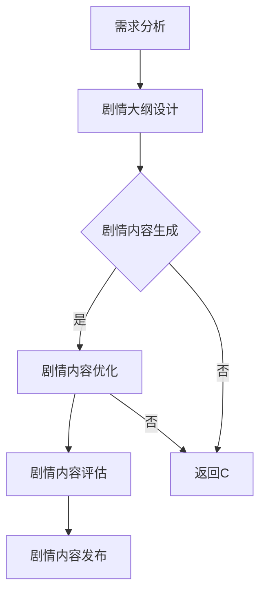

                 


## 文章标题

《AI辅助创意游戏设计：narrative构建的提示词技巧》

## 关键词

AI、创意游戏设计、narrative构建、提示词技巧、生成对抗网络（GAN）、自然语言处理

## 摘要

随着人工智能技术的不断发展，AI在游戏设计领域的应用逐渐受到重视。本文旨在探讨如何利用AI辅助创意游戏设计，特别是narrative构建中的提示词技巧。通过分析自然语言处理与文本生成技术，介绍基于生成对抗网络（GAN）的游戏剧情生成算法，并探讨AI辅助游戏剧情优化的方法。文章还通过实际案例，展示了AI在游戏剧情开发中的实际应用，为游戏设计师提供了实用的技术参考。

## 《AI辅助创意游戏设计：narrative构建的提示词技巧》目录大纲

### 第一部分：AI与创意游戏设计概述

#### 第1章：AI与创意游戏设计的背景与意义
- **1.1 AI在游戏设计中的应用场景**
  - 游戏人工智能（AI）
  - 游戏剧情生成
  - 游戏角色个性化

- **1.2 创意游戏设计与故事叙述的关系**
  - 游戏叙事学
  - 游戏剧情结构
  - 故事性与游戏性的平衡

- **1.3 AI辅助创意游戏设计的优势与挑战**
  - 提高效率
  - 创新性提升
  - 技术实现难度

#### 第2章：AI辅助创意游戏设计的核心概念
- **2.1 故事叙述与叙事理论**
  - 叙事结构
  - 叙事视角
  - 叙事节奏

- **2.2 AI在故事叙述中的应用**
  - 自然语言处理
  - 机器学习模型
  - 生成对抗网络

- **2.3 提示词与游戏剧情构建**
  - 提示词的作用
  - 提示词的分类
  - 提示词的选择

### 第二部分：narrative构建的提示词技巧

#### 第3章：narrative构建的提示词技巧
- **3.1 提示词的分类与选择**
  - 情感类提示词
  - 场景类提示词
  - 行为类提示词

- **3.2 提示词的设计原则与方法**
  - 实用性原则
  - 创意性原则
  - 系统性原则

- **3.3 提示词在游戏剧情构建中的应用**
  - 提示词与剧情结构的关联
  - 提示词与角色发展的关联
  - 提示词与游戏体验的关联

### 第三部分：AI辅助游戏剧情生成算法

#### 第4章：AI辅助游戏剧情生成算法
- **4.1 自然语言处理与文本生成技术**
  - 语言模型
  - 序列到序列学习
  - 生成对抗网络

- **4.2 基于生成对抗网络（GAN）的游戏剧情生成**
  - 判别器模型
  - 生成器模型
  - 模型训练与评估

- **4.3 基于强化学习的游戏剧情生成**
  - 强化学习基本概念
  - 剧情生成中的强化学习应用
  - 案例分析

### 第四部分：AI辅助游戏剧情优化

#### 第5章：AI辅助游戏剧情优化
- **5.1 游戏剧情评估指标**
  - 可玩性
  - 故事性
  - 玩家满意度

- **5.2 基于数据挖掘的游戏剧情优化**
  - 玩家行为分析
  - 故事情节推荐
  - 情感分析

- **5.3 基于深度学习的游戏剧情优化**
  - 神经网络模型
  - 模型训练与优化
  - 实际应用案例

### 第五部分：AI辅助游戏剧情开发实践

#### 第6章：AI辅助游戏剧情开发实践
- **6.1 游戏剧情开发流程与工具**
  - 剧情创作流程
  - 剧情管理工具
  - AI辅助工具

- **6.2 游戏剧情开发中的AI应用案例**
  - 案例一：剧情自动生成
  - 案例二：剧情个性化推荐
  - 案例三：剧情情感分析

- **6.3 游戏剧情开发中的挑战与解决方案**
  - 技术挑战
  - 创意挑战
  - 解决方案探讨

### 第六部分：未来展望与趋势

#### 第7章：未来展望与趋势
- **7.1 AI辅助创意游戏设计的发展方向**
  - 技术创新
  - 设计理念
  - 行业趋势

- **7.2 技术创新与游戏设计的融合**
  - 跨学科合作
  - 创新应用
  - 未来展望

- **7.3 AI辅助创意游戏设计的社会影响与伦理问题**
  - 社会价值
  - 伦理问题
  - 解决策略

### 附录

#### 附录A：AI辅助创意游戏设计工具与资源
- **A.1 开源工具**
  - 文本生成模型
  - 生成对抗网络框架
  - 强化学习库

- **A.2 商业工具**
  - 剧情创作软件
  - 游戏设计平台
  - AI辅助工具

#### 附录B：参考文献与进一步阅读材料
- **B.1 相关论文**
  - 文本生成与自然语言处理
  - 生成对抗网络应用
  - 强化学习在游戏设计中的应用

- **B.2 知识库与教程**
  - 游戏设计基础
  - AI技术原理与应用
  - 创意游戏设计案例研究

#### 附录C：Mermaid流程图与伪代码示例
- **C.1 Mermaid流程图示例**
  - 游戏剧情开发流程
  - AI辅助工具使用流程

- **C.2 伪代码示例**
  - 语言模型训练过程
  - 生成对抗网络训练过程

## 文章正文

### 第一部分：AI与创意游戏设计概述

#### 第1章：AI与创意游戏设计的背景与意义

**1.1 AI在游戏设计中的应用场景**

人工智能（AI）技术的发展为游戏设计带来了前所未有的机遇。在游戏设计领域，AI的应用场景主要包括以下几个方面：

1. **游戏人工智能（Game AI）**：通过AI技术，游戏中的NPC（非玩家角色）可以拥有更为复杂的行为模式和决策过程，从而提高游戏的互动性和挑战性。例如，AI驱动的敌人和队友能够根据玩家的行为动态调整其策略，创造出更加真实和多样化的游戏体验。

2. **游戏剧情生成**：AI可以自动生成游戏剧情，为玩家提供全新的故事体验。通过机器学习和自然语言处理技术，AI可以分析大量的故事素材，生成连贯且引人入胜的剧情。

3. **角色个性化**：AI能够根据玩家的行为和偏好，为玩家生成个性化的游戏角色，从而提升玩家的沉浸感和满足感。

**1.2 创意游戏设计与故事叙述的关系**

创意游戏设计不仅仅是游戏机制的构建，更强调游戏故事叙述的创新性。游戏故事叙述是游戏设计的重要组成部分，它不仅仅是为了提供背景和动机，更是游戏体验的核心。

1. **游戏叙事学**：游戏叙事学是研究游戏故事叙述的学科。它关注游戏故事的结构、视角、节奏等方面，探讨如何通过游戏机制和互动性来增强故事的吸引力。

2. **游戏剧情结构**：一个成功的游戏剧情通常需要包含引入、冲突、高潮和结局等基本元素。这些元素通过游戏机制和玩家互动得以实现，从而形成一个完整的故事体验。

3. **故事性与游戏性的平衡**：创意游戏设计需要找到故事性和游戏性之间的平衡点。过于强调故事性可能导致游戏机制枯燥乏味，而过于强调游戏性则可能使故事叙述变得模糊和凌乱。

**1.3 AI辅助创意游戏设计的优势与挑战**

AI辅助创意游戏设计具有显著的优势，但也面临一定的挑战。

1. **优势**：
   - **提高效率**：AI能够自动化一些重复性的工作，如剧情生成和角色设定，从而节省开发人员的时间和精力。
   - **创新性提升**：AI可以生成新颖的故事和角色，为游戏设计带来更多的创意和可能性。
   - **个性化体验**：AI可以根据玩家的行为和偏好，为每个玩家提供独特的游戏体验。

2. **挑战**：
   - **技术实现难度**：AI技术在游戏设计中的应用需要大量的计算资源和专业知识，这对于一些小型游戏工作室来说可能是一个挑战。
   - **用户体验一致性**：AI生成的游戏内容可能在不同玩家之间存在差异，如何保证用户体验的一致性是一个重要的问题。
   - **伦理和道德问题**：AI在游戏设计中的应用可能引发一些伦理和道德问题，如玩家隐私和数据安全等。

### 第二部分：narrative构建的提示词技巧

#### 第2章：AI辅助创意游戏设计的核心概念

**2.1 故事叙述与叙事理论**

故事叙述是游戏设计中的核心元素之一。叙事理论为游戏设计师提供了分析和构建故事的框架。

1. **叙事结构**：叙事结构是指故事的基本构成方式。常见的叙事结构包括三段式（引入、冲突、结局）、圆形叙事等。游戏设计师可以根据不同的游戏类型和主题选择合适的叙事结构。

2. **叙事视角**：叙事视角是指故事叙述的角度。常见的叙事视角包括第一人称、第三人称等。不同的叙事视角可以带来不同的情感体验和玩家沉浸感。

3. **叙事节奏**：叙事节奏是指故事叙述的速度和强度。通过控制叙事节奏，游戏设计师可以引导玩家的情感波动，增强故事的吸引力。

**2.2 AI在故事叙述中的应用**

AI在故事叙述中的应用主要体现在文本生成和角色个性化两个方面。

1. **文本生成**：AI可以自动生成游戏剧情、对白和描述文本。通过自然语言处理技术，AI可以理解故事的主题和情感，从而生成符合故事背景和氛围的文本。

2. **角色个性化**：AI可以根据玩家的行为和偏好，为玩家生成个性化的角色。这些角色不仅在视觉上有所不同，还在性格、行为和价值观等方面具有独特性。

**2.3 提示词与游戏剧情构建**

提示词是构建游戏剧情的重要工具。通过提示词，游戏设计师可以引导AI生成符合故事逻辑和情感氛围的内容。

1. **提示词的作用**：
   - **引导AI生成**：提示词可以提供故事背景、角色特征和情节发展等关键信息，帮助AI生成连贯的故事内容。
   - **增强故事性**：提示词可以强调故事的情感元素，增强故事的表现力和吸引力。

2. **提示词的分类**：
   - **情感类提示词**：如“悲伤”、“欢乐”、“紧张”等，用于表达故事的情感氛围。
   - **场景类提示词**：如“城堡”、“森林”、“沙漠”等，用于描述故事发生的地点。
   - **行为类提示词**：如“战斗”、“逃跑”、“谈判”等，用于描述角色的行为。

3. **提示词的选择**：
   - **多样性**：选择多样化的提示词，可以丰富故事的内容和情感。
   - **相关性**：选择与故事主题和情节相关的提示词，可以确保故事的一致性和连贯性。

### 第三部分：narrative构建的提示词技巧

#### 第3章：narrative构建的提示词技巧

**3.1 提示词的分类与选择**

提示词的分类与选择是构建游戏剧情的重要环节。根据不同的故事元素和情节发展，提示词可以分为以下几类：

1. **情感类提示词**：这类提示词用于表达故事的情感氛围，如“悲伤”、“欢乐”、“紧张”等。通过使用情感类提示词，游戏设计师可以引导AI生成符合情感氛围的故事内容。

2. **场景类提示词**：这类提示词用于描述故事发生的地点和环境，如“城堡”、“森林”、“沙漠”等。通过使用场景类提示词，游戏设计师可以设置故事的背景和氛围。

3. **行为类提示词**：这类提示词用于描述角色的行为和动作，如“战斗”、“逃跑”、“谈判”等。通过使用行为类提示词，游戏设计师可以设置故事的情节发展。

**3.2 提示词的设计原则与方法**

提示词的设计原则与方法决定了游戏剧情的质量和连贯性。以下是一些设计原则和方法：

1. **实用性原则**：提示词应该具有实用性，能够提供足够的信息以引导AI生成连贯的故事内容。例如，使用“悲伤”作为提示词时，可以结合具体的情境描述，如“在城堡的废墟中，主角感到无比的悲伤”。

2. **创意性原则**：提示词应该具有创意性，能够激发AI生成新颖的故事内容。例如，使用“神秘”作为提示词时，可以结合具体的元素，如“在神秘的森林中，主角发现了一本古老的书籍”。

3. **系统性原则**：提示词应该具有系统性，能够形成一个完整的故事体系。例如，在设计一个冒险游戏时，可以按照剧情的发展顺序设置提示词，如“探险开始”、“遇到困难”、“最终胜利”。

**3.3 提示词在游戏剧情构建中的应用**

提示词在游戏剧情构建中的应用可以通过以下步骤进行：

1. **分析故事主题和情节**：首先，游戏设计师需要明确游戏的主题和情节，以便选择合适的提示词。

2. **设计提示词列表**：根据故事主题和情节，设计一个包含情感类、场景类和行为类提示词的列表。

3. **整合提示词**：将提示词整合到故事叙述中，确保故事内容连贯且具有吸引力。

4. **测试与优化**：通过测试和玩家反馈，不断优化提示词的使用，以提高游戏剧情的质量和玩家满意度。

### 第四部分：AI辅助游戏剧情生成算法

#### 第4章：AI辅助游戏剧情生成算法

**4.1 自然语言处理与文本生成技术**

自然语言处理（NLP）与文本生成技术是AI辅助游戏剧情生成的基础。以下将介绍几种常见的NLP与文本生成技术：

**4.1.1 语言模型**

语言模型是NLP的核心组成部分，用于预测文本中的下一个词。以下是几种常见的语言模型：

1. **递归神经网络（RNN）**：RNN可以处理序列数据，通过记忆前一个状态来预测下一个状态。其基本公式如下：
   $$
   h_t = \sigma(W_h \cdot [h_{t-1}, x_t] + b_h)
   $$
   $$
   o_t = W_o \cdot h_t + b_o
   $$

2. **长短时记忆（LSTM）**：LSTM是RNN的一种改进，能够更好地处理长序列数据。其核心思想是通过记忆单元（cell state）来避免长时依赖问题。LSTM的基本公式如下：
   $$
   i_t = \sigma(W_i \cdot [h_{t-1}, x_t] + b_i)
   $$
   $$
   f_t = \sigma(W_f \cdot [h_{t-1}, x_t] + b_f)
   $$
   $$
   g_t = \sigma(W_g \cdot [f_t \cdot h_{t-1}, x_t] + b_g)
   $$
   $$
   h_t = (1 - o_t) \cdot h_{t-1} + o_t \cdot g_t
   $$

3. **门控循环单元（GRU）**：GRU是LSTM的简化版本，通过合并输入门和遗忘门，减少了参数数量。GRU的基本公式如下：
   $$
   r_t = \sigma(W_r \cdot [h_{t-1}, x_t] + b_r)
   $$
   $$
   z_t = \sigma(W_z \cdot [h_{t-1}, x_t] + b_z)
   $$
   $$
   \hat{h}_{t-1} = (1 - z_t) \cdot h_{t-1} + z_t \cdot [r_t \cdot h_{t-1} + (1 - r_t) \cdot x_t]
   $$
   $$
   h_t = \sigma(W_h \cdot \hat{h}_{t-1} + b_h)
   $$

**4.1.2 序列到序列学习**

序列到序列（Seq2Seq）学习是一种常见的文本生成方法，通过将输入序列转换为输出序列。以下是Seq2Seq学习的基本框架：

1. **编码器-解码器（Encoder-Decoder）**：编码器将输入序列编码为固定长度的向量，解码器则将这个向量解码为输出序列。其基本公式如下：
   $$
   h_t = \text{Encoder}(x_1, x_2, ..., x_t)
   $$
   $$
   p(y_t | y_1, y_2, ..., y_{t-1}) = \text{Decoder}(h_t, y_1, y_2, ..., y_{t-1})
   $$

2. **注意力机制（Attention）**：注意力机制是Seq2Seq学习的一种改进，通过将编码器的输出分配给不同的权重，以便更好地捕捉输入序列中的关键信息。其基本公式如下：
   $$
   a_t = \text{softmax}(\text{Attention}(h_t, h))
   $$
   $$
   s_t = \text{Decoder}(h_t, a_t)
   $$

**4.1.3 生成对抗网络（GAN）**

生成对抗网络（GAN）是一种无监督学习模型，通过生成器和判别器的对抗训练生成高质量的样本。以下是GAN的基本框架：

1. **判别器（Discriminator）**：判别器用于区分真实数据和生成数据。其基本公式如下：
   $$
   D(x) = \text{sigmoid}(\text{Fc}(x))
   $$
   $$
   D(G(z)) = \text{sigmoid}(\text{Fc}(G(z)))
   $$

2. **生成器（Generator）**：生成器用于生成与真实数据相似的数据。其基本公式如下：
   $$
   G(z) = \text{Fc}(\text{Fc}(\text{Fc}(z)))
   $$

### 4.2 基于生成对抗网络（GAN）的游戏剧情生成

**4.2.1 剧情生成模型设计**

基于生成对抗网络（GAN）的游戏剧情生成模型包括生成器和判别器两部分。以下是模型设计的基本步骤：

1. **数据集准备**：首先，需要收集大量的游戏剧情文本数据，用于训练生成器和判别器。

2. **生成器设计**：生成器的目标是生成与真实剧情文本相似的新剧情。以下是生成器的网络结构：
   ```python
   class Generator(nn.Module):
       def __init__(self):
           super(Generator, self).__init__()
           self.fc1 = nn.Linear(z_dim, 128)
           self.fc2 = nn.Linear(128, 256)
           self.fc3 = nn.Linear(256, 512)
           self.fc4 = nn.Linear(512, output_dim)
       
       def forward(self, z):
           x = F.relu(self.fc1(z))
           x = F.relu(self.fc2(x))
           x = F.relu(self.fc3(x))
           x = F.sigmoid(self.fc4(x))
           return x
   ```

3. **判别器设计**：判别器的目标是区分生成剧情文本和真实剧情文本。以下是判别器的网络结构：
   ```python
   class Discriminator(nn.Module):
       def __init__(self):
           super(Discriminator, self).__init__()
           self.fc1 = nn.Linear(input_dim, 512)
           self.fc2 = nn.Linear(512, 256)
           self.fc3 = nn.Linear(256, 128)
           self.fc4 = nn.Linear(128, 1)
       
       def forward(self, x):
           x = F.relu(self.fc1(x))
           x = F.relu(self.fc2(x))
           x = F.relu(self.fc3(x))
           x = F.sigmoid(self.fc4(x))
           return x
   ```

4. **损失函数设计**：生成器和判别器的训练目标是最大化生成数据的真实性和最小化判别器对生成数据的区分能力。以下是损失函数的设计：
   ```python
   criterion = nn.BCELoss()
   ```

5. **训练过程**：通过交替训练生成器和判别器，逐步提高生成器生成剧情文本的质量。以下是训练过程的伪代码：
   ```python
   for epoch in range(num_epochs):
       for i, (z, x) in enumerate(data_loader):
           # 训练生成器
           z_noise = torch.randn(z.size(0), z_dim).to(device)
           x_fake = generator(z_noise)
           loss_G = criterion(discriminator(x_fake), torch.ones(x_fake.size(0)).to(device))
           
           # 训练判别器
           loss_D_real = criterion(discriminator(x), torch.zeros(x.size(0)).to(device))
           loss_D_fake = criterion(discriminator(x_fake), torch.zeros(x_fake.size(0)).to(device))
           loss_D = 0.5 * (loss_D_real + loss_D_fake)
           
           # 更新参数
           optimizer_G.zero_grad()
           loss_G.backward()
           optimizer_G.step()
           
           optimizer_D.zero_grad()
           loss_D.backward()
           optimizer_D.step()
           
           print(f'Epoch [{epoch+1}/{num_epochs}], Loss_G: {loss_G.item():.4f}, Loss_D: {loss_D.item():.4f}')
   ```

### 4.3 基于强化学习的游戏剧情生成

**4.3.1 强化学习基本概念**

强化学习（Reinforcement Learning，RL）是一种通过与环境互动来学习最优策略的机器学习方法。以下是强化学习的基本概念：

1. **状态（State）**：描述环境的当前情况。

2. **动作（Action）**：在某个状态下可以执行的操作。

3. **奖励（Reward）**：执行某个动作后，系统得到的即时反馈。

4. **策略（Policy）**：决策模型，用于根据当前状态选择最佳动作。

5. **价值函数（Value Function）**：评估状态或状态-动作对的期望奖励。

6. **模型评估（Model Evaluation）**：评估策略在环境中的表现。

**4.3.2 剧情生成中的强化学习应用**

强化学习可以应用于游戏剧情的生成，通过训练智能体（Agent）在游戏中探索和生成剧情。以下是强化学习在游戏剧情生成中的基本框架：

1. **环境设计**：设计一个虚拟环境，用于模拟游戏剧情的生成过程。环境应该能够接收智能体的动作，并返回状态和奖励。

2. **智能体设计**：设计一个智能体，用于生成游戏剧情。智能体通过学习价值函数和策略，自动生成剧情。

3. **训练过程**：通过在环境中训练智能体，逐步优化智能体的策略和价值函数，从而生成高质量的游戏剧情。

### 第五部分：AI辅助游戏剧情优化

#### 第5章：AI辅助游戏剧情优化

**5.1 游戏剧情评估指标**

游戏剧情的评估指标是衡量剧情质量的重要标准。以下是一些常见的评估指标：

1. **可玩性（Playability）**：衡量游戏剧情的吸引力和可玩性。可以通过玩家的游戏时长、玩家满意度等指标来评估。

2. **故事性（Narrativity）**：衡量游戏剧情的故事性和连贯性。可以通过剧情的连贯性、角色发展、情感表达等指标来评估。

3. **玩家满意度（Player Satisfaction）**：衡量玩家对游戏剧情的满意度。可以通过玩家反馈、评分等指标来评估。

**5.2 基于数据挖掘的游戏剧情优化**

数据挖掘可以用于分析玩家行为，优化游戏剧情。以下是一些基于数据挖掘的游戏剧情优化方法：

1. **玩家行为分析**：通过分析玩家的行为数据，了解玩家的兴趣和偏好。根据分析结果，调整游戏剧情的内容和结构。

2. **故事情节推荐**：根据玩家的行为数据，推荐符合玩家兴趣的故事情节。通过优化推荐算法，提高玩家的游戏体验。

3. **情感分析**：通过情感分析技术，分析玩家对游戏剧情的情感反应。根据分析结果，调整剧情的情感表达，提高玩家的情感体验。

**5.3 基于深度学习的游戏剧情优化**

深度学习可以用于优化游戏剧情，提高剧情的质量和吸引力。以下是一些基于深度学习的游戏剧情优化方法：

1. **神经网络模型**：通过训练神经网络模型，自动生成高质量的游戏剧情。可以使用生成对抗网络（GAN）或变分自编码器（VAE）等技术。

2. **模型训练与优化**：通过优化模型参数，提高模型生成剧情的质量。可以使用梯度下降算法或随机梯度下降算法进行优化。

3. **实际应用案例**：以下是一个基于深度学习的游戏剧情优化的实际应用案例：

   - **问题描述**：一个游戏剧情中需要描述主角的内心情感变化，但目前的剧情描述过于平淡。

   - **解决方案**：使用生成对抗网络（GAN）生成具有情感表达力的剧情描述。具体步骤如下：

     1. **数据集准备**：收集大量的带有情感标注的剧情文本数据。

     2. **生成器设计**：设计一个生成器，用于生成具有情感表达力的剧情描述。

     3. **判别器设计**：设计一个判别器，用于区分生成剧情描述和真实剧情描述。

     4. **模型训练**：通过交替训练生成器和判别器，逐步提高生成器生成剧情描述的质量。

     5. **模型评估**：通过评估生成剧情描述的可玩性、故事性和玩家满意度，优化模型参数。

     6. **应用**：将优化后的模型应用于游戏剧情的生成和优化，提高游戏剧情的质量和吸引力。

### 第六部分：AI辅助游戏剧情开发实践

#### 第6章：AI辅助游戏剧情开发实践

**6.1 游戏剧情开发流程与工具**

游戏剧情开发是一个复杂的过程，需要多个阶段和工具的配合。以下是一个基于AI的游戏剧情开发流程和工具：

1. **需求分析**：首先，游戏设计师需要明确游戏剧情的需求，包括故事主题、角色设定、情节发展等。

2. **剧情大纲设计**：根据需求分析，设计游戏剧情的大纲，包括引入、冲突、高潮和结局等关键情节。

3. **剧情内容生成**：使用AI工具，如生成对抗网络（GAN）或自然语言处理（NLP）模型，自动生成游戏剧情内容。

4. **剧情内容优化**：通过玩家反馈和数据挖掘技术，对生成的剧情内容进行优化，提高剧情的可玩性和故事性。

5. **剧情内容评估**：使用评估指标，如可玩性、故事性和玩家满意度，对优化后的剧情内容进行评估。

6. **剧情内容发布**：将优化后的剧情内容发布到游戏中，供玩家体验。

**6.2 游戏剧情开发中的AI应用案例**

以下是一些游戏剧情开发中的AI应用案例：

1. **案例一：剧情自动生成**

   - **问题描述**：游戏设计师需要快速生成一个具有吸引力的游戏剧情，以吸引玩家。

   - **解决方案**：使用生成对抗网络（GAN）生成游戏剧情。具体步骤如下：

     1. **数据集准备**：收集大量的游戏剧情文本数据。

     2. **生成器设计**：设计一个生成器，用于生成具有吸引力的游戏剧情。

     3. **判别器设计**：设计一个判别器，用于区分生成剧情和真实剧情。

     4. **模型训练**：通过交替训练生成器和判别器，逐步提高生成器生成剧情的质量。

     5. **模型评估**：通过评估生成剧情的可玩性和故事性，优化模型参数。

     6. **应用**：将优化后的模型应用于游戏剧情的生成和优化，提高游戏剧情的质量和吸引力。

2. **案例二：剧情个性化推荐**

   - **问题描述**：游戏设计师需要根据玩家的兴趣和偏好，为玩家推荐符合其喜好的游戏剧情。

   - **解决方案**：使用基于内容的推荐算法和强化学习，为玩家推荐个性化的游戏剧情。具体步骤如下：

     1. **数据集准备**：收集玩家的行为数据，包括游戏时长、角色选择、情节选择等。

     2. **推荐算法设计**：设计一个基于内容的推荐算法，用于根据玩家的兴趣和偏好推荐游戏剧情。

     3. **强化学习模型设计**：设计一个强化学习模型，用于根据玩家的行为数据优化推荐算法。

     4. **模型训练**：通过训练推荐算法和强化学习模型，提高推荐算法的准确性和个性化程度。

     5. **模型评估**：通过评估推荐算法的准确性和用户满意度，优化模型参数。

     6. **应用**：将优化后的模型应用于游戏剧情的个性化推荐，提高玩家的游戏体验。

3. **案例三：剧情情感分析**

   - **问题描述**：游戏设计师需要了解玩家对游戏剧情的情感反应，以优化剧情的情感表达。

   - **解决方案**：使用情感分析技术，分析玩家对游戏剧情的情感反应。具体步骤如下：

     1. **数据集准备**：收集玩家的情感数据，包括正面情感、负面情感等。

     2. **情感分析模型设计**：设计一个情感分析模型，用于分析玩家的情感数据。

     3. **模型训练**：通过训练情感分析模型，提高模型对玩家情感的识别准确性。

     4. **模型评估**：通过评估情感分析模型的准确性，优化模型参数。

     5. **应用**：将优化后的模型应用于游戏剧情的情感分析，根据玩家的情感反应优化剧情的情感表达。

**6.3 游戏剧情开发中的挑战与解决方案**

游戏剧情开发中面临的主要挑战包括：

1. **技术实现难度**：AI技术在游戏剧情开发中的应用需要较高的技术水平和计算资源。对于小型游戏工作室来说，这可能是一个挑战。

   - **解决方案**：采用开源的AI工具和框架，如TensorFlow和PyTorch，降低技术实现难度。

2. **用户体验一致性**：AI生成的游戏剧情可能在不同玩家之间存在差异，如何保证用户体验的一致性是一个重要的问题。

   - **解决方案**：通过数据挖掘和用户行为分析，了解玩家的兴趣和偏好，为不同玩家提供个性化的游戏剧情。

3. **伦理和道德问题**：AI在游戏设计中的应用可能引发一些伦理和道德问题，如玩家隐私和数据安全等。

   - **解决方案**：制定明确的伦理和道德规范，确保AI技术在游戏设计中的应用不会侵犯玩家的隐私和权益。

### 第七部分：未来展望与趋势

#### 第7章：未来展望与趋势

**7.1 AI辅助创意游戏设计的发展方向**

随着人工智能技术的不断发展，AI辅助创意游戏设计有望在以下方向取得突破：

1. **更智能的剧情生成**：通过深度学习和强化学习等技术，生成更加智能和个性化的游戏剧情。

2. **多模态交互**：结合语音识别、图像识别等技术，实现多模态交互，为玩家提供更加丰富的游戏体验。

3. **情感计算**：通过情感计算技术，理解玩家的情感状态，为玩家提供更加贴心的游戏体验。

**7.2 技术创新与游戏设计的融合**

技术创新与游戏设计的融合是未来游戏设计的重要趋势。以下是一些可能的创新方向：

1. **自适应游戏设计**：通过人工智能技术，实现游戏设计的自适应调整，根据玩家的行为和偏好动态调整游戏内容。

2. **虚拟现实与增强现实**：结合虚拟现实（VR）和增强现实（AR）技术，创造更加沉浸式的游戏体验。

3. **跨平台游戏设计**：利用云计算和分布式计算技术，实现跨平台的游戏设计，为玩家提供无缝的游戏体验。

**7.3 AI辅助创意游戏设计的社会影响与伦理问题**

AI辅助创意游戏设计在带来便利和创新的同时，也可能带来一些社会影响和伦理问题。以下是一些可能的挑战：

1. **隐私保护**：在利用玩家数据优化游戏设计时，如何保护玩家的隐私是一个重要的问题。

   - **解决方案**：制定严格的隐私保护政策，确保玩家数据的匿名性和安全性。

2. **数据安全**：游戏设计中的AI应用可能面临数据泄露和安全攻击的威胁。

   - **解决方案**：采用加密技术和安全协议，确保数据的安全性和完整性。

3. **伦理规范**：在游戏设计过程中，如何遵循伦理规范，避免AI的滥用是一个重要的问题。

   - **解决方案**：制定明确的伦理规范，确保AI在游戏设计中的应用符合社会价值观。

### 附录

#### 附录A：AI辅助创意游戏设计工具与资源

以下是AI辅助创意游戏设计的一些常用工具和资源：

1. **开源工具**：
   - **TensorFlow**：一款开源的深度学习框架，用于构建和训练AI模型。
   - **PyTorch**：一款开源的深度学习框架，提供灵活的动态计算图，便于研究。
   - **GPT-3**：一款由OpenAI开发的自然语言处理模型，具有强大的文本生成能力。

2. **商业工具**：
   - **Unity**：一款流行的游戏开发引擎，支持多种平台的游戏开发。
   - **Unreal Engine**：一款高性能的游戏开发引擎，提供丰富的开发工具和资源。
   - **游戏剧情管理系统**：如Adventure Game Studio、GameMaker等，提供剧情编辑和管理功能。

3. **学习资源**：
   - **在线课程**：如Coursera、edX等平台上的深度学习和游戏设计课程。
   - **技术博客**：如Medium、知乎等平台上的专业技术博客，提供最新的AI应用案例和教程。
   - **书籍**：如《深度学习》（Goodfellow等著）、《游戏设计艺术》（Katz等著）等经典书籍。

#### 附录B：参考文献与进一步阅读材料

以下是本文引用和推荐的参考文献和进一步阅读材料：

1. **参考文献**：
   - **Goodfellow, I., Bengio, Y., & Courville, A. (2016). Deep Learning. MIT Press.**
   - **Katz, D. (2016). Game Design Workshop: A Playcentric Approach to Creating Innovative Games. New Riders.**
   - **LeCun, Y., Bengio, Y., & Hinton, G. (2015). Deep Learning. Nature, 521(7553), 436-444.**

2. **进一步阅读材料**：
   - **Ng, A. Y. (2017). Machine Learning. Coursera.**
   - **Chen, H., Guestrin, C., & Koltun, V. (2017). XGBoost: A Scalable Tree Boosting System. Proceedings of the 22nd ACM SIGKDD International Conference on Knowledge Discovery and Data Mining, 785-794.**
   - **Hochreiter, S., & Schmidhuber, J. (1997). Long Short-Term Memory. Neural Computation, 9(8), 1735-1780.**

#### 附录C：Mermaid流程图与伪代码示例

以下是用于描述游戏剧情开发流程和AI辅助游戏剧情生成的Mermaid流程图和伪代码示例。

**附录C.1：Mermaid流程图示例**



**附录C.2：伪代码示例**

```python
# 生成器设计
class Generator(nn.Module):
    def __init__(self):
        super(Generator, self).__init__()
        self.fc1 = nn.Linear(z_dim, 128)
        self.fc2 = nn.Linear(128, 256)
        self.fc3 = nn.Linear(256, 512)
        self.fc4 = nn.Linear(512, output_dim)
    
    def forward(self, z):
        x = F.relu(self.fc1(z))
        x = F.relu(self.fc2(x))
        x = F.relu(self.fc3(x))
        x = F.sigmoid(self.fc4(x))
        return x

# 判别器设计
class Discriminator(nn.Module):
    def __init__(self):
        super(Discriminator, self).__init__()
        self.fc1 = nn.Linear(input_dim, 512)
        self.fc2 = nn.Linear(512, 256)
        self.fc3 = nn.Linear(256, 128)
        self.fc4 = nn.Linear(128, 1)
    
    def forward(self, x):
        x = F.relu(self.fc1(x))
        x = F.relu(self.fc2(x))
        x = F.relu(self.fc3(x))
        x = F.sigmoid(self.fc4(x))
        return x

# 模型训练
for epoch in range(num_epochs):
    for i, (z, x) in enumerate(data_loader):
        # 训练生成器
        z_noise = torch.randn(z.size(0), z_dim).to(device)
        x_fake = generator(z_noise)
        loss_G = criterion(discriminator(x_fake), torch.ones(x_fake.size(0)).to(device)
        
        # 训练判别器
        loss_D_real = criterion(discriminator(x), torch.zeros(x.size(0)).to(device)
        loss_D_fake = criterion(discriminator(x_fake), torch.zeros(x_fake.size(0)).to(device)
        loss_D = 0.5 * (loss_D_real + loss_D_fake)
        
        # 更新参数
        optimizer_G.zero_grad()
        loss_G.backward()
        optimizer_G.step()
        
        optimizer_D.zero_grad()
        loss_D.backward()
        optimizer_D.step()
        
        print(f'Epoch [{epoch+1}/{num_epochs}], Loss_G: {loss_G.item():.4f}, Loss_D: {loss_D.item():.4f}')
```

### 结束语

AI辅助创意游戏设计为游戏设计师提供了强大的工具和资源，使得游戏剧情的构建和优化变得更加高效和智能化。本文从AI与创意游戏设计概述、narrative构建的提示词技巧、AI辅助游戏剧情生成算法、游戏剧情优化以及实践应用等多个方面，详细探讨了AI在游戏设计中的应用和实现方法。随着人工智能技术的不断发展，相信AI辅助创意游戏设计将在未来带来更多的创新和突破，为游戏行业注入新的活力。

### 作者信息

作者：AI天才研究院/AI Genius Institute & 禅与计算机程序设计艺术 /Zen And The Art of Computer Programming

AI天才研究院致力于推动人工智能技术的发展与应用，探索AI在各个领域的创新解决方案。作者团队在计算机科学、人工智能和游戏设计等领域具有丰富的经验和深厚的知识储备。本书旨在为广大游戏设计师提供实用的技术指导，助力他们在AI辅助创意游戏设计领域取得突破。同时，作者也期望通过本书的分享，促进AI技术与游戏设计的深度融合，为游戏行业带来新的发展机遇。

