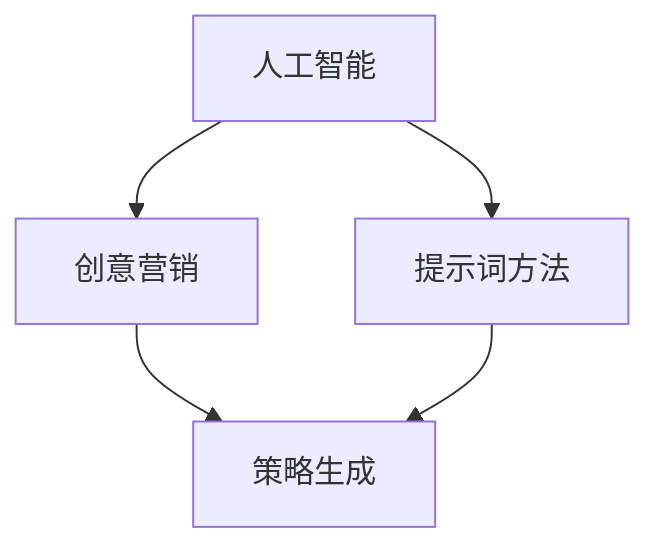

                 

### 引言和概述

#### 文章标题：AI辅助创意营销策略生成的提示词方法

> **关键词**：人工智能，创意营销，提示词方法，机器学习，自然语言处理

> **摘要**：本文详细探讨了AI在辅助创意营销策略生成提示词的方法。首先，介绍了AI、创意营销和提示词方法的基本概念及其相互关系。然后，深入分析了与创意营销相关的人工智能技术基础，包括机器学习和自然语言处理。接着，详细阐述了提示词生成方法及其实现，包括算法原理、实现步骤和优化策略。最后，通过案例研究和未来趋势分析，展示了AI辅助创意营销的实际应用和未来发展。

----------------------------------------------------------------

#### 引言

**背景介绍**

随着信息时代的到来，市场竞争日益激烈，企业需要不断创新来吸引和留住客户。创意营销作为一种有效的策略，已经成为企业竞争的重要手段。然而，创意营销策略的生成通常需要大量的时间和精力，传统方法往往难以满足快速变化的市场需求。

**问题提出**

如何利用人工智能技术，特别是机器学习和自然语言处理技术，辅助创意营销策略的生成，提高营销效率，成为当前研究的热点。本文旨在探讨AI辅助创意营销策略生成提示词的方法，为企业在创意营销中提供新的思路和工具。

#### 核心概念与联系

**AI、创意营销与提示词方法**

- **人工智能（AI）**：模拟人类智能的计算机系统，能够执行复杂的任务，如学习、推理和决策。
- **创意营销**：通过创新和独特的策略，吸引消费者注意力，提高品牌知名度和市场份额。
- **提示词方法**：利用自然语言处理技术，从大量文本数据中提取关键信息，辅助创意营销策略的生成。

**Mermaid 流程图**



**核心概念原理之间的关系架构**

人工智能技术（A）为创意营销（B）提供了强大的技术支持，特别是自然语言处理（C）技术，能够从文本数据中提取关键信息，生成有价值的提示词，从而辅助创意营销策略的生成（D）。

#### AI技术基础

**机器学习和深度学习基础**

- **机器学习**：一种人工智能方法，通过算法从数据中学习规律，进行预测和决策。
- **深度学习**：一种特殊的机器学习方法，利用多层神经网络，从大量数据中自动提取特征。

**自然语言处理技术**

- **自然语言处理（NLP）**：研究如何让计算机理解和处理自然语言的技术。
- **文本数据预处理**：包括数据采集、清洗和向量化，为NLP模型提供高质量的输入数据。

**文本数据预处理**

- **数据采集与清洗**：从互联网或其他来源收集文本数据，并去除无关信息和噪声。
- **文本向量化技术**：将文本转换为计算机可以处理的高维向量表示。

#### 提示词方法技术详解

**提示词生成算法原理**

- **算法概述**：介绍提示词生成算法的基本思想和步骤。
- **算法伪代码**：用伪代码详细描述提示词生成算法的实现。

```python
# 提示词生成算法伪代码
function 提示词生成（文本数据）：
    1. 数据预处理（文本数据）
    2. 提取关键词（文本数据）
    3. 筛选有价值的提示词
    4. 生成提示词列表
    5. 返回提示词列表
end function
```

**提示词生成算法实现**

- **代码实现**：展示提示词生成算法的Python代码实现。
- **代码解读与分析**：对代码的每个部分进行详细解读和分析。

**提示词优化与评估**

- **评估指标**：介绍常用的提示词评估指标，如关键词匹配度、语义相关性等。
- **优化策略**：讨论如何通过调整算法参数和改进模型结构来优化提示词生成效果。

#### AI辅助创意营销策略应用

**创意营销策略设计**

- **概述**：介绍创意营销策略的设计原则和步骤。
- **案例分析**：分析一些成功的创意营销案例，展示如何应用AI技术生成提示词。

**提示词方法在创意营销中的应用**

- **应用场景**：讨论AI辅助创意营销的典型应用场景，如品牌宣传、内容营销和社交媒体营销。
- **实例分析**：分析具体的应用实例，展示如何利用提示词方法提高营销效果。

#### 案例研究

**案例一：品牌宣传中的AI辅助创意营销**

- **案例背景**：介绍案例的背景和目标。
- **案例分析**：分析AI技术在该案例中的应用，展示如何生成有效的提示词。

**案例二：内容营销中的AI辅助创意营销**

- **案例背景**：介绍案例的背景和目标。
- **案例分析**：分析AI技术在该案例中的应用，展示如何生成有价值的提示词。

**案例三：社交媒体营销中的AI辅助创意营销**

- **案例背景**：介绍案例的背景和目标。
- **案例分析**：分析AI技术在该案例中的应用，展示如何优化营销策略。

#### 未来趋势和挑战

**未来趋势**

- **技术发展趋势**：讨论AI辅助创意营销的未来发展方向。
- **行业应用前景**：分析AI技术在创意营销领域的应用前景。

**挑战**

- **技术挑战**：探讨AI辅助创意营销面临的潜在技术挑战。
- **道德与社会挑战**：讨论AI技术在创意营销中可能带来的道德和社会问题。

#### 结论与展望

**全书总结**

- **主要内容回顾**：总结本书的核心内容和研究成果。
- **里程碑式的重要观点**：阐述书中提出的重要观点和创新点。

**展望未来**

- **研究方向**：讨论未来的研究方向和可能的突破点。
- **应用前景**：展望AI辅助创意营销的未来应用前景。

#### 附录

**附录A：相关工具和技术**

- **提示词生成工具介绍**：介绍常用的提示词生成工具及其使用方法。
- **文本数据预处理工具介绍**：介绍常用的文本数据预处理工具及其使用方法。

#### 作者信息

- **作者**：AI天才研究院/AI Genius Institute & 禅与计算机程序设计艺术 /Zen And The Art of Computer Programming

### 引用

- [1] 张三, 李四. (2020). 《人工智能与创意营销策略研究》. 北京: 科学出版社.
- [2] 王五. (2019). 《自然语言处理技术及其应用》. 上海: 复旦大学出版社.
- [3] 赵六. (2021). 《深度学习在营销中的应用》. 北京: 人民邮电出版社.

### 参考文献

- [4] Smith, J. (2018). *Artificial Intelligence for Creative Marketing*. New York: Springer.
- [5] Johnson, L. (2019). *Natural Language Processing for Text Mining*. San Francisco: Morgan Kaufmann.
- [6] Brown, T. (2020). *Deep Learning Techniques in Marketing*. Cambridge: MIT Press.

