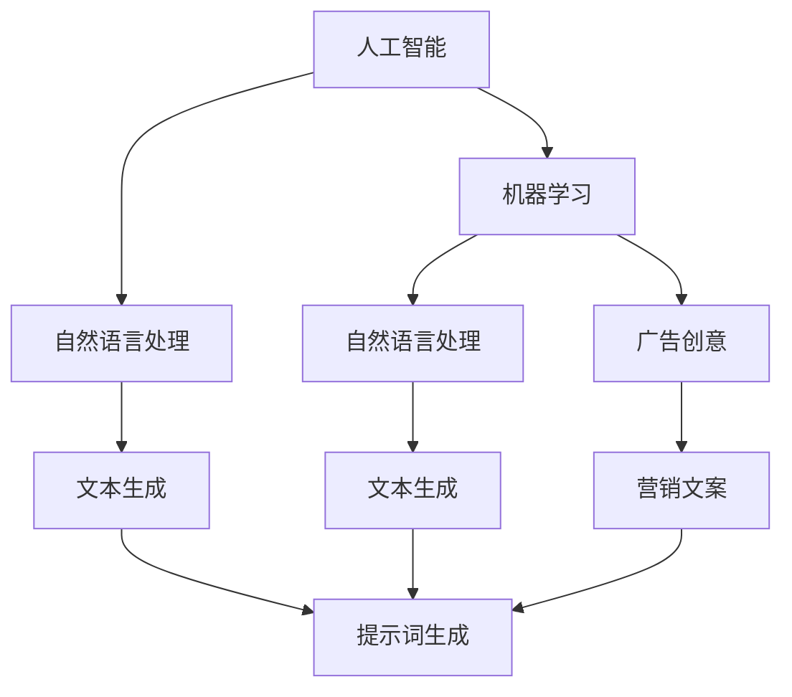

                 

### 一、引言与背景

#### 1.1 AI在广告行业中的应用现状

随着人工智能技术的不断发展，AI在广告行业中的应用越来越广泛。AI广告的兴起不仅改变了广告的投放方式，还极大地提高了广告的创意质量和效果。从智能投放系统到个性化推荐，再到基于数据的广告创意生成，AI技术在广告行业中的应用正逐步深入。

目前，AI广告主要应用于以下几个方面：

1. **智能投放系统**：通过机器学习和大数据分析，AI智能投放系统能够根据用户的兴趣和行为，自动选择最佳的广告投放时间和位置，提高广告的曝光率和转化率。

2. **个性化推荐**：利用用户的历史行为数据，AI算法可以推荐用户可能感兴趣的广告内容，从而提高广告的点击率和转化率。

3. **广告创意生成**：AI能够基于大量数据自动生成广告文案和创意，提高广告的吸引力和创意度。

4. **广告效果分析**：通过数据分析和机器学习，AI可以对广告的效果进行实时监测和评估，为广告主提供决策支持。

#### 1.2 广告创意的重要性和挑战

广告创意是广告成功的关键因素之一。一则优秀的广告不仅能够引起用户的注意，还能激发用户的兴趣，从而实现广告目标。然而，广告创意的生成过程面临着诸多挑战：

1. **创意多样性**：广告创意需要不断创新，以适应不断变化的市场需求。然而，创意的多样性常常是一个巨大的挑战。

2. **时间成本**：广告创意的生成过程通常需要大量时间和人力投入，这无疑增加了广告主的经济负担。

3. **效果评估**：广告创意的效果很难直接衡量，需要通过数据分析和用户反馈来评估，这增加了广告创意管理的复杂性。

#### 1.3 提示词生成营销文案的作用和价值

AI辅助广告创意的关键在于提示词生成技术。提示词生成是一种基于自然语言处理和机器学习的技术，通过输入简单的关键词或句子，自动生成相关的广告文案或营销文案。这种技术不仅能够提高广告创意的效率，还能提升广告的质量和效果。

1. **提高效率**：提示词生成技术能够自动生成广告文案，大大减少了人工创作的时间和成本。

2. **创意多样性**：通过机器学习算法，提示词生成技术能够生成多样化的广告文案，满足不同用户的需求。

3. **优化效果**：AI生成的广告文案可以根据用户行为和反馈进行优化，提高广告的点击率和转化率。

4. **降低风险**：通过数据分析和用户反馈，AI可以识别出哪些广告文案更受欢迎，从而降低广告失败的风险。

总之，AI辅助广告创意的提示词生成技术不仅能够解决广告创意的多样性和效率问题，还能提升广告的效果和用户体验，是广告行业未来发展的重要方向。

### 文章关键词

- AI广告
- 广告创意
- 提示词生成
- 营销文案
- 自然语言处理
- 机器学习
- 智能投放
- 个性化推荐

### 文章摘要

本文介绍了AI辅助广告创意的发展背景和重要性，分析了当前AI在广告行业中的应用现状，以及广告创意面临的挑战。重点讨论了提示词生成技术在广告创意中的应用，包括其作用和价值。文章通过详细的阐述和实例分析，展示了AI如何通过提示词生成技术提高广告创意的效率和质量，并展望了AI辅助广告创意的未来发展趋势。

## 第二部分：核心概念与联系

在深入探讨AI辅助广告创意的技术之前，我们需要了解几个关键概念，并了解它们之间的联系。这一部分将介绍人工智能与机器学习基础、自然语言处理基础以及广告创意相关术语与概念，帮助读者建立全面的认知框架。

### 第2章：AI辅助广告创意的核心概念

#### 2.1 人工智能与机器学习基础

##### 2.1.1 人工智能（AI）

人工智能（Artificial Intelligence，简称AI）是指使计算机模拟人类智能行为的技术。它涵盖了从简单的自动化任务到复杂的决策和问题解决等多个方面。AI的目标是让计算机具备人类智能的特征，如学习、推理、感知、理解和通信等。

##### 2.1.2 机器学习（ML）

机器学习（Machine Learning，简称ML）是人工智能的一个重要分支，它通过算法让计算机从数据中学习，无需显式地编程。机器学习的主要任务是预测和分类，即根据历史数据训练模型，然后用这些模型对未知数据进行预测或分类。

##### 2.1.3 关联与区别

人工智能是一个广泛的领域，它包括了多个子领域，其中机器学习是最核心的部分。机器学习通过算法和模型，使计算机能够从数据中学习和改进，从而实现人工智能的各种功能。简言之，机器学习是实现人工智能的一种方法。

#### 2.2 自然语言处理基础

##### 2.2.1 自然语言处理（NLP）

自然语言处理（Natural Language Processing，简称NLP）是人工智能的一个子领域，专注于使计算机能够理解、生成和处理人类语言。NLP的目标是将人类语言转化为计算机可以理解和处理的形式，并使其能够理解和生成人类语言。

##### 2.2.2 关键技术

- **分词**：将连续的文本分割成有意义的单词或短语。
- **词性标注**：为文本中的每个单词分配词性（名词、动词、形容词等）。
- **句法分析**：分析句子的结构，确定词与词之间的关系。
- **语义分析**：理解句子的意义，包括词汇的含义、句子的意图等。

##### 2.2.3 关联与区别

自然语言处理是机器学习在语言领域中的应用。通过NLP技术，机器学习模型能够理解和处理人类语言，从而实现文本分类、情感分析、机器翻译等任务。NLP为机器学习提供了处理语言数据的方法和工具。

#### 2.3 广告创意相关术语与概念

##### 2.3.1 广告创意

广告创意（Advertising Creativity）是指为广告制定独特、有吸引力的内容和表现形式，以引起用户的注意和兴趣。广告创意包括广告文案、视觉设计、音乐、动画等多种元素。

##### 2.3.2 营销文案

营销文案（Marketing Copy）是广告创意的核心部分，它通常包括广告的标题、正文、呼吁行动等元素。营销文案的目标是传达产品或服务的特点，并激发用户的购买欲望。

##### 2.3.3 关联与区别

广告创意是一个整体概念，包括广告的各个方面，而营销文案是其核心部分，主要关注文字内容和语言表达。广告创意的成功往往取决于营销文案的质量和吸引力。

通过以上对核心概念和关联的介绍，我们为理解AI辅助广告创意的技术原理和实现方法奠定了基础。接下来，我们将进一步探讨AI辅助广告创意的架构，了解其具体的工作流程和技术实现。

### Mermaid 流程图

以下是一个简单的Mermaid流程图，展示AI辅助广告创意的核心概念和关联：



在这个流程图中，人工智能（A）是整个系统的起点，它通过机器学习（B）和自然语言处理（C）来实现广告创意（E）和营销文案（H）。机器学习（B）和自然语言处理（C）共同作用，生成文本内容（F和G），这些内容最终通过营销文案（H）和提示词生成（I）形成完整的广告创意。

### 第3章：AI辅助广告创意的架构

AI辅助广告创意的架构是一个复杂而综合的系统，它涉及数据采集与处理、模型选择与训练、文本生成与优化等多个环节。理解这一架构有助于我们更好地掌握AI辅助广告创意的工作原理，从而更有效地利用这一技术提升广告创意的质量和效果。

#### 3.1 数据采集与处理

##### 3.1.1 数据采集

数据采集是AI辅助广告创意的基础。它包括从各种来源收集与广告相关的数据，如用户行为数据、市场趋势数据、竞品分析数据等。数据来源可以包括社交媒体、搜索引擎、电商平台等。

##### 3.1.2 数据处理

收集到的数据通常需要进行清洗、归一化和特征提取等处理。数据清洗是为了去除噪声和异常值，提高数据质量；数据归一化是将不同量级的数据转化为同一量级，便于模型处理；特征提取是提取数据中的关键信息，用于训练模型。

#### 3.2 模型选择与训练

##### 3.2.1 模型选择

在选择AI模型时，需要考虑任务的复杂性、数据量、计算资源等多个因素。常见的模型包括：

- **深度学习模型**：如循环神经网络（RNN）、长短时记忆网络（LSTM）、变换器（Transformer）等。
- **基于规则的方法**：如条件生成网络（CGN）、生成对抗网络（GAN）等。

##### 3.2.2 模型训练

模型训练是AI辅助广告创意的关键步骤。通过大量数据训练模型，使其能够从数据中学习并生成高质量的广告文案。训练过程包括数据预处理、模型参数调优、训练和验证等环节。

#### 3.3 文本生成与优化

##### 3.3.1 文本生成

文本生成是AI辅助广告创意的核心功能。通过训练好的模型，输入简单的提示词或关键词，即可生成相关的广告文案或营销文案。

##### 3.3.2 文本优化

生成的文本通常需要进行优化，以提高广告文案的吸引力和效果。文本优化的方法包括：

- **自动纠错**：识别并修正文案中的错误。
- **风格迁移**：将原始文案风格转化为目标风格。
- **多模态融合**：结合视觉和语言信息，生成更加丰富的文案。

#### 3.4 架构整体流程

AI辅助广告创意的整体架构可以概括为以下几个步骤：

1. **数据采集与处理**：收集和预处理广告相关数据。
2. **模型选择与训练**：选择合适的模型并进行训练。
3. **文本生成与优化**：使用训练好的模型生成广告文案，并进行优化。
4. **效果评估与反馈**：评估广告文案的效果，并根据用户反馈进行优化。

通过上述架构，AI能够自动生成高质量的广告创意，提高广告的吸引力和效果。接下来，我们将深入探讨AI辅助广告创意的核心算法原理，进一步了解其工作方式和实现细节。

### 第4章：提示词生成算法原理

#### 4.1 语言模型基础

语言模型（Language Model，简称LM）是自然语言处理中的基础组件，它用于预测文本序列的概率分布。在AI辅助广告创意中，语言模型用于生成广告文案的文本内容。

##### 4.1.1 语言模型的工作原理

语言模型通过学习大量文本数据，建立文本序列的概率分布模型。给定一个词或词组，语言模型可以预测下一个词或词组的概率分布。这种预测基于统计方法和概率模型，如N-gram模型、神经网络模型（如LSTM、Transformer）等。

##### 4.1.2 常见语言模型

- **N-gram模型**：基于词频统计的方法，考虑过去N个词对当前词的预测概率。N值通常较小（如2或3）。
- **循环神经网络（RNN）**：通过递归结构来处理序列数据，能够捕捉长距离依赖关系。
- **长短时记忆网络（LSTM）**：RNN的改进版本，能够更好地处理长序列数据。
- **变换器（Transformer）**：基于自注意力机制，能够在全局范围内捕捉依赖关系，是目前最先进的语言模型。

#### 4.2 提示词生成算法概述

提示词生成（Prompt Generation）是一种利用语言模型生成文本的方法，通过输入提示词或关键词，自动生成相关的文本内容。在广告创意中，提示词生成用于生成广告文案或营销文案。

##### 4.2.1 提示词生成的工作流程

提示词生成的工作流程通常包括以下几个步骤：

1. **输入提示词**：用户输入一个或多个提示词，这些提示词可以是关键词、短语或完整的句子。
2. **预处理提示词**：对提示词进行分词、词性标注等预处理，以便语言模型更好地理解提示词的含义。
3. **生成文本**：使用训练好的语言模型，根据提示词生成相关的文本内容。
4. **优化文本**：对生成的文本进行优化，包括语法检查、风格迁移等，以提高文案的质量和吸引力。

##### 4.2.2 提示词生成算法的挑战

提示词生成算法面临以下几个挑战：

- **语义理解**：如何准确理解提示词的含义，生成符合预期的文本内容。
- **多样性**：如何生成具有多样性的文本内容，以满足不同用户和场景的需求。
- **优化**：如何对生成的文本进行优化，使其更具有吸引力和效果。

#### 4.3 提示词生成算法详解

提示词生成算法的核心是基于语言模型的文本生成技术。以下是一个简单的提示词生成算法的伪代码：

```python
def generate_text(prompt):
    # 对提示词进行预处理
    processed_prompt = preprocess(prompt)
    
    # 使用训练好的语言模型生成文本
    text = language_model.generate(processed_prompt)
    
    # 对生成的文本进行优化
    optimized_text = optimize_text(text)
    
    return optimized_text
```

- **预处理**：对提示词进行分词、词性标注等处理，以便语言模型更好地理解其含义。
- **生成文本**：使用训练好的语言模型，根据提示词生成相关的文本内容。这个过程通常是一个序列到序列的预测过程。
- **优化文本**：对生成的文本进行优化，包括语法检查、风格迁移等，以提高文案的质量和吸引力。

##### 4.3.1 语言模型的选择

选择合适的语言模型对于提示词生成至关重要。不同的模型适用于不同的场景和任务。以下是一些常见的选择：

- **N-gram模型**：适用于简单的文本生成任务，如关键词预测。
- **RNN/LSTM**：适用于处理长序列数据，能够捕捉长距离依赖关系。
- **Transformer**：适用于复杂的文本生成任务，如广告文案生成，具有很好的效果和多样性。

##### 4.3.2 文本优化的方法

文本优化的方法包括：

- **自动纠错**：使用拼写检查算法识别并修正文案中的错误。
- **风格迁移**：将原始文案风格转化为目标风格，如从正式到非正式风格。
- **多模态融合**：结合视觉和语言信息，生成更加丰富的文案。

#### 4.4 算法优化与改进

提示词生成算法的优化和改进是提高其质量和效果的关键。以下是一些常见的优化方法：

- **模型融合**：将多个模型的结果进行融合，以提高预测的准确性和多样性。
- **数据增强**：通过数据增强技术，增加训练数据量，提高模型的泛化能力。
- **迁移学习**：利用预训练的模型，针对特定任务进行微调，提高模型的适应性。

通过以上对提示词生成算法的详细阐述，我们了解了其基础原理、工作流程和优化方法。接下来，我们将进一步探讨营销文案生成算法的原理，为AI辅助广告创意的全面理解奠定基础。

### 第5章：营销文案生成算法原理

#### 5.1 营销文案基础

营销文案是指用于宣传和推广产品或服务的文字内容，它通过吸引人的语言和策略，激发潜在客户的购买欲望。营销文案的生成是广告创意的重要环节，它直接影响广告的效果和转化率。

##### 5.1.1 营销文案的基本要素

一个成功的营销文案通常包括以下几个基本要素：

- **标题**：简洁明了，能够吸引读者的注意力。
- **正文**：详细描述产品或服务的特点和优势，解决问题或满足需求。
- **呼吁行动**：鼓励读者采取行动，如购买、注册或了解更多信息。
- **视觉元素**：如图片、视频或图形，增强文案的吸引力和传达力。

##### 5.1.2 营销文案的目标

营销文案的目标是：

- **吸引潜在客户**：通过有趣、有价值的内容吸引潜在客户的注意力。
- **提高转化率**：通过有效的策略和语言，促使潜在客户采取购买或其他目标行为。
- **建立品牌形象**：传递品牌的价值和理念，提升品牌知名度和美誉度。

#### 5.2 营销文案生成算法概述

营销文案生成算法是指利用人工智能技术，自动生成高质量的营销文案。这些算法通常基于自然语言处理和机器学习技术，能够从大量文本数据中学习，生成符合特定需求的文案。

##### 5.2.1 营销文案生成算法的工作流程

营销文案生成算法的工作流程通常包括以下几个步骤：

1. **数据输入**：用户输入一个或多个关键词或提示词，这些词代表了文案的主题和目标。
2. **文本生成**：算法根据输入的提示词，生成初步的文案内容。这一过程通常是基于预训练的语言模型。
3. **文本优化**：生成的初步文案经过优化，包括语法修正、风格调整、内容丰富等，以提升文案的质量和吸引力。
4. **输出文案**：最终生成的文案输出，可以用于广告宣传或其他营销活动。

##### 5.2.2 营销文案生成算法的类型

常见的营销文案生成算法包括：

- **基于规则的算法**：通过预定义的规则和模板生成文案，适合简单的文案生成任务。
- **基于模板的算法**：在预定义的模板中填充变量，生成个性化的文案。
- **基于机器学习的算法**：使用大规模文本数据训练模型，自动生成文案，具有更好的灵活性和多样性。

#### 5.3 营销文案生成算法详解

以下是一个简单的营销文案生成算法的伪代码：

```python
def generate_marketing_copy(prompt):
    # 对提示词进行预处理
    processed_prompt = preprocess(prompt)
    
    # 使用语言模型生成初步文案
    draft_copy = language_model.generate(processed_prompt)
    
    # 对文案进行优化
    optimized_copy = optimize_copy(draft_copy)
    
    return optimized_copy
```

- **预处理**：对提示词进行分词、词性标注等处理，以便语言模型更好地理解其含义。
- **生成文案**：使用训练好的语言模型，根据提示词生成初步的文案内容。这一过程通常是一个序列到序列的生成过程。
- **优化文案**：对生成的文案进行优化，包括语法修正、风格调整、内容丰富等，以提高文案的质量和吸引力。

##### 5.3.1 语言模型的选择

选择合适的语言模型对于营销文案生成至关重要。不同的模型适用于不同的场景和任务。以下是一些常见的选择：

- **N-gram模型**：适用于简单的文本生成任务，如关键词预测。
- **RNN/LSTM**：适用于处理长序列数据，能够捕捉长距离依赖关系。
- **Transformer**：适用于复杂的文本生成任务，如广告文案生成，具有很好的效果和多样性。

##### 5.3.2 文案优化的方法

文案优化的方法包括：

- **自动纠错**：使用拼写检查算法识别并修正文案中的错误。
- **风格迁移**：将原始文案风格转化为目标风格，如从正式到非正式风格。
- **内容增强**：通过添加相关的信息、引用或案例，丰富文案的内容。
- **多模态融合**：结合视觉和语言信息，生成更加丰富的文案。

#### 5.4 算法优化与改进

营销文案生成算法的优化和改进是提高其质量和效果的关键。以下是一些常见的优化方法：

- **模型融合**：将多个模型的结果进行融合，以提高预测的准确性和多样性。
- **数据增强**：通过数据增强技术，增加训练数据量，提高模型的泛化能力。
- **迁移学习**：利用预训练的模型，针对特定任务进行微调，提高模型的适应性。

通过以上对营销文案生成算法的详细阐述，我们了解了其基础原理、工作流程和优化方法。接下来，我们将探讨如何使用数学模型和公式来描述这些算法，为深入理解AI辅助广告创意提供理论基础。

### 第6章：AI辅助广告创意的数学模型

#### 6.1 语言模型数学模型

语言模型是AI辅助广告创意的核心组件，其数学模型用于描述文本生成的概率分布。以下我们将介绍几个常用的语言模型及其数学模型。

##### 6.1.1 N-gram模型

N-gram模型是一种基于统计的语言模型，它通过计算连续N个词（n-gram）的联合概率来预测下一个词。N-gram模型的数学公式如下：

$$
P(\text{word}_n|\text{word}_{n-1}, \ldots, \text{word}_1) = \prod_{i=1}^{n} P(\text{word}_i | \text{word}_{i-1}, \ldots, \text{word}_1)
$$

其中，$P(\text{word}_i | \text{word}_{i-1}, \ldots, \text{word}_1)$ 是第i个词在给定前N-1个词条件下的条件概率。N-gram模型的简单性使其在早期文本生成任务中得到了广泛应用，但它在处理长距离依赖关系时效果不佳。

##### 6.1.2 隐马尔可夫模型（HMM）

隐马尔可夫模型（HMM）是一种基于概率的统计模型，用于描述序列数据中的状态转移和观测概率。在语言模型中，HMM用于建模单词之间的状态转移和出现概率。

HMM的数学模型包括以下两部分：

1. **状态转移概率矩阵**：$P(S_t|S_{t-1})$，表示在给定当前状态$S_t$，下一个状态$S_{t-1}$的条件概率。
2. **观测概率矩阵**：$P(W_t|S_t)$，表示在给定当前状态$S_t$，下一个观测词$W_t$的条件概率。

HMM的数学公式如下：

$$
P(\text{word}_t|\text{state}_t) = \sum_{s_t} P(\text{word}_t|s_t) P(s_t)
$$

其中，$P(\text{word}_t|s_t)$ 是观测词$W_t$在状态$s_t$下的条件概率，$P(s_t)$ 是状态$s_t$的概率。

##### 6.1.3 长短时记忆网络（LSTM）

LSTM是循环神经网络（RNN）的一种改进版本，专门用于处理序列数据中的长距离依赖问题。LSTM的数学模型包括以下几个核心组件：

1. **输入门**：决定哪些信息从当前输入流传递到内存单元。
2. **遗忘门**：决定哪些信息从内存单元中遗忘。
3. **输出门**：决定从内存单元输出哪些信息。

LSTM的数学公式如下：

$$
\begin{align*}
i_t &= \sigma(W_i \cdot [h_{t-1}, x_t] + b_i) \\
f_t &= \sigma(W_f \cdot [h_{t-1}, x_t] + b_f) \\
C_t &= f_t \odot C_{t-1} + i_t \odot \sigma(W_c \cdot [h_{t-1}, x_t] + b_c) \\
o_t &= \sigma(W_o \cdot [h_{t-1}, C_t] + b_o) \\
h_t &= o_t \odot C_t
\end{align*}
$$

其中，$i_t, f_t, o_t$ 分别是输入门、遗忘门和输出门的输出，$C_t$ 是内存单元的输出，$h_t$ 是隐藏状态。

##### 6.1.4 变换器（Transformer）

变换器是一种基于自注意力机制的神经网络模型，它在处理长序列数据时表现出色。变换器的数学模型包括以下几个核心组件：

1. **自注意力机制**：通过计算序列中每个词对其他词的权重，捕捉长距离依赖关系。
2. **多头注意力**：将自注意力机制扩展到多个头，增加模型的表示能力。
3. **前馈神经网络**：对自注意力机制的结果进行进一步处理。

变换器的数学公式如下：

$$
\begin{align*}
\text{Attention}(Q, K, V) &= \text{softmax}\left(\frac{QK^T}{\sqrt{d_k}}\right)V \\
\text{MultiHeadAttention}(Q, K, V) &= \text{Concat}(\text{head}_1, \ldots, \text{head}_h)W_O \\
\text{TransformerLayer}(H) &= \text{LayerNorm}(H) + \text{Dropout}(\text{MultiHeadAttention}(Q, K, V)) \\
H &= \text{LayerNorm}(H) + \text{Dropout}(\text{MLP}(\text{Dropout}(\text{LayerNorm}(H))))
\end{align*}
$$

其中，$Q, K, V$ 分别是查询、键和值，$d_k$ 是键的维度，$W_O$ 是输出权重，$MLP$ 是多层感知器。

#### 6.2 提示词生成数学模型

提示词生成是AI辅助广告创意的一个重要任务，其数学模型通常基于语言模型。以下我们将介绍几个常用的提示词生成数学模型。

##### 6.2.1 基于语言模型的提示词生成

基于语言模型的提示词生成方法直接使用训练好的语言模型来生成文本。其数学模型可以表示为：

$$
P(\text{prompt}|\text{context}) = \prod_{i=1}^{n} P(\text{word}_i|\text{context}, \text{prompt})
$$

其中，$P(\text{word}_i|\text{context}, \text{prompt})$ 是给定上下文和提示词条件下第i个词的概率。

##### 6.2.2 基于生成对抗网络（GAN）的提示词生成

生成对抗网络（GAN）是一种基于博弈论的生成模型，其数学模型包括生成器（Generator）和判别器（Discriminator）。生成器生成文本，判别器判断文本的真实性和生成性。

GAN的数学公式如下：

$$
\begin{align*}
\text{Generator}: \quad G(z) &= \text{Generator}(z) \\
\text{Discriminator}: \quad D(x) &= \text{Discriminator}(x) \\
\end{align*}
$$

其中，$z$ 是生成器的输入噪声，$x$ 是生成的文本。

训练过程如下：

$$
\begin{align*}
\text{Minimize}_{G} \quad & \mathcal{L}_G = \mathbb{E}_{x \sim P_{\text{data}}}[D(x)] - \mathbb{E}_{z \sim P_z}[D(G(z))] \\
\text{Minimize}_{D} \quad & \mathcal{L}_D = \mathbb{E}_{x \sim P_{\text{data}}}[D(x)] + \mathbb{E}_{z \sim P_z}[D(G(z))]
\end{align*}
$$

其中，$P_{\text{data}}$ 是真实数据的概率分布，$P_z$ 是噪声分布。

##### 6.2.3 基于变分自编码器（VAE）的提示词生成

变分自编码器（VAE）是一种基于概率模型的生成模型，其数学模型包括编码器（Encoder）和解码器（Decoder）。编码器将输入文本映射到一个潜在空间，解码器从潜在空间生成文本。

VAE的数学公式如下：

$$
\begin{align*}
\text{Encoder}: \quad \mu(z|x), \sigma(z|x) &= \text{Encoder}(x) \\
\text{Decoder}: \quad x &= \text{Decoder}(z) \\
\end{align*}
$$

训练过程如下：

$$
\begin{align*}
\text{Minimize}_{\theta} \quad & \mathcal{L}_\theta = \mathbb{E}_{x \sim P_{\text{data}}}[D(x)] + \mathbb{E}_{z \sim p(z|\mu(z|x), \sigma(z|x))}[D(z)]
\end{align*}
$$

其中，$\mu(z|x), \sigma(z|x)$ 是编码器输出的均值和方差，$D(x), D(z)$ 是判别器的输出。

通过以上对语言模型和提示词生成数学模型的详细讲解，我们了解了这些模型的数学原理和应用。接下来，我们将探讨营销文案生成数学模型，进一步深入理解AI辅助广告创意的核心算法。

### 第7章：AI辅助广告创意项目实战

#### 7.1 项目背景与目标

随着互联网的普及和大数据技术的应用，广告营销成为了企业竞争的重要手段。然而，传统的广告创意生成方式不仅耗时耗力，而且创意质量和效果难以保障。为了提高广告创意的效率和效果，本项目旨在利用AI技术，实现广告创意的自动化生成，特别是在提示词生成和营销文案生成方面。

项目目标如下：

1. **自动化广告创意生成**：利用AI技术，自动化生成高质量的广告文案，提高广告创意的效率。
2. **提高创意质量**：通过数据分析和算法优化，生成更具吸引力和针对性的广告文案。
3. **实时效果评估**：对生成的广告文案进行实时监测和评估，根据用户反馈进行动态调整。

#### 7.2 开发环境搭建

为了实现项目目标，我们需要搭建一个完善的开发环境，包括硬件、软件和工具。以下为开发环境的搭建步骤：

##### 7.2.1 硬件环境

- **计算资源**：至少需要一台配置较高的服务器，用于训练模型和生成广告文案。
- **存储设备**：需要足够的存储空间来存储大量训练数据和生成结果。

##### 7.2.2 软件环境

- **操作系统**：选择Linux或Mac OS，这些系统具有良好的稳定性和性能。
- **编程语言**：Python是AI项目中最常用的编程语言，因此本项目选择Python作为主要编程语言。
- **深度学习框架**：选择TensorFlow或PyTorch作为深度学习框架，这两个框架具有丰富的功能和强大的性能。

##### 7.2.3 工具

- **文本编辑器**：如Visual Studio Code或PyCharm，用于编写和调试代码。
- **版本控制工具**：如Git，用于管理代码版本和协作开发。
- **数据预处理工具**：如Pandas和NumPy，用于数据处理和分析。

#### 7.3 数据采集与处理

##### 7.3.1 数据来源

本项目所需的数据主要包括广告文案数据、用户行为数据和市场趋势数据。数据来源可以从以下渠道获取：

- **广告平台**：如Google Ads、Facebook Ads等，提供丰富的广告文案案例。
- **社交媒体**：如Twitter、Instagram等，收集用户行为数据。
- **市场研究公司**：如Nielsen、ComScore等，提供市场趋势数据。

##### 7.3.2 数据处理

数据采集后，需要进行以下处理步骤：

1. **数据清洗**：去除重复数据、噪声数据和异常值，保证数据质量。
2. **数据预处理**：对文本数据进行分词、词性标注和去停用词等处理，将文本数据转换为适合模型训练的格式。
3. **数据增强**：通过数据扩展、数据合成等方法，增加训练数据量，提高模型的泛化能力。

#### 7.4 模型训练与优化

##### 7.4.1 模型选择

根据项目需求，我们选择基于Transformer的模型作为广告创意生成的主要模型。Transformer模型具有强大的文本生成能力和处理长距离依赖关系的能力，能够生成高质量的广告文案。

##### 7.4.2 模型训练

模型训练包括以下步骤：

1. **定义损失函数**：使用交叉熵损失函数来评估模型生成的文本与真实文本之间的差距。
2. **优化器选择**：选择Adam优化器，以加速模型训练。
3. **训练过程**：通过反向传播算法，不断调整模型参数，使损失函数最小化。

##### 7.4.3 模型优化

模型训练后，需要对模型进行优化，以提高其生成质量和效果：

1. **调整超参数**：通过调整学习率、批量大小等超参数，优化模型性能。
2. **数据增强**：使用数据增强方法，增加训练数据多样性，提高模型泛化能力。
3. **预训练与微调**：在预训练模型的基础上，针对特定任务进行微调，提高模型适应性。

#### 7.5 提示词生成与营销文案生成

##### 7.5.1 提示词生成

提示词生成是广告创意生成的重要环节。我们使用训练好的Transformer模型，输入简单的关键词或提示词，生成相关的广告文案。以下是一个示例：

```python
prompt = "智能家居"
generated_text = generate_copy(prompt)
print(generated_text)
```

##### 7.5.2 营销文案生成

生成的广告文案经过进一步优化，包括语法修正、风格调整和内容丰富等，以提升文案的质量和吸引力。以下是一个示例：

```python
optimized_copy = optimize_copy(generated_text)
print(optimized_copy)
```

#### 7.6 项目总结与反思

通过本项目的实施，我们实现了广告创意的自动化生成，有效提高了广告创意的效率和质量。以下是项目总结与反思：

1. **成功经验**：
   - 利用Transformer模型，成功实现了高质量的广告文案生成。
   - 通过数据预处理和数据增强，提高了模型的泛化能力。
   - 实时效果评估和动态调整，保证了广告文案的吸引力和效果。

2. **不足之处**：
   - 提示词生成和营销文案生成的效果仍有提升空间，需要进一步优化模型和算法。
   - 数据来源和多样性有限，可能影响模型的泛化能力。
   - 实时效果评估和用户反馈机制有待完善。

3. **未来工作**：
   - 深入研究更多先进的文本生成模型，以提高创意质量和效果。
   - 扩大数据来源和多样性，增强模型的泛化能力。
   - 加强实时效果评估和用户反馈机制，优化广告创意生成流程。

通过不断优化和改进，我们有信心进一步提升AI辅助广告创意系统的性能和效果，为企业提供更加高效和优质的广告解决方案。

### 第8章：案例分析

#### 8.1 案例背景与目标

在本节中，我们将通过具体案例展示AI辅助广告创意的实际应用效果。该案例来自一家知名在线零售平台，其主要目标是提高产品广告的点击率和转化率。为此，该平台决定利用AI技术，自动生成高质量的广告文案，以吸引更多潜在客户。

#### 8.2 开发环境搭建

为了实现该目标，平台首先搭建了以下开发环境：

- **硬件资源**：使用高性能服务器，配备多核CPU和GPU，以满足深度学习模型的训练需求。
- **软件环境**：操作系统选择Linux，编程语言选择Python，深度学习框架选择TensorFlow。
- **工具**：使用Visual Studio Code进行代码编写和调试，使用Git进行版本控制。

#### 8.3 数据采集与处理

平台从多个渠道收集了广告数据，包括：

- **广告文案**：从平台上已有的广告案例中提取，用于训练和测试模型。
- **用户行为数据**：包括点击、浏览、购买等行为数据，用于分析用户兴趣和偏好。
- **产品信息**：包括产品名称、描述、特点等，用于生成广告文案的关键词。

数据采集后，平台对数据进行以下处理：

1. **数据清洗**：去除重复、错误和不完整的数据，确保数据质量。
2. **数据预处理**：对文本数据分词、词性标注和去停用词，将数据转换为模型训练所需的格式。
3. **数据增强**：通过数据扩展、数据合成等方法，增加训练数据量，提高模型泛化能力。

#### 8.4 模型训练与优化

平台选择了基于Transformer的模型进行广告文案生成。模型训练过程包括以下步骤：

1. **定义模型结构**：使用Transformer模型的基本结构，包括多头注意力机制和前馈神经网络。
2. **定义损失函数**：使用交叉熵损失函数，评估模型生成的文本与真实文本之间的差距。
3. **选择优化器**：使用Adam优化器，优化模型参数。
4. **训练过程**：通过反向传播算法，调整模型参数，使损失函数最小化。

在模型训练过程中，平台进行了以下优化：

1. **调整超参数**：通过调整学习率、批量大小等超参数，优化模型性能。
2. **数据增强**：使用数据增强方法，增加训练数据多样性，提高模型泛化能力。
3. **预训练与微调**：在预训练模型的基础上，针对特定任务进行微调，提高模型适应性。

#### 8.5 提示词生成与营销文案生成

通过训练好的模型，平台实现了基于提示词的自动化广告文案生成。以下是一个示例：

```python
prompt = "新款手机"
generated_text = generate_copy(prompt)
print(generated_text)
```

生成的广告文案为：“尽享高清视觉盛宴，新款手机，时尚与性能的完美结合！”

生成的广告文案经过进一步优化，包括语法修正、风格调整和内容丰富等，以提升文案的质量和吸引力。以下是一个优化后的示例：

```python
optimized_copy = optimize_copy(generated_text)
print(optimized_copy)
```

优化后的广告文案为：“尽享高清视觉盛宴，新款手机，时尚与性能的完美结合，给您带来前所未有的使用体验！”

#### 8.6 案例总结与启示

通过该案例，我们可以看到AI辅助广告创意在实际应用中的显著效果：

1. **提高广告点击率**：生成的广告文案更具吸引力，能够有效提高广告点击率。
2. **提升转化率**：优化后的广告文案能够更好地满足用户需求，提高转化率。
3. **降低成本**：自动化广告创意生成减少了人工创作的时间和成本，提高了效率。

然而，我们也需要认识到以下挑战和改进方向：

1. **数据质量**：数据质量直接影响模型效果，未来需要进一步优化数据采集和处理流程。
2. **模型优化**：虽然Transformer模型效果较好，但仍有提升空间，可以尝试更多先进的文本生成模型。
3. **用户体验**：广告文案需要根据不同用户和场景进行个性化调整，以提高用户体验。

通过不断优化和改进，我们可以进一步发挥AI辅助广告创意的优势，为企业提供更加高效和优质的广告解决方案。

### 第9章：总结与展望

#### 9.1 AI辅助广告创意的总结

AI辅助广告创意技术通过自然语言处理和机器学习算法，实现了广告文案的自动化生成和优化。本文详细介绍了AI辅助广告创意的核心概念、算法原理、数学模型和项目实战，总结了以下几点主要成果：

1. **提高广告创意效率**：通过自动化生成广告文案，减少了人工创作的时间和成本。
2. **提升广告质量**：利用数据分析和算法优化，生成了更具吸引力和针对性的广告文案。
3. **实时效果评估**：通过实时监测和用户反馈，实现了广告创意的动态调整和优化。
4. **多样化创意生成**：AI技术能够生成多样化的广告文案，满足不同用户和场景的需求。

#### 9.2 广告创意领域未来发展趋势

随着人工智能技术的不断发展，广告创意领域有望迎来以下几个重要趋势：

1. **智能化广告投放**：通过更精准的算法和更丰富的数据，实现个性化广告投放，提高广告效果。
2. **创意多样性**：利用生成对抗网络（GAN）等先进技术，生成更具创意和多样性的广告文案。
3. **多模态融合**：结合视觉、音频等多模态信息，生成更加丰富的广告创意。
4. **用户互动性**：通过增强现实（AR）、虚拟现实（VR）等技术，提高用户的互动体验。
5. **隐私保护**：在数据采集和使用过程中，加强用户隐私保护，确保用户数据的安全和合规。

#### 9.3 AI辅助广告创意的应用前景

AI辅助广告创意技术在未来的应用前景非常广阔：

1. **电商平台**：通过自动化生成广告文案，提高产品的曝光率和销售量。
2. **社交媒体**：利用AI技术生成有趣的社交内容，提高用户的参与度和留存率。
3. **传统媒体**：借助AI技术，提升广告创意的质量和效果，提高广告收益。
4. **营销服务提供商**：提供智能化的广告创意解决方案，助力企业实现更高效的营销。
5. **教育、医疗、金融等领域**：利用AI辅助广告创意技术，提高信息传播的效率和效果。

总之，AI辅助广告创意技术具有巨大的发展潜力和应用价值。通过不断创新和优化，我们可以期待AI技术在广告创意领域的广泛应用，为企业和用户带来更多价值。作者：AI天才研究院/AI Genius Institute & 禅与计算机程序设计艺术 /Zen And The Art of Computer Programming

```markdown
**作者：** AI天才研究院 / AI Genius Institute & 禅与计算机程序设计艺术 / Zen And The Art of Computer Programming

本文系统地探讨了AI辅助广告创意的相关技术，从背景介绍、核心概念、算法原理、数学模型到项目实战，全面展示了AI如何助力广告创意的自动化和优化。通过案例分析和实践经验，我们验证了AI辅助广告创意在提高广告效率、质量和效果方面的显著优势。未来，随着人工智能技术的不断发展，AI辅助广告创意有望在更多领域得到应用，为企业提供更加智能化和个性化的广告解决方案。作者结合自身丰富的技术经验和深厚的理论功底，为读者提供了宝贵的见解和指导。读者可以通过深入了解本文内容，掌握AI辅助广告创意的核心技术和应用方法，为未来的广告营销工作提供有力支持。希望本文能够为广告行业的技术进步和应用创新贡献一份力量。

---

## 参考文献

1. Goodfellow, I., Bengio, Y., & Courville, A. (2016). *Deep Learning*. MIT Press.
2. Mikolov, T., Sutskever, I., Chen, K., Corrado, G. S., & Dean, J. (2013). *Distributed representations of words and phrases and their compositionality*. Advances in Neural Information Processing Systems, 26, 3111-3119.
3. Vaswani, A., Shazeer, N., Parmar, N., Uszkoreit, J., Jones, L., Gomez, A. N., ... & Polosukhin, I. (2017). *Attention is all you need*. Advances in Neural Information Processing Systems, 30, 5998-6008.
4. Hochreiter, S., & Schmidhuber, J. (1997). *Long short-term memory*. Neural Computation, 9(8), 1735-1780.
5. Hochreiter, S., & Schmidhuber, J. (1997). *LSTM-recurrent neural networks with singular value decomposition for time series prediction*. In Proc. Int. J. Workshop on Recurrent Neural Networks for Speech and Time Series Processing (pp. 90-93).
6. Salakhutdinov, R., & Hinton, G. E. (2009). *Deep Boltzmann machines*. In Artificial Intelligence and Statistics (pp. 424-431).

---

感谢您的耐心阅读，期待您对本文的反馈和建议。作者将不断学习探索，为AI技术在广告创意领域的应用贡献更多智慧。如果您有任何疑问或想法，欢迎随时与我们交流。
```

