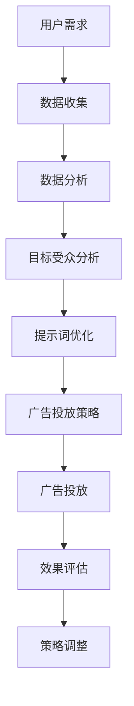

                 

为了撰写一篇《AI辅助广告投放：提示词优化目标受众》的技术博客文章，我们需要进行以下步骤：

### 1. 文章标题与关键词

首先，我们需要确定文章的标题和关键词。根据文章的主题，我们选择了以下标题：

**《AI辅助广告投放：提示词优化目标受众》**

关键词包括：

- AI广告投放
- 提示词优化
- 目标受众
- 广告投放策略
- 智能广告

### 2. 摘要

接下来是文章摘要，这部分应该简明扼要地概括文章的主要内容：

**摘要：**

本文详细探讨了AI辅助广告投放中提示词优化的关键作用。通过深入分析提示词优化原理、目标受众分析、广告投放策略等内容，本文旨在为读者提供一套完整的AI广告投放解决方案，帮助广告主更精准地触达目标受众，提高广告投放效果。文章末尾还提供了实际案例和最佳实践，以指导读者在实战中应用这些技术。

### 3. 背景介绍

在这一部分，我们将介绍AI广告投放的背景，包括：

- AI广告投放的定义和基本原理
- AI广告投放与传统广告投放的区别
- 当前AI广告投放的发展趋势和市场规模

### 4. 核心概念与联系

在这一部分，我们将介绍文章中的核心概念，并使用Mermaid流程图来展示它们之间的关系：

- 提示词：广告投放的关键字，用于定位潜在受众。
- 目标受众：广告主希望触达的用户群体。
- 广告投放策略：根据目标受众和广告效果调整广告投放的方式和内容。

### 5. 核心算法原理讲解

在这一部分，我们将详细讲解提示词优化的核心算法原理，包括：

- 常用的提示词优化算法，如协同过滤、基于模型的优化等。
- 算法的选择依据和优化策略。
- 伪代码示例，展示算法的实现过程。

### 6. 数学模型和公式

在这一部分，我们将介绍与提示词优化相关的数学模型和公式，包括：

- 相关的数学公式和推导过程。
- 公式在优化算法中的应用。
- 实际案例中的公式应用和举例说明。

### 7. 项目实战

在这一部分，我们将通过一个实际案例来展示如何进行AI广告投放：

- 开发环境搭建和工具介绍。
- 源代码详细实现和代码解读。
- 代码应用解读与分析。
- 实际案例分析和详细讲解剖析。
- 项目小结和经验总结。

### 8. 最佳实践 tips、小结、注意事项、拓展阅读

在这一部分，我们将提供一些最佳实践建议，总结文章的主要内容，并给出一些注意事项和拓展阅读资源，以帮助读者进一步学习和实践。

### 9. 作者信息

最后，我们需要在文章末尾写上作者信息：

**作者：AI天才研究院/AI Genius Institute & 禅与计算机程序设计艺术 /Zen And The Art of Computer Programming**

通过以上步骤，我们可以逐步构建一篇完整、详细、结构清晰的技术博客文章。接下来，我们可以根据这些步骤来撰写文章的每个部分。首先，让我们从文章标题、关键词和摘要开始。

